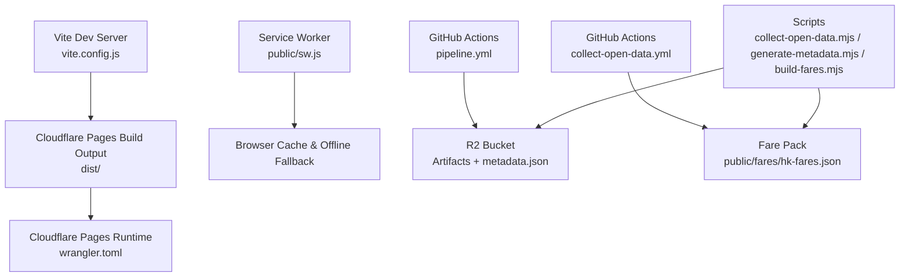
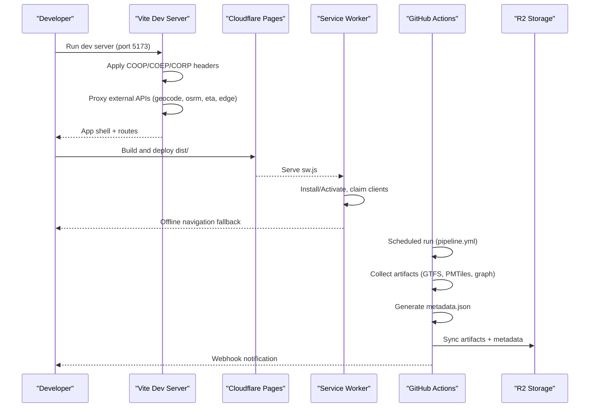
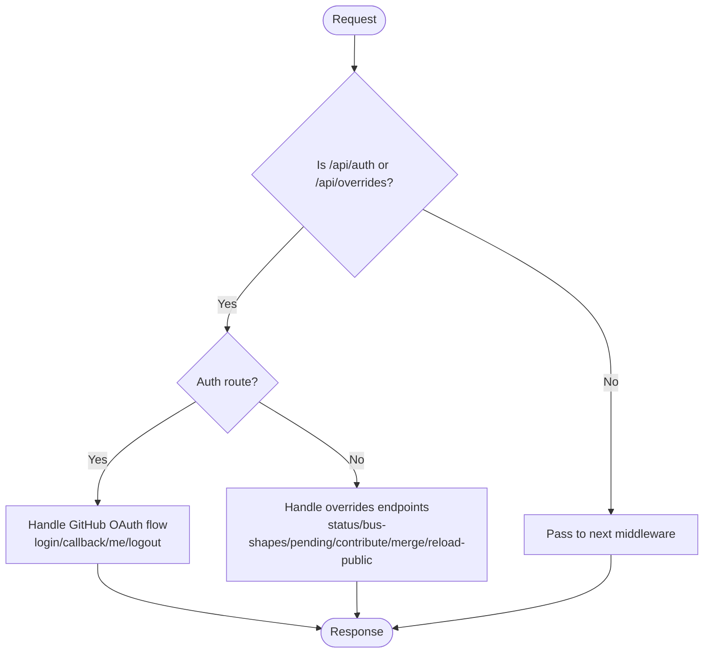
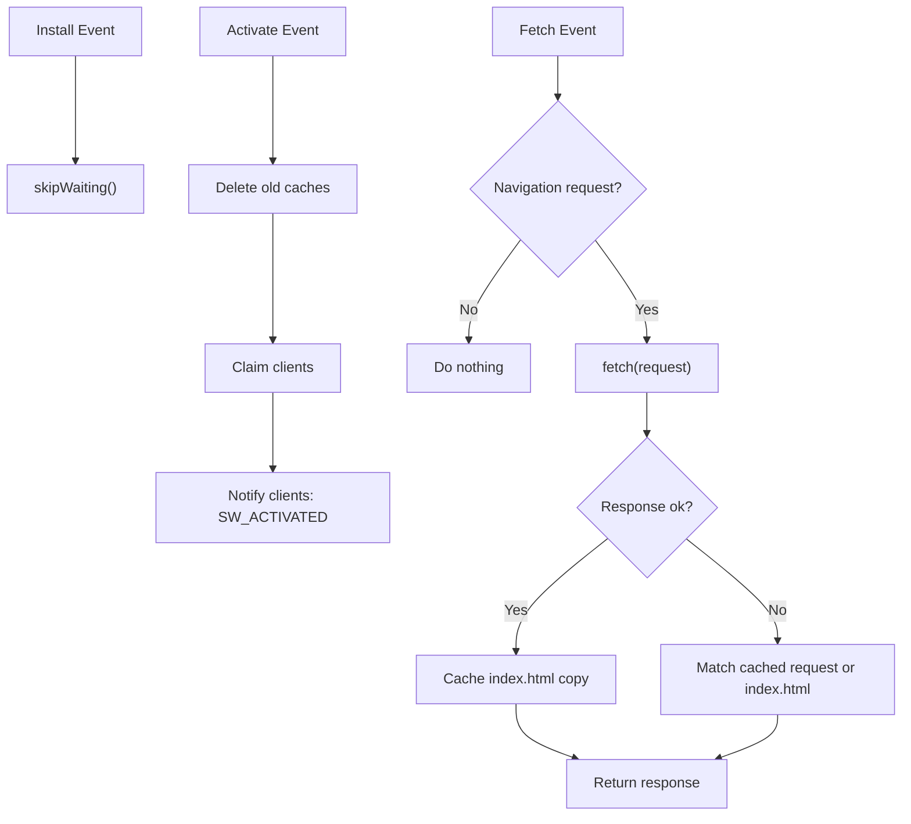
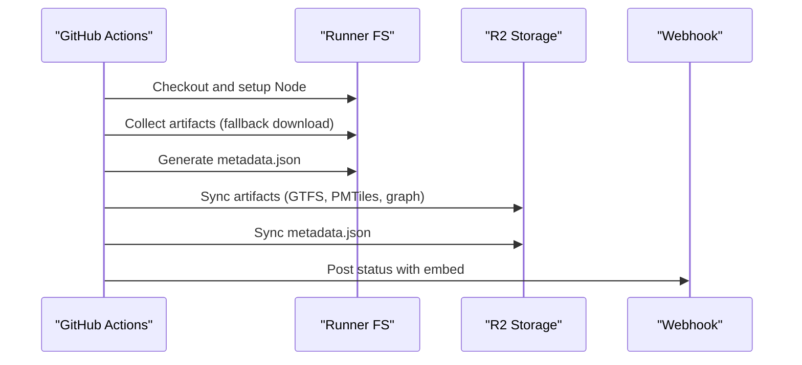
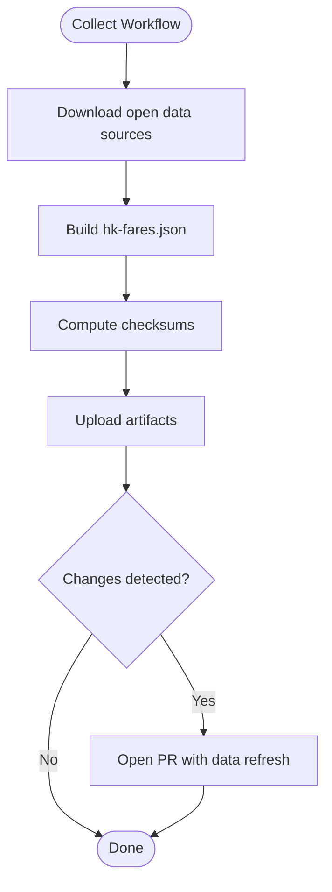
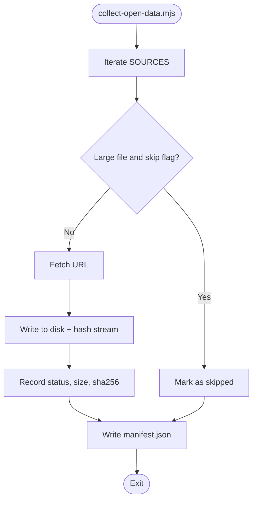
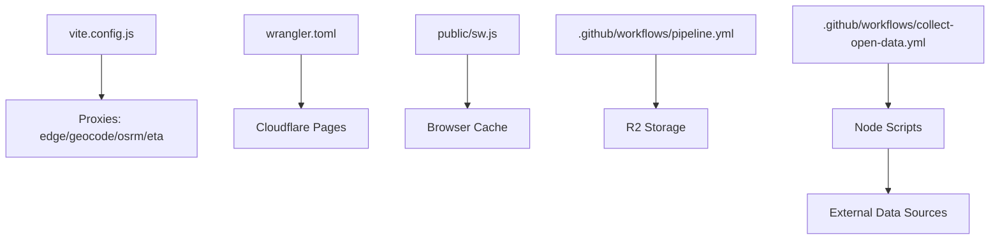

# Build and Deployment

<cite>
**Referenced Files in This Document**
- [vite.config.js](file://vite.config.js)
- [wrangler.toml](file://wrangler.toml)
- [package.json](file://package.json)
- [public/sw.js](file://public/sw.js)
- [.github/workflows/pipeline.yml](file://.github/workflows/pipeline.yml)
- [.github/workflows/collect-open-data.yml](file://.github/workflows/collect-open-data.yml)
- [scripts/collect-open-data.mjs](file://scripts/collect-open-data.mjs)
- [scripts/generate-metadata.mjs](file://scripts/generate-metadata.mjs)
- [scripts/build-fares.mjs](file://scripts/build-fares.mjs)
- [index.html](file://index.html)
</cite>

## Table of Contents
1. [Introduction](#introduction)
2. [Project Structure](#project-structure)
3. [Core Components](#core-components)
4. [Architecture Overview](#architecture-overview)
5. [Detailed Component Analysis](#detailed-component-analysis)
6. [Dependency Analysis](#dependency-analysis)
7. [Performance Considerations](#performance-considerations)
8. [Troubleshooting Guide](#troubleshooting-guide)
9. [Conclusion](#conclusion)
10. [Appendices](#appendices)

## Introduction
This document explains MorganTraveler’s build and deployment system with a focus on modern web development practices and cloud deployment. It covers:
- Vite configuration for asset optimization, code splitting, and the development server with custom middleware for cross-origin isolation and local overrides APIs.
- Cloudflare Pages deployment via Wrangler configuration, including environment variables and preview behavior.
- The service worker implementation for offline navigation fallback and cache lifecycle management.
- CI/CD pipelines using GitHub Actions to collect open data, generate metadata, sync artifacts to R2, and notify status.
- Data collection pipelines for GTFS feeds, metadata generation, and synchronization of external assets.
- Monitoring, logging, and debugging strategies for production deployments.

## Project Structure
The project is organized around a Vite-based frontend, Cloudflare Pages functions for edge logic, and Node scripts for data pipelines. Key areas include:
- Build and dev tooling: Vite config, package scripts, and pre/post hooks.
- Edge runtime: Wrangler configuration for Cloudflare Pages.
- Service worker: Minimal PWA support for offline navigation.
- CI/CD: GitHub Actions workflows for scheduled data refreshes and artifact publishing.
- Scripts: Collectors, fare pack builder, and metadata generator.

**Diagram sources**
- [vite.config.js:773-933](file://vite.config.js#L773-L933)
- [wrangler.toml:1-38](file://wrangler.toml#L1-L38)
- [public/sw.js:1-87](file://public/sw.js#L1-L87)
- [.github/workflows/pipeline.yml:1-183](file://.github/workflows/pipeline.yml#L1-L183)
- [.github/workflows/collect-open-data.yml:1-220](file://.github/workflows/collect-open-data.yml#L1-L220)
- [scripts/collect-open-data.mjs:1-289](file://scripts/collect-open-data.mjs#L1-L289)
- [scripts/generate-metadata.mjs:1-75](file://scripts/generate-metadata.mjs#L1-L75)
- [scripts/build-fares.mjs:1-578](file://scripts/build-fares.mjs#L1-L578)

**Section sources**
- [vite.config.js:773-933](file://vite.config.js#L773-L933)
- [wrangler.toml:1-38](file://wrangler.toml#L1-L38)
- [package.json:1-37](file://package.json#L1-L37)
- [public/sw.js:1-87](file://public/sw.js#L1-L87)
- [.github/workflows/pipeline.yml:1-183](file://.github/workflows/pipeline.yml#L1-L183)
- [.github/workflows/collect-open-data.yml:1-220](file://.github/workflows/collect-open-data.yml#L1-L220)
- [scripts/collect-open-data.mjs:1-289](file://scripts/collect-open-data.mjs#L1-L289)
- [scripts/generate-metadata.mjs:1-75](file://scripts/generate-metadata.mjs#L1-L75)
- [scripts/build-fares.mjs:1-578](file://scripts/build-fares.mjs#L1-L578)

## Core Components
- Vite build and dev server:
  - Base path set to absolute root for reliable PWA paths.
  - Development server runs on port 5173 with strict headers for cross-origin isolation (COOP/COEP/CORP).
  - Custom middleware injects isolation headers and proxies external services (edge data, geocoder, OSRM, ETAs) with CORS and cache headers.
  - Local overrides API mirrors Cloudflare Pages auth and contribution endpoints for development convenience.
  - Build targets ES2022, outputs sourcemaps, disables inline assets, includes WASM assets, and uses ES module workers.
- Cloudflare Pages:
  - Wrangler config declares name, compatibility date, and output directory.
  - Non-secret vars define overrides repository and base branch; secrets are managed in the dashboard or via Wrangler.
  - Optional KV/R2 bindings can be enabled for contributions storage.
- Service worker:
  - Minimal strategy: skip waiting on install, clear caches on activate, claim clients, and provide offline fallback for navigations only.
  - Avoids intercepting CSS/JS/WASM to prevent mobile Safari issues.
- CI/CD:
  - Data pipeline workflow collects published artifacts, generates metadata, syncs to R2, and posts webhook notifications.
  - Open data collector workflow downloads mutable sources, builds fare packs, creates checksums, uploads artifacts, and opens PRs when changes are detected.

**Section sources**
- [vite.config.js:19-110](file://vite.config.js#L19-L110)
- [vite.config.js:111-771](file://vite.config.js#L111-L771)
- [vite.config.js:773-933](file://vite.config.js#L773-L933)
- [wrangler.toml:1-38](file://wrangler.toml#L1-L38)
- [public/sw.js:1-87](file://public/sw.js#L1-L87)
- [.github/workflows/pipeline.yml:1-183](file://.github/workflows/pipeline.yml#L1-L183)
- [.github/workflows/collect-open-data.yml:1-220](file://.github/workflows/collect-open-data.yml#L1-L220)

## Architecture Overview
The system integrates a modern Vite-based frontend with Cloudflare Pages for hosting and edge functions, while CI/CD automates data ingestion and artifact distribution.

**Diagram sources**
- [vite.config.js:773-933](file://vite.config.js#L773-L933)
- [public/sw.js:1-87](file://public/sw.js#L1-L87)
- [.github/workflows/pipeline.yml:1-183](file://.github/workflows/pipeline.yml#L1-L183)

## Detailed Component Analysis

### Vite Configuration and Development Server
- Cross-origin isolation:
  - Sets COOP/COEP/CORP headers globally and per-proxy responses to enable WASM and SharedArrayBuffer features safely in development.
- Proxies:
  - Edge data proxy rewrites URLs and adds CORP/CORS headers to allow same-origin loading under COEP require-corp.
  - Geocoding proxy sets User-Agent and Accept headers and caches responses briefly.
  - OSRM proxy enables road-following densification for bus polylines with caching.
  - ETA proxies route to multiple transit agencies with short cache lifetimes for live updates.
- Local overrides API:
  - Mirrors Pages Functions for GitHub OAuth login/callback/me/logout and contribution endpoints.
  - Supports local file-based pending drafts and optional PR creation via bot token or user OAuth.
  - Provides merge endpoint to update bus-shapes.json and mirror into public/overrides for offline fallback.
- Build settings:
  - Targets ES2022, outputs sourcemaps, excludes maplibre-gl from dependency optimization, includes WASM assets, and uses ES module workers.

**Diagram sources**
- [vite.config.js:111-771](file://vite.config.js#L111-L771)

**Section sources**
- [vite.config.js:19-110](file://vite.config.js#L19-L110)
- [vite.config.js:111-771](file://vite.config.js#L111-L771)
- [vite.config.js:773-933](file://vite.config.js#L773-L933)

### Cloudflare Pages Deployment Configuration
- Name and output:
  - Declares project name and specifies dist as the build output directory.
- Environment variables:
  - Non-secret vars define overrides repository and base branch; optional OAuth client ID and redirect URI can be configured.
  - Secrets should be set in the dashboard or via Wrangler commands (e.g., OVERRIDES_GITHUB_TOKEN, GITHUB_OAUTH_CLIENT_SECRET).
- Optional integrations:
  - KV namespaces and R2 buckets can be bound for storing contributions and large assets.

**Section sources**
- [wrangler.toml:1-38](file://wrangler.toml#L1-L38)

### Service Worker Implementation
- Lifecycle:
  - Skips waiting on install to accelerate activation.
  - Clears all caches on activate and claims existing clients.
  - Posts a message to clients indicating activation and current cache version.
- Fetch strategy:
  - Intercepts only GET requests to same-origin navigations.
  - On success, caches a copy of index.html for offline cold start.
  - On failure, falls back to cached navigation or index.html variants.
- Safety:
  - Avoids intercepting CSS/JS/WASM to prevent rendering issues on mobile Safari.

**Diagram sources**
- [public/sw.js:1-87](file://public/sw.js#L1-L87)

**Section sources**
- [public/sw.js:1-87](file://public/sw.js#L1-L87)

### CI/CD Pipelines

#### GTFS Data Pipeline (pipeline.yml)
- Triggers:
  - Scheduled daily at 16:00 UTC, manual dispatch, or changes to specific files.
- Concurrency:
  - Groups runs and cancels in-progress jobs to avoid redundant work.
- Steps:
  - Checkout repo and setup Node.js.
  - Prepare artifacts directory and collect published artifacts (GTFS, PMTiles, graph) if local build is absent.
  - Generate metadata.json listing available assets and their sizes.
  - Configure AWS CLI for Cloudflare R2 and sync artifacts with appropriate cache-control headers.
  - Upload metadata as workflow artifact and post webhook notifications with status and metadata summary.

**Diagram sources**
- [.github/workflows/pipeline.yml:1-183](file://.github/workflows/pipeline.yml#L1-L183)

**Section sources**
- [.github/workflows/pipeline.yml:1-183](file://.github/workflows/pipeline.yml#L1-L183)

#### Open Data Collector (collect-open-data.yml)
- Triggers:
  - Scheduled twice weekly (Mon/Thu), manual dispatch with inputs to skip large assets or open PRs.
- Steps:
  - Install mdbtools for MDB to CSV conversion.
  - Download mutable open-data sources (fares, TD MDBs, hk-bus-crawling JSON, edge metadata/binaries optionally).
  - Build hk-fares.json by aggregating MTR, AEL, LRT, MTR Bus, and bus section fares.
  - Compute checksums for committed data products and upload artifacts.
  - Create a pull request when fare pack or data products change, excluding hand-maintained overrides.

**Diagram sources**
- [.github/workflows/collect-open-data.yml:1-220](file://.github/workflows/collect-open-data.yml#L1-L220)

**Section sources**
- [.github/workflows/collect-open-data.yml:1-220](file://.github/workflows/collect-open-data.yml#L1-L220)

### Data Collection Pipelines

#### Collect Open Data Script
- Downloads sources grouped by category (MTR fares, TD bus/GMB MDBs, hk-bus-crawling JSON, edge metadata/binaries).
- Streams responses and computes SHA-256 checksums for integrity tracking.
- Writes manifest.json summarizing results, failures, and skipped large files based on environment flags.

**Diagram sources**
- [scripts/collect-open-data.mjs:1-289](file://scripts/collect-open-data.mjs#L1-L289)

**Section sources**
- [scripts/collect-open-data.mjs:1-289](file://scripts/collect-open-data.mjs#L1-L289)

#### Generate Metadata Script
- Scans artifacts directory for required and optional assets (GTFS, PMTiles, wheelsrouter, graph).
- Produces metadata.json with filenames, sizes, and public URLs derived from base URL.
- Aborts if required assets are missing.

**Section sources**
- [scripts/generate-metadata.mjs:1-75](file://scripts/generate-metadata.mjs#L1-L75)

#### Build Fares Script
- Aggregates fare tables from multiple sources:
  - MTR heavy rail, Airport Express, Light Rail, and MTR Bus CSVs.
  - TD franchised bus section fares via MDB export to CSV.
  - hk-bus-crawling full-journey fares and ferry fallback.
- Normalizes fare types and constructs compact indices for client-side lookup.
- Outputs hk-fares.json with versioning, currency, updated timestamp, and source references.

**Section sources**
- [scripts/build-fares.mjs:1-578](file://scripts/build-fares.mjs#L1-L578)

## Dependency Analysis
- Vite depends on Node modules and proxies external services during development.
- Cloudflare Pages consumes the built dist directory and serves static assets plus functions.
- Service worker interacts with browser caches and clients for offline behavior.
- GitHub Actions workflows depend on Node.js, mdbtools, and AWS CLI for R2 integration.
- Scripts rely on network access to open data providers and may use local tools (mdb-export).

**Diagram sources**
- [vite.config.js:773-933](file://vite.config.js#L773-L933)
- [wrangler.toml:1-38](file://wrangler.toml#L1-L38)
- [public/sw.js:1-87](file://public/sw.js#L1-L87)
- [.github/workflows/pipeline.yml:1-183](file://.github/workflows/pipeline.yml#L1-L183)
- [.github/workflows/collect-open-data.yml:1-220](file://.github/workflows/collect-open-data.yml#L1-L220)

**Section sources**
- [package.json:1-37](file://package.json#L1-L37)
- [vite.config.js:773-933](file://vite.config.js#L773-L933)
- [wrangler.toml:1-38](file://wrangler.toml#L1-L38)
- [public/sw.js:1-87](file://public/sw.js#L1-L87)
- [.github/workflows/pipeline.yml:1-183](file://.github/workflows/pipeline.yml#L1-L183)
- [.github/workflows/collect-open-data.yml:1-220](file://.github/workflows/collect-open-data.yml#L1-L220)

## Performance Considerations
- Asset optimization:
  - Disable inline assets to leverage long-lived caching and CDN distribution.
  - Use sourcemaps for debugging without impacting production bundle size significantly.
  - Exclude heavy dependencies (maplibre-gl) from dependency optimization to reduce rebuild times.
- Caching strategy:
  - Short cache lifetimes for live ETA endpoints to ensure freshness.
  - Longer cache lifetimes for basemap and routing artifacts to reduce bandwidth.
  - Metadata.json with short cache to quickly reflect updates.
- Network efficiency:
  - Stream large downloads in collectors to avoid memory spikes.
  - Use gzip-compressed router assets where supported and avoid double-encoding in dev.

[No sources needed since this section provides general guidance]

## Troubleshooting Guide
- Development server issues:
  - If cross-origin isolation fails, verify COOP/COEP/CORP headers are applied globally and on proxied responses.
  - Ensure proxies rewrite paths correctly and add necessary CORS headers for same-origin loading under COEP.
- Service worker problems:
  - If offline fallback does not work, confirm that navigation requests are intercepted and index.html is cached after a successful fetch.
  - Use client messages to clear caches and force reload when necessary.
- CI/CD failures:
  - Check required secrets (R2 credentials, webhook URL) and environment variables (DATA_PUBLIC_BASE_URL).
  - Validate that mdbtools is installed for MDB-to-CSV conversion in the open data collector.
  - Review workflow artifacts and job summaries for detailed error logs.

**Section sources**
- [vite.config.js:111-771](file://vite.config.js#L111-L771)
- [public/sw.js:1-87](file://public/sw.js#L1-L87)
- [.github/workflows/pipeline.yml:1-183](file://.github/workflows/pipeline.yml#L1-L183)
- [.github/workflows/collect-open-data.yml:1-220](file://.github/workflows/collect-open-data.yml#L1-L220)

## Conclusion
MorganTraveler’s build and deployment system combines a robust Vite configuration with Cloudflare Pages hosting and automated CI/CD pipelines. The service worker ensures resilient offline experiences, while GitHub Actions maintain up-to-date data artifacts and metadata. Together, these components deliver a scalable, maintainable platform for Hong Kong transit mapping and routing.

[No sources needed since this section summarizes without analyzing specific files]

## Appendices

### Package Scripts and Pre/Post Hooks
- Prebuild and predev hooks synchronize MapLibre worker assets and build fare packs before starting dev or building.
- Dedicated scripts exist for collecting open data, generating metadata, syncing interchange schemes, and managing overrides.

**Section sources**
- [package.json:1-37](file://package.json#L1-L37)

### Application Shell and PWA Setup
- The HTML entry defines critical styles for an app shell, sets theme colors, and registers the PWA manifest.
- Ensures consistent rendering even if main assets load slowly.

**Section sources**
- [index.html:1-800](file://index.html#L1-L800)