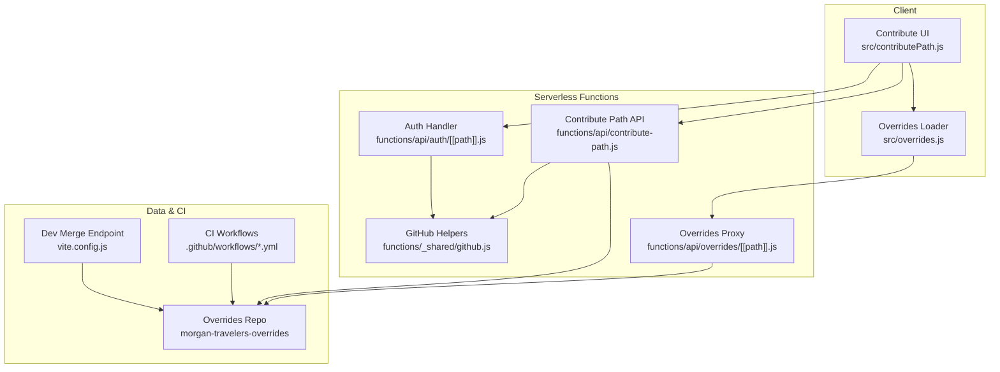
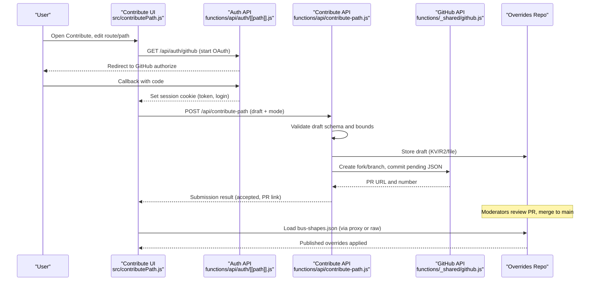
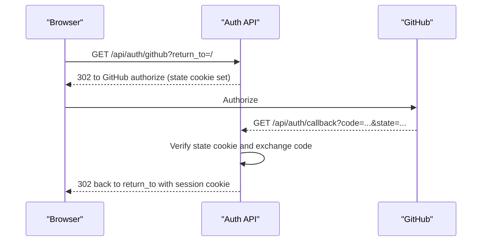
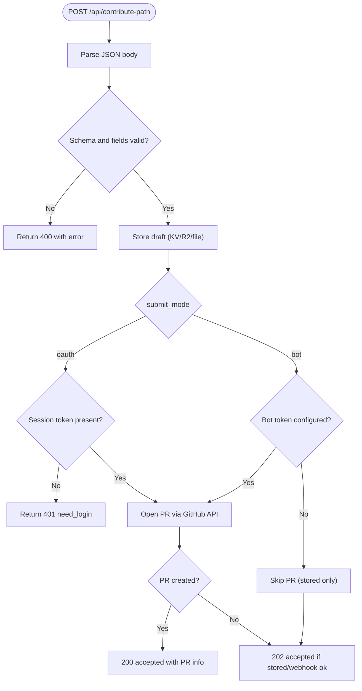
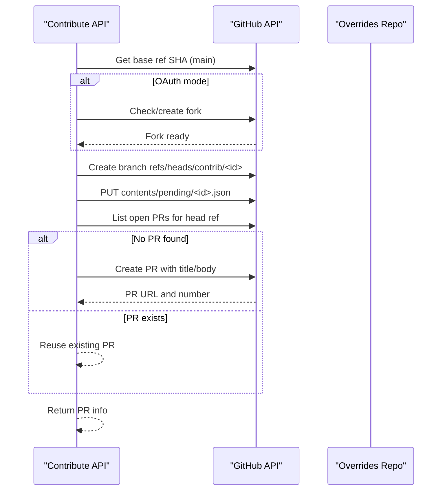
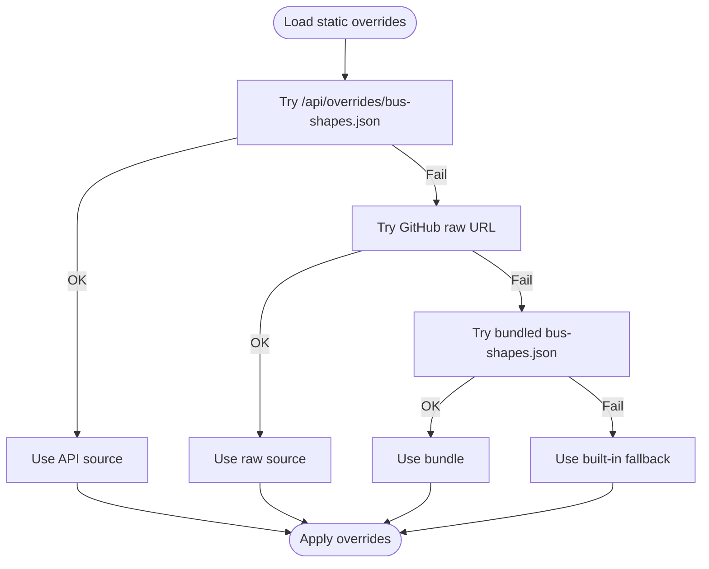
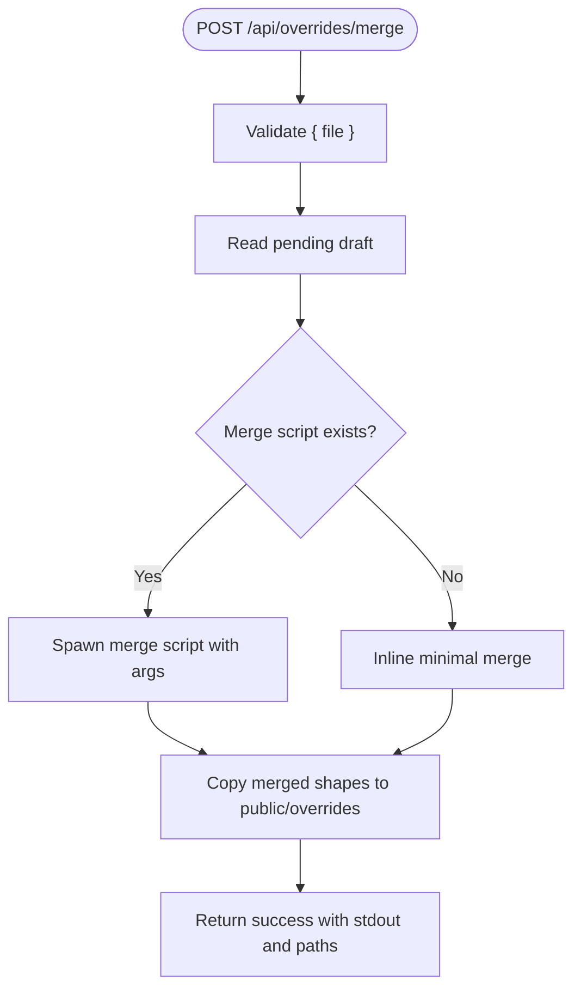
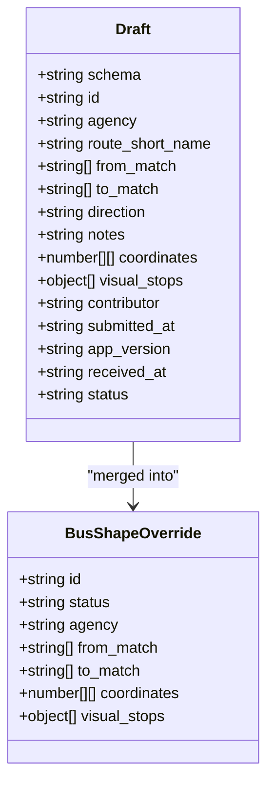
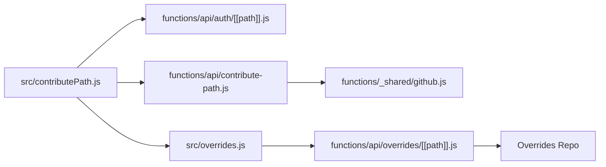

# Community Contribution System

<cite>
**Referenced Files in This Document**
- [local-overrides.md](file://docs/local-overrides.md)
- [github.js](file://functions/_shared/github.js)
- [auth handler](file://functions/api/auth/[[path]].js)
- [overrides proxy](file://functions/api/overrides/[[path]].js)
- [contribute-path API](file://functions/api/contribute-path.js)
- [contributePath UI](file://src/contributePath.js)
- [overrides loader](file://src/overrides.js)
- [busShapes utilities](file://src/busShapes.js)
- [vite dev overrides merge](file://vite.config.js)
- [collect-open-data workflow](file://.github/workflows/collect-open-data.yml)
- [pipeline workflow](file://.github/workflows/pipeline.yml)
- [package.json](file://package.json)
</cite>

## Table of Contents
1. Introduction
2. Project Structure
3. Core Components
4. Architecture Overview
5. Detailed Component Analysis
6. Dependency Analysis
7. Performance Considerations
8. Troubleshooting Guide
9. Conclusion
10. Appendices

## Introduction
This document explains MorganTraveler’s community contribution system for crowdsourced route corrections and data improvements. It covers:
- How users propose changes to bus routes, schedules, and station visuals via pull requests with automated validation and review flows
- The override system that lets the app load reviewed contributions without code changes
- GitHub OAuth authentication for secure submissions
- API endpoints for managing contributions and published overrides
- Data validation rules, conflict resolution strategies, and testing approaches
- Review, approval, and deployment procedures for verified contributions

## Project Structure
The contribution system spans serverless functions (Cloudflare Pages), a Vite dev middleware for local development, and client-side modules that build and submit drafts.

**Diagram sources**
- [contributePath UI](file://src/contributePath.js)
- [overrides loader](file://src/overrides.js)
- [auth handler](file://functions/api/auth/[[path]].js)
- [contribute-path API](file://functions/api/contribute-path.js)
- [overrides proxy](file://functions/api/overrides/[[path]].js)
- [github.js](file://functions/_shared/github.js)
- [vite dev overrides merge](file://vite.config.js)
- [collect-open-data workflow](file://.github/workflows/collect-open-data.yml)
- [pipeline workflow](file://.github/workflows/pipeline.yml)

**Section sources**
- [local-overrides.md:1-182](file://docs/local-overrides.md#L1-L182)
- [package.json:1-37](file://package.json#L1-L37)

## Core Components
- Authentication: GitHub OAuth flow to securely identify contributors and enable PR creation on their behalf.
- Contribution intake: A validated draft schema for route shapes and visual stop pins; optional storage to KV/R2 and webhook notifications.
- GitHub integration: Automated PR creation with branch management, file commits, and PR metadata for review.
- Override loading: Live fetch of merged bus-shapes from the overrides repository, with fallbacks to bundled or proxied sources.
- Local development: Dev-only endpoints to list pending drafts, merge into published shapes, and reload public assets.

**Section sources**
- [auth handler:1-255](file://functions/api/auth/[[path]].js#L1-L255)
- [contribute-path API:1-335](file://functions/api/contribute-path.js#L1-L335)
- [github.js:122-415](file://functions/_shared/github.js#L122-L415)
- [overrides loader:1-300](file://src/overrides.js#L1-L300)
- [vite dev overrides merge:627-717](file://vite.config.js#L627-L717)

## Architecture Overview
Contributions follow a clear path from user submission to published override:

**Diagram sources**
- [auth handler:85-255](file://functions/api/auth/[[path]].js#L85-L255)
- [contribute-path API:202-335](file://functions/api/contribute-path.js#L202-L335)
- [github.js:137-415](file://functions/_shared/github.js#L137-L415)
- [overrides loader:168-241](file://src/overrides.js#L168-L241)

## Detailed Component Analysis

### Authentication (GitHub OAuth)
- Endpoints:
  - GET /api/auth/github: Starts OAuth flow with state cookie and redirect URI
  - GET /api/auth/callback: Exchanges code for token, sets session cookie
  - GET /api/auth/me: Returns logged-in status and flags
  - POST /api/auth/logout: Clears session cookie
- Security: State parameter stored in short-lived cookie; Secure flag set for HTTPS; SameSite=Lax; HttpOnly cookies.
- Environment: Requires GITHUB_OAUTH_CLIENT_ID and GITHUB_OAUTH_CLIENT_SECRET; optional GITHUB_OAUTH_REDIRECT_URI.

**Diagram sources**
- [auth handler:97-255](file://functions/api/auth/[[path]].js#L97-L255)
- [github.js:44-120](file://functions/_shared/github.js#L44-L120)

**Section sources**
- [auth handler:1-255](file://functions/api/auth/[[path]].js#L1-L255)
- [github.js:1-120](file://functions/_shared/github.js#L1-L120)

### Contribution Intake and Validation
- Endpoint: POST /api/contribute-path
- Draft schema: morgan.travelers.bus-shape.v1
- Validation rules:
  - Required fields: schema, agency, route_short_name, from_match[], to_match[]
  - coordinates: array of [lon,lat], minimum 2 points, maximum 2000 points
  - Bounds: lon between 113.5–114.6, lat between 22.0–22.7 (Hong Kong region)
  - visual_stops: optional, up to 500 entries; each with visual [lon,lat] and optional official [lon,lat]; same bounds apply
  - Additional fields sanitized and truncated (ids, names, notes, contributor, app_version)
- Storage: Optional KV and R2 bucket storage with metadata; optional webhook notification
- Modes:
  - oauth: Uses session cookie token to open PR under contributor’s account
  - bot: Uses OVERRIDES_GITHUB_TOKEN to open PR under site bot account

**Diagram sources**
- [contribute-path API:36-134](file://functions/api/contribute-path.js#L36-L134)
- [contribute-path API:202-335](file://functions/api/contribute-path.js#L202-L335)

**Section sources**
- [contribute-path API:1-335](file://functions/api/contribute-path.js#L1-L335)

### GitHub Integration Workflow
- PR creation supports two modes:
  - OAuth: Ensures user has a fork; merges upstream default branch; creates branch; commits pending JSON; opens PR with structured description including route, matches, points, contributor, and review steps
  - Bot: Pushes branch to upstream repo using PAT; commits pending JSON; opens PR
- Branch naming: contrib/<safeId>
- File path: pending/<id>.json
- Conflict handling: If branch exists (422), attempts retry with fork SHA; handles existing files by passing sha for update
- PR metadata: Includes mode, route, from/to matches, point count, contributor, and review instructions

**Diagram sources**
- [github.js:137-415](file://functions/_shared/github.js#L137-L415)

**Section sources**
- [github.js:122-415](file://functions/_shared/github.js#L122-L415)

### Override System and Loading
- Published overrides are loaded from:
  - Same-origin /api/overrides/bus-shapes.json (dev proxies sibling repo; prod proxies GitHub raw)
  - Direct GitHub raw URL as fallback
  - Bundled public/overrides/bus-shapes.json as last resort
- The loader caches results and provides methods to invalidate/reload
- LRT and MTR access pins are loaded from local overrides and merged with live bus shapes

**Diagram sources**
- [overrides loader:168-241](file://src/overrides.js#L168-L241)
- [overrides proxy:23-119](file://functions/api/overrides/[[path]].js#L23-L119)

**Section sources**
- [overrides loader:1-300](file://src/overrides.js#L1-L300)
- [overrides proxy:1-120](file://functions/api/overrides/[[path]].js#L1-L120)

### Local Development and Merge Flow
- Dev endpoints:
  - GET /api/overrides/status: Shows paths, pending list, route counts
  - GET /api/overrides/bus-shapes.json: Proxies sibling repo or GitHub raw
  - GET /api/overrides/pending: Lists pending drafts
  - POST /api/overrides/merge: Merges a pending draft into published bus-shapes.json; supports dry-run and remove-pending
  - POST /api/overrides/reload-public: Copies merged shapes into public/overrides for offline use
- CLI commands: npm run overrides:status, overrides:pending, overrides:merge
- Merge behavior: Creates or updates an entry with status "published", copies to public/overrides, and optionally removes pending file

**Diagram sources**
- [vite dev overrides merge:627-717](file://vite.config.js#L627-L717)
- [local-overrides.md:101-139](file://docs/local-overrides.md#L101-L139)

**Section sources**
- [local-overrides.md:1-182](file://docs/local-overrides.md#L1-L182)
- [vite dev overrides merge:627-717](file://vite.config.js#L627-L717)

### Data Models and Relationships

**Diagram sources**
- [contribute-path API:36-134](file://functions/api/contribute-path.js#L36-L134)
- [overrides loader:116-124](file://src/overrides.js#L116-L124)

**Section sources**
- [contribute-path API:36-134](file://functions/api/contribute-path.js#L36-L134)
- [overrides loader:116-124](file://src/overrides.js#L116-L124)

## Dependency Analysis
- Client modules depend on:
  - src/contributePath.js for building drafts and submitting
  - src/overrides.js for loading published overrides
- Serverless functions depend on:
  - functions/_shared/github.js for GitHub operations and session handling
  - functions/api/auth/[[path]].js for OAuth endpoints
  - functions/api/contribute-path.js for intake and validation
  - functions/api/overrides/[[path]].js for proxying published bus shapes
- CI workflows coordinate data collection and publishing but do not directly touch public/overrides hand-maintained files

**Diagram sources**
- [contributePath UI:1-800](file://src/contributePath.js#L1-L800)
- [overrides loader:168-241](file://src/overrides.js#L168-L241)
- [auth handler:85-255](file://functions/api/auth/[[path]].js#L85-L255)
- [contribute-path API:202-335](file://functions/api/contribute-path.js#L202-L335)
- [overrides proxy:23-119](file://functions/api/overrides/[[path]].js#L23-L119)

**Section sources**
- [collect-open-data workflow:147-189](file://.github/workflows/collect-open-data.yml#L147-L189)
- [pipeline workflow:1-183](file://.github/workflows/pipeline.yml#L1-L183)

## Performance Considerations
- Short cache TTLs for bus-shapes.json to ensure recent merges appear quickly (60 seconds edge cache with stale-while-revalidate)
- Parallel fetching of LRT and MTR access pins during override load
- Concurrency limits when fetching stop details to avoid overwhelming APIs
- Draft size limits (max 400KB payload, max 2000 coordinates) to keep submissions manageable

[No sources needed since this section provides general guidance]

## Troubleshooting Guide
- OAuth not configured: Ensure GITHUB_OAUTH_CLIENT_ID and GITHUB_OAUTH_CLIENT_SECRET are set; check callback URL matches environment
- Missing code/state in callback: Verify state cookie is present and not expired; reattempt login
- Too many points or out-of-bounds coordinates: Adjust path editing to stay within Hong Kong bounds and reduce vertex count
- Bot token not configured: Set OVERRIDES_GITHUB_TOKEN for bot-mode submissions
- Merge failures: Use dry-run to preview changes; verify pending file path and merge script availability
- Overrides not updating: Invalidate cache and reload bus shapes; confirm proxy returns correct source

**Section sources**
- [auth handler:132-196](file://functions/api/auth/[[path]].js#L132-L196)
- [contribute-path API:213-242](file://functions/api/contribute-path.js#L213-L242)
- [vite dev overrides merge:627-717](file://vite.config.js#L627-L717)

## Conclusion
MorganTraveler’s community contribution system enables safe, validated, and auditable route corrections through GitHub pull requests. Contributors can submit edits via OAuth or bot modes, while moderators review and merge changes into a centralized overrides repository. The application loads published overrides dynamically, ensuring users see corrected routes without requiring code changes. Local development tools streamline testing and merging, and CI workflows support broader data maintenance tasks.

[No sources needed since this section summarizes without analyzing specific files]

## Appendices

### API Endpoints Summary
- Authentication:
  - GET /api/auth/github: Start OAuth
  - GET /api/auth/callback: Complete OAuth
  - GET /api/auth/me: Session status
  - POST /api/auth/logout: Clear session
- Contributions:
  - POST /api/contribute-path: Submit draft (schema morgan.travelers.bus-shape.v1)
- Overrides:
  - GET /api/overrides/status: Status and pending list (dev)
  - GET /api/overrides/bus-shapes.json: Published bus shapes (prod proxy)
  - GET /api/overrides/pending: Pending drafts (dev)
  - POST /api/overrides/merge: Merge pending into published (dev)
  - POST /api/overrides/reload-public: Sync to public/overrides (dev)

**Section sources**
- [local-overrides.md:141-155](file://docs/local-overrides.md#L141-L155)

### Environment Variables
- GITHUB_OAUTH_CLIENT_ID, GITHUB_OAUTH_CLIENT_SECRET, GITHUB_OAUTH_REDIRECT_URI
- OVERRIDES_REPO, OVERRIDES_BASE_BRANCH
- OVERRIDES_GITHUB_TOKEN
- VITE_OVERRIDES_BUS_SHAPES_URL (dev override URL)
- CONTRIBUTIONS_BUCKET, CONTRIBUTIONS_WEBHOOK_URL (optional)

**Section sources**
- [local-overrides.md:156-182](file://docs/local-overrides.md#L156-L182)

### Scripts and Commands
- npm run dev: Start dev server with local override support
- npm run overrides:status, overrides:pending, overrides:merge: Manage local contributions
- npm run sync:bus-shapes: Sync bus shapes from remote GitHub raw

**Section sources**
- [package.json:7-25](file://package.json#L7-L25)