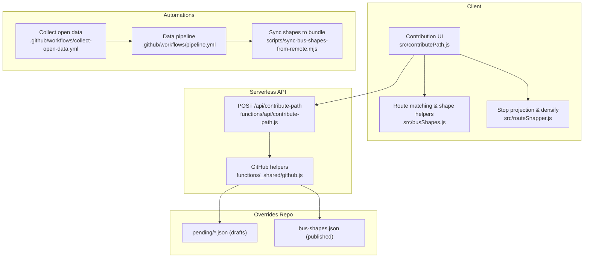
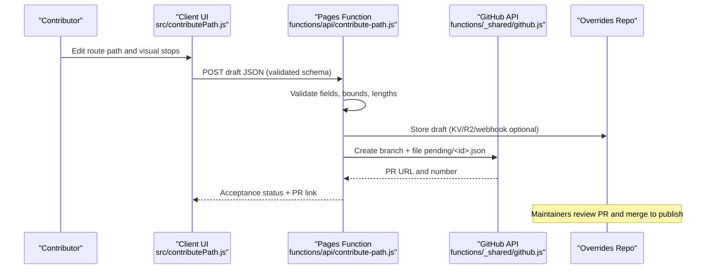
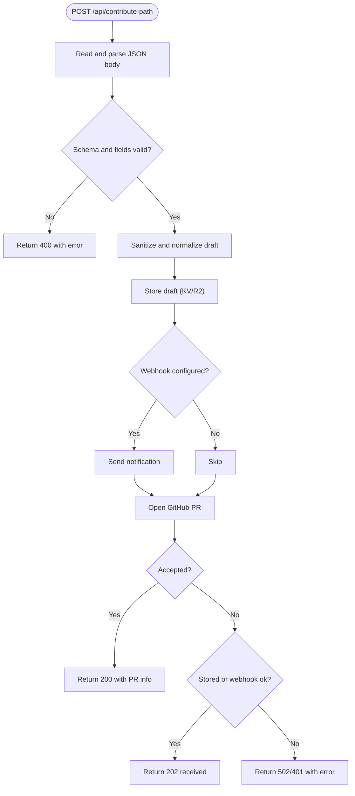
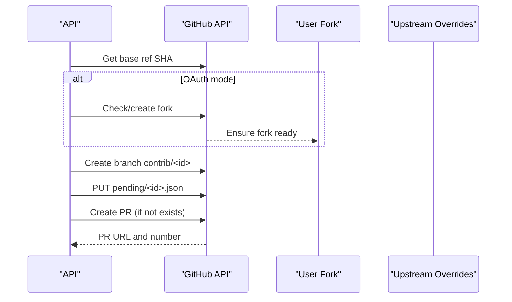
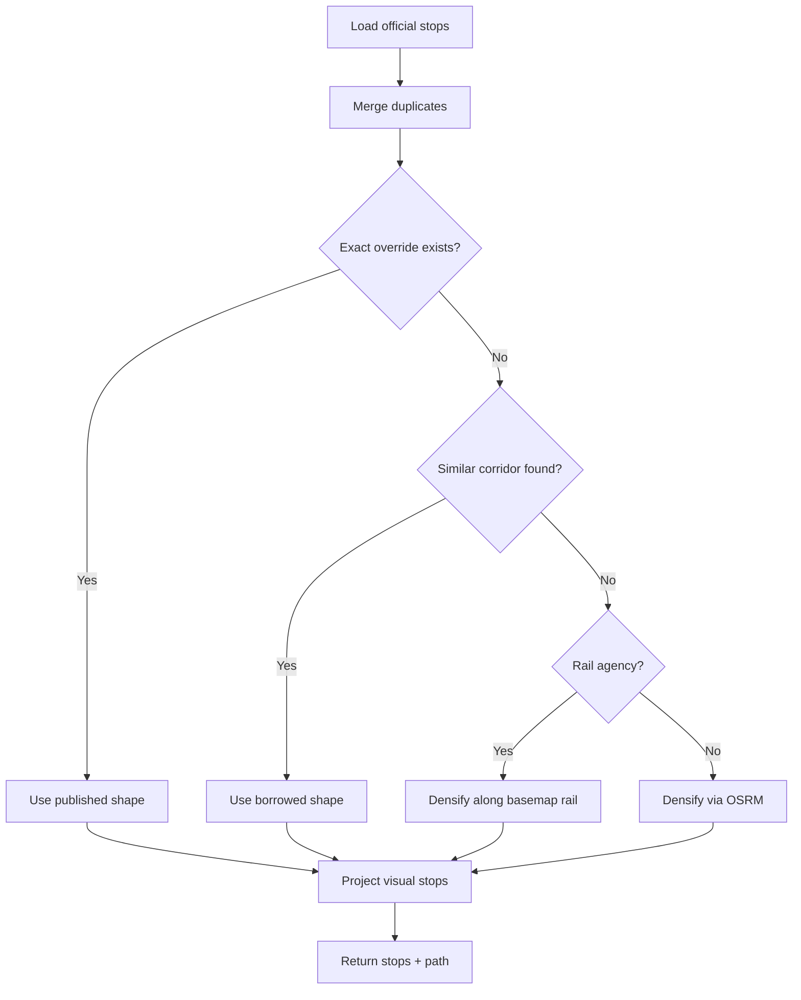
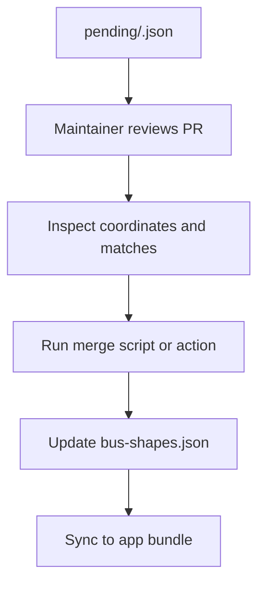
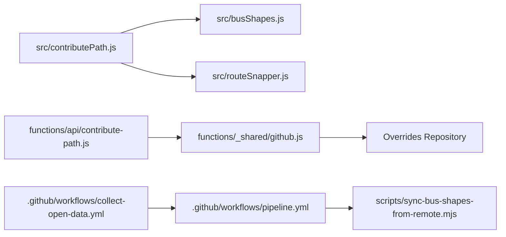

# Contribution Workflow and Review Process

<cite>
**Referenced Files in This Document**
- [contribute-path.js](file://functions/api/contribute-path.js)
- [github.js](file://functions/_shared/github.js)
- [pipeline.yml](file://.github/workflows/pipeline.yml)
- [collect-open-data.yml](file://.github/workflows/collect-open-data.yml)
- [collect-open-data.mjs](file://scripts/collect-open-data.mjs)
- [README.md](file://public/overrides/README.md)
- [busShapes.js](file://src/busShapes.js)
- [contributePath.js](file://src/contributePath.js)
- [routeSnapper.js](file://src/routeSnapper.js)
- [sync-bus-shapes-from-remote.mjs](file://scripts/sync-bus-shapes-from-remote.mjs)
</cite>

## Table of Contents
1. Introduction
2. Project Structure
3. Core Components
4. Architecture Overview
5. Detailed Component Analysis
6. Dependency Analysis
7. Performance Considerations
8. Troubleshooting Guide
9. Conclusion
10. Appendices

## Introduction
This document explains the end-to-end contribution workflow for route corrections in MORGAN Travelers. It covers how contributors identify route issues, propose corrected paths, validate coordinates, and submit changes through automated pull requests. It also documents the review process managed by maintainers, including quality checks, conflict detection, and approval workflows. Finally, it provides step-by-step guides for common scenarios such as fixing bus routes, updating MTR station information, and correcting light rail paths, along with contributor experience improvements and feedback mechanisms.

## Project Structure
The contribution system spans client-side tools, serverless APIs, GitHub automation, and data pipelines:
- Client-side path editor and validation live in the application source.
- A serverless API validates submissions and optionally creates a GitHub PR into an overrides repository.
- GitHub Actions collect open data and build artifacts, and can open PRs when data changes.
- Scripts sync published overrides back into the app bundle for offline use.

**Diagram sources**
- [contributePath.js:1-120](file://src/contributePath.js#L1-L120)
- [busShapes.js:1-120](file://src/busShapes.js#L1-L120)
- [routeSnapper.js:1-120](file://src/routeSnapper.js#L1-L120)
- [contribute-path.js:1-120](file://functions/api/contribute-path.js#L1-L120)
- [github.js:122-200](file://functions/_shared/github.js#L122-L200)
- [collect-open-data.yml:1-120](file://.github/workflows/collect-open-data.yml#L1-L120)
- [pipeline.yml:1-120](file://.github/workflows/pipeline.yml#L1-L120)
- [sync-bus-shapes-from-remote.mjs:1-59](file://scripts/sync-bus-shapes-from-remote.mjs#L1-L59)

**Section sources**
- [contributePath.js:1-120](file://src/contributePath.js#L1-L120)
- [contribute-path.js:1-120](file://functions/api/contribute-path.js#L1-L120)
- [collect-open-data.yml:1-120](file://.github/workflows/collect-open-data.yml#L1-L120)
- [pipeline.yml:1-120](file://.github/workflows/pipeline.yml#L1-L120)

## Core Components
- Path contribution intake API: validates drafts, stores pending contributions, and opens PRs via GitHub.
- GitHub integration: creates branches, writes draft files under pending/, and opens PRs with standardized bodies and review instructions.
- Route path builder: loads stops, matches existing overrides or similar corridors, densifies via OSRM or basemap rail, and projects visual stop pins.
- Data collection and publishing: collects open data, builds fare packs, generates metadata, syncs to storage, and notifies via webhooks.
- Shape synchronization: pulls approved bus shapes from the overrides repo into the app’s public bundle.

**Section sources**
- [contribute-path.js:202-335](file://functions/api/contribute-path.js#L202-L335)
- [github.js:122-414](file://functions/_shared/github.js#L122-L414)
- [contributePath.js:82-320](file://src/contributePath.js#L82-L320)
- [collect-open-data.yml:43-186](file://.github/workflows/collect-open-data.yml#L43-L186)
- [pipeline.yml:37-183](file://.github/workflows/pipeline.yml#L37-L183)
- [sync-bus-shapes-from-remote.mjs:1-59](file://scripts/sync-bus-shapes-from-remote.mjs#L1-L59)

## Architecture Overview
The contribution flow integrates client-side editing, serverless validation, and GitHub-based review:

**Diagram sources**
- [contributePath.js:773-800](file://src/contributePath.js#L773-L800)
- [contribute-path.js:202-335](file://functions/api/contribute-path.js#L202-L335)
- [github.js:122-414](file://functions/_shared/github.js#L122-L414)

## Detailed Component Analysis

### Path Contribution Intake API
Responsibilities:
- Enforce payload size limits and CORS headers.
- Validate schema version, required fields, coordinate bounds, and arrays.
- Normalize and sanitize draft fields.
- Persist drafts to KV/R2 and/or notify a webhook.
- Open a GitHub PR into the overrides repository using OAuth or bot mode.

Key behaviors:
- Rejects payloads outside HK bounds or exceeding point limits.
- Supports optional storage bindings; falls back gracefully if none configured.
- Returns detailed acceptance status, including whether a PR was created and where to find it.

**Diagram sources**
- [contribute-path.js:202-335](file://functions/api/contribute-path.js#L202-L335)

**Section sources**
- [contribute-path.js:20-134](file://functions/api/contribute-path.js#L20-L134)
- [contribute-path.js:136-193](file://functions/api/contribute-path.js#L136-L193)
- [contribute-path.js:202-335](file://functions/api/contribute-path.js#L202-L335)

### GitHub Pull Request Automation
Responsibilities:
- Resolve base branch SHA and create a unique branch per submission.
- In OAuth mode, ensure a fork exists and update it from upstream.
- Write the draft JSON under pending/ and create or reuse a PR.
- Populate PR body with standardized review instructions and metadata.

Quality and safety:
- Uses safe IDs for branch/file names.
- Handles conflicts by checking existing file SHA before writing.
- Detects existing open PRs to avoid duplicates.

**Diagram sources**
- [github.js:122-414](file://functions/_shared/github.js#L122-L414)

**Section sources**
- [github.js:122-414](file://functions/_shared/github.js#L122-L414)

### Route Validation, Coordinate Mapping, and Densification
Responsibilities:
- Load official stops for the selected agency/route/direction.
- Merge duplicate stops and project them onto a computed path.
- Prefer exact published override, then similar corridor, then live densification.
- For rail agencies, densify along basemap rail geometry; otherwise use OSRM road-following.

Validation and mapping:
- Ensures at least two usable stops after merging.
- Projects stops forward along the route to preserve directionality.
- Applies visual stop positions for map display while keeping official coordinates fixed.

**Diagram sources**
- [contributePath.js:82-320](file://src/contributePath.js#L82-L320)
- [routeSnapper.js:1-200](file://src/routeSnapper.js#L1-L200)

**Section sources**
- [contributePath.js:82-320](file://src/contributePath.js#L82-L320)
- [routeSnapper.js:1-200](file://src/routeSnapper.js#L1-L200)

### Automated Testing of Proposed Changes
While there is no explicit unit test harness in this snippet set, the system includes built-in validations that act as automated checks:
- Payload size and content-length enforcement.
- Schema version check and required field validation.
- Coordinate range checks within Hong Kong bounds.
- Point count limits and array structure validation.
- Optional webhook notifications for immediate visibility.

These checks reduce invalid submissions and provide early feedback to contributors.

**Section sources**
- [contribute-path.js:20-134](file://functions/api/contribute-path.js#L20-L134)

### Review Process: Quality Checks, Conflict Detection, and Approval Workflows
- Quality checks: The API enforces strict validation rules before accepting a draft.
- Conflict detection: GitHub API calls detect existing branches/files and handle conflicts by reading existing SHA before writing.
- Approval workflow:
  - Drafts are stored under pending/ in the overrides repository.
  - Maintainers review PRs, inspect the draft file, and run merge scripts or actions to integrate changes.
  - Once merged, published shapes become available to clients.

**Diagram sources**
- [github.js:296-331](file://functions/_shared/github.js#L296-L331)
- [README.md:63-95](file://public/overrides/README.md#L63-L95)
- [sync-bus-shapes-from-remote.mjs:33-59](file://scripts/sync-bus-shapes-from-remote.mjs#L33-L59)

**Section sources**
- [github.js:296-331](file://functions/_shared/github.js#L296-L331)
- [README.md:63-95](file://public/overrides/README.md#L63-L95)
- [sync-bus-shapes-from-remote.mjs:33-59](file://scripts/sync-bus-shapes-from-remote.mjs#L33-L59)

### Pull Request Automation Templates and Instructions
- Branch naming: contrib/<safe-id>
- File path: pending/<safe-id>.json
- PR body includes:
  - Mode (OAuth or Bot)
  - Route details (agency, route short name, from/to matches)
  - Coordinates count
  - Contributor attribution
  - Notes (optional)
  - Review checklist pointing to the pending file and merge steps

This standardization ensures consistent review experiences across contributions.

**Section sources**
- [github.js:333-395](file://functions/_shared/github.js#L333-L395)

### Step-by-Step Guides for Common Scenarios

#### Fixing Bus Routes
1. Open the contribution UI and select the operator and route.
2. The system loads official stops and attempts to match an existing override or similar corridor.
3. If needed, the path is densified via OSRM or basemap rail.
4. Adjust visual stop pins to improve map alignment without changing official coordinates.
5. Submit the draft; the API validates and opens a PR into the overrides repository.
6. Maintainers review and merge to publish the correction.

**Section sources**
- [contributePath.js:82-320](file://src/contributePath.js#L82-L320)
- [contribute-path.js:202-335](file://functions/api/contribute-path.js#L202-L335)
- [README.md:28-95](file://public/overrides/README.md#L28-L95)

#### Updating MTR Station Information
1. Select MTR line code and direction in the contribution UI.
2. The system fetches station sequences from local GeoJSON and official line order.
3. Visualize and adjust visual stop pins for accurate map placement.
4. Submit the draft; the same validation and PR workflow applies.
5. After approval, published shapes reflect updated station alignments.

**Section sources**
- [contributePath.js:390-454](file://src/contributePath.js#L390-L454)
- [contributePath.js:456-532](file://src/contributePath.js#L456-L532)
- [README.md:63-95](file://public/overrides/README.md#L63-L95)

#### Correcting Light Rail Paths
1. Choose LRT route number and direction.
2. The system resolves stops from open data CSV and local LRT stop coordinates.
3. Visualize the path and adjust visual stops for platform accuracy.
4. Submit the draft; validation ensures coordinates are within bounds and well-formed.
5. Maintainers review and merge to update the published light rail shapes.

**Section sources**
- [contributePath.js:456-532](file://src/contributePath.js#L456-L532)
- [README.md:17-26](file://public/overrides/README.md#L17-L26)

### Contributor Experience Improvements and Feedback Mechanisms
- Immediate validation feedback on invalid payloads.
- Optional webhook notifications for real-time awareness of new contributions.
- Clear PR templates with review instructions and metadata.
- Fallback to download/copy JSON when GitHub integration is not configured.
- Local development support for saving drafts locally and reviewing via dev endpoints.

**Section sources**
- [contribute-path.js:172-193](file://functions/api/contribute-path.js#L172-L193)
- [README.md:48-53](file://public/overrides/README.md#L48-L53)
- [vite.config.js:461-519](file://vite.config.js#L461-L519)

## Dependency Analysis
The contribution system has clear boundaries and minimal coupling:
- Client modules depend on route snapping and shape matching utilities.
- Serverless API depends on GitHub helpers for PR creation.
- GitHub helpers encapsulate all repository interactions.
- Data pipelines operate independently but inform published assets used by the app.

**Diagram sources**
- [contributePath.js:1-120](file://src/contributePath.js#L1-L120)
- [busShapes.js:1-120](file://src/busShapes.js#L1-L120)
- [routeSnapper.js:1-120](file://src/routeSnapper.js#L1-L120)
- [contribute-path.js:1-120](file://functions/api/contribute-path.js#L1-L120)
- [github.js:122-200](file://functions/_shared/github.js#L122-L200)
- [collect-open-data.yml:43-120](file://.github/workflows/collect-open-data.yml#L43-L120)
- [pipeline.yml:37-120](file://.github/workflows/pipeline.yml#L37-L120)
- [sync-bus-shapes-from-remote.mjs:1-59](file://scripts/sync-bus-shapes-from-remote.mjs#L1-L59)

**Section sources**
- [contributePath.js:1-120](file://src/contributePath.js#L1-L120)
- [contribute-path.js:1-120](file://functions/api/contribute-path.js#L1-L120)
- [github.js:122-200](file://functions/_shared/github.js#L122-L200)
- [collect-open-data.yml:43-120](file://.github/workflows/collect-open-data.yml#L43-L120)
- [pipeline.yml:37-120](file://.github/workflows/pipeline.yml#L37-L120)
- [sync-bus-shapes-from-remote.mjs:1-59](file://scripts/sync-bus-shapes-from-remote.mjs#L1-L59)

## Performance Considerations
- Payload size limits prevent excessive network usage and processing overhead.
- Coordinate and point count limits reduce memory and computation costs during validation.
- Parallel stop detail fetching improves responsiveness when loading route stops.
- Caching of fetched JSON/text reduces repeated network calls during editing sessions.
- Optional skip-large flag avoids heavy downloads during scheduled data collection runs.

[No sources needed since this section provides general guidance]

## Troubleshooting Guide
Common issues and resolutions:
- Invalid JSON or missing fields: Ensure the draft follows the expected schema and includes required arrays and numeric coordinates.
- Coordinates out of bounds: Verify that lon/lat values fall within Hong Kong bounds enforced by the API.
- Too many points: Reduce the number of vertices in the path to meet the maximum limit.
- OAuth login required: Confirm that a valid session cookie is present when submitting via OAuth mode.
- Bot token not configured: Set OVERRIDES_GITHUB_TOKEN or configure OAuth for PR creation.
- Webhook failures: Check webhook URL configuration and network connectivity.

**Section sources**
- [contribute-path.js:20-134](file://functions/api/contribute-path.js#L20-L134)
- [contribute-path.js:253-295](file://functions/api/contribute-path.js#L253-L295)

## Conclusion
The MORGAN Travelers contribution workflow combines robust client-side editing, strict serverless validation, and automated GitHub-based review. Contributors can correct bus routes, update MTR stations, and refine light rail paths with confidence, knowing that submissions are validated and reviewed through standardized processes. Maintainers benefit from clear PR templates, conflict handling, and streamlined merge procedures, ensuring high-quality route data remains current and reliable.

[No sources needed since this section summarizes without analyzing specific files]

## Appendices

### Data Collection and Publishing Pipeline
- Scheduled workflows collect open data sources, build fare packs, generate metadata, and sync to storage.
- Notifications are posted via webhooks for pipeline health and results.
- Published shapes are synchronized into the app bundle for offline availability.

**Section sources**
- [collect-open-data.yml:43-186](file://.github/workflows/collect-open-data.yml#L43-L186)
- [pipeline.yml:37-183](file://.github/workflows/pipeline.yml#L37-L183)
- [collect-open-data.mjs:1-289](file://scripts/collect-open-data.mjs#L1-L289)
- [sync-bus-shapes-from-remote.mjs:1-59](file://scripts/sync-bus-shapes-from-remote.mjs#L1-L59)