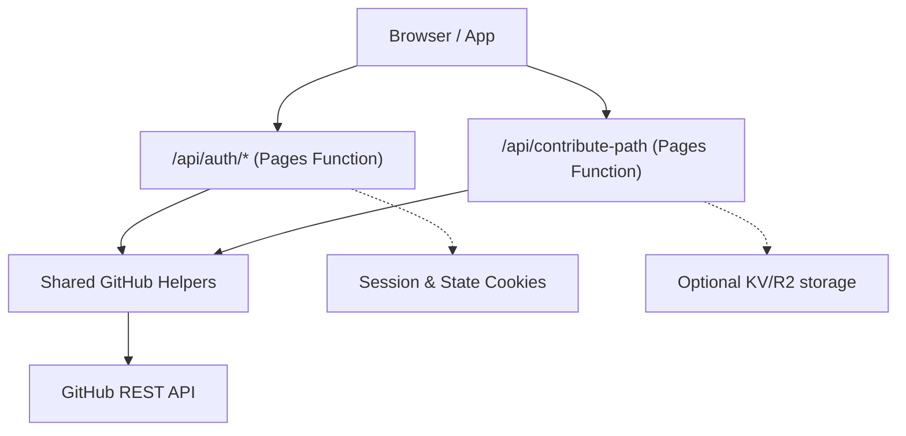
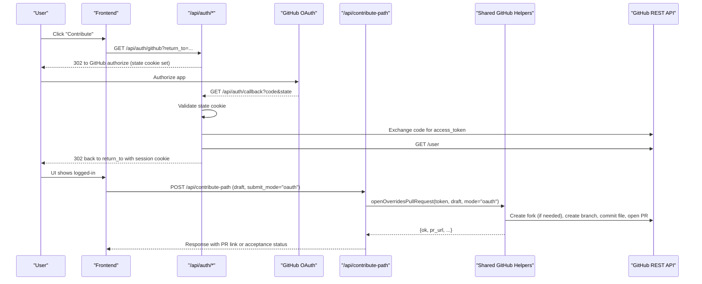
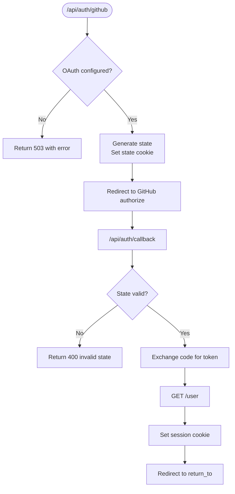
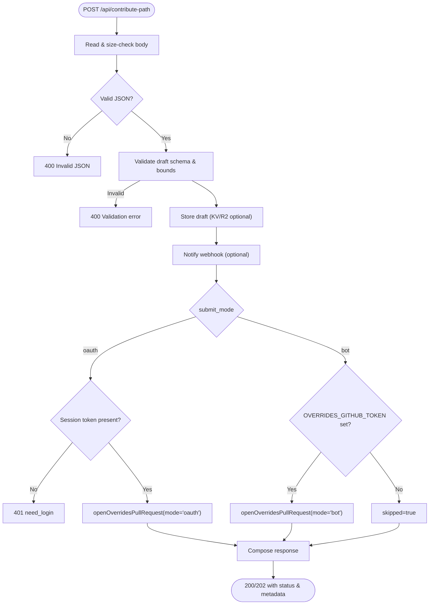
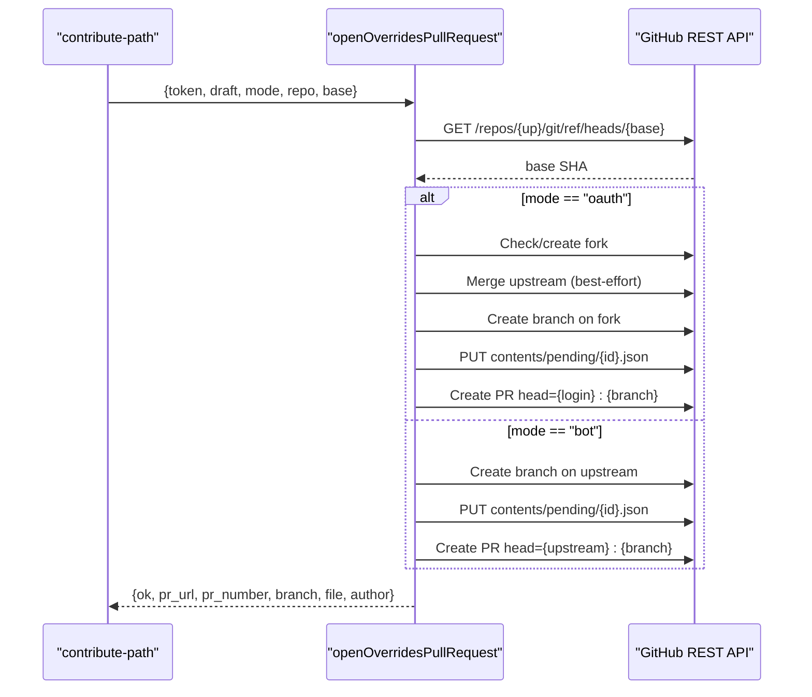
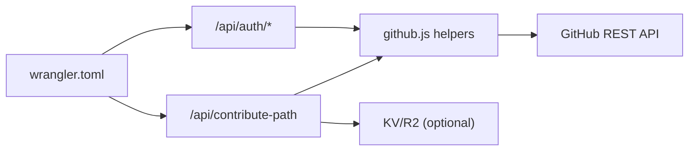

# GitHub Integration and Authentication

<cite>
**Referenced Files in This Document**
- [functions/api/auth/[[path]].js](file://functions/api/auth/[[path]].js)
- [functions/_shared/github.js](file://functions/_shared/github.js)
- [functions/api/contribute-path.js](file://functions/api/contribute-path.js)
- [src/contributePath.js](file://src/contributePath.js)
- [wrangler.toml](file://wrangler.toml)
</cite>

## Table of Contents
1. [Introduction](#introduction)
2. [Project Structure](#project-structure)
3. [Core Components](#core-components)
4. [Architecture Overview](#architecture-overview)
5. [Detailed Component Analysis](#detailed-component-analysis)
6. [Dependency Analysis](#dependency-analysis)
7. [Performance Considerations](#performance-considerations)
8. [Troubleshooting Guide](#troubleshooting-guide)
9. [Conclusion](#conclusion)

## Introduction
This document explains MorganTraveler’s GitHub integration for secure contributions via OAuth and bot modes. It covers the end-to-end flow: user authentication with GitHub, session management using secure cookies, token handling, and automated creation of branches, files, and pull requests to an overrides repository. It also documents error handling strategies and security considerations for managing tokens and sessions.

## Project Structure
The GitHub integration spans serverless Pages Functions and shared utilities:
- Authentication endpoints under functions/api/auth handle login, callback, me, and logout.
- A shared module provides cookie helpers, GitHub API headers, user fetching, and PR automation.
- The contribution intake endpoint validates drafts and opens PRs in either OAuth or bot mode.
- Configuration is declared in wrangler.toml for repo targets and environment variables/secrets.

**Diagram sources**
- [functions/api/auth/[[path]].js:85-254](file://functions/api/auth/[[path]].js#L85-L254)
- [functions/api/contribute-path.js:202-334](file://functions/api/contribute-path.js#L202-L334)
- [functions/_shared/github.js:1-415](file://functions/_shared/github.js#L1-L415)

**Section sources**
- [functions/api/auth/[[path]].js:1-255](file://functions/api/auth/[[path]].js#L1-L255)
- [functions/_shared/github.js:1-415](file://functions/_shared/github.js#L1-L415)
- [functions/api/contribute-path.js:1-335](file://functions/api/contribute-path.js#L1-L335)
- [wrangler.toml:1-38](file://wrangler.toml#L1-L38)

## Core Components
- Authentication endpoints:
  - GET /api/auth/github (or /login): initiates GitHub OAuth with state and redirect_uri.
  - GET /api/auth/callback: exchanges code for access token, fetches user info, sets session cookie, redirects back.
  - GET /api/auth/me: returns logged-in status and profile from session cookie.
  - POST /api/auth/logout: clears session cookie.
- Contribution intake:
  - POST /api/contribute-path: validates draft, optionally stores it, and opens a PR via OAuth or bot mode.
- Shared GitHub helpers:
  - Cookie helpers for session and state.
  - GitHub API header builder and user fetcher.
  - openOverridesPullRequest: branch creation, file commit, and PR automation.

**Section sources**
- [functions/api/auth/[[path]].js:85-254](file://functions/api/auth/[[path]].js#L85-L254)
- [functions/api/contribute-path.js:202-334](file://functions/api/contribute-path.js#L202-L334)
- [functions/_shared/github.js:40-120](file://functions/_shared/github.js#L40-L120)
- [functions/_shared/github.js:137-410](file://functions/_shared/github.js#L137-L410)

## Architecture Overview
The system supports two submission modes:
- OAuth mode: User authenticates via GitHub; a short-lived session cookie holds the access token. Contributions are submitted on behalf of the user by creating a fork (if needed), pushing a branch, committing a pending file, and opening a PR to the upstream repository.
- Bot mode: A server-side PAT (Personal Access Token) is used to push directly to the upstream repository and open a PR without user interaction.

**Diagram sources**
- [functions/api/auth/[[path]].js:132-250](file://functions/api/auth/[[path]].js#L132-L250)
- [functions/_shared/github.js:137-410](file://functions/_shared/github.js#L137-L410)
- [functions/api/contribute-path.js:235-290](file://functions/api/contribute-path.js#L235-L290)

## Detailed Component Analysis

### Authentication Endpoints (/api/auth/*)
Responsibilities:
- Start OAuth flow with CSRF protection via state cookie.
- Exchange authorization code for access token securely on the server.
- Fetch user profile and persist session via HttpOnly, SameSite=Lax, Secure cookie.
- Provide me endpoint to check login state and profile.
- Logout clears the session cookie.

Key behaviors:
- Redirect URI defaults to request origin + /api/auth/callback unless configured.
- Scope requested: public_repo read:user.
- State cookie is short-lived and validated on callback.
- Session cookie includes token, login, avatar, name, and expiration.

**Diagram sources**
- [functions/api/auth/[[path]].js:132-250](file://functions/api/auth/[[path]].js#L132-L250)

**Section sources**
- [functions/api/auth/[[path]].js:85-254](file://functions/api/auth/[[path]].js#L85-L254)

### Session Management and Cookie Security
- Session cookie:
  - Name: morgan_gh_sess
  - Contains base64-encoded JSON with token, login, avatar, name, exp
  - Flags: Path=/, HttpOnly, SameSite=Lax, Max-Age=14 days, Secure when HTTPS
- State cookie:
  - Name: morgan_gh_state
  - Stores state, returnTo, exp
  - Short-lived (Max-Age=600), HttpOnly, SameSite=Lax, Secure when HTTPS
- Parsing and clearing:
  - parseSessionCookie validates presence of token/login and expiration
  - clearSessionCookieHeader resets cookie with Max-Age=0

Security notes:
- Tokens are stored only in HttpOnly cookies to prevent client-side JS access.
- State validation prevents CSRF during OAuth callback.
- Secure flag is applied based on request protocol detection.

**Section sources**
- [functions/_shared/github.js:40-100](file://functions/_shared/github.js#L40-L100)
- [functions/api/auth/[[path]].js:141-163](file://functions/api/auth/[[path]].js#L141-L163)
- [functions/api/auth/[[path]].js:177-240](file://functions/api/auth/[[path]].js#L177-L240)

### Contribution Intake (/api/contribute-path)
Responsibilities:
- Accept POST with a draft payload conforming to schema morgan.travelers.bus-shape.v1.
- Validate fields including coordinates bounds, point limits, and required arrays.
- Optionally store draft to KV or R2 and notify webhook if configured.
- Open a PR via OAuth or bot mode.

Modes:
- OAuth mode: Requires a valid session cookie with token; uses user’s fork and identity.
- Bot mode: Uses OVERRIDES_GITHUB_TOKEN or GITHUB_TOKEN to push directly to upstream.

Response semantics:
- Returns accepted status if any channel succeeded (storage, webhook, or PR).
- For OAuth failures with no other success, returns 401/502 with need_login or error details.

**Diagram sources**
- [functions/api/contribute-path.js:202-334](file://functions/api/contribute-path.js#L202-L334)

**Section sources**
- [functions/api/contribute-path.js:36-134](file://functions/api/contribute-path.js#L36-L134)
- [functions/api/contribute-path.js:235-334](file://functions/api/contribute-path.js#L235-L334)

### Branch Creation, File Operations, and Pull Request Automation
The shared function openOverridesPullRequest performs:
- Resolves base ref SHA from upstream main (or configured base).
- OAuth mode:
  - Ensures user fork exists; creates if missing and waits for readiness.
  - Merges upstream into fork default branch best-effort.
  - Pushes branch to user fork and commits pending file.
  - Opens PR against upstream with head set to user:branch.
- Bot mode:
  - Creates branch directly on upstream and commits pending file.
  - Opens PR with head set to upstream:branch.
- Handles existing branch/file cases and retries where appropriate.
- Returns PR URL, number, branch, file path, author, and mode.

**Diagram sources**
- [functions/_shared/github.js:137-410](file://functions/_shared/github.js#L137-L410)

**Section sources**
- [functions/_shared/github.js:137-410](file://functions/_shared/github.js#L137-L410)

### Frontend Contribution Flow
The frontend prepares a draft for a route path and submits it to /api/contribute-path. It can:
- Load calculated paths and visual stops for editing.
- Build a draft object conforming to the expected schema.
- Submit with submit_mode="oauth" when the user is authenticated, otherwise prompt login.

Note: The detailed UI logic is extensive; this section focuses on how the drafted data flows to the backend.

**Section sources**
- [src/contributePath.js:1-800](file://src/contributePath.js#L1-L800)

## Dependency Analysis
- Authentication endpoints depend on shared cookie and GitHub helpers for state/session handling and user fetching.
- Contribution intake depends on shared helpers for PR automation and optional storage/webhook integrations.
- Configuration is centralized in wrangler.toml for repo target and base branch, with secrets managed via Cloudflare dashboard or Wrangler.

**Diagram sources**
- [functions/api/auth/[[path]].js:85-254](file://functions/api/auth/[[path]].js#L85-L254)
- [functions/api/contribute-path.js:202-334](file://functions/api/contribute-path.js#L202-L334)
- [functions/_shared/github.js:1-415](file://functions/_shared/github.js#L1-L415)
- [wrangler.toml:1-38](file://wrangler.toml#L1-L38)

**Section sources**
- [wrangler.toml:11-27](file://wrangler.toml#L11-L27)

## Performance Considerations
- Fork readiness polling: The OAuth flow polls fork readiness up to a bounded number of attempts to avoid long waits.
- Base ref resolution: Efficiently resolves base SHA before branch creation to minimize retries.
- Content updates: Existing file SHA is checked before PUT to avoid conflicts.
- Optional storage: Storing drafts to KV/R2 is non-blocking and does not block PR creation.
- Network calls: All GitHub API calls use proper headers and versioning to ensure compatibility and reduce errors.

[No sources needed since this section provides general guidance]

## Troubleshooting Guide
Common issues and resolutions:
- OAuth not configured: Ensure GITHUB_OAUTH_CLIENT_ID and GITHUB_OAUTH_CLIENT_SECRET are set.
- Missing code/state on callback: Verify state cookie and that the browser allows cookies for the domain.
- Invalid OAuth state: State mismatch or expired state cookie; re-initiate login.
- Token exchange failed: Check client credentials and redirect_uri configuration.
- Could not load GitHub user: Token may be invalid or insufficient scope; re-authenticate.
- Fork not ready: Retry submission after fork creation completes.
- Branch already exists: Handled gracefully; update existing branch or retry.
- Put file failed: Inspect permissions and content encoding; ensure base branch SHA matches.
- Create PR failed: Check permissions and base/head references; verify upstream settings.

Operational checks:
- Use /api/auth/me to confirm session and OAuth configuration flags.
- Confirm CORS headers for cross-origin requests if calling from a different origin.
- Review webhook notifications if CONTRIBUTE_WEBHOOK_URL is configured.

**Section sources**
- [functions/api/auth/[[path]].js:132-250](file://functions/api/auth/[[path]].js#L132-L250)
- [functions/_shared/github.js:137-410](file://functions/_shared/github.js#L137-L410)
- [functions/api/contribute-path.js:235-334](file://functions/api/contribute-path.js#L235-L334)

## Conclusion
MorganTraveler’s GitHub integration provides a robust, secure workflow for community contributions. OAuth mode empowers users to contribute via their own accounts with safe session handling, while bot mode enables automated submissions. The system enforces strict validation, secure cookie practices, and resilient GitHub API interactions to ensure reliable branch creation, file operations, and pull request automation. Proper configuration of environment variables and secrets is essential for seamless operation.