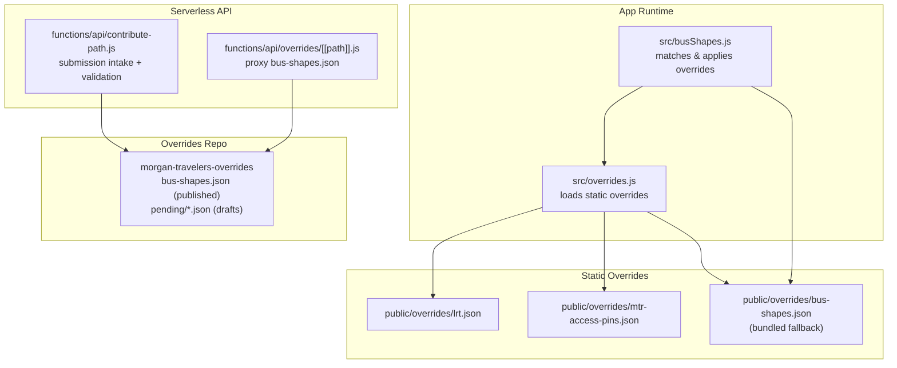
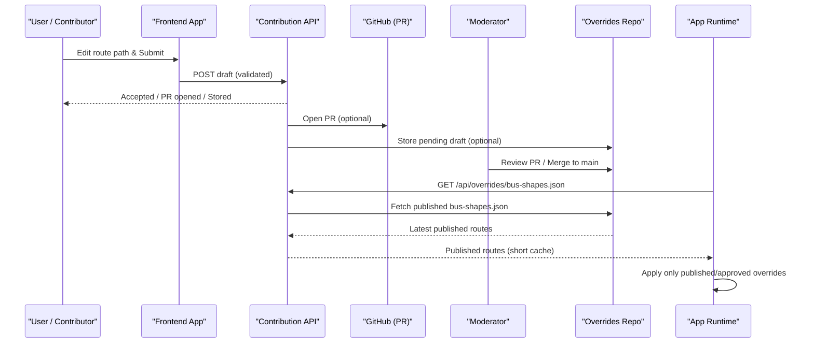
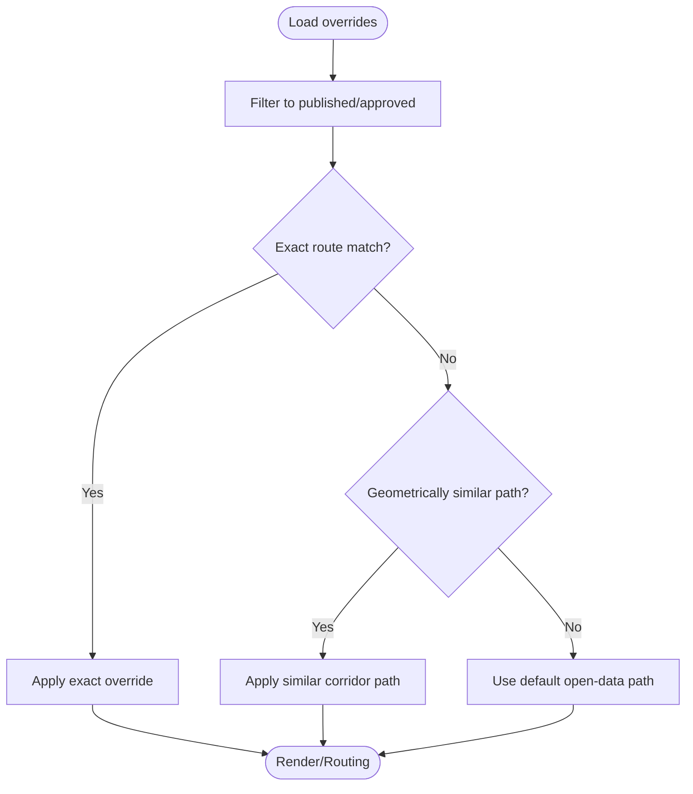
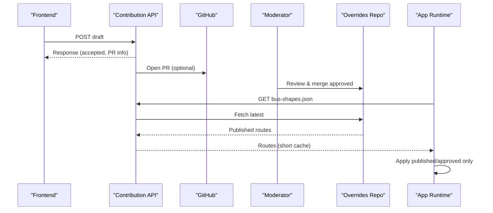
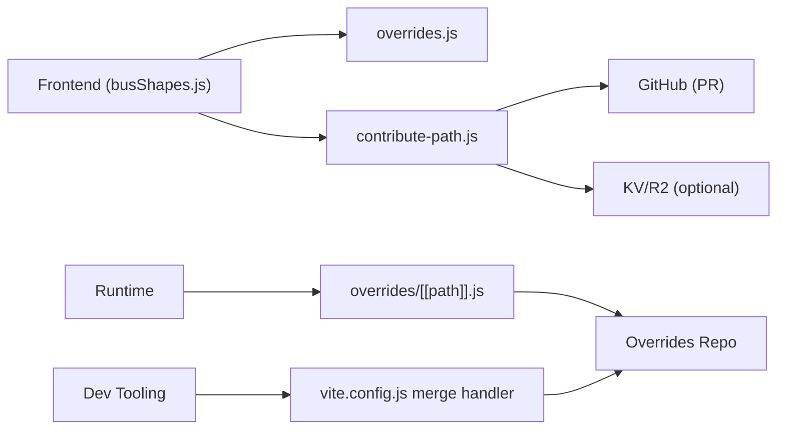

# Override Management System

<cite>
**Referenced Files in This Document**
- [overrides.js](file://src/overrides.js)
- [busShapes.js](file://src/busShapes.js)
- [contribute-path.js](file://functions/api/contribute-path.js)
- [[path]].js](file://functions/api/overrides/[[path]].js)
- [lrt.json](file://public/overrides/lrt.json)
- [mtr-access-pins.json](file://public/overrides/mtr-access-pins.json)
- [bus-shapes.json](file://public/overrides/bus-shapes.json)
- [README.md](file://public/overrides/README.md)
- [local-overrides.md](file://docs/local-overrides.md)
- [overrides-local.mjs](file://scripts/overrides-local.mjs)
- [vite.config.js](file://vite.config.js)
</cite>

## Table of Contents
1. Introduction
2. Project Structure
3. Core Components
4. Architecture Overview
5. Detailed Component Analysis
6. Dependency Analysis
7. Performance Considerations
8. Troubleshooting Guide
9. Conclusion

## Introduction
This document explains the override system that allows community members to propose corrections to routes, schedules, and station information without modifying application code. It covers:
- Data structures for overrides (route path corrections, LRT shape/platform fixes, MTR access pin locks)
- Validation rules and conflict resolution when multiple contributors submit overlapping changes
- The end-to-end submission workflow from proposal through review and approval
- Examples of valid formats, common use cases, and troubleshooting steps
- How overrides integrate with the main application data layers

## Project Structure
The override system spans three areas:
- Static overrides bundled with the app for hand-maintained LRT and MTR station fixes
- A serverless intake endpoint for community contributions of bus route paths
- A published overrides dataset fetched at runtime by the app

**Diagram sources**
- [overrides.js:168-239](file://src/overrides.js#L168-L239)
- [busShapes.js:77-86](file://src/busShapes.js#L77-L86)
- [contribute-path.js:202-334](file://functions/api/contribute-path.js#L202-L334)
- [[path]].js:23-119](file://functions/api/overrides/[[path]].js#L23-L119)

**Section sources**
- [overrides.js:168-239](file://src/overrides.js#L168-L239)
- [README.md:1-132](file://public/overrides/README.md#L1-L132)
- [local-overrides.md:78-139](file://docs/local-overrides.md#L78-L139)

## Core Components
- Static overrides loader: loads LRT shapes/platforms and MTR access pins from bundled JSON files; also fetches published bus shapes from a live source or bundle fallback.
- Bus shape matching engine: filters published overrides and matches them to routes based on agency, route number, direction, and stop names; supports geometric reuse across similar corridors.
- Contribution intake: validates and normalizes contributor drafts, stores them, optionally opens a GitHub PR, and notifies moderators via webhooks.
- Published data proxy: serves the latest bus-shapes.json from the overrides repository with short cache TTLs.

**Section sources**
- [overrides.js:168-239](file://src/overrides.js#L168-L239)
- [busShapes.js:77-86](file://src/busShapes.js#L77-L86)
- [contribute-path.js:36-134](file://functions/api/contribute-path.js#L36-L134)
- [[path]].js:23-119](file://functions/api/overrides/[[path]].js#L23-L119)

## Architecture Overview
Contributors submit route path corrections via the contribution endpoint. Drafts are stored and/or opened as pull requests into a dedicated overrides repository. Moderators review and merge approved entries into the published bus-shapes.json. The app fetches this file at runtime and applies only approved/published entries to route visualization and routing.

**Diagram sources**
- [contribute-path.js:202-334](file://functions/api/contribute-path.js#L202-L334)
- [[path]].js:23-119](file://functions/api/overrides/[[path]].js#L23-L119)
- [overrides.js:168-239](file://src/overrides.js#L168-L239)

## Detailed Component Analysis

### Data Structures for Overrides
- Bus route path overrides (published):
  - Fields include unique id, status, agency, route identifiers and name matches, direction, notes, coordinates polyline, optional visual stops, contributor metadata, timestamps.
  - Only entries with status published or approved are applied at runtime.
- LRT overrides:
  - Stop metadata, platform centroids and per-platform coordinates, shape definitions matched by from/to fragments, and approach rules that force specific final segments.
- MTR access pins:
  - Locked station pins with coordinates and codes to ensure correct map placement and routing connectivity.

Examples of these structures are present in the public override files referenced below.

**Section sources**
- [bus-shapes.json:1-800](file://public/overrides/bus-shapes.json#L1-L800)
- [lrt.json:1-56](file://public/overrides/lrt.json#L1-L56)
- [mtr-access-pins.json:1-39](file://public/overrides/mtr-access-pins.json#L1-L39)
- [README.md:96-132](file://public/overrides/README.md#L96-L132)

### Validation Rules for Contributions
The contribution endpoint enforces:
- Schema version requirement
- Required fields: agency, route_short_name, from_match, to_match
- Coordinates must be an array of at least two points, each with numeric longitude and latitude within Hong Kong bounds
- Limits on point count and visual_stops size
- Normalization and truncation of string fields
- Status set to pending_review upon acceptance

These rules prevent malformed submissions and constrain inputs to safe ranges.

**Section sources**
- [contribute-path.js:36-134](file://functions/api/contribute-path.js#L36-L134)

### Conflict Resolution and Overlap Handling
- Published-only application: At runtime, only overrides with status published or approved are considered. Pending_review entries are ignored.
- Exact match priority: Matching prefers exact route number plus agency and direction/name matches before falling back to geometric similarity.
- Geometric reuse: If no exact match exists, the engine can reuse another route’s published path if it sufficiently covers the current stops (shared corridor), with coverage thresholds and error tolerances.
- Merge process: Approved contributions are merged into the published bus-shapes.json in the overrides repository. Local dev merges copy results into the app’s public bundle for offline fallback.

**Diagram sources**
- [busShapes.js:77-86](file://src/busShapes.js#L77-L86)
- [busShapes.js:232-260](file://src/busShapes.js#L232-L260)
- [busShapes.js:476-611](file://src/busShapes.js#L476-L611)

**Section sources**
- [busShapes.js:77-86](file://src/busShapes.js#L77-L86)
- [busShapes.js:232-260](file://src/busShapes.js#L232-L260)
- [busShapes.js:476-611](file://src/busShapes.js#L476-L611)
- [vite.config.js:627-717](file://vite.config.js#L627-L717)

### Submission Workflow
- Frontend builds a draft using the contribution builder and posts it to the serverless endpoint.
- The endpoint validates and normalizes the draft, sets status to pending_review, and either:
  - Stores it in KV/R2 (if configured)
  - Opens a GitHub PR into the overrides repository (OAuth or bot mode)
  - Notifies moderators via webhook (if configured)
- Moderators review the PR and merge approved entries into the published bus-shapes.json.
- The app fetches the latest published file via the same-origin proxy or direct raw URL and applies only approved entries.

**Diagram sources**
- [contribute-path.js:202-334](file://functions/api/contribute-path.js#L202-L334)
- [[path]].js:23-119](file://functions/api/overrides/[[path]].js#L23-L119)
- [overrides.js:168-239](file://src/overrides.js#L168-L239)

**Section sources**
- [contribute-path.js:202-334](file://functions/api/contribute-path.js#L202-L334)
- [README.md:28-86](file://public/overrides/README.md#L28-L86)
- [local-overrides.md:78-139](file://docs/local-overrides.md#L78-L139)

### Relationship to Main Application Data Layers
- LRT and MTR access overrides are loaded from bundled JSON files and used to adjust stop positions, platform centroids, and approach shapes.
- Bus shape overrides are fetched at runtime from a live source (same-origin proxy or GitHub raw) and applied to route visualization and routing logic.
- The app caches the first load and provides invalidation/reload functions to refresh after merges.

**Section sources**
- [overrides.js:168-239](file://src/overrides.js#L168-L239)
- [busShapes.js:77-86](file://src/busShapes.js#L77-L86)

## Dependency Analysis
- Frontend modules depend on the overrides loader to obtain static and published data.
- The contribution API depends on environment configuration for storage and GitHub integration.
- The published data proxy depends on the overrides repository and environment variables for repo and branch.
- Dev tooling uses local scripts to inspect and merge pending contributions.

**Diagram sources**
- [busShapes.js:77-86](file://src/busShapes.js#L77-L86)
- [overrides.js:168-239](file://src/overrides.js#L168-L239)
- [contribute-path.js:202-334](file://functions/api/contribute-path.js#L202-L334)
- [[path]].js:23-119](file://functions/api/overrides/[[path]].js#L23-L119)
- [vite.config.js:627-717](file://vite.config.js#L627-L717)

**Section sources**
- [overrides.js:168-239](file://src/overrides.js#L168-L239)
- [contribute-path.js:202-334](file://functions/api/contribute-path.js#L202-L334)
- [[path]].js:23-119](file://functions/api/overrides/[[path]].js#L23-L119)
- [vite.config.js:627-717](file://vite.config.js#L627-L717)

## Performance Considerations
- Published bus shapes are served with short cache TTLs to reflect recent merges quickly while reducing upstream load.
- The app caches the first load of overrides and exposes reload/invalidation functions to refresh after merges.
- Geometric reuse avoids unnecessary per-route recalculations by reusing similar corridors when appropriate.

[No sources needed since this section provides general guidance]

## Troubleshooting Guide
Common issues and resolutions:
- Invalid JSON or missing required fields: Ensure schema version is set and required fields (agency, route_short_name, from_match, to_match) are present. Coordinates must be arrays of numeric lon/lat pairs within HK bounds.
- Too many points or oversized payloads: Reduce coordinate points and payload size to meet limits.
- OAuth or bot token not configured: For GitHub PR submission, configure OAuth client credentials or set the bot token and repository variables. Without these, submissions still validate and can be downloaded manually.
- No pending items found: Check the overrides repository path and pending directory; use CLI commands to list and merge drafts locally.
- Published changes not visible: After merging, hard-refresh the browser or call reload functions to invalidate cached overrides.

Operational tips:
- Use the local dev endpoints to check status, list pending drafts, and perform dry-run merges.
- Inspect logs for fetch failures and fallback behavior when network or upstream sources are unavailable.

**Section sources**
- [contribute-path.js:36-134](file://functions/api/contribute-path.js#L36-L134)
- [local-overrides.md:141-167](file://docs/local-overrides.md#L141-L167)
- [overrides.js:243-259](file://src/overrides.js#L243-L259)
- [overrides-local.mjs:63-127](file://scripts/overrides-local.mjs#L63-L127)

## Conclusion
The override system enables community-driven improvements to route geometry, LRT platforms, and MTR station pins without requiring code changes. Contributions are validated, reviewed, and merged into a published dataset that the app consumes at runtime. Strict filtering ensures only approved changes affect users, while flexible matching and geometric reuse maintain accuracy and performance.

[No sources needed since this section summarizes without analyzing specific files]