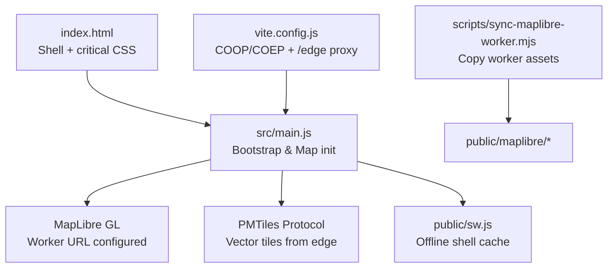
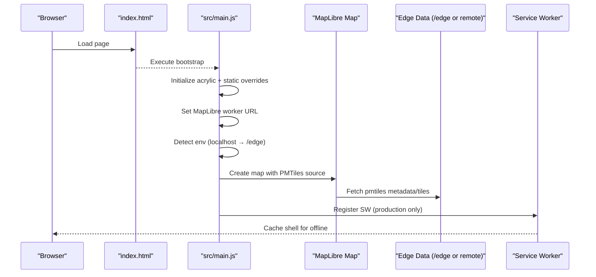
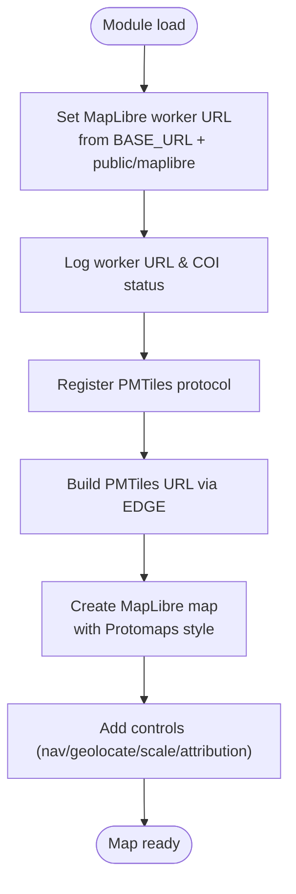
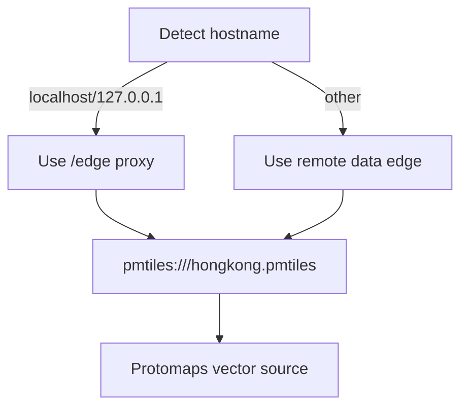
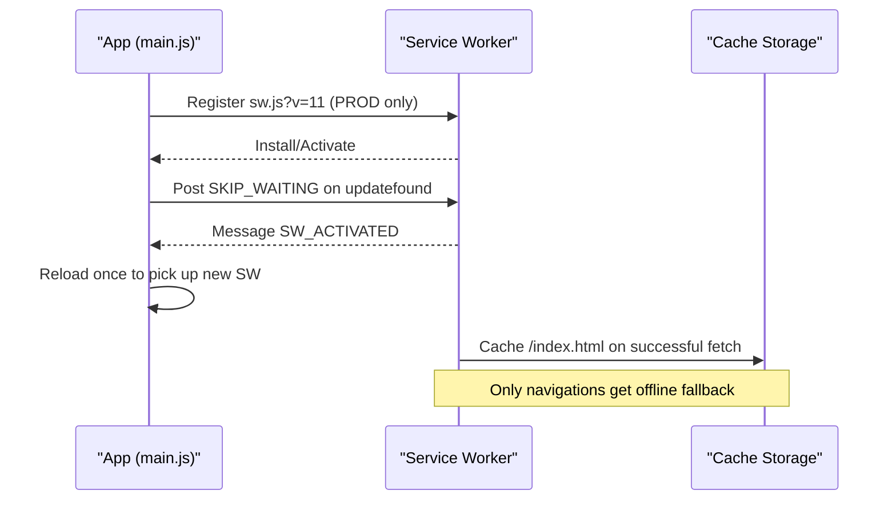
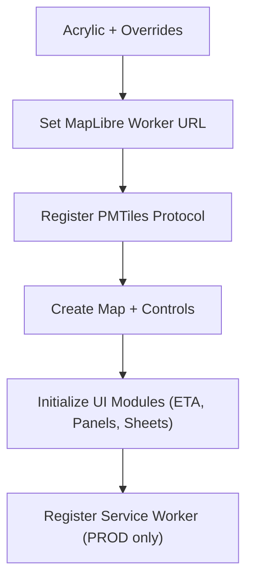
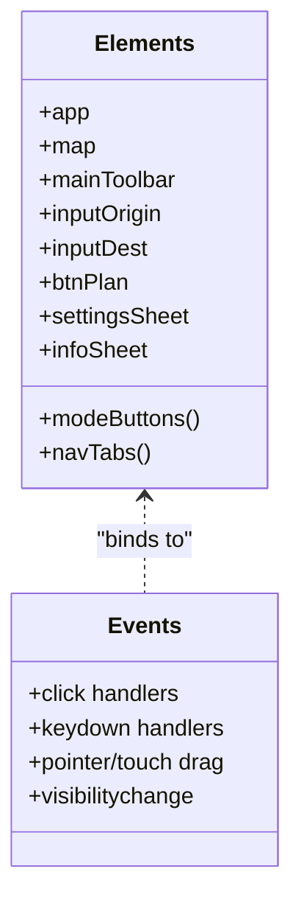
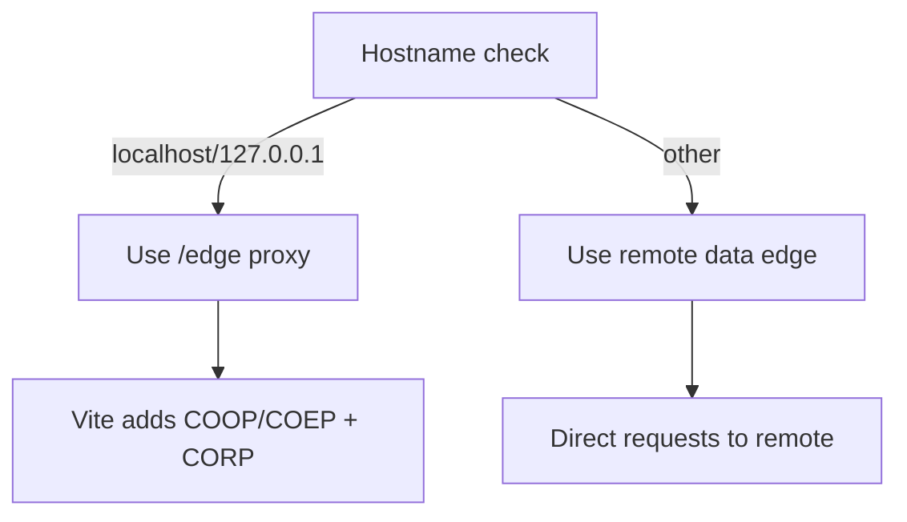
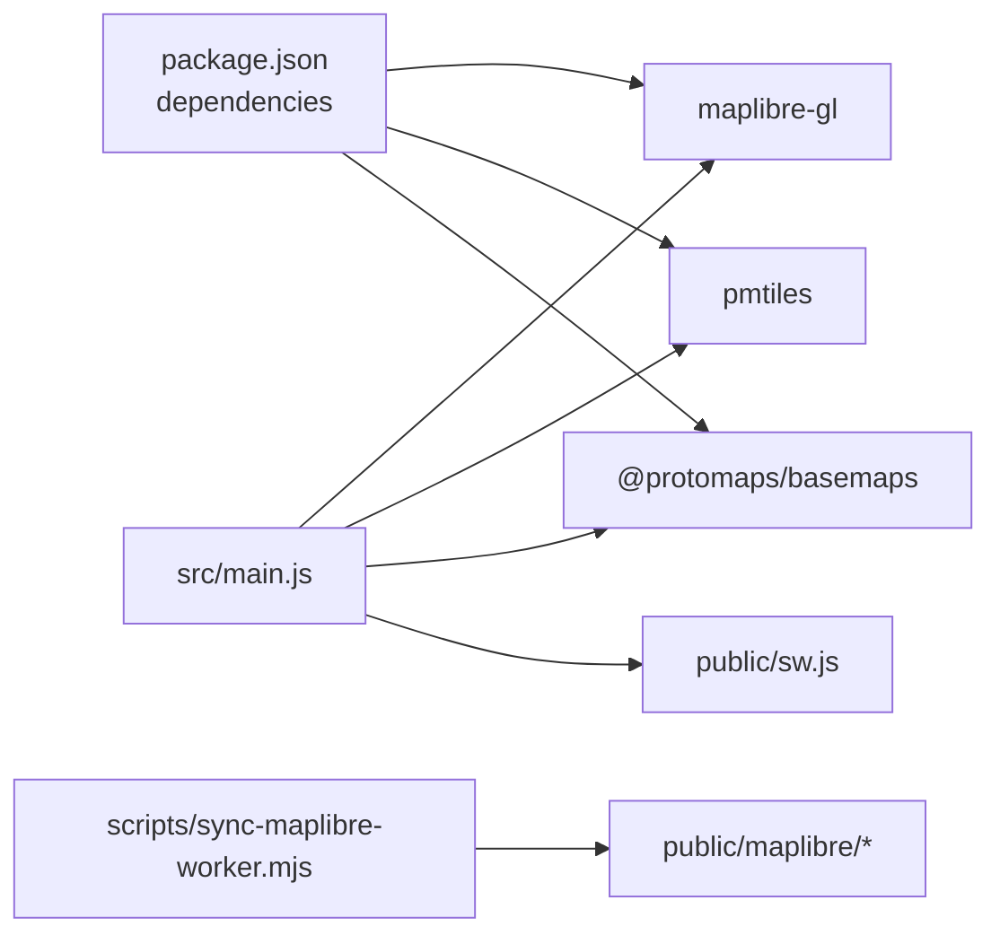

# Application Bootstrap and Initialization

<cite>
**Referenced Files in This Document**
- [main.js](file://src/main.js)
- [index.html](file://index.html)
- [vite.config.js](file://vite.config.js)
- [sw.js](file://public/sw.js)
- [package.json](file://package.json)
- [sync-maplibre-worker.mjs](file://scripts/sync-maplibre-worker.mjs)
</cite>

## Table of Contents
1. [Introduction](#introduction)
2. [Project Structure](#project-structure)
3. [Core Components](#core-components)
4. [Architecture Overview](#architecture-overview)
5. [Detailed Component Analysis](#detailed-component-analysis)
6. [Dependency Analysis](#dependency-analysis)
7. [Performance Considerations](#performance-considerations)
8. [Troubleshooting Guide](#troubleshooting-guide)
9. [Conclusion](#conclusion)

## Introduction
This document explains how MorganTraveler boots and initializes at runtime, focusing on the main entry point that orchestrates MapLibre GL map setup with a custom worker configuration, PMTiles vector tile delivery, service worker registration for offline support, environment detection (development vs production), edge proxy behavior, DOM element management, event wiring, and module initialization order. It also provides examples of how deployment environments and configuration options affect startup behavior.

## Project Structure
The application is a Vite-based PWA:
- The HTML shell defines the root container and critical styles to avoid blank screens during asset loading.
- The JavaScript bootstrap lives in the main module and wires up the map, data sources, UI, and service worker.
- A build-time script ensures MapLibre’s worker files are available under a stable public path.
- The development server configures cross-origin isolation headers and proxies external services behind same-origin endpoints for local development.
- A minimal service worker caches only the HTML shell for offline navigation fallbacks.

**Diagram sources**
- [index.html:1-106](file://index.html#L1-L106)
- [main.js:177-210](file://src/main.js#L177-L210)
- [main.js:1997-2024](file://src/main.js#L1997-L2024)
- [sw.js:1-87](file://public/sw.js#L1-L87)
- [sync-maplibre-worker.mjs:1-27](file://scripts/sync-maplibre-worker.mjs#L1-L27)
- [vite.config.js:111-120](file://vite.config.js#L111-L120)
- [vite.config.js:773-804](file://vite.config.js#L773-L804)

**Section sources**
- [index.html:1-106](file://index.html#L1-L106)
- [package.json:1-37](file://package.json#L1-L37)

## Core Components
- MapLibre GL map instance with a Protomaps basemap served via PMTiles.
- Custom MapLibre worker URL pointing to copied worker modules in public/.
- PMTiles protocol registration and tile source URL construction using an edge origin.
- Environment-aware edge proxy selection (local dev uses /edge; production uses remote).
- Service worker registration limited to production builds with update/reload handling.
- DOM element registry and event bindings for UI interactions.
- Build-time synchronization of MapLibre worker files to ensure correct resolution.

**Section sources**
- [main.js:177-210](file://src/main.js#L177-L210)
- [main.js:1997-2024](file://src/main.js#L1997-L2024)
- [main.js:12692-12760](file://src/main.js#L12692-L12760)
- [sync-maplibre-worker.mjs:1-27](file://scripts/sync-maplibre-worker.mjs#L1-L27)
- [vite.config.js:111-120](file://vite.config.js#L111-L120)
- [vite.config.js:773-804](file://vite.config.js#L773-L804)

## Architecture Overview
At runtime, the browser loads index.html, which includes the application shell and critical CSS. The main module then:
1. Initializes acrylic lighting effects and static overrides.
2. Configures MapLibre’s worker URL to a stable public path.
3. Determines the data edge origin based on hostname (dev vs production).
4. Registers the PMTiles protocol and constructs the tile source URL.
5. Creates the MapLibre map with a Protomaps style sourced from PMTiles.
6. Adds controls (navigation, geolocation, scale, attribution) and computes visible padding.
7. Wires UI elements and events for search, routing, ETA, and panels.
8. Registers the service worker only in production and handles updates.

**Diagram sources**
- [main.js:177-210](file://src/main.js#L177-L210)
- [main.js:1997-2024](file://src/main.js#L1997-L2024)
- [main.js:12692-12760](file://src/main.js#L12692-L12760)
- [vite.config.js:773-804](file://vite.config.js#L773-L804)
- [sw.js:1-87](file://public/sw.js#L1-L87)

## Detailed Component Analysis

### MapLibre GL Map Initialization and Custom Worker Configuration
- The main module sets a fixed worker URL derived from the base URL and points it to the copied worker file in public/maplibre. This avoids Vite prebundle rewriting issues that would otherwise resolve to a missing path.
- After setting the worker URL, the code logs the resolved worker URL and cross-origin isolation status for debugging.
- The PMTiles protocol is registered and a tile source URL is constructed using the computed edge origin.
- The MapLibre map is created with a Protomaps dark style, using the PMTiles source and appropriate glyphs/sprite URLs. Controls are added conditionally based on device capabilities.

**Diagram sources**
- [main.js:194-200](file://src/main.js#L194-L200)
- [main.js:1997-2024](file://src/main.js#L1997-L2024)

**Section sources**
- [main.js:194-200](file://src/main.js#L194-L200)
- [main.js:1997-2024](file://src/main.js#L1997-L2024)
- [sync-maplibre-worker.mjs:1-27](file://scripts/sync-maplibre-worker.mjs#L1-L27)

### PMTiles Protocol Setup for Vector Tile Delivery
- The PMTiles protocol is instantiated with metadata enabled and registered under the “pmtiles” scheme.
- The tile source URL uses the pmtiles scheme and points to either a local /edge proxy (in development) or the remote data edge (in production).
- The edge origin is determined by checking the hostname; localhost and 127.0.0.1 route through /edge to satisfy COEP require-corp constraints locally.

**Diagram sources**
- [main.js:202-210](file://src/main.js#L202-L210)
- [main.js:1997-2024](file://src/main.js#L1997-L2024)
- [vite.config.js:791-804](file://vite.config.js#L791-L804)

**Section sources**
- [main.js:202-210](file://src/main.js#L202-L210)
- [main.js:1997-2024](file://src/main.js#L1997-L2024)
- [vite.config.js:791-804](file://vite.config.js#L791-L804)

### Service Worker Registration for Offline Functionality
- The service worker is registered only when running in production builds. In development, any existing registrations are cleared to avoid interference with local graph fetches under COEP require-corp.
- On load, the app registers sw.js with a query-busted URL to force re-fetching the latest version. It listens for controller changes and messages to trigger a reload once a new SW activates.
- The service worker itself implements a minimal strategy: it intercepts navigations and caches the HTML shell for offline cold starts, while leaving other assets to the browser’s default caching.

**Diagram sources**
- [main.js:12692-12760](file://src/main.js#L12692-L12760)
- [sw.js:1-87](file://public/sw.js#L1-L87)

**Section sources**
- [main.js:12692-12760](file://src/main.js#L12692-L12760)
- [sw.js:1-87](file://public/sw.js#L1-L87)

### Dependency Loading Sequence and Module Initialization Order
- Early initialization steps include acrylic lighting and static overrides.
- MapLibre worker URL is set before creating the map instance.
- PMTiles protocol is registered before constructing the map style and sources.
- The map is created with the PMTiles source and controls are added afterward.
- UI modules initialize after the map exists, including ETA route search, panel behaviors, and sheet interactions.
- Finally, service worker registration occurs late in the bootstrap sequence, gated by production mode.

**Diagram sources**
- [main.js:177-210](file://src/main.js#L177-L210)
- [main.js:1997-2024](file://src/main.js#L1997-L2024)
- [main.js:12192-12224](file://src/main.js#L12192-L12224)
- [main.js:12692-12760](file://src/main.js#L12692-L12760)

**Section sources**
- [main.js:177-210](file://src/main.js#L177-L210)
- [main.js:1997-2024](file://src/main.js#L1997-L2024)
- [main.js:12192-12224](file://src/main.js#L12192-L12224)
- [main.js:12692-12760](file://src/main.js#L12692-L12760)

### DOM Element Management System and Event Listener Setup
- A centralized element registry collects references to key UI nodes (map container, toolbar, inputs, sheets, buttons).
- Event listeners are attached for:
  - Mode switching between Nearby and Trip Plan.
  - Search expansion and input handling for ETA routes.
  - Panel open/close and detail dock behavior.
  - Profile menu toggling and settings/info navigation.
  - Mobile sheet grabber drag-and-snap interactions.
  - Keyboard shortcuts (Escape to close sheets/pages).
- Visibility change handlers refresh trip ETAs when returning to the tab.

**Diagram sources**
- [main.js:214-295](file://src/main.js#L214-L295)
- [main.js:12266-12304](file://src/main.js#L12266-L12304)
- [main.js:12331-12347](file://src/main.js#L12331-L12347)
- [main.js:12359-12574](file://src/main.js#L12359-L12574)
- [main.js:12661-12682](file://src/main.js#L12661-L12682)

**Section sources**
- [main.js:214-295](file://src/main.js#L214-L295)
- [main.js:12266-12304](file://src/main.js#L12266-L12304)
- [main.js:12331-12347](file://src/main.js#L12331-L12347)
- [main.js:12359-12574](file://src/main.js#L12359-L12574)
- [main.js:12661-12682](file://src/main.js#L12661-L12682)

### Environment Detection and Edge Proxy Configuration
- Development detection checks the hostname to decide whether to use the local /edge proxy or the remote data edge.
- The Vite dev server adds COOP/COEP headers and proxies /edge to the remote data edge, injecting CORP/CORS headers to allow cross-origin resource loading under COEP require-corp.
- Additional proxies exist for geocoding and ETA APIs to simplify CORS and caching behavior in development.

**Diagram sources**
- [main.js:202-210](file://src/main.js#L202-L210)
- [vite.config.js:111-120](file://vite.config.js#L111-L120)
- [vite.config.js:773-804](file://vite.config.js#L773-L804)

**Section sources**
- [main.js:202-210](file://src/main.js#L202-L210)
- [vite.config.js:111-120](file://vite.config.js#L111-L120)
- [vite.config.js:773-804](file://vite.config.js#L773-L804)

### Examples of Deployment Environments and Configuration Options
- Local development:
  - Uses /edge proxy for PMTiles and other APIs.
  - Vite serves with COEP require-corp and CORP headers.
  - Service worker registrations are cleared to avoid blocking local graph loads.
- Production:
  - PMTiles and metadata are fetched directly from the remote data edge.
  - Service worker is registered with a versioned URL and update flow triggers a reload.
  - Cross-origin isolation headers remain required for WASM and shared memory usage.

**Section sources**
- [main.js:202-210](file://src/main.js#L202-L210)
- [main.js:12692-12760](file://src/main.js#L12692-L12760)
- [vite.config.js:773-804](file://vite.config.js#L773-L804)

## Dependency Analysis
- Build-time dependency:
  - The postinstall/predev/prebuild scripts copy MapLibre worker files into public/maplibre to ensure stable same-origin resolution.
- Runtime dependencies:
  - MapLibre GL for rendering and controls.
  - PMTiles client for vector tile delivery.
  - Protomaps basemaps for style layers.
  - Optional service worker for offline shell caching.

**Diagram sources**
- [package.json:27-31](file://package.json#L27-L31)
- [sync-maplibre-worker.mjs:1-27](file://scripts/sync-maplibre-worker.mjs#L1-L27)
- [main.js:1-16](file://src/main.js#L1-L16)
- [main.js:1997-2024](file://src/main.js#L1997-L2024)
- [sw.js:1-87](file://public/sw.js#L1-L87)

**Section sources**
- [package.json:1-37](file://package.json#L1-L37)
- [sync-maplibre-worker.mjs:1-27](file://scripts/sync-maplibre-worker.mjs#L1-L27)
- [main.js:1-16](file://src/main.js#L1-L16)
- [main.js:1997-2024](file://src/main.js#L1997-L2024)
- [sw.js:1-87](file://public/sw.js#L1-L87)

## Performance Considerations
- Cross-origin isolation (COOP/COEP) enables efficient WASM and shared memory usage for routing and map workers.
- Using PMTiles reduces network overhead by serving compressed vector tiles from a single endpoint.
- The service worker caches only the HTML shell to minimize storage and avoid interfering with large graph fetches in development.
- Visible padding calculations prevent camera movements from centering under UI chrome, improving perceived responsiveness.

[No sources needed since this section provides general guidance]

## Troubleshooting Guide
- Blank map or missing worker:
  - Ensure the MapLibre worker files are present under public/maplibre (run the sync script).
  - Verify the worker URL resolves correctly and logs indicate the expected path.
- PMTiles not loading:
  - Confirm the edge origin is correct for your environment (localhost uses /edge; production uses remote).
  - Check that the dev server proxies /edge and injects CORP/CORS headers.
- Service worker issues:
  - In development, confirm no stale SW is registered; the app clears registrations automatically.
  - In production, verify the SW is registered with a versioned URL and that updates trigger reloads.
- CORS/COEP errors:
  - Ensure COOP/COEP headers are set by the dev server and that proxied responses include CORP where needed.

**Section sources**
- [sync-maplibre-worker.mjs:1-27](file://scripts/sync-maplibre-worker.mjs#L1-L27)
- [main.js:194-200](file://src/main.js#L194-L200)
- [main.js:202-210](file://src/main.js#L202-L210)
- [vite.config.js:111-120](file://vite.config.js#L111-L120)
- [vite.config.js:791-804](file://vite.config.js#L791-L804)
- [main.js:12692-12760](file://src/main.js#L12692-L12760)

## Conclusion
MorganTraveler’s bootstrap process carefully sequences initialization steps to ensure robust startup across environments. It configures MapLibre’s worker for reliable rendering, sets up PMTiles for efficient vector tile delivery, detects the deployment environment to choose the correct data edge, and registers a minimal service worker for offline shell support. The centralized DOM registry and comprehensive event wiring provide a responsive UI, while build-time scripts and dev server configuration streamline local development and maintain compatibility with strict cross-origin policies.