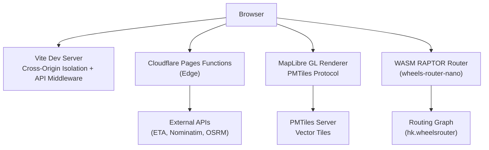
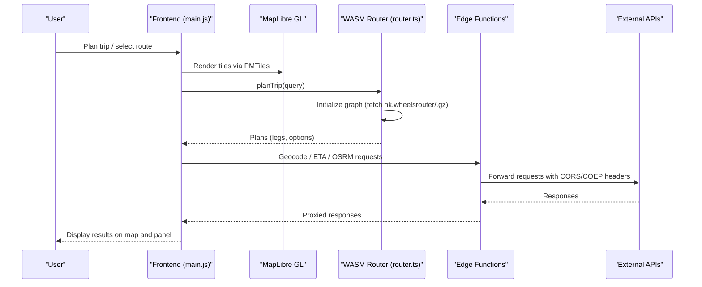
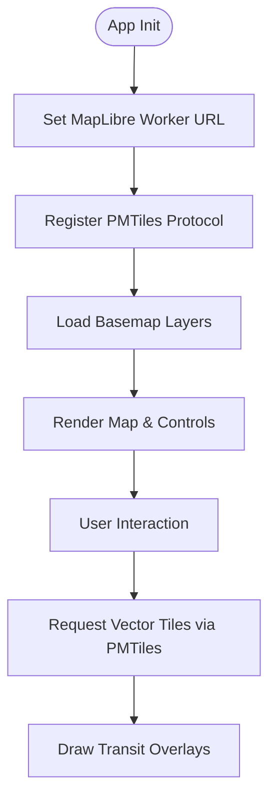
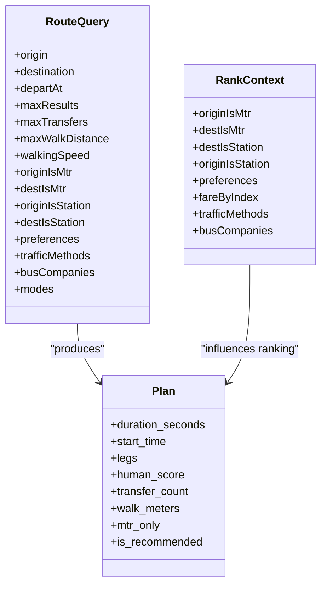
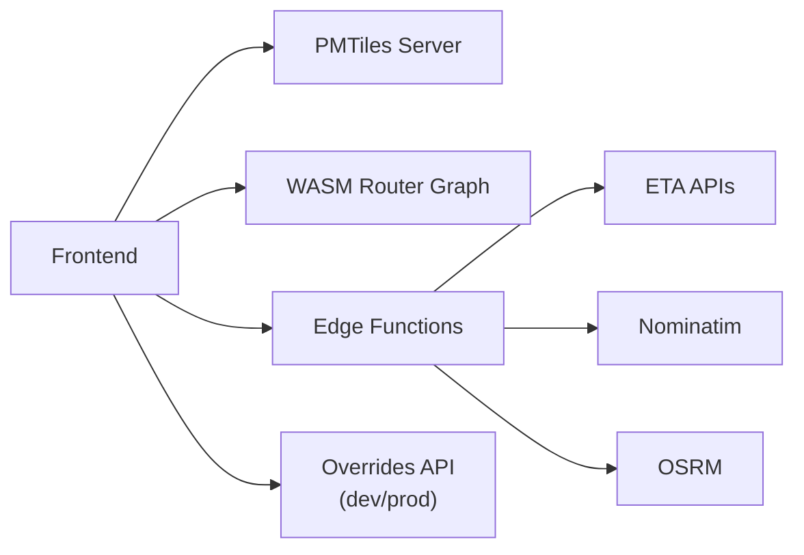
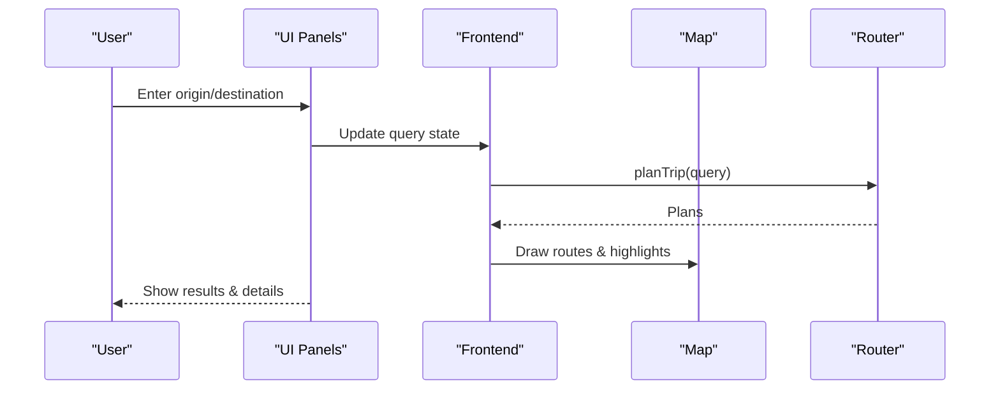
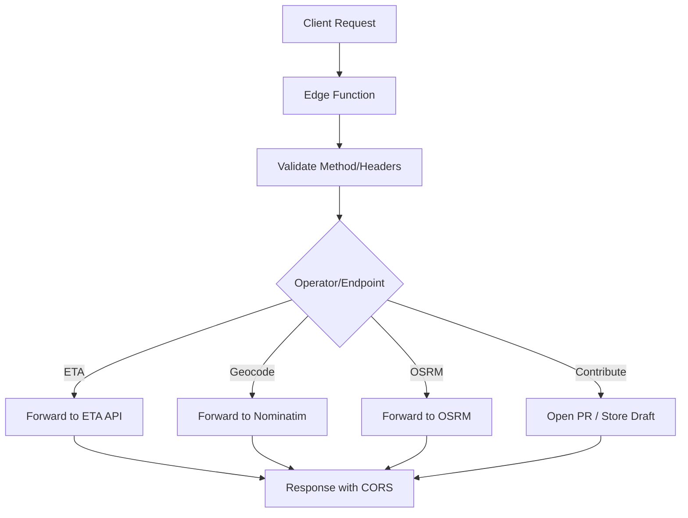
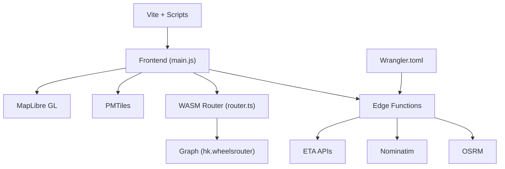

# Core Architecture

<cite>
**Referenced Files in This Document**
- [index.html](file://index.html)
- [package.json](file://package.json)
- [src/main.js](file://src/main.js)
- [src/router.ts](file://src/router.ts)
- [public/sw.js](file://public/sw.js)
- [functions/eta/[[path]].js](file://functions/eta/[[path]].js)
- [functions/geocode/[[path]].js](file://functions/geocode/[[path]].js)
- [functions/osrm/[[path]].js](file://functions/osrm/[[path]].js)
- [functions/api/contribute-path.js](file://functions/api/contribute-path.js)
- [wrangler.toml](file://wrangler.toml)
- [vite.config.js](file://vite.config.js)
- [scripts/sync-maplibre-worker.mjs](file://scripts/sync-maplibre-worker.mjs)
</cite>

## Table of Contents
1. [Introduction](#introduction)
2. [Project Structure](#project-structure)
3. [Core Components](#core-components)
4. [Architecture Overview](#architecture-overview)
5. [Detailed Component Analysis](#detailed-component-analysis)
6. [Dependency Analysis](#dependency-analysis)
7. [Performance Considerations](#performance-considerations)
8. [Troubleshooting Guide](#troubleshooting-guide)
9. [Conclusion](#conclusion)
10. [Appendices](#appendices)

## Introduction
MORGAN Travelers is a Hong Kong transit PWA that combines a modular JavaScript/TypeScript frontend, MapLibre GL map rendering, and an in-browser WebAssembly routing engine (RAPTOR via wheels-router-nano). It uses PMTiles for efficient vector tile delivery, Cloudflare Pages Functions as edge proxies for geocoding, ETA data, and OSRM densification, and a minimal service worker to support offline navigation fallbacks. The system is designed to handle dense transit networks with low-latency routing, responsive UI, and robust data pipelines.

## Project Structure
The application follows a clear separation between client-side logic, edge functions, build tooling, and static assets:
- Frontend: index.html shell, src modules for map, routing, UI state, and data management
- Edge: functions/* for proxying external APIs and handling contributions
- Build: vite.config.js with dev server middleware and cross-origin isolation headers; scripts to sync MapLibre workers and build fares
- Runtime config: wrangler.toml for Cloudflare Pages deployment settings
- Offline: public/sw.js for minimal offline navigation fallback

**Diagram sources**
- [vite.config.js:111-169](file://vite.config.js#L111-L169)
- [functions/eta/[[path]].js:1-86](file://functions/eta/[[path]].js#L1-L86)
- [functions/geocode/[[path]].js:1-29](file://functions/geocode/[[path]].js#L1-L29)
- [functions/osrm/[[path]].js:1-25](file://functions/osrm/[[path]].js#L1-L25)
- [src/main.js:1997-1999](file://src/main.js#L1997-L1999)
- [src/router.ts:179-221](file://src/router.ts#L179-L221)

**Section sources**
- [index.html:1-80](file://index.html#L1-L80)
- [package.json:1-37](file://package.json#L1-L37)
- [vite.config.js:773-800](file://vite.config.js#L773-L800)
- [wrangler.toml:1-38](file://wrangler.toml#L1-L38)

## Core Components
- Map rendering engine: MapLibre GL with custom protocol for PMTiles vector tiles
- Routing engine: WASM-based RAPTOR (wheels-router-nano) initialized from remote or local graph
- Data management: GTFS-derived routing graph, PMTiles basemap/vector layers, ETA live data, fare estimation, MTR/LRT/bus route overlays
- User interface: Panel, sheets, search, trip planning, pinned routes, contribution workflow
- Edge computing: Cloudflare Pages Functions proxying ETA, geocoding, OSRM, and contribution intake
- Offline support: Minimal service worker caching strategy for navigation fallback

**Section sources**
- [src/main.js:1-175](file://src/main.js#L1-L175)
- [src/router.ts:1-120](file://src/router.ts#L1-L120)
- [public/sw.js:1-87](file://public/sw.js#L1-L87)
- [functions/eta/[[path]].js:1-86](file://functions/eta/[[path]].js#L1-L86)
- [functions/geocode/[[path]].js:1-29](file://functions/geocode/[[path]].js#L1-L29)
- [functions/osrm/[[path]].js:1-25](file://functions/osrm/[[path]].js#L1-L25)
- [functions/api/contribute-path.js:1-31](file://functions/api/contribute-path.js#L1-L31)

## Architecture Overview
High-level flow:
- The browser loads the app shell and initializes MapLibre GL with PMTiles protocol pointing to a PMTiles server
- The WASM router is initialized by fetching hk.wheelsrouter (or .gz) from a data origin or local path
- User interactions trigger routing queries through the router wrapper, which applies human-centric ranking rules and filters
- Edge functions proxy external services (ETA, geocoding, OSRM) while setting CORS and COEP-safe headers
- Service worker caches the HTML for offline navigation fallback

**Diagram sources**
- [src/main.js:1997-1999](file://src/main.js#L1997-L1999)
- [src/router.ts:207-249](file://src/router.ts#L207-L249)
- [functions/eta/[[path]].js:31-85](file://functions/eta/[[path]].js#L31-L85)
- [functions/geocode/[[path]].js:5-28](file://functions/geocode/[[path]].js#L5-L28)
- [functions/osrm/[[path]].js:5-24](file://functions/osrm/[[path]].js#L5-L24)

## Detailed Component Analysis

### Map Rendering Engine (MapLibre GL + PMTiles)
- Initializes MapLibre GL with a custom PMTiles protocol to stream vector tiles efficiently
- Uses Protomaps basemaps and named flavors for consistent styling
- Configures worker URL for MapLibre v6 module worker to avoid Vite prebundle issues
- Adds controls (navigation, geolocation, scale, attribution) and integrates with UI panels

**Diagram sources**
- [src/main.js:190-211](file://src/main.js#L190-L211)
- [src/main.js:1997-1999](file://src/main.js#L1997-L1999)
- [scripts/sync-maplibre-worker.mjs:1-27](file://scripts/sync-maplibre-worker.mjs#L1-L27)

**Section sources**
- [src/main.js:1-175](file://src/main.js#L1-L175)
- [scripts/sync-maplibre-worker.mjs:1-27](file://scripts/sync-maplibre-worker.mjs#L1-L27)

### Routing Algorithm (RAPTOR via WASM)
- Loads wheels-router-nano and fetches the binary graph from multiple candidates (local, configured, default, gzipped)
- Provides query interfaces with preferences (fastest/simplest/cheapest), traffic methods, bus company filters, and mode hints
- Applies human-centric ranking: penalize bus-to-bus transfers, prefer MTR-only plans when both OD are stations, discourage long outdoor interchanges, bonus for free links and LRT usage
- Exposes plan analysis utilities (transfers, walk meters, MTR street walks, free interchange counts)

**Diagram sources**
- [src/router.ts:35-98](file://src/router.ts#L35-L98)
- [src/router.ts:121-177](file://src/router.ts#L121-L177)

**Section sources**
- [src/router.ts:179-249](file://src/router.ts#L179-L249)
- [src/router.ts:251-303](file://src/router.ts#L251-L303)
- [src/router.ts:468-563](file://src/router.ts#L468-L563)
- [src/router.ts:646-800](file://src/router.ts#L646-L800)

### Data Management Systems
- PMTiles vector tiles: Efficient streaming of basemap and transit features
- Routing graph: Binary format optimized for RAPTOR; supports local fallback and compressed variants
- ETA integration: Edge proxy forwards operator-specific endpoints with CORS and cache headers
- Geocoding: Edge proxy to Nominatim with safe headers and caching
- Bus shapes and overrides: Local development merges and production serving via API endpoints

**Diagram sources**
- [src/main.js:1997-1999](file://src/main.js#L1997-L1999)
- [src/router.ts:179-221](file://src/router.ts#L179-L221)
- [functions/eta/[[path]].js:15-29](file://functions/eta/[[path]].js#L15-L29)
- [functions/geocode/[[path]].js:5-28](file://functions/geocode/[[path]].js#L5-L28)
- [functions/osrm/[[path]].js:5-24](file://functions/osrm/[[path]].js#L5-L24)
- [vite.config.js:133-169](file://vite.config.js#L133-L169)

**Section sources**
- [functions/eta/[[path]].js:1-86](file://functions/eta/[[path]].js#L1-L86)
- [functions/geocode/[[path]].js:1-29](file://functions/geocode/[[path]].js#L1-L29)
- [functions/osrm/[[path]].js:1-25](file://functions/osrm/[[path]].js#L1-L25)
- [vite.config.js:133-169](file://vite.config.js#L133-L169)

### User Interface Components
- App shell with full-bleed map and side panel/drawer
- Trip planning inputs (origin/destination, preferences, departure time)
- ETA browsing with pinned routes and live status
- Contribution sheet for editing route paths and submitting PRs
- Accessibility attributes and keyboard shortcuts

**Diagram sources**
- [index.html:76-800](file://index.html#L76-L800)
- [src/main.js:213-295](file://src/main.js#L213-L295)

**Section sources**
- [index.html:76-800](file://index.html#L76-L800)
- [src/main.js:213-295](file://src/main.js#L213-L295)

### Edge Computing Functions
- ETA proxy: Routes operator-specific endpoints with CORS and cache control
- Geocode proxy: Safe same-origin access to Nominatim with caching
- OSRM proxy: Densifies bus routes via OSRM with CORS and caching
- Contribution intake: Handles OAuth/bot modes, validates drafts, opens PRs, and stores pending files

**Diagram sources**
- [functions/eta/[[path]].js:31-85](file://functions/eta/[[path]].js#L31-L85)
- [functions/geocode/[[path]].js:5-28](file://functions/geocode/[[path]].js#L5-L28)
- [functions/osrm/[[path]].js:5-24](file://functions/osrm/[[path]].js#L5-L24)
- [functions/api/contribute-path.js:1-31](file://functions/api/contribute-path.js#L1-L31)

**Section sources**
- [functions/eta/[[path]].js:1-86](file://functions/eta/[[path]].js#L1-L86)
- [functions/geocode/[[path]].js:1-29](file://functions/geocode/[[path]].js#L1-L29)
- [functions/osrm/[[path]].js:1-25](file://functions/osrm/[[path]].js#L1-L25)
- [functions/api/contribute-path.js:1-31](file://functions/api/contribute-path.js#L1-L31)

## Dependency Analysis
Key dependencies and relationships:
- Frontend depends on MapLibre GL and PMTiles for rendering
- Routing depends on wheels-router-nano WASM and GTFS-derived graph
- Edge functions depend on external APIs (ETA providers, Nominatim, OSRM)
- Build pipeline depends on Vite and Node scripts to sync workers and prepare assets
- Deployment configuration depends on Cloudflare Pages and Wrangler

**Diagram sources**
- [src/main.js:1-175](file://src/main.js#L1-L175)
- [src/router.ts:179-221](file://src/router.ts#L179-L221)
- [functions/eta/[[path]].js:15-29](file://functions/eta/[[path]].js#L15-L29)
- [functions/geocode/[[path]].js:5-28](file://functions/geocode/[[path]].js#L5-L28)
- [functions/osrm/[[path]].js:5-24](file://functions/osrm/[[path]].js#L5-L24)
- [vite.config.js:773-800](file://vite.config.js#L773-L800)
- [wrangler.toml:1-38](file://wrangler.toml#L1-L38)

**Section sources**
- [package.json:27-35](file://package.json#L27-L35)
- [vite.config.js:773-800](file://vite.config.js#L773-L800)
- [wrangler.toml:1-38](file://wrangler.toml#L1-L38)

## Performance Considerations
- PMTiles streaming reduces payload size and improves tile loading performance for dense maps
- WASM RAPTOR runs in-browser, minimizing server load and latency for routing queries
- Edge functions add caching headers to reduce repeated requests to external APIs
- Cross-origin isolation headers enable SharedArrayBuffer usage for better WASM performance
- Service worker minimizes overhead by only intercepting navigations for offline fallback

[No sources needed since this section provides general guidance]

## Troubleshooting Guide
Common issues and resolutions:
- MapLibre worker resolution errors: Ensure MapLibre worker files are copied to public/maplibre and setWorkerUrl points to correct path
- CORS/COEP failures: Verify edge functions set appropriate headers and dev server proxies enforce CORP
- Offline behavior: Confirm service worker activates and caches index.html for navigation fallback
- Routing graph load failures: Check candidate URLs and network availability for hk.wheelsrouter(.gz)

**Section sources**
- [scripts/sync-maplibre-worker.mjs:1-27](file://scripts/sync-maplibre-worker.mjs#L1-L27)
- [vite.config.js:111-169](file://vite.config.js#L111-L169)
- [public/sw.js:11-29](file://public/sw.js#L11-L29)
- [src/router.ts:207-249](file://src/router.ts#L207-L249)

## Conclusion
MORGAN Travelers combines a modern frontend architecture with efficient data delivery and powerful in-browser routing. The use of PMTiles, WASM RAPTOR, and Cloudflare Pages Functions enables scalable performance for Hong Kong’s dense transit network. The design balances user experience, offline resilience, and maintainable code structure across components.

[No sources needed since this section summarizes without analyzing specific files]

## Appendices
- Infrastructure requirements: Node.js for build, Cloudflare Pages for deployment, external APIs for ETA/geocoding/OSRM
- Scalability considerations: Edge caching, PMTiles streaming, WASM routing scalability, and CDN-backed basemap tiles
- Deployment topology: Static site served via Cloudflare Pages with edge functions co-located for low-latency API access

[No sources needed since this section provides general guidance]