# Event System and Communication Patterns

<cite>
**Referenced Files in This Document**
- [main.js](file://src/main.js)
- [acrylic.js](file://src/acrylic.js)
- [eta.js](file://src/eta.js)
- [router.ts](file://src/router.ts)
- [fares.js](file://src/fares.js)
- [mtrLayer.js](file://src/mtrLayer.js)
- [contributePath.js](file://src/contributePath.js)
- [preferences.js](file://src/preferences.js)
- [sw.js](file://public/sw.js)
</cite>

## Table of Contents
1. [Introduction](#introduction)
2. [Project Structure](#project-structure)
3. [Core Components](#core-components)
4. [Architecture Overview](#architecture-overview)
5. [Detailed Component Analysis](#detailed-component-analysis)
6. [Dependency Analysis](#dependency-analysis)
7. [Performance Considerations](#performance-considerations)
8. [Troubleshooting Guide](#troubleshooting-guide)
9. [Conclusion](#conclusion)

## Introduction
This document explains how MorganTraveler coordinates communication between modules using a combination of:
- Native browser events (DOM, window, service worker)
- MapLibre map events
- Module-to-module calls via shared functions and state
- Real-time update streams for ETA data and UI refreshes

The system avoids a global custom event bus; instead, it uses targeted listeners, request-driven updates, and explicit function calls to keep coupling low while maintaining responsiveness for high-frequency interactions like ETA updates and map interactions.

## Project Structure
MorganTraveler is organized into feature modules that communicate through:
- DOM event listeners attached in the main entry point
- MapLibre map event handlers
- Direct imports of module APIs (e.g., router, eta, fares)
- Shared state and helper functions exposed by modules

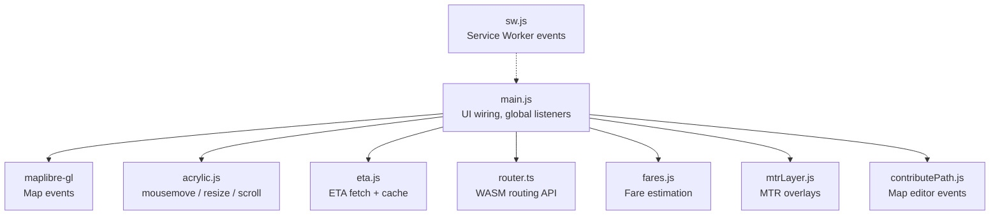

**Diagram sources**
- [main.js:12000-12778](file://src/main.js#L12000-L12778)
- [acrylic.js:1-87](file://src/acrylic.js#L1-L87)
- [eta.js:1-800](file://src/eta.js#L1-L800)
- [router.ts:1-800](file://src/router.ts#L1-L800)
- [fares.js:1-800](file://src/fares.js#L1-L800)
- [mtrLayer.js:1-200](file://src/mtrLayer.js#L1-L200)
- [contributePath.js:2365-2399](file://src/contributePath.js#L2365-L2399)
- [sw.js:1-60](file://public/sw.js#L1-L60)

**Section sources**
- [main.js:12000-12778](file://src/main.js#L12000-L12778)
- [acrylic.js:1-87](file://src/acrylic.js#L1-L87)
- [eta.js:1-800](file://src/eta.js#L1-L800)
- [router.ts:1-800](file://src/router.ts#L1-L800)
- [fares.js:1-800](file://src/fares.js#L1-L800)
- [mtrLayer.js:1-200](file://src/mtrLayer.js#L1-L200)
- [contributePath.js:2365-2399](file://src/contributePath.js#L2365-L2399)
- [sw.js:1-60](file://public/sw.js#L1-L60)

## Core Components
- Main application shell: wires UI controls, global keyboard shortcuts, sheet snapping, and integrates with map and modules.
- Acrylic lighting: tracks mouse movement to update CSS variables on elements.
- ETA module: fetches live ETAs from operator endpoints, caches results, and formats slots for display.
- Router module: initializes WASM RAPTOR engine, plans trips, and provides plan analysis helpers.
- Fares module: loads fare matrices and estimates costs per plan.
- MTR layer module: manages GeoJSON sources/layers and filters them based on active routes.
- Contribute path editor: handles map interactions for editing route paths and visual stops.
- Service worker: intercepts install/activate/fetch/message events for caching and lifecycle control.

**Section sources**
- [main.js:12000-12778](file://src/main.js#L12000-L12778)
- [acrylic.js:1-87](file://src/acrylic.js#L1-L87)
- [eta.js:1-800](file://src/eta.js#L1-L800)
- [router.ts:1-800](file://src/router.ts#L1-L800)
- [fares.js:1-800](file://src/fares.js#L1-L800)
- [mtrLayer.js:1-200](file://src/mtrLayer.js#L1-L200)
- [contributePath.js:2365-2399](file://src/contributePath.js#L2365-L2399)
- [sw.js:1-60](file://public/sw.js#L1-L60)

## Architecture Overview
Communication patterns:
- DOM events drive UI state changes (e.g., search open/close, mode switches).
- MapLibre events trigger geometry updates and layer filtering.
- ETA updates are request-driven with caching; UI refreshes are triggered after data arrives.
- Routing requests are initiated from UI actions; results feed ETA and fare estimations.
- Service worker events manage app lifecycle and resource caching.

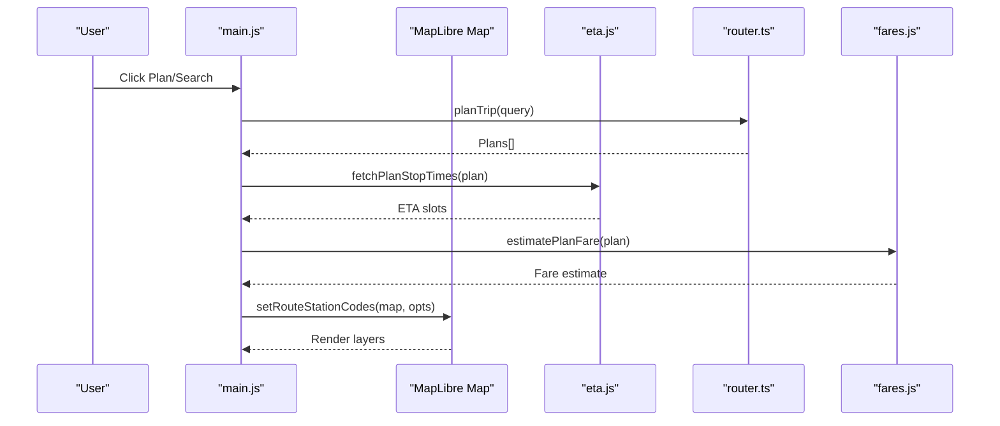

**Diagram sources**
- [main.js:12000-12778](file://src/main.js#L12000-L12778)
- [eta.js:1-800](file://src/eta.js#L1-L800)
- [router.ts:1-800](file://src/router.ts#L1-L800)
- [fares.js:1-800](file://src/fares.js#L1-L800)
- [mtrLayer.js:1-200](file://src/mtrLayer.js#L1-L200)

## Detailed Component Analysis

### DOM and Global Event Wiring (main.js)
- Keyboard shortcuts: Escape closes sheets, trip detail, or dock panels.
- Mode switching: Buttons toggle UI modes and close any open search when needed.
- Sheet snapping: Pointer/touch events compute drag velocity and snap to closed/open/full states.
- ETA search: Input events debounce queries; keydown handles navigation and selection.
- Profile menu: Click outside closes the menu; buttons toggle visibility.

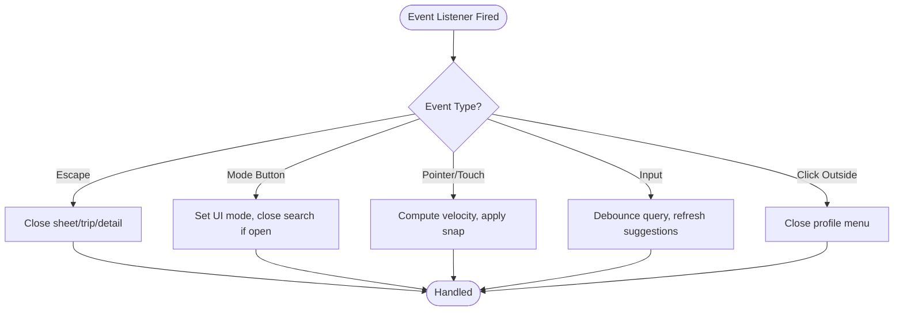

**Diagram sources**
- [main.js:12000-12778](file://src/main.js#L12000-L12778)

**Section sources**
- [main.js:12000-12778](file://src/main.js#L12000-L12778)

### Acrylic Lighting Events (acrylic.js)
- Listens to mousemove on document with passive listener to avoid blocking.
- Schedules recomputation via requestAnimationFrame to batch updates.
- Updates CSS custom properties for each element with data-acrylic attribute.
- Handles scroll/resize to recompute positions when layout changes.

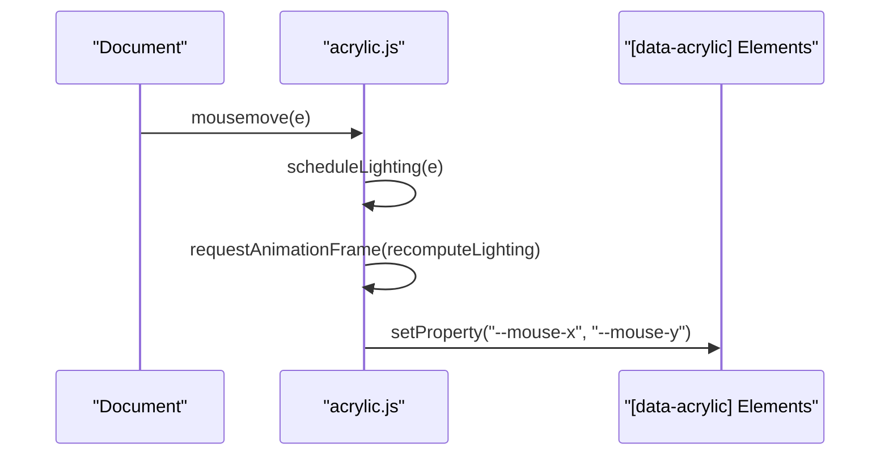

**Diagram sources**
- [acrylic.js:1-87](file://src/acrylic.js#L1-L87)

**Section sources**
- [acrylic.js:1-87](file://src/acrylic.js#L1-L87)

### ETA Stream and Cache (eta.js)
- Fetches JSON from operator endpoints with TTL-based in-memory cache.
- Normalizes timestamps and computes wait minutes.
- Merges live slots with scheduled headway grids to fill gaps.
- Exposes utilities for platform labels, station names, and service windows.

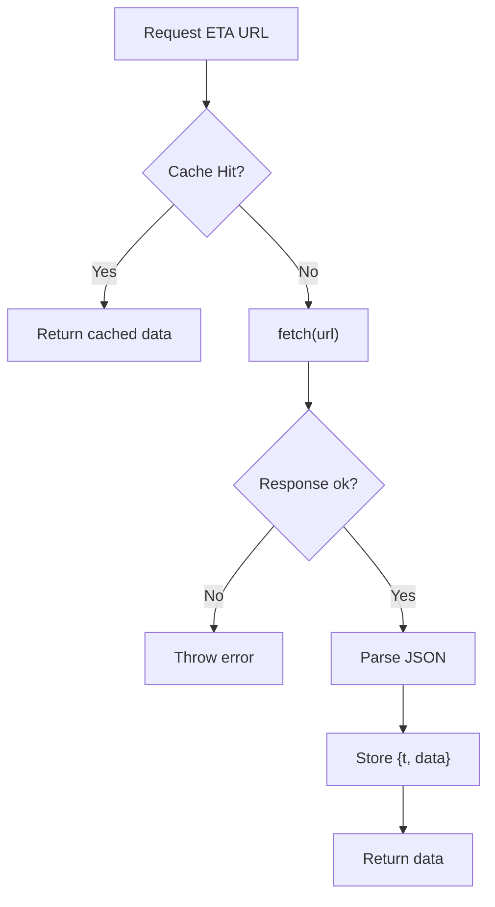

**Diagram sources**
- [eta.js:1-800](file://src/eta.js#L1-L800)

**Section sources**
- [eta.js:1-800](file://src/eta.js#L1-L800)

### Router Initialization and Planning (router.ts)
- Initializes WASM router instance with graph candidates.
- Provides planTrip-like workflows via imported functions in main.
- Analyzes plans for transfers, walk distances, and network preferences.
- Filters plans by traffic methods and bus companies.

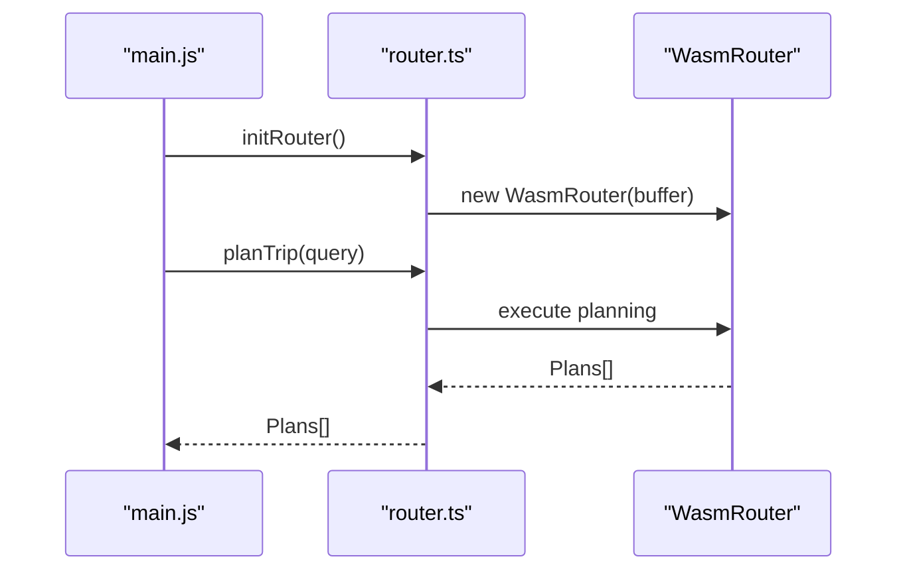

**Diagram sources**
- [router.ts:1-800](file://src/router.ts#L1-L800)

**Section sources**
- [router.ts:1-800](file://src/router.ts#L1-L800)

### Fare Estimation Integration (fares.js)
- Loads fare pack and maps ticket types to matrix keys.
- Resolves station names to IDs and looks up OD fares.
- Applies concessions and special rules (e.g., JoyYou exclusions).
- Estimates per-plan fares for ranking and display.

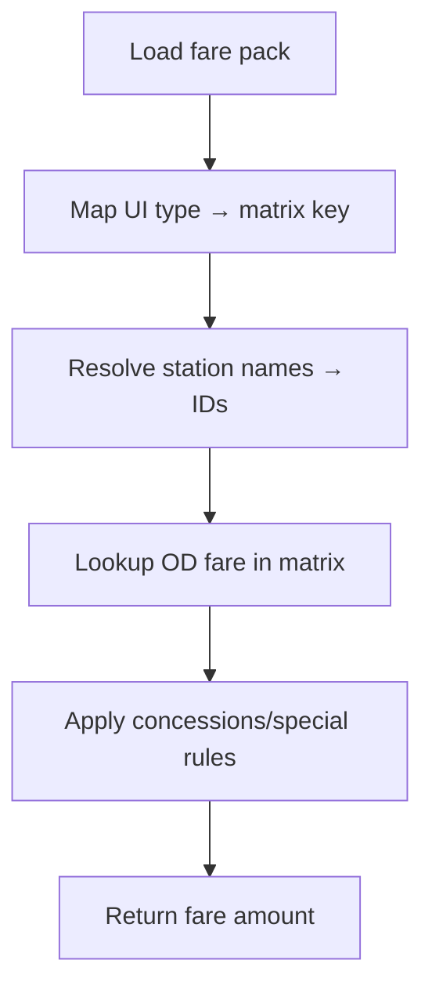

**Diagram sources**
- [fares.js:1-800](file://src/fares.js#L1-L800)

**Section sources**
- [fares.js:1-800](file://src/fares.js#L1-L800)

### MTR Layer Filtering (mtrLayer.js)
- Loads GeoJSON sources for stations, exits, platforms.
- Adds hidden layers until setRouteStationCodes activates specific codes/platforms.
- Uses neverFilter to hide all features until explicitly shown.

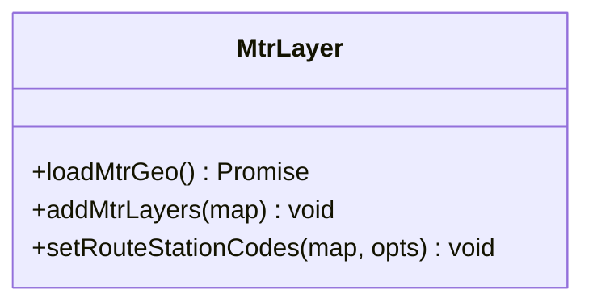

**Diagram sources**
- [mtrLayer.js:1-200](file://src/mtrLayer.js#L1-L200)

**Section sources**
- [mtrLayer.js:1-200](file://src/mtrLayer.js#L1-L200)

### Contribute Path Editor Events (contributePath.js)
- Handles map mousemove for dragging path vertices and visual stops.
- Updates cursor styles based on edit mode and hit testing.
- Paints draft geometry on change.

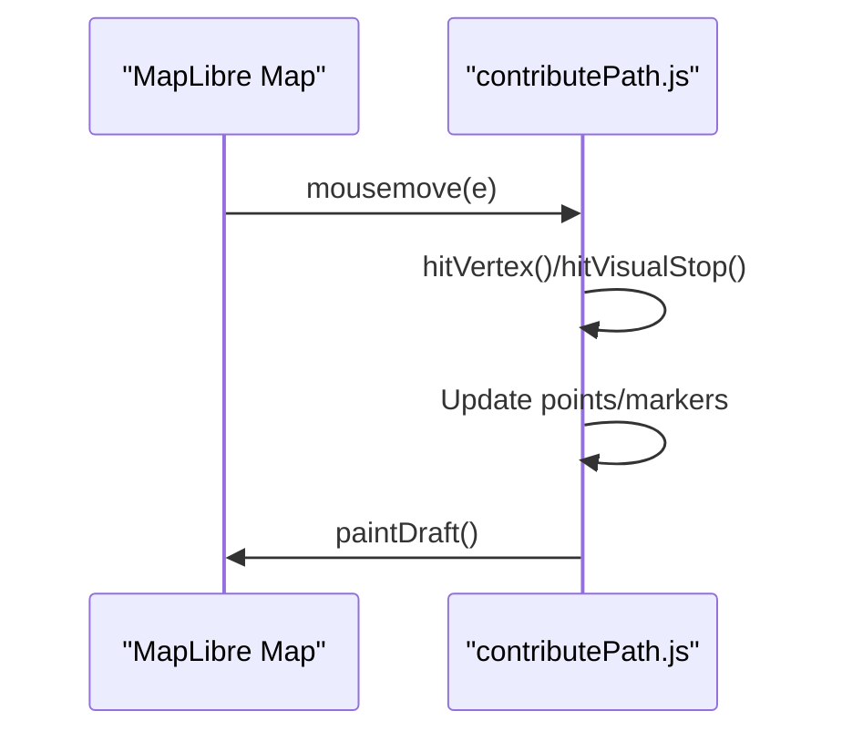

**Diagram sources**
- [contributePath.js:2365-2399](file://src/contributePath.js#L2365-L2399)

**Section sources**
- [contributePath.js:2365-2399](file://src/contributePath.js#L2365-L2399)

### Service Worker Events (sw.js)
- Installs and activates to prepare caches.
- Intercepts messages and fetch events for offline support.
- Coordinates with main app for updates and reloads.

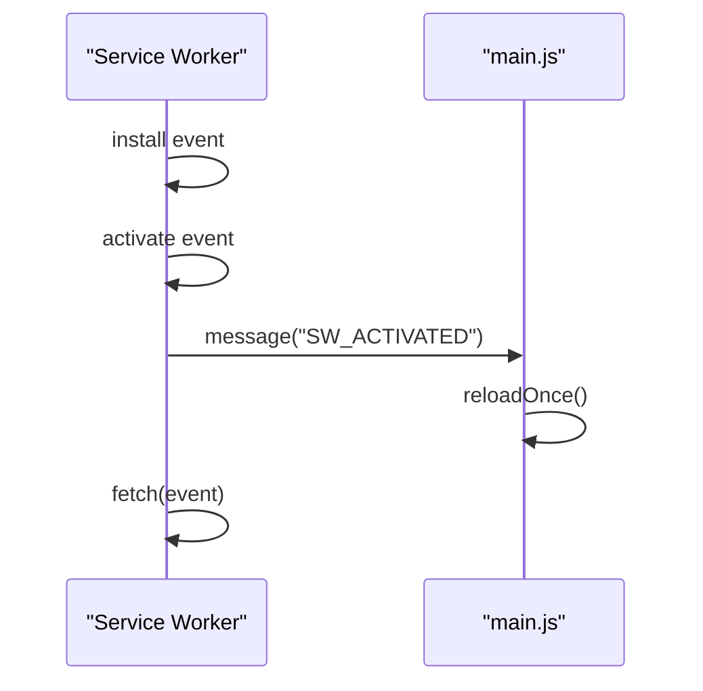

**Diagram sources**
- [sw.js:1-60](file://public/sw.js#L1-L60)

**Section sources**
- [sw.js:1-60](file://public/sw.js#L1-L60)

## Dependency Analysis
- main.js depends on:
  - MapLibre GL for map interactions
  - acrylic.js for lighting effects
  - eta.js for live ETAs
  - router.ts for trip planning
  - fares.js for cost estimation
  - mtrLayer.js for overlay rendering
  - contributePath.js for editor functionality
- Modules communicate via direct function calls rather than a central event bus, reducing coupling and improving testability.

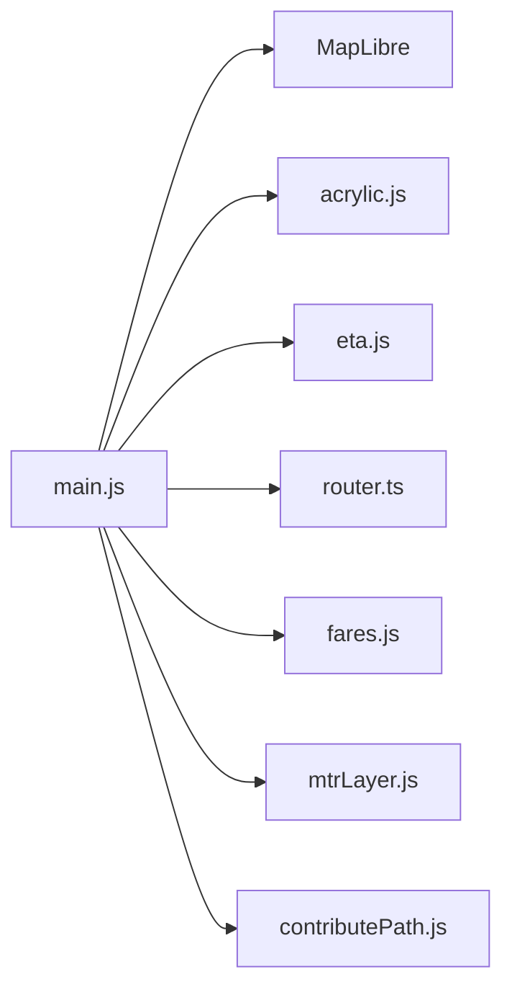

**Diagram sources**
- [main.js:12000-12778](file://src/main.js#L12000-L12778)
- [acrylic.js:1-87](file://src/acrylic.js#L1-L87)
- [eta.js:1-800](file://src/eta.js#L1-L800)
- [router.ts:1-800](file://src/router.ts#L1-L800)
- [fares.js:1-800](file://src/fares.js#L1-L800)
- [mtrLayer.js:1-200](file://src/mtrLayer.js#L1-L200)
- [contributePath.js:2365-2399](file://src/contributePath.js#L2365-L2399)

**Section sources**
- [main.js:12000-12778](file://src/main.js#L12000-L12778)

## Performance Considerations
- ETA updates: Use in-memory cache with TTL to reduce network calls; merge live and scheduled slots to minimize UI churn.
- High-frequency events: Debounce input events (e.g., ETA search), use requestAnimationFrame for lighting updates, and passive listeners for scroll/resize.
- Map interactions: Batch geometry updates and only repaint when necessary; use hit testing to limit processing.
- Service worker: Avoid intercepting large graph fetches in development; register SW only in production builds.

[No sources needed since this section provides general guidance]

## Troubleshooting Guide
- ETA fetch failures: Check operator endpoint status; errors are thrown with HTTP status and URL for debugging.
- Router initialization: Ensure graph files are accessible; fallback URLs are tried before throwing an error.
- Fare data missing: Build step required to generate fare matrices; errors indicate missing build artifacts.
- Service worker issues: In development, SW may be unregistered to prevent blocking local graph loads.

**Section sources**
- [eta.js:1-800](file://src/eta.js#L1-L800)
- [router.ts:1-800](file://src/router.ts#L1-L800)
- [fares.js:1-800](file://src/fares.js#L1-L800)
- [main.js:12692-12760](file://src/main.js#L12692-L12760)

## Conclusion
MorganTraveler’s event-driven architecture relies on targeted DOM and map events, request-driven real-time updates, and explicit module APIs. This approach ensures low coupling, predictable data flows, and scalable performance for high-frequency interactions like ETA updates and map manipulations. By leveraging caching, debouncing, and efficient rendering strategies, the system maintains responsiveness across diverse user scenarios.