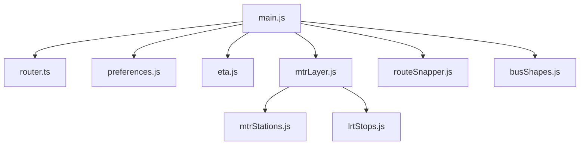
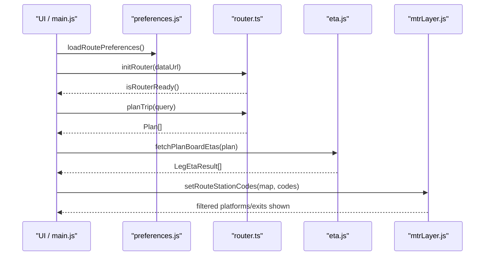
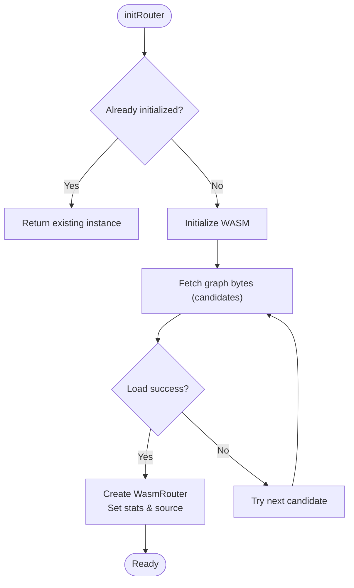
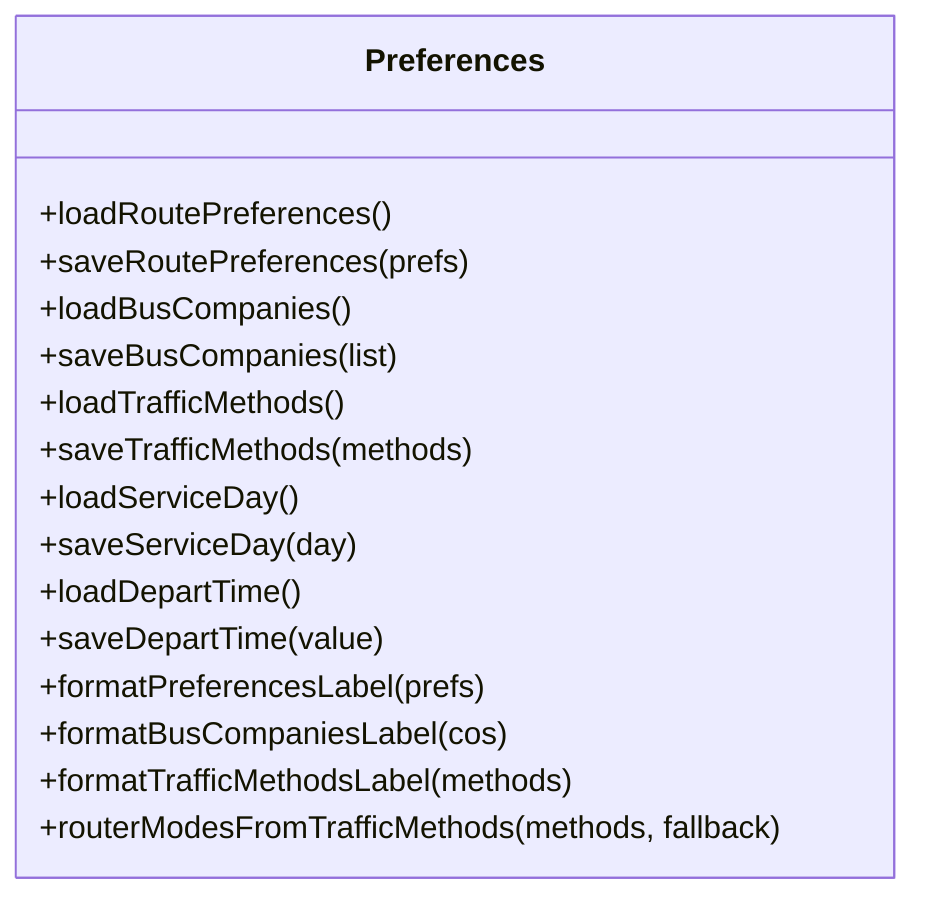
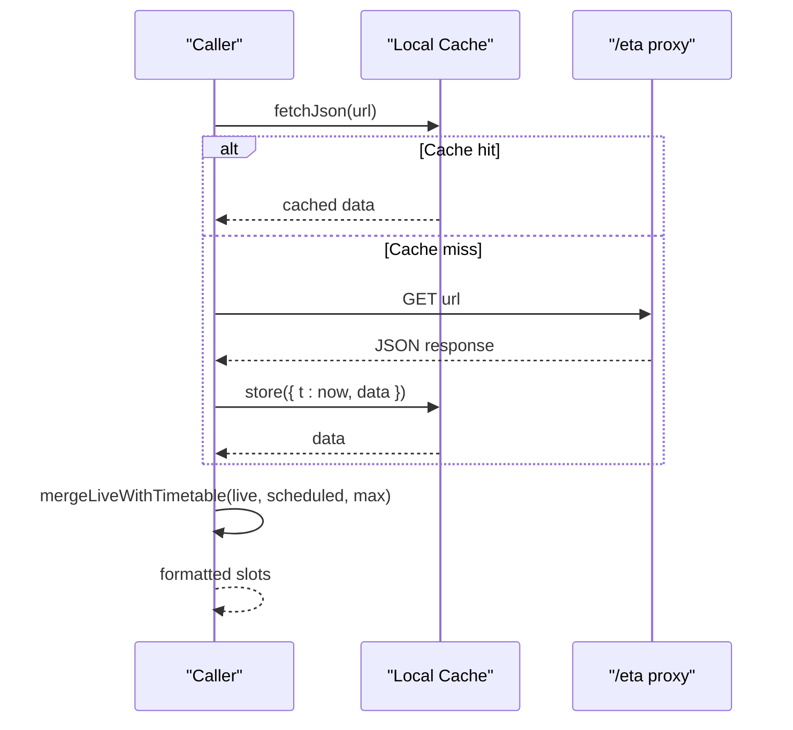
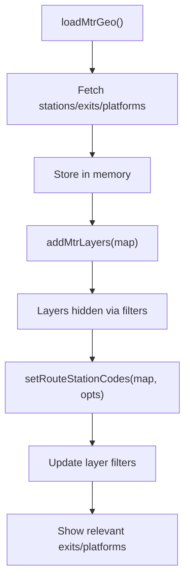
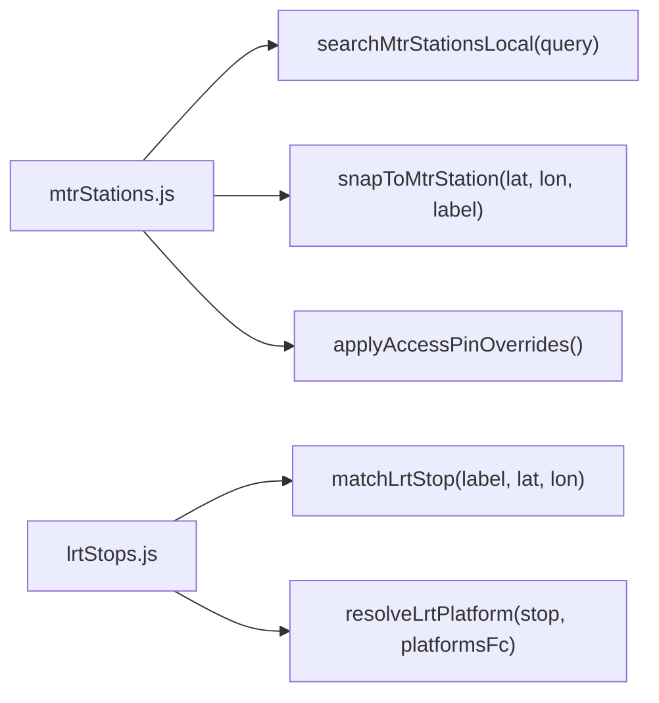
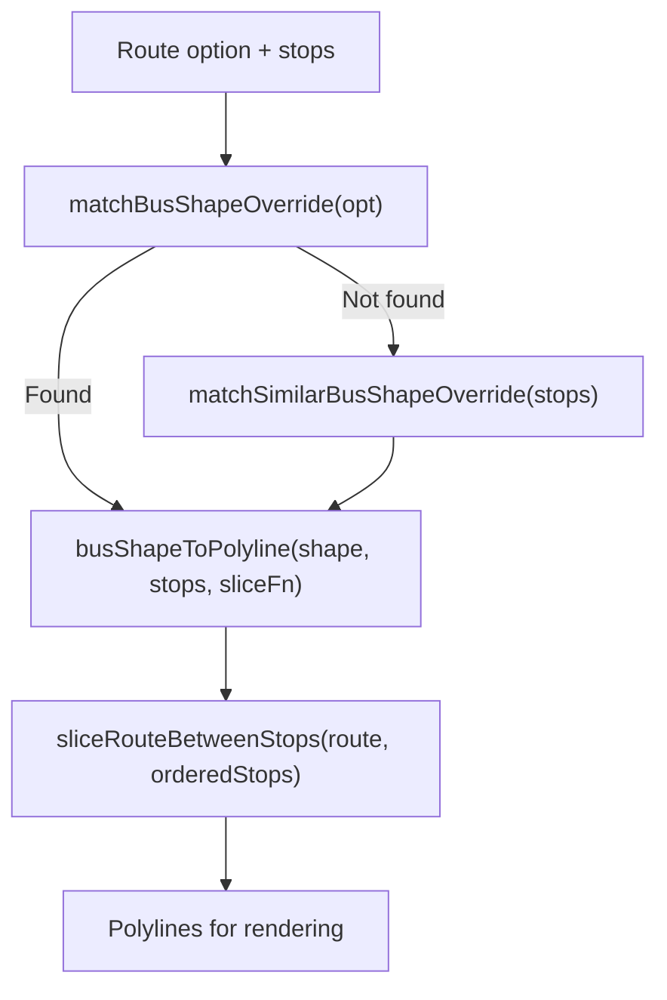

# Module Architecture and Dependencies

<cite>
**Referenced Files in This Document**
- [main.js](file://src/main.js)
- [router.ts](file://src/router.ts)
- [preferences.js](file://src/preferences.js)
- [eta.js](file://src/eta.js)
- [mtrLayer.js](file://src/mtrLayer.js)
- [mtrStations.js](file://src/mtrStations.js)
- [lrtStops.js](file://src/lrtStops.js)
- [busShapes.js](file://src/busShapes.js)
- [routeSnapper.js](file://src/routeSnapper.js)
- [package.json](file://package.json)
</cite>

## Table of Contents
1. [Introduction](#introduction)
2. [Project Structure](#project-structure)
3. [Core Components](#core-components)
4. [Architecture Overview](#architecture-overview)
5. [Detailed Component Analysis](#detailed-component-analysis)
6. [Dependency Analysis](#dependency-analysis)
7. [Performance Considerations](#performance-considerations)
8. [Troubleshooting Guide](#troubleshooting-guide)
9. [Conclusion](#conclusion)
10. [Appendices](#appendices)

## Introduction
This document explains MorganTraveler’s modular JavaScript architecture with a focus on ES6 module organization, import/export patterns, dependency injection, and how modules communicate through shared state and data flows. It covers the core modules: router integration, preference management, ETA calculations, and MTR layer rendering. It also documents module loading strategies (including lazy initialization), common patterns used across the codebase, and guidelines for adding new modules safely without introducing circular dependencies.

## Project Structure
MorganTraveler is a browser-first application built with Vite and uses ES modules throughout. The entrypoint initializes UI, map, routing, preferences, and feature modules. Feature modules are organized by responsibility:
- Routing and planning: router.ts
- User preferences and time handling: preferences.js
- Live ETA and timetable logic: eta.js
- Map layers and station/platform rendering: mtrLayer.js, mtrStations.js, lrtStops.js
- Route geometry and shape overlays: routeSnapper.js, busShapes.js
- Application bootstrap and orchestration: main.js

**Diagram sources**
- [main.js:1-175](file://src/main.js#L1-L175)
- [router.ts:1-34](file://src/router.ts#L1-L34)
- [preferences.js:1-20](file://src/preferences.js#L1-L20)
- [eta.js:1-15](file://src/eta.js#L1-L15)
- [mtrLayer.js:1-12](file://src/mtrLayer.js#L1-L12)
- [mtrStations.js:1-12](file://src/mtrStations.js#L1-L12)
- [lrtStops.js:1-10](file://src/lrtStops.js#L1-L10)
- [routeSnapper.js:1-12](file://src/routeSnapper.js#L1-L12)
- [busShapes.js:1-9](file://src/busShapes.js#L1-L9)

**Section sources**
- [main.js:1-175](file://src/main.js#L1-L175)
- [package.json:1-37](file://package.json#L1-L37)

## Core Components
- Router integration: Initializes WASM RAPTOR graph, plans trips, applies human ranking rules, and filters plans based on traffic methods and bus companies.
- Preference management: Persists user choices (ranking goals, traffic methods, bus companies, service day, departure time) to localStorage and provides formatting helpers.
- ETA calculations: Fetches live ETAs via a same-origin proxy, merges live data with scheduled headways, and formats display-ready slots.
- MTR layer rendering: Loads GeoJSON for stations/exits/platforms, adds MapLibre sources/layers, and filters visible features based on active itinerary.
- Route geometry: Projects stops onto polylines, slices route segments between stops, and matches contributor-provided bus shapes for accurate visuals.

**Section sources**
- [router.ts:187-249](file://src/router.ts#L187-L249)
- [preferences.js:328-431](file://src/preferences.js#L328-L431)
- [eta.js:19-42](file://src/eta.js#L19-L42)
- [mtrLayer.js:28-61](file://src/mtrLayer.js#L28-L61)
- [routeSnapper.js:29-174](file://src/routeSnapper.js#L29-L174)
- [busShapes.js:77-191](file://src/busShapes.js#L77-L191)

## Architecture Overview
The application follows a clear separation of concerns:
- Bootstrap (main.js) orchestrates initialization and wiring of modules.
- Data modules (preferences, mtrStations, lrtStops) provide domain data and utilities.
- Processing modules (router, eta, routeSnapper, busShapes) transform inputs into results.
- Rendering module (mtrLayer) consumes processed results to update the map.

**Diagram sources**
- [main.js:17-35](file://src/main.js#L17-L35)
- [router.ts:207-249](file://src/router.ts#L207-L249)
- [eta.js:19-42](file://src/eta.js#L19-L42)
- [mtrLayer.js:178-219](file://src/mtrLayer.js#L178-L219)

## Detailed Component Analysis

### Router Integration (router.ts)
Responsibilities:
- Initialize WASM RAPTOR engine and load graph from multiple candidates.
- Provide query interfaces and plan analysis functions.
- Apply human-centric ranking and filtering (traffic methods, bus companies).
- Expose constants for modes and penalties.

Key patterns:
- Lazy initialization with promise caching to avoid duplicate loads.
- Pure functions for classification and analysis (e.g., classifyTrafficMethodId, analyzePlan).
- Exported types and constants for consistent usage across modules.

**Diagram sources**
- [router.ts:187-249](file://src/router.ts#L187-L249)

**Section sources**
- [router.ts:187-249](file://src/router.ts#L187-L249)
- [router.ts:307-353](file://src/router.ts#L307-L353)
- [router.ts:468-563](file://src/router.ts#L468-L563)

### Preference Management (preferences.js)
Responsibilities:
- Persist multi-select preferences (ranking goals, traffic methods, bus companies).
- Manage service day and departure time with Hong Kong timezone handling.
- Provide label formatters and mode-to-modes mapping for the router.

Key patterns:
- Strong validation with type guards before persisting values.
- Migration support from legacy single-value keys to arrays.
- Centralized storage keys and labels for consistency.

**Diagram sources**
- [preferences.js:328-431](file://src/preferences.js#L328-L431)
- [preferences.js:463-544](file://src/preferences.js#L463-L544)

**Section sources**
- [preferences.js:328-431](file://src/preferences.js#L328-L431)
- [preferences.js:463-544](file://src/preferences.js#L463-L544)

### ETA Calculations (eta.js)
Responsibilities:
- Fetch live ETAs via a same-origin proxy with short-term cache.
- Normalize timestamps and compute wait minutes.
- Merge live departures with scheduled headway-based placeholders.
- Format platform labels and station names for display.

Key patterns:
- In-memory cache with TTL to reduce network calls.
- Operator detection and platform normalization for consistent output.
- Robust fallbacks when live data is unavailable or outside service hours.

**Diagram sources**
- [eta.js:19-42](file://src/eta.js#L19-L42)
- [eta.js:406-428](file://src/eta.js#L406-L428)

**Section sources**
- [eta.js:19-42](file://src/eta.js#L19-L42)
- [eta.js:406-428](file://src/eta.js#L406-L428)

### MTR Layer Rendering (mtrLayer.js)
Responsibilities:
- Load station, exit, and platform GeoJSON once and reuse.
- Add MapLibre sources and layers; keep them hidden until needed.
- Filter visible features based on active itinerary codes and platform keys.
- Resolve stop-to-platform mapping for precise visualization.

Key patterns:
- Lazy loading with a loaded flag to prevent redundant fetches.
- Filters using neverFilter/neverPlatformFilter to hide layers until activated.
- Platform resolution prioritizes explicit refs, line hints, then nearest point.

**Diagram sources**
- [mtrLayer.js:28-61](file://src/mtrLayer.js#L28-L61)
- [mtrLayer.js:178-219](file://src/mtrLayer.js#L178-L219)

**Section sources**
- [mtrLayer.js:28-61](file://src/mtrLayer.js#L28-L61)
- [mtrLayer.js:178-219](file://src/mtrLayer.js#L178-L219)

### Station and Stop Data Modules
- MTR stations: Local directory for search and snapping; supports overrides and merging from external GeoJSON.
- LRT stops: Track-accurate coordinates and per-platform points; supports static overrides.

**Diagram sources**
- [mtrStations.js:136-263](file://src/mtrStations.js#L136-L263)
- [lrtStops.js:156-253](file://src/lrtStops.js#L156-L253)

**Section sources**
- [mtrStations.js:136-263](file://src/mtrStations.js#L136-L263)
- [lrtStops.js:156-253](file://src/lrtStops.js#L156-L253)

### Route Geometry and Shape Overlays
- Route snapper: Projects stops onto polylines and slices segments between board/alight stops.
- Bus shapes: Matches contributor-provided paths and applies visual stop positions for accurate route visuals.

**Diagram sources**
- [busShapes.js:77-191](file://src/busShapes.js#L77-L191)
- [routeSnapper.js:147-174](file://src/routeSnapper.js#L147-L174)

**Section sources**
- [busShapes.js:77-191](file://src/busShapes.js#L77-L191)
- [routeSnapper.js:147-174](file://src/routeSnapper.js#L147-L174)

## Dependency Analysis
Module coupling and cohesion:
- main.js depends on all major modules for orchestration but remains a thin coordinator.
- router.ts depends on color/interchange/access modules for ranking and plan analysis.
- eta.js depends on preferences for time formatting and station/LRT data for operator context.
- mtrLayer.js depends on LRT shapes for platform overrides and station data for name/code matching.
- routeSnapper.js and busShapes.js are relatively independent, focused on geometry and path matching.

Potential circular dependencies:
- No direct circular imports detected among analyzed files.
- Ensure new modules avoid importing main.js to prevent cycles.

External dependencies:
- MapLibre GL for map rendering.
- PMTiles for tile serving.
- Protomaps basemaps for base layers.

**Diagram sources**
- [main.js:1-175](file://src/main.js#L1-L175)
- [router.ts:1-34](file://src/router.ts#L1-L34)
- [eta.js:1-15](file://src/eta.js#L1-L15)
- [mtrLayer.js:1-12](file://src/mtrLayer.js#L1-L12)
- [mtrStations.js:1-12](file://src/mtrStations.js#L1-L12)
- [lrtStops.js:1-10](file://src/lrtStops.js#L1-L10)
- [routeSnapper.js:1-12](file://src/routeSnapper.js#L1-L12)
- [busShapes.js:1-9](file://src/busShapes.js#L1-L9)

**Section sources**
- [main.js:1-175](file://src/main.js#L1-L175)
- [router.ts:1-34](file://src/router.ts#L1-L34)
- [package.json:27-31](file://package.json#L27-L31)

## Performance Considerations
- Lazy initialization: Router graph loading is deferred and cached; map layers are added but hidden until needed.
- Caching: ETA module uses an in-memory cache with TTL to reduce network requests.
- Filtering: MapLibre filters minimize rendering overhead by only showing relevant features.
- Concurrency: Route densification uses concurrency-limited pools to balance performance and responsiveness.
- Data size: GeoJSON datasets are fetched once and reused; consider bundling or CDN optimization for large assets.

[No sources needed since this section provides general guidance]

## Troubleshooting Guide
Common issues and resolutions:
- Router not ready: Ensure initRouter completes successfully; check network access to graph URLs and WASM initialization logs.
- ETA fetch failures: Verify same-origin proxy availability; inspect status codes and handle errors gracefully.
- Missing map layers: Confirm loadMtrGeo completed and addMtrLayers called; verify setRouteStationCodes updates filters correctly.
- Incorrect platform selection: Use resolvePlatformForStop with correct route options; ensure LRT overrides are applied.

**Section sources**
- [router.ts:207-249](file://src/router.ts#L207-L249)
- [eta.js:30-42](file://src/eta.js#L30-L42)
- [mtrLayer.js:178-219](file://src/mtrLayer.js#L178-L219)

## Conclusion
MorganTraveler’s architecture emphasizes modularity, lazy loading, and clear separation of concerns. Modules communicate through well-defined interfaces and shared data structures rather than tight coupling. The system leverages caching, filtering, and concurrency to maintain performance while supporting complex transit scenarios. Adding new modules should follow established patterns: export pure functions, avoid circular imports, and integrate via main.js orchestration.

[No sources needed since this section summarizes without analyzing specific files]

## Appendices

### Module Loading Strategy and Lazy Loading
- Router graph: Initialized on demand with promise caching to prevent duplicate loads.
- Map layers: Added at startup but hidden via filters until activated by itinerary.
- ETA data: Fetched on request with short-term caching to reduce latency.

**Section sources**
- [router.ts:187-249](file://src/router.ts#L187-L249)
- [mtrLayer.js:28-61](file://src/mtrLayer.js#L28-L61)
- [eta.js:19-42](file://src/eta.js#L19-L42)

### Circular Dependency Handling
- Current modules avoid circular imports by keeping main.js as the orchestrator.
- New modules should depend on feature modules, not on main.js.
- If shared state is needed, prefer passing data explicitly or using dedicated state modules.

[No sources needed since this section provides general guidance]

### Guidelines for Adding New Modules
- Create a focused module with clear responsibilities.
- Export pure functions and constants; avoid global side effects.
- Import only necessary dependencies; keep main.js as the integration point.
- Follow naming conventions and use TypeScript/JSDoc for type safety where applicable.
- Test edge cases and error handling thoroughly.

[No sources needed since this section provides general guidance]