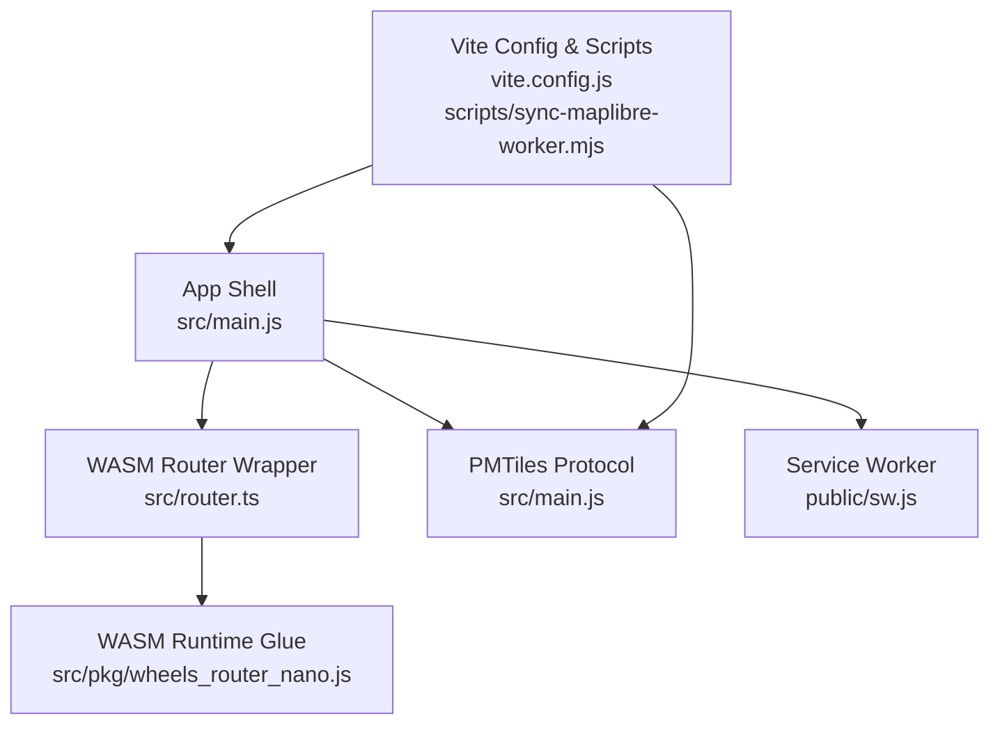
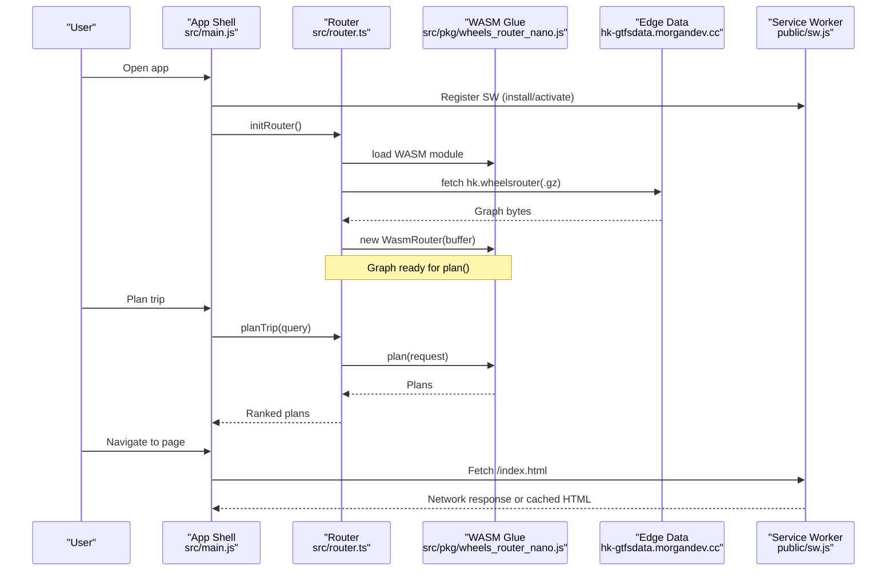
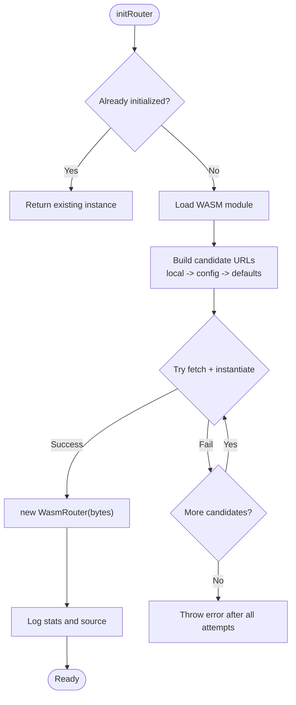
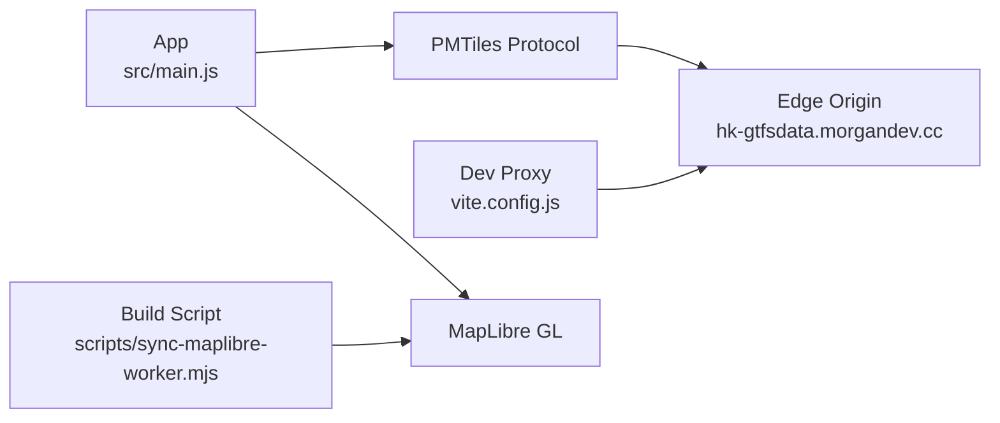
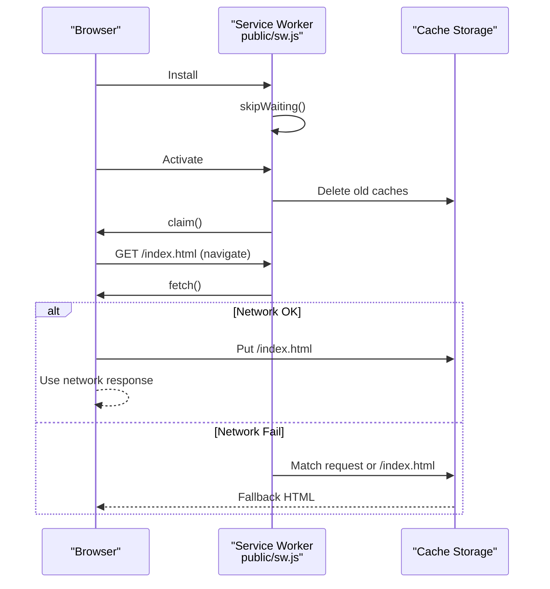
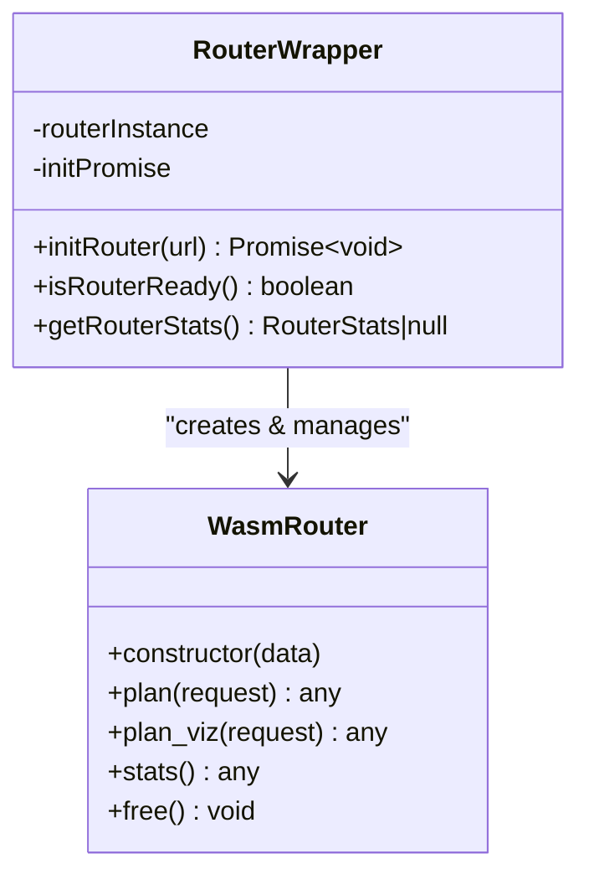
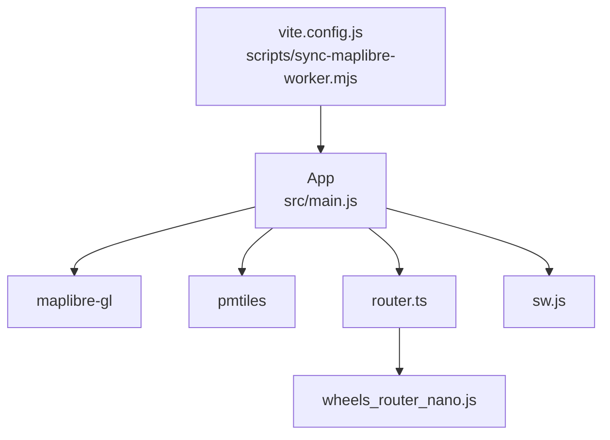

# Performance Optimization Strategies

<cite>
**Referenced Files in This Document**
- [router.ts](file://src/router.ts)
- [wheels_router_nano.js](file://src/pkg/wheels_router_nano.js)
- [main.js](file://src/main.js)
- [sw.js](file://public/sw.js)
- [vite.config.js](file://vite.config.js)
- [sync-maplibre-worker.mjs](file://scripts/sync-maplibre-worker.mjs)
- [package.json](file://package.json)
</cite>

## Table of Contents
1. Introduction
2. Project Structure
3. Core Components
4. Architecture Overview
5. Detailed Component Analysis
6. Dependency Analysis
7. Performance Considerations
8. Troubleshooting Guide
9. Conclusion

## Introduction
This document explains MorganTraveler’s performance optimization strategies for Hong Kong’s dense transit network. It covers the WebAssembly routing engine integration for fast route calculations, vector tile caching with PMTiles for efficient map rendering, and service worker caching strategies for offline support. It also documents memory management techniques, lazy loading of heavy modules, bundle size optimization, performance monitoring approaches, bottleneck identification methods, and best practices tailored to Hong Kong’s complex transit data.

## Project Structure
MorganTraveler is a MapLibre-based PWA that uses:
- A WASM RAPTOR router for fast trip planning
- PMTiles for on-demand vector tiles
- A minimal service worker for offline navigation fallback
- Vite build tooling with cross-origin isolation headers for COEP/COOP
- Build scripts to stabilize MapLibre worker resolution

**Diagram sources**
- [main.js:190-210](file://src/main.js#L190-L210)
- [router.ts:187-249](file://src/router.ts#L187-L249)
- [wheels_router_nano.js:17-60](file://src/pkg/wheels_router_nano.js#L17-L60)
- [sw.js:42-86](file://public/sw.js#L42-L86)
- [vite.config.js:111-120](file://vite.config.js#L111-L120)
- [sync-maplibre-worker.mjs:1-27](file://scripts/sync-maplibre-worker.mjs#L1-L27)

**Section sources**
- [main.js:190-210](file://src/main.js#L190-L210)
- [vite.config.js:111-120](file://vite.config.js#L111-L120)
- [sync-maplibre-worker.mjs:1-27](file://scripts/sync-maplibre-worker.mjs#L1-L27)

## Core Components
- WASM Routing Engine: Initializes and runs the wheels-router-nano graph for fast RAPTOR queries with human-centric ranking tuned for Hong Kong.
- Vector Tile Rendering: Uses PMTiles protocol with MapLibre for streaming tiles from a remote or proxied edge origin.
- Offline Support: Service worker caches only the HTML shell for cold-start offline navigation; assets are served by the browser cache.
- Build-Time Optimizations: Cross-origin isolation headers enable COEP/COOP for WASM; MapLibre worker files are copied to public for stable same-origin resolution.

**Section sources**
- [router.ts:187-249](file://src/router.ts#L187-L249)
- [wheels_router_nano.js:17-60](file://src/pkg/wheels_router_nano.js#L17-L60)
- [main.js:190-210](file://src/main.js#L190-L210)
- [sw.js:42-86](file://public/sw.js#L42-L86)
- [vite.config.js:111-120](file://vite.config.js#L111-L120)
- [sync-maplibre-worker.mjs:1-27](file://scripts/sync-maplibre-worker.mjs#L1-L27)

## Architecture Overview
The app initializes MapLibre with a PMTiles protocol pointing to an edge origin (or local proxy in dev). The routing layer loads a compressed binary graph into WASM and exposes plan() calls. The service worker intercepts navigations to provide an offline HTML fallback while leaving other assets to normal caching.

**Diagram sources**
- [router.ts:207-249](file://src/router.ts#L207-L249)
- [wheels_router_nano.js:466-490](file://src/pkg/wheels_router_nano.js#L466-L490)
- [main.js:190-210](file://src/main.js#L190-L210)
- [sw.js:11-29](file://public/sw.js#L11-L29)
- [sw.js:42-86](file://public/sw.js#L42-L86)

## Detailed Component Analysis

### WebAssembly Routing Engine Integration
- Lazy initialization: The router defers WASM and graph loading until needed, avoiding blocking startup.
- Graph source fallback: Tries local gzipped graph first, then configured URL, then default CDN, ensuring resilience.
- Human-centric ranking: Applies penalties/bonuses for transfers, MTR-only preferences, LRT catchment, and free interchange links to reflect Hong Kong travel behavior.
- Memory management: The WASM glue exposes free() and FinalizationRegistry to release native memory when instances are destroyed.

**Diagram sources**
- [router.ts:207-249](file://src/router.ts#L207-L249)
- [wheels_router_nano.js:466-490](file://src/pkg/wheels_router_nano.js#L466-L490)

**Section sources**
- [router.ts:187-249](file://src/router.ts#L187-L249)
- [router.ts:251-303](file://src/router.ts#L251-L303)
- [wheels_router_nano.js:17-60](file://src/pkg/wheels_router_nano.js#L17-L60)
- [wheels_router_nano.js:223-225](file://src/pkg/wheels_router_nano.js#L223-L225)

### Vector Tile Caching with PMTiles
- PMTiles protocol registration points to an edge origin; in dev, a local proxy rewrites requests and injects CORP headers to satisfy COEP require-corp.
- Basemap layers and flavor are loaded via Protomaps basemaps package.
- MapLibre worker files are copied to public during build to ensure stable same-origin resolution across environments.

**Diagram sources**
- [main.js:190-210](file://src/main.js#L190-L210)
- [vite.config.js:773-800](file://vite.config.js#L773-L800)
- [sync-maplibre-worker.mjs:1-27](file://scripts/sync-maplibre-worker.mjs#L1-L27)

**Section sources**
- [main.js:190-210](file://src/main.js#L190-L210)
- [vite.config.js:773-800](file://vite.config.js#L773-L800)
- [sync-maplibre-worker.mjs:1-27](file://scripts/sync-maplibre-worker.mjs#L1-L27)

### Service Worker Caching Strategy for Offline Support
- Minimal strategy: Only navigations receive an offline fallback using a single cached HTML copy.
- No interception of CSS/JS/WASM to avoid mobile Safari issues where aggressive caching could leave the shell unstyled.
- Activation clears old caches and claims clients; messages allow runtime cache control.

**Diagram sources**
- [sw.js:11-29](file://public/sw.js#L11-L29)
- [sw.js:42-86](file://public/sw.js#L42-L86)

**Section sources**
- [sw.js:11-29](file://public/sw.js#L11-L29)
- [sw.js:42-86](file://public/sw.js#L42-L86)

### Memory Management Techniques
- WASM instance lifecycle: The JS glue provides free() and registers a FinalizationRegistry to call native free when the object is garbage-collected.
- Avoid multiple concurrent initializations: The router guards against duplicate init and reuses a single instance.
- Prefer compressed graphs (.gz) to reduce memory footprint at load time.

**Diagram sources**
- [wheels_router_nano.js:17-60](file://src/pkg/wheels_router_nano.js#L17-L60)
- [wheels_router_nano.js:223-225](file://src/pkg/wheels_router_nano.js#L223-L225)
- [router.ts:187-249](file://src/router.ts#L187-L249)

**Section sources**
- [wheels_router_nano.js:17-60](file://src/pkg/wheels_router_nano.js#L17-L60)
- [wheels_router_nano.js:223-225](file://src/pkg/wheels_router_nano.js#L223-L225)
- [router.ts:187-249](file://src/router.ts#L187-L249)

### Lazy Loading of Heavy Modules
- Dynamic imports are used for heavy features like rail snapping/densification to keep initial bundle small and defer CPU work until needed.
- Examples include conditional imports for railSnapper during contribution flows and other feature-specific modules.

**Section sources**
- [contributePath.js:210-240](file://src/contributePath.js#L210-L240)
- [main.js:4052-4052](file://src/main.js#L4052-L4052)
- [main.js:10937-10937](file://src/main.js#L10937-L10937)

### Bundle Size Optimization
- Dependencies are scoped to essentials: MapLibre GL and PMTiles.
- Build-time scripts ensure MapLibre worker files are available at stable paths, preventing extra bundling or runtime resolution failures.
- Vite base path set to absolute to avoid asset path issues on mobile.

**Section sources**
- [package.json:27-31](file://package.json#L27-L31)
- [sync-maplibre-worker.mjs:1-27](file://scripts/sync-maplibre-worker.mjs#L1-L27)
- [vite.config.js:773-776](file://vite.config.js#L773-L776)

## Dependency Analysis
Key runtime dependencies and their roles:
- MapLibre GL: Rendering engine; requires a module worker resolved from public/.
- PMTiles: Streaming vector tiles from edge origin; works under COEP require-corp with proper headers.
- WASM RAPTOR: Fast route calculation; needs cross-origin isolation headers for SharedArrayBuffer-like capabilities if used.
- Service Worker: Provides offline fallback for navigation without interfering with asset caching.

**Diagram sources**
- [package.json:27-31](file://package.json#L27-L31)
- [main.js:190-210](file://src/main.js#L190-L210)
- [router.ts:187-249](file://src/router.ts#L187-L249)
- [wheels_router_nano.js:466-490](file://src/pkg/wheels_router_nano.js#L466-L490)
- [sw.js:42-86](file://public/sw.js#L42-L86)
- [vite.config.js:111-120](file://vite.config.js#L111-L120)
- [sync-maplibre-worker.mjs:1-27](file://scripts/sync-maplibre-worker.mjs#L1-L27)

**Section sources**
- [package.json:27-31](file://package.json#L27-L31)
- [main.js:190-210](file://src/main.js#L190-L210)
- [router.ts:187-249](file://src/router.ts#L187-L249)
- [sw.js:42-86](file://public/sw.js#L42-L86)
- [vite.config.js:111-120](file://vite.config.js#L111-L120)
- [sync-maplibre-worker.mjs:1-27](file://scripts/sync-maplibre-worker.mjs#L1-L27)

## Performance Considerations
- Route calculation latency:
  - Use compressed graphs and prefer local .gz fallback to minimize download time.
  - Defer router initialization until a query is needed.
  - Apply traffic method and bus company filters early to reduce result sets.
- Map rendering efficiency:
  - PMTiles streams only visible tiles; combine with appropriate zoom levels and bounds.
  - Ensure MapLibre worker resolves correctly to avoid blank maps and reinitialization overhead.
- Offline UX:
  - Keep SW minimal to avoid stale asset conflicts; rely on browser cache for assets and SW only for HTML fallback.
- Memory usage:
  - Free WASM instances when no longer needed; avoid holding large plan results in long-lived scopes.
- Progressive enhancement:
  - Show map and search immediately; initialize router in background and update UI when ready.
  - Use dynamic imports to load heavy features only when triggered.

[No sources needed since this section provides general guidance]

## Troubleshooting Guide
- Blank map due to worker resolution:
  - Ensure MapLibre worker files are copied to public and referenced via setWorkerUrl.
- CORS/COEP errors with PMTiles or WASM:
  - Verify cross-origin isolation headers are set in dev/proxy; confirm edge responses include required headers.
- Router not initializing:
  - Check graph availability and fallback chain; inspect console logs for failed fetches.
- Offline fallback not working:
  - Confirm SW activation and cache population; verify navigation requests are intercepted and HTML is cached.

**Section sources**
- [sync-maplibre-worker.mjs:1-27](file://scripts/sync-maplibre-worker.mjs#L1-L27)
- [main.js:190-210](file://src/main.js#L190-L210)
- [vite.config.js:111-120](file://vite.config.js#L111-L120)
- [router.ts:207-249](file://src/router.ts#L207-L249)
- [sw.js:11-29](file://public/sw.js#L11-L29)
- [sw.js:42-86](file://public/sw.js#L42-L86)

## Conclusion
MorganTraveler combines a WASM-based RAPTOR router, PMTiles-driven vector tiles, and a minimal service worker to deliver fast, resilient transit planning for Hong Kong’s dense network. By deferring heavy work, optimizing graph delivery, stabilizing worker resolution, and applying targeted ranking heuristics, the app achieves responsive interactions and reliable offline fallbacks. Continuous profiling and careful cache invalidation will further improve performance as data and features evolve.

[No sources needed since this section summarizes without analyzing specific files]