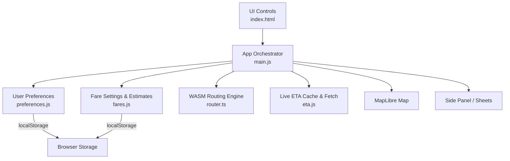
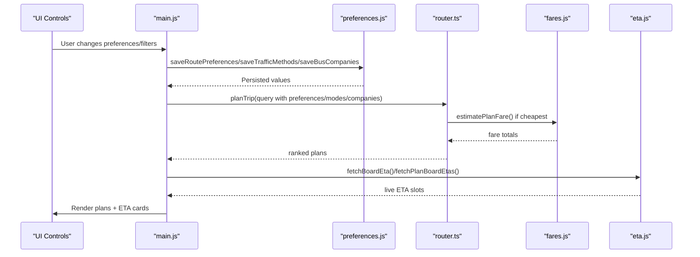
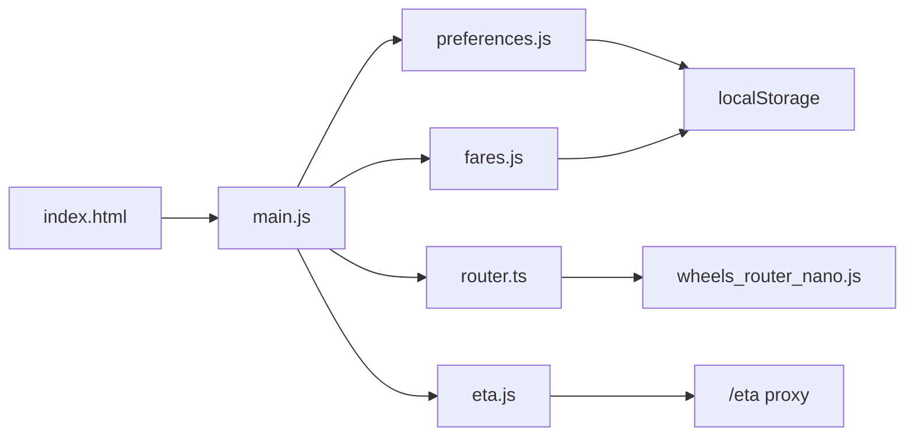

# State Management and Data Flow

<cite>
**Referenced Files in This Document**
- [preferences.js](file://src/preferences.js)
- [fares.js](file://src/fares.js)
- [router.ts](file://src/router.ts)
- [eta.js](file://src/eta.js)
- [main.js](file://src/main.js)
- [index.html](file://index.html)
</cite>

## Table of Contents
1. [Introduction](#introduction)
2. [Project Structure](#project-structure)
3. [Core Components](#core-components)
4. [Architecture Overview](#architecture-overview)
5. [Detailed Component Analysis](#detailed-component-analysis)
6. [Dependency Analysis](#dependency-analysis)
7. [Performance Considerations](#performance-considerations)
8. [Troubleshooting Guide](#troubleshooting-guide)
9. [Conclusion](#conclusion)

## Introduction
This document explains how MorganTraveler manages application state across the lifecycle: user preferences, route planning data, fare calculation settings, and real-time status updates. It focuses on:
- Preference storage via localStorage with migration support
- Synchronization between UI components and persistent state
- Data persistence strategies for routing filters, service day/time, and fare type
- Fare calculation state management and integration with plan ranking
- Route selection tracking and direction/state caching
- Event-driven updates that keep UI consistent without global event buses

The system is centered around a small set of modules that own specific slices of state and expose typed getters/setters. The main application wires these into UI controls, triggers re-planning when relevant state changes, and renders live ETA information.

## Project Structure
At a high level:
- Preferences module owns persisted user choices (routing goals, traffic methods, bus companies, service day, departure time).
- Fares module owns ticket-type preference and computes fare estimates used by cheapest ranking and display.
- Router module wraps the WASM RAPTOR engine, applies human-centric ranking rules, and enforces mode/company filters.
- ETA module provides live arrival data and caches it to reduce network calls.
- Main application initializes map, loads static overrides, binds UI events, and orchestrates planning, rendering, and live updates.

**Diagram sources**
- [main.js:17-80](file://src/main.js#L17-L80)
- [preferences.js:1-60](file://src/preferences.js#L1-L60)
- [fares.js:40-180](file://src/fares.js#L40-L180)
- [router.ts:1-120](file://src/router.ts#L1-L120)
- [eta.js:1-45](file://src/eta.js#L1-L45)
- [index.html:76-800](file://index.html#L76-L800)

**Section sources**
- [main.js:17-80](file://src/main.js#L17-L80)
- [index.html:76-800](file://index.html#L76-L800)

## Core Components
- User preferences: multi-select routing goals, traffic modes, bus operators, service day, departure time; all persisted to localStorage with validation and defaults.
- Fare state: active ticket type and optional East Rail Line First Class toggle; persisted and applied to fare matrices.
- Routing state: origin/destination, selected plans, filtering by modes/companies, and ranking preferences; computed results are held in memory during session.
- Live ETA state: per-route cached ETA payloads, direction selection, and nearby stop context; refreshed periodically or on demand.

Key responsibilities:
- preferences.js: load/save helpers, label formatters, validators, and conversion from user selections to router modes.
- fares.js: load/save fare type, EAL first-class flag, compute per-leg and total fare estimates, apply interchange discounts.
- router.ts: initialize WASM graph, run plan queries, analyze plans, filter by allowed modes/companies, and score plans using human preferences.
- eta.js: fetch live ETAs with TTL cache, normalize timestamps, classify operator, format slots, and merge with timetable.
- main.js: bind UI to state, trigger planning on preference changes, render results, manage pinned routes, and update live ETA cards.

**Section sources**
- [preferences.js:21-69](file://src/preferences.js#L21-L69)
- [fares.js:40-180](file://src/fares.js#L40-L180)
- [router.ts:35-120](file://src/router.ts#L35-L120)
- [eta.js:1-45](file://src/eta.js#L1-L45)
- [main.js:1922-1935](file://src/main.js#L1922-L1935)

## Architecture Overview
The application follows an event-driven, module-scoped state model:
- Each module exposes pure functions to read/write its slice of state.
- main.js acts as the coordinator: it reads initial state from localStorage, binds DOM events, persists changes, and triggers downstream actions (plan, render, refresh ETA).
- Routing uses a WASM engine; main.js builds query parameters from current state and passes them to the router.
- ETA updates are fetched on a schedule or on interaction and merged into per-route state maps for UI consumption.

**Diagram sources**
- [main.js:2364-2464](file://src/main.js#L2364-L2464)
- [preferences.js:330-431](file://src/preferences.js#L330-L431)
- [router.ts:207-249](file://src/router.ts#L207-L249)
- [fares.js:460-503](file://src/fares.js#L460-L503)
- [eta.js:30-42](file://src/eta.js#L30-L42)

## Detailed Component Analysis

### User Preferences and Persistence
- Multi-select routing goals: fastest, simplest, cheapest. Stored as an array; defaults to ["fastest"].
- Traffic methods: bus, gmb, lrt, mtr, walk, ael. Converted to a comma-separated modes string for the router.
- Bus companies: kmb_lwb, ctb, nlb, gmb. Used to filter plans.
- Service day: usual vs holiday; affects target weekday and ISO start time generation.
- Departure time: "now" or fixed HH:MM in Hong Kong UTC+8; converted to ISO for routing.

Storage mechanism:
- Each preference has a dedicated localStorage key and paired load/save functions.
- Loaders validate stored values against known sets and fall back to safe defaults.
- Save functions sanitize inputs, deduplicate, and persist; errors are caught silently to avoid blocking UI.

Synchronization:
- On app startup, main.js loads all preferences into memory.
- UI controls are synced to current state; change listeners call save functions and optionally re-run planning.

Examples of mutation patterns:
- Toggle checkboxes → read current checked values → validate → save → sync UI → re-plan if origin/destination set.
- Select service day → save → re-plan if ready.
- Change departure time → save → re-plan if ready.

Best practices:
- Always validate before saving.
- Keep defaults explicit and stable.
- Use dedicated keys per preference to avoid collisions.
- Handle private browsing gracefully by catching storage exceptions.

**Section sources**
- [preferences.js:21-69](file://src/preferences.js#L21-L69)
- [preferences.js:106-135](file://src/preferences.js#L106-L135)
- [preferences.js:162-203](file://src/preferences.js#L162-L203)
- [preferences.js:306-325](file://src/preferences.js#L306-L325)
- [preferences.js:330-431](file://src/preferences.js#L330-L431)
- [main.js:2364-2464](file://src/main.js#L2364-L2464)

### Fare Calculation State Management
- Active fare type: octopus_adult, child/student variants, QR code, single ride, contactless, China T-Union. Persisted under a dedicated key.
- Optional East Rail Line First Class premium toggle: persisted as a boolean flag.
- Fare pack initialization: lazy-loaded once; includes MTR, AEL, LRT, MTR Bus matrices and company-specific mappings.
- Estimation pipeline:
  - For each plan leg, classify transit type (MTR, AEL, LRT, MTR Bus, bus/ferry).
  - Look up fares using normalized station names and matrix keys mapped from fare type.
  - Apply interchange discounts where applicable (MTR interchanges, bus-bus BBI).
  - Aggregate parts into total fare with currency and completeness flags.

Integration with routing:
- When “cheapest” is selected, main.js supplies a fare estimator to the router so plans can be scored by estimated cost.
- Fare type changes do not automatically re-plan unless explicitly triggered; however, UI reflects updated labels and amounts.

Persistence and synchronization:
- loadFareType/saveFareType ensure in-memory activeFareType matches localStorage.
- getFareType/formatFareTypeLabel provide read-only access for UI.
- EAL first-class flag similarly persisted and exposed via getters/setters.

**Section sources**
- [fares.js:40-180](file://src/fares.js#L40-L180)
- [fares.js:197-234](file://src/fares.js#L197-L234)
- [fares.js:460-503](file://src/fares.js#L460-L503)
- [fares.js:643-689](file://src/fares.js#L643-L689)
- [fares.js:755-783](file://src/fares.js#L755-L783)
- [main.js:63-80](file://src/main.js#L63-L80)

### Route Planning State and Ranking
- Query construction:
  - Origin/destination coordinates and optional labels.
  - Departure time derived from service day and departTime.
  - Preferences array influences ranking; trafficMethods/busCompanies filter plans.
  - Optional fare estimator for cheapest ranking.
- Plan analysis:
  - Counts transfers, walk meters, MTR/LRT usage, street walks, free interchange links.
  - Applies penalties/bonuses to reflect human preferences (e.g., prefer direct bus, discourage long outdoor MTR transfers).
- Filtering:
  - Rejects plans that use disallowed modes or companies.
  - Allows short access/egress walks even when walk is disabled, with distance thresholds.

State synchronization:
- Changes to preferences, traffic methods, or bus companies trigger re-planning if origin/destination are set and router is ready.
- Plans are held in memory; UI renders top candidates and allows selection for detail views.

**Section sources**
- [router.ts:35-120](file://src/router.ts#L35-L120)
- [router.ts:251-303](file://src/router.ts#L251-L303)
- [router.ts:468-563](file://src/router.ts#L468-L563)
- [router.ts:649-800](file://src/router.ts#L649-L800)
- [main.js:2364-2464](file://src/main.js#L2364-L2464)

### Route Selection Tracking and Direction State
- Per-route direction index is tracked in memory to preserve user choice across interactions.
- Nearby ETA and live metadata are keyed by route identity and aligned with direction selection.
- Pinned routes store minimal identifiers plus stop context (stopId/name, bound, direction index, sequence/index) to restore accurate board stops.

Synchronization:
- When direction changes, live/nearby metadata is updated to match the new bound.
- Pinned route page restores saved direction and stop context, then fetches ETA for that stop.

**Section sources**
- [main.js:983-1027](file://src/main.js#L983-L1027)
- [main.js:1056-1172](file://src/main.js#L1056-L1172)
- [main.js:412-498](file://src/main.js#L412-L498)
- [main.js:586-614](file://src/main.js#L586-L614)

### Real-Time Status Updates (ETA)
- ETA data is fetched from a same-origin proxy with a short TTL cache to avoid excessive requests.
- Operator classification determines platform display and formatting behavior.
- Slots are normalized to ISO timestamps and merged with scheduled timetables when live data is unavailable.
- UI shows live vs scheduled indicators and formats wait minutes and clock times in Hong Kong timezone.

Event-driven updates:
- Refresh on route selection or direction change.
- Background polling for trip detail pages with generation tokens to prevent stale updates after navigation.

**Section sources**
- [eta.js:1-45](file://src/eta.js#L1-L45)
- [eta.js:154-178](file://src/eta.js#L154-L178)
- [eta.js:61-112](file://src/eta.js#L61-L112)
- [main.js:879-971](file://src/main.js#L879-L971)

### Example State Mutation Patterns
- Preference toggles:
  - Read current checkbox states → validate → save to localStorage → sync UI → re-plan if conditions met.
- Service day and departure time:
  - Validate input → persist → update UI note text → re-plan if ready.
- Fare type changes:
  - Normalize type → persist → update in-memory active type → refresh displayed fare labels/amounts.
- Route selection:
  - Update in-memory plan list and selected index → render details → attach ETA context.

**Section sources**
- [main.js:2364-2464](file://src/main.js#L2364-L2464)
- [main.js:2466-2500](file://src/main.js#L2466-L2500)
- [fares.js:112-152](file://src/fares.js#L112-L152)

## Dependency Analysis
The following diagram shows how modules depend on each other and on browser APIs:

**Diagram sources**
- [index.html:76-800](file://index.html#L76-L800)
- [main.js:17-80](file://src/main.js#L17-L80)
- [preferences.js:1-60](file://src/preferences.js#L1-L60)
- [fares.js:40-180](file://src/fares.js#L40-L180)
- [router.ts:13-14](file://src/router.ts#L13-L14)
- [eta.js:16-42](file://src/eta.js#L16-L42)

Coupling and cohesion:
- main.js has broad coupling because it orchestrates multiple subsystems; this is intentional for a single-page app.
- Each subsystem maintains high cohesion around its domain (preferences, fares, routing, ETA).
- No circular dependencies observed; main.js imports from others but they do not import back.

External integrations:
- WASM router binary/graph loaded from remote or local fallbacks.
- PMTiles basemap streaming via MapLibre.
- ETA proxy for live data with CORS considerations.

**Section sources**
- [router.ts:187-249](file://src/router.ts#L187-L249)
- [main.js:1997-2024](file://src/main.js#L1997-L2024)
- [eta.js:16-42](file://src/eta.js#L16-L42)

## Performance Considerations
- Lazy initialization:
  - Router graph loading is deferred and retried across multiple URLs.
  - Fare pack is loaded once and cached in memory.
- Caching:
  - ETA responses cached with TTL to reduce network overhead.
  - Direction indices and live metadata stored in Maps for O(1) access.
- Efficient filtering:
  - Mode/company filters applied early to reject invalid plans before scoring.
- UI updates:
  - Debounced search timers for origin/destination inputs.
  - Generation tokens prevent painting stale ETA results after navigation.

Recommendations:
- Keep localStorage writes minimal and batched where possible.
- Avoid re-planning on every keystroke; debounce user input.
- Use Maps for frequent lookups (route keys, direction indices).
- Ensure error handling around storage and network operations to maintain responsiveness.

[No sources needed since this section provides general guidance]

## Troubleshooting Guide
Common issues and resolutions:
- localStorage unavailable (private mode):
  - All load/save functions catch exceptions and return safe defaults. Verify defaults are applied and UI remains functional.
- Router graph load failure:
  - Check network connectivity and CORS; logs indicate which candidate URL failed. Ensure base URL and worker setup are correct.
- ETA fetch errors:
  - Proxy may return non-OK status; UI should show fallback scheduled info. Inspect console for ETA errors and verify endpoint availability.
- Stale ETA updates:
  - Ensure generation token increments on navigation; discard pending updates if newer generation exists.
- Incorrect fare estimates:
  - Confirm fare pack loaded successfully and matrices include required types (student/child). Rebuild fares if missing.

**Section sources**
- [preferences.js:106-135](file://src/preferences.js#L106-L135)
- [preferences.js:162-203](file://src/preferences.js#L162-L203)
- [fares.js:460-503](file://src/fares.js#L460-L503)
- [router.ts:207-249](file://src/router.ts#L207-L249)
- [eta.js:30-42](file://src/eta.js#L30-L42)

## Conclusion
MorganTraveler’s state management relies on clear module boundaries, typed getters/setters, and localStorage-backed persistence. The main application coordinates UI events, preference changes, routing, and live ETA updates while maintaining consistency through careful synchronization and caching. By adhering to validation, defaults, and robust error handling, the system ensures reliable behavior across sessions and environments. Best practices include minimizing writes, debouncing inputs, leveraging Maps for fast lookups, and using generation tokens to avoid stale updates.

[No sources needed since this section summarizes without analyzing specific files]