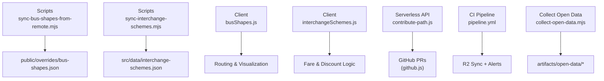
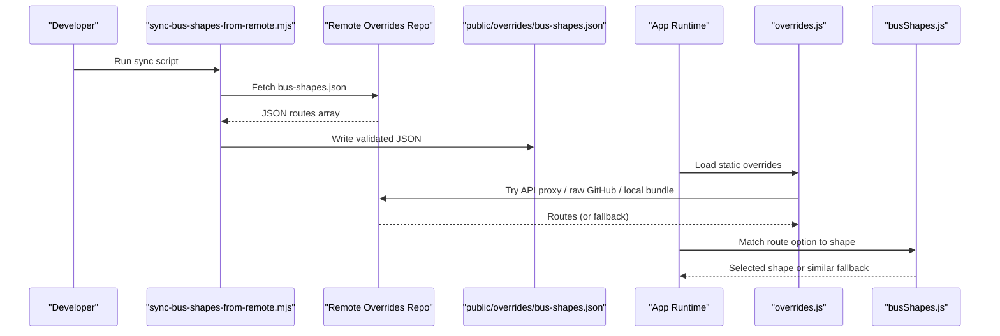
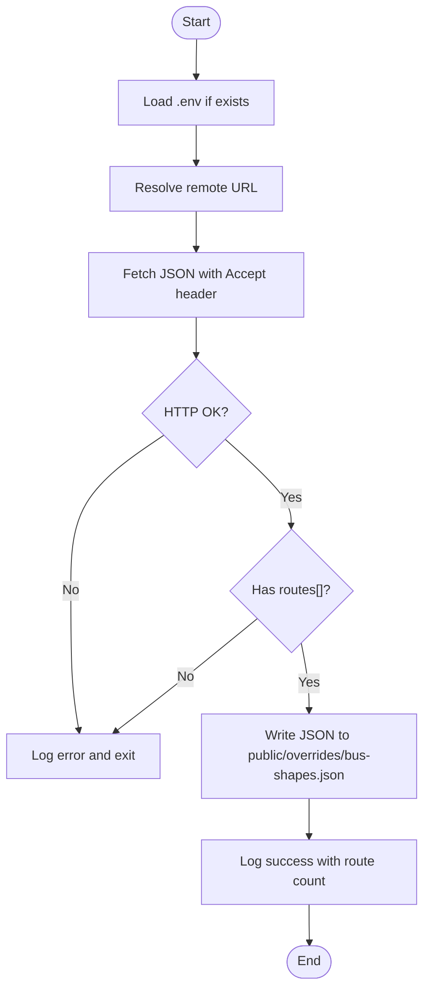
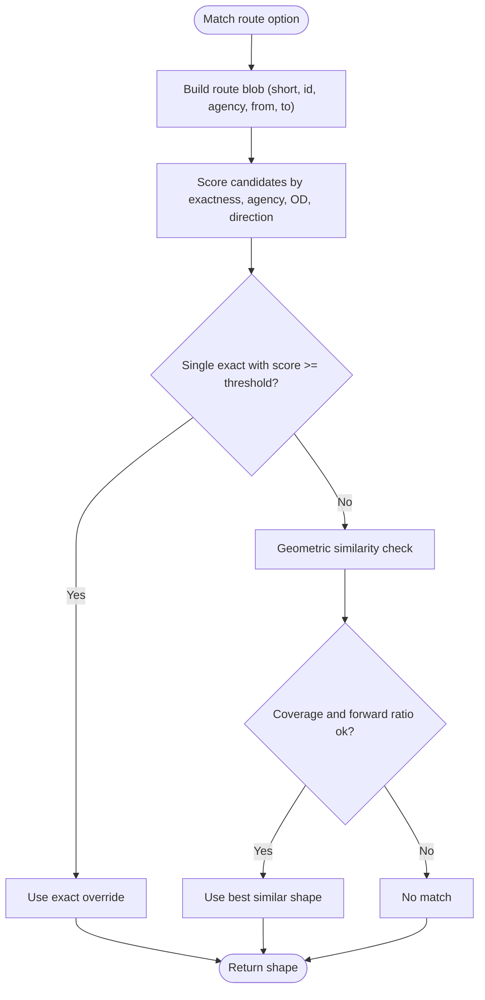
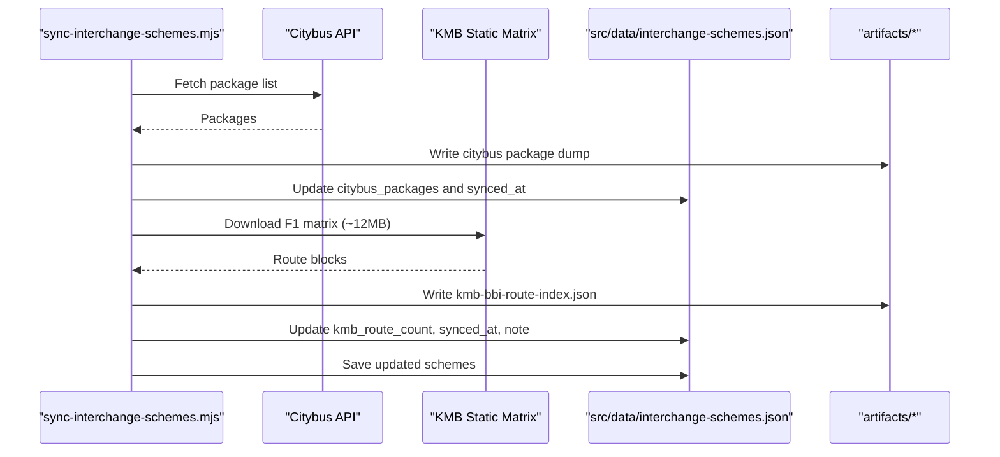
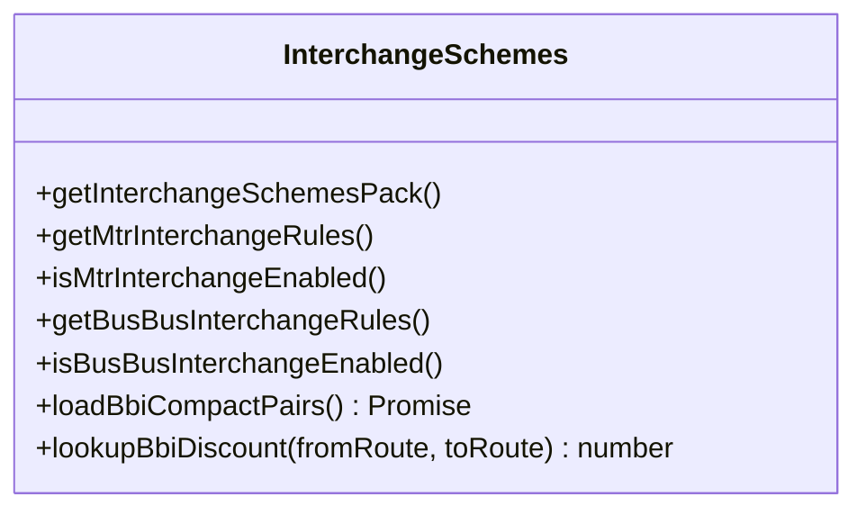
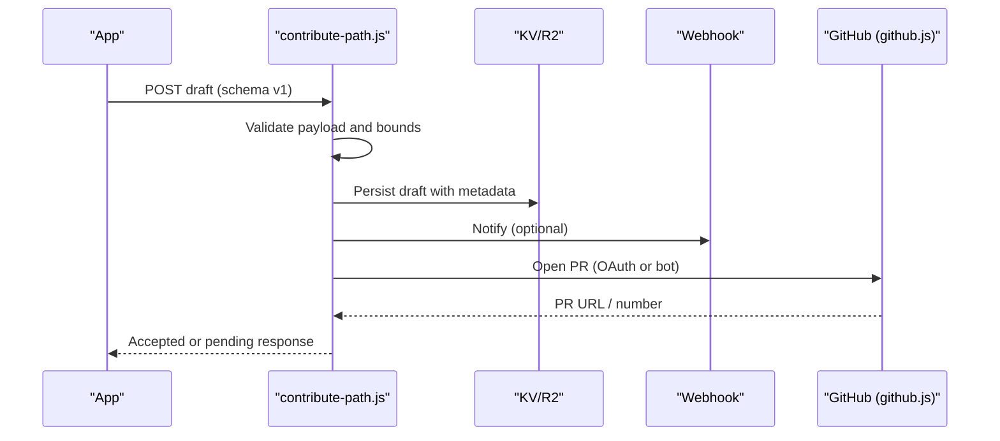
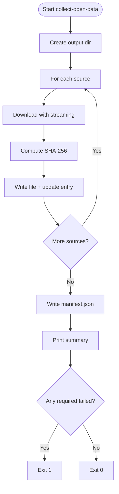
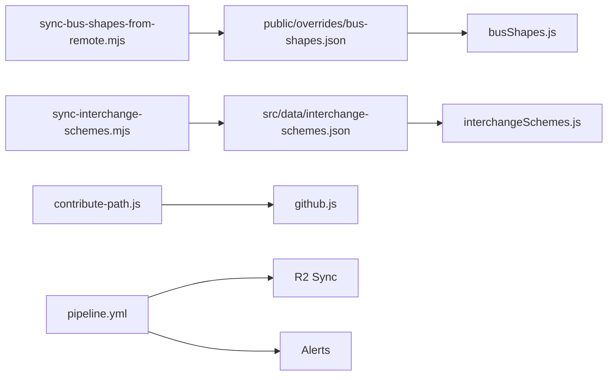

# Asset Synchronization Scripts

<cite>
**Referenced Files in This Document**
- [sync-bus-shapes-from-remote.mjs](file://scripts/sync-bus-shapes-from-remote.mjs)
- [sync-interchange-schemes.mjs](file://scripts/sync-interchange-schemes.mjs)
- [collect-open-data.mjs](file://scripts/collect-open-data.mjs)
- [busShapes.js](file://src/busShapes.js)
- [interchangeSchemes.js](file://src/interchangeSchemes.js)
- [overrides.js](file://src/overrides.js)
- [contribute-path.js](file://functions/api/contribute-path.js)
- [github.js](file://functions/_shared/github.js)
- [pipeline.yml](file://.github/workflows/pipeline.yml)
- [bus-shapes.json](file://public/overrides/bus-shapes.json)
- [interchange-schemes.json](file://src/data/interchange-schemes.json)
</cite>

## Table of Contents
1. [Introduction](#introduction)
2. [Project Structure](#project-structure)
3. [Core Components](#core-components)
4. [Architecture Overview](#architecture-overview)
5. [Detailed Component Analysis](#detailed-component-analysis)
6. [Dependency Analysis](#dependency-analysis)
7. [Performance Considerations](#performance-considerations)
8. [Troubleshooting Guide](#troubleshooting-guide)
9. [Conclusion](#conclusion)

## Introduction
This document explains the asset synchronization system that keeps local transit data consistent with official operator feeds and curated overrides. It focuses on:
- Bus shape synchronization: pulling reviewed route geometries from a remote source, validating geometry, and integrating them into the application’s routing and visualization layers.
- Interchange scheme synchronization: maintaining transfer relationships between different transit modes (MTR–PT and bus–bus), including automatic indexing of new interchange points and removal of deprecated connections.
- Conflict resolution and merge strategies when local modifications exist alongside remote updates.
- Rollback mechanisms for failed synchronization operations.
- Monitoring and alerting for synchronization failures and data quality issues.

The system is designed to be resilient, auditable, and easy to operate via scripts and GitHub Actions.

## Project Structure
At a high level, the synchronization system spans three areas:
- Scripts: Node-based tools that fetch, validate, and write synchronized artifacts.
- Source modules: Client-side logic that consumes synchronized assets and applies matching algorithms.
- Serverless functions and CI: Ingestion endpoints, GitHub integration for contributions, and pipeline monitoring/alerting.

**Diagram sources**
- [sync-bus-shapes-from-remote.mjs:1-59](file://scripts/sync-bus-shapes-from-remote.mjs#L1-L59)
- [sync-interchange-schemes.mjs:1-204](file://scripts/sync-interchange-schemes.mjs#L1-L204)
- [busShapes.js:1-804](file://src/busShapes.js#L1-L804)
- [interchangeSchemes.js:1-240](file://src/interchangeSchemes.js#L1-L240)
- [contribute-path.js:1-335](file://functions/api/contribute-path.js#L1-L335)
- [github.js:1-415](file://functions/_shared/github.js#L1-L415)
- [pipeline.yml:1-183](file://.github/workflows/pipeline.yml#L1-L183)
- [collect-open-data.mjs:1-289](file://scripts/collect-open-data.mjs#L1-L289)

**Section sources**
- [sync-bus-shapes-from-remote.mjs:1-59](file://scripts/sync-bus-shapes-from-remote.mjs#L1-L59)
- [sync-interchange-schemes.mjs:1-204](file://scripts/sync-interchange-schemes.mjs#L1-L204)
- [collect-open-data.mjs:1-289](file://scripts/collect-open-data.mjs#L1-L289)
- [busShapes.js:1-804](file://src/busShapes.js#L1-L804)
- [interchangeSchemes.js:1-240](file://src/interchangeSchemes.js#L1-L240)
- [overrides.js:1-300](file://src/overrides.js#L1-L300)
- [contribute-path.js:1-335](file://functions/api/contribute-path.js#L1-L335)
- [github.js:1-415](file://functions/_shared/github.js#L1-L415)
- [pipeline.yml:1-183](file://.github/workflows/pipeline.yml#L1-L183)

## Core Components
- Bus shape sync script: Downloads published bus route shapes from a remote JSON file and writes them to a local bundle file used by the app.
- Interchange schemes sync script: Fetches bus–bus interchange packages and indexes from operator sites, then updates a central JSON index consumed by the client.
- Client bus shape matcher: Matches route options to published shapes using scoring, agency filters, OD hints, and geometric similarity; supports visual stop overlays.
- Client interchange rule engine: Compiles rules for MTR–PT and bus–bus discounts, loads compact pairs for bus–bus concessions, and exposes lookups.
- Contribution intake API: Validates and stores draft path contributions, optionally opens GitHub PRs via OAuth or bot mode.
- CI pipeline: Collects open data, generates metadata, syncs artifacts to R2, and posts status alerts to webhooks.

**Section sources**
- [sync-bus-shapes-from-remote.mjs:1-59](file://scripts/sync-bus-shapes-from-remote.mjs#L1-L59)
- [sync-interchange-schemes.mjs:1-204](file://scripts/sync-interchange-schemes.mjs#L1-L204)
- [busShapes.js:1-804](file://src/busShapes.js#L1-L804)
- [interchangeSchemes.js:1-240](file://src/interchangeSchemes.js#L1-L240)
- [contribute-path.js:1-335](file://functions/api/contribute-path.js#L1-L335)
- [pipeline.yml:1-183](file://.github/workflows/pipeline.yml#L1-L183)

## Architecture Overview
The synchronization architecture combines scheduled or manual scripts with live client loading and CI-driven artifact management.

**Diagram sources**
- [sync-bus-shapes-from-remote.mjs:1-59](file://scripts/sync-bus-shapes-from-remote.mjs#L1-L59)
- [overrides.js:1-300](file://src/overrides.js#L1-L300)
- [busShapes.js:1-804](file://src/busShapes.js#L1-L804)

## Detailed Component Analysis

### Bus Shape Synchronization
Purpose: Maintain accurate bus route geometries by syncing reviewed contributions from a remote repository into a local bundle file consumed by the app.

Key behaviors:
- Loads environment variables from .env if present.
- Resolves the remote URL from environment variables or defaults to a known GitHub raw URL.
- Fetches JSON, validates structure (requires a routes array), and writes to public/overrides/bus-shapes.json.
- Logs counts and source URL for traceability.

**Diagram sources**
- [sync-bus-shapes-from-remote.mjs:1-59](file://scripts/sync-bus-shapes-from-remote.mjs#L1-L59)

**Section sources**
- [sync-bus-shapes-from-remote.mjs:1-59](file://scripts/sync-bus-shapes-from-remote.mjs#L1-L59)
- [bus-shapes.json:1-800](file://public/overrides/bus-shapes.json#L1-L800)

### Bus Shape Matching and Validation
Purpose: Apply reviewed bus shapes to route options, ensuring correct agency, direction, and geometric fit. Provide visual stop overlays for display-only adjustments.

Highlights:
- Exact match by route number and agency, with soft preferences for OD matches and direction.
- Geometric similarity fallback: projects stops onto candidate shapes, measures coverage, average error, forward progression, and end-point proximity.
- Visual stops: map contributor-provided visual coordinates to stop features without altering official GTFS identities.

**Diagram sources**
- [busShapes.js:1-804](file://src/busShapes.js#L1-L804)

**Section sources**
- [busShapes.js:1-804](file://src/busShapes.js#L1-L804)

### Interchange Scheme Synchronization
Purpose: Keep transfer relationships between transit modes current by fetching operator data and updating a centralized index.

Capabilities:
- Citybus package list: fetches available interchange packages and writes an index with titles and IDs.
- KMB/LWB matrix index: downloads large static matrices, builds a route-level index, and persists it under artifacts.
- Updates src/data/interchange-schemes.json with timestamps and notes about sources and sync status.

**Diagram sources**
- [sync-interchange-schemes.mjs:1-204](file://scripts/sync-interchange-schemes.mjs#L1-L204)
- [interchange-schemes.json:1-743](file://src/data/interchange-schemes.json#L1-L743)

**Section sources**
- [sync-interchange-schemes.mjs:1-204](file://scripts/sync-interchange-schemes.mjs#L1-L204)
- [interchange-schemes.json:1-743](file://src/data/interchange-schemes.json#L1-L743)

### Client Interchange Rule Engine
Purpose: Compile and apply interchange discount rules at runtime for MTR–PT and bus–bus transfers.

Features:
- Compiles MTR rules and bus–bus rules from src/data/interchange-schemes.json.
- Enables/disables sections via flags (e.g., mtr_pt.enabled, bus_bus.enabled).
- Loads compact bus–bus pairs from a bundled JSON and caches them for fast lookup.
- Provides lookups for maximum HKD discount between consecutive bus routes.

**Diagram sources**
- [interchangeSchemes.js:1-240](file://src/interchangeSchemes.js#L1-L240)

**Section sources**
- [interchangeSchemes.js:1-240](file://src/interchangeSchemes.js#L1-L240)

### Contribution Intake and Version Control Integration
Purpose: Allow contributors to submit revised bus shapes, which are validated and optionally turned into GitHub pull requests for review and merging.

Workflow:
- Client constructs a draft object with schema version, route identifiers, coordinates, and optional visual stops.
- Serverless function validates payload size, coordinate bounds, and required fields.
- Draft stored in KV/R2 with metadata; webhook notification sent if configured.
- If OAuth or bot token is available, opens a PR against the overrides repo with a branch per contribution.

**Diagram sources**
- [contribute-path.js:1-335](file://functions/api/contribute-path.js#L1-L335)
- [github.js:1-415](file://functions/_shared/github.js#L1-L415)

**Section sources**
- [contribute-path.js:1-335](file://functions/api/contribute-path.js#L1-L335)
- [github.js:1-415](file://functions/_shared/github.js#L1-L415)

### Open Data Collection and Artifact Management
Purpose: Periodically collect external datasets and routing artifacts, compute checksums, and publish metadata for freshness detection.

Highlights:
- Downloads multiple groups (MTR fares, TD bus data, edge routing assets).
- Streams large files to disk while computing SHA-256 hashes.
- Writes manifest.json with summary statistics and per-source details.
- Exits with failure if required sources fail.

**Diagram sources**
- [collect-open-data.mjs:1-289](file://scripts/collect-open-data.mjs#L1-L289)

**Section sources**
- [collect-open-data.mjs:1-289](file://scripts/collect-open-data.mjs#L1-L289)

## Dependency Analysis
The synchronization system has clear boundaries and minimal coupling:
- Scripts depend only on Node standard libraries and HTTP fetch.
- Client modules depend on synchronized JSON files and optional network resources.
- Serverless functions depend on GitHub APIs and storage backends.
- CI depends on secrets and environment variables for R2 and webhook notifications.

**Diagram sources**
- [sync-bus-shapes-from-remote.mjs:1-59](file://scripts/sync-bus-shapes-from-remote.mjs#L1-L59)
- [sync-interchange-schemes.mjs:1-204](file://scripts/sync-interchange-schemes.mjs#L1-L204)
- [busShapes.js:1-804](file://src/busShapes.js#L1-L804)
- [interchangeSchemes.js:1-240](file://src/interchangeSchemes.js#L1-L240)
- [contribute-path.js:1-335](file://functions/api/contribute-path.js#L1-L335)
- [github.js:1-415](file://functions/_shared/github.js#L1-L415)
- [pipeline.yml:1-183](file://.github/workflows/pipeline.yml#L1-L183)

**Section sources**
- [sync-bus-shapes-from-remote.mjs:1-59](file://scripts/sync-bus-shapes-from-remote.mjs#L1-L59)
- [sync-interchange-schemes.mjs:1-204](file://scripts/sync-interchange-schemes.mjs#L1-L204)
- [busShapes.js:1-804](file://src/busShapes.js#L1-L804)
- [interchangeSchemes.js:1-240](file://src/interchangeSchemes.js#L1-L240)
- [contribute-path.js:1-335](file://functions/api/contribute-path.js#L1-L335)
- [github.js:1-415](file://functions/_shared/github.js#L1-L415)
- [pipeline.yml:1-183](file://.github/workflows/pipeline.yml#L1-L183)

## Performance Considerations
- Large file handling: The interchange sync script downloads ~12MB matrices; consider running off-peak or caching results to reduce bandwidth.
- Streaming downloads: The open data collector streams large files and computes hashes in parallel with writing, minimizing memory usage.
- Client-side caching: The interchange module caches compact pairs after first load to avoid repeated network calls.
- Override loading strategy: The app tries multiple sources (API proxy, GitHub raw, local bundle) to balance freshness and reliability.

[No sources needed since this section provides general guidance]

## Troubleshooting Guide
Common issues and resolutions:
- Bus shape sync fails due to network errors or invalid JSON:
  - Verify environment variables for the remote URL.
  - Ensure the remote returns a valid JSON with a routes array.
  - Check logs for HTTP status codes and adjust retries or URLs.

- Interchange sync fails for Citybus or KMB:
  - Confirm operator endpoints are reachable and return expected structures.
  - Inspect artifacts for downloaded dumps and indexes.
  - Use skip flags to isolate failing sources during debugging.

- Client cannot load overrides:
  - Check browser console for warnings about missing routes[].
  - Ensure CORS headers allow access to the API proxy or raw GitHub URL.
  - Force reload of overrides cache if necessary.

- Contribution submission errors:
  - Validate payload size and coordinate bounds.
  - Ensure OAuth session or bot token is configured.
  - Review webhook delivery and storage backend availability.

- CI pipeline failures:
  - Verify secrets for R2 and webhook URLs.
  - Check metadata generation and artifact presence before sync.
  - Inspect webhook payloads for Discord/Slack/Telegram channels.

**Section sources**
- [sync-bus-shapes-from-remote.mjs:1-59](file://scripts/sync-bus-shapes-from-remote.mjs#L1-L59)
- [sync-interchange-schemes.mjs:1-204](file://scripts/sync-interchange-schemes.mjs#L1-L204)
- [overrides.js:1-300](file://src/overrides.js#L1-L300)
- [contribute-path.js:1-335](file://functions/api/contribute-path.js#L1-L335)
- [pipeline.yml:1-183](file://.github/workflows/pipeline.yml#L1-L183)

## Conclusion
The asset synchronization system provides robust mechanisms to keep local transit data aligned with official feeds and curated overrides. It includes:
- Reliable scripts for downloading and validating bus shapes and interchange schemes.
- Sophisticated client-side matching and discount engines for accurate routing and fare calculations.
- A contribution workflow that integrates with GitHub for peer review and version control.
- CI-driven artifact management with monitoring and alerting to ensure operational visibility.

By combining offline bundles, live overrides, and strict validation, the system balances freshness, correctness, and performance across diverse data sources.

[No sources needed since this section summarizes without analyzing specific files]