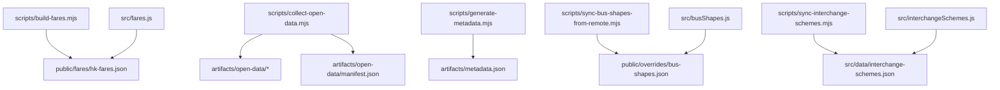
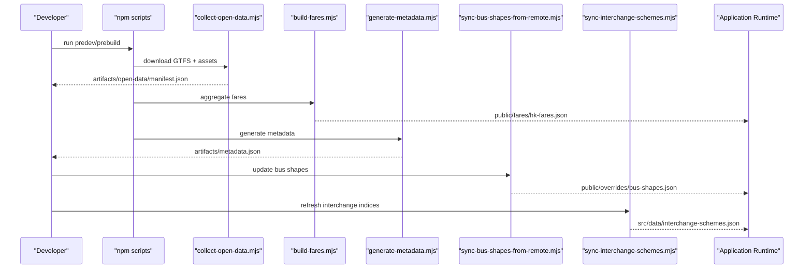
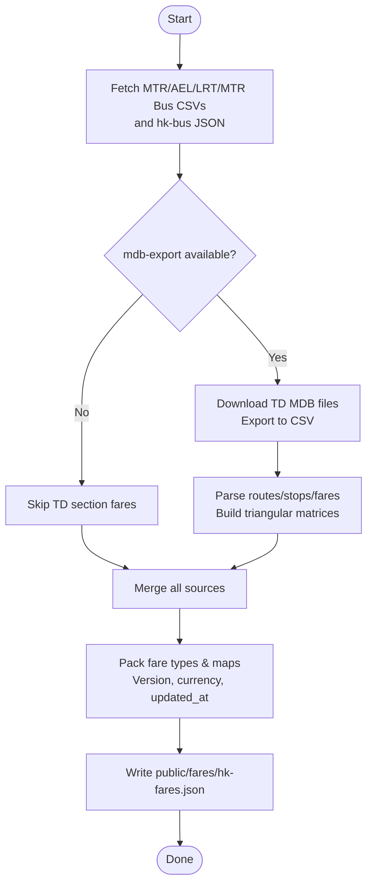
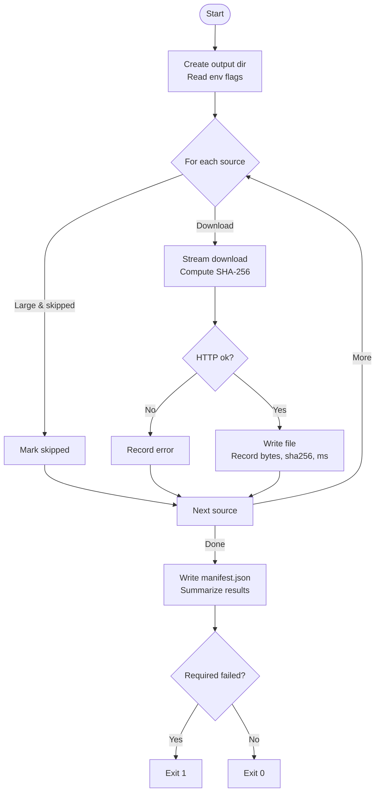
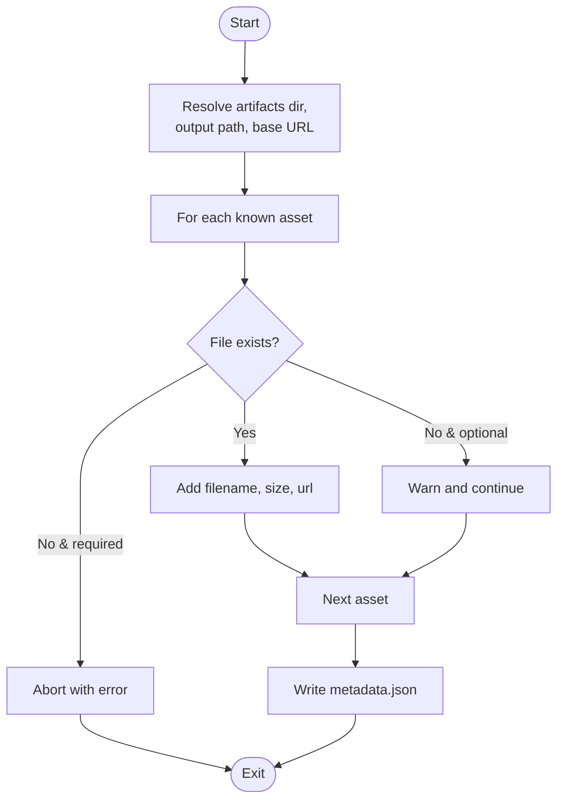
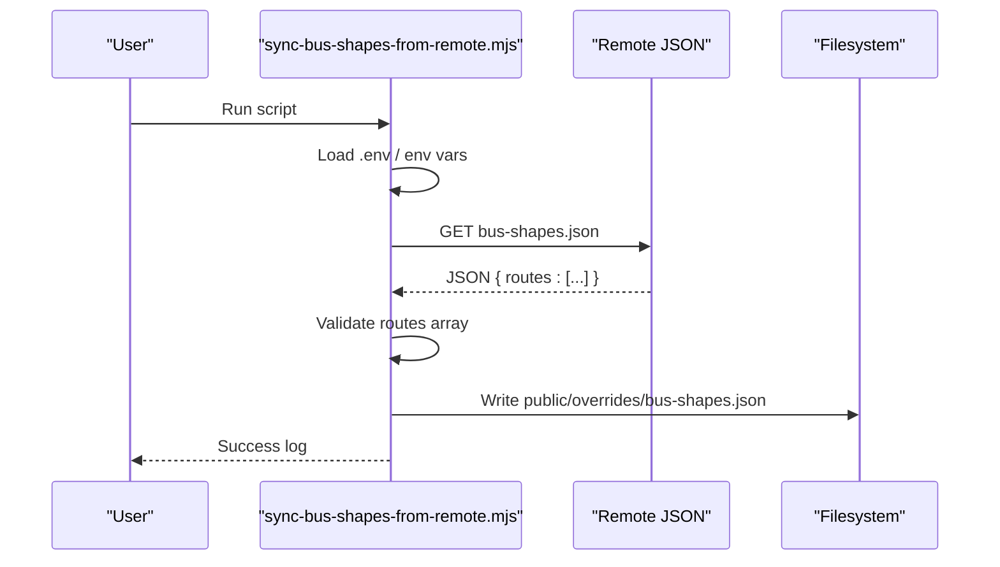
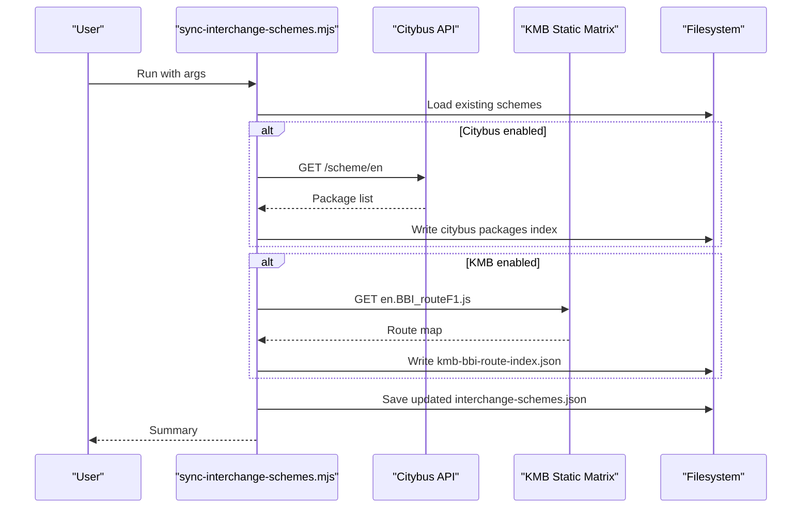
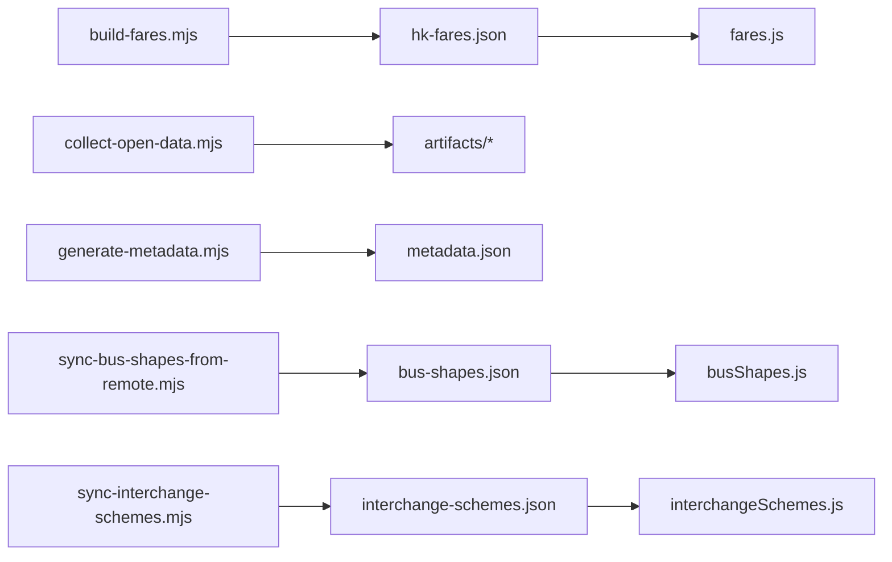

# Data Processing Scripts

<cite>
**Referenced Files in This Document**
- [build-fares.mjs](file://scripts/build-fares.mjs)
- [collect-open-data.mjs](file://scripts/collect-open-data.mjs)
- [generate-metadata.mjs](file://scripts/generate-metadata.mjs)
- [sync-bus-shapes-from-remote.mjs](file://scripts/sync-bus-shapes-from-remote.mjs)
- [sync-interchange-schemes.mjs](file://scripts/sync-interchange-schemes.mjs)
- [fares.js](file://src/fares.js)
- [interchangeSchemes.js](file://src/interchangeSchemes.js)
- [busShapes.js](file://src/busShapes.js)
- [package.json](file://package.json)
</cite>

## Table of Contents
1. [Introduction](#introduction)
2. [Project Structure](#project-structure)
3. [Core Components](#core-components)
4. [Architecture Overview](#architecture-overview)
5. [Detailed Component Analysis](#detailed-component-analysis)
6. [Dependency Analysis](#dependency-analysis)
7. [Performance Considerations](#performance-considerations)
8. [Troubleshooting Guide](#troubleshooting-guide)
9. [Conclusion](#conclusion)

## Introduction
This document explains MorganTraveler’s data processing scripts that automate transit data management and asset preparation. It covers:
- Fare calculation script that aggregates operator-specific pricing, discount schemes, and payment method validations into optimized fare tables for client-side estimates.
- Open data collection script that downloads GTFS feeds and related assets from multiple operators, validates integrity via checksums, and records a manifest.
- Metadata generation script that creates searchable indexes for published data assets (GTFS, PMTiles, router graphs).
- Bus shape synchronization script that updates route geometries from remote sources for offline bundling.
- Interchange scheme synchronization script that maintains transfer relationships between different transit modes.

It also documents error handling, logging, and robustness patterns used across these scripts.

## Project Structure
The scripts live under scripts/ and produce artifacts consumed by the application:
- Fares pack: public/fares/hk-fares.json
- Open data artifacts: artifacts/open-data/* with manifest.json
- Metadata index: artifacts/metadata.json
- Overrides: public/overrides/bus-shapes.json
- Interchange rules: src/data/interchange-schemes.json (updated by sync script)

**Diagram sources**
- [build-fares.mjs:1-578](file://scripts/build-fares.mjs#L1-L578)
- [collect-open-data.mjs:1-289](file://scripts/collect-open-data.mjs#L1-L289)
- [generate-metadata.mjs:1-75](file://scripts/generate-metadata.mjs#L1-L75)
- [sync-bus-shapes-from-remote.mjs:1-59](file://scripts/sync-bus-shapes-from-remote.mjs#L1-L59)
- [sync-interchange-schemes.mjs:1-204](file://scripts/sync-interchange-schemes.mjs#L1-L204)
- [fares.js:1-800](file://src/fares.js#L1-L800)
- [interchangeSchemes.js:1-240](file://src/interchangeSchemes.js#L1-L240)
- [busShapes.js:1-800](file://src/busShapes.js#L1-L800)

**Section sources**
- [package.json:7-25](file://package.json#L7-L25)

## Core Components
- Fare builder: Aggregates MTR heavy rail, Airport Express, Light Rail, MTR Bus, franchised bus/GMB/ferry fares, and TD section fares into a single compact JSON for client-side lookup.
- Open data collector: Downloads GTFS and other large assets, computes SHA-256, writes a manifest with status and sizes.
- Metadata generator: Scans artifacts directory to build a metadata index with URLs and sizes for runtime discovery.
- Bus shapes sync: Pulls reviewed bus route shapes from a remote source into local overrides for offline use.
- Interchange schemes sync: Refreshes bus–bus interchange indices from Citybus and KMB/LWB sources and persists them into a central JSON.

These components are orchestrated via npm scripts and GitHub Actions workflows.

**Section sources**
- [package.json:7-25](file://package.json#L7-L25)

## Architecture Overview
The data pipeline is modular and idempotent:
- Collectors fetch raw data and validate integrity.
- Builders transform raw data into optimized client formats.
- Sync scripts maintain operational datasets (shapes, interchange rules).
- The application consumes these outputs at runtime for fare estimation, routing, and visualization.

**Diagram sources**
- [collect-open-data.mjs:1-289](file://scripts/collect-open-data.mjs#L1-L289)
- [build-fares.mjs:1-578](file://scripts/build-fares.mjs#L1-L578)
- [generate-metadata.mjs:1-75](file://scripts/generate-metadata.mjs#L1-L75)
- [sync-bus-shapes-from-remote.mjs:1-59](file://scripts/sync-bus-shapes-from-remote.mjs#L1-L59)
- [sync-interchange-schemes.mjs:1-204](file://scripts/sync-interchange-schemes.mjs#L1-L204)

## Detailed Component Analysis

### Fare Calculation Script (build-fares.mjs)
Purpose:
- Download and parse official open data for MTR lines, Airport Express, Light Rail, and MTR Bus.
- Aggregate full-journey adult fares for franchised bus, GMB, and ferry from hk-bus-crawling.
- Process TD FARE_BUS.mdb section fares (requires mdb-export) to build triangular price matrices per bound.
- Output a versioned fare pack consumed by the client fare engine.

Key behaviors:
- Multi-source aggregation with typed fare matrices (adult, child, student, elderly, JoyYou 60/65, single ride, contactless).
- Operator mapping for TD company codes to internal agency keys.
- Robust CSV parsing and money normalization.
- Optional fallbacks when external dependencies or networks fail.

Client integration:
- The app loads hk-fares.json and uses it to estimate fares per leg, apply interchange discounts, and scale concessions.

**Diagram sources**
- [build-fares.mjs:76-146](file://scripts/build-fares.mjs#L76-L146)
- [build-fares.mjs:202-354](file://scripts/build-fares.mjs#L202-L354)
- [build-fares.mjs:363-515](file://scripts/build-fares.mjs#L363-L515)
- [build-fares.mjs:517-578](file://scripts/build-fares.mjs#L517-L578)

**Section sources**
- [build-fares.mjs:1-578](file://scripts/build-fares.mjs#L1-L578)
- [fares.js:192-423](file://src/fares.js#L192-L423)
- [fares.js:460-503](file://src/fares.js#L460-L503)

### Open Data Collection Script (collect-open-data.mjs)
Purpose:
- Download changing data sources (fares, GTFS, basemap tiles, router graphs) into a structured artifacts directory.
- Compute SHA-256 checksums and record HTTP status, size, timestamps, and errors.
- Enforce required vs optional sources; exit non-zero if required sources fail.

Key behaviors:
- Streaming downloads for memory efficiency.
- Large file skip via environment variable.
- Manifest output for CI and downstream steps.

Error handling:
- Per-source try/catch with detailed entry-level error capture.
- Required failure detection and explicit process exit code.

**Diagram sources**
- [collect-open-data.mjs:170-238](file://scripts/collect-open-data.mjs#L170-L238)
- [collect-open-data.mjs:240-289](file://scripts/collect-open-data.mjs#L240-L289)

**Section sources**
- [collect-open-data.mjs:1-289](file://scripts/collect-open-data.mjs#L1-L289)

### Metadata Generation Script (generate-metadata.mjs)
Purpose:
- Scan artifacts directory for published assets (GTFS zip, PMTiles, wheelsrouter, graph).
- Produce a metadata index with filenames, sizes, and public URLs for runtime discovery.

Key behaviors:
- Supports optional assets; aborts if required assets are missing.
- Uses configurable base URL for constructing asset links.

**Diagram sources**
- [generate-metadata.mjs:17-75](file://scripts/generate-metadata.mjs#L17-L75)

**Section sources**
- [generate-metadata.mjs:1-75](file://scripts/generate-metadata.mjs#L1-L75)

### Bus Shape Synchronization Script (sync-bus-shapes-from-remote.mjs)
Purpose:
- Pull reviewed bus route shapes from a remote JSON into the local overrides bundle for offline use.

Key behaviors:
- Reads configuration from environment variables or .env.
- Validates structure (routes array) before writing.
- Writes to public/overrides/bus-shapes.json.

Error handling:
- Exits with error on HTTP failures or invalid payload.

**Diagram sources**
- [sync-bus-shapes-from-remote.mjs:19-59](file://scripts/sync-bus-shapes-from-remote.mjs#L19-L59)

**Section sources**
- [sync-bus-shapes-from-remote.mjs:1-59](file://scripts/sync-bus-shapes-from-remote.mjs#L1-L59)
- [busShapes.js:77-86](file://src/busShapes.js#L77-L86)

### Interchange Scheme Synchronization Script (sync-interchange-schemes.mjs)
Purpose:
- Refresh bus–bus interchange indices from Citybus and KMB/LWB sources.
- Persist an index and summary into src/data/interchange-schemes.json and artifacts for client consumption.

Key behaviors:
- Citybus package list and optional detail dump.
- KMB static matrix index (F1) with route counts and artifact references.
- Argument-driven control (skip providers, detail dumps).

Error handling:
- Non-fatal provider failures; continues syncing others.
- Persists partial updates safely.

**Diagram sources**
- [sync-interchange-schemes.mjs:41-70](file://scripts/sync-interchange-schemes.mjs#L41-L70)
- [sync-interchange-schemes.mjs:82-116](file://scripts/sync-interchange-schemes.mjs#L82-L116)
- [sync-interchange-schemes.mjs:118-170](file://scripts/sync-interchange-schemes.mjs#L118-L170)
- [sync-interchange-schemes.mjs:172-204](file://scripts/sync-interchange-schemes.mjs#L172-L204)

**Section sources**
- [sync-interchange-schemes.mjs:1-204](file://scripts/sync-interchange-schemes.mjs#L1-L204)
- [interchangeSchemes.js:1-240](file://src/interchangeSchemes.js#L1-L240)

## Dependency Analysis
Scripts depend on:
- External tools: mdb-export for TD MDB parsing (optional).
- Network sources: MTR open data, Transport Department MDBs, hk-bus-crawling JSON, Citybus/KMB APIs/static assets.
- Application modules: Client fare engine and interchange rule loader consume generated artifacts.

Runtime coupling:
- fares.js expects hk-fares.json with specific schema and versioning.
- interchangeSchemes.js reads src/data/interchange-schemes.json and optionally loads compact BBI pairs.
- busShapes.js reads public/overrides/bus-shapes.json for reviewed route geometries.

**Diagram sources**
- [build-fares.mjs:517-578](file://scripts/build-fares.mjs#L517-L578)
- [collect-open-data.mjs:240-289](file://scripts/collect-open-data.mjs#L240-L289)
- [generate-metadata.mjs:37-75](file://scripts/generate-metadata.mjs#L37-L75)
- [sync-bus-shapes-from-remote.mjs:33-59](file://scripts/sync-bus-shapes-from-remote.mjs#L33-L59)
- [sync-interchange-schemes.mjs:172-204](file://scripts/sync-interchange-schemes.mjs#L172-L204)
- [fares.js:460-503](file://src/fares.js#L460-L503)
- [interchangeSchemes.js:118-170](file://src/interchangeSchemes.js#L118-L170)
- [busShapes.js:77-86](file://src/busShapes.js#L77-L86)

**Section sources**
- [package.json:7-25](file://package.json#L7-L25)

## Performance Considerations
- Streaming downloads in collect-open-data reduce memory usage for large assets.
- Parallel fetching in build-fares minimizes total download time for independent sources.
- Compact matrices and triangular representations in fare packs reduce client memory footprint.
- Skipping large files via environment flag avoids unnecessary bandwidth during development.
- Metadata generation avoids loading large files; only stat-based size checks.

[No sources needed since this section provides general guidance]

## Troubleshooting Guide
Common issues and resolutions:
- Missing mdb-export: TD section fares will be skipped; install mdbtools to enable.
- Network failures: Scripts log per-source errors; check artifacts/open-data/manifest.json for details.
- Required source failures: collect-open-data exits non-zero; re-run after resolving network or availability.
- Invalid bus shapes payload: Ensure remote JSON contains a routes array; otherwise sync fails.
- Interchange sync partial failures: Individual provider failures are logged but do not stop the entire sync.

Operational tips:
- Use COLLECT_SKIP_LARGE=1 to avoid downloading large assets during quick runs.
- Inspect logs prefixed with script names for precise diagnostics.
- Verify artifacts exist before running dependent steps (e.g., metadata generation requires GTFS/PMTiles present).

**Section sources**
- [build-fares.mjs:383-415](file://scripts/build-fares.mjs#L383-L415)
- [collect-open-data.mjs:197-238](file://scripts/collect-open-data.mjs#L197-L238)
- [collect-open-data.mjs:276-289](file://scripts/collect-open-data.mjs#L276-L289)
- [sync-bus-shapes-from-remote.mjs:40-59](file://scripts/sync-bus-shapes-from-remote.mjs#L40-L59)
- [sync-interchange-schemes.mjs:177-191](file://scripts/sync-interchange-schemes.mjs#L177-L191)

## Conclusion
MorganTraveler’s data processing scripts provide a robust, modular pipeline for automating transit data management and asset preparation. They integrate multiple operators’ open data, enforce integrity, and produce optimized artifacts for client-side fare estimation, routing, and visualization. Error handling and logging ensure resilience against network and dependency variability, while clear separation of concerns allows independent evolution of data sources and consumer logic.

[No sources needed since this section summarizes without analyzing specific files]