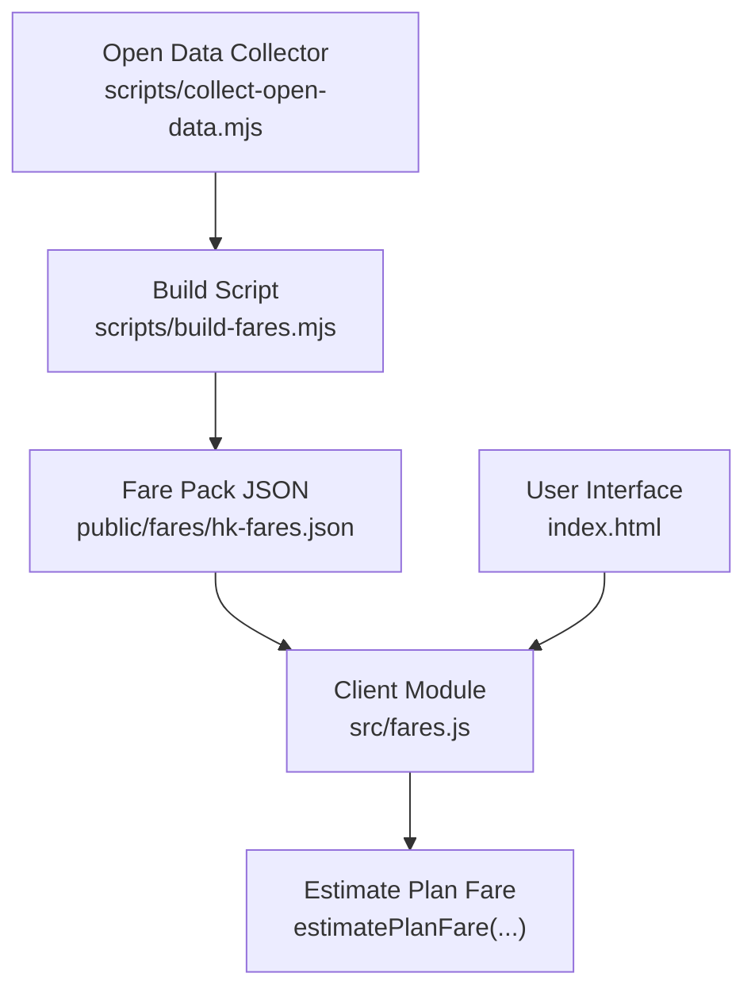
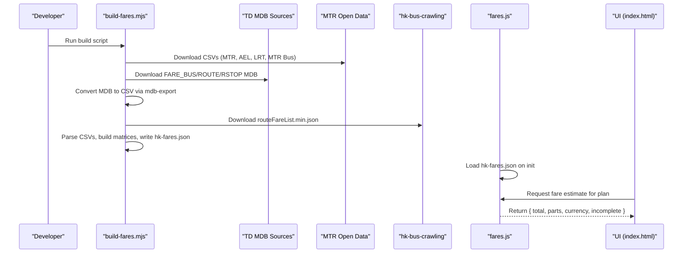
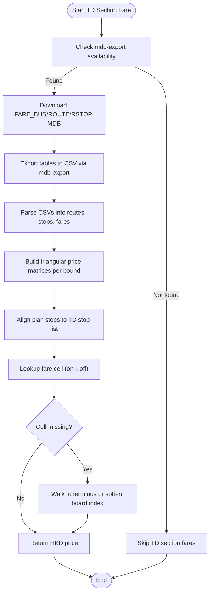

# Fare Calculation Script

<cite>
**Referenced Files in This Document**
- [build-fares.mjs](file://scripts/build-fares.mjs)
- [fares.js](file://src/fares.js)
- [collect-open-data.mjs](file://scripts/collect-open-data.mjs)
- [index.html](file://index.html)
</cite>

## Table of Contents
1. [Introduction](#introduction)
2. [Project Structure](#project-structure)
3. [Core Components](#core-components)
4. [Architecture Overview](#architecture-overview)
5. [Detailed Component Analysis](#detailed-component-analysis)
6. [Dependency Analysis](#dependency-analysis)
7. [Performance Considerations](#performance-considerations)
8. [Troubleshooting Guide](#troubleshooting-guide)
9. [Conclusion](#conclusion)
10. [Appendices](#appendices)

## Introduction
This document explains the fare calculation system that powers transit fare estimation for Hong Kong public transport. It covers how the build script downloads and parses official open data from MTR, Airport Express, Light Rail, and bus operators; how it processes complex TD franchised bus section fares using mdb-export to convert Microsoft Access databases into CSV; how it builds triangular price matrices for route segments; and how the client-side system consumes the generated JSON to estimate fares across multiple ticket types including Octopus variants (adult, student, child, elderly/JoyYou 65+, JoyYou 60–64), single tickets, contactless bank cards, QR-based payments, and China T-Union cards. It also documents currency handling with HKD precision, fallback mechanisms when external sources are unavailable, input/output formats, and integration points with the client-side fare estimation engine.

## Project Structure
The fare system is split between a Node build-time pipeline and a browser runtime:
- Build-time scripts download and transform operator data into a compact JSON bundle consumed by the app.
- The client module loads this JSON and estimates fares per leg, applying interchange rules, concessions, and per-leg formulas.

**Diagram sources**
- [build-fares.mjs:1-13](file://scripts/build-fares.mjs#L1-L13)
- [build-fares.mjs:517-561](file://scripts/build-fares.mjs#L517-L561)
- [fares.js:460-496](file://src/fares.js#L460-L496)
- [collect-open-data.mjs:31-166](file://scripts/collect-open-data.mjs#L31-L166)
- [index.html:1016-1043](file://index.html#L1016-L1043)

**Section sources**
- [build-fares.mjs:1-13](file://scripts/build-fares.mjs#L1-L13)
- [collect-open-data.mjs:31-166](file://scripts/collect-open-data.mjs#L31-L166)
- [fares.js:460-496](file://src/fares.js#L460-L496)
- [index.html:1016-1043](file://index.html#L1016-L1043)

## Core Components
- Fare pack builder: Downloads CSVs and MDB files, converts MDB to CSV via mdb-export, parses multi-type matrices, and writes hk-fares.json.
- Client fare estimator: Loads hk-fares.json, maps UI ticket types to matrix keys, resolves OD fares for MTR/AEL/LRT/MTR Bus, and estimates bus/ferry fares using TD section matrices or full-journey fallbacks. Applies interchange discounts, free connections, and JoyYou formulas per leg.

Key responsibilities:
- Data ingestion and transformation at build time.
- Robust lookup and fallback strategies at runtime.
- Accurate HKD rounding and consistent currency metadata.

**Section sources**
- [build-fares.mjs:23-58](file://scripts/build-fares.mjs#L23-L58)
- [build-fares.mjs:92-146](file://scripts/build-fares.mjs#L92-L146)
- [build-fares.mjs:202-354](file://scripts/build-fares.mjs#L202-L354)
- [build-fares.mjs:356-515](file://scripts/build-fares.mjs#L356-L515)
- [fares.js:193-218](file://src/fares.js#L193-L218)
- [fares.js:460-496](file://src/fares.js#L460-L496)
- [fares.js:785-820](file://src/fares.js#L785-L820)
- [fares.js:1393-1443](file://src/fares.js#L1393-L1443)

## Architecture Overview
The system follows a two-phase architecture:
- Phase 1 (Build): Fetches official open data and TD Access databases, converts them to CSV, builds typed fare matrices, and outputs hk-fares.json.
- Phase 2 (Runtime): Browser loads hk-fares.json, normalizes inputs, selects appropriate matrices per mode and ticket type, applies interchange rules and per-leg formulas, and returns a structured fare result.

**Diagram sources**
- [build-fares.mjs:517-561](file://scripts/build-fares.mjs#L517-L561)
- [build-fares.mjs:356-515](file://scripts/build-fares.mjs#L356-L515)
- [fares.js:460-496](file://src/fares.js#L460-L496)
- [index.html:1016-1043](file://index.html#L1016-L1043)

## Detailed Component Analysis

### Fare Pack Builder (scripts/build-fares.mjs)
Responsibilities:
- Define fare types and source URLs for MTR heavy rail, Airport Express, Light Rail, MTR Bus, and TD franchised bus/GMB data.
- Parse CSVs with a minimal parser that handles quoted fields and BOM headers.
- Normalize money values to HKD with cent precision.
- Build typed matrices for each operator and output a unified fare pack.

Key functions and behaviors:
- CSV parsing and money normalization ensure robust ingestion and consistent HKD rounding.
- Operator-specific packing functions create byId/byName maps keyed by station IDs or names, plus per-type matrices.
- TD bus section processing:
  - Checks for mdb-export availability; if missing, logs a warning and skips TD section fares.
  - Downloads FARE_BUS.mdb, ROUTE_BUS.mdb, RSTOP_BUS.mdb, exports tables to CSV, and constructs triangular matrices for each bound (route sequence).
  - Maps company codes to client agency keys and aggregates stop lists with bilingual label cleaning.
  - Produces a compact busSection index keyed by "co|ROUTE" with variants containing stop arrays and triangular price arrays stored in cents × 10.

Fallback behavior:
- If hkbus fare list is unavailable, continues with an empty route list and warns.
- If mdb-export is not installed, TD section fares are omitted but other data sources still build successfully.

Output structure highlights:
- Versioned fare pack with currency set to HKD.
- Includes mtr, ael, lrt, mtrBus, bus (full-journey fallback), and busSection (optional).
- Metadata includes updated_at timestamp and source URLs.

**Section sources**
- [build-fares.mjs:23-58](file://scripts/build-fares.mjs#L23-L58)
- [build-fares.mjs:92-146](file://scripts/build-fares.mjs#L92-L146)
- [build-fares.mjs:202-354](file://scripts/build-fares.mjs#L202-L354)
- [build-fares.mjs:356-515](file://scripts/build-fares.mjs#L356-L515)
- [build-fares.mjs:517-561](file://scripts/build-fares.mjs#L517-L561)

### Client Fare Estimator (src/fares.js)
Responsibilities:
- Load hk-fares.json once and cache it.
- Map UI ticket types to internal matrix keys used by the fare pack.
- Resolve OD fares for MTR, AEL, LRT, and MTR Bus using name/id lookups and fallbacks.
- Estimate bus/ferry fares using TD section matrices when available, otherwise fall back to full-journey adult fares from hk-bus-crawling.
- Apply interchange discounts, free connections, and per-leg formulas (e.g., JoyYou 60–64).
- Compute totals with HKD precision and mark results as incomplete when some legs lack fare data.

Ticket type mapping and matrix selection:
- UI types like qr_adult/contactless/china_tunion map to octopus_adult matrices.
- Child and student types use dedicated matrices where available; otherwise scale from adult with half-fare logic.
- JoyYou 65+ uses elderly matrix with exclusions for border stations; JoyYou 60–64 uses adult matrix then applies per-leg formula.

AEL special handling:
- No JoyYou/elderly concessions; child/single mappings apply directly.
- Station name normalization accounts for AEL-specific naming conventions.

LRT handling:
- Uses official stop IDs and code/name maps to resolve fares.
- Free interchange hubs with MTR recognized for Octopus family types.

Bus/Ferry estimation:
- Prefers MTR Bus flat table for K-routes and LRT feeder routes.
- For franchised bus/GMB, attempts TD section fare lookup first; aligns plan stops to TD stop sequences using scoring and interpolation; reads triangular matrices with flexible fallbacks toward terminus.
- Falls back to full-journey adult fares aggregated from hk-bus-crawling, with scaling for child fares.

JoyYou payable calculation:
- Per-leg formula applied after free legs/discounts: ≤HK$10 → HK$2 (or original if lower); >HK$10 → 20% rounded to nearest 10 cents.
- Excludes AEL legs and first-class premium line items.

Total computation:
- Sums known amounts; walk legs count as $0 when other legs are priced.
- Marks incomplete true if any transit leg lacks fare data.

**Section sources**
- [fares.js:193-218](file://src/fares.js#L193-L218)
- [fares.js:460-496](file://src/fares.js#L460-L496)
- [fares.js:643-689](file://src/fares.js#L643-L689)
- [fares.js:696-748](file://src/fares.js#L696-L748)
- [fares.js:755-783](file://src/fares.js#L755-L783)
- [fares.js:785-820](file://src/fares.js#L785-L820)
- [fares.js:1230-1391](file://src/fares.js#L1230-L1391)
- [fares.js:1393-1443](file://src/fares.js#L1393-L1443)
- [fares.js:1933-2216](file://src/fares.js#L1933-L2216)

### TD Bus Section Processing Flow
The TD bus section fare process transforms raw Access tables into a compact triangular matrix per route bound and aligns plan stops to find the correct boarding/alight segment.

**Diagram sources**
- [build-fares.mjs:356-515](file://scripts/build-fares.mjs#L356-L515)
- [fares.js:1230-1391](file://src/fares.js#L1230-L1391)

**Section sources**
- [build-fares.mjs:356-515](file://scripts/build-fares.mjs#L356-L515)
- [fares.js:1230-1391](file://src/fares.js#L1230-L1391)

### Input Data Formats
- MTR/AEL/LRT/MTR Bus: CSV files downloaded from MTR open data endpoints. Columns vary by source; the builder maps them to standardized fare types and creates byId/byName matrices.
- TD Access databases: FARE_BUS.mdb, ROUTE_BUS.mdb, RSTOP_BUS.mdb contain route sequences, stop names, and section fares. Converted to CSV via mdb-export and parsed into triangular matrices.
- hk-bus-crawling: JSON with route-level full-journey fares per operator; used as fallback for bus/ferry when section data is unavailable.

Examples of expected structures:
- MTR CSV rows include origin/destination IDs and names along with fare columns for each ticket type.
- TD FARE_BUS rows include route ID, route sequence, ON_SEQ, OFF_SEQ, PRICE.
- TD ROUTE/RSTOP provide route metadata and ordered stop names.
- hk-bus-crawling entries include route identifiers and arrays of fares.

**Section sources**
- [build-fares.mjs:48-58](file://scripts/build-fares.mjs#L48-L58)
- [build-fares.mjs:202-354](file://scripts/build-fares.mjs#L202-L354)
- [build-fares.mjs:356-515](file://scripts/build-fares.mjs#L356-L515)

### Output JSON Structure
The build script writes hk-fares.json with:
- version, currency ("HKD"), fare_types array, default_fare_type, updated_at timestamp, sources map.
- mtr: idToName, byType maps, and flattened byId/byName for quick lookup.
- ael: byType maps and flattened byId/byName.
- lrt: byType maps, idToName, nameToId, codeToId for stop resolution.
- mtrBus: byType maps and flattened route-to-fare map.
- bus: byCoRoute and byRoute for full-journey adult fares (fallback).
- busSection: optional; co|ROUTE → variants with stop arrays and triangular matrices (cents × 10).

Client consumption:
- The client loads hk-fares.json during initialization and caches it.
- It uses the metadata to determine currency and fare types and selects appropriate matrices based on active fare type.

**Section sources**
- [build-fares.mjs:541-561](file://scripts/build-fares.mjs#L541-L561)
- [fares.js:460-496](file://src/fares.js#L460-L496)

### Integration with Client-Side Fare Estimation System
Integration points:
- Initialization: The client fetches hk-fares.json with cache busting and logs load stats. Errors trigger guidance to rebuild fares.
- UI selection: Users choose ticket types in the interface; selections persist and influence matrix key mapping and per-leg calculations.
- Estimation flow: estimatePlanFare computes per-leg fares, applies interchange rules, free connections, and JoyYou formulas, then returns a structured result with total, currency, parts, completeness flag, and fare type.

Example call path:
- UI triggers plan request.
- Client calls estimatePlanFare with plan and active fare type.
- Function iterates legs, resolves mode-specific fares, applies discounts/formulas, sums totals, and returns result.

**Section sources**
- [fares.js:460-496](file://src/fares.js#L460-L496)
- [fares.js:1933-2216](file://src/fares.js#L1933-L2216)
- [index.html:1016-1043](file://index.html#L1016-L1043)

## Dependency Analysis
Build-time dependencies:
- External tool: mdb-export must be installed to process TD Access databases.
- Network access: Requires fetching CSVs and MDB files from MTR and TD endpoints, plus JSON from hk-bus-crawling.

Runtime dependencies:
- Browser fetch to retrieve hk-fares.json.
- Optional offline summaries for bus–bus interchange discounts loaded in parallel.

Coupling and cohesion:
- Build script encapsulates all data transformation logic; client module focuses on estimation and UI integration.
- Clear separation ensures maintainability: changes to data sources affect build script; changes to pricing rules affect client module.

Potential circular dependencies:
- None observed; build and runtime modules are decoupled.

External integrations:
- MTR open data endpoints.
- TD static data.gov.hk endpoints.
- hk-bus-crawling hosted JSON.

**Section sources**
- [build-fares.mjs:356-515](file://scripts/build-fares.mjs#L356-L515)
- [fares.js:460-496](file://src/fares.js#L460-L496)

## Performance Considerations
- Parallel downloads: The build script fetches multiple sources concurrently to reduce build time.
- Triangular matrices: Compact representation reduces memory footprint for bus section fares while enabling efficient lookup.
- Name matching and alignment: Scoring and interpolation avoid expensive operations by limiting search ranges and preferring identity mapping when lengths match.
- Caching: hk-fares.json is fetched once and cached; client logs warnings if concession matrices appear incomplete.

[No sources needed since this section provides general guidance]

## Troubleshooting Guide
Common issues and resolutions:
- mdb-export not found:
  - Symptom: TD bus section fares skipped; console warns about missing mdb-export.
  - Resolution: Install mdbtools (e.g., brew install mdbtools) and rerun the build script.
- hk-bus-crawling unavailable:
  - Symptom: Full-journey fallback for bus/ferry missing; console warns and proceeds with empty route list.
  - Resolution: Ensure network access to hk-bus-crawling endpoint; rebuild fares when available.
- Fare data missing at runtime:
  - Symptom: Client throws error indicating fare data missing; suggests running npm run build:fares.
  - Resolution: Rebuild fares to generate hk-fares.json; verify server serves the file correctly.
- Incomplete concession matrices:
  - Symptom: Console warns student/child matrices missing/incomplete.
  - Resolution: Rebuild fares to ensure all CSV sources are available and parsed correctly.

**Section sources**
- [build-fares.mjs:383-396](file://scripts/build-fares.mjs#L383-L396)
- [build-fares.mjs:525-533](file://scripts/build-fares.mjs#L525-L533)
- [fares.js:460-496](file://src/fares.js#L460-L496)

## Conclusion
The fare calculation system combines authoritative open data and detailed TD section information to deliver accurate, multi-ticket-type fare estimates across Hong Kong’s transit network. The build pipeline robustly ingests and transforms heterogeneous data sources into a compact, client-friendly format. The runtime estimator applies sophisticated lookup, alignment, and fallback strategies to handle real-world variability, while maintaining HKD precision and clear incompleteness signaling. Together, these components enable reliable fare estimation integrated seamlessly into the user interface.

[No sources needed since this section summarizes without analyzing specific files]

## Appendices

### Fare Type Mapping Summary
- UI types mapped to matrix keys:
  - qr_adult/contactless/china_tunion → octopus_adult
  - octopus_child/qr_child → octopus_child (with fallback to student/adult)
  - octopus_student → octopus_student (with fallback to child/adult)
  - octopus_joyyou_65 → octopus_elderly (with exclusions and fallbacks)
  - octopus_joyyou_60 → octopus_adult (then per-leg formula)
  - single_ride → single_adult (with adult fallback and scaling)

**Section sources**
- [fares.js:193-218](file://src/fares.js#L193-L218)
- [fares.js:643-689](file://src/fares.js#L643-L689)
- [fares.js:696-748](file://src/fares.js#L696-L748)

### Currency Handling
- All monetary values normalized to HKD with cent precision using a money function that strips commas and rounds to two decimals.
- Output JSON declares currency as "HKD"; client formatting preserves one-decimal display for HKD values.

**Section sources**
- [build-fares.mjs:143-146](file://scripts/build-fares.mjs#L143-L146)
- [build-fares.mjs:541-561](file://scripts/build-fares.mjs#L541-L561)
- [fares.js:2218-2221](file://src/fares.js#L2218-L2221)