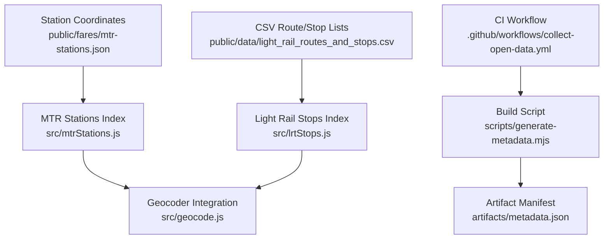
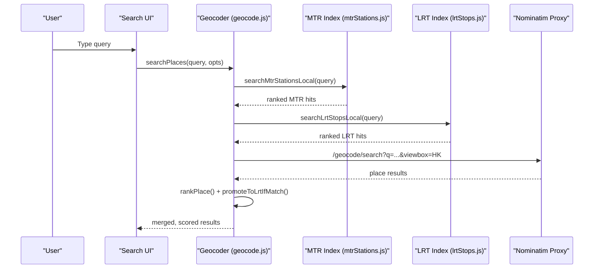
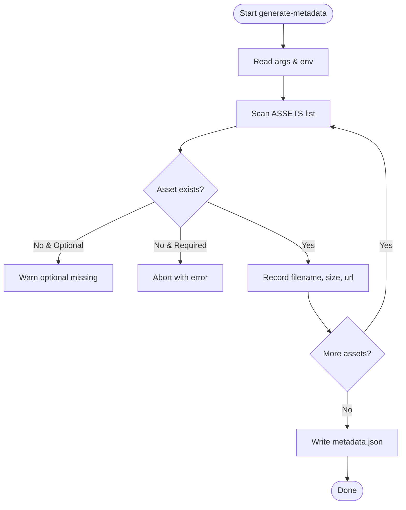
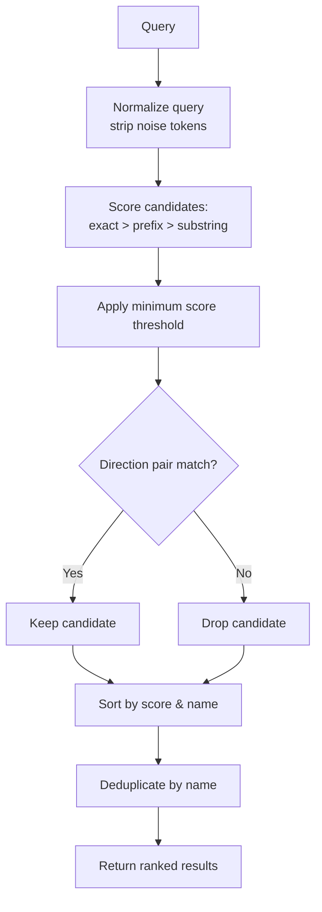
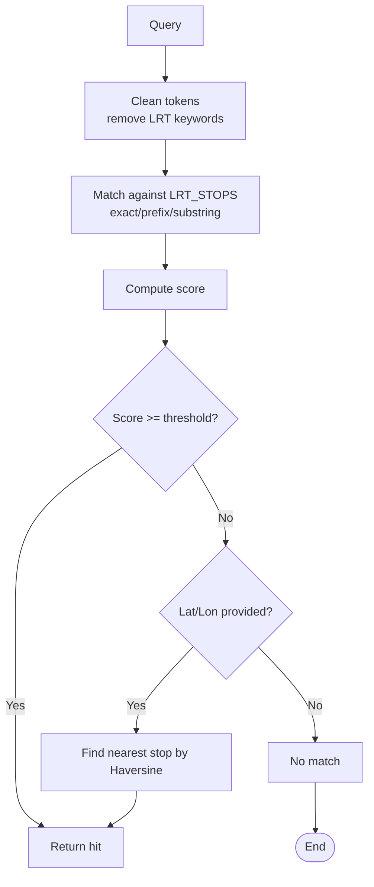
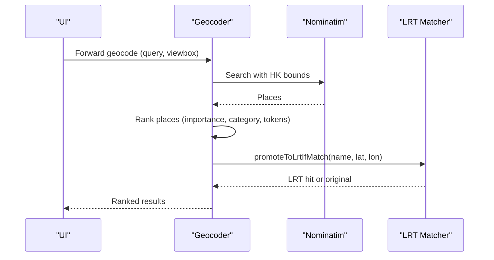
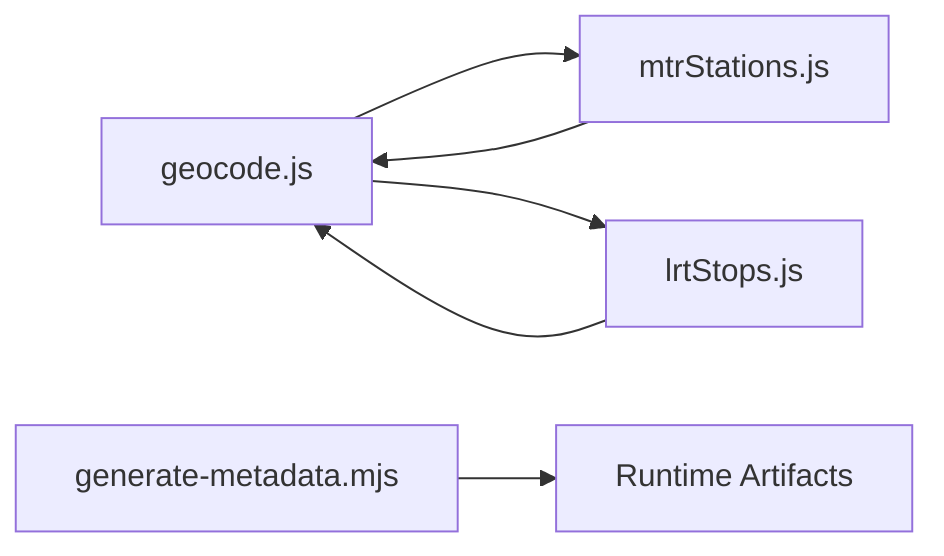

# Metadata Generation Script

<cite>
**Referenced Files in This Document**
- [generate-metadata.mjs](file://scripts/generate-metadata.mjs)
- [geocode.js](file://src/geocode.js)
- [mtrStations.js](file://src/mtrStations.js)
- [lrtStops.js](file://src/lrtStops.js)
- [mtrLayer.js](file://src/mtrLayer.js)
- [light_rail_routes_and_stops.csv](file://public/data/light_rail_routes_and_stops.csv)
- [mtr-stations.json](file://public/fares/mtr-stations.json)
- [collect-open-data.yml](file://.github/workflows/collect-open-data.yml)
</cite>

## Table of Contents
1. [Introduction](#introduction)
2. [Project Structure](#project-structure)
3. [Core Components](#core-components)
4. [Architecture Overview](#architecture-overview)
5. [Detailed Component Analysis](#detailed-component-analysis)
6. [Dependency Analysis](#dependency-analysis)
7. [Performance Considerations](#performance-considerations)
8. [Troubleshooting Guide](#troubleshooting-guide)
9. [Conclusion](#conclusion)

## Introduction
This document explains the metadata generation and search indexing system that powers fast, user-friendly queries for stations, routes, and stops across MTR (heavy rail), Light Rail, and bus networks in Hong Kong. It covers:
- The metadata manifest generator that catalogs build artifacts for runtime discovery
- Multi-language station name indexing supporting English and Chinese text search
- Fuzzy matching strategies for typo tolerance and query normalization
- Geospatial indexing and proximity-based resolution for location-aware queries
- Schema design balancing searchability with storage efficiency
- Field weighting for relevance ranking and caching strategies for frequently accessed data
- Batch processing patterns for large datasets and incremental update mechanisms to keep indexes fresh
- Performance optimizations for real-time search operations

## Project Structure
The project separates build-time artifact metadata generation from runtime search logic:
- Build-time: a Node script generates a JSON manifest describing available data assets (GTFS, pmtiles, wheels router, graph)
- Runtime: client-side modules provide local indexes for MTR stations and Light Rail stops, plus geocoding integration with Nominatim for broader place search
- Data sources include CSV route/stop lists and JSON station coordinates used by search and routing

**Diagram sources**
- [generate-metadata.mjs:17-74](file://scripts/generate-metadata.mjs#L17-L74)
- [mtrStations.js:13-118](file://src/mtrStations.js#L13-L118)
- [lrtStops.js:11-81](file://src/lrtStops.js#L11-L81)
- [geocode.js:1-14](file://src/geocode.js#L1-L14)
- [light_rail_routes_and_stops.csv:1-20](file://public/data/light_rail_routes_and_stops.csv#L1-L20)
- [mtr-stations.json:1-20](file://public/fares/mtr-stations.json#L1-L20)
- [collect-open-data.yml:136-163](file://.github/workflows/collect-open-data.yml#L136-L163)

**Section sources**
- [generate-metadata.mjs:17-74](file://scripts/generate-metadata.mjs#L17-L74)
- [geocode.js:1-14](file://src/geocode.js#L1-L14)
- [mtrStations.js:13-118](file://src/mtrStations.js#L13-L118)
- [lrtStops.js:11-81](file://src/lrtStops.js#L11-L81)
- [light_rail_routes_and_stops.csv:1-20](file://public/data/light_rail_routes_and_stops.csv#L1-L20)
- [mtr-stations.json:1-20](file://public/fares/mtr-stations.json#L1-L20)
- [collect-open-data.yml:136-163](file://.github/workflows/collect-open-data.yml#L136-L163)

## Core Components
- Artifact metadata generator: scans artifacts directory, records filenames, sizes, and URLs; validates required assets and writes a manifest consumed at runtime
- Local MTR station index: in-memory array of stations with English and Chinese names, coordinates, and codes; supports multi-language search and directional disambiguation
- Local Light Rail stop index: curated list of stops with bilingual names, official codes, and track-accurate coordinates; supports fuzzy matching and proximity fallback
- Geocoder integration: combines local indexes with Nominatim results, applies Hong Kong biasing, mode filters (@MTR/@LRT/@Bus), and ranking heuristics for relevance
- Layer utilities: platform and station matching using name hints and geodesic distance calculations for precise pin placement

Key responsibilities:
- Fast local lookups for common queries (stations/stops)
- Robust text normalization and scoring for multi-language inputs
- Geospatial proximity checks when names are ambiguous or missing
- Consistent schema for artifacts and station data to support UI and routing

**Section sources**
- [generate-metadata.mjs:24-74](file://scripts/generate-metadata.mjs#L24-L74)
- [mtrStations.js:13-118](file://src/mtrStations.js#L13-L118)
- [lrtStops.js:11-81](file://src/lrtStops.js#L11-L81)
- [geocode.js:19-67](file://src/geocode.js#L19-L67)
- [mtrLayer.js:272-316](file://src/mtrLayer.js#L272-L316)

## Architecture Overview
The system uses a hybrid approach:
- Prebuilt artifact metadata enables clients to discover and load GTFS, map tiles, and routing graphs efficiently
- Local indexes reduce latency for frequent station/stop searches
- External geocoding provides broad coverage and handles edge cases not covered locally
- Ranking and filtering ensure relevant results appear first, even with noisy input

**Diagram sources**
- [geocode.js:194-361](file://src/geocode.js#L194-L361)
- [mtrStations.js:136-200](file://src/mtrStations.js#L136-L200)
- [lrtStops.js:259-294](file://src/lrtStops.js#L259-L294)

## Detailed Component Analysis

### Artifact Metadata Generator
Purpose:
- Catalogs build artifacts (GTFS, pmtiles, wheels router, graph) with filenames, sizes, and public URLs
- Validates presence of required assets and aborts if missing
- Writes a JSON manifest consumed by the application to fetch correct resources

Behavior highlights:
- Reads environment variable for base URL and resolves paths relative to artifacts directory
- Supports optional assets with warnings when missing
- Records updated timestamp and per-asset metadata

**Diagram sources**
- [generate-metadata.mjs:17-74](file://scripts/generate-metadata.mjs#L17-L74)

**Section sources**
- [generate-metadata.mjs:17-74](file://scripts/generate-metadata.mjs#L17-L74)

### Multi-Language Station Name Indexing (English and Chinese)
Design:
- MTR stations store both English and Chinese names along with coordinates and codes
- Normalization removes noise tokens like “station”, “MTR”, “站” and collapses whitespace for robust matching
- Scoring prioritizes exact matches, then prefix matches, then substring matches; Chinese-only matches are also considered
- Directional disambiguation prevents incorrect matches between paired stations (e.g., East/West variants)

Fuzzy matching and typo tolerance:
- Token stripping and flexible matching allow partial queries (“sha tin” → “Sha Tin”)
- Minimum score thresholds filter out weak matches
- Deduplication ensures stable result sets

**Diagram sources**
- [mtrStations.js:120-200](file://src/mtrStations.js#L120-L200)
- [mtrLayer.js:498-521](file://src/mtrLayer.js#L498-L521)

**Section sources**
- [mtrStations.js:120-200](file://src/mtrStations.js#L120-L200)
- [mtrLayer.js:498-521](file://src/mtrLayer.js#L498-L521)

### Light Rail Stop Indexing and Matching
Design:
- Curated list of LRT stops with bilingual names, official codes, and precise coordinates
- Normalization strips “Light Rail” and “輕鐵” tokens and cleans punctuation
- Scoring favors exact matches, then prefixes, then substrings; tokenized queries require all tokens present
- Proximity fallback uses Haversine distance to resolve ambiguous or missing names

**Diagram sources**
- [lrtStops.js:104-125](file://src/lrtStops.js#L104-L125)
- [lrtStops.js:156-199](file://src/lrtStops.js#L156-L199)
- [lrtStops.js:259-294](file://src/lrtStops.js#L259-L294)

**Section sources**
- [lrtStops.js:104-125](file://src/lrtStops.js#L104-L125)
- [lrtStops.js:156-199](file://src/lrtStops.js#L156-L199)
- [lrtStops.js:259-294](file://src/lrtStops.js#L259-L294)

### Geospatial Indexing for Location-Based Queries
Capabilities:
- Hong Kong bounding box biasing narrows external geocoding results
- Platform and station matching use geodesic distance to select closest feature when names are ambiguous
- Promote-to-LRT logic re-pins ambiguous free-text hits to LRT stops based on name similarity and proximity

**Diagram sources**
- [geocode.js:42-67](file://src/geocode.js#L42-L67)
- [geocode.js:104-122](file://src/geocode.js#L104-L122)
- [geocode.js:131-184](file://src/geocode.js#L131-L184)
- [geocode.js:281-361](file://src/geocode.js#L281-L361)

**Section sources**
- [geocode.js:42-67](file://src/geocode.js#L42-L67)
- [geocode.js:104-122](file://src/geocode.js#L104-L122)
- [geocode.js:131-184](file://src/geocode.js#L131-L184)
- [geocode.js:281-361](file://src/geocode.js#L281-L361)

### Metadata Schema Design and Relevance Ranking
Schema highlights:
- Artifact manifest includes updated_at timestamp and per-asset entries with filename, size_bytes, and url
- Station data includes bilingual names, coordinates, source, and type tags to support classification and ranking
- CSV route/stop lists provide structured sequences for Light Rail routes with direction and sequence numbers

Relevance ranking:
- Place ranking boosts railway stations when queries imply station intent
- Mode filters (@MTR/@LRT/@Bus) refine search scope
- Importance scores from external sources influence final ordering
- Local indexes prioritize exact and prefix matches over generic substring matches

**Section sources**
- [generate-metadata.mjs:37-65](file://scripts/generate-metadata.mjs#L37-L65)
- [mtr-stations.json:1-20](file://public/fares/mtr-stations.json#L1-L20)
- [light_rail_routes_and_stops.csv:1-20](file://public/data/light_rail_routes_and_stops.csv#L1-L20)
- [geocode.js:131-184](file://src/geocode.js#L131-L184)

### Caching Strategies for Frequently Accessed Data
Observed patterns:
- In-memory arrays serve as indexes for MTR stations and LRT stops, enabling fast repeated queries without network calls
- Module-level caches (e.g., Map-based text cache) reduce redundant computations during batch operations
- Static overrides files allow hot-replace behavior without full reloads

Best practices:
- Keep indexes small enough to fit comfortably in memory for instant access
- Use deterministic normalization to avoid duplicate work
- Apply deduplication to stabilize result sets

**Section sources**
- [mtrStations.js:13-118](file://src/mtrStations.js#L13-L118)
- [lrtStops.js:11-81](file://src/lrtStops.js#L11-L81)
- [contributePath.js:534-613](file://src/contributePath.js#L534-L613)

### Batch Processing Capabilities and Incremental Updates
Batch processing:
- CI workflow uploads large artifacts and creates pull requests when data changes, enabling periodic refreshes
- Summarization scripts merge and aggregate large datasets, keeping only necessary fields and metrics

Incremental updates:
- Overrides files (e.g., LRT stop overrides, MTR access pins) allow targeted updates without regenerating entire indexes
- Module functions expose reset/cache-clear methods to recompile or refresh derived structures when needed

Operational flow:
- Scheduled or triggered workflows collect open data, produce artifacts, and publish manifests
- Application loads updated artifacts via metadata manifest and applies overrides as needed

**Section sources**
- [collect-open-data.yml:136-163](file://.github/workflows/collect-open-data.yml#L136-L163)
- [summarize-bbi.mjs:173-189](file://scripts/summarize-bbi.mjs#L173-L189)
- [lrtStops.js:83-102](file://src/lrtStops.js#L83-L102)
- [interchangeSchemes.js:136-176](file://src/interchangeSchemes.js#L136-L176)

### Performance Optimization Techniques for Real-Time Search
Techniques implemented:
- Local indexes eliminate network latency for common queries
- Query normalization reduces false positives and speeds up comparisons
- Minimum score thresholds prevent expensive downstream processing for weak matches
- Geospatial biasing limits external API payloads and improves relevance
- Parallel fetching for stop details reduces total latency in route loading

Additional considerations:
- Limit result sets early to minimize rendering overhead
- Use deduplication to avoid redundant UI updates
- Prefer prefix and exact matches to reduce scanning costs

**Section sources**
- [mtrStations.js:136-200](file://src/mtrStations.js#L136-L200)
- [lrtStops.js:259-294](file://src/lrtStops.js#L259-L294)
- [geocode.js:194-361](file://src/geocode.js#L194-L361)
- [main.js:10525-10656](file://src/main.js#L10525-L10656)

## Dependency Analysis
Relationships between components:
- Geocoder depends on local indexes (MTR and LRT) to boost relevance and handle mode-specific queries
- LRT stop matching relies on normalized names and proximity calculations
- MTR station matching incorporates directional disambiguation to avoid cross-matching pairs
- Artifact metadata is independent but informs runtime resource loading

**Diagram sources**
- [geocode.js:1-14](file://src/geocode.js#L1-L14)
- [mtrStations.js:13-118](file://src/mtrStations.js#L13-L118)
- [lrtStops.js:11-81](file://src/lrtStops.js#L11-L81)
- [generate-metadata.mjs:24-74](file://scripts/generate-metadata.mjs#L24-L74)

**Section sources**
- [geocode.js:1-14](file://src/geocode.js#L1-L14)
- [mtrStations.js:13-118](file://src/mtrStations.js#L13-L118)
- [lrtStops.js:11-81](file://src/lrtStops.js#L11-L81)
- [generate-metadata.mjs:24-74](file://scripts/generate-metadata.mjs#L24-L74)

## Performance Considerations
- Prefer local indexes for high-frequency queries to minimize latency
- Normalize queries aggressively to reduce false matches and improve speed
- Use bounded geocoding (Hong Kong viewbox) to limit external API responses
- Apply minimum score thresholds to short-circuit low-quality matches
- Cache computed results where possible to avoid recomputation
- Keep dataset sizes manageable; split heavy assets into separate artifacts and load on demand

[No sources needed since this section provides general guidance]

## Troubleshooting Guide
Common issues and resolutions:
- Missing required artifacts: The metadata generator aborts if mandatory files are absent; verify build outputs and paths
- Empty or invalid geocoding responses: Ensure the /geocode proxy is running and returns valid JSON; check network errors and status codes
- Ambiguous station matches: Use directional disambiguation and refine queries with mode filters (@MTR/@LRT/@Bus)
- Incorrect LRT pinning: Confirm name similarity and proximity thresholds; adjust max distance if needed
- Stale indexes: Clear module caches or reload overrides to apply updates without full rebuilds

**Section sources**
- [generate-metadata.mjs:47-71](file://scripts/generate-metadata.mjs#L47-L71)
- [geocode.js:297-321](file://src/geocode.js#L297-L321)
- [mtrLayer.js:272-316](file://src/mtrLayer.js#L272-L316)
- [lrtStops.js:156-199](file://src/lrtStops.js#L156-L199)

## Conclusion
The metadata generation and search indexing system combines prebuilt artifact manifests with robust local indexes and external geocoding to deliver fast, accurate, and multilingual search experiences. By normalizing queries, applying relevance ranking, leveraging geospatial proximity, and employing caching and batch processing strategies, the system achieves strong performance for real-time operations while remaining maintainable through incremental updates and clear schema design.

[No sources needed since this section summarizes without analyzing specific files]