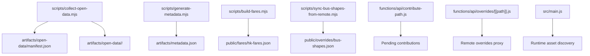
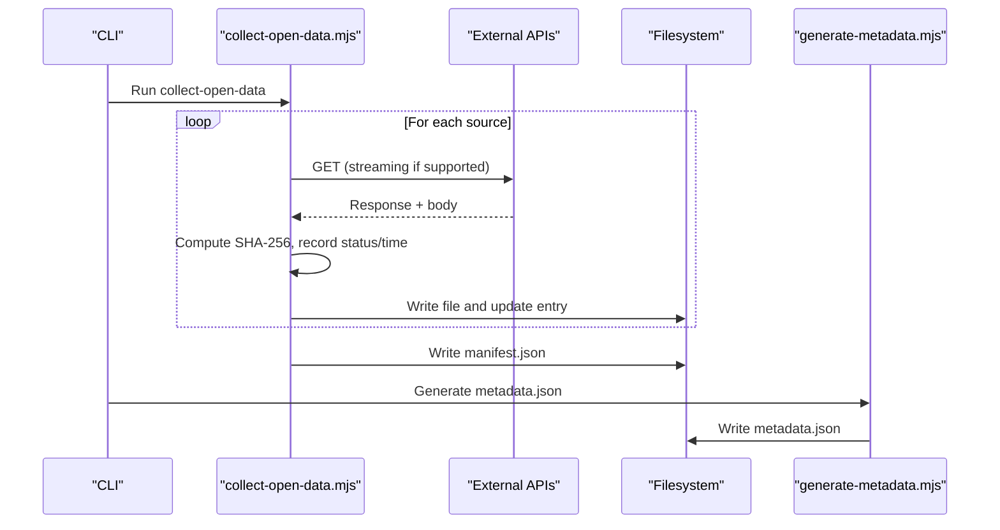
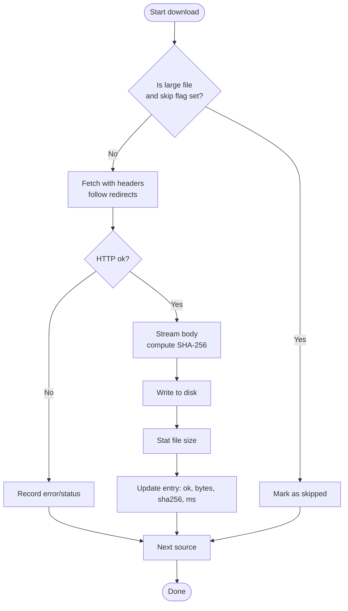
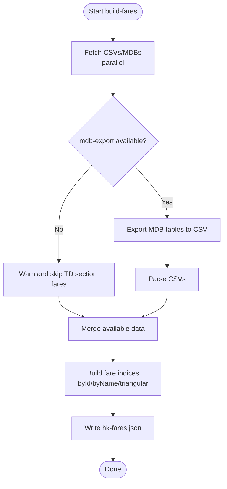
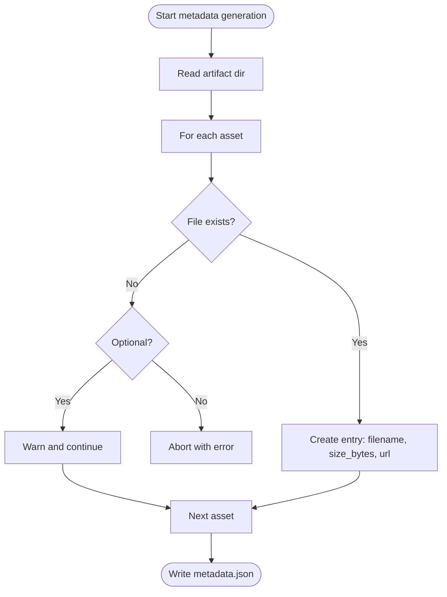
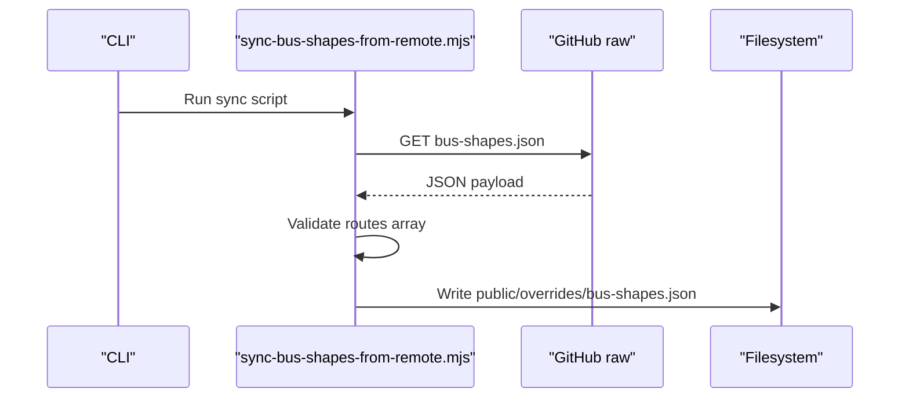
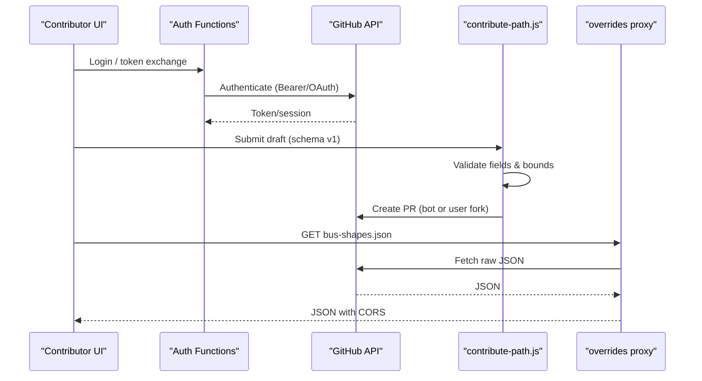
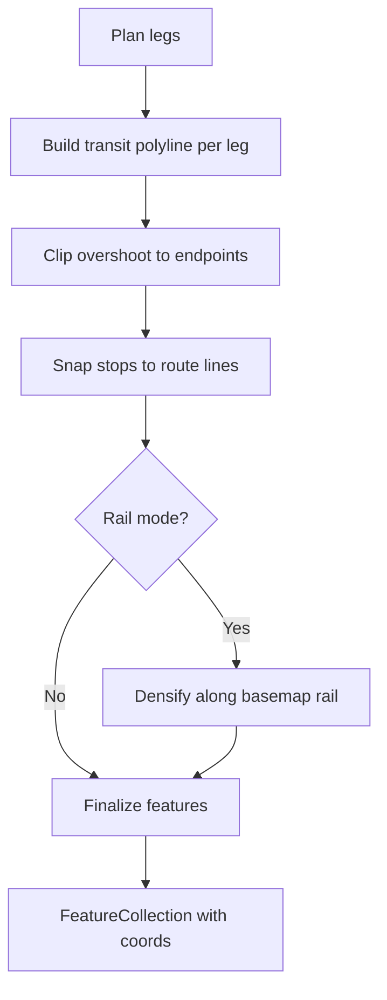
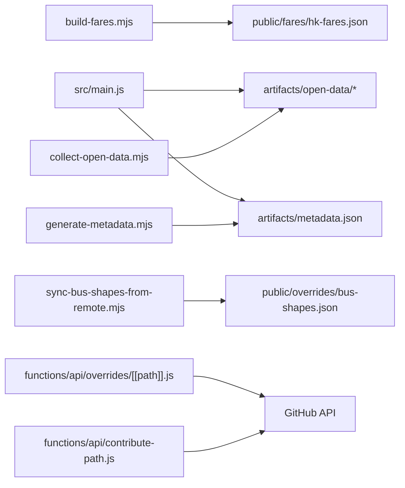

# Open Data Collection Script

<cite>
**Referenced Files in This Document**
- [collect-open-data.mjs](file://scripts/collect-open-data.mjs)
- [build-fares.mjs](file://scripts/build-fares.mjs)
- [generate-metadata.mjs](file://scripts/generate-metadata.mjs)
- [sync-bus-shapes-from-remote.mjs](file://scripts/sync-bus-shapes-from-remote.mjs)
- [contribute-path.js](file://functions/api/contribute-path.js)
- [[path]].js (overrides proxy) (file://functions/api/overrides/[[path]].js)
- [github.js](file://functions/_shared/github.js)
- [main.js](file://src/main.js)
- [router.ts](file://src/router.ts)
- [package.json](file://package.json)
</cite>

## Table of Contents
1. [Introduction](#introduction)
2. [Project Structure](#project-structure)
3. [Core Components](#core-components)
4. [Architecture Overview](#architecture-overview)
5. [Detailed Component Analysis](#detailed-component-analysis)
6. [Dependency Analysis](#dependency-analysis)
7. [Performance Considerations](#performance-considerations)
8. [Troubleshooting Guide](#troubleshooting-guide)
9. [Conclusion](#conclusion)
10. [Appendices](#appendices)

## Introduction
This document explains the open data collection and processing pipeline used by the project to automate downloading, validating, transforming, and publishing transit data for Hong Kong operators. It covers:
- Discovery of data sources and configuration via environment variables
- Authentication handling for protected datasets (e.g., GitHub-based overrides)
- Robust error recovery when external APIs are unavailable
- GTFS validation and schema compliance checks
- Data transformation pipelines that normalize station coordinates, simplify route geometries, and compress schedule/fare data
- Configuration options for custom sources, retry policies, and logging strategies

The primary entry point is a Node script that downloads multiple data assets and writes a manifest describing each source’s status, size, checksum, and timing. A companion fare builder aggregates official operator fares into a compact client-facing format. Additional scripts generate metadata for published assets and synchronize community-contributed bus shapes from a remote repository.

## Project Structure
The data pipeline spans several scripts and runtime modules:
- scripts/collect-open-data.mjs: Downloads open data and edge assets, computes checksums, and writes a manifest
- scripts/build-fares.mjs: Aggregates MTR, TD, and crowd-sourced fare tables into a single JSON for client use
- scripts/generate-metadata.mjs: Produces metadata.json describing available artifacts and their URLs
- scripts/sync-bus-shapes-from-remote.mjs: Pulls published bus shape overrides into the public bundle
- functions/api/*: Provide authentication and contribution endpoints for contributors to submit geometry corrections
- src/*: Client-side logic that consumes downloaded assets and applies transformations (e.g., stop snapping, geometry simplification)

**Diagram sources**
- [collect-open-data.mjs:170-238](file://scripts/collect-open-data.mjs#L170-L238)
- [generate-metadata.mjs:37-75](file://scripts/generate-metadata.mjs#L37-L75)
- [build-fares.mjs:517-563](file://scripts/build-fares.mjs#L517-L563)
- [sync-bus-shapes-from-remote.mjs:33-59](file://scripts/sync-bus-shapes-from-remote.mjs#L33-L59)
- [contribute-path.js:36-111](file://functions/api/contribute-path.js#L36-L111)
- [[path]].js:23-92](file://functions/api/overrides/[[path]].js#L23-L92)
- [main.js:6341-6378](file://src/main.js#L6341-L6378)

**Section sources**
- [collect-open-data.mjs:1-289](file://scripts/collect-open-data.mjs#L1-L289)
- [build-fares.mjs:1-578](file://scripts/build-fares.mjs#L1-L578)
- [generate-metadata.mjs:1-75](file://scripts/generate-metadata.mjs#L1-L75)
- [sync-bus-shapes-from-remote.mjs:1-59](file://scripts/sync-bus-shapes-from-remote.mjs#L1-L59)
- [contribute-path.js:33-111](file://functions/api/contribute-path.js#L33-L111)
- [[path]].js:1-92](file://functions/api/overrides/[[path]].js#L1-L92)
- [main.js:6341-6378](file://src/main.js#L6341-L6378)

## Core Components
- Open data downloader: Iterates a configured list of sources, streams large files, computes SHA-256 checksums, records HTTP status and timing, and writes a manifest with summary statistics. Supports skipping large assets via an environment flag and uses a configurable base URL for edge assets.
- Fare aggregator: Downloads CSVs and MDB files, converts MDB tables to CSV using mdb-export, parses and normalizes fare matrices, and outputs a compact JSON with multiple fare types and mappings for client lookup.
- Metadata generator: Scans artifact files, validates presence of required assets, and emits a metadata manifest with filenames, sizes, and public URLs.
- Overrides synchronization: Fetches published bus shape corrections from a remote repository and writes them into the public bundle for offline or bundled deployment.
- Contribution API: Validates contributor submissions against a strict schema, bounds checks coordinates, and supports OAuth or bot modes for creating pull requests.

**Section sources**
- [collect-open-data.mjs:31-166](file://scripts/collect-open-data.mjs#L31-L166)
- [collect-open-data.mjs:170-238](file://scripts/collect-open-data.mjs#L170-L238)
- [collect-open-data.mjs:240-289](file://scripts/collect-open-data.mjs#L240-L289)
- [build-fares.mjs:48-59](file://scripts/build-fares.mjs#L48-L59)
- [build-fares.mjs:363-374](file://scripts/build-fares.mjs#L363-L374)
- [build-fares.mjs:383-515](file://scripts/build-fares.mjs#L383-L515)
- [build-fares.mjs:517-563](file://scripts/build-fares.mjs#L517-L563)
- [generate-metadata.mjs:24-75](file://scripts/generate-metadata.mjs#L24-L75)
- [sync-bus-shapes-from-remote.mjs:33-59](file://scripts/sync-bus-shapes-from-remote.mjs#L33-L59)
- [contribute-path.js:36-111](file://functions/api/contribute-path.js#L36-L111)

## Architecture Overview
The system follows a modular pipeline:
- Source discovery: Sources are defined in a configuration array with group, name, URL, required flag, and optional large-file marker. Environment variables allow overriding base URLs and toggling behavior.
- Download and integrity: Each source is fetched with streaming where possible; SHA-256 checksums are computed during download; HTTP status codes and errors are recorded.
- Manifest generation: A manifest summarizes successes, failures, skipped items, total bytes, and per-source details.
- Metadata publication: A separate script generates metadata.json for published artifacts, enabling clients to discover updated assets and sizes.
- Transformation and enrichment: Fare data is normalized and compressed; bus shape corrections are synchronized; client code performs stop snapping and geometry adjustments at runtime.

**Diagram sources**
- [collect-open-data.mjs:170-238](file://scripts/collect-open-data.mjs#L170-L238)
- [collect-open-data.mjs:240-289](file://scripts/collect-open-data.mjs#L240-L289)
- [generate-metadata.mjs:37-75](file://scripts/generate-metadata.mjs#L37-L75)

## Detailed Component Analysis

### Open Data Downloader
- Source discovery: The SOURCES array defines groups (e.g., mtr-fares, td-bus, td-gmb, hkbus, edge), names, URLs, required flags, and large-file markers. Edge assets can be sourced from a configurable base URL via an environment variable.
- Authentication: No explicit auth headers are used for open data; User-Agent is set for identification. Protected assets (e.g., GitHub overrides) are handled by separate functions and scripts.
- Error recovery: Non-OK HTTP responses are logged and recorded; network errors are caught and stored in the entry. Required failures cause the process to exit with a non-zero status. Large files can be skipped via an environment flag.
- Integrity: SHA-256 checksums are computed during streaming or buffer reads; file sizes are captured post-write.
- Logging: Console logs indicate progress, success, and errors; manifest includes timestamps and summary metrics.

**Diagram sources**
- [collect-open-data.mjs:170-238](file://scripts/collect-open-data.mjs#L170-L238)
- [collect-open-data.mjs:240-289](file://scripts/collect-open-data.mjs#L240-L289)

**Section sources**
- [collect-open-data.mjs:31-166](file://scripts/collect-open-data.mjs#L31-L166)
- [collect-open-data.mjs:170-238](file://scripts/collect-open-data.mjs#L170-L238)
- [collect-open-data.mjs:240-289](file://scripts/collect-open-data.mjs#L240-L289)

### Fare Builder
- Data sources: MTR open data CSVs, TD MDB files (converted to CSV via mdb-export), and crowd-sourced fare lists.
- Processing: Parses CSVs with a minimal parser; maps columns to standardized fare types; builds triangular matrices for section fares; consolidates full-journey fares across operators.
- Output: Writes a compact JSON with versioned schema, currency, fare types, and aggregated indices for fast client lookups.
- Error handling: Gracefully handles missing mdb-export tool and unavailable upstream data; warns but continues where possible.

**Diagram sources**
- [build-fares.mjs:363-374](file://scripts/build-fares.mjs#L363-L374)
- [build-fares.mjs:383-515](file://scripts/build-fares.mjs#L383-L515)
- [build-fares.mjs:517-563](file://scripts/build-fares.mjs#L517-L563)

**Section sources**
- [build-fares.mjs:48-59](file://scripts/build-fares.mjs#L48-L59)
- [build-fares.mjs:92-141](file://scripts/build-fares.mjs#L92-L141)
- [build-fares.mjs:363-374](file://scripts/build-fares.mjs#L363-L374)
- [build-fares.mjs:383-515](file://scripts/build-fares.mjs#L383-L515)
- [build-fares.mjs:517-563](file://scripts/build-fares.mjs#L517-L563)

### Metadata Generator
- Artifact scanning: Reads artifact files from a configured directory and checks existence and size.
- Validation: Requires certain assets; optional assets are allowed to be missing with warnings.
- Output: Generates metadata.json with updated_at timestamp and per-asset entries including filename, size_bytes, and url.

**Diagram sources**
- [generate-metadata.mjs:24-75](file://scripts/generate-metadata.mjs#L24-L75)

**Section sources**
- [generate-metadata.mjs:17-75](file://scripts/generate-metadata.mjs#L17-L75)

### Bus Shapes Synchronization
- Source resolution: Uses environment variables to determine the remote URL for bus-shapes.json.
- Validation: Ensures the fetched data contains a routes array before writing.
- Output: Writes the validated JSON into the public overrides directory for bundling or offline use.

**Diagram sources**
- [sync-bus-shapes-from-remote.mjs:33-59](file://scripts/sync-bus-shapes-from-remote.mjs#L33-L59)

**Section sources**
- [sync-bus-shapes-from-remote.mjs:1-59](file://scripts/sync-bus-shapes-from-remote.mjs#L1-L59)

### Contribution API and Authentication
- Schema validation: Enforces a strict schema for bus shape submissions, including coordinate bounds and field constraints.
- Authentication modes: Supports OAuth flows and bot tokens for creating pull requests; shared helpers provide GitHub API headers and encoding utilities.
- Proxying: An overrides proxy fetches published shapes from GitHub with CORS headers and short cache TTLs.

**Diagram sources**
- [contribute-path.js:36-111](file://functions/api/contribute-path.js#L36-L111)
- [github.js:1-38](file://functions/_shared/github.js#L1-L38)
- [[path]].js:23-92](file://functions/api/overrides/[[path]].js#L23-L92)

**Section sources**
- [contribute-path.js:33-111](file://functions/api/contribute-path.js#L33-L111)
- [github.js:1-38](file://functions/_shared/github.js#L1-L38)
- [[path]].js:1-92](file://functions/api/overrides/[[path]].js#L1-L92)

### Runtime Transformations and Validation
- Stop snapping: Snaps stop markers onto densified route lines to ensure accurate placement on roads or tracks; enforces distance thresholds to avoid misplacement.
- Geometry simplification: Builds transit polylines per leg, clips overshoots, and aligns rail segments to basemap railway geometry when available.
- Asset discovery: At runtime, probes metadata and assets to determine availability and sizes, falling back gracefully when metadata is not yet published.

**Diagram sources**
- [main.js:3738-3766](file://src/main.js#L3738-L3766)
- [main.js:4024-4086](file://src/main.js#L4024-L4086)
- [main.js:10931-10962](file://src/main.js#L10931-L10962)
- [main.js:6341-6378](file://src/main.js#L6341-L6378)

**Section sources**
- [main.js:3685-3719](file://src/main.js#L3685-L3719)
- [main.js:3738-3766](file://src/main.js#L3738-L3766)
- [main.js:4024-4086](file://src/main.js#L4024-L4086)
- [main.js:10931-10962](file://src/main.js#L10931-L10962)
- [main.js:6341-6378](file://src/main.js#L6341-L6378)

## Dependency Analysis
- Scripts depend on Node built-ins (fs, crypto, path, stream/promises) and standard fetch for HTTP operations.
- Fare building depends on an external tool (mdb-export) to convert MDB files; absence results in graceful fallback.
- Runtime modules depend on downloaded artifacts and may probe metadata to adapt behavior.
- Contribution workflows depend on GitHub APIs and environment secrets for authentication.

**Diagram sources**
- [collect-open-data.mjs:170-238](file://scripts/collect-open-data.mjs#L170-L238)
- [build-fares.mjs:517-563](file://scripts/build-fares.mjs#L517-L563)
- [generate-metadata.mjs:37-75](file://scripts/generate-metadata.mjs#L37-L75)
- [sync-bus-shapes-from-remote.mjs:33-59](file://scripts/sync-bus-shapes-from-remote.mjs#L33-L59)
- [main.js:6341-6378](file://src/main.js#L6341-L6378)
- [contribute-path.js:36-111](file://functions/api/contribute-path.js#L36-L111)
- [[path]].js:23-92](file://functions/api/overrides/[[path]].js#L23-L92)

**Section sources**
- [package.json:7-25](file://package.json#L7-L25)
- [build-fares.mjs:383-396](file://scripts/build-fares.mjs#L383-L396)
- [main.js:6341-6378](file://src/main.js#L6341-L6378)

## Performance Considerations
- Streaming downloads: Large files are streamed to minimize memory usage; checksums are computed incrementally.
- Sequential fetching: The downloader processes sources sequentially to avoid memory spikes; small files could be parallelized if needed.
- Fare matrix compression: Section fares are stored as triangular matrices to reduce size and improve lookup performance.
- Runtime snapping thresholds: Distance thresholds prevent incorrect snapping while balancing accuracy and performance.

[No sources needed since this section provides general guidance]

## Troubleshooting Guide
- Missing required assets: If required sources fail, the downloader exits with a non-zero status; check the manifest for failed entries and HTTP statuses.
- Large file skipping: Set the environment flag to skip large assets when bandwidth or storage is constrained.
- mdb-export not found: The fare builder warns and skips TD section fares if the tool is unavailable; install it to enable full functionality.
- Upstream unavailability: The overrides proxy returns structured errors when upstream fetch fails; adjust cache settings or retry later.
- Coordinate validation: Contributions must fall within specified bounds; invalid coordinates will be rejected with detailed messages.

**Section sources**
- [collect-open-data.mjs:240-289](file://scripts/collect-open-data.mjs#L240-L289)
- [build-fares.mjs:383-396](file://scripts/build-fares.mjs#L383-L396)
- [[path]].js:64-92](file://functions/api/overrides/[[path]].js#L64-L92)
- [contribute-path.js:59-72](file://functions/api/contribute-path.js#L59-L72)

## Conclusion
The open data collection pipeline provides a robust, configurable mechanism to gather, validate, transform, and publish transit data for Hong Kong operators. It emphasizes integrity through checksums, resilience via error handling and fallbacks, and efficiency through streaming and compressed data structures. Community contributions enhance route geometries with validated submissions and automated merging workflows.

[No sources needed since this section summarizes without analyzing specific files]

## Appendices

### Configuration Options
- Environment variables:
  - DATA_PUBLIC_BASE_URL: Base URL for edge assets (metadata, GTFS zip, PMTiles, router binaries)
  - COLLECT_SKIP_LARGE: Skip large files during collection
  - OVERRIDES_BUS_SHAPES_URL / VITE_OVERRIDES_BUS_SHAPES_URL: Override bus shapes source URL
  - OVERRIDES_REPO, OVERRIDES_BRANCH: Target repository and branch for overrides
  - OVERRIDES_GITHUB_TOKEN: Bot token for GitHub PR automation
  - GITHUB_OAUTH_CLIENT_ID, GITHUB_OAUTH_CLIENT_SECRET, GITHUB_OAUTH_REDIRECT_URI: OAuth configuration for contributor logins

**Section sources**
- [collect-open-data.mjs:131-166](file://scripts/collect-open-data.mjs#L131-L166)
- [sync-bus-shapes-from-remote.mjs:33-36](file://scripts/sync-bus-shapes-from-remote.mjs#L33-L36)
- [github.js:6-38](file://functions/_shared/github.js#L6-L38)
- [docs/local-overrides.md:156-182](file://docs/local-overrides.md#L156-L182)

### Logging Strategies
- Console logs: Progress, success, and error messages for each source; summary counts and byte totals
- Manifest entries: Per-source status, HTTP status, bytes, checksums, paths, and timing
- Warnings: Non-critical issues like missing tools or optional assets

**Section sources**
- [collect-open-data.mjs:197-236](file://scripts/collect-open-data.mjs#L197-L236)
- [collect-open-data.mjs:251-274](file://scripts/collect-open-data.mjs#L251-L274)
- [build-fares.mjs:517-563](file://scripts/build-fares.mjs#L517-L563)