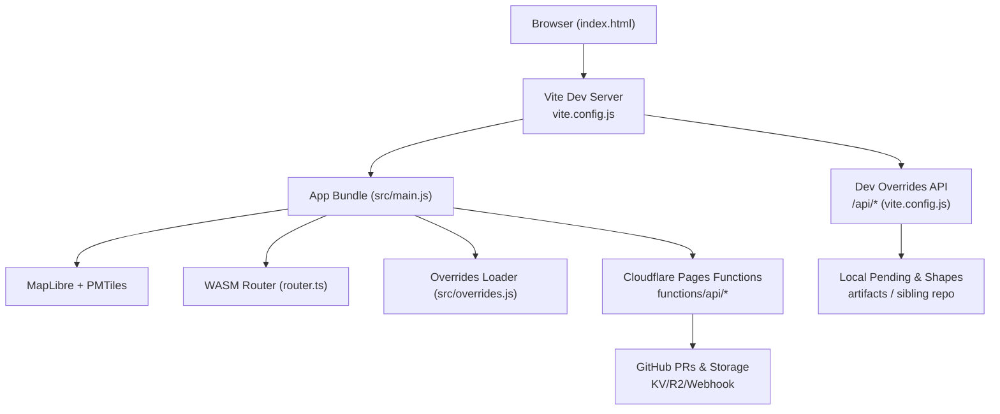
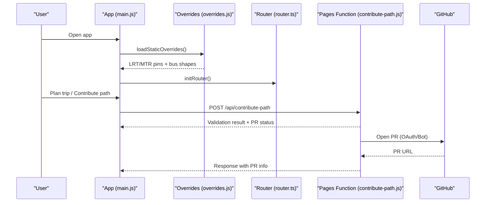
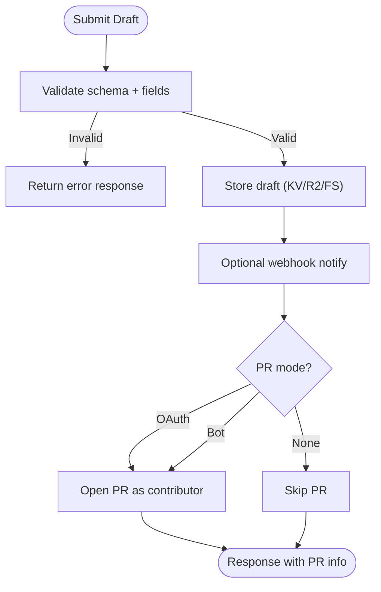
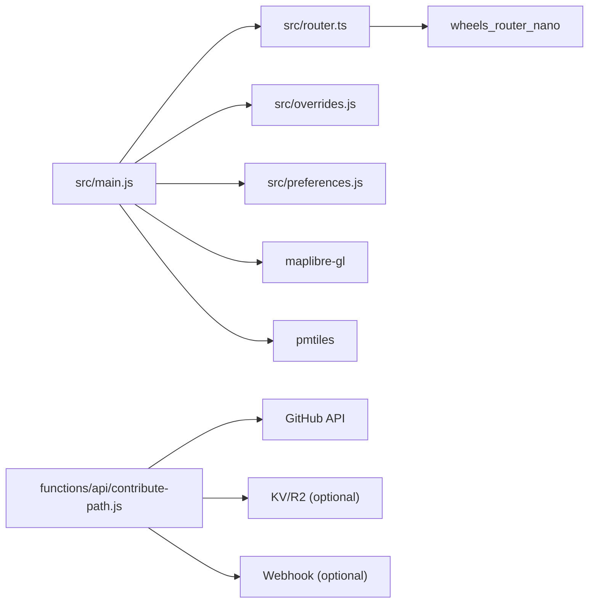

# Developer Guide

<cite>
**Referenced Files in This Document**
- [package.json](file://package.json)
- [vite.config.js](file://vite.config.js)
- [wrangler.toml](file://wrangler.toml)
- [index.html](file://index.html)
- [src/main.js](file://src/main.js)
- [src/overrides.js](file://src/overrides.js)
- [functions/api/contribute-path.js](file://functions/api/contribute-path.js)
- [docs/local-overrides.md](file://docs/local-overrides.md)
- [public/overrides/README.md](file://public/overrides/README.md)
- [src/router.ts](file://src/router.ts)
- [src/preferences.js](file://src/preferences.js)
- [src/contributePath.js](file://src/contributePath.js)
- [scripts/build-fares.mjs](file://scripts/build-fares.mjs)
</cite>

## Table of Contents
1. Introduction
2. Project Structure
3. Core Components
4. Architecture Overview
5. Detailed Component Analysis
6. Dependency Analysis
7. Performance Considerations
8. Troubleshooting Guide
9. Conclusion
10. Appendices

## Introduction
This guide explains how to set up a local development environment, understand the codebase organization, follow coding standards and workflows, and extend MorganTraveler safely using its override system. It also documents the contribution process (Git workflow, pull requests, and review), debugging techniques, performance profiling, extension points for new transit operators, custom routing preferences, and additional visualization features. Security, data privacy, and compliance considerations are included for handling transit and user data.

## Project Structure
MorganTraveler is a MapLibre-based PWA that combines GTFS data, PMTiles basemaps, and a WASM RAPTOR router. The app uses Vite for development and build, Cloudflare Pages Functions for serverless endpoints, and a sibling overrides repository for community-contributed bus shapes.

Key directories:
- src: Application logic (routing, UI orchestration, preferences, overlays, operator integrations)
- functions: Serverless API endpoints (auth, contribute-path, ETA/geocode/OSRM proxies)
- public: Static assets including overrides JSON files, maplibre workers, and offline data
- scripts: Build and data sync utilities (fares, open data collection, metadata generation)
- docs: Developer documentation (local overrides workflow)

**Diagram sources**
- [index.html:1-80](file://index.html#L1-L80)
- [vite.config.js:111-132](file://vite.config.js#L111-L132)
- [src/main.js:177-210](file://src/main.js#L177-L210)
- [src/overrides.js:168-239](file://src/overrides.js#L168-L239)
- [functions/api/contribute-path.js:202-335](file://functions/api/contribute-path.js#L202-L335)

**Section sources**
- [package.json:7-25](file://package.json#L7-L25)
- [vite.config.js:773-800](file://vite.config.js#L773-L800)
- [wrangler.toml:1-38](file://wrangler.toml#L1-L38)

## Core Components
- Routing engine: WASM RAPTOR wrapper with human-centric ranking rules and multi-modal support.
- Preferences: Localized user settings persisted in localStorage (ranking goals, traffic methods, bus companies, service day, departure time).
- Overrides system: Loads hand-maintained LRT/MTR access pins and published bus path polylines; supports live GitHub source or local dev mirror.
- Contribution pipeline: Serverless endpoint validates drafts, stores them, optionally opens GitHub PRs via OAuth or bot token, and notifies webhooks.
- Data pipelines: Scripts to build fares, collect open data, generate metadata, and sync bus shapes from remote.

**Section sources**
- [src/router.ts:1-120](file://src/router.ts#L1-L120)
- [src/preferences.js:1-70](file://src/preferences.js#L1-L70)
- [src/overrides.js:1-45](file://src/overrides.js#L1-L45)
- [functions/api/contribute-path.js:36-134](file://functions/api/contribute-path.js#L36-L134)
- [scripts/build-fares.mjs:398-428](file://scripts/build-fares.mjs#L398-L428)

## Architecture Overview
The application initializes the map, loads static overrides, configures the worker URL, and sets up data origins. The router is initialized lazily and used to plan trips with preference-aware ranking. Contributions flow through a validated serverless endpoint into storage and optionally into GitHub as PRs.

**Diagram sources**
- [src/main.js:177-210](file://src/main.js#L177-L210)
- [src/overrides.js:168-239](file://src/overrides.js#L168-L239)
- [src/router.ts:187-200](file://src/router.ts#L187-L200)
- [functions/api/contribute-path.js:202-335](file://functions/api/contribute-path.js#L202-L335)

## Detailed Component Analysis

### Local Development Environment Setup
- Install dependencies and run dev server:
  - Use npm scripts defined in package.json to start dev, build, and preview.
  - Prebuild steps sync maplibre worker and build fares.
- Vite configuration:
  - Adds cross-origin isolation headers for WASM/SharedArrayBuffer.
  - Proxies edge data to avoid CORS issues under COEP require-corp.
  - Mirrors Cloudflare Pages Functions locally for auth and overrides APIs.
- Wrangler configuration:
  - Declares Pages build output dir and runtime variables/secrets.
  - Optional KV/R2 bindings for contributions storage.

Best practices:
- Keep secrets out of version control; use .env.development and Cloudflare dashboard secrets.
- Ensure sibling overrides repo exists for full local contribution workflow; otherwise artifacts are written locally.

**Section sources**
- [package.json:7-25](file://package.json#L7-L25)
- [vite.config.js:111-132](file://vite.config.js#L111-L132)
- [vite.config.js:773-800](file://vite.config.js#L773-L800)
- [wrangler.toml:1-38](file://wrangler.toml#L1-L38)

### Code Organization and Coding Standards
- Entry point: index.html defines the shell and critical styles; main.js bootstraps modules and UI state.
- Modules:
  - src/router.ts: Routing interface and ranking logic.
  - src/preferences.js: User preferences schema and persistence helpers.
  - src/overrides.js: Override loading strategy and cache invalidation.
  - functions/api/*: Serverless endpoints mirroring production behavior.
- Naming conventions:
  - Operators and agencies use consistent identifiers (e.g., KMB/LWB, CTB, NLB, GMB, MTR, LRT, AEL).
  - Preference keys and storage keys are centralized in preferences.js.
- Error handling:
  - Network failures fall back to bundled overrides and cached data.
  - Draft validation enforces bounds, sizes, and schema constraints.

**Section sources**
- [index.html:1-80](file://index.html#L1-L80)
- [src/main.js:177-210](file://src/main.js#L177-L210)
- [src/router.ts:35-98](file://src/router.ts#L35-L98)
- [src/preferences.js:1-70](file://src/preferences.js#L1-L70)
- [src/overrides.js:168-239](file://src/overrides.js#L168-L239)
- [functions/api/contribute-path.js:36-134](file://functions/api/contribute-path.js#L36-L134)

### Development Workflow Best Practices
- Start dev server: npm run dev
- Sync bus shapes: npm run sync:bus-shapes
- Build fares: npm run build:fares
- Collect open data: npm run collect:open-data
- Generate metadata: npm run generate-metadata
- Preview build: npm run preview

Workflow tips:
- Use the local overrides API to test contributions without GitHub tokens.
- Merge pending drafts via HTTP or CLI to update bus-shapes.json and public overrides.
- Hard-refresh or restart dev to reload updated shapes.

**Section sources**
- [package.json:7-25](file://package.json#L7-L25)
- [docs/local-overrides.md:78-139](file://docs/local-overrides.md#L78-L139)

### Override System: File Structure, Naming, and Validation
- Files:
  - public/overrides/lrt.json: LRT stop/platform pins and track shape overrides.
  - public/overrides/mtr-access-pins.json: Locked MTR station pins.
  - public/overrides/bus-shapes.json: Published bus path polylines (bundled fallback).
- Live source:
  - Bus shapes prefer GitHub raw via same-origin API proxy; falls back to bundle.
- Validation rules (server-side):
  - Schema must be morgan.travelers.bus-shape.v1.
  - Coordinates must be arrays of lon,lat within HK bounds; max points enforced.
  - from_match/to_match required; visual_stops optional with strict field checks.
- Naming conventions:
  - id: unique identifier per route/direction.
  - agency: operator identifier (KMB/LWB, CTB, NLB, GMB, MTR, LRT, AEL).
  - route_short_name: short route label.
  - coordinates: polyline in GeoJSON order [lon, lat].
  - visual_stops: optional array mapping official stops to visual positions.

**Diagram sources**
- [functions/api/contribute-path.js:36-134](file://functions/api/contribute-path.js#L36-L134)
- [functions/api/contribute-path.js:202-335](file://functions/api/contribute-path.js#L202-L335)

**Section sources**
- [public/overrides/README.md:1-132](file://public/overrides/README.md#L1-L132)
- [src/overrides.js:168-239](file://src/overrides.js#L168-L239)
- [functions/api/contribute-path.js:36-134](file://functions/api/contribute-path.js#L36-L134)

### Contribution Process: Git Workflow, Pull Requests, and Review
- Local testing:
  - Use “Submit for review” in the app; drafts saved to pending/ or sibling repo.
  - Inspect status via /api/overrides/status and list pending via /api/overrides/pending.
- Opening PRs:
  - OAuth mode: Contributor logs in; PR opened on their fork.
  - Bot mode: Site token opens PR on upstream branch.
- Merging:
  - Use /api/overrides/merge or CLI script to merge pending into published shapes.
  - Copy merged shapes into public/overrides for offline fallback.
- Review checklist:
  - Verify route identifiers and match patterns.
  - Spot-check coordinates on a map.
  - Ensure only approved paths are published.

**Section sources**
- [docs/local-overrides.md:22-68](file://docs/local-overrides.md#L22-L68)
- [docs/local-overrides.md:78-139](file://docs/local-overrides.md#L78-L139)
- [public/overrides/README.md:63-132](file://public/overrides/README.md#L63-L132)

### Debugging Techniques
- Console logs:
  - Overrides loader logs counts and source (API proxy, GitHub raw, local bundle).
  - MapLibre worker URL logged for troubleshooting WASM worker loading.
- Dev APIs:
  - Check /api/overrides/status to confirm paths and pending files.
  - Download pending drafts via /api/overrides/pending/<id>.json.
- Local review page:
  - /api/overrides/review/<id> provides an HTML view with merge button.
- Common issues:
  - COEP/CORS errors: Ensure Vite headers and edge proxy configured.
  - Missing bus-shapes.json: Confirm sibling repo or public fallback present.
  - OAuth not configured: Set client ID/secret in .env or Cloudflare secrets.

**Section sources**
- [src/overrides.js:214-227](file://src/overrides.js#L214-L227)
- [src/main.js:190-210](file://src/main.js#L190-L210)
- [vite.config.js:111-132](file://vite.config.js#L111-L132)
- [docs/local-overrides.md:141-167](file://docs/local-overrides.md#L141-L167)

### Performance Profiling and Optimization Strategies
- WASM router:
  - Initialize once; reuse instance across plans.
  - Prefer local graph file when available; otherwise fetch compressed graph.
- Map rendering:
  - Use PMTiles for efficient vector tile streaming.
  - Avoid unnecessary re-renders; batch updates for route polylines.
- Data fetching:
  - Cache bust bus-shapes fetches to ensure fresh data after merges.
  - Use no-store headers for dynamic endpoints.
- Build optimizations:
  - Prebuild steps ensure workers and fares are ready.
  - Metadata generation helps track asset sizes and URLs.

**Section sources**
- [src/router.ts:187-200](file://src/router.ts#L187-L200)
- [src/overrides.js:247-259](file://src/overrides.js#L247-L259)
- [package.json:7-25](file://package.json#L7-L25)

### Extension Points
- Adding new transit operators:
  - Extend operator detection and data loaders in src/contributePath.js and related modules.
  - Add operator-specific route direction and stop sequence handlers.
  - Update preferences.js if new traffic methods or company filters are needed.
- Custom routing preferences:
  - Extend RankContext and normalizePreferences in src/router.ts to incorporate new scoring criteria.
  - Persist new preferences in src/preferences.js with storage keys and labels.
- Additional visualization features:
  - Integrate new layers via MapLibre in src/main.js; leverage routeSnapper for polylines.
  - Use overrides system to provide custom shapes or pin positions for specific routes.

**Section sources**
- [src/contributePath.js:327-358](file://src/contributePath.js#L327-L358)
- [src/router.ts:35-98](file://src/router.ts#L35-L98)
- [src/preferences.js:21-70](file://src/preferences.js#L21-L70)
- [src/main.js:3731-4086](file://src/main.js#L3731-L4086)

### Security, Data Privacy, and Compliance
- Secrets management:
  - Do not commit tokens; use .env.development and Cloudflare dashboard secrets.
  - OAuth flows use secure cookies and state parameters; clear state after callback.
- Input validation:
  - Strict schema and bounds enforcement prevent malformed or malicious payloads.
  - Size limits protect against oversized drafts and coordinate lists.
- Cross-origin isolation:
  - COEP require-crop ensures safe WASM usage; edge proxy adds CORP headers.
- Data minimization:
  - Only necessary fields stored in drafts; contributor identity optional unless OAuth used.
- Compliance considerations:
  - Transit data sourced from open datasets; respect licensing and attribution.
  - User preferences stored locally; avoid transmitting sensitive personal data.

**Section sources**
- [wrangler.toml:20-38](file://wrangler.toml#L20-L38)
- [functions/api/contribute-path.js:36-134](file://functions/api/contribute-path.js#L36-L134)
- [vite.config.js:111-132](file://vite.config.js#L111-L132)
- [src/overrides.js:168-239](file://src/overrides.js#L168-L239)

## Dependency Analysis
The application depends on MapLibre for mapping, PMTiles for vector tiles, and a WASM router for RAPTOR planning. Serverless functions integrate with GitHub for PRs and optional storage/webhooks.

**Diagram sources**
- [src/main.js:1-30](file://src/main.js#L1-L30)
- [src/router.ts:1-33](file://src/router.ts#L1-L33)
- [src/overrides.js:1-45](file://src/overrides.js#L1-L45)
- [functions/api/contribute-path.js:15-31](file://functions/api/contribute-path.js#L15-L31)

**Section sources**
- [package.json:27-35](file://package.json#L27-L35)
- [src/router.ts:187-200](file://src/router.ts#L187-L200)
- [functions/api/contribute-path.js:136-193](file://functions/api/contribute-path.js#L136-L193)

## Performance Considerations
- Lazy initialization of router and map components reduces startup time.
- Efficient data fetching with cache-busting and fallbacks ensures resilience.
- Batched route rendering avoids excessive redraws.
- Prebuilt assets (fares, workers) minimize runtime overhead.

[No sources needed since this section provides general guidance]

## Troubleshooting Guide
- Overrides not loading:
  - Check console logs for override counts and source.
  - Verify bus-shapes.json presence in sibling repo or public folder.
- OAuth login fails:
  - Ensure client ID/secret configured; check redirect URI matches origin.
  - Validate state cookie and callback parameters.
- Contribution submission errors:
  - Inspect validation errors returned by serverless endpoint.
  - Confirm payload size and coordinate bounds.
- Map worker issues:
  - Confirm worker URL set correctly; check COEP/CORS headers.

**Section sources**
- [src/overrides.js:214-227](file://src/overrides.js#L214-L227)
- [vite.config.js:159-309](file://vite.config.js#L159-L309)
- [functions/api/contribute-path.js:202-335](file://functions/api/contribute-path.js#L202-L335)

## Conclusion
MorganTraveler provides a robust foundation for Hong Kong transit routing with extensible overrides, a clear contribution workflow, and strong security practices. By following the local development setup, understanding the override system, and leveraging extension points, developers can add new operators, customize routing preferences, and enhance visualization features while maintaining performance and compliance.

[No sources needed since this section summarizes without analyzing specific files]

## Appendices

### Quick Commands Reference
- Start dev: npm run dev
- Build: npm run build
- Build fares: npm run build:fares
- Sync bus shapes: npm run sync:bus-shapes
- Collect open data: npm run collect:open-data
- Generate metadata: npm run generate-metadata
- Preview: npm run preview

**Section sources**
- [package.json:7-25](file://package.json#L7-L25)