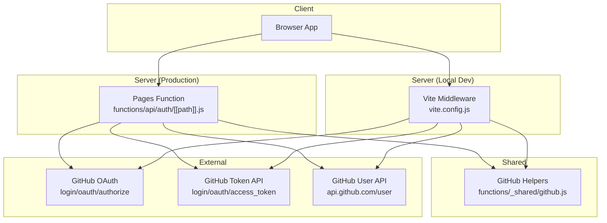
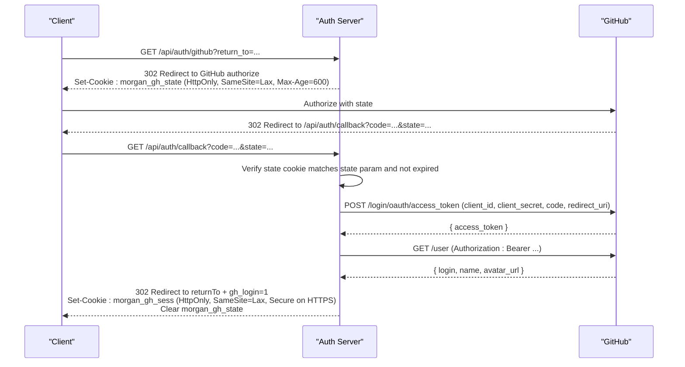
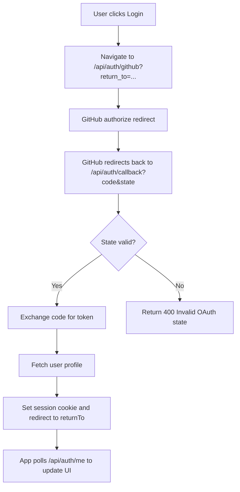
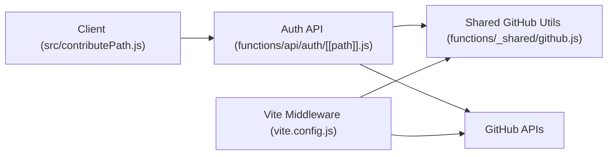

# Authentication API

<cite>
**Referenced Files in This Document**
- [functions/api/auth/[[path]].js](file://functions/api/auth/[[path]].js)
- [functions/_shared/github.js](file://functions/_shared/github.js)
- [vite.config.js](file://vite.config.js)
- [src/contributePath.js](file://src/contributePath.js)
</cite>

## Table of Contents
1. [Introduction](#introduction)
2. [Project Structure](#project-structure)
3. [Core Components](#core-components)
4. [Architecture Overview](#architecture-overview)
5. [Detailed Component Analysis](#detailed-component-analysis)
6. [Dependency Analysis](#dependency-analysis)
7. [Performance Considerations](#performance-considerations)
8. [Troubleshooting Guide](#troubleshooting-guide)
9. [Conclusion](#conclusion)
10. [Appendices](#appendices)

## Introduction
This document describes MorganTraveler’s GitHub OAuth authentication endpoints and the complete client flow from redirect to authenticated state. It covers:
- GET /api/auth/github — initiate authorization
- GET /api/auth/callback — exchange code, set session cookie, redirect back
- GET /api/auth/me — verify current session
- POST /api/auth/logout — terminate session

It also documents request/response schemas, error handling, security considerations (CSRF via state parameter, HttpOnly and Secure cookies), CORS configuration, environment variables, and client-side integration examples.

## Project Structure
The authentication logic is implemented as a serverless Pages Function and mirrored in the local development middleware for Vite. Shared utilities handle cookies, base64 encoding/decoding, and GitHub API calls.

**Diagram sources**
- [functions/api/auth/[[path]].js:1-255](file://functions/api/auth/[[path]].js#L1-L255)
- [functions/_shared/github.js:1-415](file://functions/_shared/github.js#L1-L415)
- [vite.config.js:120-319](file://vite.config.js#L120-L319)

**Section sources**
- [functions/api/auth/[[path]].js:1-255](file://functions/api/auth/[[path]].js#L1-L255)
- [functions/_shared/github.js:1-415](file://functions/_shared/github.js#L1-L415)
- [vite.config.js:120-319](file://vite.config.js#L120-L319)

## Core Components
- Pages Function handler for /api/auth routes with routing, CORS, redirects, and JSON responses.
- Shared GitHub helpers for cookie parsing/generation, base64 encoding/decoding, and GitHub API calls.
- Local dev mirror in Vite middleware that replicates production behavior during development.
- Client integration in the app to start login, check session, and logout.

**Section sources**
- [functions/api/auth/[[path]].js:1-255](file://functions/api/auth/[[path]].js#L1-L255)
- [functions/_shared/github.js:1-415](file://functions/_shared/github.js#L1-L415)
- [vite.config.js:120-319](file://vite.config.js#L120-L319)
- [src/contributePath.js:936-974](file://src/contributePath.js#L936-L974)

## Architecture Overview
The OAuth flow uses PKCE-like CSRF protection via a short-lived state cookie and a state parameter passed to GitHub. After user consent, GitHub redirects back with an authorization code. The server exchanges it for an access token, fetches the user profile, sets a secure HttpOnly session cookie, clears the temporary state cookie, and redirects to the original page.

**Diagram sources**
- [functions/api/auth/[[path]].js:132-251](file://functions/api/auth/[[path]].js#L132-L251)
- [functions/_shared/github.js:44-120](file://functions/_shared/github.js#L44-L120)
- [vite.config.js:187-306](file://vite.config.js#L187-L306)

## Detailed Component Analysis

### Endpoint: GET /api/auth/github
Purpose: Start GitHub OAuth authorization.

- Behavior
  - Validates that OAuth is configured (requires client ID and secret).
  - Generates a random state value and stores it in a short-lived, HttpOnly, SameSite=Lax cookie named morgan_gh_state along with the intended return path and expiration.
  - Redirects to GitHub’s authorize endpoint with scope public_repo read:user.
  - On HTTPS or proxied HTTPS, the state cookie includes the Secure flag.

- Request
  - Query parameters:
    - return_to: optional string; must be a safe path starting with “/” when used later.

- Response
  - 302 Redirect to GitHub with Set-Cookie: morgan_gh_state.
  - If OAuth is not configured: 503 JSON error.

- Security
  - CSRF protection via state parameter and matching state cookie.
  - State cookie is HttpOnly and SameSite=Lax to mitigate CSRF.
  - Secure flag applied on HTTPS.

- CORS
  - Preflight OPTIONS returns allowed methods and headers.
  - Responses include Access-Control-Allow-Origin: * and Allow-Credentials: true.

**Section sources**
- [functions/api/auth/[[path]].js:63-83](file://functions/api/auth/[[path]].js#L63-L83)
- [functions/api/auth/[[path]].js:132-164](file://functions/api/auth/[[path]].js#L132-L164)
- [functions/api/auth/[[path]].js:25-31](file://functions/api/auth/[[path]].js#L25-L31)

### Endpoint: GET /api/auth/callback
Purpose: Exchange authorization code for token, validate state, set session cookie, and redirect back.

- Behavior
  - Requires code and state query parameters.
  - Reads and validates the morgan_gh_state cookie:
    - Must match the state parameter.
    - Must not be expired.
  - Exchanges code for access token via GitHub’s token endpoint.
  - Fetches user profile using the access token.
  - Sets a session cookie (morgan_gh_sess) containing token, login, name, avatar, and expiry.
  - Clears the temporary state cookie.
  - Redirects to the stored returnTo with gh_login=1 appended.

- Request
  - Query parameters:
    - code: required
    - state: required

- Response
  - 302 Redirect to returnTo with gh_login=1 and Set-Cookie: morgan_gh_sess (HttpOnly, SameSite=Lax, Secure on HTTPS).
  - Errors:
    - 400 if missing code/state.
    - 400 if invalid or expired state cookie.
    - 400 if token exchange fails or user fetch fails.
    - 503 if OAuth not configured.

- Security
  - Strict state validation prevents CSRF and replay attacks.
  - Session cookie is HttpOnly and SameSite=Lax; Secure on HTTPS.
  - Short-lived state cookie mitigates timing-based attacks.

**Section sources**
- [functions/api/auth/[[path]].js:166-251](file://functions/api/auth/[[path]].js#L166-L251)
- [functions/_shared/github.js:44-120](file://functions/_shared/github.js#L44-L120)

### Endpoint: GET /api/auth/me
Purpose: Check current session and return minimal user info.

- Behavior
  - Parses the session cookie.
  - Returns logged_in status and user fields if present; otherwise indicates not logged in.
  - Includes oauth_configured and debug flags indicating whether OAuth is configured.

- Request
  - Cookie: morgan_gh_sess (set by callback).

- Response
  - 200 JSON:
    - logged_in: boolean
    - login: string (if logged in)
    - name: string (if logged in)
    - avatar: string (if logged in)
    - oauth_configured: boolean
    - has_client_id, has_client_secret, has_redirect_uri: boolean (debug flags)

- Security
  - No sensitive tokens are returned.
  - Uses same-origin cookie policy; credentials included by client.

**Section sources**
- [functions/api/auth/[[path]].js:97-117](file://functions/api/auth/[[path]].js#L97-L117)
- [functions/_shared/github.js:44-60](file://functions/_shared/github.js#L44-L60)

### Endpoint: POST /api/auth/logout
Purpose: Terminate session by clearing the session cookie.

- Behavior
  - Clears the morgan_gh_sess cookie.
  - Returns a success response with logged_in=false.

- Request
  - Method: POST (GET also supported for convenience).
  - Cookie: morgan_gh_sess (to identify which session to clear).

- Response
  - 200 JSON:
    - ok: boolean
    - logged_in: false
  - Set-Cookie: morgan_gh_sess cleared with HttpOnly, SameSite=Lax, Secure on HTTPS.

**Section sources**
- [functions/api/auth/[[path]].js:119-130](file://functions/api/auth/[[path]].js#L119-L130)
- [functions/_shared/github.js:89-100](file://functions/_shared/github.js#L89-L100)

### Client Integration Example
The application initiates login, checks session, and logs out using these endpoints.

- Start login
  - Navigate to /api/auth/github with return_to set to the current page path.
- Check session
  - Call GET /api/auth/me with credentials included to read the session cookie.
- Logout
  - Call POST /api/auth/logout with credentials included to clear the session cookie.

**Diagram sources**
- [src/contributePath.js:936-974](file://src/contributePath.js#L936-L974)
- [functions/api/auth/[[path]].js:132-251](file://functions/api/auth/[[path]].js#L132-L251)

**Section sources**
- [src/contributePath.js:936-974](file://src/contributePath.js#L936-L974)

## Dependency Analysis
- The Pages Function depends on shared GitHub helpers for cookie handling and GitHub API calls.
- The Vite middleware mirrors the Pages Function behavior for local development, including OAuth flows and CORS.
- The client relies on the /api/auth endpoints and reads the session cookie via browser requests with credentials enabled.

**Diagram sources**
- [functions/api/auth/[[path]].js:1-255](file://functions/api/auth/[[path]].js#L1-L255)
- [functions/_shared/github.js:1-415](file://functions/_shared/github.js#L1-L415)
- [vite.config.js:120-319](file://vite.config.js#L120-L319)
- [src/contributePath.js:936-974](file://src/contributePath.js#L936-L974)

**Section sources**
- [functions/api/auth/[[path]].js:1-255](file://functions/api/auth/[[path]].js#L1-L255)
- [functions/_shared/github.js:1-415](file://functions/_shared/github.js#L1-L415)
- [vite.config.js:120-319](file://vite.config.js#L120-L319)
- [src/contributePath.js:936-974](file://src/contributePath.js#L936-L974)

## Performance Considerations
- Minimal server-side work: state validation, token exchange, and one user profile call per login.
- Cookies are small and short-lived (state) or medium-lived (session).
- Avoid repeated polling of /api/auth/me; cache the result locally until logout or navigation.
- Use HTTPS to enable Secure cookies and reduce latency via CDN/proxy caching where appropriate.

[No sources needed since this section provides general guidance]

## Troubleshooting Guide
Common issues and resolutions:

- Missing code or state in callback
  - Symptom: 400 error with message about missing code/state.
  - Cause: GitHub did not redirect properly or URL was altered.
  - Fix: Ensure the full redirect URI is registered in GitHub OAuth settings and matches the server’s expected redirect.

- Invalid OAuth state
  - Symptom: 400 error indicating invalid state or expired state cookie.
  - Cause: State mismatch or state cookie expired before callback.
  - Fix: Retry login; ensure no cross-site redirects strip cookies; confirm SameSite and Secure flags are correct for your environment.

- Token exchange failed
  - Symptom: 400 error with token exchange failure details.
  - Cause: Incorrect client_id/client_secret, wrong redirect_uri, or code already used.
  - Fix: Verify environment variables and GitHub OAuth app settings; ensure single-use codes.

- Could not load GitHub user
  - Symptom: 400 error after successful token exchange.
  - Cause: Invalid or revoked access token; GitHub API rate limit.
  - Fix: Re-authenticate; check network and rate limits.

- OAuth not configured
  - Symptom: 503 error indicating OAuth not configured.
  - Cause: Missing GITHUB_OAUTH_CLIENT_ID or GITHUB_OAUTH_CLIENT_SECRET.
  - Fix: Set both environment variables on the server.

- CORS errors in browser
  - Symptom: Network errors due to cross-origin restrictions.
  - Cause: Requests without proper headers or credentials.
  - Fix: Include credentials in fetch and ensure server allows credentials; use HTTPS.

- Development vs production differences
  - Symptom: Works locally but not in production.
  - Cause: Different origins, redirect URIs, or cookie flags.
  - Fix: Align redirect_uri across environments; ensure HTTPS in production for Secure cookies.

**Section sources**
- [functions/api/auth/[[path]].js:166-251](file://functions/api/auth/[[path]].js#L166-L251)
- [functions/api/auth/[[path]].js:63-83](file://functions/api/auth/[[path]].js#L63-L83)
- [vite.config.js:187-306](file://vite.config.js#L187-L306)

## Conclusion
MorganTraveler’s GitHub OAuth implementation follows standard best practices:
- CSRF protection via state parameter and short-lived state cookie.
- Secure, HttpOnly, SameSite=Lax cookies for sessions.
- Clear error responses for missing or invalid inputs.
- CORS support for cross-origin clients.
- Mirrored behavior in local development for consistent testing.

Use the provided endpoints and follow the client flow to integrate authentication seamlessly into the application.

[No sources needed since this section summarizes without analyzing specific files]

## Appendices

### Environment Variables
Required:
- GITHUB_OAUTH_CLIENT_ID
- GITHUB_OAUTH_CLIENT_SECRET

Optional:
- GITHUB_OAUTH_REDIRECT_URI (defaults to origin + /api/auth/callback if not set)

These are read by both the production Pages Function and the local Vite middleware.

**Section sources**
- [functions/api/auth/[[path]].js:63-83](file://functions/api/auth/[[path]].js#L63-L83)
- [vite.config.js:35-47](file://vite.config.js#L35-L47)

### Request/Response Schemas

- GET /api/auth/github
  - Query: return_to (optional)
  - Response: 302 Redirect to GitHub; Set-Cookie: morgan_gh_state
  - Error: 503 JSON if OAuth not configured

- GET /api/auth/callback
  - Query: code (required), state (required)
  - Response: 302 Redirect to returnTo with gh_login=1; Set-Cookie: morgan_gh_sess; Clear morgan_gh_state
  - Errors: 400 JSON for missing code/state, invalid state, token exchange failure, user fetch failure; 503 if OAuth not configured

- GET /api/auth/me
  - Headers: Cookie: morgan_gh_sess
  - Response: 200 JSON with logged_in, login, name, avatar, oauth_configured, and debug flags

- POST /api/auth/logout
  - Headers: Cookie: morgan_gh_sess
  - Response: 200 JSON with ok=true, logged_in=false; Set-Cookie: morgan_gh_sess cleared

**Section sources**
- [functions/api/auth/[[path]].js:97-130](file://functions/api/auth/[[path]].js#L97-L130)
- [functions/api/auth/[[path]].js:132-251](file://functions/api/auth/[[path]].js#L132-L251)
- [functions/_shared/github.js:44-100](file://functions/_shared/github.js#L44-L100)

### CORS Configuration
- Allowed methods: GET, POST, OPTIONS
- Allowed headers: Content-Type
- Credentials: allowed
- Origin: wildcard (*)
- Cross-Origin-Resource-Policy: cross-origin

**Section sources**
- [functions/api/auth/[[path]].js:25-31](file://functions/api/auth/[[path]].js#L25-L31)
- [vite.config.js:148-155](file://vite.config.js#L148-L155)

### Security Notes
- CSRF protection via state parameter and short-lived state cookie.
- Session cookies are HttpOnly and SameSite=Lax; Secure on HTTPS.
- No secrets exposed in responses; only minimal user info.
- Redirect targets validated to prevent open redirects.

**Section sources**
- [functions/api/auth/[[path]].js:141-163](file://functions/api/auth/[[path]].js#L141-L163)
- [functions/api/auth/[[path]].js:177-196](file://functions/api/auth/[[path]].js#L177-L196)
- [functions/_shared/github.js:66-100](file://functions/_shared/github.js#L66-L100)