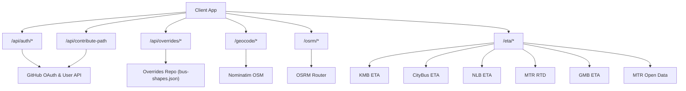
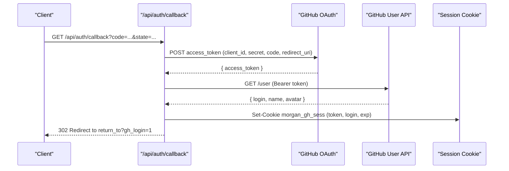
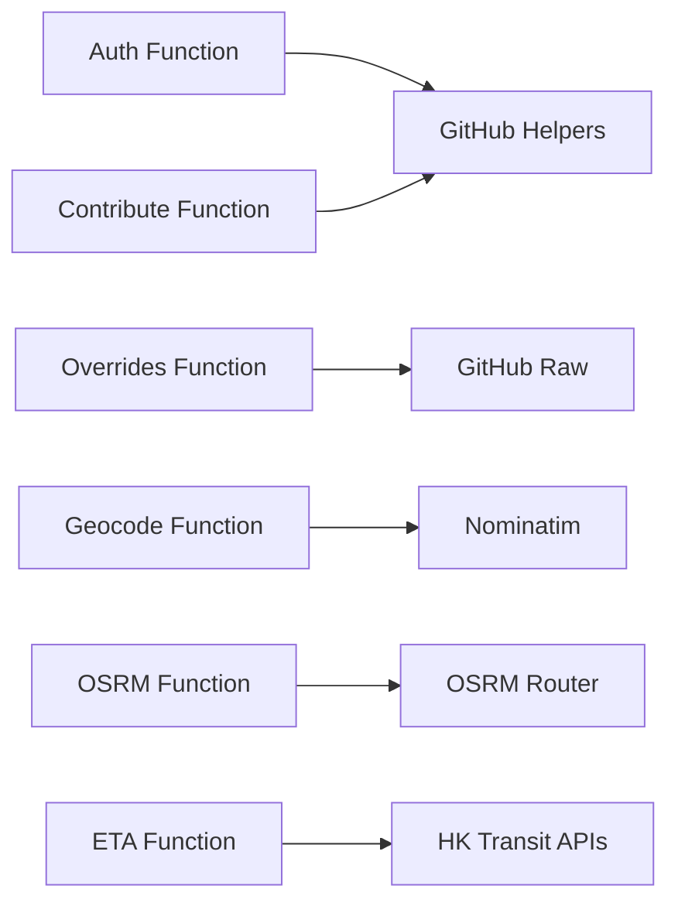

# Edge Functions and APIs

<cite>
**Referenced Files in This Document**
- [functions/api/auth/[[path]].js](file://functions/api/auth/[[path]].js)
- [functions/_shared/github.js](file://functions/_shared/github.js)
- [functions/api/contribute-path.js](file://functions/api/contribute-path.js)
- [functions/api/overrides/[[path]].js](file://functions/api/overrides/[[path]].js)
- [functions/geocode/[[path]].js](file://functions/geocode/[[path]].js)
- [functions/osrm/[[path]].js](file://functions/osrm/[[path]].js)
- [functions/eta/[[path]].js](file://functions/eta/[[path]].js)
- [wrangler.toml](file://wrangler.toml)
- [docs/local-overrides.md](file://docs/local-overrides.md)
</cite>

## Table of Contents
1. Introduction
2. Project Structure
3. Core Components
4. Architecture Overview
5. Detailed Component Analysis
6. Dependency Analysis
7. Performance Considerations
8. Troubleshooting Guide
9. Conclusion
10. Appendices

## Introduction
This document provides API documentation for MorganTraveler’s Cloudflare Pages Functions that serve as backend services. It covers:
- Authentication endpoints implementing GitHub OAuth flow, token management, and user session handling
- Override management APIs for submitting and reviewing route corrections (drafts and published shapes)
- Geocoding proxy to Nominatim for address search, reverse geocoding, and autocomplete
- OSRM proxy for walking directions and distance calculations
- ETA proxy for Hong Kong transit operators

It includes protocol-specific examples, error handling strategies, rate limiting policies, security considerations, common use cases, client implementation guidelines, and performance optimization tips for edge function calls.

## Project Structure
MorganTraveler exposes several edge functions under the functions directory. Each file exports an onRequest handler used by Cloudflare Pages Functions. Key groups:
- Authentication: /api/auth/*
- Contributions: /api/contribute-path
- Overrides: /api/overrides/*
- Geocoding: /geocode/*
- Routing: /osrm/*
- ETA: /eta/*

**Diagram sources**
- [functions/api/auth/[[path]].js:1-255](file://functions/api/auth/[[path]].js#L1-L255)
- [functions/api/contribute-path.js:1-335](file://functions/api/contribute-path.js#L1-L335)
- [functions/api/overrides/[[path]].js:1-120](file://functions/api/overrides/[[path]].js#L1-L120)
- [functions/geocode/[[path]].js:1-29](file://functions/geocode/[[path]].js#L1-L29)
- [functions/osrm/[[path]].js:1-25](file://functions/osrm/[[path]].js#L1-L25)
- [functions/eta/[[path]].js:1-86](file://functions/eta/[[path]].js#L1-L86)

**Section sources**
- [functions/api/auth/[[path]].js:1-255](file://functions/api/auth/[[path]].js#L1-L255)
- [functions/api/contribute-path.js:1-335](file://functions/api/contribute-path.js#L1-L335)
- [functions/api/overrides/[[path]].js:1-120](file://functions/api/overrides/[[path]].js#L1-L120)
- [functions/geocode/[[path]].js:1-29](file://functions/geocode/[[path]].js#L1-L29)
- [functions/osrm/[[path]].js:1-25](file://functions/osrm/[[path]].js#L1-L25)
- [functions/eta/[[path]].js:1-86](file://functions/eta/[[path]].js#L1-L86)
- [wrangler.toml:1-38](file://wrangler.toml#L1-L38)
- [docs/local-overrides.md:1-182](file://docs/local-overrides.md#L1-L182)

## Core Components
- Authentication service: GitHub OAuth start, callback, session cookie management, and current user info
- Contribution intake: Validates and stores draft bus shape submissions; optionally opens a PR via GitHub
- Overrides proxy: Serves published bus shapes from a configured repository with short cache TTL
- Geocoding proxy: Forwards requests to Nominatim with CORS and caching headers
- OSRM proxy: Forwards routing requests to OSRM public router with caching
- ETA proxy: Forwards requests to multiple HK transit operator APIs, preserving method and body where required

**Section sources**
- [functions/api/auth/[[path]].js:1-255](file://functions/api/auth/[[path]].js#L1-L255)
- [functions/_shared/github.js:1-415](file://functions/_shared/github.js#L1-L415)
- [functions/api/contribute-path.js:1-335](file://functions/api/contribute-path.js#L1-L335)
- [functions/api/overrides/[[path]].js:1-120](file://functions/api/overrides/[[path]].js#L1-L120)
- [functions/geocode/[[path]].js:1-29](file://functions/geocode/[[path]].js#L1-L29)
- [functions/osrm/[[path]].js:1-25](file://functions/osrm/[[path]].js#L1-L25)
- [functions/eta/[[path]].js:1-86](file://functions/eta/[[path]].js#L1-L86)

## Architecture Overview
The system is a set of lightweight proxies and handlers on Cloudflare Pages Functions. They:
- Enforce CORS and appropriate cache-control headers
- Validate inputs and enforce limits (e.g., payload size, coordinate bounds)
- Forward requests to upstream services (GitHub, Nominatim, OSRM, transit APIs)
- Manage sessions via signed cookies for authenticated flows
- Provide contribution workflows that persist drafts and optionally open PRs

**Diagram sources**
- [functions/api/auth/[[path]].js:166-251](file://functions/api/auth/[[path]].js#L166-L251)
- [functions/_shared/github.js:105-120](file://functions/_shared/github.js#L105-L120)

## Detailed Component Analysis

### Authentication API (/api/auth)
Endpoints:
- GET /api/auth/github or /api/auth/login
  - Purpose: Start GitHub OAuth flow
  - Query params: return_to (optional)
  - Behavior: Generates state, sets short-lived state cookie, redirects to GitHub authorize with scopes public_repo read:user
  - Errors: 503 if OAuth not configured
- GET /api/auth/callback
  - Purpose: Exchange code for token, fetch user, set session cookie, redirect back
  - Query params: code, state
  - Behavior: Validates state cookie, exchanges token, fetches user profile, sets session cookie with expiration, clears state cookie
  - Errors: 400 for missing/invalid parameters or token exchange failures
- GET /api/auth/me
  - Purpose: Return logged-in status and user info
  - Response fields: logged_in, oauth_configured, login/name/avatar when available
- POST /api/auth/logout
  - Purpose: Clear session cookie
  - Response: ok true, logged_in false

Security and session handling:
- State parameter stored in HttpOnly, SameSite=Lax, short-lived cookie
- Session cookie contains base64-encoded JSON with token, login, name, avatar, and expiration
- Secure flag applied based on request protocol or x-forwarded-proto

Rate limiting and CORS:
- CORS allows GET/POST/OPTIONS with credentials
- No explicit rate limiting implemented at this endpoint

Example flows:
- Start OAuth: GET /api/auth/github?return_to=/map
- Callback: GET /api/auth/callback?code=CODE&state=STATE
- Check status: GET /api/auth/me
- Logout: POST /api/auth/logout

Error handling highlights:
- Missing code/state returns 400
- Invalid state cookie returns 400
- Token exchange failure returns 400 with error description
- Unknown routes return 404

**Section sources**
- [functions/api/auth/[[path]].js:85-255](file://functions/api/auth/[[path]].js#L85-L255)
- [functions/_shared/github.js:44-100](file://functions/_shared/github.js#L44-L100)

### Contribution Intake API (/api/contribute-path)
Endpoint:
- POST /api/contribute-path
  - Purpose: Accept draft bus shape submissions, validate, store, and optionally open a PR
  - Request body: JSON object conforming to schema morgan.travelers.bus-shape.v1
  - Optional field: submit_mode ("oauth" or "bot")
  - Behavior:
    - Validates payload size, schema, coordinates, and HK bounds
    - Stores draft to KV/R2 if configured
    - Optionally notifies webhook
    - Opens PR via GitHub using either OAuth mode (contributor’s fork) or bot mode (server token)
  - Response: Includes id, accepted status, storage details, webhook status, PR info, and messages

Validation rules:
- Schema must be morgan.travelers.bus-shape.v1
- Required fields: agency, route_short_name, from_match, to_match, coordinates (min 2 points)
- Coordinates must be numeric and within HK bounds
- Limits: max 2000 coordinates, max 500 visual_stops, max 400KB body

Storage and notifications:
- Storage targets: Cloudflare KV namespace CONTRIBUTIONS and/or R2 bucket CONTRIBUTIONS_BUCKET
- Webhook notification to CONTRIBUTE_WEBHOOK_URL if configured

PR workflow:
- OAuth mode: Uses session cookie token to create branch on contributor’s fork and open PR to upstream
- Bot mode: Uses server token to create branch on upstream and open PR

Errors:
- 400 for invalid JSON or validation errors
- 401 if OAuth mode without valid session
- 413 for oversized payloads
- 502 if PR creation fails and no other acceptance path succeeded

Example request:
- POST /api/contribute-path with JSON body including schema, agency, route_short_name, from_match, to_match, coordinates, and optional notes

Example responses:
- 200 Accepted with PR opened
- 202 Accepted but no channel configured (stored locally only)
- 400 Validation error
- 401 Need login for OAuth mode
- 502 GitHub PR creation failed

**Section sources**
- [functions/api/contribute-path.js:1-335](file://functions/api/contribute-path.js#L1-L335)
- [functions/_shared/github.js:137-410](file://functions/_shared/github.js#L137-L410)

### Overrides API (/api/overrides)
Endpoints:
- GET /api/overrides/bus-shapes.json or /api/overrides/bus-shapes
  - Purpose: Proxy published bus shapes from a configured GitHub repository
  - Environment: OVERRIDES_REPO (default owner/name), OVERRIDES_BRANCH (default main)
  - Behavior: Fetches raw JSON from GitHub, caches briefly via CF with short TTL, forwards response
  - Headers: CORS enabled, Cache-Control with short TTL, X-Overrides-Source indicates origin URL
  - Errors: 404 for unsupported paths, 405 for non-GET methods, 502 for upstream failures

Local development notes:
- Additional dev-only endpoints exist for status, pending list, merge, and reload operations documented in local overrides guide

Example usage:
- GET /api/overrides/bus-shapes.json to retrieve published shapes for mapping

Error handling:
- Upstream fetch failures return 502 with error details
- Unsupported paths return 404 with path information

**Section sources**
- [functions/api/overrides/[[path]].js:1-120](file://functions/api/overrides/[[path]].js#L1-L120)
- [docs/local-overrides.md:141-154](file://docs/local-overrides.md#L141-L154)

### Geocoding Proxy (/geocode)
Endpoints:
- GET /geocode/search
  - Purpose: Address search via Nominatim
- GET /geocode/reverse
  - Purpose: Reverse geocoding via Nominatim
- Autocomplete: Use Nominatim query parameters through the same proxy

Behavior:
- Forwards request path and query string to https://nominatim.openstreetmap.org
- Sets Accept header to application/json
- Adds CORS and Cache-Control headers for browser caching

Example requests:
- GET /geocode/search?q=address+string
- GET /geocode/reverse?lat=22.2783&lon=114.1747

Response:
- Proxies Nominatim response with original status and content type

Notes:
- Respect Nominatim usage policies and rate limits; consider adding client identification in User-Agent

**Section sources**
- [functions/geocode/[[path]].js:1-29](file://functions/geocode/[[path]].js#L1-L29)

### OSRM Proxy (/osrm)
Endpoints:
- GET /osrm/route/v1/walking/{coordinates}?steps=true&annotations=steps,distances,durations
  - Purpose: Walking directions with turn-by-turn data
- GET /osrm/table/v1/walking/{coordinates}
  - Purpose: Distance matrix for walking
- Other OSRM endpoints supported via passthrough

Behavior:
- Forwards request to https://router.project-osrm.org
- Sets Accept header to application/json
- Adds CORS and Cache-Control headers with longer TTL suitable for static routing results

Example requests:
- GET /osrm/route/v1/walking/114.169,22.319;114.174,22.278?steps=true&annotations=steps,distances,durations
- GET /osrm/table/v1/walking/114.169,22.319;114.174,22.278

Response:
- Proxies OSRM response with original status and content type

Notes:
- Public OSRM service has usage limits; implement client-side retry/backoff and avoid excessive polling

**Section sources**
- [functions/osrm/[[path]].js:1-25](file://functions/osrm/[[path]].js#L1-L25)

### ETA Proxy (/eta)
Endpoints:
- /eta/kmb/* → KMB real-time arrivals
- /eta/ctb/* → CityBus real-time arrivals
- /eta/nlb/* → New Lantao Bus real-time arrivals
- /eta/mtr/* → MTR real-time data
- /eta/gmb/* → Green Minibus real-time data
- /eta/mtr-open/* → MTR Open Data

Behavior:
- Routes to target operator APIs while preserving method and body
- Special handling for POST to MTR Bus getSchedule
- Adds CORS and cache headers; GET requests cached briefly

Example requests:
- GET /eta/kmb/stop-eta/12345
- POST /eta/mtr/bus/getSchedule with JSON body { language, routeName }

Response:
- Proxies operator response with original status and content type

Notes:
- Some operators may require specific headers or rate limiting; monitor upstream responses and handle errors gracefully

**Section sources**
- [functions/eta/[[path]].js:1-86](file://functions/eta/[[path]].js#L1-L86)

## Dependency Analysis
Key dependencies and relationships:
- Authentication depends on shared GitHub helpers for session management and user fetching
- Contribution intake depends on GitHub helpers to open PRs and uses environment bindings for storage and webhooks
- Overrides proxy depends on environment variables to determine repository and branch
- Geocoding and OSRM proxies depend on external services (Nominatim, OSRM)
- ETA proxy depends on multiple transit operator APIs

**Diagram sources**
- [functions/api/auth/[[path]].js:15-23](file://functions/api/auth/[[path]].js#L15-L23)
- [functions/_shared/github.js:1-415](file://functions/_shared/github.js#L1-L415)
- [functions/api/overrides/[[path]].js:58-75](file://functions/api/overrides/[[path]].js#L58-L75)
- [functions/geocode/[[path]].js:5-16](file://functions/geocode/[[path]].js#L5-L16)
- [functions/osrm/[[path]].js:5-13](file://functions/osrm/[[path]].js#L5-L13)
- [functions/eta/[[path]].js:15-22](file://functions/eta/[[path]].js#L15-L22)

**Section sources**
- [functions/api/auth/[[path]].js:15-23](file://functions/api/auth/[[path]].js#L15-L23)
- [functions/_shared/github.js:1-415](file://functions/_shared/github.js#L1-L415)
- [functions/api/overrides/[[path]].js:58-75](file://functions/api/overrides/[[path]].js#L58-L75)
- [functions/geocode/[[path]].js:5-16](file://functions/geocode/[[path]].js#L5-L16)
- [functions/osrm/[[path]].js:5-13](file://functions/osrm/[[path]].js#L5-L13)
- [functions/eta/[[path]].js:15-22](file://functions/eta/[[path]].js#L15-L22)

## Performance Considerations
- Caching strategy:
  - Geocoding: 5-minute cache for Nominatim responses
  - OSRM: 1-hour cache for routing results
  - ETA: 15-second cache for GET requests
  - Overrides: 60-second cache with stale-while-revalidate for bus shapes
- Payload limits:
  - Contribution intake enforces 400KB max body and 2000 coordinate limit
- Network efficiency:
  - Use minimal query parameters and avoid redundant requests
  - Implement client-side debouncing for autocomplete and live updates
- Error resilience:
  - Retry with exponential backoff for transient upstream failures
  - Handle 4xx/5xx responses gracefully and inform users

[No sources needed since this section provides general guidance]

## Troubleshooting Guide
Common issues and resolutions:
- OAuth not configured:
  - Ensure GITHUB_OAUTH_CLIENT_ID and GITHUB_OAUTH_CLIENT_SECRET are set
  - Verify redirect URI matches production URL
- Token exchange failures:
  - Check code validity and ensure it hasn’t expired
  - Confirm redirect_uri matches exactly what was used in authorization
- Contribution submission errors:
  - Validate schema and required fields
  - Ensure coordinates are within HK bounds
  - Check storage bindings (KV/R2) and webhook configuration
- Overrides proxy failures:
  - Verify OVERRIDES_REPO and OVERRIDES_BRANCH settings
  - Check upstream availability and network connectivity
- Geocoding/OSRM/ETA timeouts:
  - Implement retries and fallbacks
  - Monitor upstream rate limits and adjust request frequency

**Section sources**
- [functions/api/auth/[[path]].js:132-164](file://functions/api/auth/[[path]].js#L132-L164)
- [functions/api/contribute-path.js:36-134](file://functions/api/contribute-path.js#L36-L134)
- [functions/api/overrides/[[path]].js:58-118](file://functions/api/overrides/[[path]].js#L58-L118)
- [functions/geocode/[[path]].js:5-27](file://functions/geocode/[[path]].js#L5-L27)
- [functions/osrm/[[path]].js:5-23](file://functions/osrm/[[path]].js#L5-L23)
- [functions/eta/[[path]].js:31-85](file://functions/eta/[[path]].js#L31-L85)

## Conclusion
MorganTraveler’s edge functions provide a robust set of APIs for authentication, contributions, overrides, geocoding, routing, and real-time transit data. The design emphasizes security through OAuth and session management, input validation, and efficient caching. Clients should follow the documented endpoints, handle errors gracefully, and respect rate limits and usage policies of upstream services.

[No sources needed since this section summarizes without analyzing specific files]

## Appendices

### Environment Variables and Secrets
- Non-secret variables:
  - OVERRIDES_REPO: Target repository for overrides
  - OVERRIDES_BASE_BRANCH: Base branch for PRs
  - GITHUB_OAUTH_REDIRECT_URI: Optional fixed callback URL
- Secrets (set in Cloudflare Dashboard):
  - OVERRIDES_GITHUB_TOKEN: Bot PAT for opening PRs
  - GITHUB_OAUTH_CLIENT_SECRET: OAuth App secret
  - GITHUB_OAUTH_CLIENT_ID: Optional as Secret
  - CONTRIBUTE_WEBHOOK_URL: Optional webhook for notifications
  - GITHUB_TOKEN: Fallback for OVERRIDES_GITHUB_TOKEN

**Section sources**
- [wrangler.toml:11-27](file://wrangler.toml#L11-L27)
- [docs/local-overrides.md:156-182](file://docs/local-overrides.md#L156-L182)

### Local Development Notes
- Dev-only endpoints for overrides management:
  - GET /api/overrides/status
  - GET /api/overrides/pending
  - POST /api/overrides/merge
  - POST /api/overrides/reload-public
- Workflow:
  - Submit drafts locally
  - Merge pending to publish
  - Reload app shapes

**Section sources**
- [docs/local-overrides.md:141-154](file://docs/local-overrides.md#L141-L154)
- [docs/local-overrides.md:101-139](file://docs/local-overrides.md#L101-L139)