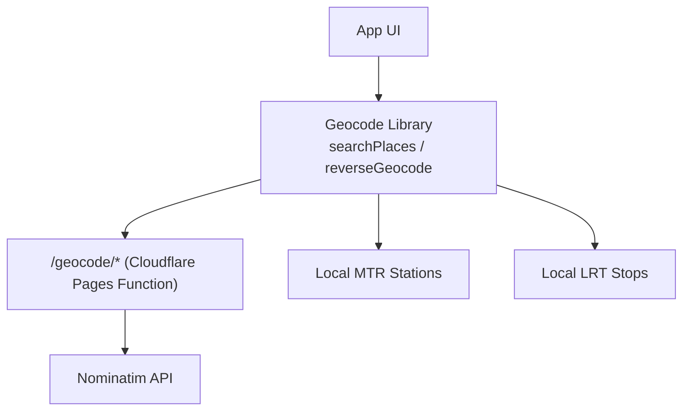
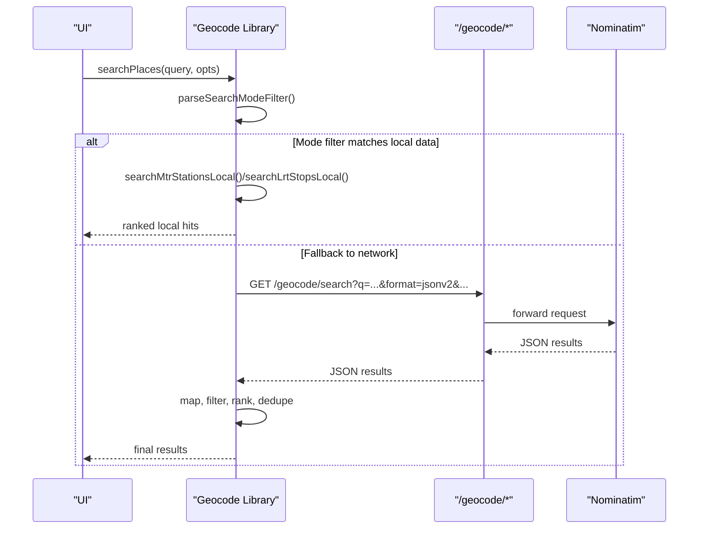
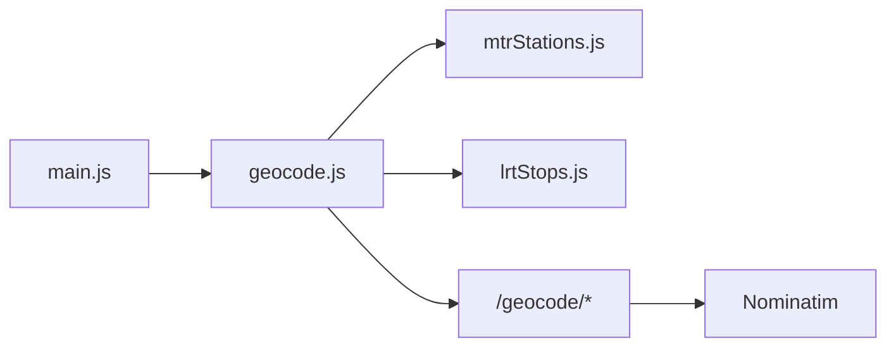

# Geocoding Services

<cite>
**Referenced Files in This Document**
- [functions/geocode/[[path]].js](file://functions/geocode/[[path]].js)
- [src/geocode.js](file://src/geocode.js)
- [src/mtrStations.js](file://src/mtrStations.js)
- [src/lrtStops.js](file://src/lrtStops.js)
- [src/main.js](file://src/main.js)
</cite>

## Table of Contents
1. [Introduction](#introduction)
2. [Project Structure](#project-structure)
3. [Core Components](#core-components)
4. [Architecture Overview](#architecture-overview)
5. [Detailed Component Analysis](#detailed-component-analysis)
6. [Dependency Analysis](#dependency-analysis)
7. [Performance Considerations](#performance-considerations)
8. [Troubleshooting Guide](#troubleshooting-guide)
9. [Conclusion](#conclusion)
10. [Appendices](#appendices)

## Introduction
This document describes MorganTraveler’s geocoding and location search services, including:
- Forward geocoding (free-text place search with local MTR/LRT bias)
- Reverse geocoding (coordinates to a short label)
- Autocomplete-style suggestions via the same search API
It also covers request parameters, response shapes, error handling, rate-limiting considerations, caching strategies, and performance tips for client-side usage.

## Project Structure
MorganTraveler implements geocoding through a small serverless proxy and a rich client-side search layer:
- Serverless proxy: forwards requests to OpenStreetMap Nominatim with CORS and caching headers.
- Client library: composes local transit directories (MTR stations, Light Rail stops) with Nominatim results, ranks them, and returns unified results.
- UI integration: uses the search and reverse APIs to power origin/destination input and current-location features.

**Diagram sources**
- [functions/geocode/[[path]].js:5-27](file://functions/geocode/[[path]].js#L5-L27)
- [src/geocode.js:194-496](file://src/geocode.js#L194-L496)
- [src/mtrStations.js:136-215](file://src/mtrStations.js#L136-L215)
- [src/lrtStops.js:259-294](file://src/lrtStops.js#L259-L294)

**Section sources**
- [functions/geocode/[[path]].js:1-28](file://functions/geocode/[[path]].js#L1-L28)
- [src/geocode.js:1-586](file://src/geocode.js#L1-L586)

## Core Components
- Forward geocoding: searchPlaces(query, opts)
  - Supports mode filters via @tag or options: mtr, lrt, bus.
  - Uses local MTR/LRT directories first when applicable, then falls back to Nominatim with Hong Kong viewbox bias.
  - Returns ranked results with coordinates, labels, and transport-mode hints.
- Reverse geocoding: reverseGeocode(lat, lon, opts)
  - Calls Nominatim reverse endpoint via the proxy; returns a short human-readable label or formatted coordinates on failure.
- Current position: getCurrentPosition(options)
  - Wraps browser geolocation to return { lat, lon, accuracy } with robust error messages.

Key behaviors:
- Hong Kong bounding box filtering and viewbox bias for better locality.
- Strong preference for rail stations when query implies “station”.
- Deduplication and re-tagging of Light Rail vs Heavy Rail to avoid misclassification.

**Section sources**
- [src/geocode.js:194-496](file://src/geocode.js#L194-L496)
- [src/geocode.js:501-521](file://src/geocode.js#L501-L521)
- [src/geocode.js:526-559](file://src/geocode.js#L526-L559)

## Architecture Overview
The service is a hybrid approach:
- Client-side logic performs fast local lookups and smart ranking before calling the network.
- A minimal proxy ensures same-origin access to Nominatim and sets safe CORS and cache headers.

**Diagram sources**
- [src/geocode.js:194-496](file://src/geocode.js#L194-L496)
- [functions/geocode/[[path]].js:5-27](file://functions/geocode/[[path]].js#L5-L27)

## Detailed Component Analysis

### Forward Geocoding: searchPlaces(query, opts)
Purpose:
- Provide autocomplete-like suggestions and full place search with strong local transit bias.

Request parameters:
- query: string (supports @mtr/@lrt/@bus tags; see below).
- opts.limit: number (default 8; controls result count).
- opts.signal: AbortSignal (optional; for cancellation).
- opts.mode: "mtr" | "lrt" | "bus" | null (overrides parsed tag if provided).

Behavior highlights:
- Parses mode tags from query text; strips them from free text.
- For @mtr/@lrt, queries local directories first; returns immediately if sufficient hits.
- Builds Nominatim queries with Hong Kong context and viewbox; may issue extra targeted queries for station intent.
- Filters and ranks results by locality, category/type, name matching, and importance.
- Ensures Light Rail is not misclassified as heavy rail; deduplicates by name and coordinates.

Response schema (array of objects):
- lat: number
- lon: number
- name: string
- label: string (human-friendly display)
- type: string (e.g., station, halt, stop)
- category: string (e.g., railway)
- isMtr: boolean (heavy rail flag)
- isLrt: boolean (light rail flag)
- mode: "mtr" | "lrt" | "bus" | null
- source: string (e.g., "mtr-local", "lrt-local", or derived from Nominatim)

Notes:
- No explicit confidence score field is returned; ranking is internal. Use label/name/category to infer relevance.
- Results are filtered to Hong Kong when possible; otherwise returns best available.

Common use cases:
- Origin/destination input: call searchPlaces with user-typed text; present top results as suggestions.
- Nearby place search: combine with current location to refine queries (e.g., add neighborhood names).
- Address parsing: pass partial addresses; results often include street/building-level hits.

Autocomplete behavior:
- The same function supports short queries; minimum length checks apply unless mode is specified.
- Debounce input events on the client side to limit calls.

Error handling:
- If the proxy/network fails, errors are thrown with descriptive messages; callers should catch and degrade gracefully.

**Section sources**
- [src/geocode.js:194-496](file://src/geocode.js#L194-L496)
- [src/geocode.js:20-40](file://src/geocode.js#L20-L40)
- [src/mtrStations.js:136-215](file://src/mtrStations.js#L136-L215)
- [src/lrtStops.js:259-294](file://src/lrtStops.js#L259-L294)

### Reverse Geocoding: reverseGeocode(lat, lon, opts)
Purpose:
- Convert coordinates to a short, readable label.

Request parameters:
- lat: number
- lon: number
- opts.signal: optional AbortSignal

Behavior:
- Calls Nominatim reverse via the proxy with zoom and address details.
- On success, returns a formatted label; on failure or invalid response, returns a formatted coordinate string.

Response:
- string (label or formatted coordinates).

Use cases:
- Show a friendly label next to a pin dropped by the user.
- Display current location after geolocation lookup.

**Section sources**
- [src/geocode.js:501-521](file://src/geocode.js#L501-L521)

### Current Position: getCurrentPosition(options)
Purpose:
- Retrieve device location with high accuracy and reasonable timeouts.

Parameters:
- options: object passed to navigator.geolocation.getCurrentPosition (e.g., enableHighAccuracy, timeout, maximumAge).

Response:
- Promise resolving to { lat, lon, accuracy }.

Error handling:
- Rejects with clear messages for permission denied, unavailable, timeout, or unsupported devices.

**Section sources**
- [src/geocode.js:526-559](file://src/geocode.js#L526-L559)

### Serverless Proxy: /geocode/*
Purpose:
- Same-origin proxy to Nominatim with CORS and caching headers.

Endpoints:
- GET /geocode/search?query params forwarded to Nominatim search
- GET /geocode/reverse?lat&lon params forwarded to Nominatim reverse

Headers set:
- Content-Type: application/json (or upstream value)
- Cache-Control: public, max-age=300
- Access-Control-Allow-Origin: *
- Cross-Origin-Resource-Policy: cross-origin

Rate limiting:
- The proxy does not implement per-client rate limiting; it forwards to Nominatim. Respect Nominatim usage policies and throttle client-side.

**Section sources**
- [functions/geocode/[[path]].js:5-27](file://functions/geocode/[[path]].js#L5-L27)

## Dependency Analysis
- searchPlaces depends on:
  - Local MTR directory (searchMtrStationsLocal, MTR_STATIONS)
  - Local LRT directory (searchLrtStopsLocal, matchLrtStop, lrtStopToHit)
  - Nominatim via /geocode proxy
- reverseGeocode depends on:
  - Nominatim via /geocode proxy
- UI uses:
  - searchPlaces for autocomplete and suggestion lists
  - reverseGeocode for labeling pins and current location
  - getCurrentPosition for “use my location” flow

**Diagram sources**
- [src/main.js:3177-3207](file://src/main.js#L3177-L3207)
- [src/geocode.js:194-496](file://src/geocode.js#L194-L496)
- [functions/geocode/[[path]].js:5-27](file://functions/geocode/[[path]].js#L5-L27)

**Section sources**
- [src/main.js:3177-3207](file://src/main.js#L3177-L3207)
- [src/geocode.js:194-496](file://src/geocode.js#L194-L496)

## Performance Considerations
- Prefer local directories first:
  - For @mtr/@lrt queries, local searches are immediate and accurate.
- Limit network calls:
  - Use debounce on input changes (e.g., 200–300 ms).
  - Cancel in-flight requests using AbortSignal when new input arrives.
- Reduce payload size:
  - Keep limit modest (e.g., 8–12) for autocomplete.
- Cache responses:
  - The proxy sets Cache-Control: public, max-age=300. Browsers will reuse cached responses for identical URLs within that window.
  - Implement client-side memoization keyed by normalized query and mode to avoid duplicate calls during typing.
- Avoid unnecessary reverse calls:
  - Only reverse geocode when needed (e.g., on click or “use my location”).
- Hong Kong bias:
  - The viewbox and client-side filtering reduce irrelevant results and improve perceived speed.

[No sources needed since this section provides general guidance]

## Troubleshooting Guide
Common issues and resolutions:
- Empty results for HK places:
  - Ensure query includes relevant keywords or mode tags (@mtr/@lrt/@bus).
  - Verify the query is at least two characters unless a mode is specified.
- Unexpected bus stop instead of station:
  - Add “station” or use @mtr to prioritize rail.
- Incorrect Light Rail vs Heavy Rail:
  - The system auto-tags LRT; ensure your UI respects isLrt/isMtr flags.
- Network errors:
  - Check proxy availability and CORS headers; errors are thrown with status and message snippets.
- Geolocation failures:
  - Handle permission denied/unavailable/timeouts; fall back to manual input.

Error paths:
- Place search throws on non-OK responses or invalid JSON.
- Reverse geocode returns a formatted coordinate string on failure rather than throwing.
- getCurrentPosition rejects with specific error messages based on browser codes.

**Section sources**
- [src/geocode.js:306-321](file://src/geocode.js#L306-L321)
- [src/geocode.js:501-521](file://src/geocode.js#L501-L521)
- [src/geocode.js:526-559](file://src/geocode.js#L526-L559)

## Conclusion
MorganTraveler’s geocoding stack combines fast local transit lookups with robust Nominatim-based search to deliver accurate, region-biased results. By leveraging mode filters, local directories, and careful ranking, it provides reliable autocomplete and reverse geocoding suitable for origin/destination inputs and nearby place discovery. Follow the recommended client-side patterns (debounce, abort signals, caching) to optimize performance and resilience.

[No sources needed since this section summarizes without analyzing specific files]

## Appendices

### API Reference Summary

- Forward geocoding (autocomplete/place search)
  - Endpoint: GET /geocode/search (via proxy)
  - Parameters: q, format=jsonv2, addressdetails=1, limit, viewbox (HK), bounded=0
  - Response: Array of place objects with lat, lon, name, label, type, category, isMtr, isLrt, mode, source
  - Notes: Client composes additional targeted queries for station intent and merges/dedupe results

- Reverse geocoding
  - Endpoint: GET /geocode/reverse
  - Parameters: lat, lon, format=jsonv2, zoom=17, addressdetails=1
  - Response: String label or formatted coordinates on failure

- Current position
  - Browser API: navigator.geolocation.getCurrentPosition
  - Response: { lat, lon, accuracy }

[No sources needed since this section summarizes without analyzing specific files]

### Example Workflows

- Origin/destination input
  - User types into origin/destination fields.
  - Debounce input; call searchPlaces with query and limit.
  - Present top results; on selection, store lat/lon and label.

- Nearby place search
  - Get current position via getCurrentPosition.
  - Optionally reverse geocode to get neighborhood name.
  - Call searchPlaces with neighborhood + keyword (e.g., “cafe”, “station”).

- Address parsing
  - Pass partial address strings; rely on Nominatim to resolve to streets/buildings.
  - Use label and category to confirm correctness.

[No sources needed since this section provides conceptual examples]