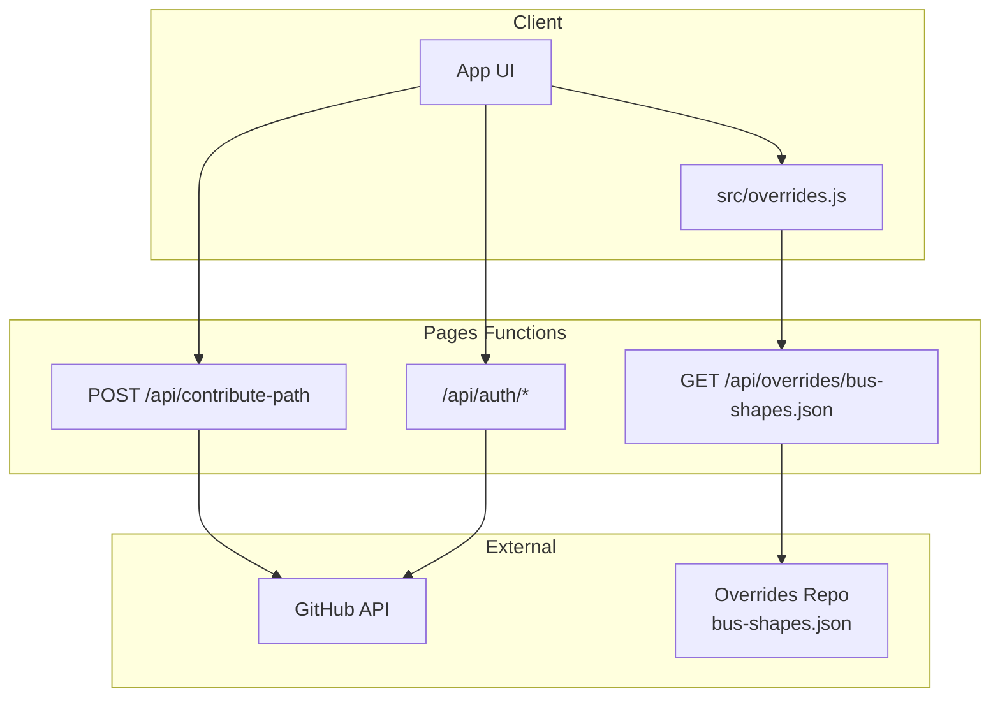
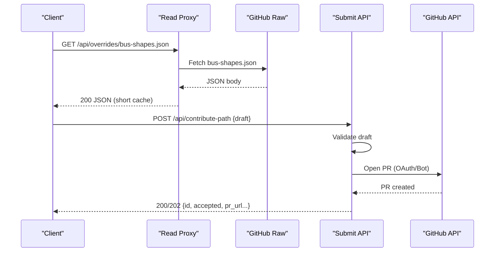
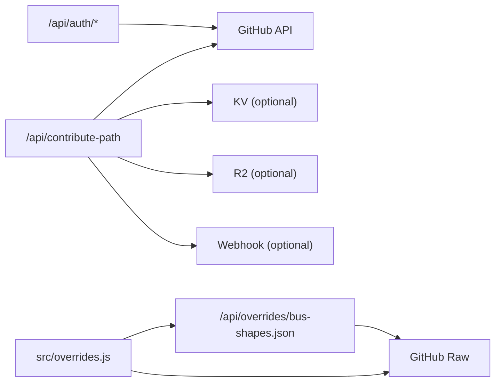

# Overrides Management API

<cite>
**Referenced Files in This Document**
- [functions/api/overrides/[[path]].js](file://functions/api/overrides/[[path]].js)
- [functions/api/contribute-path.js](file://functions/api/contribute-path.js)
- [functions/api/auth/[[path]].js](file://functions/api/auth/[[path]].js)
- [functions/_shared/github.js](file://functions/_shared/github.js)
- [src/overrides.js](file://src/overrides.js)
- [public/overrides/README.md](file://public/overrides/README.md)
- [docs/local-overrides.md](file://docs/local-overrides.md)
</cite>

## Table of Contents
1. [Introduction](#introduction)
2. [Project Structure](#project-structure)
3. [Core Components](#core-components)
4. [Architecture Overview](#architecture-overview)
5. [Detailed Component Analysis](#detailed-component-analysis)
6. [Dependency Analysis](#dependency-analysis)
7. [Performance Considerations](#performance-considerations)
8. [Troubleshooting Guide](#troubleshooting-guide)
9. [Conclusion](#conclusion)
10. [Appendices](#appendices)

## Introduction
This document describes the route override management APIs used by MorganTraveler to submit, retrieve, and manage transit route corrections and modifications. It covers:
- HTTP methods and URL patterns for submitting and retrieving overrides
- Request/response schemas for override data structures
- Validation rules for route changes
- Authentication requirements for submission endpoints
- Approval workflow integration via GitHub Pull Requests
- Error handling, rate limiting considerations, and data persistence mechanisms
- Examples of common override scenarios
- Client implementation guidelines for read-only access and contribution workflows

## Project Structure
The override system is implemented as Cloudflare Pages Functions with a client-side loader that fetches published shapes from a dedicated GitHub repository. The key parts are:
- Read-only proxy endpoint for published bus shape overrides
- Contribution intake endpoint that validates drafts and opens PRs
- OAuth endpoints for contributor authentication
- Shared GitHub utilities for PR creation and session handling
- Client-side module that resolves the best source for published shapes (API proxy → GitHub raw → local bundle)

**Diagram sources**
- [functions/api/overrides/[[path]].js:23-119](file://functions/api/overrides/[[path]].js#L23-L119)
- [functions/api/contribute-path.js:202-334](file://functions/api/contribute-path.js#L202-L334)
- [functions/api/auth/[[path]].js:85-254](file://functions/api/auth/[[path]].js#L85-L254)
- [src/overrides.js:24-41](file://src/overrides.js#L24-L41)

**Section sources**
- [functions/api/overrides/[[path]].js:1-120](file://functions/api/overrides/[[path]].js#L1-L120)
- [functions/api/contribute-path.js:1-335](file://functions/api/contribute-path.js#L1-L335)
- [functions/api/auth/[[path]].js:1-255](file://functions/api/auth/[[path]].js#L1-L255)
- [src/overrides.js:1-300](file://src/overrides.js#L1-L300)

## Core Components
- Published shapes reader: A same-origin GET endpoint that proxies the latest bus-shapes.json from the overrides repository. It enforces CORS, sets short cache TTLs, and returns error responses when upstream fetch fails.
- Contribution intake: A POST endpoint that validates draft submissions, persists them optionally to KV/R2, notifies webhooks, and opens a GitHub PR using either OAuth or bot mode.
- Authentication: OAuth endpoints to start login, handle callback, check session, and logout.
- Client loader: Resolves the best URL for published shapes and loads LRT/MTR static overrides from the app’s public folder.

**Section sources**
- [functions/api/overrides/[[path]].js:23-119](file://functions/api/overrides/[[path]].js#L23-L119)
- [functions/api/contribute-path.js:36-134](file://functions/api/contribute-path.js#L36-L134)
- [functions/api/auth/[[path]].js:97-164](file://functions/api/auth/[[path]].js#L97-L164)
- [src/overrides.js:168-241](file://src/overrides.js#L168-L241)

## Architecture Overview
The override lifecycle spans three phases:
- Read path: App requests published shapes; server proxies to GitHub raw with short caching.
- Submit path: App submits a validated draft; server stores it (optional), opens a PR, and returns metadata.
- Review path: Moderators review PRs and merge approved contributions into the overrides repo, which becomes the live source for readers.

**Diagram sources**
- [functions/api/overrides/[[path]].js:58-103](file://functions/api/overrides/[[path]].js#L58-L103)
- [functions/api/contribute-path.js:202-334](file://functions/api/contribute-path.js#L202-L334)
- [functions/_shared/github.js:137-409](file://functions/_shared/github.js#L137-L409)

## Detailed Component Analysis

### Read Endpoint: GET /api/overrides/bus-shapes.json
- Purpose: Serve the latest published bus shape overrides from the configured overrides repository.
- Behavior:
  - Accepts GET only; OPTIONS handled for CORS preflight.
  - Proxies to GitHub raw using environment variables for repository and branch.
  - Sets CORS headers and short cache TTLs for quick revalidation.
  - Returns 404 for unsupported paths, 405 for non-GET, and 502 on upstream failures.
- Headers:
  - Access-Control-Allow-Origin: *
  - Cross-Origin-Resource-Policy: cross-origin
  - Cache-Control: public, max-age=60, stale-while-revalidate=120
  - X-Overrides-Source: target URL

Request
- Method: GET
- Path: /api/overrides/bus-shapes.json

Response
- 200 OK: application/json; charset=utf-8 — published bus shapes payload
- 404 Not Found: { error: "not found", path: "<rest>" }
- 405 Method Not Allowed: { error: "method not allowed" }
- 502 Bad Gateway: { error: "upstream failed" | "fetch failed", status?, url?, message? }

Notes
- Uses Cloudflare cacheTtl for edge caching.
- No authentication required.

**Section sources**
- [functions/api/overrides/[[path]].js:23-119](file://functions/api/overrides/[[path]].js#L23-L119)

### Contribution Intake: POST /api/contribute-path
- Purpose: Accept validated route correction drafts and open a review PR.
- Behavior:
  - Validates schema and fields strictly.
  - Optionally stores draft to KV/R2 and sends webhook notifications.
  - Opens a PR via GitHub using OAuth or bot token.
  - Returns acceptance status and PR details.

Authentication
- OAuth mode requires a valid GitHub session cookie set via /api/auth/callback.
- Bot mode requires OVERRIDES_GITHUB_TOKEN configured at runtime.

Validation Rules
- schema must be "morgan.travelers.bus-shape.v1"
- route_short_name: required string, trimmed, max 32 chars
- agency: required string, trimmed, max 32 chars
- coordinates: array of [lon, lat] pairs; min 2 points; max 2000 points; each coordinate numeric and within HK bounds
- from_match/to_match: required arrays of strings
- visual_stops: optional array; up to 500 entries; each entry validated for coordinates and optional official positions
- Additional fields sanitized and truncated to safe lengths

Rate Limits and Size Limits
- Max request body size enforced (bytes).
- Per-point and per-route limits applied during validation.

Error Handling
- 400 Invalid JSON or validation failure
- 401 Missing OAuth session in OAuth mode
- 405 Non-POST method
- 413 Payload too large
- 502 GitHub API errors when opening PR

Persistence Mechanisms
- Optional storage to KV and/or R2 bucket with metadata and TTL.
- Webhook notification if configured.

Example Submission Body
- See schema section below.

**Section sources**
- [functions/api/contribute-path.js:21-134](file://functions/api/contribute-path.js#L21-L134)
- [functions/api/contribute-path.js:202-334](file://functions/api/contribute-path.js#L202-L334)

### Authentication Endpoints: /api/auth/*
- GET /api/auth/github: Start OAuth flow with state cookie and redirect to GitHub authorize.
- GET /api/auth/callback: Exchange code for token, set session cookie, redirect back to return_to.
- GET /api/auth/me: Return logged-in status and user info; also indicates whether OAuth is configured.
- POST /api/auth/logout: Clear session cookie.

Security
- State parameter stored in short-lived cookie and verified on callback.
- Session cookie includes expiration and security flags based on request scheme.

Environment
- Requires GITHUB_OAUTH_CLIENT_ID and GITHUB_OAUTH_CLIENT_SECRET.
- Optional GITHUB_OAUTH_REDIRECT_URI.

**Section sources**
- [functions/api/auth/[[path]].js:25-164](file://functions/api/auth/[[path]].js#L25-L164)
- [functions/api/auth/[[path]].js:167-254](file://functions/api/auth/[[path]].js#L167-L254)

### Client Loader: src/overrides.js
- Resolves the best URL for published bus shapes:
  1. VITE_OVERRIDES_BUS_SHAPES_URL if set
  2. Same-origin /api/overrides/bus-shapes.json
  3. Direct GitHub raw fallback
- Loads LRT and MTR access pins from public/overrides/*.json
- Provides functions to reload and invalidate cached overrides

Behavior
- Prefers live merged shapes; falls back to bundled data if network fails.
- Logs counts of published routes and sources used.

**Section sources**
- [src/overrides.js:13-41](file://src/overrides.js#L13-L41)
- [src/overrides.js:168-241](file://src/overrides.js#L168-L241)

## Dependency Analysis
- The read endpoint depends on environment variables for repository and branch and proxies to GitHub raw.
- The contribution endpoint depends on GitHub OAuth or bot token and optional KV/R2/webhook bindings.
- The shared GitHub module centralizes session handling and PR creation logic used by both auth and contribute endpoints.
- The client loader orchestrates fetching from multiple sources and caches results.

**Diagram sources**
- [functions/_shared/github.js:137-409](file://functions/_shared/github.js#L137-L409)
- [functions/api/contribute-path.js:136-193](file://functions/api/contribute-path.js#L136-L193)
- [functions/api/overrides/[[path]].js:58-103](file://functions/api/overrides/[[path]].js#L58-L103)
- [src/overrides.js:24-41](file://src/overrides.js#L24-L41)

**Section sources**
- [functions/_shared/github.js:1-415](file://functions/_shared/github.js#L1-L415)
- [functions/api/contribute-path.js:136-193](file://functions/api/contribute-path.js#L136-L193)
- [functions/api/overrides/[[path]].js:58-103](file://functions/api/overrides/[[path]].js#L58-L103)
- [src/overrides.js:24-41](file://src/overrides.js#L24-L41)

## Performance Considerations
- Read endpoint uses short cache TTLs to balance freshness and performance.
- Client loader tries multiple sources and caches results until invalidated.
- Contribution endpoint enforces payload size and point limits to prevent abuse and reduce load.
- GitHub API calls may incur latency; PR creation is asynchronous from the client perspective once accepted.

[No sources needed since this section provides general guidance]

## Troubleshooting Guide
Common issues and resolutions:
- 404 on read endpoint: Ensure path is exactly /api/overrides/bus-shapes.json; other paths are intentionally unsupported.
- 405 on read endpoint: Only GET is allowed; use GET for reading shapes.
- 502 on read endpoint: Upstream GitHub fetch failed; retry later or check repository configuration.
- 400 on contribution: Check schema version, required fields, coordinate bounds, and payload size.
- 401 on contribution: In OAuth mode, ensure you have a valid session cookie from /api/auth/callback.
- 413 on contribution: Reduce payload size or number of points.
- OAuth flow failures: Verify client ID/secret and redirect URI; ensure state cookie matches and is not expired.

Operational checks:
- Confirm environment variables for repository, branch, and tokens.
- For local development, use the documented dev endpoints and scripts to merge pending contributions.

**Section sources**
- [functions/api/overrides/[[path]].js:40-56](file://functions/api/overrides/[[path]].js#L40-L56)
- [functions/api/overrides/[[path]].js:77-118](file://functions/api/overrides/[[path]].js#L77-L118)
- [functions/api/contribute-path.js:209-243](file://functions/api/contribute-path.js#L209-L243)
- [functions/api/contribute-path.js:253-310](file://functions/api/contribute-path.js#L253-L310)
- [docs/local-overrides.md:141-154](file://docs/local-overrides.md#L141-L154)

## Conclusion
MorganTraveler’s override management system provides a secure, validated, and efficient way to collect and publish transit route corrections. The read endpoint serves published shapes with appropriate caching, while the contribution endpoint enforces strict validation and integrates with GitHub for collaborative review. OAuth and bot modes support flexible contribution workflows, and the client loader ensures resilience by trying multiple sources.

[No sources needed since this section summarizes without analyzing specific files]

## Appendices

### API Reference

#### Read Published Shapes
- Method: GET
- Path: /api/overrides/bus-shapes.json
- Authentication: None
- Response Codes:
  - 200: application/json; charset=utf-8 — published bus shapes
  - 404: { error: "not found", path: "<rest>" }
  - 405: { error: "method not allowed" }
  - 502: { error: "upstream failed" | "fetch failed", status?, url?, message? }

**Section sources**
- [functions/api/overrides/[[path]].js:23-119](file://functions/api/overrides/[[path]].js#L23-L119)

#### Submit Route Correction
- Method: POST
- Path: /api/contribute-path
- Authentication:
  - OAuth mode: Requires session cookie from /api/auth/callback
  - Bot mode: Requires OVERRIDES_GITHUB_TOKEN configured
- Request Body Schema:
  - schema: "morgan.travelers.bus-shape.v1"
  - route_short_name: string (max 32)
  - agency: string (max 32)
  - coordinates: [[lon, lat], ...] (min 2, max 2000; lon,lat numeric; within HK bounds)
  - from_match: string[] (non-empty)
  - to_match: string[] (non-empty)
  - direction: string (optional, max 120)
  - notes: string (optional, max 2000)
  - visual_stops: optional array of objects with stop_id, name, seq, official, visual
  - contributor: string (optional, max 120)
  - submitted_at: ISO timestamp (optional)
  - app_version: string (optional, max 32)
  - submit_mode: "oauth" | "bot" (optional; defaults to oauth)
- Response Codes:
  - 200: Accepted with PR opened (or stored/webhook sent)
  - 202: Validated but no channel configured (download/copy JSON recommended)
  - 400: Invalid JSON or validation failure
  - 401: Missing OAuth session in OAuth mode
  - 405: Non-POST method
  - 413: Payload too large
  - 502: GitHub API error when opening PR

**Section sources**
- [functions/api/contribute-path.js:36-134](file://functions/api/contribute-path.js#L36-L134)
- [functions/api/contribute-path.js:202-334](file://functions/api/contribute-path.js#L202-L334)

#### Authentication Endpoints
- GET /api/auth/github: Start OAuth flow
- GET /api/auth/callback: Handle OAuth callback and set session cookie
- GET /api/auth/me: Get session status and OAuth configuration flags
- POST /api/auth/logout: Clear session cookie

**Section sources**
- [functions/api/auth/[[path]].js:97-164](file://functions/api/auth/[[path]].js#L97-L164)
- [functions/api/auth/[[path]].js:167-254](file://functions/api/auth/[[path]].js#L167-L254)

### Data Models

#### Bus Shape Override Entry
- id: string (unique identifier)
- status: "published" | "approved" | "pending_review"
- agency: string
- route_short_name: string
- route_id_match: string[]
- from_match: string[]
- to_match: string[]
- direction: string
- notes: string
- coordinates: [[lon, lat], ...]
- visual_stops: optional array of objects with stop_id, name, seq, official, visual
- contributor: string
- submitted_at: ISO timestamp

**Section sources**
- [public/overrides/README.md:96-132](file://public/overrides/README.md#L96-L132)

### Common Scenarios

- Bus route corrections:
  - Provide coordinates representing corrected path between stops
  - Include from_match/to_match to identify affected segments
  - Add visual_stops to adjust map pin positions if needed

- Station name updates:
  - Use LRT/MTR static overrides in public/overrides/lrt.json and mtr-access-pins.json
  - These are loaded by the client alongside bus shapes

- Schedule adjustments:
  - Not directly managed by these endpoints; schedule data is sourced elsewhere
  - Use ETA/geocode endpoints for related services

**Section sources**
- [public/overrides/README.md:1-16](file://public/overrides/README.md#L1-L16)
- [public/overrides/README.md:28-53](file://public/overrides/README.md#L28-L53)

### Client Implementation Guidelines

- Read-only access:
  - Fetch /api/overrides/bus-shapes.json with cache busting if necessary
  - Respect Cache-Control headers and handle 502 retries
  - Fall back to direct GitHub raw if API is unavailable

- Contribution workflow:
  - Implement OAuth flow via /api/auth/github and /api/auth/callback
  - Validate draft locally before submission
  - Handle response codes and display appropriate messages
  - Support download/copy JSON fallback when no channel is configured

- Local development:
  - Use documented dev endpoints and scripts to merge pending contributions
  - Inspect pending drafts via /api/overrides/pending

**Section sources**
- [src/overrides.js:24-41](file://src/overrides.js#L24-L41)
- [docs/local-overrides.md:141-154](file://docs/local-overrides.md#L141-L154)