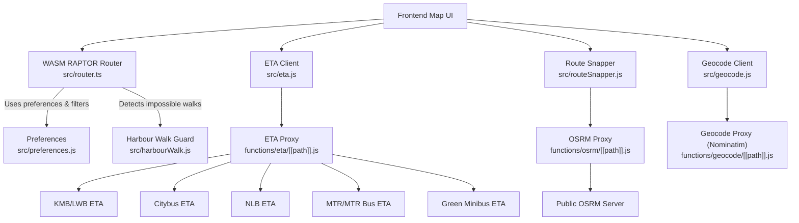
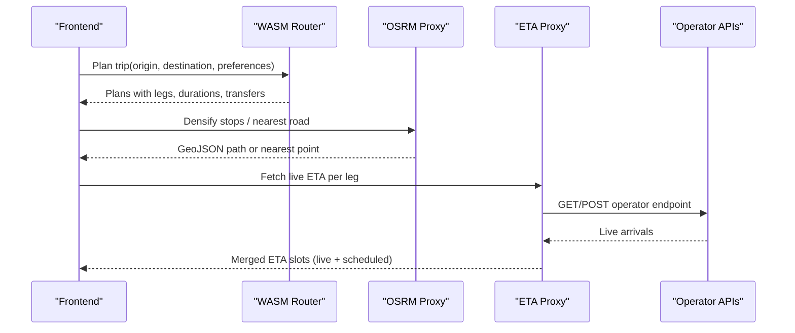
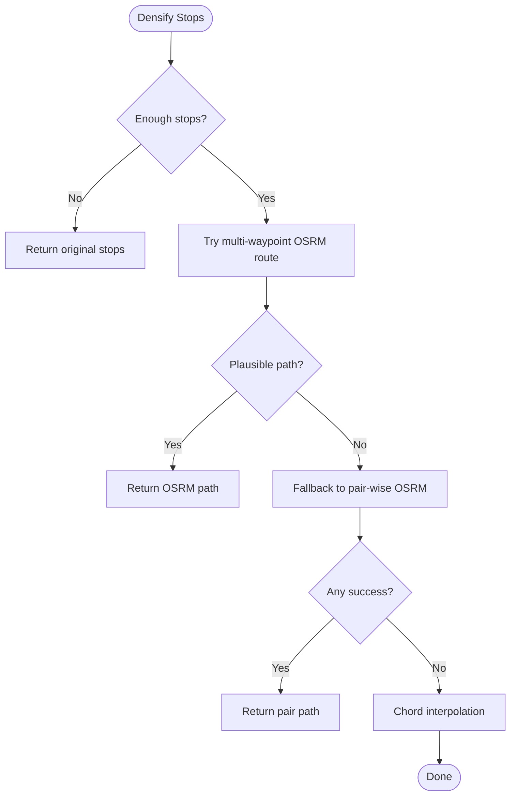
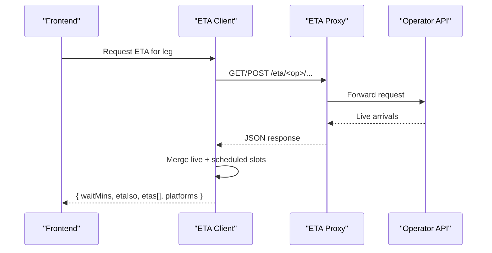
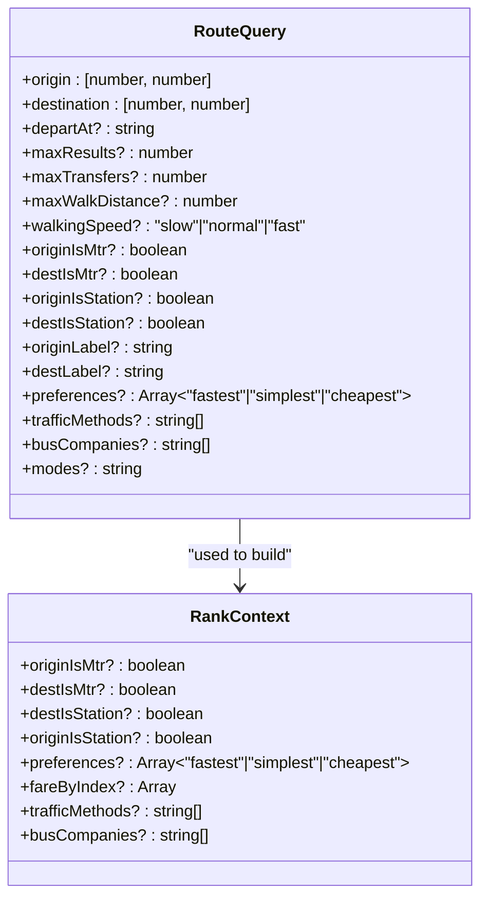
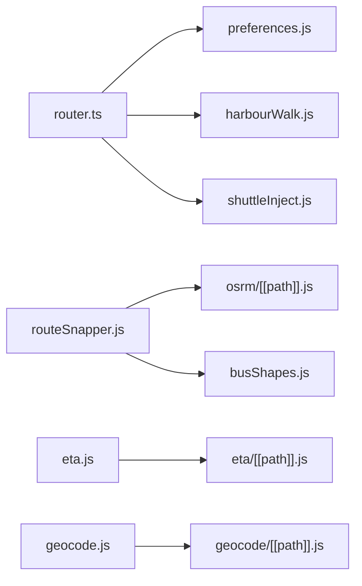

# Routing and Navigation API

<cite>
**Referenced Files in This Document**
- [functions/osrm/[[path]].js](file://functions/osrm/[[path]].js)
- [functions/eta/[[path]].js](file://functions/eta/[[path]].js)
- [src/router.ts](file://src/router.ts)
- [src/eta.js](file://src/eta.js)
- [src/geocode.js](file://src/geocode.js)
- [src/routeSnapper.js](file://src/routeSnapper.js)
- [src/harbourWalk.js](file://src/harbourWalk.js)
- [src/preferences.js](file://src/preferences.js)
- [vite.config.js](file://vite.config.js)
- [package.json](file://package.json)
</cite>

## Table of Contents
1. [Introduction](#introduction)
2. [Project Structure](#project-structure)
3. [Core Components](#core-components)
4. [Architecture Overview](#architecture-overview)
5. [Detailed Component Analysis](#detailed-component-analysis)
6. [Dependency Analysis](#dependency-analysis)
7. [Performance Considerations](#performance-considerations)
8. [Troubleshooting Guide](#troubleshooting-guide)
9. [Conclusion](#conclusion)
10. [Appendices](#appendices)

## Introduction
This document describes the routing and navigation services exposed by MorganTraveler, focusing on:
- OSRM integration for walking and road-based route densification
- ETA calculation endpoints for transit arrival predictions across multiple operators
- Request formats for coordinates, routing preferences, and constraints
- Response schemas including step-like legs, durations, distances, and real-time adjustments
- Rate limiting, caching strategies, and fallback mechanisms when external services are unavailable
- Common routing scenarios and integration patterns with the frontend map interface

The system combines a WASM-based RAPTOR router for multi-modal transit planning with OSRM proxies for street-level geometry and an operator-specific ETA proxy that normalizes live data from Hong Kong open-data sources.

## Project Structure
At a high level:
- Cloudflare Pages Functions expose same-origin proxies for OSRM and ETA APIs to satisfy COEP requirements and simplify CORS handling.
- The browser-side router computes multi-modal plans using a prebuilt graph and applies human-centric ranking rules.
- ETA logic fetches live arrivals via the /eta proxy, merges timetable and live slots, and caches results locally.
- Geocoding integrates local MTR/LRT directories with OpenStreetMap Nominatim through a same-origin proxy.
- Route snapping uses OSRM to densify bus shapes and follow roads where appropriate.

**Diagram sources**
- [functions/osrm/[[path]].js:1-25](file://functions/osrm/[[path]].js#L1-L25)
- [functions/eta/[[path]].js:1-86](file://functions/eta/[[path]].js#L1-L86)
- [src/router.ts:1-120](file://src/router.ts#L1-L120)
- [src/eta.js:1-42](file://src/eta.js#L1-L42)
- [src/geocode.js:1-60](file://src/geocode.js#L1-L60)
- [src/routeSnapper.js:191-227](file://src/routeSnapper.js#L191-L227)
- [src/harbourWalk.js:1-36](file://src/harbourWalk.js#L1-L36)
- [src/preferences.js:1-52](file://src/preferences.js#L1-L52)

**Section sources**
- [functions/osrm/[[path]].js:1-25](file://functions/osrm/[[path]].js#L1-L25)
- [functions/eta/[[path]].js:1-86](file://functions/eta/[[path]].js#L1-L86)
- [src/router.ts:1-120](file://src/router.ts#L1-L120)
- [src/eta.js:1-42](file://src/eta.js#L1-L42)
- [src/geocode.js:1-60](file://src/geocode.js#L1-L60)
- [src/routeSnapper.js:191-227](file://src/routeSnapper.js#L191-L227)
- [src/harbourWalk.js:1-36](file://src/harbourWalk.js#L1-L36)
- [src/preferences.js:1-52](file://src/preferences.js#L1-L52)

## Core Components
- OSRM Proxy: Proxies requests to the public OSRM server with safe headers and short cache times. Used for route densification and nearest-road lookups.
- ETA Proxy: Routes operator-specific paths (/eta/kmb/*, /eta/ctb/*, /eta/nlb/*, /eta/mtr/*, /eta/gmb/*, /eta/mtr-open/*) to their upstream APIs, preserving method and body where needed.
- WASM RAPTOR Router: Computes multi-modal transit plans with human-centric ranking, filtering, and penalties for transfers and long walks.
- ETA Client: Normalizes live and scheduled departures, merges them into consistent slots, and caches responses client-side.
- Geocode Client: Combines local MTR/LRT directories with Nominatim search, biased to Hong Kong and station intent.
- Route Snapper: Densifies stop sequences using OSRM driving routes or map-matching; falls back to chord interpolation when OSRM is unavailable.

**Section sources**
- [functions/osrm/[[path]].js:1-25](file://functions/osrm/[[path]].js#L1-L25)
- [functions/eta/[[path]].js:1-86](file://functions/eta/[[path]].js#L1-L86)
- [src/router.ts:1-120](file://src/router.ts#L1-L120)
- [src/eta.js:1-42](file://src/eta.js#L1-L42)
- [src/geocode.js:1-60](file://src/geocode.js#L1-L60)
- [src/routeSnapper.js:191-227](file://src/routeSnapper.js#L191-L227)

## Architecture Overview
The routing pipeline blends offline transit planning with online geospatial services:
- Transit planning runs in-browser via a WASM engine, producing candidate plans with legs (walk/transit/wait).
- Human ranking adjusts scores based on transfer types, walk distances, and cross-harbour feasibility.
- For visualizing and refining routes, OSRM provides road-following geometry and nearest points.
- ETA calculations pull live arrivals from multiple operators via a unified proxy and merge with timetable-derived slots.

**Diagram sources**
- [src/router.ts:1-120](file://src/router.ts#L1-L120)
- [src/routeSnapper.js:191-227](file://src/routeSnapper.js#L191-L227)
- [functions/osrm/[[path]].js:1-25](file://functions/osrm/[[path]].js#L1-L25)
- [functions/eta/[[path]].js:1-86](file://functions/eta/[[path]].js#L1-L86)

## Detailed Component Analysis

### OSRM Integration and Walking Directions
- Purpose: Provide road-following geometry for bus shapes and walking segments; also used for nearest-point snapping.
- Endpoints proxied: All OSRM paths under /osrm/* are forwarded to the public OSRM server with Accept: application/json and short cache.
- Usage:
  - Multi-waypoint route request for densifying stop sequences.
  - Nearest request to snap user trace points onto the road network.
  - Map-matching to align traces with the driving graph.
- Fallbacks: If OSRM fails or returns implausible detours, the system falls back to straight-line interpolation between stops.

**Diagram sources**
- [src/routeSnapper.js:191-227](file://src/routeSnapper.js#L191-L227)
- [src/routeSnapper.js:1092-1118](file://src/routeSnapper.js#L1092-L1118)
- [functions/osrm/[[path]].js:1-25](file://functions/osrm/[[path]].js#L1-L25)

**Section sources**
- [functions/osrm/[[path]].js:1-25](file://functions/osrm/[[path]].js#L1-L25)
- [src/routeSnapper.js:191-227](file://src/routeSnapper.js#L191-L227)
- [src/routeSnapper.js:1236-1261](file://src/routeSnapper.js#L1236-L1261)
- [src/routeSnapper.js:1092-1118](file://src/routeSnapper.js#L1092-L1118)

### ETA Calculation Endpoints and Real-Time Adjustments
- Unified proxy: /eta/<operator>/<path> forwards to operator APIs with correct methods and bodies.
- Operators supported:
  - KMB/LWB: /eta/kmb/*
  - Citybus: /eta/ctb/*
  - New Lantelink: /eta/nlb/*
  - MTR/MTR Bus: /eta/mtr/*
  - Green Minibus: /eta/gmb/*
  - MTR Open Data: /eta/mtr-open/*
- Caching:
  - GET requests cached for short durations at the edge (e.g., 15 seconds for most, longer for some operators).
  - Non-GET requests are not stored.
- Client-side merging:
  - Live ETA slots are merged with timetable-derived slots to provide up to three upcoming departures.
  - Outside service hours return empty slots with remarks.

**Diagram sources**
- [functions/eta/[[path]].js:1-86](file://functions/eta/[[path]].js#L1-L86)
- [src/eta.js:1-42](file://src/eta.js#L1-L42)
- [src/eta.js:667-689](file://src/eta.js#L667-L689)

**Section sources**
- [functions/eta/[[path]].js:1-86](file://functions/eta/[[path]].js#L1-L86)
- [src/eta.js:1-42](file://src/eta.js#L1-L42)
- [src/eta.js:667-689](file://src/eta.js#L667-L689)

### Transit Routing Preferences and Constraints
- Preferences: fastest, simplest, cheapest (multi-select). Default is fastest.
- Traffic methods: bus, gmb, lrt, mtr, walk, ael. Empty means all allowed.
- Bus companies: kmb_lwb, ctb, nlb, gmb. Empty means all allowed.
- Additional hints: originIsMtr, destIsMtr, originIsStation, destIsStation, modes override string.
- Ranking penalties:
  - Bus-to-bus transfers heavily penalized.
  - MTR interchanges lightly penalized.
  - Mixed transfers penalized moderately.
  - Long outdoor MTR transfers penalized; free interchange links rewarded.
  - Cross-harbour pedestrian walks detected and penalized or dropped.

**Diagram sources**
- [src/router.ts:35-98](file://src/router.ts#L35-L98)

**Section sources**
- [src/router.ts:35-98](file://src/router.ts#L35-L98)
- [src/router.ts:251-299](file://src/router.ts#L251-L299)
- [src/harbourWalk.js:1-36](file://src/harbourWalk.js#L1-L36)

### Distance Calculations and Step Metrics
- Distances are derived from:
  - Leg distance_meters when available.
  - Duration-based estimates for walk legs (duration * speed factor).
  - Haversine distances for stop-to-stop approximations when needed.
- Cumulative distances can be computed from route geometries returned by OSRM.
- For transit ride durations, typical average speeds and dwell times are used to estimate ride seconds when only stop lists are available.

**Section sources**
- [src/router.ts:603-615](file://src/router.ts#L603-L615)
- [src/routeSnapper.js:1263-1271](file://src/routeSnapper.js#L1263-L1271)
- [src/main.js:11141-11175](file://src/main.js#L11141-L11175)

### Alternative Route Suggestions and Service Disruption Impact
- Alternative suggestions arise from:
  - Multiple candidate plans produced by the WASM router.
  - Operator-specific ETA availability; if live data is missing, timetable-based slots fill gaps.
  - Mode filtering and company filtering to surface alternatives aligned with user preferences.
- Disruption impact:
  - If live ETA is unavailable, the system falls back to headway-based scheduled slots within typical service windows.
  - Outside service hours produce empty ETA sets with remarks indicating outside service.

**Section sources**
- [src/eta.js:243-289](file://src/eta.js#L243-L289)
- [src/eta.js:516-568](file://src/eta.js#L516-L568)
- [src/eta.js:667-689](file://src/eta.js#L667-L689)

### Coordinate Formats and Request Parameters
- Coordinates:
  - Origin and destination are provided as [lat, lon] pairs.
  - OSRM expects longitude-first coordinates in URLs.
- Routing preferences:
  - preferences array supports fastest, simplest, cheapest.
  - trafficMethods and busCompanies constrain which modes and operators appear.
- Time parameters:
  - departAt accepts ISO 8601 UTC strings.
  - Service day and departure time are persisted in preferences for scheduling.

**Section sources**
- [src/router.ts:35-75](file://src/router.ts#L35-L75)
- [src/preferences.js:1-52](file://src/preferences.js#L1-L52)
- [src/geocode.js:42-52](file://src/geocode.js#L42-L52)

### Response Schemas
- Plans include:
  - duration_seconds (and min/max ranges when applicable).
  - start_time (ISO).
  - legs array with type (walk/transit/wait), durations, distances, and optional paths.
  - Transfer counts and mode breakdowns for ranking.
- ETA responses include:
  - operator, route, stopId.
  - etas[] with waitMins, etaIso, clock, platform, and remark.
  - waitMins and etaIso for the first slot.
  - servingPlatforms and multiPlatform flags.

**Section sources**
- [src/router.ts:121-177](file://src/router.ts#L121-L177)
- [src/eta.js:180-206](file://src/eta.js#L180-L206)
- [src/eta.js:667-689](file://src/eta.js#L667-L689)

### Rate Limiting, Caching Strategies, and Fallback Mechanisms
- Edge caching:
  - OSRM proxy sets Cache-Control: public, max-age=3600 for responses.
  - ETA proxy sets short TTLs for GET requests (e.g., 15 seconds) and no-store for non-GET.
  - Overrides proxy uses short CDN cache with stale-while-revalidate.
- Client-side caching:
  - ETA client caches responses in memory with a TTL (e.g., 25 seconds).
- Fallbacks:
  - OSRM failures fall back to chord interpolation or pair-wise requests.
  - ETA live data unavailability falls back to headway-based scheduled slots.
  - Graph loading tries multiple candidates (local, configured URL, default remote, gzipped variant).

**Section sources**
- [functions/osrm/[[path]].js:11-23](file://functions/osrm/[[path]].js#L11-L23)
- [functions/eta/[[path]].js:58-84](file://functions/eta/[[path]].js#L58-L84)
- [src/eta.js:19-42](file://src/eta.js#L19-L42)
- [src/router.ts:207-249](file://src/router.ts#L207-L249)
- [functions/api/overrides/[[path]].js:61-103](file://functions/api/overrides/[[path]].js#L61-L103)

### Frontend Integration Patterns
- MapLibre displays:
  - Transit plan legs with colors and icons based on mode.
  - OSRM-densified paths for bus shapes and walking segments.
  - Platform labels and multi-platform indicators from ETA responses.
- Interaction:
  - Users select origins/destinations via geocode search with mode filters (@mtr, @lrt, @bus).
  - Preferences panel toggles ranking goals and transport modes.
  - ETA cards show next departures with live vs scheduled distinction.

**Section sources**
- [src/geocode.js:194-496](file://src/geocode.js#L194-L496)
- [src/routeSnapper.js:1188-1232](file://src/routeSnapper.js#L1188-L1232)
- [src/eta.js:667-689](file://src/eta.js#L667-L689)

## Dependency Analysis
Key dependencies and relationships:
- Router depends on preferences, harbour walk detection, and shuttle injection utilities.
- Route snapper depends on OSRM proxy and local shape overrides.
- ETA client depends on operator-specific normalization and merging logic.
- Geocode client depends on local MTR/LRT directories and Nominatim proxy.

**Diagram sources**
- [src/router.ts:1-34](file://src/router.ts#L1-L34)
- [src/routeSnapper.js:1188-1232](file://src/routeSnapper.js#L1188-L1232)
- [src/eta.js:1-42](file://src/eta.js#L1-L42)
- [src/geocode.js:1-60](file://src/geocode.js#L1-L60)

**Section sources**
- [src/router.ts:1-34](file://src/router.ts#L1-L34)
- [src/routeSnapper.js:1188-1232](file://src/routeSnapper.js#L1188-L1232)
- [src/eta.js:1-42](file://src/eta.js#L1-L42)
- [src/geocode.js:1-60](file://src/geocode.js#L1-L60)

## Performance Considerations
- Use multi-waypoint OSRM requests judiciously; cap waypoints to avoid latency and URL length issues.
- Prefer local shape overrides when available to reduce OSRM calls.
- Cache ETA responses client-side with short TTLs to reduce upstream load.
- Apply mode and company filters early to reduce plan space and downstream processing.
- Avoid unnecessary reverse geocode calls; reuse known station coordinates from local directories.

[No sources needed since this section provides general guidance]

## Troubleshooting Guide
Common issues and resolutions:
- OSRM errors:
  - Symptom: Route densification fails or returns implausible paths.
  - Resolution: Fall back to pair-wise requests or chord interpolation; check network and proxy configuration.
- ETA upstream failures:
  - Symptom: No live arrivals; ETA shows outside service or empty slots.
  - Resolution: Rely on headway-based scheduled slots; verify operator endpoints via the /eta proxy.
- Geocode search returns bus facilities instead of stations:
  - Symptom: Station intent queries rank bus stops too high.
  - Resolution: Use @mtr filter or ensure query includes “station”; rely on local MTR directory boosts.
- CORS or COEP issues:
  - Symptom: Browser blocks cross-origin requests.
  - Resolution: Ensure same-origin proxies are active; verify headers set by functions and dev proxy.

**Section sources**
- [src/routeSnapper.js:191-227](file://src/routeSnapper.js#L191-L227)
- [src/eta.js:243-289](file://src/eta.js#L243-L289)
- [src/geocode.js:194-496](file://src/geocode.js#L194-L496)
- [vite.config.js:871-905](file://vite.config.js#L871-L905)

## Conclusion
MorganTraveler’s routing and navigation stack combines robust offline transit planning with flexible online geospatial services. The OSRM proxy enables accurate street-level geometry, while the ETA proxy unifies live arrival data across operators. Preference-driven routing and strong fallbacks ensure reliable performance even when external services are constrained or unavailable. Integrating these APIs with the frontend map interface yields turn-by-turn directions, real-time arrival predictions, and alternative route suggestions tailored to user preferences.

[No sources needed since this section summarizes without analyzing specific files]

## Appendices

### API Endpoints Summary
- OSRM Proxy:
  - Path: /osrm/*
  - Method: GET (forwarded)
  - Headers: Accept: application/json
  - Cache: public, max-age=3600
- ETA Proxy:
  - Paths: /eta/kmb/*, /eta/ctb/*, /eta/nlb/*, /eta/mtr/*, /eta/gmb/*, /eta/mtr-open/*
  - Methods: GET, POST (where required), OPTIONS
  - Cache: Short TTL for GET; no-store for non-GET
- Geocode Proxy:
  - Path: /geocode/search, /geocode/reverse
  - Method: GET
  - Bias: Hong Kong viewbox; local MTR/LRT directory prioritization

**Section sources**
- [functions/osrm/[[path]].js:1-25](file://functions/osrm/[[path]].js#L1-L25)
- [functions/eta/[[path]].js:1-86](file://functions/eta/[[path]].js#L1-L86)
- [src/geocode.js:194-521](file://src/geocode.js#L194-L521)

### Example Scenarios
- Walking direction with OSRM densification:
  - Input: Origin and destination coordinates.
  - Process: Generate plan legs; use OSRM to densify walk segments; display path on map.
  - Output: Legs with durations, distances, and GeoJSON path.
- Transit ETA with live updates:
  - Input: Leg with route and stop info.
  - Process: Fetch live ETA via /eta proxy; merge with scheduled slots; show next departures.
  - Output: ETA slots with wait minutes, ISO timestamps, and platform labels.
- Alternative route suggestion:
  - Input: Preferences (fastest/simplest/cheapest) and mode filters.
  - Process: Run WASM planner with constraints; rank plans; present top options.
  - Output: Multiple plans with breakdowns and transfer counts.

[No sources needed since this section provides conceptual examples]