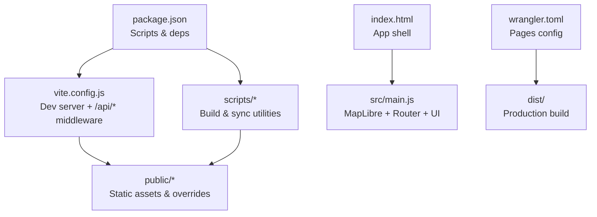
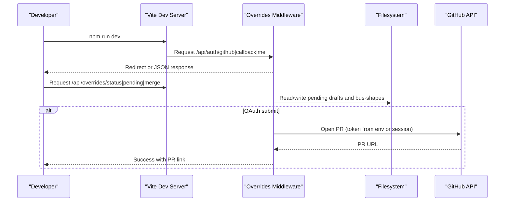
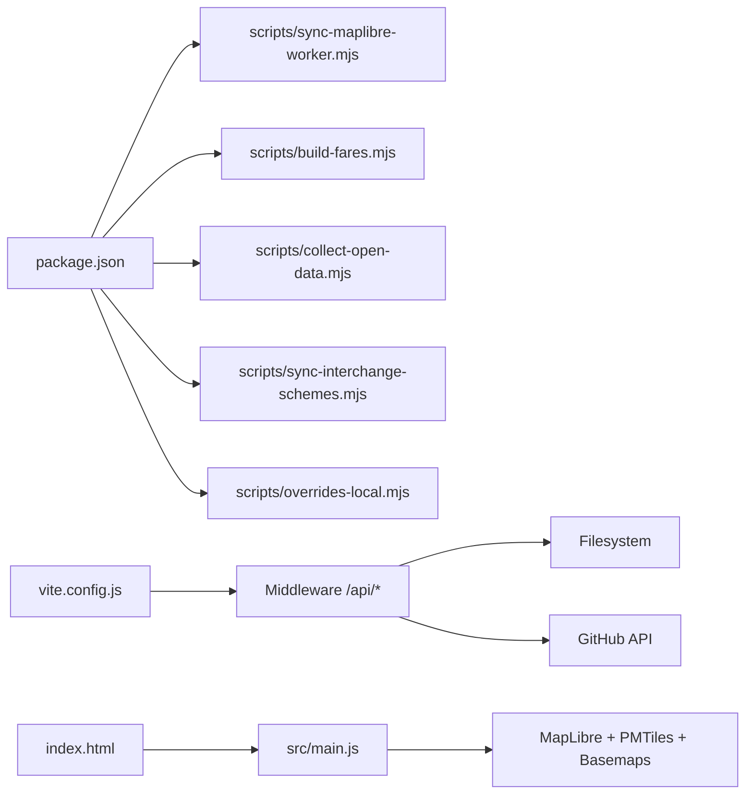

# Getting Started

<cite>
**Referenced Files in This Document**
- [package.json](file://package.json)
- [vite.config.js](file://vite.config.js)
- [wrangler.toml](file://wrangler.toml)
- [.env.example](file://.env.example)
- [index.html](file://index.html)
- [src/main.js](file://src/main.js)
- [scripts/sync-maplibre-worker.mjs](file://scripts/sync-maplibre-worker.mjs)
- [scripts/build-fares.mjs](file://scripts/build-fares.mjs)
- [scripts/collect-open-data.mjs](file://scripts/collect-open-data.mjs)
- [scripts/sync-interchange-schemes.mjs](file://scripts/sync-interchange-schemes.mjs)
- [scripts/overrides-local.mjs](file://scripts/overrides-local.mjs)
- [docs/local-overrides.md](file://docs/local-overrides.md)
</cite>

## Table of Contents
1. [Introduction](#introduction)
2. [Project Structure](#project-structure)
3. [Core Components](#core-components)
4. [Architecture Overview](#architecture-overview)
5. [Detailed Component Analysis](#detailed-component-analysis)
6. [Dependency Analysis](#dependency-analysis)
7. [Performance Considerations](#performance-considerations)
8. [Troubleshooting Guide](#troubleshooting-guide)
9. [Conclusion](#conclusion)
10. [Appendices](#appendices)

## Introduction
This guide helps you set up and run MorganTraveler locally, build production assets with Vite, and deploy to Cloudflare Pages. It covers Node.js requirements, dependency installation, environment configuration (API keys and secrets), data synchronization scripts, the local override system for route contributions, and step-by-step commands to start the development server, preview builds, and verify your setup.

## Project Structure
MorganTraveler is a MapLibre-based transit PWA built with Vite. The project includes:
- A Vite dev server that also serves a local overrides API during development
- Scripts to sync MapLibre worker files, build fare tables, collect open data, and synchronize interchange schemes
- Cloudflare Pages configuration for deployment
- An HTML shell and application entry point that initializes the map, router, and UI

**Diagram sources**
- [package.json:7-25](file://package.json#L7-L25)
- [vite.config.js:773-800](file://vite.config.js#L773-L800)
- [scripts/sync-maplibre-worker.mjs:1-28](file://scripts/sync-maplibre-worker.mjs#L1-L28)
- [scripts/build-fares.mjs:1-22](file://scripts/build-fares.mjs#L1-L22)
- [index.html:1-71](file://index.html#L1-L71)
- [src/main.js:180-200](file://src/main.js#L180-L200)
- [wrangler.toml:1-38](file://wrangler.toml#L1-L38)

**Section sources**
- [package.json:1-37](file://package.json#L1-L37)
- [vite.config.js:773-800](file://vite.config.js#L773-L800)
- [index.html:1-71](file://index.html#L1-L71)
- [wrangler.toml:1-38](file://wrangler.toml#L1-L38)

## Core Components
- Development server and middleware: Vite runs on port 5173 and injects cross-origin isolation headers plus a local overrides API for authentication and contribution workflows.
- Build pipeline: Prebuild hooks copy MapLibre worker files and build fare tables; the main build compiles assets via Vite.
- Data scripts: Utilities to collect open data, build fares, and refresh interchange scheme indexes.
- Deployment: Cloudflare Pages configuration defines output directory and runtime variables/secrets.

Key responsibilities:
- package.json: Defines scripts for dev, build, preview, and data tasks.
- vite.config.js: Adds COOP/COEP headers, proxies edge assets, and implements /api/auth and /api/overrides endpoints in dev.
- index.html: Provides the app shell and metadata for PWA behavior.
- src/main.js: Initializes MapLibre, sets worker URLs, loads static overrides, and boots routing/UI modules.
- wrangler.toml: Declares Pages build output and non-secret vars; secrets are managed in the dashboard.

**Section sources**
- [package.json:7-25](file://package.json#L7-L25)
- [vite.config.js:111-132](file://vite.config.js#L111-L132)
- [vite.config.js:773-800](file://vite.config.js#L773-L800)
- [index.html:1-71](file://index.html#L1-L71)
- [src/main.js:180-200](file://src/main.js#L180-L200)
- [wrangler.toml:1-38](file://wrangler.toml#L1-L38)

## Architecture Overview
The development workflow uses Vite as both bundler and dev server. During dev, custom middleware intercepts specific routes to provide GitHub OAuth flows and local overrides management. Production builds are generated by Vite and deployed to Cloudflare Pages using the configured output directory.

**Diagram sources**
- [vite.config.js:159-310](file://vite.config.js#L159-L310)
- [vite.config.js:325-736](file://vite.config.js#L325-L736)
- [package.json:7-25](file://package.json#L7-L25)

## Detailed Component Analysis

### Environment Setup and Secrets
- Local environment file: Create .env.development (or .env) based on .env.example to configure:
  - Overrides repo path and branch
  - Bot token for PR automation
  - GitHub OAuth App credentials and optional redirect URI
- Production secrets: Configure in Cloudflare Pages Dashboard under Secrets. Non-secret variables can be set in wrangler.toml [vars].

Recommended steps:
- Copy .env.example to .env.development and fill required values for local testing.
- For production, add secrets via the Cloudflare dashboard or Wrangler CLI.

**Section sources**
- [.env.example:1-40](file://.env.example#L1-L40)
- [wrangler.toml:11-27](file://wrangler.toml#L11-L27)

### Installation and Dependencies
Requirements:
- Node.js (ESM support)
- npm (for scripts and dependencies)

Install dependencies:
- Run the install command to fetch dependencies and trigger postinstall tasks that prepare MapLibre worker files.

Prebuild tasks:
- Before dev and build, the project runs predev/prebuild hooks to sync MapLibre workers and build fare tables.

**Section sources**
- [package.json:7-13](file://package.json#L7-L13)
- [scripts/sync-maplibre-worker.mjs:1-28](file://scripts/sync-maplibre-worker.mjs#L1-L28)
- [scripts/build-fares.mjs:1-22](file://scripts/build-fares.mjs#L1-L22)

### Running the Development Server
Start the dev server:
- Use the provided script to launch Vite with hot reloading and local overrides APIs enabled.

What happens:
- Vite serves the app at the configured port and injects cross-origin isolation headers.
- The middleware provides /api/auth and /api/overrides endpoints for local contribution workflows.

Previewing the build:
- After building, use the preview script to serve the production bundle locally.

**Section sources**
- [package.json:7-25](file://package.json#L7-L25)
- [vite.config.js:773-800](file://vite.config.js#L773-L800)

### Building Production Assets
Build command:
- Use the build script to generate optimized assets into the dist directory.

Prebuild steps:
- The prebuild hook ensures MapLibre worker files are copied and fare tables are built before compilation.

Output:
- The dist folder contains the production-ready assets ready for deployment.

**Section sources**
- [package.json:7-13](file://package.json#L7-L13)
- [scripts/sync-maplibre-worker.mjs:1-28](file://scripts/sync-maplibre-worker.mjs#L1-L28)
- [scripts/build-fares.mjs:1-22](file://scripts/build-fares.mjs#L1-L22)

### Data Synchronization Scripts
Collect open data:
- Download MTR fares, TD datasets, and edge assets to artifacts/open-data for offline or CI usage.

Build fares:
- Aggregates official and open fare tables into a client-friendly JSON used by the app for fare estimates.

Interchange schemes:
- Refreshes interchange scheme indexes from Citybus and KMB/LWB sources into src/data/interchange-schemes.json and artifacts.

Usage:
- Execute the corresponding npm scripts to run each task.

**Section sources**
- [scripts/collect-open-data.mjs:1-200](file://scripts/collect-open-data.mjs#L1-L200)
- [scripts/build-fares.mjs:1-22](file://scripts/build-fares.mjs#L1-L22)
- [scripts/sync-interchange-schemes.mjs:1-200](file://scripts/sync-interchange-schemes.mjs#L1-L200)
- [package.json:7-25](file://package.json#L7-L25)

### Local Override System (Contributions Workflow)
Overview:
- In development, the app exposes /api/overrides endpoints to manage route shape contributions locally without requiring GitHub tokens.
- You can submit paths, review pending drafts, merge them into published shapes, and reload public assets.

Key endpoints:
- GET /api/overrides/status: Shows mode, repo path, published routes, and pending files.
- GET /api/overrides/bus-shapes.json: Serves published shapes (from sibling repo or fallback).
- GET /api/overrides/pending: Lists pending draft files.
- POST /api/contribute-path: Saves a draft and optionally opens a PR if configured.
- POST /api/overrides/merge: Merges a pending draft into bus-shapes.json and mirrors to public/overrides.
- POST /api/overrides/reload-public: Copies current shapes to public/overrides for immediate use.

CLI helpers:
- Use npm run overrides:status, overrides:pending, and overrides:merge to inspect and merge drafts without starting the dev server.

Environment:
- OVERRIDES_REPO_PATH points to a sibling overrides repository; otherwise, drafts go to artifacts/contributions/pending.
- Optional VITE_OVERRIDES_BUS_SHAPES_URL forces fetching from GitHub raw instead of the local API.

**Section sources**
- [vite.config.js:111-132](file://vite.config.js#L111-L132)
- [vite.config.js:325-736](file://vite.config.js#L325-L736)
- [scripts/overrides-local.mjs:1-131](file://scripts/overrides-local.mjs#L1-L131)
- [docs/local-overrides.md:1-182](file://docs/local-overrides.md#L1-L182)
- [.env.example:1-40](file://.env.example#L1-L40)

### GitHub OAuth and Authentication Flow (Development)
Flow:
- Start OAuth via /api/auth/github, which redirects to GitHub’s authorization page.
- Callback at /api/auth/callback exchanges the code for an access token and sets a session cookie.
- /api/auth/me returns current session info and whether OAuth is configured.
- /api/auth/logout clears the session.

Configuration:
- Provide GITHUB_OAUTH_CLIENT_ID and GITHUB_OAUTH_CLIENT_SECRET in .env.development.
- Optionally set GITHUB_OAUTH_REDIRECT_URI to match your origin.

Notes:
- Without OAuth configured, auth endpoints return informative errors.
- Contributions submitted via OAuth require a logged-in session; bot mode requires a bot token.

**Section sources**
- [vite.config.js:159-310](file://vite.config.js#L159-L310)
- [.env.example:1-40](file://.env.example#L1-L40)

### MapLibre Worker and Cross-Origin Isolation
Worker setup:
- The app pins MapLibre worker URLs to public/maplibre/* to avoid Vite prebundle rewriting issues.
- A preinstall/predev/prebuild hook copies worker files into public/maplibre.

Cross-origin isolation:
- Dev server sets COOP/COEP/CORP headers to enable WASM and SharedArrayBuffer features.
- Edge assets are proxied with appropriate CORS headers in development.

Verification:
- Check console logs for worker URL and crossOriginIsolated status after loading the app.

**Section sources**
- [src/main.js:180-200](file://src/main.js#L180-L200)
- [scripts/sync-maplibre-worker.mjs:1-28](file://scripts/sync-maplibre-worker.mjs#L1-L28)
- [vite.config.js:111-132](file://vite.config.js#L111-L132)
- [vite.config.js:773-800](file://vite.config.js#L773-L800)

## Dependency Analysis
High-level relationships:
- package.json scripts orchestrate lifecycle hooks that call scripts/*.mjs utilities.
- vite.config.js integrates middleware that depends on shared GitHub utilities and filesystem operations.
- src/main.js consumes MapLibre and other libraries, relying on prebuilt assets and environment configuration.

**Diagram sources**
- [package.json:7-25](file://package.json#L7-L25)
- [vite.config.js:159-736](file://vite.config.js#L159-L736)
- [index.html:1-71](file://index.html#L1-L71)
- [src/main.js:1-20](file://src/main.js#L1-L20)

**Section sources**
- [package.json:7-25](file://package.json#L7-L25)
- [vite.config.js:159-736](file://vite.config.js#L159-L736)

## Performance Considerations
- Ensure MapLibre worker files are present in public/maplibre to avoid blank maps due to missing resources.
- Use the dev server’s proxy for edge assets to avoid CORS issues during development.
- When building fares, ensure mdbtools is installed if you need TD bus section fares; otherwise, the script will skip that source gracefully.
- Large data downloads can be skipped in collection scripts via environment flags to speed up local runs.

[No sources needed since this section provides general guidance]

## Troubleshooting Guide
Common issues and resolutions:
- Blank map or missing worker:
  - Verify that MapLibre worker files exist in public/maplibre. Re-run install or predev hooks to copy them.
- CORS or COEP errors:
  - Confirm dev server headers include COOP/COEP/CORP. Check browser console for crossOriginIsolated status.
- OAuth not working:
  - Ensure GITHUB_OAUTH_CLIENT_ID and GITHUB_OAUTH_CLIENT_SECRET are set in .env.development.
  - Verify callback URL matches your origin and is configured in the GitHub OAuth App settings.
- Contributions not merging:
  - Use npm run overrides:status to check paths and pending files.
  - Merge pending drafts via npm run overrides:merge or the local review page linked in submission results.
- Fares not updating:
  - Re-run build-fares to regenerate public/fares/hk-fares.json from open data sources.

Verification steps:
- Start dev server and open the app in the browser.
- Check console for worker URL and crossOriginIsolated status.
- Call /api/overrides/status to confirm local mode and pending files.
- Submit a test contribution and verify it appears in pending and can be merged.

**Section sources**
- [scripts/sync-maplibre-worker.mjs:1-28](file://scripts/sync-maplibre-worker.mjs#L1-L28)
- [vite.config.js:111-132](file://vite.config.js#L111-L132)
- [vite.config.js:159-310](file://vite.config.js#L159-L310)
- [scripts/overrides-local.mjs:1-131](file://scripts/overrides-local.mjs#L1-L131)
- [scripts/build-fares.mjs:1-22](file://scripts/build-fares.mjs#L1-L22)
- [docs/local-overrides.md:1-182](file://docs/local-overrides.md#L1-L182)

## Conclusion
You now have the essentials to set up MorganTraveler locally, run the development server with hot reloading, build production assets, and deploy to Cloudflare Pages. Use the provided scripts to manage data and contributions, configure environment variables and secrets appropriately, and follow the troubleshooting tips to resolve common setup issues.

[No sources needed since this section summarizes without analyzing specific files]

## Appendices

### Quick Commands Reference
- Install dependencies and prepare workers/fares:
  - npm install
- Start development server:
  - npm run dev
- Build production assets:
  - npm run build
- Preview production build:
  - npm run preview
- Collect open data:
  - npm run collect:open-data
- Build fare tables:
  - npm run build:fares
- Sync interchange schemes:
  - npm run schemes:sync
- Manage local overrides:
  - npm run overrides:status
  - npm run overrides:pending
  - npm run overrides:merge -- pending/<id>.json

**Section sources**
- [package.json:7-25](file://package.json#L7-L25)
- [docs/local-overrides.md:1-182](file://docs/local-overrides.md#L1-L182)

### Environment Variables Summary
- Local development:
  - OVERRIDES_REPO_PATH: Absolute path to overrides repo (optional)
  - VITE_OVERRIDES_BUS_SHAPES_URL: Force fetch URL for bus shapes (optional)
  - OVERRIDES_GITHUB_TOKEN: Bot PAT for PR automation (optional)
  - OVERRIDES_REPO: Target overrides repo (default provided)
  - OVERRIDES_BASE_BRANCH: Base branch for PRs (default provided)
  - GITHUB_OAUTH_CLIENT_ID / GITHUB_OAUTH_CLIENT_SECRET: OAuth App credentials
  - GITHUB_OAUTH_REDIRECT_URI: Optional explicit callback URL
- Production (Cloudflare Pages):
  - Set secrets in Dashboard: OVERRIDES_GITHUB_TOKEN, GITHUB_OAUTH_CLIENT_SECRET, GITHUB_OAUTH_CLIENT_ID, GITHUB_OAUTH_REDIRECT_URI
  - Non-secret vars in wrangler.toml [vars]: OVERRIDES_REPO, OVERRIDES_BASE_BRANCH

**Section sources**
- [.env.example:1-40](file://.env.example#L1-L40)
- [wrangler.toml:11-27](file://wrangler.toml#L11-L27)