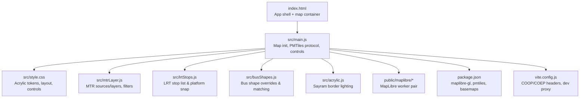
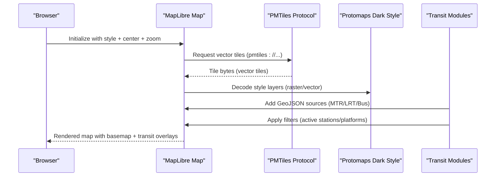
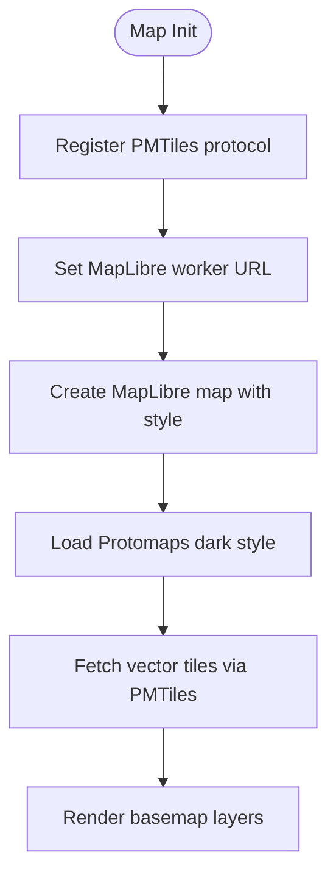
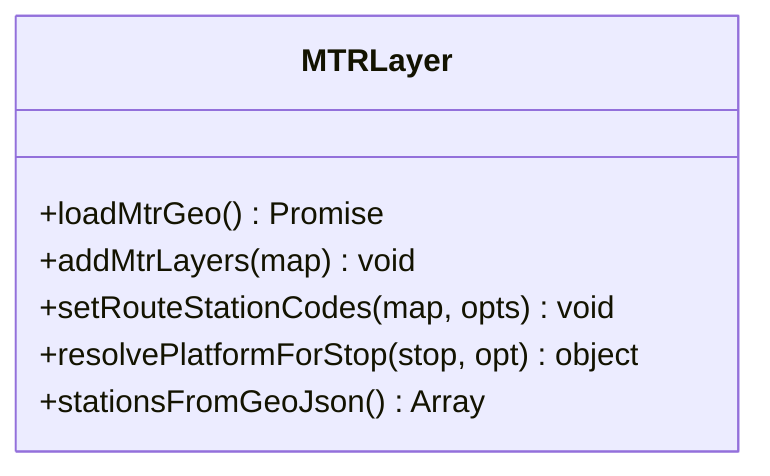
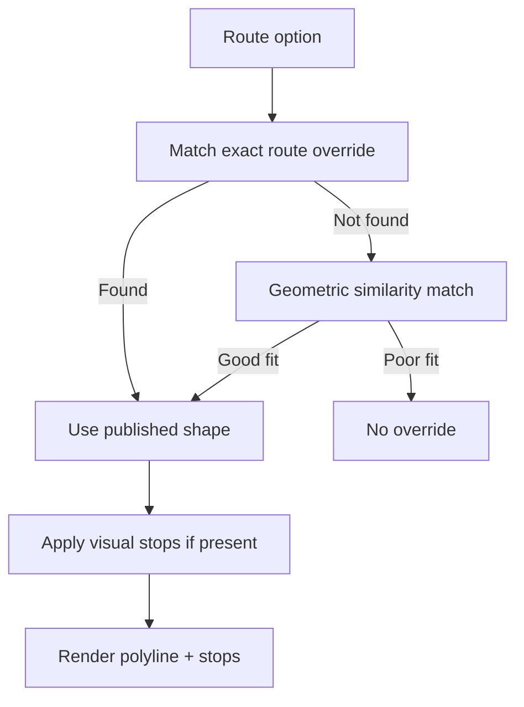
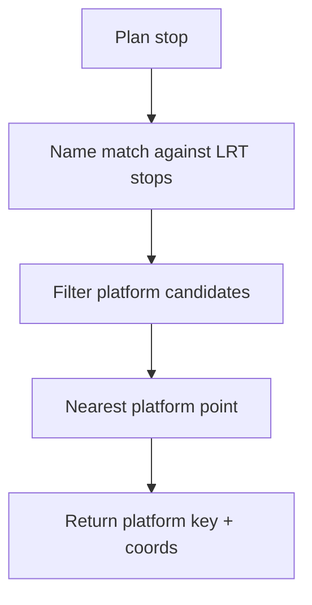
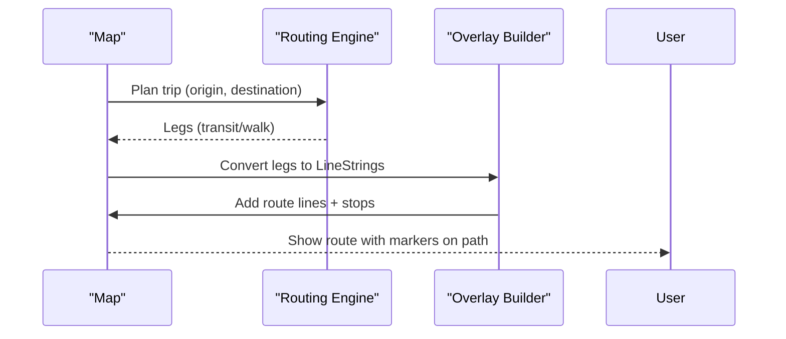
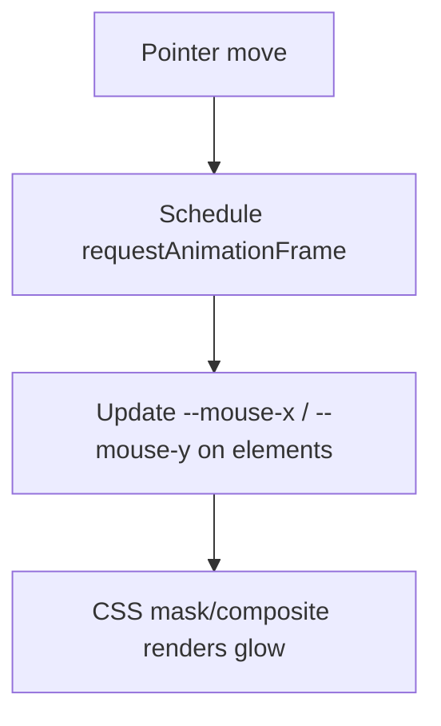
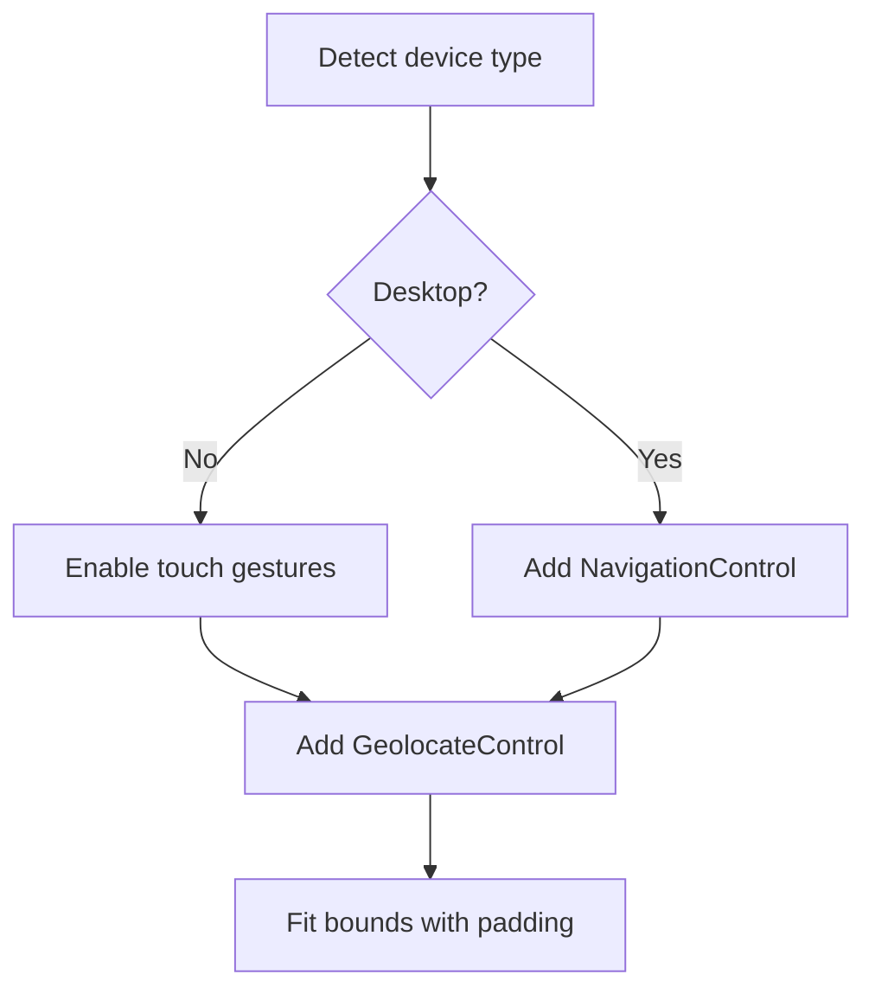
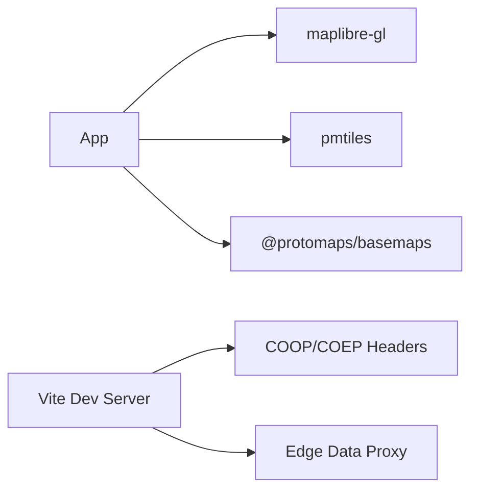

# Map and Visualization

<cite>
**Referenced Files in This Document**
- [main.js](file://src/main.js)
- [style.css](file://src/style.css)
- [index.html](file://index.html)
- [package.json](file://package.json)
- [vite.config.js](file://vite.config.js)
- [mtrLayer.js](file://src/mtrLayer.js)
- [acrylic.js](file://src/acrylic.js)
- [busShapes.js](file://src/busShapes.js)
- [lrtStops.js](file://src/lrtStops.js)
- [maplibre-gl-worker.mjs](file://public/maplibre/maplibre-gl-worker.mjs)
- [maplibre-gl-shared.mjs](file://public/maplibre/maplibre-gl-shared.mjs)
</cite>

## Table of Contents
1. [Introduction](#introduction)
2. [Project Structure](#project-structure)
3. [Core Components](#core-components)
4. [Architecture Overview](#architecture-overview)
5. [Detailed Component Analysis](#detailed-component-analysis)
6. [Dependency Analysis](#dependency-analysis)
7. [Performance Considerations](#performance-considerations)
8. [Troubleshooting Guide](#troubleshooting-guide)
9. [Conclusion](#conclusion)

## Introduction
This document explains MorganTraveler’s map and visualization system with a focus on MapLibre GL integration, PMTiles-based vector tile delivery, transit-specific rendering (MTR stations, bus route shapes, Light Rail platforms), interactive overlays, acrylic glass UI effects, responsive design, custom interactions, zoom controls, touch gestures, styling via CSS custom properties, basemap provider integration, and performance techniques for rendering thousands of stops and routes smoothly.

## Project Structure
The mapping stack is centered around:
- A MapLibre GL map instance configured with a PMTiles source for Protomaps dark basemap tiles.
- Transit overlay modules that add MTR station/exits/platforms, LRT platform snapping, and bus shape overlays.
- A modern acrylic UI layer using CSS custom properties and cursor-driven lighting.
- Build-time helpers to ensure the MapLibre worker resolves correctly under Vite.

**Diagram sources**
- [index.html:76-106](file://index.html#L76-L106)
- [main.js:1997-2024](file://src/main.js#L1997-L2024)
- [mtrLayer.js:28-67](file://src/mtrLayer.js#L28-L67)
- [lrtStops.js:12-81](file://src/lrtStops.js#L12-L81)
- [busShapes.js:77-95](file://src/busShapes.js#L77-L95)
- [acrylic.js:6-85](file://src/acrylic.js#L6-L85)
- [package.json:27-31](file://package.json#L27-L31)
- [vite.config.js:111-132](file://vite.config.js#L111-L132)

**Section sources**
- [index.html:76-106](file://index.html#L76-L106)
- [package.json:27-31](file://package.json#L27-L31)

## Core Components
- Map initialization and basemap: The app creates a MapLibre GL map with a PMTiles URL pointing to a Protomaps dark style, enabling efficient vector tile streaming for large geographic datasets.
- Transit layers: Dedicated modules add GeoJSON sources and layers for MTR exits and platforms, LRT platform snapping, and bus route shapes from contributor-reviewed overrides.
- Interactions and controls: Navigation control (desktop), geolocation, scale control, and responsive behavior tailored for mobile touch gestures.
- Acrylic UI: Cursor-driven glass morphism effect applied to panels and cards, with mobile-safe toggling.
- Styling: Centralized CSS custom properties define colors, radii, glass effects, and safe-area handling for edge-to-edge layouts.

**Section sources**
- [main.js:1997-2024](file://src/main.js#L1997-L2024)
- [mtrLayer.js:28-67](file://src/mtrLayer.js#L28-L67)
- [lrtStops.js:12-81](file://src/lrtStops.js#L12-L81)
- [busShapes.js:77-95](file://src/busShapes.js#L77-L95)
- [acrylic.js:6-85](file://src/acrylic.js#L6-L85)
- [style.css:6-64](file://src/style.css#L6-L64)

## Architecture Overview
The rendering pipeline uses PMTiles to stream vector tiles from a single file, which MapLibre decodes into features per tile. Transit data is layered on top as GeoJSON sources with dynamic filters to show only relevant stations/platforms based on the active itinerary. Bus shapes are matched by operator/route and geometry similarity, then rendered as polylines with visual stop overrides.

**Diagram sources**
- [main.js:1997-2024](file://src/main.js#L1997-L2024)
- [mtrLayer.js:28-67](file://src/mtrLayer.js#L28-L67)
- [busShapes.js:77-95](file://src/busShapes.js#L77-L95)

## Detailed Component Analysis

### Vector Tiles and Basemap Integration
- PMTiles protocol is registered and used to serve a Protomaps dark basemap via a PMTiles URL.
- The map style references font glyphs and sprite assets from Protomaps CDN.
- Worker module path is pinned to public/maplibre to avoid Vite prebundle issues.

**Diagram sources**
- [main.js:1997-2024](file://src/main.js#L1997-L2024)
- [maplibre-gl-worker.mjs:1-6](file://public/maplibre/maplibre-gl-worker.mjs#L1-L6)
- [maplibre-gl-shared.mjs:1-6](file://public/maplibre/maplibre-gl-shared.mjs#L1-L6)

**Section sources**
- [main.js:1997-2024](file://src/main.js#L1997-L2024)
- [package.json:27-31](file://package.json#L27-L31)

### MTR Station Visualization and Layer Management
- Loads MTR stations, exits, and platforms GeoJSON; adds sources and layers hidden until an itinerary sets active codes.
- Filters dynamically show only exits and platforms relevant to the selected route/station codes.
- Platform resolution logic prefers explicit platform refs, line hints, or nearest match; supports LRT fallback when heavy rail data is missing.

**Diagram sources**
- [mtrLayer.js:28-67](file://src/mtrLayer.js#L28-L67)
- [mtrLayer.js:178-219](file://src/mtrLayer.js#L178-L219)
- [mtrLayer.js:229-330](file://src/mtrLayer.js#L229-L330)

**Section sources**
- [mtrLayer.js:28-67](file://src/mtrLayer.js#L28-L67)
- [mtrLayer.js:178-219](file://src/mtrLayer.js#L178-L219)
- [mtrLayer.js:229-330](file://src/mtrLayer.js#L229-L330)

### Bus Route Shapes and Visual Stops
- Published bus shape overrides are loaded and matched against route options using scoring (route number, agency, OD names, direction).
- If no exact match, geometric similarity matching finds another published path covering the same corridor.
- Visual stops can be overridden to improve display without changing official GTFS identity.

**Diagram sources**
- [busShapes.js:77-95](file://src/busShapes.js#L77-L95)
- [busShapes.js:232-295](file://src/busShapes.js#L232-L295)
- [busShapes.js:619-639](file://src/busShapes.js#L619-L639)
- [busShapes.js:725-768](file://src/busShapes.js#L725-L768)

**Section sources**
- [busShapes.js:77-95](file://src/busShapes.js#L77-L95)
- [busShapes.js:232-295](file://src/busShapes.js#L232-L295)
- [busShapes.js:619-639](file://src/busShapes.js#L619-L639)
- [busShapes.js:725-768](file://src/busShapes.js#L725-L768)

### Light Rail Platforms and Stop Snapping
- Maintains a curated list of LRT stops with track-accurate coordinates and applies static overrides.
- Resolves plan stops onto nearest OSM stop_position/platform points, with name-based filtering and proximity checks.

**Diagram sources**
- [lrtStops.js:12-81](file://src/lrtStops.js#L12-L81)
- [lrtStops.js:156-199](file://src/lrtStops.js#L156-L199)
- [lrtStops.js:206-253](file://src/lrtStops.js#L206-L253)

**Section sources**
- [lrtStops.js:12-81](file://src/lrtStops.js#L12-L81)
- [lrtStops.js:156-199](file://src/lrtStops.js#L156-L199)
- [lrtStops.js:206-253](file://src/lrtStops.js#L206-L253)

### Interactive Overlays and Route Drawing
- Transit legs are converted to LineStrings and snapped to densified paths; stops are projected onto these lines so markers sit on the route rather than kerbside offsets.
- Route badges and loading overlays provide feedback during path calculation.

**Diagram sources**
- [main.js:3731-3786](file://src/main.js#L3731-L3786)
- [main.js:4052-4086](file://src/main.js#L4052-L4086)

**Section sources**
- [main.js:3731-3786](file://src/main.js#L3731-L3786)
- [main.js:4052-4086](file://src/main.js#L4052-L4086)

### Acrylic Glass Morphism Effects
- A lightweight script tracks pointer position and updates CSS variables for elements marked with a specific attribute, creating a radial gradient border glow.
- Mobile detection disables the effect where appropriate to preserve performance and UX.

**Diagram sources**
- [acrylic.js:6-85](file://src/acrylic.js#L6-L85)
- [style.css:181-226](file://src/style.css#L181-L226)

**Section sources**
- [acrylic.js:6-85](file://src/acrylic.js#L6-L85)
- [style.css:181-226](file://src/style.css#L181-L226)

### Responsive Design Patterns and Controls
- Desktop shows navigation control; mobile relies on touch gestures and hides navigation to avoid clutter.
- Geolocation control fits bounds with padding to account for visible map area and sheet chrome.
- Scale control appears at top-center and fades after zoom settles.

**Diagram sources**
- [main.js:2026-2064](file://src/main.js#L2026-L2064)
- [main.js:2181-2194](file://src/main.js#L2181-L2194)
- [main.js:2196-2210](file://src/main.js#L2196-L2210)

**Section sources**
- [main.js:2026-2064](file://src/main.js#L2026-L2064)
- [main.js:2181-2194](file://src/main.js#L2181-L2194)
- [main.js:2196-2210](file://src/main.js#L2196-L2210)

### Styling System with CSS Custom Properties
- Central design tokens define colors, borders, radii, fonts, and glass effects.
- Safe-area insets and dynamic viewport units ensure edge-to-edge rendering on iOS and Android.
- Map controls are repositioned to avoid overlap with bottom dock and panel chrome.

**Section sources**
- [style.css:6-64](file://src/style.css#L6-L64)
- [style.css:229-259](file://src/style.css#L229-L259)
- [style.css:359-439](file://src/style.css#L359-L439)
- [style.css:445-508](file://src/style.css#L445-L508)
- [style.css:510-525](file://src/style.css#L510-L525)

## Dependency Analysis
- Dependencies include MapLibre GL JS, PMTiles client, and Protomaps basemaps.
- Build configuration ensures cross-origin isolation headers for WASM and shared memory, and proxies edge data in development.

**Diagram sources**
- [package.json:27-31](file://package.json#L27-L31)
- [vite.config.js:111-132](file://vite.config.js#L111-L132)
- [vite.config.js:773-800](file://vite.config.js#L773-L800)

**Section sources**
- [package.json:27-31](file://package.json#L27-L31)
- [vite.config.js:111-132](file://vite.config.js#L111-L132)
- [vite.config.js:773-800](file://vite.config.js#L773-L800)

## Performance Considerations
- Vector tiles via PMTiles reduce payload size and enable on-demand feature decoding, improving load times for large datasets.
- Transit layers use filters to render only relevant features (e.g., active stations/platforms), minimizing draw calls.
- Bus shape matching avoids unnecessary recalculations by caching and prioritizing exact matches before falling back to geometric similarity.
- MapLibre worker is pinned to a stable URL to prevent runtime errors that could degrade performance.
- Responsive controls and gesture handling reduce unnecessary UI overhead on mobile devices.

[No sources needed since this section provides general guidance]

## Troubleshooting Guide
- Map blank due to worker resolution: Ensure the MapLibre worker files are copied to public/maplibre and set via the worker URL setter.
- CORS/COEP issues: Confirm cross-origin isolation headers are set in development and production environments; verify edge proxy responses include required headers.
- Missing transit overlays: Verify that GeoJSON sources are loaded and filters are set appropriately for active station codes or platform keys.
- Incorrect bus shape rendering: Check override status and matching criteria; confirm geometric similarity thresholds and agency constraints.

**Section sources**
- [main.js:190-199](file://src/main.js#L190-L199)
- [vite.config.js:111-132](file://vite.config.js#L111-L132)
- [mtrLayer.js:28-67](file://src/mtrLayer.js#L28-L67)
- [busShapes.js:77-95](file://src/busShapes.js#L77-L95)

## Conclusion
MorganTraveler’s map system combines MapLibre GL with PMTiles for efficient vector tile delivery, layered with transit-specific modules for MTR, LRT, and bus shapes. The acrylic UI and responsive controls enhance usability across devices, while careful layer management and matching algorithms ensure smooth rendering even with large datasets. Proper build-time configuration and runtime optimizations maintain performance and reliability in both development and production environments.