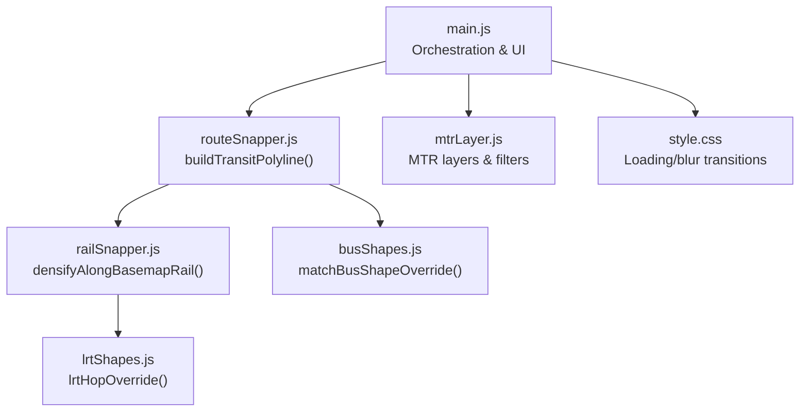
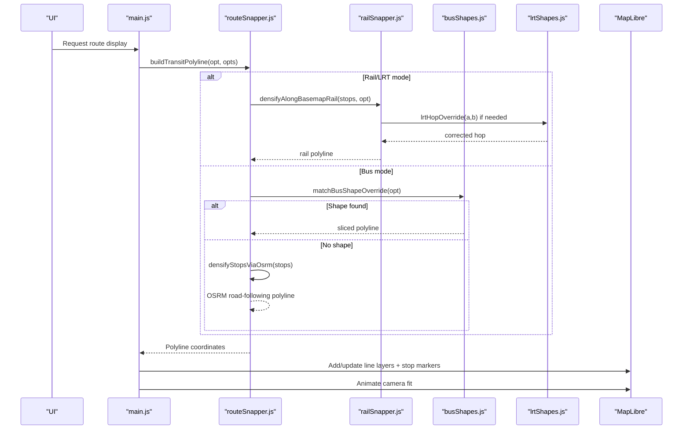
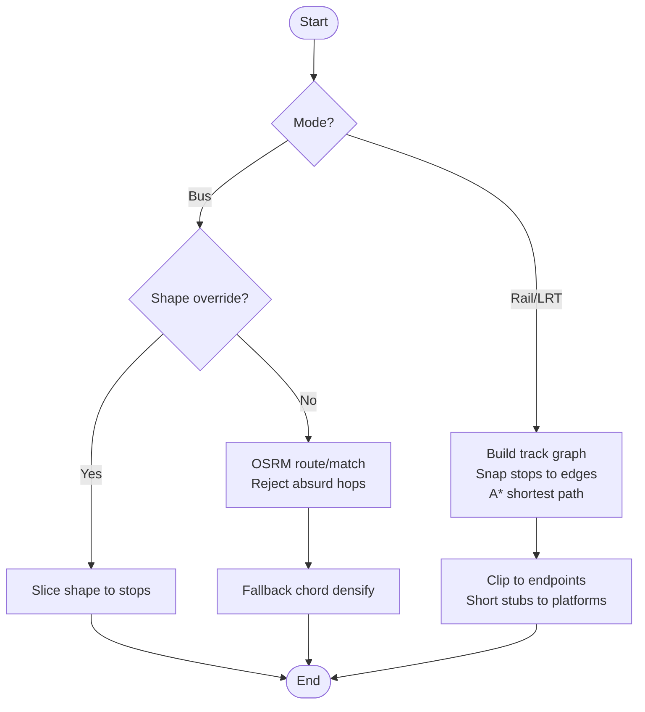
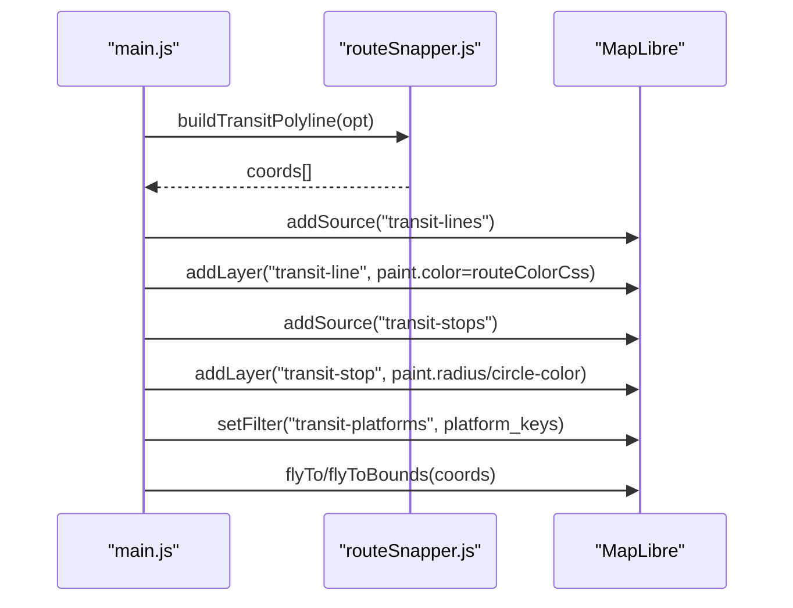
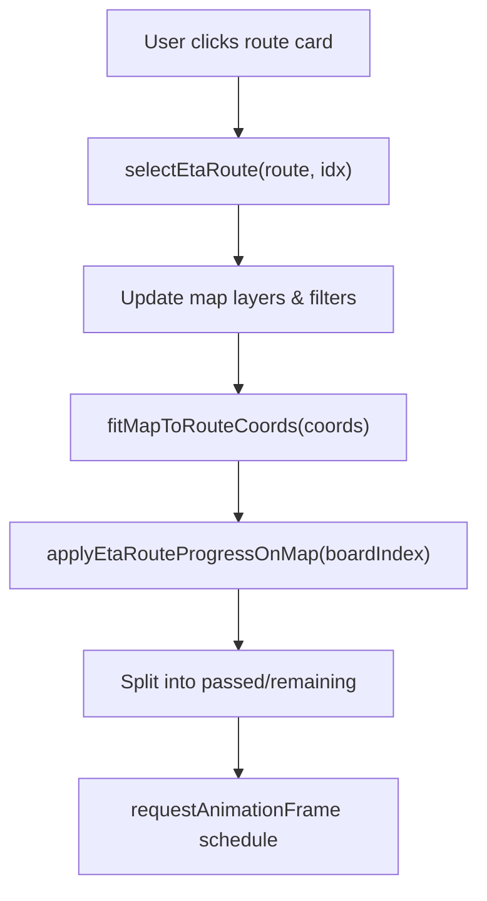
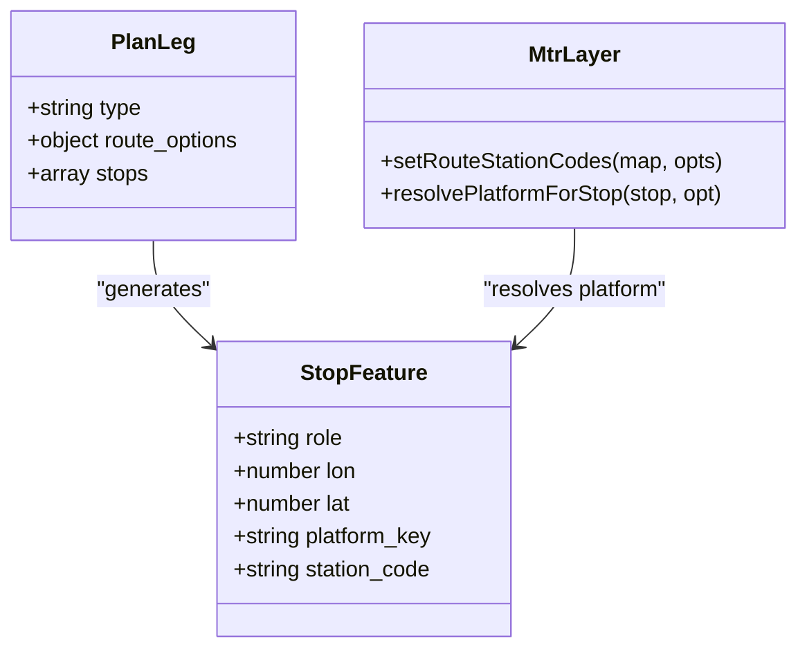
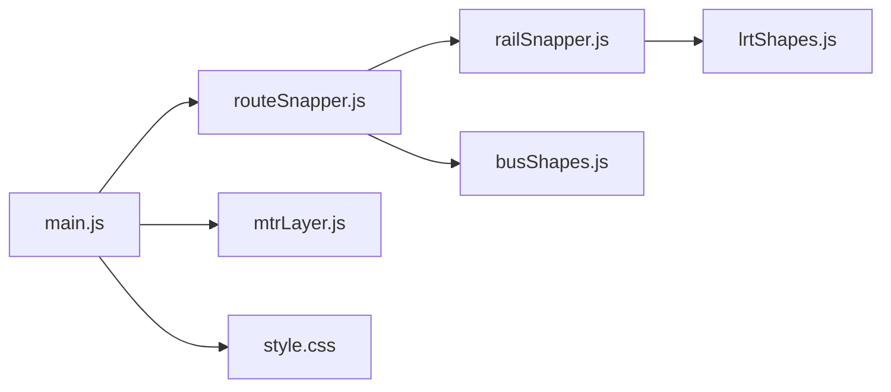

# Route Path Display

<cite>
**Referenced Files in This Document**
- [main.js](file://src/main.js)
- [routeSnapper.js](file://src/routeSnapper.js)
- [railSnapper.js](file://src/railSnapper.js)
- [busShapes.js](file://src/busShapes.js)
- [lrtShapes.js](file://src/lrtShapes.js)
- [mtrLayer.js](file://src/mtrLayer.js)
- [style.css](file://src/style.css)
</cite>

## Table of Contents
1. [Introduction](#introduction)
2. [Project Structure](#project-structure)
3. [Core Components](#core-components)
4. [Architecture Overview](#architecture-overview)
5. [Detailed Component Analysis](#detailed-component-analysis)
6. [Dependency Analysis](#dependency-analysis)
7. [Performance Considerations](#performance-considerations)
8. [Troubleshooting Guide](#troubleshooting-guide)
9. [Conclusion](#conclusion)

## Introduction
This document explains how calculated transit routes are visualized on the map, with a focus on route snapping to actual infrastructure and the rendering pipeline from route calculation results to interactive map visuals. It covers:
- Snapping algorithms for bus shapes, Light Rail paths, and MTR lines
- The path rendering pipeline including layer ordering and z-index behavior
- Interactive features such as hover effects, click handlers, and animated drawing
- Multi-modal segment handling, transfer point highlighting, and real-time status overlays
- Performance considerations for complex geometries and smooth animations

## Project Structure
The route display system is implemented across several modules:
- Route polyline construction and snapping logic live in routeSnapper.js
- Rail/LRT snapping uses railSnapper.js with basemap railway geometry
- Bus shape overrides and corridor matching are handled by busShapes.js
- LRT-specific platform and shape overrides are managed by lrtShapes.js
- MapLibre layers for stations, platforms, and exits are added via mtrLayer.js
- Main orchestration, UI state, and animation flows are in main.js
- Visual loading states and transitions are styled in style.css

**Diagram sources**
- [main.js:3592-4086](file://src/main.js#L3592-L4086)
- [routeSnapper.js:1134-1232](file://src/routeSnapper.js#L1134-L1232)
- [railSnapper.js:69-210](file://src/railSnapper.js#L69-L210)
- [busShapes.js:95-191](file://src/busShapes.js#L95-L191)
- [lrtShapes.js:115-184](file://src/lrtShapes.js#L115-L184)
- [mtrLayer.js:61-219](file://src/mtrLayer.js#L61-L219)
- [style.css:261-296](file://src/style.css#L261-L296)

**Section sources**
- [main.js:3592-4086](file://src/main.js#L3592-L4086)
- [routeSnapper.js:1134-1232](file://src/routeSnapper.js#L1134-L1232)
- [railSnapper.js:69-210](file://src/railSnapper.js#L69-L210)
- [busShapes.js:95-191](file://src/busShapes.js#L95-L191)
- [lrtShapes.js:115-184](file://src/lrtShapes.js#L115-L184)
- [mtrLayer.js:61-219](file://src/mtrLayer.js#L61-L219)
- [style.css:261-296](file://src/style.css#L261-L296)

## Core Components
- Route polyline builder: constructs display polylines per leg mode (rail/LRT/tram vs bus vs ferry), using preloaded route lines or dynamic snapping
- Rail snapper: builds a track graph from basemap vector tiles and computes shortest paths between stops along rails
- Bus shape matcher: selects reviewed contributor shapes or similar corridor matches; slices to board/alight stops
- LRT override engine: provides corrected hop segments and platform points for known problematic alignments
- MTR layer manager: loads station/platform/exit GeoJSON and applies filters to show only relevant elements
- Main orchestrator: converts plan legs into map features, manages layer updates, animations, and interactive behaviors

**Section sources**
- [routeSnapper.js:1134-1232](file://src/routeSnapper.js#L1134-L1232)
- [railSnapper.js:69-210](file://src/railSnapper.js#L69-L210)
- [busShapes.js:95-191](file://src/busShapes.js#L95-L191)
- [lrtShapes.js:115-184](file://src/lrtShapes.js#L115-L184)
- [mtrLayer.js:61-219](file://src/mtrLayer.js#L61-L219)
- [main.js:3592-4086](file://src/main.js#L3592-L4086)

## Architecture Overview
The route display architecture follows a layered pipeline:
1. Plan legs are parsed and converted into stop sequences
2. For each leg, buildTransitPolyline chooses the appropriate snapping strategy based on mode and available data
3. Rail/LRT legs use densifyAlongBasemapRail to follow basemap railways; LRT may apply hop overrides
4. Bus legs prefer reviewed shape overrides; otherwise OSRM road-following is used
5. Resulting polylines are turned into GeoJSON features and rendered as MapLibre line layers
6. Stops are projected onto routes and displayed with roles (board/via/alight/transfer)
7. Real-time progress splits lines into passed/remaining segments for ETA visualization
8. Loading states blur the map and show an overlay while calculations run

**Diagram sources**
- [routeSnapper.js:1134-1232](file://src/routeSnapper.js#L1134-L1232)
- [railSnapper.js:69-210](file://src/railSnapper.js#L69-L210)
- [busShapes.js:95-191](file://src/busShapes.js#L95-L191)
- [lrtShapes.js:115-184](file://src/lrtShapes.js#L115-L184)
- [main.js:3592-4086](file://src/main.js#L3592-L4086)

## Detailed Component Analysis

### Route Snapping Algorithms
- Bus shape snapping: projects ordered stops onto a LineString with forward bias, preferring endpoints when close, and slicing the route between first and last projected stops
- Rail/LRT snapping: builds a weighted graph from basemap railway segments, snaps stops to edges, splices virtual nodes mid-segment, and runs A* to find acceptable hops with strict loop and detour checks
- OSRM integration: multi-waypoint routing with detour rejection; fallback to pair-wise routing and chord densification when OSRM returns implausible paths

**Diagram sources**
- [routeSnapper.js:29-174](file://src/routeSnapper.js#L29-L174)
- [routeSnapper.js:198-227](file://src/routeSnapper.js#L198-L227)
- [routeSnapper.js:1134-1232](file://src/routeSnapper.js#L1134-L1232)
- [railSnapper.js:69-210](file://src/railSnapper.js#L69-L210)

**Section sources**
- [routeSnapper.js:29-174](file://src/routeSnapper.js#L29-L174)
- [routeSnapper.js:198-227](file://src/routeSnapper.js#L198-L227)
- [routeSnapper.js:1134-1232](file://src/routeSnapper.js#L1134-L1232)
- [railSnapper.js:69-210](file://src/railSnapper.js#L69-L210)

### Path Rendering Pipeline
- Feature creation: each leg becomes a GeoJSON feature with properties like kind, color, name, mode, and leg_index
- Layer management: ensureRouteLayers adds sources/layers for transit lines and stops; filters control visibility
- Z-index and ordering: passed segments are drawn before remaining segments so that progress appears under current position
- Camera animation: fitMapToRouteCoords animates to bounds with padding and curve for smooth transitions

**Diagram sources**
- [main.js:3592-4086](file://src/main.js#L3592-L4086)
- [main.js:10111-10316](file://src/main.js#L10111-L10316)
- [main.js:10225-10296](file://src/main.js#L10225-L10296)

**Section sources**
- [main.js:3592-4086](file://src/main.js#L3592-L4086)
- [main.js:10111-10316](file://src/main.js#L10111-L10316)
- [main.js:10225-10296](file://src/main.js#L10225-L10296)

### Interactive Features
- Hover and click: route cards bind click events to select routes and update map visuals; direction switches toggle opposite bound
- Loading overlay: during route calculation, the map blurs and shows a loading overlay; classes toggle visibility and pointer events
- Progress animation: ETA progress splits lines at board index and schedules staged updates for smooth transitions

**Diagram sources**
- [main.js:9664-9706](file://src/main.js#L9664-L9706)
- [main.js:3564-3584](file://src/main.js#L3564-L3584)
- [main.js:10111-10316](file://src/main.js#L10111-L10316)
- [style.css:261-296](file://src/style.css#L261-L296)

**Section sources**
- [main.js:9664-9706](file://src/main.js#L9664-L9706)
- [main.js:3564-3584](file://src/main.js#L3564-L3584)
- [main.js:10111-10316](file://src/main.js#L10111-L10316)
- [style.css:261-296](file://src/style.css#L261-L296)

### Multi-modal Segments and Transfer Points
- Multi-modal legs: each transit leg is processed independently; modes include subway, rail, light_rail, tram, monorail, funicular, ferry
- Transfer detection: when board and alight roles collapse to the same location, the role is updated to transfer to avoid duplicate pins
- Platform resolution: MTR and LRT stops resolve to precise platform points; filters restrict visible platforms to those used by the selected itinerary

**Diagram sources**
- [main.js:3592-3686](file://src/main.js#L3592-L3686)
- [mtrLayer.js:229-330](file://src/mtrLayer.js#L229-L330)

**Section sources**
- [main.js:3592-3686](file://src/main.js#L3592-L3686)
- [mtrLayer.js:229-330](file://src/mtrLayer.js#L229-L330)

### Real-Time Status Overlays
- ETA progress: splitEtaLineAtBoard divides the route into passed and remaining segments based on board index
- Color coding: passed segments use a neutral color; remaining segments use route brand color
- Staged updates: requestAnimationFrame scheduling ensures smooth transitions without jank

**Section sources**
- [main.js:10111-10316](file://src/main.js#L10111-L10316)

## Dependency Analysis
The route display depends on:
- routeSnapper.js for mode-based polyline construction
- railSnapper.js for rail/LRT track following
- busShapes.js for bus shape overrides and corridor matching
- lrtShapes.js for LRT-specific corrections
- mtrLayer.js for platform/station filtering and popups
- main.js for orchestration, UI state, and animation

**Diagram sources**
- [main.js:3592-4086](file://src/main.js#L3592-L4086)
- [routeSnapper.js:1134-1232](file://src/routeSnapper.js#L1134-L1232)
- [railSnapper.js:69-210](file://src/railSnapper.js#L69-L210)
- [busShapes.js:95-191](file://src/busShapes.js#L95-L191)
- [lrtShapes.js:115-184](file://src/lrtShapes.js#L115-L184)
- [mtrLayer.js:61-219](file://src/mtrLayer.js#L61-L219)
- [style.css:261-296](file://src/style.css#L261-L296)

**Section sources**
- [main.js:3592-4086](file://src/main.js#L3592-L4086)
- [routeSnapper.js:1134-1232](file://src/routeSnapper.js#L1134-L1232)
- [railSnapper.js:69-210](file://src/railSnapper.js#L69-L210)
- [busShapes.js:95-191](file://src/busShapes.js#L95-L191)
- [lrtShapes.js:115-184](file://src/lrtShapes.js#L115-L184)
- [mtrLayer.js:61-219](file://src/mtrLayer.js#L61-L219)
- [style.css:261-296](file://src/style.css#L261-L296)

## Performance Considerations
- Tile caching: railSnapper caches PMTiles vector tile segments to reduce network overhead
- Concurrency limits: OSRM nearest and match requests are batched with concurrency caps to avoid overwhelming the server
- Path thinning: intermediate points are thinned to maintain smooth visuals without excessive vertex counts
- Detour rejection: OSRM results are validated against chord lengths and stop proximity to prevent unrealistic routes
- Animation efficiency: staged updates via requestAnimationFrame minimize layout thrashing and ensure smooth transitions

[No sources needed since this section provides general guidance]

## Troubleshooting Guide
- If rail paths appear disconnected, check basemap tile availability and gap bridging thresholds
- If bus routes take long detours, verify OSRM detour rejection parameters and consider using shape overrides
- If platform markers are missing, ensure platform keys are correctly resolved and filters applied
- If animations stutter, confirm that staged updates are scheduled and that large datasets are not being re-painted unnecessarily

**Section sources**
- [railSnapper.js:69-210](file://src/railSnapper.js#L69-L210)
- [routeSnapper.js:198-227](file://src/routeSnapper.js#L198-L227)
- [mtrLayer.js:178-219](file://src/mtrLayer.js#L178-L219)
- [main.js:10111-10316](file://src/main.js#L10111-L10316)

## Conclusion
The route path display system combines robust snapping algorithms with efficient rendering pipelines to visualize transit routes accurately and interactively. By leveraging basemap railway geometry, reviewed bus shapes, and OSRM road networks, it produces realistic paths that align with actual infrastructure. Layer ordering, z-index management, and staged animations ensure smooth user experiences, while transfer point highlighting and real-time overlays provide contextual information for multi-modal journeys.