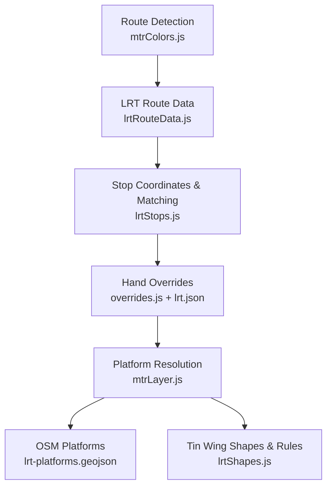
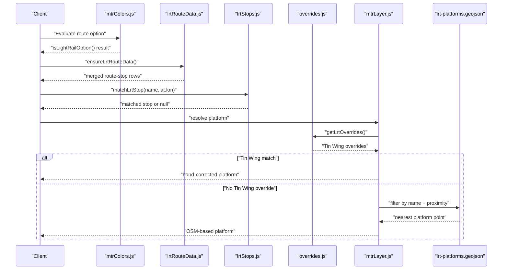
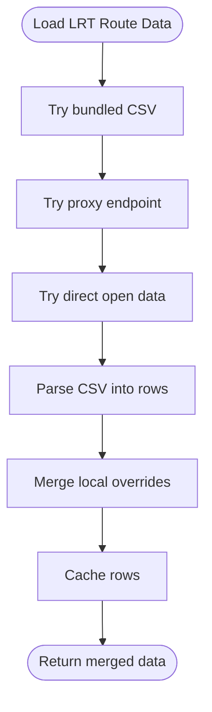
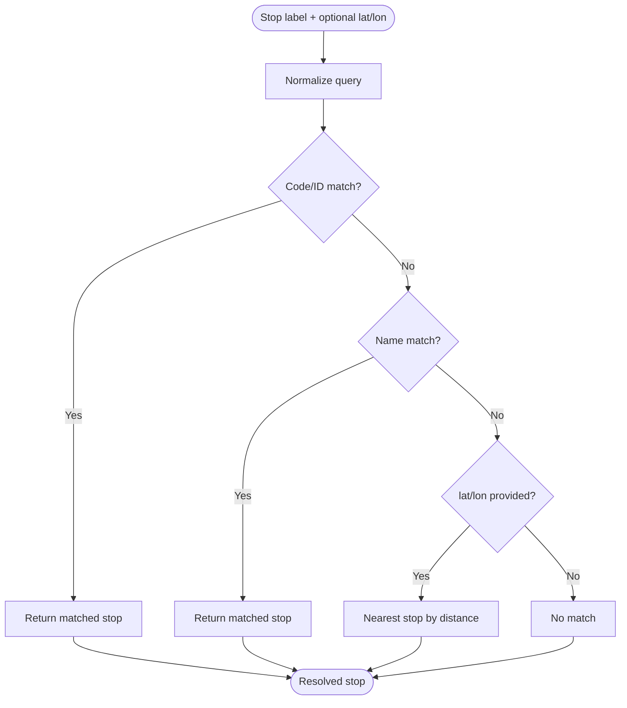
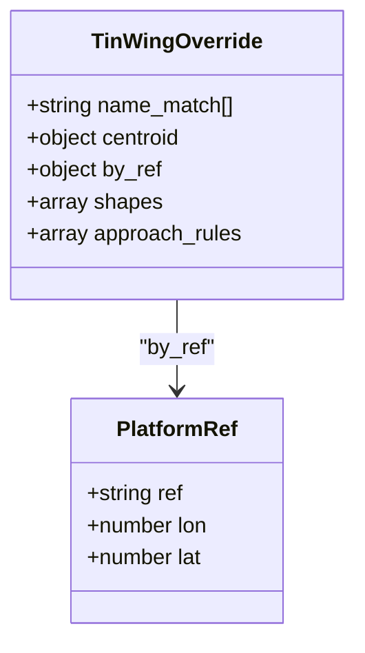
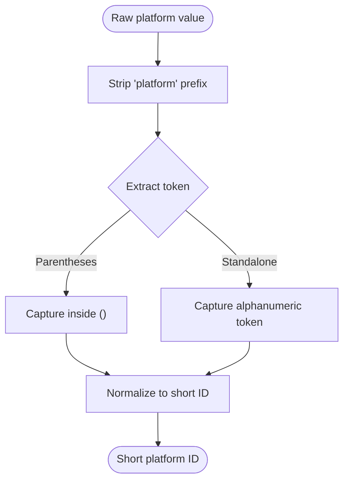
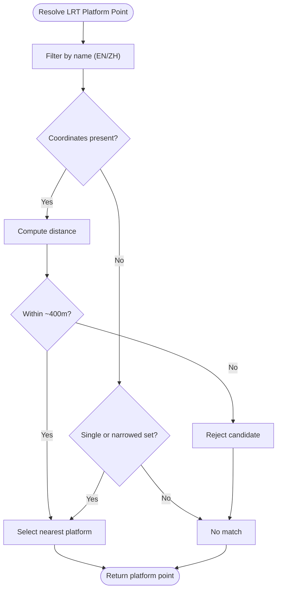
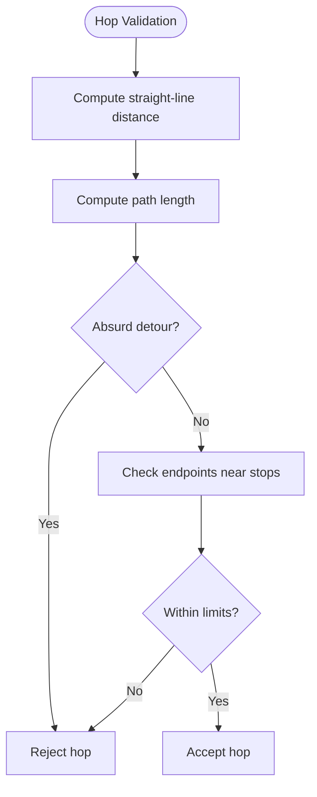
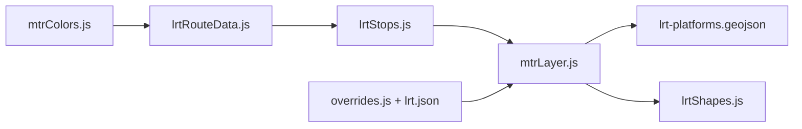

# Light Rail Platform Handling

<cite>
**Referenced Files in This Document**
- [lrtRouteData.js](file://src/lrtRouteData.js)
- [lrtStops.js](file://src/lrtStops.js)
- [overrides.js](file://src/overrides.js)
- [mtrLayer.js](file://src/mtrLayer.js)
- [lrtShapes.js](file://src/lrtShapes.js)
- [routeSnapper.js](file://src/routeSnapper.js)
- [eta.js](file://src/eta.js)
- [mtrColors.js](file://src/mtrColors.js)
- [lrt.json](file://public/overrides/lrt.json)
- [lrt-platforms.geojson](file://public/mtr/lrt-platforms.geojson)
</cite>

## Table of Contents
1. [Introduction](#introduction)
2. [Project Structure](#project-structure)
3. [Core Components](#core-components)
4. [Architecture Overview](#architecture-overview)
5. [Detailed Component Analysis](#detailed-component-analysis)
6. [Dependency Analysis](#dependency-analysis)
7. [Performance Considerations](#performance-considerations)
8. [Troubleshooting Guide](#troubleshooting-guide)
9. [Conclusion](#conclusion)

## Introduction
This document explains how the application detects Light Rail routes and resolves precise platform locations for Light Rail stops, with a focus on the specialized Tin Wing YOHO West indoor platform overrides and the fallback to OSM stop positions. It covers:
- Route detection via agency identification, mode checks, and route number pattern matching
- The Tin Wing override system that provides hand-corrected platform coordinates for an indoor station
- Platform reference parsing from multiple formats (for example, P1, Platform 1, or embedded tokens)
- Fallback to OSM stop_positions using name matching across English and Chinese names
- Proximity validation thresholds used to ensure reasonable automatic assignments
- How these mechanisms address the unique challenges of Light Rail operations in Hong Kong’s dense urban environment

## Project Structure
The Light Rail platform handling spans several modules:
- Route data and stop sequences are loaded and merged with local overrides
- Stop coordinate resolution uses both MTR open data and OSM-derived platform points
- Hand-maintained overrides provide precise indoor platform geometry for Tin Wing
- Layer logic applies overrides first, then falls back to OSM-based snapping
- Shape and approach rules refine routing near complex stations

**Diagram sources**
- [mtrColors.js:109-156](file://src/mtrColors.js#L109-L156)
- [lrtRouteData.js:176-287](file://src/lrtRouteData.js#L176-L287)
- [lrtStops.js:83-199](file://src/lrtStops.js#L83-L199)
- [overrides.js:168-240](file://src/overrides.js#L168-L240)
- [mtrLayer.js:232-243](file://src/mtrLayer.js#L232-L243)
- [lrt-platforms.geojson:1-1](file://public/mtr/lrt-platforms.geojson#L1-L1)
- [lrtShapes.js:58-95](file://src/lrtShapes.js#L58-L95)

**Section sources**
- [mtrColors.js:109-156](file://src/mtrColors.js#L109-L156)
- [lrtRouteData.js:176-287](file://src/lrtRouteData.js#L176-L287)
- [lrtStops.js:83-199](file://src/lrtStops.js#L83-L199)
- [overrides.js:168-240](file://src/overrides.js#L168-L240)
- [mtrLayer.js:232-243](file://src/mtrLayer.js#L232-L243)
- [lrt-platforms.geojson:1-1](file://public/mtr/lrt-platforms.geojson#L1-L1)
- [lrtShapes.js:58-95](file://src/lrtShapes.js#L58-L95)

## Core Components
- Light Rail route detection: identifies LRT options by agency, mode, and numeric route codes
- LRT route data loader: fetches CSV route-stop sequences and merges peak-hour overrides
- Stop coordinate resolver: matches stops by code, ID, or name; supports partial English matches
- Tin Wing override system: hand-corrected indoor platform coordinates and approach shapes
- Platform resolution pipeline: applies Tin Wing overrides first, then snaps to OSM platforms with proximity checks
- Platform token utilities: normalize and extract platform references from various input formats

**Section sources**
- [mtrColors.js:138-156](file://src/mtrColors.js#L138-L156)
- [lrtRouteData.js:176-287](file://src/lrtRouteData.js#L176-L287)
- [lrtStops.js:150-199](file://src/lrtStops.js#L150-L199)
- [overrides.js:168-240](file://src/overrides.js#L168-L240)
- [mtrLayer.js:351-440](file://src/mtrLayer.js#L351-L440)
- [eta.js:570-661](file://src/eta.js#L570-L661)

## Architecture Overview
The platform resolution follows a layered approach:
1. Detect whether a route is Light Rail using agency, mode, and route patterns
2. Load LRT route-stop sequences and merge local overrides for missing peak-hour routes
3. Resolve stop coordinates using official codes, IDs, or name matching
4. Apply Tin Wing indoor platform overrides when applicable
5. Fall back to OSM stop_positions/platforms with name filtering and proximity validation
6. Use shape and approach rules to refine routing near complex stations like Tin Wing

**Diagram sources**
- [mtrColors.js:138-156](file://src/mtrColors.js#L138-L156)
- [lrtRouteData.js:176-287](file://src/lrtRouteData.js#L176-L287)
- [lrtStops.js:150-199](file://src/lrtStops.js#L150-L199)
- [overrides.js:168-240](file://src/overrides.js#L168-L240)
- [mtrLayer.js:232-243](file://src/mtrLayer.js#L232-L243)
- [lrt-platforms.geojson:1-1](file://public/mtr/lrt-platforms.geojson#L1-L1)

## Detailed Component Analysis

### Light Rail Route Detection
Detection combines three signals:
- Agency identification: recognizes “lr” or names containing “light rail” / “輕鐵”
- Mode checking: accepts “light_rail”, and under specific conditions “tram” or “cable_tram”
- Route number pattern matching: numeric LRT codes such as 505–761P family are accepted when not associated with HK Tramways

This ensures accurate classification of Light Rail services while excluding unrelated tram systems.

**Section sources**
- [mtrColors.js:109-156](file://src/mtrColors.js#L109-L156)

### LRT Route Data Loading and Merging
The LRT route data loader:
- Attempts multiple sources: bundled static CSV, proxy endpoint, direct open data
- Parses flexible headers and builds structured route-stop rows
- Merges local overrides for peak-hour routes missing from open data (for example, 751P)
- Caches results and retries on failure, preserving overrides even if CSV load fails

**Diagram sources**
- [lrtRouteData.js:176-287](file://src/lrtRouteData.js#L176-L287)

**Section sources**
- [lrtRouteData.js:176-287](file://src/lrtRouteData.js#L176-L287)

### Stop Coordinate Resolution and Name Matching
Stop coordinate resolution supports:
- Exact match by official stop code or stop ID
- Exact or partial English name matching, including substring and reverse substring cases
- Fallback to nearest neighbor when coordinates are available
- Normalization functions that strip noise and handle bilingual labels

**Diagram sources**
- [lrtStops.js:150-199](file://src/lrtStops.js#L150-L199)

**Section sources**
- [lrtStops.js:150-199](file://src/lrtStops.js#L150-L199)

### Tin Wing YOHO West Indoor Platform Overrides
The Tin Wing override system provides:
- Hand-corrected centroid and per-platform coordinates for indoor platforms
- Name matching arrays supporting both English and Chinese identifiers
- Approach shapes and rules to force realistic final approaches along Tin Shing Road
- Robust fallbacks in case remote overrides fail

Key elements:
- Override file defines Tin Wing stop and platform entries with precise coordinates
- Layer logic checks for Tin Wing matches before falling back to OSM
- Shape definitions include approach segments and slicing parameters to align routing with actual platform faces

**Diagram sources**
- [lrt.json:1-56](file://public/overrides/lrt.json#L1-L56)
- [overrides.js:47-93](file://src/overrides.js#L47-L93)
- [mtrLayer.js:351-371](file://src/mtrLayer.js#L351-L371)

**Section sources**
- [lrt.json:1-56](file://public/overrides/lrt.json#L1-L56)
- [overrides.js:47-93](file://src/overrides.js#L47-L93)
- [mtrLayer.js:351-371](file://src/mtrLayer.js#L351-L371)
- [lrtShapes.js:58-95](file://src/lrtShapes.js#L58-L95)

### Platform Reference Parsing
Platform references can arrive in multiple formats:
- Explicit fields such as platform or platform_code
- Embedded tokens in stop names, for example “(Platform 1)” or “P1”
- Numeric or letter bays normalized into consistent short identifiers

Parsing strategies:
- Strip leading “platform” text and whitespace
- Extract digits or letters from parentheses or standalone tokens
- Normalize to short IDs suitable for matching against platform references

**Diagram sources**
- [eta.js:570-661](file://src/eta.js#L570-L661)
- [mtrLayer.js:351-371](file://src/mtrLayer.js#L351-L371)

**Section sources**
- [eta.js:570-661](file://src/eta.js#L570-L661)
- [mtrLayer.js:351-371](file://src/mtrLayer.js#L351-L371)

### Fallback to OSM Stop Positions
When manual overrides are unavailable or do not apply:
- Filter OSM platform features by English and Chinese names
- If coordinates are present, compute squared Euclidean distance in degrees and enforce a proximity threshold
- Accept matches within approximately 400 meters unless a strong name match narrows candidates
- Return platform metadata including keys, references, and station codes

**Diagram sources**
- [mtrLayer.js:376-440](file://src/mtrLayer.js#L376-L440)

**Section sources**
- [mtrLayer.js:376-440](file://src/mtrLayer.js#L376-L440)

### Proximity Validation System
Proximity validation ensures reasonable distances for automatic platform assignment:
- Uses degree-squared distance as a fast approximation with a threshold around 0.004 degrees (~400 meters)
- Applies stricter checks when no name narrowing occurs
- Complements haversine-based validations elsewhere in routing to prevent implausible hops

**Diagram sources**
- [routeSnapper.js:1012-1031](file://src/routeSnapper.js#L1012-L1031)

**Section sources**
- [routeSnapper.js:1012-1031](file://src/routeSnapper.js#L1012-L1031)

### Unique Challenges of Light Rail in Hong Kong
- Dense urban environments create tight curves and complex station layouts, requiring precise platform coordinates
- Indoor stations like Tin Wing under YOHO West require hand-corrected geometry due to lagging OSM updates
- Mixed naming conventions (English and Chinese) necessitate robust name matching and normalization
- Peak-hour and short-working routes may be absent from public datasets, requiring local overrides
- Routing must respect actual platform faces and approach roads to avoid unrealistic paths

[No sources needed since this section summarizes contextual challenges without analyzing specific files]

## Dependency Analysis
The platform handling depends on coordinated modules:
- Route detection feeds into LRT-specific processing
- LRT route data provides sequence context for stop ordering and direction mapping
- Stop coordinate resolution bridges official data and OSM platform points
- Overrides inject precise indoor geometry where public data is insufficient
- Layer logic orchestrates precedence: Tin Wing overrides first, then OSM snapping

**Diagram sources**
- [mtrColors.js:138-156](file://src/mtrColors.js#L138-L156)
- [lrtRouteData.js:176-287](file://src/lrtRouteData.js#L176-L287)
- [lrtStops.js:150-199](file://src/lrtStops.js#L150-L199)
- [overrides.js:168-240](file://src/overrides.js#L168-L240)
- [mtrLayer.js:232-243](file://src/mtrLayer.js#L232-L243)
- [lrt-platforms.geojson:1-1](file://public/mtr/lrt-platforms.geojson#L1-L1)
- [lrtShapes.js:58-95](file://src/lrtShapes.js#L58-L95)

**Section sources**
- [mtrColors.js:138-156](file://src/mtrColors.js#L138-L156)
- [lrtRouteData.js:176-287](file://src/lrtRouteData.js#L176-L287)
- [lrtStops.js:150-199](file://src/lrtStops.js#L150-L199)
- [overrides.js:168-240](file://src/overrides.js#L168-L240)
- [mtrLayer.js:232-243](file://src/mtrLayer.js#L232-L243)
- [lrt-platforms.geojson:1-1](file://public/mtr/lrt-platforms.geojson#L1-L1)
- [lrtShapes.js:58-95](file://src/lrtShapes.js#L58-L95)

## Performance Considerations
- Prefer cached or bundled CSV data to reduce network latency and COEP constraints
- Use name filtering to narrow candidate sets before distance calculations
- Employ degree-squared distance as a fast filter before more expensive haversine checks
- Limit fallback attempts to avoid excessive parsing or fetching overhead
- Keep overrides small and targeted to minimize memory usage and lookup time

[No sources needed since this section provides general guidance]

## Troubleshooting Guide
Common issues and resolutions:
- CSV loading failures: rely on local overrides to maintain functionality for peak-hour routes
- Incorrect platform assignment: verify name normalization and check whether Tin Wing overrides apply
- Proximity rejections: confirm that coordinates are accurate and consider adjusting thresholds if necessary
- Missing OSM platforms: ensure platform features exist and contain required properties like stop_name_en and ref

**Section sources**
- [lrtRouteData.js:269-287](file://src/lrtRouteData.js#L269-L287)
- [mtrLayer.js:376-440](file://src/mtrLayer.js#L376-L440)
- [overrides.js:168-240](file://src/overrides.js#L168-L240)

## Conclusion
The Light Rail platform handling system combines robust route detection, flexible stop coordinate resolution, and precise hand-corrected overrides to deliver accurate platform assignments in complex urban settings. The Tin Wing YOHO West indoor platform overrides exemplify how manual corrections complement public data and OSM sources. By integrating name matching, proximity validation, and shape-based approach rules, the system maintains reliability and accuracy for Light Rail operations across Hong Kong’s dense transit network.

[No sources needed since this section summarizes without analyzing specific files]