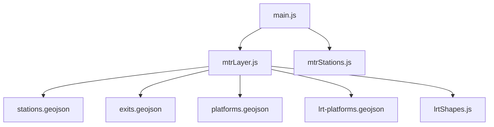
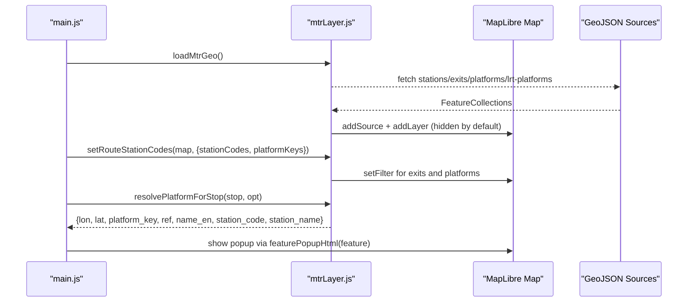
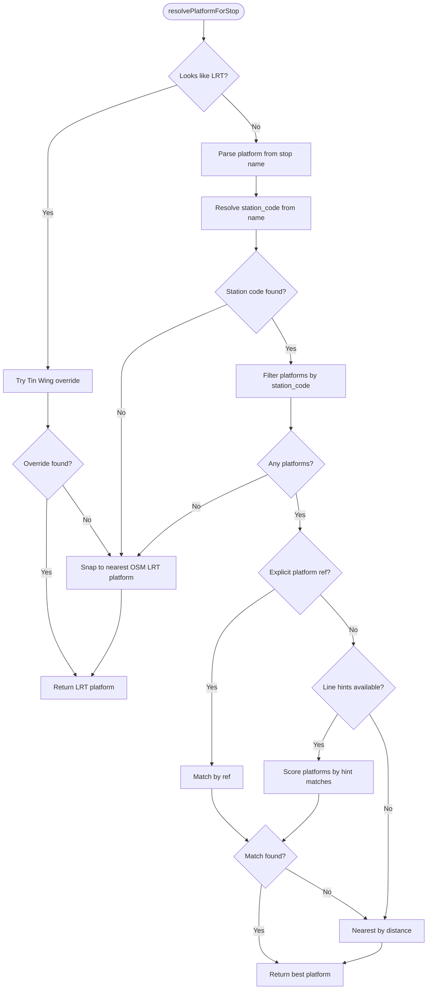
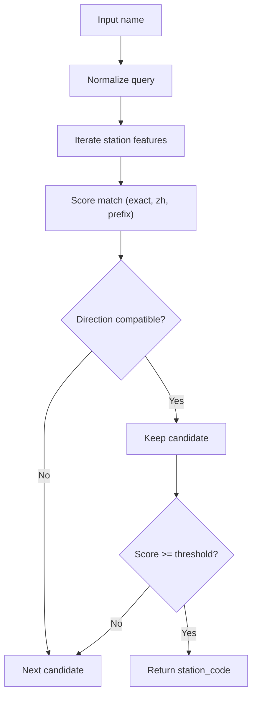
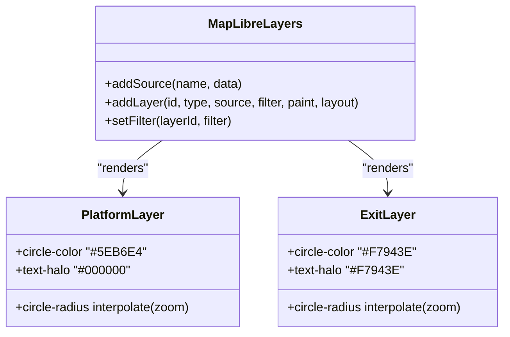
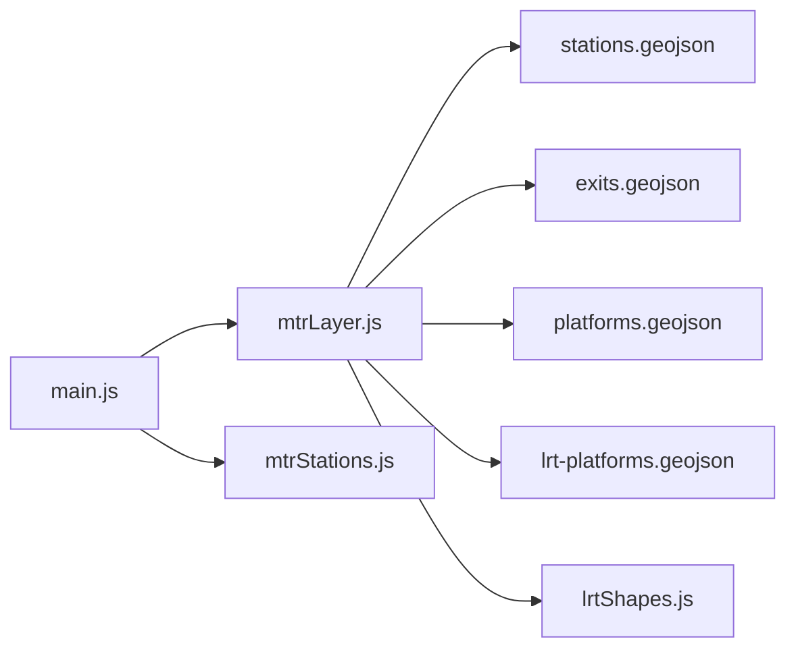

# MTR Station and Platform Visualization

<cite>
**Referenced Files in This Document**
- [mtrLayer.js](file://src/mtrLayer.js)
- [mtrStations.js](file://src/mtrStations.js)
- [stations.geojson](file://public/mtr/stations.geojson)
- [platforms.geojson](file://public/mtr/platforms.geojson)
- [lrtShapes.js](file://src/lrtShapes.js)
- [main.js](file://src/main.js)
</cite>

## Table of Contents
1. [Introduction](#introduction)
2. [Project Structure](#project-structure)
3. [Core Components](#core-components)
4. [Architecture Overview](#architecture-overview)
5. [Detailed Component Analysis](#detailed-component-analysis)
6. [Dependency Analysis](#dependency-analysis)
7. [Performance Considerations](#performance-considerations)
8. [Troubleshooting Guide](#troubleshooting-guide)
9. [Conclusion](#conclusion)

## Introduction
This document explains the MTR station and platform visualization system with a focus on the intelligent platform resolution algorithm. It covers how route stops are matched to specific platforms using a three-tier strategy, how station codes are resolved while preserving directional distinctions (for example, East Tsim Sha Tsui vs Tsim Sha Tsui), and how the visual styling system renders color-coded platform markers with zoom-dependent sizing and readable labels using text halos. It also documents the GeoJSON data model, MapLibre layer configuration, filter-based visibility control, and the popup information display for exits, platforms, and station connections.

## Project Structure
The visualization is implemented as a set of modules that load and render MTR-related GeoJSON data on a MapLibre map:
- Data sources: stations, exits, platforms, and LRT platforms stored as GeoJSON files under public/mtr.
- Layer management: module that adds MapLibre sources and layers and controls visibility via filters.
- Resolution logic: algorithms to match route stops to platforms and resolve station codes from names.
- Integration: main application entry that initializes overrides, loads data, and wires up interactions.

**Diagram sources**
- [main.js:21-101](file://src/main.js#L21-L101)
- [mtrLayer.js:28-67](file://src/mtrLayer.js#L28-L67)
- [mtrStations.js:8-11](file://src/mtrStations.js#L8-L11)
- [lrtShapes.js:1-5](file://src/lrtShapes.js#L1-L5)

**Section sources**
- [main.js:21-101](file://src/main.js#L21-L101)
- [mtrLayer.js:28-67](file://src/mtrLayer.js#L28-L67)

## Core Components
- Platform resolution: resolves a plan stop to a concrete platform feature using explicit references, line/route hints, and proximity calculations.
- Station code resolution: maps free-text or normalized station names to station codes while respecting directional pairs.
- Visual rendering: adds MapLibre sources and layers for platforms and exits with zoom-dependent sizes and label halos; visibility controlled by filters based on active station codes and platform keys.
- Popup display: generates contextual HTML popups for exits, stations, platforms, and route stops.

**Section sources**
- [mtrLayer.js:221-330](file://src/mtrLayer.js#L221-L330)
- [mtrLayer.js:498-592](file://src/mtrLayer.js#L498-L592)
- [mtrLayer.js:61-170](file://src/mtrLayer.js#L61-L170)
- [mtrLayer.js:594-632](file://src/mtrLayer.js#L594-L632)

## Architecture Overview
The system loads GeoJSON datasets into MapLibre sources and conditionally renders platform and exit layers based on the selected itinerary. The platform resolution algorithm selects the best platform per stop, then updates layer filters so only relevant platforms and exits appear. Popups provide rich context for each feature.

**Diagram sources**
- [mtrLayer.js:28-67](file://src/mtrLayer.js#L28-L67)
- [mtrLayer.js:178-219](file://src/mtrLayer.js#L178-L219)
- [mtrLayer.js:221-330](file://src/mtrLayer.js#L221-L330)
- [mtrLayer.js:594-632](file://src/mtrLayer.js#L594-L632)

## Detailed Component Analysis

### Intelligent Platform Resolution Algorithm
The algorithm matches a route stop to a specific platform using a prioritized three-tier strategy:
1. Explicit platform reference: if the stop includes a platform field or a platform number embedded in the stop name, it is used to find a matching platform by its ref.
2. Line/route name hints: when no explicit reference exists, the algorithm extracts hints from route metadata (short name, full name, ID) and scores platform features by how many hints match their English names.
3. Proximity calculation: if neither of the above yields a result, the nearest platform to the stop’s coordinates is chosen; if coordinates are missing, the first platform for the station is used.

Light Rail handling:
- For Light Rail routes or stops, the system applies hand-corrected indoor platform overrides (for example, Tin Wing YOHO West) before falling back to OSM stop positions.
- If heavy rail platforms are unavailable, it attempts LRT snapping with a proximity threshold.

**Diagram sources**
- [mtrLayer.js:221-330](file://src/mtrLayer.js#L221-L330)
- [mtrLayer.js:332-440](file://src/mtrLayer.js#L332-L440)

**Section sources**
- [mtrLayer.js:221-330](file://src/mtrLayer.js#L221-L330)
- [mtrLayer.js:332-440](file://src/mtrLayer.js#L332-L440)

### Station Code Resolution and Directional Handling
Station code resolution normalizes input names and matches against station features while preventing incorrect collapses between directional pairs (for example, “Tsim Sha Tsui” must not match “East Tsim Sha Tsui”). Key behaviors:
- Normalization strips noise such as “Station”, “MTR”, and platform annotations.
- Directional key extraction identifies East/West/South/North suffixes or Chinese equivalents and ensures both query and candidate share the same directional context.
- Scoring prefers exact matches, longer Chinese names, and clean prefixes without substring collisions across directional pairs.

**Diagram sources**
- [mtrLayer.js:482-592](file://src/mtrLayer.js#L482-L592)

**Section sources**
- [mtrLayer.js:482-592](file://src/mtrLayer.js#L482-L592)

### Visual Styling System
The visualization uses MapLibre layers to render platforms and exits with consistent styling:
- Color-coded markers:
  - Platforms: blue circles with white strokes.
  - Exits: orange circles with dark strokes.
- Zoom-dependent sizing:
  - Platform circle radius interpolates across zoom levels 11–17.
  - Exit circle radius interpolates starting at zoom level 14 up to 17.
- Label positioning and readability:
  - Platform labels show “P” plus the platform ref, positioned below the marker with a black halo for contrast.
  - Exit labels use exit reference or English name, with an orange halo for readability.
- Visibility control:
  - Layers are hidden until a plan sets station codes and platform keys via filters.
  - Filters use equality checks against sentinel values to hide all features initially.

**Diagram sources**
- [mtrLayer.js:61-170](file://src/mtrLayer.js#L61-L170)

**Section sources**
- [mtrLayer.js:61-170](file://src/mtrLayer.js#L61-L170)

### GeoJSON Data Structure
The system consumes four primary GeoJSON datasets:
- Stations: point features with properties including station_code, name_en, name_zh, lines, interchange flag, exits list, platforms list, venue_id, and bbox.
- Exits: point features with properties such as ref, name_en, name_zh, station_code, level_name_en, and exit_key.
- Platforms: point features with properties including platform_key, ref, name_en, station_code, and related identifiers.
- LRT platforms: point features with properties like stop_name_en, name_zh, station_code, platform_key, and ref.

These structures enable precise filtering and labeling, and support the resolution algorithms by providing station codes and platform references.

**Section sources**
- [stations.geojson:1-1](file://public/mtr/stations.geojson#L1-L1)
- [platforms.geojson:1-1](file://public/mtr/platforms.geojson#L1-L1)

### MapLibre Layer Configuration and Filter-Based Visibility
- Sources are added once and reused; station centroids are intentionally not drawn—only exits and platforms are rendered.
- Filters hide all features until the application sets active station codes and platform keys:
  - neverFilter uses a sentinel value to match nothing.
  - neverPlatformFilter similarly hides platform features until activated.
- When a route is selected, setRouteStationCodes computes unique station codes and platform keys and updates layer filters accordingly.

**Section sources**
- [mtrLayer.js:61-170](file://src/mtrLayer.js#L61-L170)
- [mtrLayer.js:178-219](file://src/mtrLayer.js#L178-L219)

### Popup Information Display System
Popups present contextual information depending on the feature type:
- Exit popups show exit number, English/Chinese names, station code, and level name when available.
- Station popups show station name, Chinese name, station code, connected lines, and count of exits.
- Platform popups show platform name and station code.
- Route stop popups show stop name, route, role, platform reference, and mode when applicable.

HTML generation escapes user-provided strings to prevent injection and formats content consistently.

**Section sources**
- [mtrLayer.js:594-632](file://src/mtrLayer.js#L594-L632)

## Dependency Analysis
The visualization depends on several modules and data sources:
- main.js orchestrates initialization, loading overrides, and integrating MTR layer functions.
- mtrLayer.js manages GeoJSON loading, layer creation, visibility filters, platform resolution, and popup generation.
- mtrStations.js provides local station search, snapping, and access pin overrides.
- lrtShapes.js supplies Light Rail platform overrides and shape corrections.
- GeoJSON files supply structured spatial data for stations, exits, platforms, and LRT platforms.

**Diagram sources**
- [main.js:21-101](file://src/main.js#L21-L101)
- [mtrLayer.js:28-67](file://src/mtrLayer.js#L28-L67)
- [mtrStations.js:8-11](file://src/mtrStations.js#L8-L11)
- [lrtShapes.js:1-5](file://src/lrtShapes.js#L1-L5)

**Section sources**
- [main.js:21-101](file://src/main.js#L21-L101)
- [mtrLayer.js:28-67](file://src/mtrLayer.js#L28-L67)

## Performance Considerations
- Filtering over large GeoJSON collections can be expensive; prefer narrowing candidates by station_code or platform_key before computing distances.
- Use zoom-dependent minzoom and label visibility to reduce rendering overhead at low zoom levels.
- Avoid unnecessary re-renders by updating filters only when station codes or platform keys change.
- For Light Rail snapping, apply name-based shortlisting before distance calculations to limit candidate sets.

[No sources needed since this section provides general guidance]

## Troubleshooting Guide
Common issues and resolutions:
- Platforms not visible: ensure setRouteStationCodes is called with valid station codes and platform keys; verify filters are updated.
- Wrong platform selected: check whether explicit platform references exist in stop data; confirm line hints are correctly extracted from route metadata.
- Directional mismatches: verify normalization removes noise and that directional keys match between query and candidate (for example, East vs non-East).
- LRT snapping failures: confirm LRT platform data is loaded and that name matching thresholds are appropriate; consider applying Tin Wing overrides where necessary.
- Popup content missing: ensure feature properties include expected fields (ref, name_en, station_code); validate escape function behavior for special characters.

**Section sources**
- [mtrLayer.js:178-219](file://src/mtrLayer.js#L178-L219)
- [mtrLayer.js:221-330](file://src/mtrLayer.js#L221-L330)
- [mtrLayer.js:498-592](file://src/mtrLayer.js#L498-L592)
- [mtrLayer.js:594-632](file://src/mtrLayer.js#L594-L632)

## Conclusion
The MTR station and platform visualization integrates robust platform resolution, precise station code mapping with directional awareness, and a clear visual system built on MapLibre. The three-tier matching strategy ensures accurate platform selection even with incomplete or ambiguous input. Zoom-dependent styling and text halos improve readability, while filter-based visibility keeps the map focused on relevant itinerary elements. The popup system delivers concise, contextual information for exits, platforms, and stations, enhancing user experience during navigation and planning.

[No sources needed since this section summarizes without analyzing specific files]