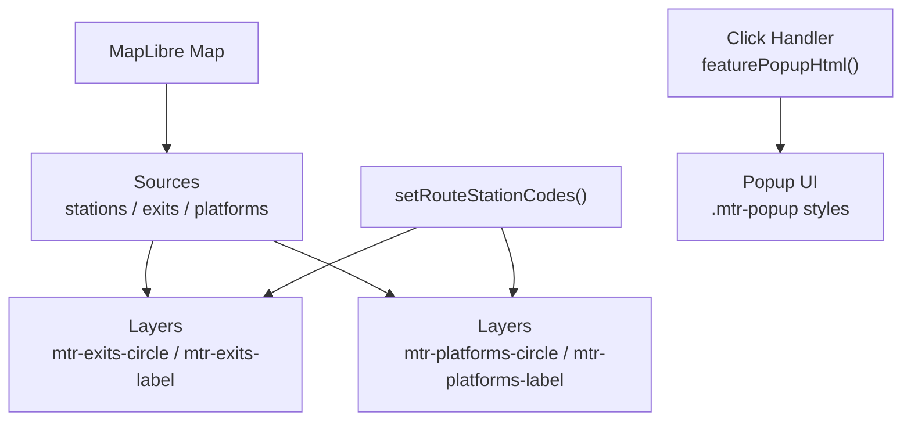
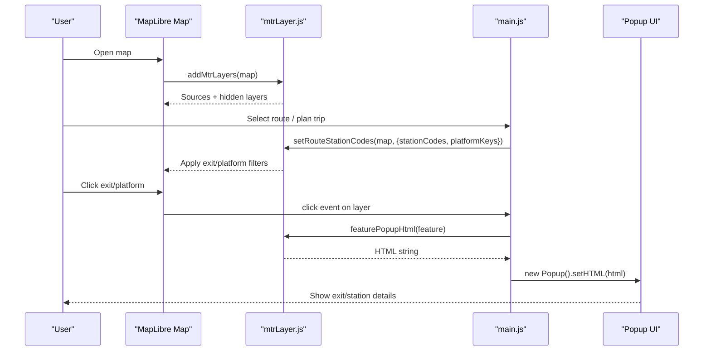
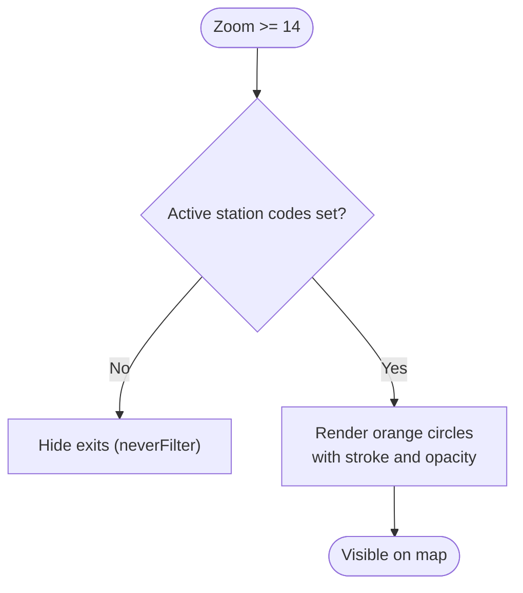
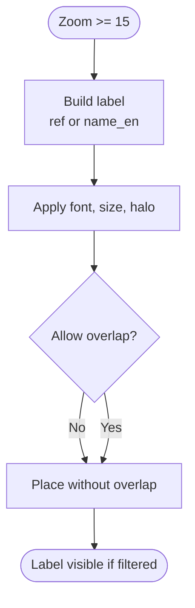
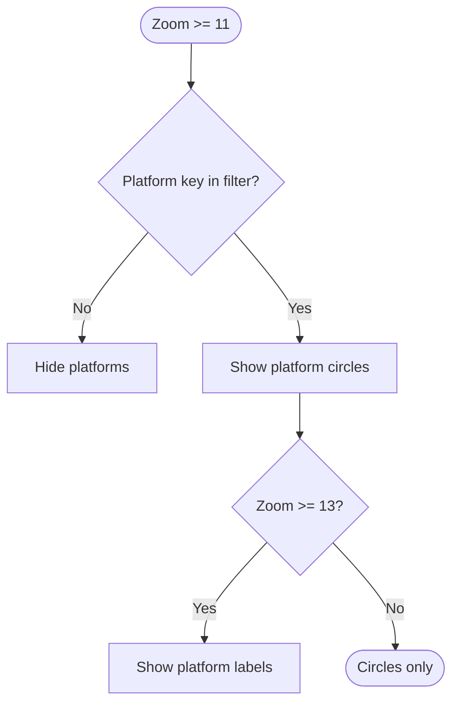
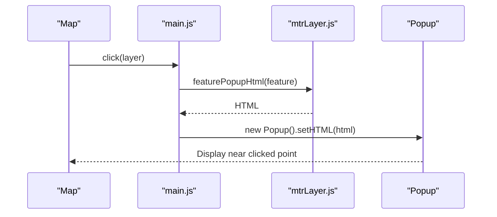
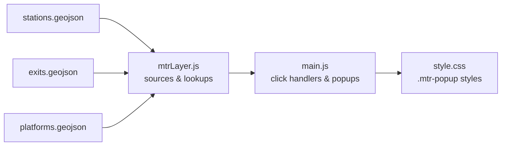

# Station Exit Markers and Labels

<cite>
**Referenced Files in This Document**
- [mtrLayer.js](file://src/mtrLayer.js)
- [main.js](file://src/main.js)
- [style.css](file://src/style.css)
- [stations.geojson](file://public/mtr/stations.geojson)
- [exits.geojson](file://public/mtr/exits.geojson)
- [platforms.geojson](file://public/mtr/platforms.geojson)
</cite>

## Table of Contents
1. [Introduction](#introduction)
2. [Project Structure](#project-structure)
3. [Core Components](#core-components)
4. [Architecture Overview](#architecture-overview)
5. [Detailed Component Analysis](#detailed-component-analysis)
6. [Dependency Analysis](#dependency-analysis)
7. [Performance Considerations](#performance-considerations)
8. [Troubleshooting Guide](#troubleshooting-guide)
9. [Conclusion](#conclusion)

## Introduction
This document explains the station exit marker visualization and labeling system used to highlight MTR station exits on the map. It covers:
- Rendering of orange circular exit markers at zoom level 14+ with stroke color and opacity settings
- Exit label display using exit references and bilingual names, with halos and overlap prevention
- Zoom-dependent visibility where platforms appear earlier than exits
- The feature popup system that shows detailed exit information (exit code, bilingual names, station code, level)
- Performance considerations for large datasets and filtering by active route selection

## Project Structure
The exit visualization is implemented as MapLibre layers sourced from GeoJSON files and controlled via JavaScript functions that set filters based on the currently selected route.

**Diagram sources**
- [mtrLayer.js:61-160](file://src/mtrLayer.js#L61-L160)
- [mtrLayer.js:178-219](file://src/mtrLayer.js#L178-L219)
- [main.js:2261-2295](file://src/main.js#L2261-L2295)
- [style.css:5384-5396](file://src/style.css#L5384-L5396)

**Section sources**
- [mtrLayer.js:28-54](file://src/mtrLayer.js#L28-L54)
- [mtrLayer.js:61-160](file://src/mtrLayer.js#L61-L160)
- [main.js:2261-2295](file://src/main.js#L2261-L2295)

## Core Components
- Data sources: stations, exits, and platforms GeoJSON are loaded once and reused.
- Layers:
  - Exits circle layer: visible at zoom 14+, orange fill, dark stroke, high opacity
  - Exits label layer: visible at zoom 15+, uses exit reference or English name, bold font, halo, no overlap
  - Platforms circle/label layers: visible earlier (zoom 11+ for circles, 13+ for labels), blue circles with white strokes
- Filtering: All layers are hidden by default using a “never” filter; they become visible only when setRouteStationCodes applies an “in” filter matching active station codes and platform keys.
- Popups: Click handlers build HTML via featurePopupHtml and render a styled popup.

**Section sources**
- [mtrLayer.js:61-160](file://src/mtrLayer.js#L61-L160)
- [mtrLayer.js:178-219](file://src/mtrLayer.js#L178-L219)
- [mtrLayer.js:597-632](file://src/mtrLayer.js#L597-L632)
- [main.js:2261-2295](file://src/main.js#L2261-L2295)
- [style.css:5384-5396](file://src/style.css#L5384-L5396)

## Architecture Overview
The system follows a data-driven rendering pattern:
- Load GeoJSON sources once
- Add hidden layers with “never” filters
- On route selection, compute active station codes and platform keys
- Update layer filters to show only relevant features
- Provide interactive popups for exits, platforms, and route stops

**Diagram sources**
- [mtrLayer.js:61-160](file://src/mtrLayer.js#L61-L160)
- [mtrLayer.js:178-219](file://src/mtrLayer.js#L178-L219)
- [main.js:2261-2295](file://src/main.js#L2261-L2295)
- [mtrLayer.js:597-632](file://src/mtrLayer.js#L597-L632)

## Detailed Component Analysis

### Exit Marker Rendering (Orange Circles)
- Source: exits GeoJSON
- Layer type: circle
- Visibility: minzoom 14
- Paint:
  - Circle radius scales with zoom
  - Color: orange (#F7943E)
  - Stroke: dark (#1a0a00), width 1
  - Opacity: 0.95
- Filter: Hidden until setRouteStationCodes sets station_code filter

**Diagram sources**
- [mtrLayer.js:119-140](file://src/mtrLayer.js#L119-L140)
- [mtrLayer.js:163-166](file://src/mtrLayer.js#L163-L166)
- [mtrLayer.js:178-219](file://src/mtrLayer.js#L178-L219)

**Section sources**
- [mtrLayer.js:119-140](file://src/mtrLayer.js#L119-L140)
- [mtrLayer.js:163-166](file://src/mtrLayer.js#L163-L166)
- [mtrLayer.js:178-219](file://src/mtrLayer.js#L178-L219)

### Exit Label System
- Source: exits GeoJSON
- Layer type: symbol
- Visibility: minzoom 15
- Text field: coalesce(ref, name_en)
- Font: Noto Sans Bold
- Halo: orange (#F7943E), width 1.5
- Overlap: text-allow-overlap false
- Filter: Same as exit circles

**Diagram sources**
- [mtrLayer.js:142-160](file://src/mtrLayer.js#L142-L160)
- [mtrLayer.js:178-219](file://src/mtrLayer.js#L178-L219)

**Section sources**
- [mtrLayer.js:142-160](file://src/mtrLayer.js#L142-L160)
- [mtrLayer.js:178-219](file://src/mtrLayer.js#L178-L219)

### Platform Visualization (Earlier Zoom)
- Platforms use separate sources and layers:
  - Circle layer: minzoom 11, blue circles with white stroke
  - Label layer: minzoom 13, “P” + ref, light text with black halo
- Filters: Based on platform_key values set by setRouteStationCodes

**Diagram sources**
- [mtrLayer.js:70-117](file://src/mtrLayer.js#L70-L117)
- [mtrLayer.js:178-219](file://src/mtrLayer.js#L178-L219)

**Section sources**
- [mtrLayer.js:70-117](file://src/mtrLayer.js#L70-L117)
- [mtrLayer.js:178-219](file://src/mtrLayer.js#L178-L219)

### Feature Popup System
- Triggered by clicks on exit/platform/route-stop layers
- Builds HTML via featurePopupHtml:
  - Exit: shows exit reference, bilingual names, station code, level
  - Station: shows station name, lines, exit count
  - Platform: shows platform name and station code
  - Route stop: shows stop name, route, role, platform, mode
- Styled via .mtr-popup CSS classes

**Diagram sources**
- [main.js:2261-2295](file://src/main.js#L2261-L2295)
- [mtrLayer.js:597-632](file://src/mtrLayer.js#L597-L632)
- [style.css:5384-5396](file://src/style.css#L5384-L5396)

**Section sources**
- [main.js:2261-2295](file://src/main.js#L2261-L2295)
- [mtrLayer.js:597-632](file://src/mtrLayer.js#L597-L632)
- [style.css:5384-5396](file://src/style.css#L5384-L5396)

### Zoom-Dependent Behavior Summary
- Platforms:
  - Circles: visible from zoom 11
  - Labels: visible from zoom 13
- Exits:
  - Circles: visible from zoom 14
  - Labels: visible from zoom 15
- This ensures platforms appear earlier than exits as users zoom in.

**Section sources**
- [mtrLayer.js:70-117](file://src/mtrLayer.js#L70-L117)
- [mtrLayer.js:119-160](file://src/mtrLayer.js#L119-L160)

## Dependency Analysis
- Data dependencies:
  - public/mtr/stations.geojson: station centroids (used for lookup and search)
  - public/mtr/exits.geojson: exit points and properties (ref, name_en, name_zh, station_code, level_name_en)
  - public/mtr/platforms.geojson: platform points and properties (platform_key, ref, name_en, station_code)
- Code dependencies:
  - main.js wires click handlers and creates popups
  - mtrLayer.js defines sources, layers, filters, and popup HTML generation
  - style.css styles the popup content

**Diagram sources**
- [mtrLayer.js:28-54](file://src/mtrLayer.js#L28-L54)
- [main.js:2261-2295](file://src/main.js#L2261-L2295)
- [style.css:5384-5396](file://src/style.css#L5384-L5396)

**Section sources**
- [mtrLayer.js:28-54](file://src/mtrLayer.js#L28-L54)
- [mtrLayer.js:61-160](file://src/mtrLayer.js#L61-L160)
- [main.js:2261-2295](file://src/main.js#L2261-L2295)
- [style.css:5384-5396](file://src/style.css#L5384-L5396)

## Performance Considerations
- Data loading:
  - All GeoJSON sources are fetched once and cached in memory to avoid repeated network requests
- Rendering:
  - Layers start hidden with “never” filters to prevent unnecessary draw calls
  - Filters are applied only when route selection changes, minimizing re-renders
- Interactivity:
  - Click handlers attach to specific layers; popups are created lazily and removed before new ones
- Large datasets:
  - Using source-level GeoJSON and server-side filtering would further reduce client load
  - Consider clustering for dense exit areas if needed

[No sources needed since this section provides general guidance]

## Troubleshooting Guide
- Exits not visible:
  - Ensure setRouteStationCodes has been called with valid station codes
  - Verify zoom level is at least 14 for circles and 15 for labels
- Labels overlapping:
  - text-allow-overlap is disabled; crowded areas may hide some labels
- Popups not showing:
  - Confirm click events are bound to the correct layers
  - Check that featurePopupHtml returns non-empty HTML for the clicked feature
- Styling issues:
  - Ensure .mtr-popup CSS is loaded and not overridden

**Section sources**
- [mtrLayer.js:178-219](file://src/mtrLayer.js#L178-L219)
- [mtrLayer.js:597-632](file://src/mtrLayer.js#L597-L632)
- [main.js:2261-2295](file://src/main.js#L2261-L2295)
- [style.css:5384-5396](file://src/style.css#L5384-L5396)

## Conclusion
The station exit visualization system uses MapLibre layers with zoom-dependent visibility, precise styling, and route-based filtering to present clear, informative exit markers and labels. The popup system provides rich detail for exits, stations, and platforms, while performance-conscious design keeps rendering efficient even with large datasets.

[No sources needed since this section summarizes without analyzing specific files]