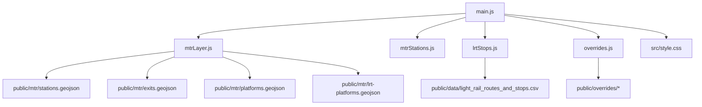
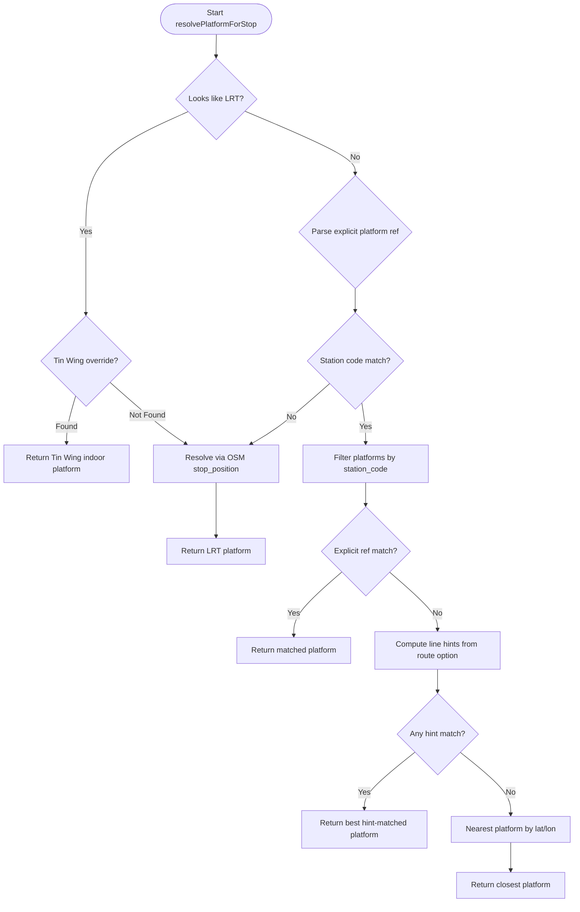
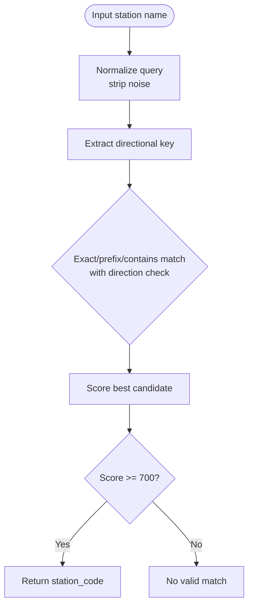
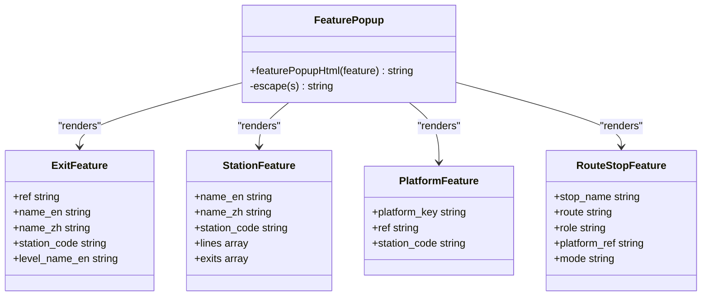
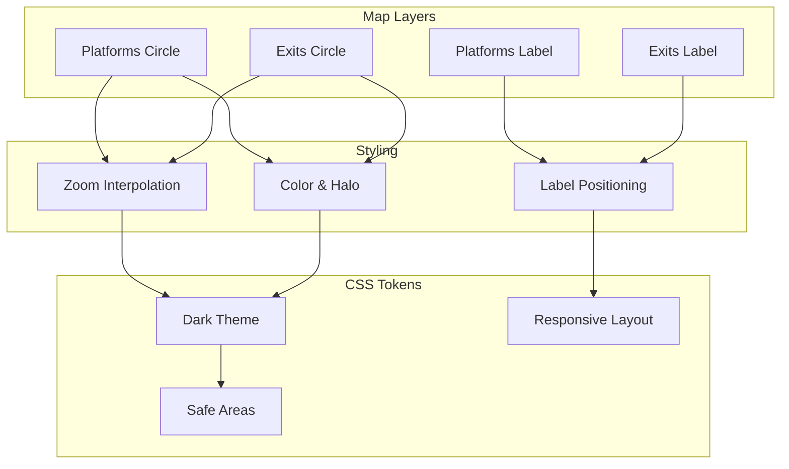
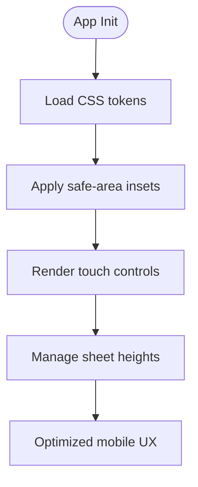
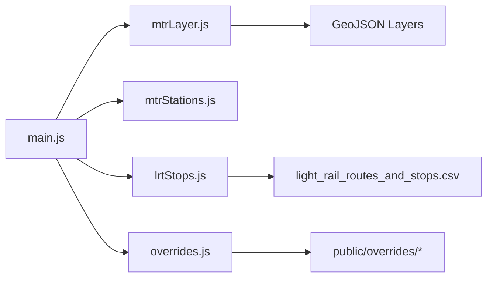

# Transit Station Visualization

<cite>
**Referenced Files in This Document**
- [mtrStations.js](file://src/mtrStations.js)
- [lrtStops.js](file://src/lrtStops.js)
- [mtrLayer.js](file://src/mtrLayer.js)
- [overrides.js](file://src/overrides.js)
- [main.js](file://src/main.js)
- [light_rail_routes_and_stops.csv](file://public/data/light_rail_routes_and_stops.csv)
- [lrt-platforms.geojson](file://public/mtr/lrt-platforms.geojson)
- [style.css](file://src/style.css)
</cite>

## Table of Contents
1. [Introduction](#introduction)
2. [Project Structure](#project-structure)
3. [Core Components](#core-components)
4. [Architecture Overview](#architecture-overview)
5. [Detailed Component Analysis](#detailed-component-analysis)
6. [Dependency Analysis](#dependency-analysis)
7. [Performance Considerations](#performance-considerations)
8. [Troubleshooting Guide](#troubleshooting-guide)
9. [Conclusion](#conclusion)
10. [Appendices](#appendices)

## Introduction
This document explains how the application visualizes MTR stations, exits, and platforms, with a focus on:
- Intelligent platform resolution that matches route stops to specific platforms using name matching, line hints, and proximity calculations.
- Light Rail platform handling including Tin Wing YOHO West indoor platform overrides and OSM stop position integration.
- Visual styling system for operator color-coding, zoom-dependent sizing, and label positioning.
- Implementation details for station code resolution, directional station handling (East/West distinctions), and popup information display.
- Mobile optimization for touch interactions and responsive design patterns.

The goal is to make the visualization accurate, robust, and user-friendly across devices while keeping implementation details traceable to source files.

## Project Structure
At a high level, the transit visualization spans several modules:
- Data sources: MTR station directory, LRT stops, GeoJSON layers for stations/exits/platforms, and LRT platform points.
- Resolution logic: Matching algorithms for MTR and LRT platforms, including overrides and fallbacks.
- Map rendering: MapLibre layer setup, filters, labels, and popups.
- UI and mobile UX: Styling tokens, responsive layout, and touch-friendly controls.



**Diagram sources**
- [main.js:1-175](file://src/main.js#L1-L175)
- [mtrLayer.js:28-161](file://src/mtrLayer.js#L28-L161)
- [mtrStations.js:1-118](file://src/mtrStations.js#L1-L118)
- [lrtStops.js:1-81](file://src/lrtStops.js#L1-L81)
- [overrides.js:168-239](file://src/overrides.js#L168-L239)
- [light_rail_routes_and_stops.csv:1-402](file://public/data/light_rail_routes_and_stops.csv#L1-L402)
- [lrt-platforms.geojson:1-1](file://public/mtr/lrt-platforms.geojson#L1-L1)
- [style.css:1-200](file://src/style.css#L1-L200)

**Section sources**
- [main.js:1-175](file://src/main.js#L1-L175)
- [mtrLayer.js:28-161](file://src/mtrLayer.js#L28-L161)
- [mtrStations.js:1-118](file://src/mtrStations.js#L1-L118)
- [lrtStops.js:1-81](file://src/lrtStops.js#L1-L81)
- [overrides.js:168-239](file://src/overrides.js#L168-L239)
- [light_rail_routes_and_stops.csv:1-402](file://public/data/light_rail_routes_and_stops.csv#L1-L402)
- [lrt-platforms.geojson:1-1](file://public/mtr/lrt-platforms.geojson#L1-L1)
- [style.css:1-200](file://src/style.css#L1-L200)

## Core Components
- MTR station directory and search/snap utilities: Provides English/Chinese names, coordinates, codes, and local search scoring to resolve free-text queries to MTR stations. It also supports access-pin overrides for routing accuracy.
- LRT stops and platform resolution: Maintains track-accurate OSM stop positions, applies static overrides, and resolves itinerary stops to precise platform points. Includes special handling for Tin Wing YOHO West indoor platforms.
- MTR map layers and platform resolver: Loads GeoJSON data, adds hidden-by-default layers, filters by active station codes/platform keys, and resolves route stops to exact platform features using explicit refs, line hints, and proximity.
- Overrides management: Centralized loading of hand-maintained overrides for LRT stops, MTR access pins, and bus shapes, with network fallbacks and caching.
- Main app orchestration: Initializes map, loads overrides, wires up search, plan, ETA, and visualization flows, integrating all components.

**Section sources**
- [mtrStations.js:136-215](file://src/mtrStations.js#L136-L215)
- [mtrStations.js:220-263](file://src/mtrStations.js#L220-L263)
- [mtrStations.js:279-334](file://src/mtrStations.js#L279-L334)
- [lrtStops.js:86-99](file://src/lrtStops.js#L86-L99)
- [lrtStops.js:156-199](file://src/lrtStops.js#L156-L199)
- [lrtStops.js:206-253](file://src/lrtStops.js#L206-L253)
- [mtrLayer.js:28-161](file://src/mtrLayer.js#L28-L161)
- [mtrLayer.js:229-330](file://src/mtrLayer.js#L229-L330)
- [overrides.js:168-239](file://src/overrides.js#L168-L239)
- [main.js:180-187](file://src/main.js#L180-L187)

## Architecture Overview
The platform resolution pipeline integrates multiple signals to select the correct platform feature for each route stop:

```mermaid
sequenceDiagram
participant App as "main.js"
participant Layer as "mtrLayer.js"
participant LRT as "lrtStops.js"
participant Geo as "GeoJSON Layers"
participant Over as "overrides.js"
App->>Over : loadStaticOverrides()
Over-->>App : lrt/mtr/bus overrides
App->>Layer : addMtrLayers(map)
Layer->>Geo : fetch stations/exits/platforms/lrt-platforms
App->>Layer : setRouteStationCodes(map, {stationCodes, platformKeys})
Note over Layer : Filters hide/show layers based on active codes/keys
App->>Layer : resolvePlatformForStop(stop, option)
alt Looks like LRT or Tin Wing
Layer->>Layer : looksLikeLrtOption / looksLikeLrtStopName
Layer->>Layer : resolveTinWingOverride(stop)
alt Override found
Layer-->>App : Tin Wing indoor platform point
else No override
Layer->>LRT : resolveLrtPlatformPoint(stop)
LRT-->>Layer : nearest OSM stop_position/platform
Layer-->>App : LRT platform result
end
else Heavy rail path
Layer->>Layer : parse explicit platform ref from name
Layer->>Layer : stationCodeFromName(name)
Layer->>Geo : filter platforms by station_code
alt Explicit ref match
Layer-->>App : matched platform feature
else Line hints match
Layer->>Layer : lineHintsFromOption(option)
Layer-->>App : best platform by hint score
else Proximity fallback
Layer->>Layer : nearest platform by lat/lon
Layer-->>App : closest platform feature
end
end
```

**Diagram sources**
- [main.js:180-187](file://src/main.js#L180-L187)
- [mtrLayer.js:28-161](file://src/mtrLayer.js#L28-L161)
- [mtrLayer.js:229-330](file://src/mtrLayer.js#L229-L330)
- [mtrLayer.js:332-440](file://src/mtrLayer.js#L332-L440)
- [lrtStops.js:206-253](file://src/lrtStops.js#L206-L253)
- [overrides.js:168-239](file://src/overrides.js#L168-L239)

## Detailed Component Analysis

### Intelligent Platform Resolution Algorithm
The algorithm selects the most appropriate platform for a given stop using a prioritized strategy:
- Explicit platform reference: If the stop includes a platform number or code, it is parsed from the stop name or fields and matched directly against platform features.
- Line hints: When no explicit ref exists, route metadata (short name, full name, ID) is converted into line hints (e.g., “east rail”, “tsuen wan”) and used to score platform names.
- Proximity calculation: As a final fallback, the algorithm computes distances between the stop’s coordinates and candidate platform points to pick the nearest one.



**Diagram sources**
- [mtrLayer.js:229-330](file://src/mtrLayer.js#L229-L330)
- [mtrLayer.js:332-440](file://src/mtrLayer.js#L332-L440)

**Section sources**
- [mtrLayer.js:229-330](file://src/mtrLayer.js#L229-L330)
- [mtrLayer.js:332-440](file://src/mtrLayer.js#L332-L440)

### Light Rail Platform Handling and Tin Wing YOHO West Overrides
Light Rail uses OSM-derived stop positions for precise placement. The system:
- Applies static overrides for LRT stops to ensure correctness.
- Resolves itinerary stops to the nearest OSM stop_position/platform when needed.
- Handles Tin Wing YOHO West indoor platforms explicitly, mapping platform numbers to indoor coordinates even when OSM data differs.

```mermaid
sequenceDiagram
participant Stop as "Itinerary Stop"
participant Resolver as "resolveLrtPlatform"
participant OSM as "OSM Platforms"
participant Over as "Tin Wing Override"
Stop->>Resolver : stop + optional location
Resolver->>OSM : Match by stop_name_en/name_zh
alt Name match yields candidates
Resolver->>OSM : Nearest by lat/lon if available
OSM-->>Resolver : Best platform feature
else No name match
Resolver->>Over : Resolve Tin Wing indoor override
Over-->>Resolver : Indoor platform point
end
Resolver-->>Stop : Platform key, ref, station info
```

**Diagram sources**
- [lrtStops.js:206-253](file://src/lrtStops.js#L206-L253)
- [mtrLayer.js:351-371](file://src/mtrLayer.js#L351-L371)
- [overrides.js:47-93](file://src/overrides.js#L47-L93)

**Section sources**
- [lrtStops.js:86-99](file://src/lrtStops.js#L86-L99)
- [lrtStops.js:156-199](file://src/lrtStops.js#L156-L199)
- [lrtStops.js:206-253](file://src/lrtStops.js#L206-L253)
- [mtrLayer.js:332-371](file://src/mtrLayer.js#L332-L371)
- [overrides.js:47-93](file://src/overrides.js#L47-L93)

### Station Code Resolution and Directional Handling
Station code resolution ensures that ambiguous names do not collapse directional pairs (e.g., Tsim Sha Tsui vs East Tsim Sha Tsui). The process:
- Normalizes input by stripping noise (“Station”, “MTR”, platform references).
- Enforces direction compatibility checks so “East”/“West”/“South”/“North” markers must match both sides of a pair.
- Uses Chinese names for stronger matching and prefers longer, more specific names when multiple matches exist.



**Diagram sources**
- [mtrLayer.js:486-521](file://src/mtrLayer.js#L486-L521)
- [mtrLayer.js:528-592](file://src/mtrLayer.js#L528-L592)

**Section sources**
- [mtrLayer.js:486-521](file://src/mtrLayer.js#L486-L521)
- [mtrLayer.js:528-592](file://src/mtrLayer.js#L528-L592)

### Popup Information Display
Popups provide contextual information for exits, stations, platforms, and route stops:
- Exit popups show exit identifiers, bilingual names, and level context.
- Station popups include station code, lines served, and exit counts.
- Platform popups display platform labels and codes.
- Route stop popups summarize role, platform reference, and mode.



**Diagram sources**
- [mtrLayer.js:597-632](file://src/mtrLayer.js#L597-L632)

**Section sources**
- [mtrLayer.js:597-632](file://src/mtrLayer.js#L597-L632)

### Visual Styling System
The styling system uses MapLibre paint expressions for zoom-dependent sizing and consistent colors:
- Platform circles scale with zoom levels for clarity at different scales.
- Exit circles use distinct colors and halos for visibility.
- Labels are positioned with offsets and fonts optimized for readability.
- CSS tokens define dark theme, glass effects, safe areas, and responsive dimensions for mobile.



**Diagram sources**
- [mtrLayer.js:70-161](file://src/mtrLayer.js#L70-L161)
- [style.css:1-200](file://src/style.css#L1-L200)

**Section sources**
- [mtrLayer.js:70-161](file://src/mtrLayer.js#L70-L161)
- [style.css:1-200](file://src/style.css#L1-L200)

### Mobile Optimization and Responsive Design
Mobile UX considerations include:
- Edge-to-edge layout with safe-area insets to avoid home indicator overlap.
- Touch-friendly controls and minimal tap targets adjusted for small screens.
- Responsive sheet heights and bottom dock spacing to keep content accessible.
- Acrylic UI tokens for consistent glass effects and ambient lighting.



**Diagram sources**
- [style.css:1-200](file://src/style.css#L1-L200)

**Section sources**
- [style.css:1-200](file://src/style.css#L1-L200)

## Dependency Analysis
Key dependencies and relationships:
- main.js orchestrates initialization and integrates mtrLayer, mtrStations, lrtStops, and overrides.
- mtrLayer depends on GeoJSON data sources and uses overrides for special cases.
- lrtStops depends on CSV route data and OSM platform points for precision.
- overrides provides static corrections for LRT stops and MTR access pins.



**Diagram sources**
- [main.js:1-175](file://src/main.js#L1-L175)
- [mtrLayer.js:28-161](file://src/mtrLayer.js#L28-L161)
- [lrtStops.js:1-81](file://src/lrtStops.js#L1-L81)
- [overrides.js:168-239](file://src/overrides.js#L168-L239)
- [light_rail_routes_and_stops.csv:1-402](file://public/data/light_rail_routes_and_stops.csv#L1-L402)

**Section sources**
- [main.js:1-175](file://src/main.js#L1-L175)
- [mtrLayer.js:28-161](file://src/mtrLayer.js#L28-L161)
- [lrtStops.js:1-81](file://src/lrtStops.js#L1-L81)
- [overrides.js:168-239](file://src/overrides.js#L168-L239)
- [light_rail_routes_and_stops.csv:1-402](file://public/data/light_rail_routes_and_stops.csv#L1-L402)

## Performance Considerations
- Filtering layers by active station codes and platform keys reduces rendering overhead.
- Zoom-dependent circle radii balance detail and performance across scales.
- Name normalization and scoring minimize expensive operations during search and snap.
- Static overrides reduce network calls and improve reliability for critical locations.

[No sources needed since this section provides general guidance]

## Troubleshooting Guide
Common issues and resolutions:
- Incorrect platform selection: Verify explicit platform refs and line hints; check proximity thresholds and coordinate validity.
- Tin Wing indoor mismatch: Ensure overrides are loaded and applied; confirm platform numbers map to indoor coordinates.
- Station name ambiguity: Confirm directional handling prevents collapsing pairs; validate normalization rules.
- Popup content missing: Check feature properties and ensure escape function handles special characters.

**Section sources**
- [mtrLayer.js:229-330](file://src/mtrLayer.js#L229-L330)
- [mtrLayer.js:332-440](file://src/mtrLayer.js#L332-L440)
- [mtrLayer.js:597-632](file://src/mtrLayer.js#L597-L632)
- [overrides.js:168-239](file://src/overrides.js#L168-L239)

## Conclusion
The transit station visualization combines robust data sources, intelligent matching algorithms, and responsive styling to deliver accurate and user-friendly platform displays. By leveraging name matching, line hints, proximity calculations, and targeted overrides, the system ensures reliable platform resolution across MTR and Light Rail networks. Mobile optimization and clear popups enhance usability, while modular architecture supports maintainability and extensibility.

[No sources needed since this section summarizes without analyzing specific files]

## Appendices
- Data sources: MTR stations, exits, platforms, and LRT platforms are sourced from GeoJSON files and OSM stop positions.
- Route data: Light Rail routes and stops are defined in CSV format for sequence and directionality.
- Overrides: Hand-maintained JSON files provide corrections for critical locations and behaviors.

[No sources needed since this section provides general guidance]