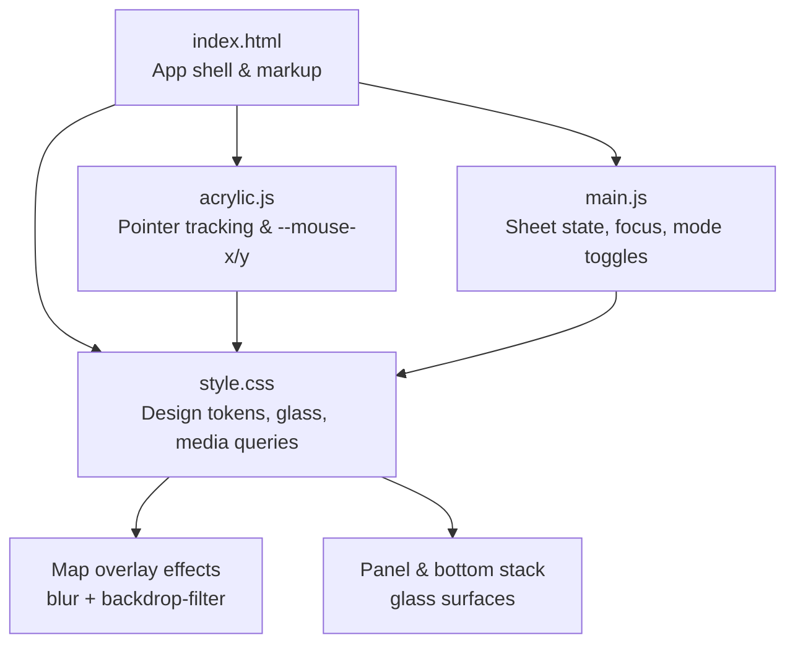
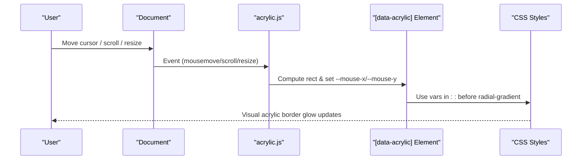
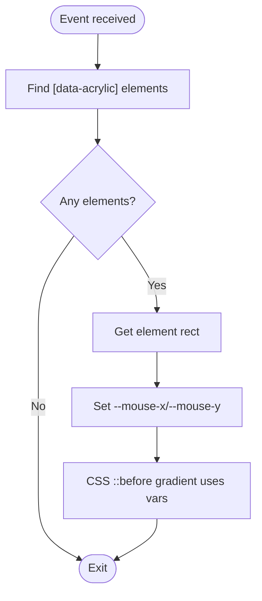
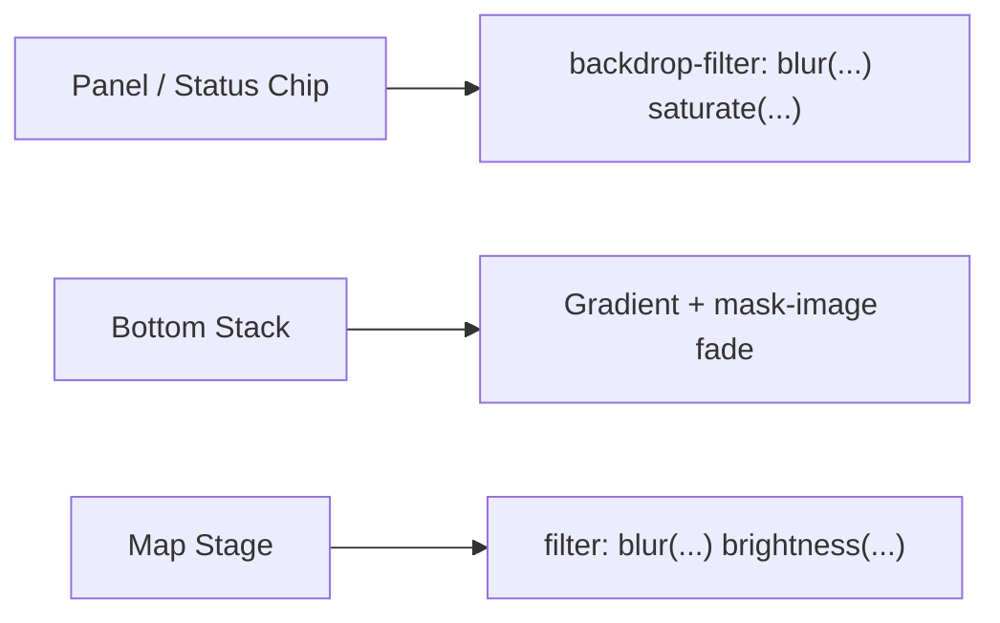
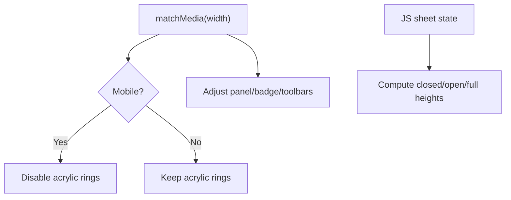
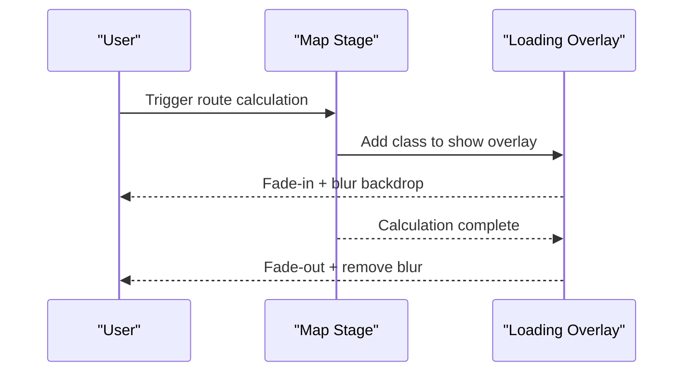
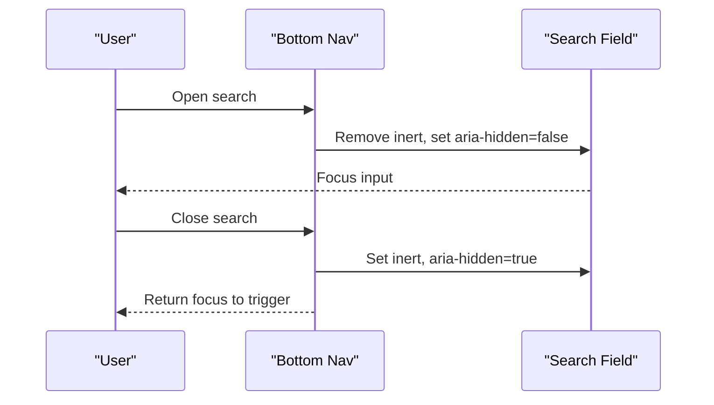
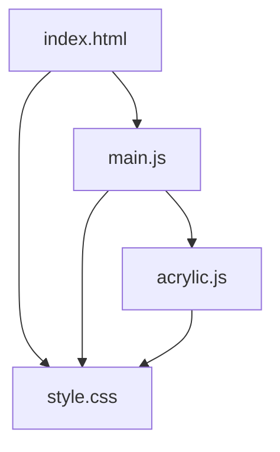

# UI Effects and Theming

<cite>
**Referenced Files in This Document**
- [acrylic.js](file://src/acrylic.js)
- [style.css](file://src/style.css)
- [index.html](file://index.html)
- [main.js](file://src/main.js)
</cite>

## Table of Contents
1. [Introduction](#introduction)
2. [Project Structure](#project-structure)
3. [Core Components](#core-components)
4. [Architecture Overview](#architecture-overview)
5. [Detailed Component Analysis](#detailed-component-analysis)
6. [Dependency Analysis](#dependency-analysis)
7. [Performance Considerations](#performance-considerations)
8. [Troubleshooting Guide](#troubleshooting-guide)
9. [Conclusion](#conclusion)

## Introduction
This document explains the UI effects and theming system that delivers a modern, glassmorphic interface with acrylic-style lighting, blur effects, and translucent overlays for map popups and panels. It covers:
- The acrylic effect implementation that tracks pointer position to create dynamic border lighting on interactive elements.
- The CSS custom properties (design tokens) that power consistent theming across components and modes.
- Responsive design patterns that adapt the layout and effects for desktop, tablet, and mobile devices.
- Animation transitions, focus management, and accessibility considerations.
- Browser compatibility notes and performance optimizations for visual effects on lower-end devices.

## Project Structure
The UI effects are implemented through a small JavaScript module and a comprehensive stylesheet:
- Acrylic lighting is provided by a lightweight script that updates CSS custom properties bound to pointer movement.
- The stylesheet defines design tokens, glass surfaces, backdrop filters, ambient orbs, and responsive rules.
- The HTML shell wires up key UI regions (map stage, panel, sheets, badges) and marks elements for acrylic effects.
- Main application logic coordinates sheet states, focus behavior, and mode-specific UI changes.



**Diagram sources**
- [index.html:76-106](file://index.html#L76-L106)
- [style.css:6-64](file://src/style.css#L6-L64)
- [acrylic.js:6-86](file://src/acrylic.js#L6-L86)
- [main.js:6641-6666](file://src/main.js#L6641-L6666)

**Section sources**
- [index.html:76-106](file://index.html#L76-L106)
- [style.css:6-64](file://src/style.css#L6-L64)
- [acrylic.js:6-86](file://src/acrylic.js#L6-L86)
- [main.js:6641-6666](file://src/main.js#L6641-L6666)

## Core Components
- Acrylic lighting module: Tracks pointer events and sets per-element light source variables used by CSS gradients to simulate edge glow.
- Design tokens: Centralized CSS custom properties for colors, radii, spacing, safe areas, and glass parameters.
- Glass surfaces: Panels, status chips, and bottom stacks use backdrop-filter blur and semi-transparent backgrounds to achieve frosted glass.
- Map overlays: Loading veil and route drawing states apply blur and dimming to the basemap while calculations run.
- Responsive behaviors: Media queries adjust positioning, sizes, and visibility based on viewport width; JS toggles classes for mobile-specific behavior.

**Section sources**
- [acrylic.js:6-86](file://src/acrylic.js#L6-L86)
- [style.css:6-64](file://src/style.css#L6-L64)
- [style.css:181-226](file://src/style.css#L181-L226)
- [style.css:241-357](file://src/style.css#L241-L357)
- [style.css:923-997](file://src/style.css#L923-L997)

## Architecture Overview
The acrylic effect architecture couples a minimal event-driven script with CSS custom properties and pseudo-elements:
- The script listens to mousemove/scroll/resize and computes relative pointer positions for each element marked with an acrylic attribute.
- CSS uses those variables to render a radial gradient at the pointer location, masked to the element’s border area, creating a glowing rim.
- On mobile or reduced-motion contexts, the effect is disabled or softened to preserve performance and accessibility.



**Diagram sources**
- [acrylic.js:19-53](file://src/acrylic.js#L19-L53)
- [style.css:181-226](file://src/style.css#L181-L226)

**Section sources**
- [acrylic.js:19-53](file://src/acrylic.js#L19-L53)
- [style.css:181-226](file://src/style.css#L181-L226)

## Detailed Component Analysis

### Acrylic Lighting Effect
- Purpose: Provide dynamic, pointer-following border lighting on interactive elements such as buttons, cards, and panels.
- Implementation highlights:
  - Elements marked with an acrylic attribute receive computed --mouse-x and --mouse-y values relative to their bounding box.
  - A ::before pseudo-element renders a radial gradient at the pointer position, masked to the element’s border region.
  - Opacity transitions animate the effect on hover; on mobile, the effect is hidden to avoid unnecessary rendering costs.
  - Events are passive where possible; recomputation is throttled via requestAnimationFrame and debounced on resize.



**Diagram sources**
- [acrylic.js:19-53](file://src/acrylic.js#L19-L53)
- [style.css:181-226](file://src/style.css#L181-L226)

**Section sources**
- [acrylic.js:6-86](file://src/acrylic.js#L6-L86)
- [style.css:181-226](file://src/style.css#L181-L226)

### Glass Surfaces and Backdrop Blur
- Purpose: Create translucent, blurred panels and overlays that sit above the map and content.
- Key techniques:
  - Panels and status chips use backdrop-filter blur with saturation boosts for a frosted glass look.
  - The bottom stack uses a gradient background with mask-image to fade into transparency near the top, maintaining readability over varied content.
  - Map loading states apply a subtle blur and dim to the basemap while computations run, improving perceived performance.



**Diagram sources**
- [style.css:527-558](file://src/style.css#L527-L558)
- [style.css:923-997](file://src/style.css#L923-L997)
- [style.css:241-357](file://src/style.css#L241-L357)

**Section sources**
- [style.css:527-558](file://src/style.css#L527-L558)
- [style.css:923-997](file://src/style.css#L923-L997)
- [style.css:241-357](file://src/style.css#L241-L357)

### Design Tokens and Theming
- Purpose: Centralize visual constants for consistent appearance across components and modes.
- Highlights:
  - Color palette, accent, borders, radii, fonts, and spacing are defined as CSS custom properties.
  - Safe-area insets and dynamic viewport units ensure proper layout under notches and home indicators.
  - Glass-related tokens standardize translucency and blur parameters across the UI.

```mermaid
classDiagram
class Tokens {
"+color-scheme"
"--bg-root"
"--bg-card"
"--text-primary"
"--accent"
"--radius-*"
"--safe-top/bottom"
"--panel-radius"
}
Tokens <.. "Used by" : Panels, Chips, Overlays
```

**Diagram sources**
- [style.css:6-64](file://src/style.css#L6-L64)

**Section sources**
- [style.css:6-64](file://src/style.css#L6-L64)

### Responsive Design Patterns
- Purpose: Ensure optimal UX across desktop, tablet, and mobile devices.
- Techniques:
  - Media queries adjust panel widths, badge placement, and toolbars based on breakpoints.
  - Mobile detection toggles a body class to disable heavy effects like acrylic rings when appropriate.
  - Sheet states and heights are computed and applied via JS to match device chrome and dock dimensions.



**Diagram sources**
- [acrylic.js:75-83](file://src/acrylic.js#L75-L83)
- [style.css:485-508](file://src/style.css#L485-L508)
- [main.js:6641-6666](file://src/main.js#L6641-L6666)

**Section sources**
- [acrylic.js:75-83](file://src/acrylic.js#L75-L83)
- [style.css:485-508](file://src/style.css#L485-L508)
- [main.js:6641-6666](file://src/main.js#L6641-L6666)

### Animations and Transitions
- Purpose: Provide smooth, performant transitions for UI state changes and loading feedback.
- Examples:
  - Map loading veil fades in/out with backdrop blur during route calculation.
  - Panel and toolbar transitions use cubic-bezier easing for natural motion.
  - Reduced motion preferences disable animations and simplify effects.



**Diagram sources**
- [style.css:241-357](file://src/style.css#L241-L357)

**Section sources**
- [style.css:241-357](file://src/style.css#L241-L357)

### Focus Management and Accessibility
- Purpose: Maintain keyboard navigation, screen reader support, and user control over interactions.
- Practices:
  - Interactive elements include aria attributes (e.g., expanded, controls, live regions).
  - Search morphs manage focus and inert attributes to keep only relevant controls active.
  - Visually hidden status elements remain accessible via aria-live for announcements.



**Diagram sources**
- [main.js:12004-12058](file://src/main.js#L12004-L12058)
- [index.html:90-105](file://index.html#L90-L105)

**Section sources**
- [main.js:12004-12058](file://src/main.js#L12004-L12058)
- [index.html:90-105](file://index.html#L90-L105)

## Dependency Analysis
- acrylic.js depends on DOM elements marked with an acrylic attribute and reads/writes CSS custom properties.
- style.css consumes those custom properties to render effects and applies backdrop filters and masks.
- main.js orchestrates UI state (sheet open/closed/full), which influences layout and effect visibility.
- index.html provides the structural anchors and initial attributes that drive both JS and CSS behaviors.



**Diagram sources**
- [index.html:76-106](file://index.html#L76-L106)
- [style.css:6-64](file://src/style.css#L6-L64)
- [acrylic.js:6-86](file://src/acrylic.js#L6-L86)
- [main.js:6641-6666](file://src/main.js#L6641-L6666)

**Section sources**
- [index.html:76-106](file://index.html#L76-L106)
- [style.css:6-64](file://src/style.css#L6-L64)
- [acrylic.js:6-86](file://src/acrylic.js#L6-L86)
- [main.js:6641-6666](file://src/main.js#L6641-L6666)

## Performance Considerations
- Pointer tracking is throttled using requestAnimationFrame and passive event listeners to minimize layout thrash.
- Acrylic rings are disabled on mobile via a body class to reduce GPU work on smaller screens.
- Map loading states use modest blur levels and short transition durations to balance clarity and responsiveness.
- Reduced motion preferences disable animations and simplify effects for users who prefer minimal motion.
- Backdrop filters and masks are used judiciously; consider reducing blur intensity or disabling effects on low-end devices if needed.

[No sources needed since this section provides general guidance]

## Troubleshooting Guide
- Acrylic effect not visible:
  - Ensure elements have the acrylic attribute and are connected to the DOM before initialization.
  - Verify that pointer events are firing and that --mouse-x/--mouse-y are being set.
  - On mobile, check whether the mobile-ui class disables the effect intentionally.
- Excessive blur or lag:
  - Reduce backdrop-filter blur radius or disable effects on lower-end devices.
  - Confirm that reduced motion settings are respected.
- Focus issues during search morph:
  - Confirm that inert and aria-hidden attributes are correctly toggled when opening/closing search.
  - Ensure focus is moved to the intended input after transitions complete.

**Section sources**
- [acrylic.js:6-86](file://src/acrylic.js#L6-L86)
- [style.css:241-357](file://src/style.css#L241-L357)
- [main.js:12004-12058](file://src/main.js#L12004-L12058)

## Conclusion
The UI effects and theming system combines a lightweight acrylic lighting module with robust CSS design tokens and responsive patterns to deliver a modern, glassmorphic interface. By leveraging CSS custom properties, backdrop filters, and careful animation strategies, the application achieves a cohesive visual language across devices. Accessibility and performance are considered throughout, with reduced motion support, focus management, and mobile-specific optimizations ensuring a smooth experience for all users.

[No sources needed since this section summarizes without analyzing specific files]