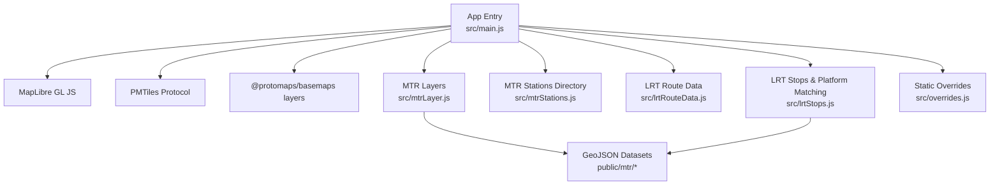
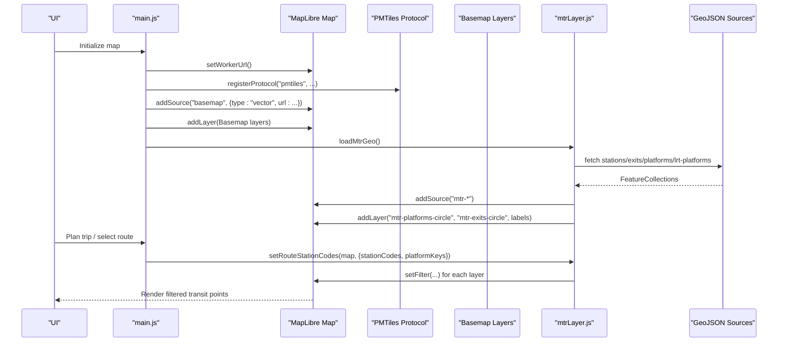
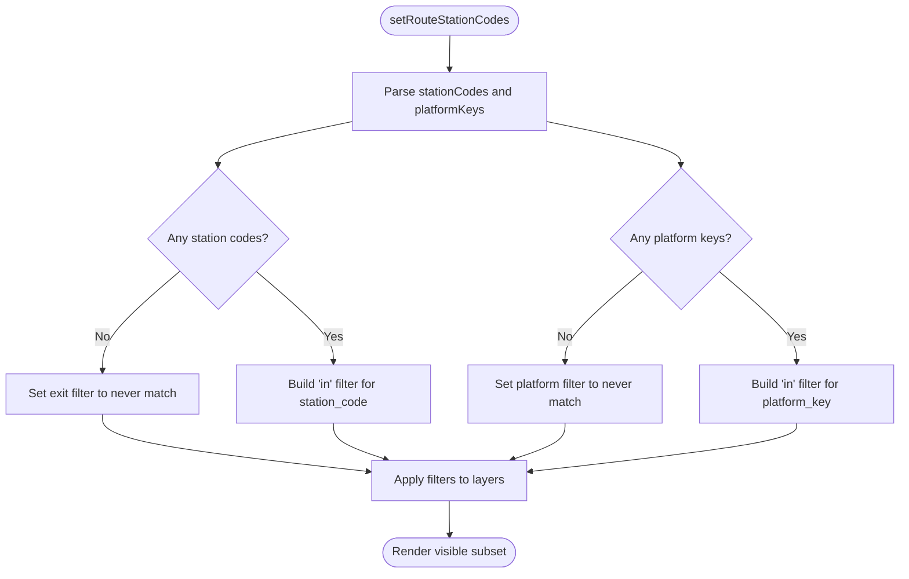
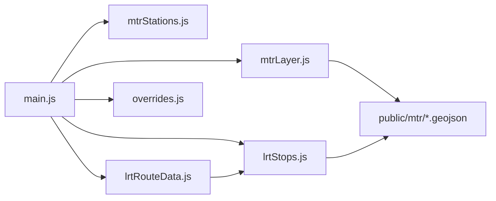

# Vector Tile Rendering

<cite>
**Referenced Files in This Document**
- [main.js](file://src/main.js)
- [mtrLayer.js](file://src/mtrLayer.js)
- [mtrStations.js](file://src/mtrStations.js)
- [lrtRouteData.js](file://src/lrtRouteData.js)
- [lrtStops.js](file://src/lrtStops.js)
- [overrides.js](file://src/overrides.js)
- [stations.geojson](file://public/mtr/stations.geojson)
- [exits.geojson](file://public/mtr/exits.geojson)
- [platforms.geojson](file://public/mtr/platforms.geojson)
- [lrt-platforms.geojson](file://public/mtr/lrt-platforms.geojson)
</cite>

## Table of Contents
1. [Introduction](#introduction)
2. [Project Structure](#project-structure)
3. [Core Components](#core-components)
4. [Architecture Overview](#architecture-overview)
5. [Detailed Component Analysis](#detailed-component-analysis)
6. [Dependency Analysis](#dependency-analysis)
7. [Performance Considerations](#performance-considerations)
8. [Troubleshooting Guide](#troubleshooting-guide)
9. [Conclusion](#conclusion)

## Introduction
This document explains MorganTraveler’s vector tile rendering system with a focus on MapLibre GL integration and the use of PMTiles for basemap delivery. It details how GeoJSON datasets for MTR stations, exits, platforms, and Light Rail (LRT) platforms are loaded into MapLibre sources and layers, how dynamic filtering is applied based on route selection and zoom level, and how performance is optimized to render thousands of transit points efficiently. It also covers caching strategies, memory management, progressive loading, basemap provider integration, and custom styling approaches for transit-specific visualizations.

## Project Structure
The rendering pipeline centers around:
- A MapLibre map instance configured with a PMTiles protocol and worker URL
- Static GeoJSON datasets for MTR and LRT features
- Layer modules that add sources and layers, then apply filters based on user interactions
- Route data modules that provide stop sequences and directions for LRT
- Overrides module that applies static corrections for stops and access pins

**Diagram sources**
- [main.js:1-20](file://src/main.js#L1-L20)
- [main.js:189-210](file://src/main.js#L189-L210)
- [mtrLayer.js:28-67](file://src/mtrLayer.js#L28-L67)
- [mtrStations.js:13-118](file://src/mtrStations.js#L13-L118)
- [lrtRouteData.js:176-287](file://src/lrtRouteData.js#L176-L287)
- [lrtStops.js:11-81](file://src/lrtStops.js#L11-L81)
- [overrides.js:168-240](file://src/overrides.js#L168-L240)

**Section sources**
- [main.js:1-210](file://src/main.js#L1-L210)

## Core Components
- Map initialization and PMTiles setup: The app configures MapLibre with a dedicated worker URL and registers a PMTiles protocol pointing to a hosted Hong Kong tiles file. Basemap layers from @protomaps/basemaps are used as the base layer.
- MTR layer module: Loads four GeoJSON FeatureCollections (stations, exits, platforms, lrt-platforms), adds them as MapLibre sources, and creates circle/symbol layers for platforms and exits with zoom-dependent sizing and labels. Filters hide all features until a route plan sets station codes or platform keys.
- MTR stations directory: Provides local search and snapping to MTR stations using a curated list and overrides for access pins. Used by routing and search flows.
- LRT route data: Parses CSV route-stop sequences, merges overrides for peak-only routes, and exposes direction and stop sequence APIs. Coordinates are resolved via LRT stops directory.
- LRT stops and platform matching: Maintains track-accurate LRT stop coordinates and provides name-based and proximity-based matching to select the correct platform point for itinerary geometry.
- Overrides: Loads static overrides for LRT stops, MTR access pins, and bus shapes from bundled JSON files or remote endpoints, applying them at startup.

**Section sources**
- [main.js:189-210](file://src/main.js#L189-L210)
- [mtrLayer.js:28-161](file://src/mtrLayer.js#L28-L161)
- [mtrStations.js:13-118](file://src/mtrStations.js#L13-L118)
- [lrtRouteData.js:176-287](file://src/lrtRouteData.js#L176-L287)
- [lrtStops.js:11-81](file://src/lrtStops.js#L11-L81)
- [overrides.js:168-240](file://src/overrides.js#L168-L240)

## Architecture Overview
The rendering architecture integrates MapLibre GL with PMTiles for basemap delivery and uses client-side GeoJSON sources for transit overlays. Dynamic filtering controls visibility based on route selection, while zoom levels control label and marker density.

**Diagram sources**
- [main.js:189-210](file://src/main.js#L189-L210)
- [mtrLayer.js:28-161](file://src/mtrLayer.js#L28-L161)
- [mtrLayer.js:178-219](file://src/mtrLayer.js#L178-L219)

## Detailed Component Analysis

### MapLibre and PMTiles Integration
- Worker configuration: The app pins the MapLibre worker URL to ensure sibling module resolution under Vite prebundling.
- PMTiles protocol: Registers a protocol handler pointing to a Hong Kong PMTiles file served from an edge proxy or CDN. Basemap layers from @protomaps/basemaps are added as vector sources and layers.
- Basemap providers: Uses Protomaps basemap layers; additional providers can be integrated by adding new vector sources and layers following the same pattern.

**Section sources**
- [main.js:189-210](file://src/main.js#L189-L210)

### MTR Stations, Exits, Platforms, and LRT Platforms
- Data loading: The module loads four GeoJSON FeatureCollections concurrently and caches them in memory. If lrt-platforms fails to load, it falls back to an empty collection.
- Source and layer creation: Adds sources for stations, exits, and platforms. Creates circle and symbol layers for platforms and exits with minzoom constraints and zoom-interpolated radii. Station centroids are intentionally not drawn; only exits and platforms are rendered.
- Dynamic filtering: Two “never” filters hide all features initially. When a route plan sets station codes and platform keys, the module updates layer filters to show only relevant exits and platforms.
- Platform resolution: For each plan stop, the module resolves the best platform feature by:
  - Preferring explicit platform references
  - Matching line/route hints for heavy rail lines
  - Falling back to nearest coordinate distance when needed
  - Handling LRT specially via tin wing overrides and OSM stop positions

**Diagram sources**
- [mtrLayer.js:178-219](file://src/mtrLayer.js#L178-L219)

**Section sources**
- [mtrLayer.js:28-161](file://src/mtrLayer.js#L28-L161)
- [mtrLayer.js:178-219](file://src/mtrLayer.js#L178-L219)
- [mtrLayer.js:229-330](file://src/mtrLayer.js#L229-L330)
- [mtrLayer.js:376-440](file://src/mtrLayer.js#L376-L440)

### MTR Stations Directory and Search
- Local station list: A curated array of MTR stations with English/Chinese names, coordinates, and codes supports fast local search and snapping.
- Access pin overrides: Static overrides adjust certain station coordinates to improve routing accuracy (e.g., Airport Express boards).
- Merge strategy: When merging external station data, locked access pins are preserved while other coordinates may be updated.

**Section sources**
- [mtrStations.js:13-118](file://src/mtrStations.js#L13-L118)
- [mtrStations.js:279-334](file://src/mtrStations.js#L279-L334)

### Light Rail Route Data and Stop Sequences
- CSV parsing: The module parses the LRT route-stop CSV with flexible header detection and merges local overrides for peak-only routes missing from open data.
- Directions and sequences: Exposes APIs to get route directions and ordered stop sequences, resolving coordinates via the LRT stops directory.
- Fallback behavior: If CSV fetch fails, the module still returns override rows so critical routes remain functional offline.

**Section sources**
- [lrtRouteData.js:176-287](file://src/lrtRouteData.js#L176-L287)
- [lrtRouteData.js:293-429](file://src/lrtRouteData.js#L293-L429)

### LRT Stops and Platform Matching
- Track-accurate coordinates: The LRT stops dataset contains precise coordinates derived from OpenStreetMap stop positions.
- Name and proximity matching: Provides functions to match place names or coordinates to official LRT stops and to resolve the nearest platform point for itinerary geometry.
- Overrides: Applies static overrides for LRT stops to correct coordinates and metadata.

**Section sources**
- [lrtStops.js:11-81](file://src/lrtStops.js#L11-L81)
- [lrtStops.js:86-99](file://src/lrtStops.js#L86-L99)
- [lrtStops.js:156-253](file://src/lrtStops.js#L156-L253)

### Static Overrides Management
- Loading strategy: Fetches LRT and MTR access pin overrides from bundled JSON files, with fallbacks embedded in code. Bus shape overrides prefer live GitHub content via a same-origin API or raw URL, falling back to a local bundle.
- Application: Overrides are applied early in startup to ensure accurate station and stop coordinates before routing and rendering.

**Section sources**
- [overrides.js:168-240](file://src/overrides.js#L168-L240)

## Dependency Analysis
The components have clear separation of concerns:
- main.js orchestrates MapLibre setup, PMTiles protocol registration, and initial calls to layer modules.
- mtrLayer.js depends on GeoJSON datasets and exposes functions to add sources/layers and update filters.
- mtrStations.js provides a directory and search utilities used by routing and snapping logic.
- lrtRouteData.js depends on lrtStops.js for coordinate resolution and supplies route-direction APIs.
- overrides.js centralizes static correction data and is consumed by multiple modules.

**Diagram sources**
- [main.js:189-210](file://src/main.js#L189-L210)
- [mtrLayer.js:28-67](file://src/mtrLayer.js#L28-L67)
- [lrtRouteData.js:176-287](file://src/lrtRouteData.js#L176-L287)
- [lrtStops.js:11-81](file://src/lrtStops.js#L11-L81)
- [overrides.js:168-240](file://src/overrides.js#L168-L240)

**Section sources**
- [main.js:189-210](file://src/main.js#L189-L210)
- [mtrLayer.js:28-67](file://src/mtrLayer.js#L28-L67)
- [lrtRouteData.js:176-287](file://src/lrtRouteData.js#L176-L287)
- [lrtStops.js:11-81](file://src/lrtStops.js#L11-L81)
- [overrides.js:168-240](file://src/overrides.js#L168-L240)

## Performance Considerations
- Caching GeoJSON in memory: The MTR layer module caches FeatureCollections after first load to avoid repeated network requests.
- Zoom-level optimization: Circle radius interpolation and minzoom constraints reduce label clutter and marker size at low zoom levels. Labels appear only at higher zooms to save rendering cost.
- Dynamic filtering: By default, layers are hidden with “never” filters and only shown when a route plan sets specific station codes or platform keys. This minimizes the number of features processed per frame.
- Progressive loading: LRT route data tries multiple sources (bundled CSV, proxy, direct) and caches results. Failures fall back to embedded overrides to keep critical routes working without blocking UI.
- Memory management: Large GeoJSON arrays are kept in module-scoped variables; reuse across renders avoids GC churn. When adding new datasets, consider lazy-loading or tiling if sizes grow significantly.
- Basemap delivery via PMTiles: Vector tiles are streamed and cached by the browser and MapLibre worker, reducing payload size and improving pan/zoom responsiveness.

[No sources needed since this section provides general guidance]

## Troubleshooting Guide
- PMTiles not loading: Ensure the PMTiles URL is reachable and CORS is configured correctly. In development, the app uses an edge proxy to avoid cross-origin issues.
- Worker URL mismatch: If MapLibre worker fails to load, verify the pinned worker URL matches the build output path.
- No MTR overlays appearing: Check that setRouteStationCodes has been called with valid station codes and platform keys; otherwise, filters will hide all features.
- LRT CSV failures: If CSV fetch fails, the module falls back to embedded overrides. Verify network connectivity and headers; check console logs for error messages.
- Incorrect platform selection: Use resolvePlatformForStop or resolveLrtPlatform to ensure the correct platform is chosen based on explicit references, line hints, or proximity.

**Section sources**
- [main.js:189-210](file://src/main.js#L189-L210)
- [mtrLayer.js:178-219](file://src/mtrLayer.js#L178-L219)
- [lrtRouteData.js:176-287](file://src/lrtRouteData.js#L176-L287)

## Conclusion
MorganTraveler’s vector tile rendering system combines MapLibre GL with PMTiles for efficient basemap delivery and leverages client-side GeoJSON sources for detailed transit overlays. The design emphasizes performance through in-memory caching, zoom-aware rendering, and dynamic filtering tied to route selection. Robust fallbacks and static overrides ensure reliability even when network resources are unavailable. The modular architecture allows easy integration of additional basemap providers and custom styling for transit-specific visualizations.