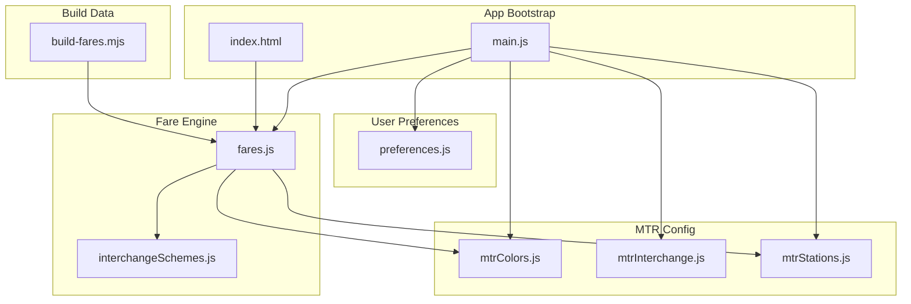
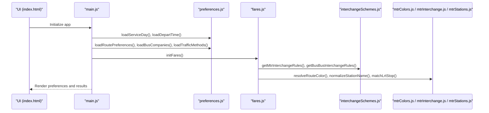
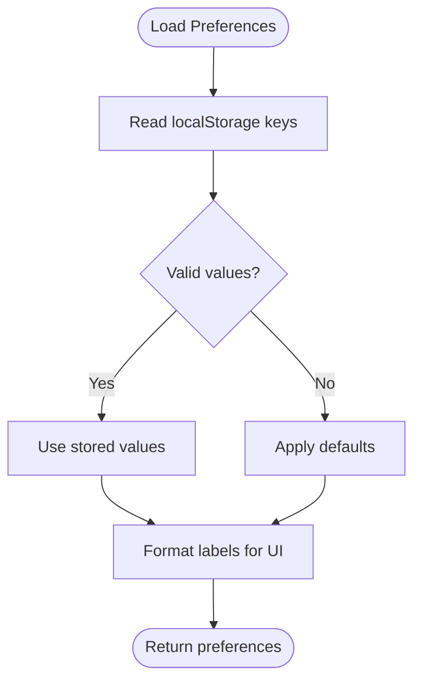
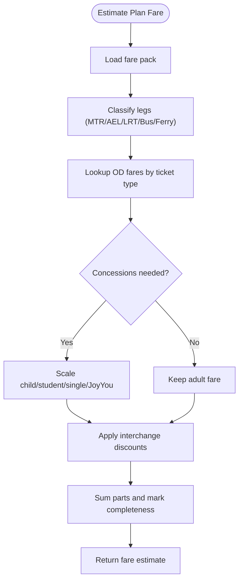
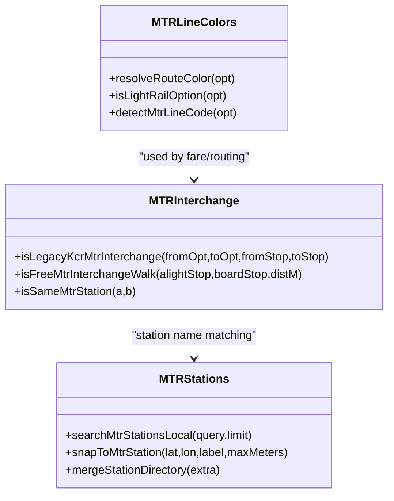
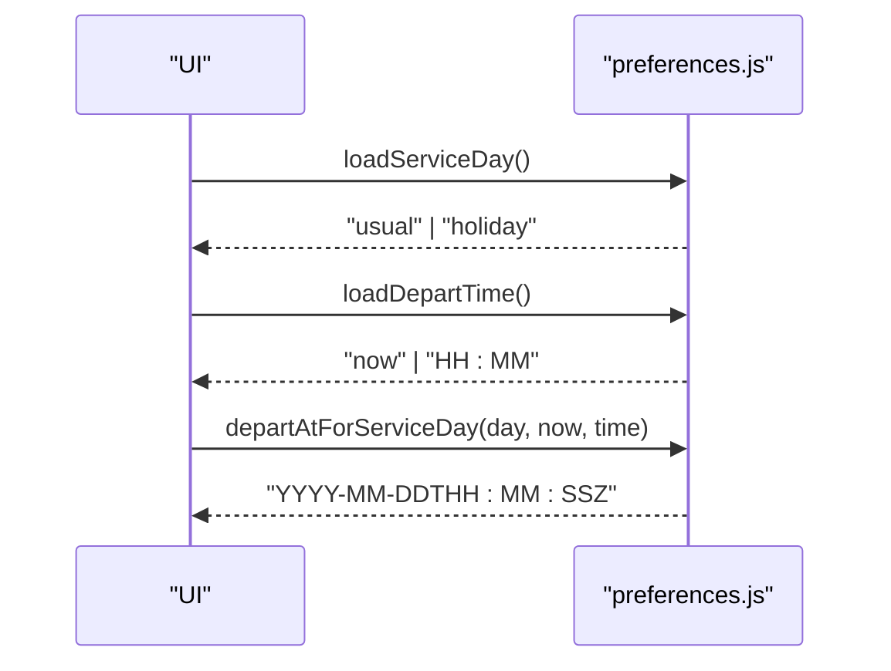
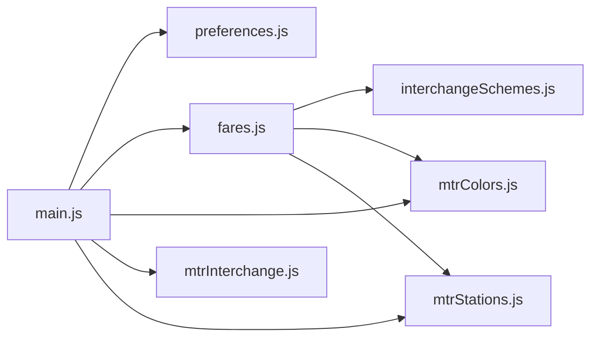

# Preferences and Configuration

<cite>
**Referenced Files in This Document**
- [preferences.js](file://src/preferences.js)
- [fares.js](file://src/fares.js)
- [mtrColors.js](file://src/mtrColors.js)
- [mtrInterchange.js](file://src/mtrInterchange.js)
- [mtrStations.js](file://src/mtrStations.js)
- [interchangeSchemes.js](file://src/interchangeSchemes.js)
- [main.js](file://src/main.js)
- [index.html](file://index.html)
- [build-fares.mjs](file://scripts/build-fares.mjs)
</cite>

## Table of Contents
1. Introduction
2. Project Structure
3. Core Components
4. Architecture Overview
5. Detailed Component Analysis
6. Dependency Analysis
7. Performance Considerations
8. Troubleshooting Guide
9. Conclusion

## Introduction
This document explains MorganTraveler’s preferences and configuration system with a focus on user customization and operational settings. It covers:
- Preference management for routing strategies, preferred operators, and display options, persisted locally.
- The fare calculation engine supporting multiple payment methods across MTR, AEL, LRT, buses, minibuses, and ferries.
- MTR-specific configurations including line color schemes, station naming conventions, and interchange handling.
- Service day configuration for weekday/holiday schedules with automatic detection and manual overrides.
- Implementation details for default value management, validation, and data loading patterns used throughout the app.

## Project Structure
The preferences and configuration logic is primarily implemented in client-side modules under src/. Key areas:
- User preferences and service day/time: src/preferences.js
- Fare estimation and ticket types: src/fares.js
- MTR line colors and light rail detection: src/mtrColors.js
- Interchange rules and penalties: src/mtrInterchange.js
- Station directory and search/snap: src/mtrStations.js
- Interchange discount scheme compilation: src/interchangeSchemes.js
- Application bootstrap wiring preferences and fares: src/main.js
- UI selection for fare types: index.html
- Fare matrix build script: scripts/build-fares.mjs

**Diagram sources**
- [main.js:18-80](file://src/main.js#L18-L80)
- [preferences.js:1-69](file://src/preferences.js#L1-L69)
- [fares.js:14-82](file://src/fares.js#L14-L82)
- [mtrColors.js:12-29](file://src/mtrColors.js#L12-L29)
- [mtrInterchange.js:20-65](file://src/mtrInterchange.js#L20-L65)
- [mtrStations.js:1-6](file://src/mtrStations.js#L1-L6)
- [interchangeSchemes.js:1-8](file://src/interchangeSchemes.js#L1-L8)
- [build-fares.mjs:143-178](file://scripts/build-fares.mjs#L143-L178)

**Section sources**
- [main.js:18-80](file://src/main.js#L18-L80)
- [preferences.js:1-69](file://src/preferences.js#L1-L69)
- [fares.js:14-82](file://src/fares.js#L14-L82)

## Core Components
- Preferences module: stores and validates user choices for route ranking goals, bus companies, traffic modes, service day, and departure time; persists to localStorage; provides labels and formatting helpers.
- Fare engine: loads fare matrices, resolves ticket types, estimates per-leg and total fares, applies interchanges and concessions, and formats currency.
- MTR configuration: defines official line brand colors, detects light rail vs heavy rail, normalizes station names, and identifies free or long interchanges.
- Interchange schemes: compiles MTR and bus-bus interchange rules from JSON, enabling discounts and exclusions.
- App bootstrap: initializes overrides, merges station directories, wires preferences into routing and fare estimation, and exposes UI controls.

**Section sources**
- [preferences.js:21-69](file://src/preferences.js#L21-L69)
- [fares.js:40-82](file://src/fares.js#L40-L82)
- [mtrColors.js:12-29](file://src/mtrColors.js#L12-L29)
- [mtrInterchange.js:20-65](file://src/mtrInterchange.js#L20-L65)
- [interchangeSchemes.js:118-171](file://src/interchangeSchemes.js#L118-L171)
- [main.js:18-80](file://src/main.js#L18-L80)

## Architecture Overview
The system separates concerns:
- Preferences are read/written via typed getters/setters that validate inputs and persist to localStorage.
- Fare estimation composes matrices (MTR/AEL/LRT/bus/ferry), applies interchange discounts, and scales by ticket type.
- MTR-specific logic ensures correct line colors, station matching, and realistic interchange times.
- The application bootstraps these modules, applying static overrides and merging external data sources.

**Diagram sources**
- [main.js:18-80](file://src/main.js#L18-L80)
- [preferences.js:106-128](file://src/preferences.js#L106-L128)
- [fares.js:460-503](file://src/fares.js#L460-L503)
- [interchangeSchemes.js:136-171](file://src/interchangeSchemes.js#L136-L171)
- [mtrColors.js:65-95](file://src/mtrColors.js#L65-L95)
- [mtrInterchange.js:155-208](file://src/mtrInterchange.js#L155-L208)
- [mtrStations.js:136-215](file://src/mtrStations.js#L136-L215)

## Detailed Component Analysis

### Preferences Management System
- Stores multi-select preferences for:
  - Route ranking goals: fastest, simplest, cheapest.
  - Bus companies: KMB/LWB, CTB, NLB, GMB.
  - Traffic methods: bus, GMB, LRT, MTR, walk, AEL.
  - Service day: usual (weekday-like) or holiday (Sunday-like).
  - Departure time: “now” or fixed HH:MM in Hong Kong local time.
- Persistence: all values saved to localStorage with dedicated keys; defaults applied when missing or invalid.
- Validation: strict validators ensure only allowed values are stored; malformed entries are ignored.
- Formatting: human-friendly labels for UI, including timezone-aware labels for departure time.
- Service day scheduling: computes a RAPTOR-compatible depart_at string aligned to Hong Kong wall clock and target day-of-week.

Key behaviors:
- Migration from legacy single-value preference to array-based storage.
- Robust parsing of departure time strings and normalization to HH:MM.
- Deterministic fallbacks to safe defaults when storage is unavailable or corrupted.

**Diagram sources**
- [preferences.js:330-364](file://src/preferences.js#L330-L364)
- [preferences.js:369-431](file://src/preferences.js#L369-L431)
- [preferences.js:106-128](file://src/preferences.js#L106-L128)
- [preferences.js:142-203](file://src/preferences.js#L142-L203)

**Section sources**
- [preferences.js:21-69](file://src/preferences.js#L21-L69)
- [preferences.js:106-128](file://src/preferences.js#L106-L128)
- [preferences.js:142-203](file://src/preferences.js#L142-L203)
- [preferences.js:330-431](file://src/preferences.js#L330-L431)

### Fare Calculation Engine
- Ticket types supported: Octopus Adult/Elderly/Child/Student/JoyYou variants, QR Code Adult/Child, Single Ride/Cash, Contactless Bank Cards, China T-Union Cards.
- Matrices loaded at runtime include MTR, AEL, LRT, MTR Bus, and full-journey bus/ferry fares.
- Mapping from UI ticket type to matrix key ensures correct lookup and fallbacks when specific columns are missing.
- Concession scaling: child/student rates derived from adult where needed; single ride scaled up; JoyYou formulas applied per leg.
- Interchange discounts: MTR and bus-bus interchange rules compiled from JSON; discounts applied based on operator/route/station criteria and time windows.
- Free connections: AEL↔MTR domestic connection treated as free for eligible ticket types; certain border stations excluded from JoyYou concessions.

Implementation highlights:
- Normalization of station names to match matrix keys.
- Graceful fallbacks when matrices are incomplete or missing.
- Currency formatting and consistent HKD units.

**Diagram sources**
- [fares.js:460-503](file://src/fares.js#L460-L503)
- [fares.js:643-689](file://src/fares.js#L643-L689)
- [fares.js:696-748](file://src/fares.js#L696-L748)
- [fares.js:755-783](file://src/fares.js#L755-L783)
- [fares.js:791-820](file://src/fares.js#L791-L820)
- [interchangeSchemes.js:118-171](file://src/interchangeSchemes.js#L118-L171)

**Section sources**
- [fares.js:40-82](file://src/fares.js#L40-L82)
- [fares.js:197-234](file://src/fares.js#L197-L234)
- [fares.js:505-576](file://src/fares.js#L505-L576)
- [fares.js:643-748](file://src/fares.js#L643-L748)
- [fares.js:791-820](file://src/fares.js#L791-L820)
- [interchangeSchemes.js:118-171](file://src/interchangeSchemes.js#L118-L171)

### MTR-Specific Configurations
- Line color schemes: official brand colors for heavy rail lines; Light Rail identified separately; bus routes retain GTFS colors to avoid misclassification.
- Station naming conventions: normalization removes platform suffixes and bilingual noise; aliases map common variants to canonical names; East parent/child distinctions preserved.
- Interchange identification: distinguishes integrated hubs, long former KCR–MTR style interchanges, and free indoor/outdoor links; applies extra time penalties where appropriate.

**Diagram sources**
- [mtrColors.js:65-95](file://src/mtrColors.js#L65-L95)
- [mtrColors.js:138-204](file://src/mtrColors.js#L138-L204)
- [mtrInterchange.js:155-208](file://src/mtrInterchange.js#L155-L208)
- [mtrInterchange.js:273-318](file://src/mtrInterchange.js#L273-L318)
- [mtrStations.js:136-215](file://src/mtrStations.js#L136-L215)

**Section sources**
- [mtrColors.js:12-29](file://src/mtrColors.js#L12-L29)
- [mtrColors.js:65-95](file://src/mtrColors.js#L65-L95)
- [mtrColors.js:138-204](file://src/mtrColors.js#L138-L204)
- [mtrInterchange.js:20-65](file://src/mtrInterchange.js#L20-L65)
- [mtrInterchange.js:155-208](file://src/mtrInterchange.js#L155-L208)
- [mtrInterchange.js:273-318](file://src/mtrInterchange.js#L273-L318)
- [mtrStations.js:136-215](file://src/mtrStations.js#L136-L215)

### Service Day Configuration System
- Supports “usual” (weekday-like) and “holiday” (Sunday-like) service days.
- Automatic detection uses Hong Kong calendar parts to compute target day-of-week and shifts the date accordingly.
- Manual override allows setting a fixed departure time (“now” or HH:MM) while preserving service day semantics.
- Produces a RAPTOR-compatible ISO string representing service time without real-time zone conversion.

**Diagram sources**
- [preferences.js:106-128](file://src/preferences.js#L106-L128)
- [preferences.js:142-203](file://src/preferences.js#L142-L203)
- [preferences.js:306-325](file://src/preferences.js#L306-L325)

**Section sources**
- [preferences.js:106-128](file://src/preferences.js#L106-L128)
- [preferences.js:142-203](file://src/preferences.js#L142-L203)
- [preferences.js:306-325](file://src/preferences.js#L306-L325)

### Default Value Management and Validation
- All preference getters return validated values; if missing or invalid, safe defaults are applied.
- Validators enforce allowed enums for route preferences, bus companies, traffic methods, and service days.
- Fare type normalization maps legacy IDs to current types and falls back to adult Octopus when unknown.
- Storage operations catch errors (e.g., private mode) and ignore failures gracefully.

**Section sources**
- [preferences.js:75-101](file://src/preferences.js#L75-L101)
- [preferences.js:330-431](file://src/preferences.js#L330-L431)
- [fares.js:94-120](file://src/fares.js#L94-L120)

### Configuration Data Loading
- Fare matrices are fetched at runtime with cache busting; warnings logged if concession matrices are incomplete.
- Interchange schemes are compiled from bundled JSON; bus-bus compact pairs are loaded asynchronously.
- Station directory can be merged from external GeoJSON and overridden by static access pins.

**Section sources**
- [fares.js:460-503](file://src/fares.js#L460-L503)
- [interchangeSchemes.js:118-171](file://src/interchangeSchemes.js#L118-L171)
- [interchangeSchemes.js:183-240](file://src/interchangeSchemes.js#L183-L240)
- [mtrStations.js:279-334](file://src/mtrStations.js#L279-L334)

## Dependency Analysis
- main.js imports and wires preferences, fares, MTR config, and ETA modules during initialization.
- fares.js depends on interchange schemes and MTR utilities for accurate cost modeling.
- preferences.js is independent but consumed by main.js to configure routing and display.
- mtrColors.js and mtrInterchange.js provide shared MTR-specific logic reused by fares and routing.

**Diagram sources**
- [main.js:18-80](file://src/main.js#L18-L80)
- [fares.js:14-23](file://src/fares.js#L14-L23)
- [interchangeSchemes.js:1-8](file://src/interchangeSchemes.js#L1-L8)

**Section sources**
- [main.js:18-80](file://src/main.js#L18-L80)
- [fares.js:14-23](file://src/fares.js#L14-L23)

## Performance Considerations
- Fare matrices and interchange schemes are loaded once and cached; subsequent calls reuse in-memory structures.
- Asynchronous loading of bus-bus compact pairs avoids blocking initial render.
- LocalStorage operations are wrapped in try/catch to prevent UI stalls in restricted environments.
- Station name normalization reduces repeated expensive lookups by caching normalized forms within functions.

[No sources needed since this section provides general guidance]

## Troubleshooting Guide
Common issues and resolutions:
- Missing fare matrices: ensure build step runs to generate hk-fares.json; check console warnings about incomplete concession matrices.
- Invalid preferences: verify localStorage keys and values; defaults will apply automatically if corrupted.
- Incorrect line colors: confirm route metadata includes proper mode/agency; bus routes should not be forced to MTR colors.
- Interchange penalties too high: check whether stations are recognized as integrated hubs or free links; verify stop names match expected patterns.

**Section sources**
- [fares.js:460-503](file://src/fares.js#L460-L503)
- [preferences.js:330-431](file://src/preferences.js#L330-L431)
- [mtrColors.js:65-95](file://src/mtrColors.js#L65-L95)
- [mtrInterchange.js:155-208](file://src/mtrInterchange.js#L155-L208)

## Conclusion
MorganTraveler’s preferences and configuration system provides robust, validated, and persistent user customization for routing strategies, operator preferences, and display options. The fare engine supports diverse payment methods and applies realistic interchange discounts and concessions. MTR-specific configurations ensure accurate line branding, station matching, and interchange timing. The service day system integrates automatic detection with manual overrides to produce reliable scheduling inputs. Together, these components deliver a resilient and user-friendly travel planning experience.