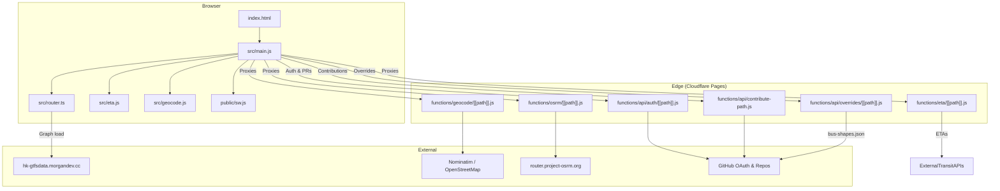
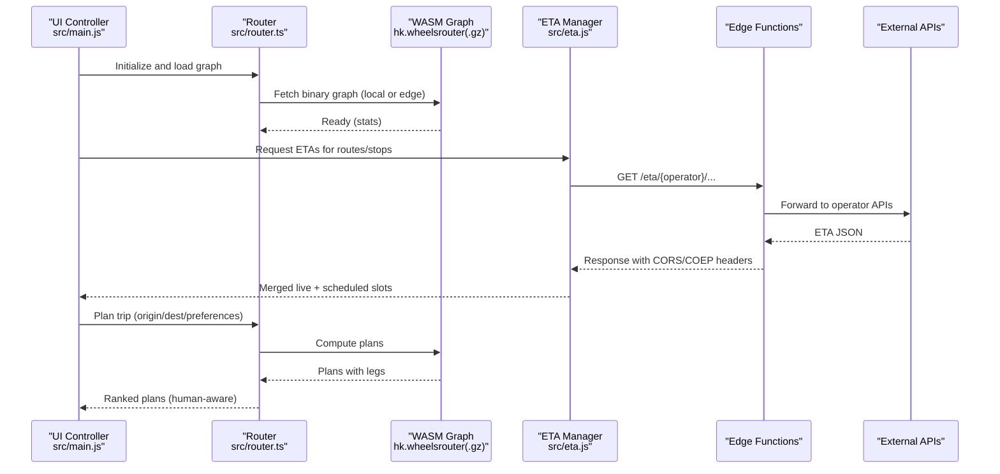
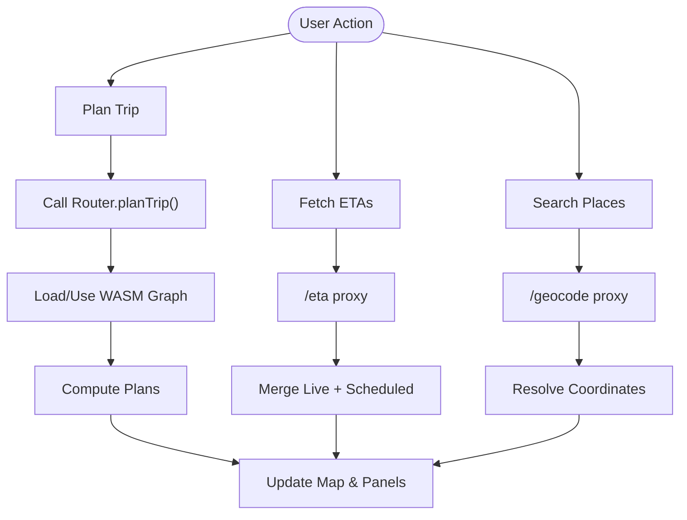
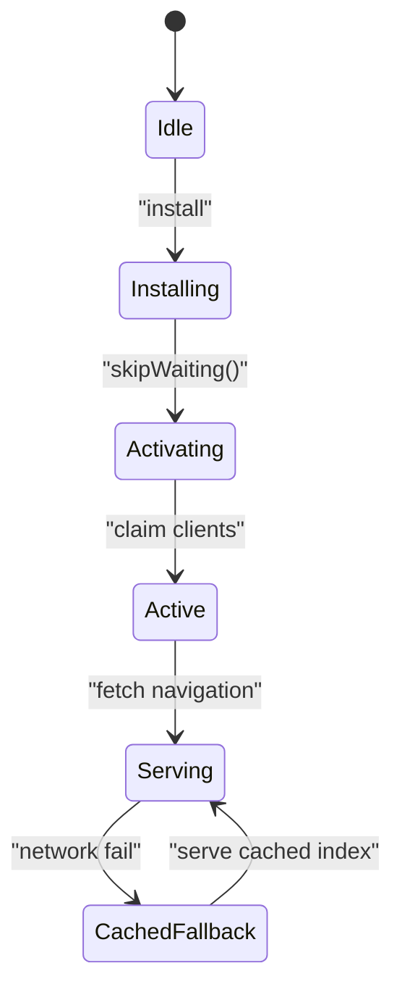
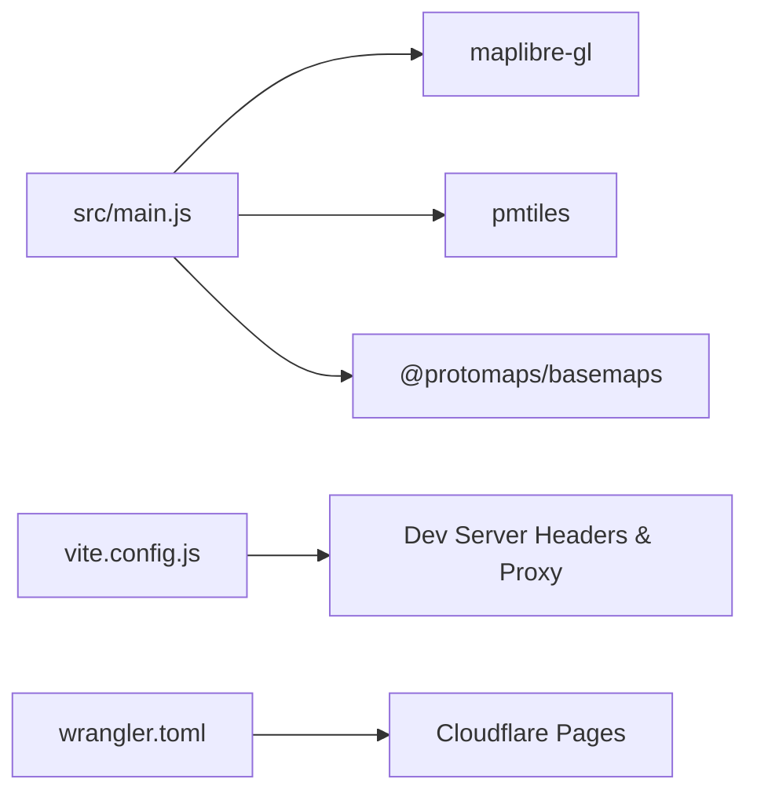

# Architecture Overview

<cite>
**Referenced Files in This Document**
- [index.html](file://index.html)
- [package.json](file://package.json)
- [vite.config.js](file://vite.config.js)
- [wrangler.toml](file://wrangler.toml)
- [public/sw.js](file://public/sw.js)
- [src/main.js](file://src/main.js)
- [src/router.ts](file://src/router.ts)
- [src/eta.js](file://src/eta.js)
- [src/geocode.js](file://src/geocode.js)
- [functions/api/auth/[[path]].js](file://functions/api/auth/[[path]].js)
- [functions/api/contribute-path.js](file://functions/api/contribute-path.js)
- [functions/api/overrides/[[path]].js](file://functions/api/overrides/[[path]].js)
- [functions/eta/[[path]].js](file://functions/eta/[[path]].js)
- [functions/geocode/[[path]].js](file://functions/geocode/[[path]].js)
- [functions/osrm/[[path]].js](file://functions/osrm/[[path]].js)
</cite>

## Table of Contents
1. Introduction
2. Project Structure
3. Core Components
4. Architecture Overview
5. Detailed Component Analysis
6. Dependency Analysis
7. Performance Considerations
8. Troubleshooting Guide
9. Conclusion

## Introduction
MorganTraveler is a Hong Kong transit PWA that combines an interactive map, real-time ETA, and offline-capable routing powered by a WASM RAPTOR engine. The system is modularly separated into:
- Frontend application logic (UI, map, routing orchestration, preferences, and controllers)
- Edge computing functions (Cloudflare Pages Functions for authentication, data validation, and API endpoints)
- Data processing pipelines (GTFS-derived graph loading, overrides, ETA aggregation, geocoding, and OSRM densification)

The architecture emphasizes event-driven communication between the router, map engine, data managers, and UI controllers, with clear boundaries for cross-origin safety and offline resilience.

## Project Structure
At a high level:
- The browser shell and UI are defined in index.html and bootstrapped via src/main.js.
- Routing and planning are implemented in src/router.ts using a WASM RAPTOR engine.
- Live ETA and timetable logic live in src/eta.js.
- Place search and reverse geocoding use src/geocode.js through a same-origin proxy to Nominatim.
- Edge functions under functions/ provide authenticated contributions, override publishing, ETA proxies, geocoding proxy, and OSRM proxy.
- A minimal service worker under public/sw.js provides offline navigation fallback.
- Build and dev tooling are configured in vite.config.js and package.json; deployment configuration is in wrangler.toml.

**Diagram sources**
- [index.html:1-120](file://index.html#L1-L120)
- [src/main.js:1-220](file://src/main.js#L1-L220)
- [src/router.ts:180-249](file://src/router.ts#L180-L249)
- [src/eta.js:16-42](file://src/eta.js#L16-L42)
- [src/geocode.js:53-58](file://src/geocode.js#L53-L58)
- [functions/api/auth/[[path]].js:85-164](file://functions/api/auth/[[path]].js#L85-L164)
- [functions/api/contribute-path.js:202-335](file://functions/api/contribute-path.js#L202-L335)
- [functions/api/overrides/[[path]].js:23-119](file://functions/api/overrides/[[path]].js#L23-L119)
- [functions/eta/[[path]].js:31-85](file://functions/eta/[[path]].js#L31-L85)
- [functions/geocode/[[path]].js:5-28](file://functions/geocode/[[path]].js#L5-L28)
- [functions/osrm/[[path]].js:5-24](file://functions/osrm/[[path]].js#L5-L24)

**Section sources**
- [package.json:1-37](file://package.json#L1-L37)
- [wrangler.toml:1-38](file://wrangler.toml#L1-L38)

## Core Components
- Map and UI shell: index.html defines the app shell, panels, sheets, and accessibility attributes; src/main.js initializes MapLibre, sets worker URLs, loads static overrides, and wires up controllers for ETA, trip planning, and route browsing.
- Routing engine: src/router.ts initializes the WASM RAPTOR engine, loads the binary graph from local or edge sources, and performs human-aware ranking and filtering of plans.
- ETA pipeline: src/eta.js aggregates live ETAs and timetable slots across operators, merges live and scheduled departures, and formats platform and clock information.
- Geocoding: src/geocode.js performs place search and reverse geocoding via a same-origin proxy to Nominatim, with local MTR/LRT directory boosts and mode filters.
- Edge functions:
  - Authentication: functions/api/auth/[[path]].js implements GitHub OAuth flows and session cookies.
  - Contributions: functions/api/contribute-path.js validates and stores path contributions, optionally opens GitHub PRs.
  - Overrides: functions/api/overrides/[[path]].js proxies bus-shapes.json from a remote repo with short caching.
  - Proxies: functions/eta/[[path]].js, functions/geocode/[[path]].js, functions/osrm/[[path]].js forward requests with CORS and COEP-safe headers.
- Service worker: public/sw.js provides minimal offline support for navigations and cache management.

**Section sources**
- [index.html:72-106](file://index.html#L72-L106)
- [src/main.js:177-210](file://src/main.js#L177-L210)
- [src/router.ts:207-249](file://src/router.ts#L207-L249)
- [src/eta.js:16-42](file://src/eta.js#L16-L42)
- [src/geocode.js:194-322](file://src/geocode.js#L194-L322)
- [functions/api/auth/[[path]].js:85-164](file://functions/api/auth/[[path]].js#L85-L164)
- [functions/api/contribute-path.js:202-335](file://functions/api/contribute-path.js#L202-L335)
- [functions/api/overrides/[[path]].js:23-119](file://functions/api/overrides/[[path]].js#L23-L119)
- [functions/eta/[[path]].js:31-85](file://functions/eta/[[path]].js#L31-L85)
- [functions/geocode/[[path]].js:5-28](file://functions/geocode/[[path]].js#L5-L28)
- [functions/osrm/[[path]].js:5-24](file://functions/osrm/[[path]].js#L5-L24)
- [public/sw.js:1-87](file://public/sw.js#L1-L87)

## Architecture Overview
The system follows a layered, event-driven design:
- Frontend orchestrates user interactions and dispatches events to specialized modules (router, ETA, geocoder).
- Edge functions act as secure, same-origin gateways for external services, enforcing CORS and COEP requirements while centralizing auth and contribution workflows.
- Data pipelines transform raw GTFS into a WASM-compatible graph, fetch live ETAs, merge schedules, and present results on the map.

**Diagram sources**
- [src/main.js:177-210](file://src/main.js#L177-L210)
- [src/router.ts:207-249](file://src/router.ts#L207-L249)
- [src/eta.js:16-42](file://src/eta.js#L16-L42)
- [functions/eta/[[path]].js:31-85](file://functions/eta/[[path]].js#L31-L85)

## Detailed Component Analysis

### Frontend Application Logic (src/main.js)
Responsibilities:
- Initializes MapLibre with a dedicated worker URL and ensures cross-origin isolation for WASM.
- Loads static overrides and applies LRT stop and access pin overrides.
- Wires UI controls to plan trips, browse ETAs, manage pinned routes, and handle panel/sheet states.
- Coordinates data fetching for ETA, geocoding, and routing, updating the map and UI accordingly.

Key behaviors:
- Sets base URLs for PMTiles and metadata via an edge proxy in development or production.
- Manages persistent preferences and pinned routes in localStorage.
- Integrates fare estimation and company-specific route data loaders.

**Section sources**
- [src/main.js:177-210](file://src/main.js#L177-L210)
- [src/main.js:213-295](file://src/main.js#L213-L295)
- [src/main.js:412-498](file://src/main.js#L412-L498)

### Edge Computing Model (Cloudflare Pages Functions)
Authentication:
- Implements GitHub OAuth flow with state cookies, token exchange, and session cookie management.
- Provides endpoints for login, callback, me, and logout with strict CORS and no-store policies.

Contributions:
- Validates draft payloads (schema, coordinates bounds, point limits), stores drafts in KV/R2 if available, and optionally opens GitHub PRs using OAuth or bot tokens.
- Emits optional webhook notifications for moderation.

Overrides:
- Proxies bus-shapes.json from a configurable repository with short CDN caching and CORS headers.

Proxies:
- ETA proxy forwards requests to multiple operator APIs with appropriate headers and caching.
- Geocode proxy forwards to Nominatim with HK-biased queries and caching.
- OSRM proxy forwards routing/densification requests with caching.

**Section sources**
- [functions/api/auth/[[path]].js:85-164](file://functions/api/auth/[[path]].js#L85-L164)
- [functions/api/auth/[[path]].js:166-254](file://functions/api/auth/[[path]].js#L166-L254)
- [functions/api/contribute-path.js:202-335](file://functions/api/contribute-path.js#L202-L335)
- [functions/api/overrides/[[path]].js:23-119](file://functions/api/overrides/[[path]].js#L23-L119)
- [functions/eta/[[path]].js:31-85](file://functions/eta/[[path]].js#L31-L85)
- [functions/geocode/[[path]].js:5-28](file://functions/geocode/[[path]].js#L5-L28)
- [functions/osrm/[[path]].js:5-24](file://functions/osrm/[[path]].js#L5-L24)

### Data Processing Pipelines (GTFS to Presentation)
Graph loading:
- The router attempts to initialize the WASM engine and load the binary graph from local candidates, then edge or default URLs, with error handling and stats logging.

ETA aggregation:
- Fetches live ETAs via the /eta proxy, caches responses client-side with TTL, normalizes timestamps, and merges live with scheduled headway-based slots.

Geocoding:
- Performs place search with local MTR/LRT directory boosts, filters by mode tags, ranks results, and returns consistent labels and coordinates.

Presentation:
- The UI renders routes, stops, and plans on the map, updates ETA cards, and manages user preferences and pinned routes.

**Section sources**
- [src/router.ts:207-249](file://src/router.ts#L207-L249)
- [src/eta.js:16-42](file://src/eta.js#L16-L42)
- [src/eta.js:692-758](file://src/eta.js#L692-L758)
- [src/geocode.js:194-322](file://src/geocode.js#L194-L322)

### Event-Driven Communication Patterns
- UI events trigger planner calls, which invoke the router to compute plans; results update the map and detail panels.
- ETA module emits updates when new live data arrives, refreshing cards and lists.
- Geocoding module resolves inputs to coordinates and feeds them back to the planner or map selection.
- Edge functions respond to frontend requests with validated and proxied data, ensuring CORS and COEP compliance.

**Diagram sources**
- [src/main.js:177-210](file://src/main.js#L177-L210)
- [src/router.ts:207-249](file://src/router.ts#L207-L249)
- [src/eta.js:16-42](file://src/eta.js#L16-L42)
- [src/geocode.js:194-322](file://src/geocode.js#L194-L322)
- [functions/eta/[[path]].js:31-85](file://functions/eta/[[path]].js#L31-L85)
- [functions/geocode/[[path]].js:5-28](file://functions/geocode/[[path]].js#L5-L28)

### Service Worker Architecture (Offline Support)
- Minimal strategy: intercept only document navigations for offline fallback.
- On install, skips waiting; on activate, clears old caches and claims clients.
- On message, supports skip-waiting and cache clearing commands.
- On fetch, caches a single HTML copy for cold start offline and falls back to cached index when network fails.

**Diagram sources**
- [public/sw.js:11-28](file://public/sw.js#L11-L28)
- [public/sw.js:31-40](file://public/sw.js#L31-L40)
- [public/sw.js:42-87](file://public/sw.js#L42-L87)

**Section sources**
- [public/sw.js:1-87](file://public/sw.js#L1-L87)

## Dependency Analysis
Frontend dependencies:
- MapLibre GL for rendering and worker setup.
- PMTiles protocol for vector tiles.
- Protomaps basemaps for base layers.

Build and runtime:
- Vite config injects cross-origin isolation headers and proxies edge assets during development.
- Package scripts sync workers and build fares pre-dev/build.

Deployment:
- Wrangler config declares Pages output directory and environment variables for overrides and optional OAuth.

**Diagram sources**
- [src/main.js:1-17](file://src/main.js#L1-L17)
- [vite.config.js:773-800](file://vite.config.js#L773-L800)
- [wrangler.toml:1-38](file://wrangler.toml#L1-L38)

**Section sources**
- [package.json:27-35](file://package.json#L27-L35)
- [vite.config.js:111-132](file://vite.config.js#L111-L132)
- [vite.config.js:773-800](file://vite.config.js#L773-L800)
- [wrangler.toml:1-38](file://wrangler.toml#L1-L38)

## Performance Considerations
- Graph loading uses candidate URLs with fallbacks to ensure robust initialization; prefer local .gz when available to reduce latency.
- ETA responses are cached client-side with short TTL to minimize repeated network calls.
- Edge proxies set appropriate Cache-Control headers to balance freshness and performance.
- Service worker avoids aggressive asset caching to prevent stale shells; only caches HTML for offline navigation.
- Development server enforces cross-origin isolation headers to enable WASM features efficiently.

[No sources needed since this section provides general guidance]

## Troubleshooting Guide
Common issues and mitigations:
- WASM initialization failures: Check graph source availability and network errors; logs indicate failed candidates and final error.
- ETA fetch errors: Verify /eta proxy availability and operator API status; client-side cache may serve stale data—clear caches via SW messages.
- Geocoding failures: Ensure /geocode proxy is reachable; check HK viewbox and query formatting; fallback to coordinate labels on error.
- Contribution submission errors: Validate payload schema and coordinate bounds; confirm OAuth or bot token configuration; review local pending artifacts.
- Offline behavior: If the app appears unstyled offline, verify service worker activation and cache keys; use SW messages to clear caches if necessary.

**Section sources**
- [src/router.ts:207-249](file://src/router.ts#L207-L249)
- [src/eta.js:16-42](file://src/eta.js#L16-L42)
- [src/geocode.js:297-322](file://src/geocode.js#L297-L322)
- [functions/api/contribute-path.js:202-335](file://functions/api/contribute-path.js#L202-L335)
- [public/sw.js:31-40](file://public/sw.js#L31-L40)

## Conclusion
MorganTraveler’s architecture cleanly separates concerns across frontend, edge, and data layers. The event-driven communication between the router, map engine, data managers, and UI controllers enables responsive, accurate transit experiences. Edge functions provide secure, standardized access to external services and contribute workflows, while the service worker ensures resilient offline behavior. This modular design supports ongoing enhancements to routing quality, ETA accuracy, and contributor tools without compromising performance or reliability.