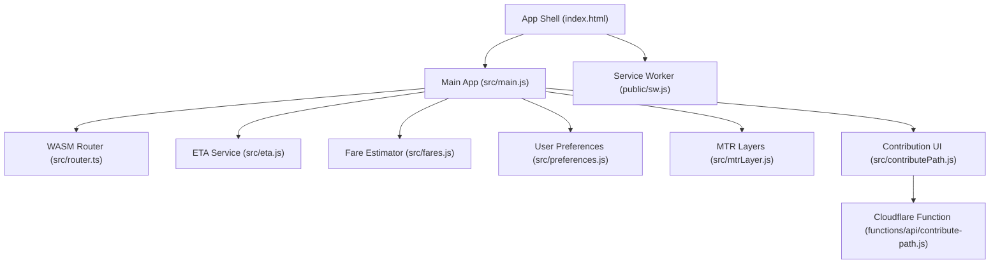
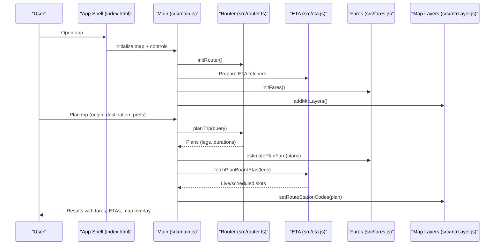
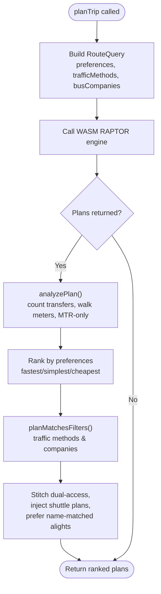
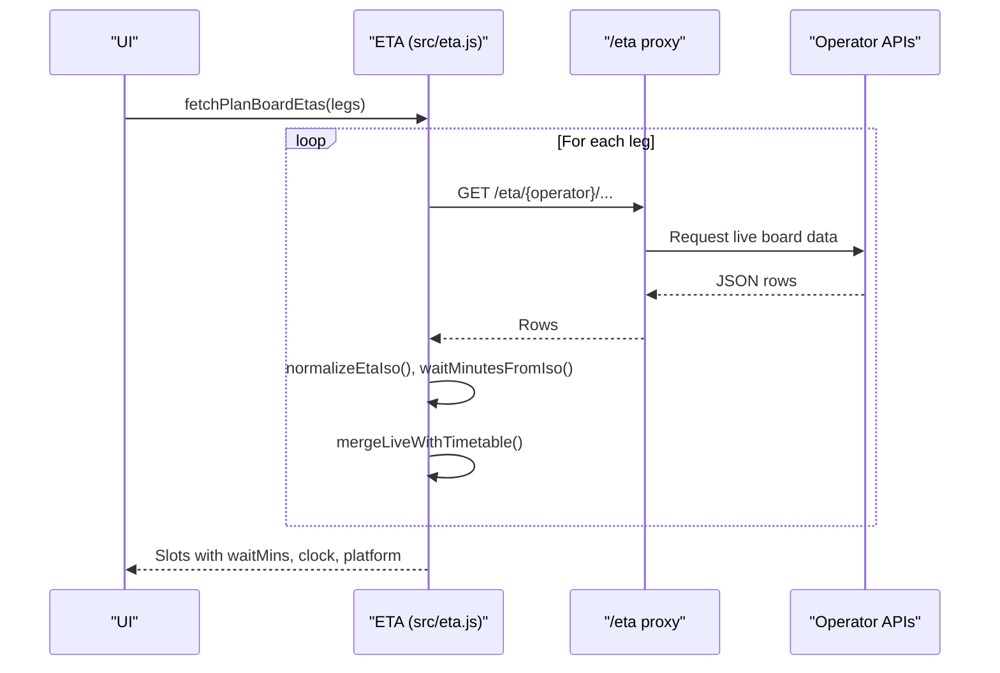
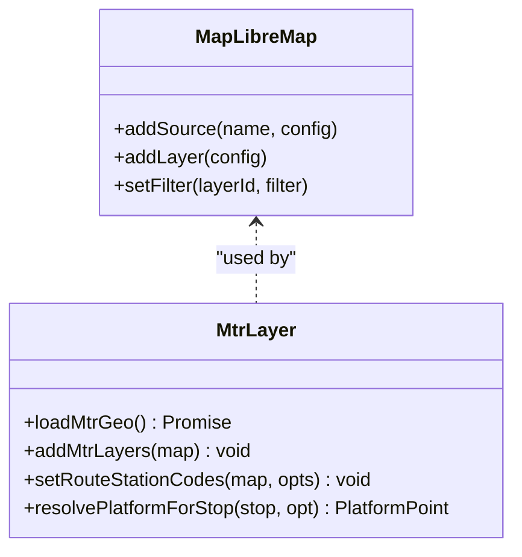
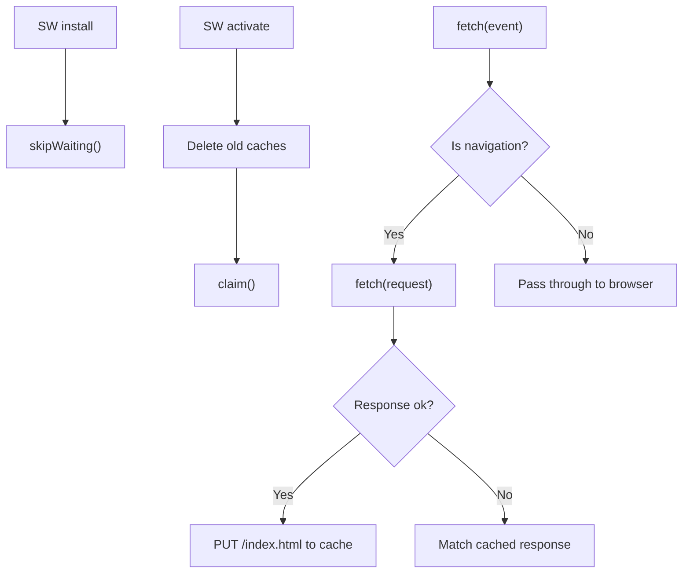
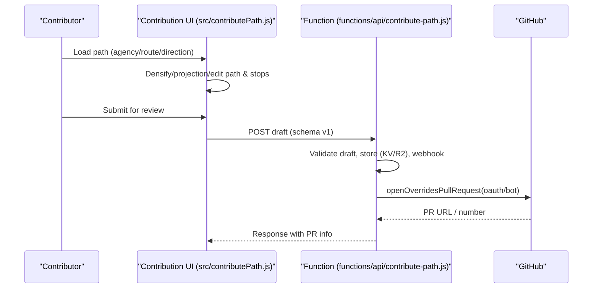
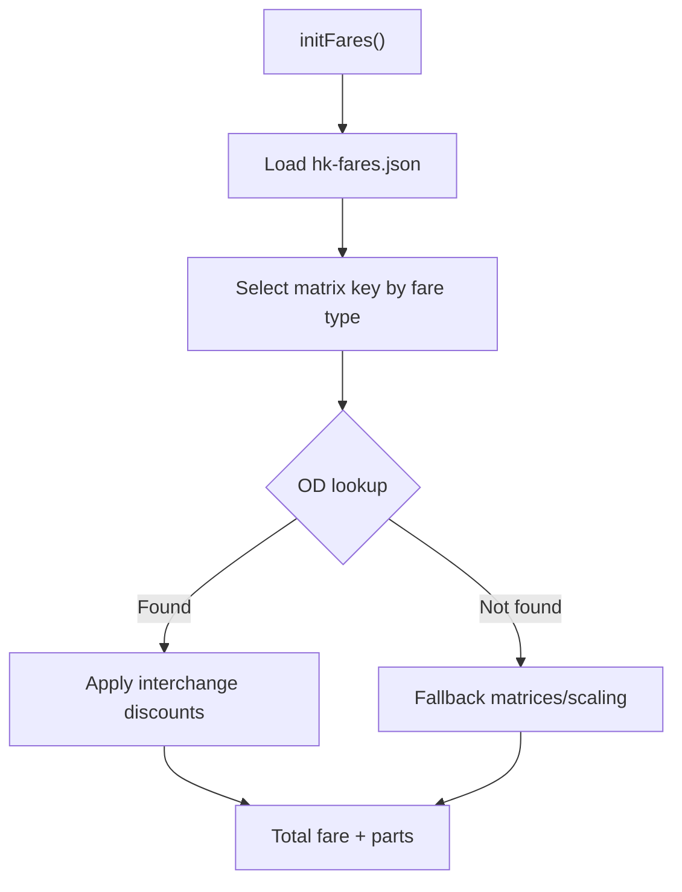
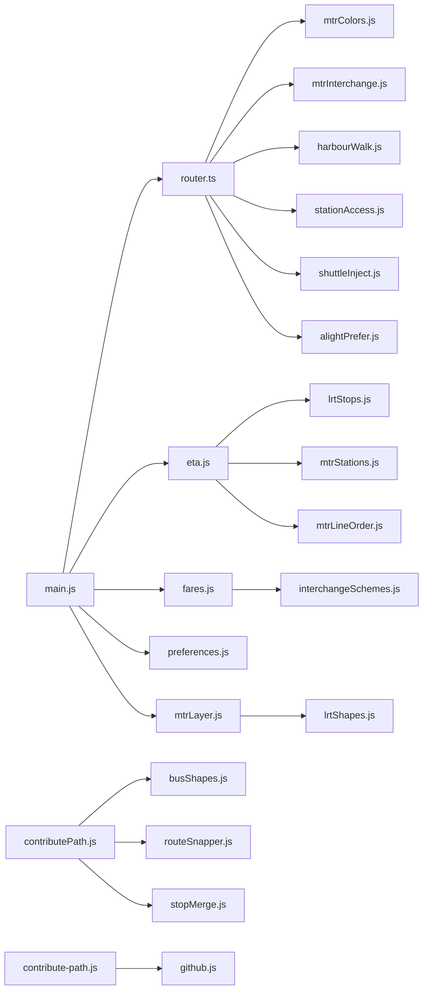

# Core Features

<cite>
**Referenced Files in This Document**
- [index.html](file://index.html)
- [src/main.js](file://src/main.js)
- [src/router.ts](file://src/router.ts)
- [src/eta.js](file://src/eta.js)
- [src/fares.js](file://src/fares.js)
- [src/preferences.js](file://src/preferences.js)
- [src/mtrLayer.js](file://src/mtrLayer.js)
- [public/sw.js](file://public/sw.js)
- [src/contributePath.js](file://src/contributePath.js)
- [functions/api/contribute-path.js](file://functions/api/contribute-path.js)
</cite>

## Table of Contents
1. [Introduction](#introduction)
2. [Project Structure](#project-structure)
3. [Core Components](#core-components)
4. [Architecture Overview](#architecture-overview)
5. [Detailed Component Analysis](#detailed-component-analysis)
6. [Dependency Analysis](#dependency-analysis)
7. [Performance Considerations](#performance-considerations)
8. [Troubleshooting Guide](#troubleshooting-guide)
9. [Conclusion](#conclusion)
10. [Appendices](#appendices)

## Introduction
MorganTraveler is a Hong Kong transit Progressive Web App that provides multi-modal route planning, live arrival predictions, an interactive map with layered transit visualization, offline-capable shell caching, community-driven route corrections via GitHub, and fare estimation across multiple payment methods. It integrates MTR, Light Rail, franchised buses, green minibuses, and ferries into a single routing and information experience.

## Project Structure
The application is a client-side PWA with a MapLibre-based map, a WASM RAPTOR router for multi-modal routing, ETA services for live arrivals, a fare estimator module, and a contribution workflow backed by serverless functions and GitHub.

**Diagram sources**
- [index.html:76-106](file://index.html#L76-L106)
- [src/main.js:1-186](file://src/main.js#L1-L186)
- [src/router.ts:207-249](file://src/router.ts#L207-L249)
- [src/eta.js:16-42](file://src/eta.js#L16-L42)
- [src/fares.js:460-503](file://src/fares.js#L460-L503)
- [src/preferences.js:306-325](file://src/preferences.js#L306-L325)
- [src/mtrLayer.js:28-61](file://src/mtrLayer.js#L28-L61)
- [public/sw.js:42-86](file://public/sw.js#L42-L86)
- [src/contributePath.js:82-320](file://src/contributePath.js#L82-L320)
- [functions/api/contribute-path.js:202-334](file://functions/api/contribute-path.js#L202-L334)

**Section sources**
- [index.html:76-106](file://index.html#L76-L106)
- [src/main.js:1-186](file://src/main.js#L1-L186)

## Core Components
- Multi-modal route planner: Uses a WASM RAPTOR engine to plan trips across MTR, Light Rail, buses, minibuses, and ferries with human-centric ranking rules and preference-based sorting.
- Real-time ETA system: Fetches live arrival data from operator APIs via a same-origin proxy, merges with scheduled timetables, and shows platform-aware next departures.
- Interactive mapping interface: Renders vector basemap tiles, overlays MTR platforms/exits, projects route paths, and supports layered transit visualization.
- Offline support: A minimal service worker caches the app shell and provides navigation fallback when connectivity is unavailable.
- Community contributions: Users can edit route shapes and visual stop pins and submit corrections through a serverless function that opens a GitHub pull request.
- Fare calculation: Estimates fares using matrices for MTR/AEL/LRT/MTR Bus and bus/ferry operators, supporting Octopus, QR, contactless, single-ride, and China T-Union types.

**Section sources**
- [src/router.ts:1-12](file://src/router.ts#L1-L12)
- [src/eta.js:1-15](file://src/eta.js#L1-L15)
- [src/mtrLayer.js:1-8](file://src/mtrLayer.js#L1-L8)
- [public/sw.js:1-8](file://public/sw.js#L1-L8)
- [src/contributePath.js:1-9](file://src/contributePath.js#L1-L9)
- [src/fares.js:1-13](file://src/fares.js#L1-L13)

## Architecture Overview
The app initializes the map, loads static overrides, sets up the WASM router, and wires user preferences, ETA, fares, and map layers. Routing queries are sent to the router with traffic method filters and preferences; results are ranked and displayed with fare estimates and ETA where available. Contributions flow from the UI to a Cloudflare function that validates drafts and creates PRs.

**Diagram sources**
- [index.html:76-106](file://index.html#L76-L106)
- [src/main.js:180-210](file://src/main.js#L180-L210)
- [src/router.ts:207-249](file://src/router.ts#L207-L249)
- [src/eta.js:16-42](file://src/eta.js#L16-L42)
- [src/fares.js:460-503](file://src/fares.js#L460-L503)
- [src/mtrLayer.js:28-61](file://src/mtrLayer.js#L28-L61)

## Detailed Component Analysis

### Multi-modal Route Planning System
- Combines MTR, Light Rail, franchised buses, green minibuses, and ferries.
- Human ranking rules penalize bus-to-bus transfers more than MTR interchanges, prefer direct routes, and avoid impossible Victoria Harbour walks.
- Supports preferences: fastest, simplest, cheapest; traffic method filters; bus company filters; dual-access station stitching; and LRT catchment expansion.

**Diagram sources**
- [src/router.ts:207-249](file://src/router.ts#L207-L249)
- [src/router.ts:468-563](file://src/router.ts#L468-L563)
- [src/router.ts:649-800](file://src/router.ts#L649-L800)

**Section sources**
- [src/router.ts:1-12](file://src/router.ts#L1-L12)
- [src/router.ts:251-303](file://src/router.ts#L251-L303)
- [src/router.ts:468-563](file://src/router.ts#L468-L563)
- [src/router.ts:649-800](file://src/router.ts#L649-L800)

### Real-time ETA System
- Fetches live ETAs per operator (KMB, CTB, NLB, GMB, MTR, LRT) via a same-origin proxy with short TTL cache.
- Normalizes timestamps, computes wait minutes, and merges live slots with timetable expansions or headway grids when live data is absent.
- Supports platform labels, multi-platform detection, and outside-service handling.

**Diagram sources**
- [src/eta.js:16-42](file://src/eta.js#L16-L42)
- [src/eta.js:154-178](file://src/eta.js#L154-L178)
- [src/eta.js:406-428](file://src/eta.js#L406-L428)
- [src/eta.js:533-568](file://src/eta.js#L533-L568)

**Section sources**
- [src/eta.js:1-15](file://src/eta.js#L1-L15)
- [src/eta.js:154-178](file://src/eta.js#L154-L178)
- [src/eta.js:406-428](file://src/eta.js#L406-L428)
- [src/eta.js:533-568](file://src/eta.js#L533-L568)

### Interactive Mapping Interface
- Loads PMTiles vector basemaps and adds MTR stations, exits, and platform layers.
- Filters platform and exit markers based on selected itinerary and resolves precise platform points for stops.
- Displays route paths and station markers with popups.

**Diagram sources**
- [src/mtrLayer.js:28-61](file://src/mtrLayer.js#L28-L61)
- [src/mtrLayer.js:178-219](file://src/mtrLayer.js#L178-L219)
- [src/mtrLayer.js:229-330](file://src/mtrLayer.js#L229-L330)

**Section sources**
- [src/mtrLayer.js:1-8](file://src/mtrLayer.js#L1-L8)
- [src/mtrLayer.js:28-61](file://src/mtrLayer.js#L28-L61)
- [src/mtrLayer.js:178-219](file://src/mtrLayer.js#L178-L219)
- [src/mtrLayer.js:229-330](file://src/mtrLayer.js#L229-L330)

### Offline Support via Service Worker
- Minimal service worker intercepts only document navigations to provide an offline fallback for the app shell.
- Clears old caches on activation and posts a message to clients indicating the active cache version.

**Diagram sources**
- [public/sw.js:11-29](file://public/sw.js#L11-L29)
- [public/sw.js:42-86](file://public/sw.js#L42-L86)

**Section sources**
- [public/sw.js:1-8](file://public/sw.js#L1-L8)
- [public/sw.js:42-86](file://public/sw.js#L42-L86)

### Community Contribution Features
- Users load a calculated path (published override, similar corridor, or OSRM densified), edit path vertices and visual stop pins, then submit for review.
- Serverless function validates the draft, stores it optionally, notifies webhooks, and opens a GitHub PR in OAuth or bot mode.

**Diagram sources**
- [src/contributePath.js:82-320](file://src/contributePath.js#L82-L320)
- [functions/api/contribute-path.js:36-134](file://functions/api/contribute-path.js#L36-L134)
- [functions/api/contribute-path.js:202-334](file://functions/api/contribute-path.js#L202-L334)

**Section sources**
- [src/contributePath.js:1-9](file://src/contributePath.js#L1-L9)
- [src/contributePath.js:82-320](file://src/contributePath.js#L82-L320)
- [functions/api/contribute-path.js:202-334](file://functions/api/contribute-path.js#L202-L334)

### Fare Calculation System
- Loads fare matrices for MTR, AEL, LRT, MTR Bus, and bus/ferry operators.
- Supports multiple ticket types: Octopus (adult/child/student/JoyYou), QR code, contactless bank cards, single ride, and China T-Union.
- Applies interchange discounts and free AEL↔MTR domestic connections where applicable.

**Diagram sources**
- [src/fares.js:460-503](file://src/fares.js#L460-L503)
- [src/fares.js:197-218](file://src/fares.js#L197-L218)
- [src/fares.js:643-689](file://src/fares.js#L643-L689)

**Section sources**
- [src/fares.js:1-13](file://src/fares.js#L1-L13)
- [src/fares.js:460-503](file://src/fares.js#L460-L503)
- [src/fares.js:643-689](file://src/fares.js#L643-L689)

## Dependency Analysis
- main.js orchestrates initialization and wiring between map, router, ETA, fares, and preferences.
- router.ts depends on mtrColors, mtrInterchange, harbourWalk, stationAccess, shuttleInject, and alightPrefer for ranking and plan refinement.
- eta.js depends on lrtStops, mtrStations, mtrLineOrder, and mtrColors for operator classification and platform handling.
- fares.js depends on mtrColors, lrtStops, and interchangeSchemes for discount logic.
- mtrLayer.js depends on lrtShapes for platform overrides and uses GeoJSON sources for rendering.
- contributePath.js depends on busShapes, routeSnapper, stopMerge, and lrtStops to build editable contributions.
- functions/api/contribute-path.js depends on _shared/github.js for PR creation.

**Diagram sources**
- [src/main.js:17-120](file://src/main.js#L17-L120)
- [src/router.ts:13-34](file://src/router.ts#L13-L34)
- [src/eta.js:6-14](file://src/eta.js#L6-L14)
- [src/fares.js:14-23](file://src/fares.js#L14-L23)
- [src/mtrLayer.js:9](file://src/mtrLayer.js#L9)
- [src/contributePath.js:11-26](file://src/contributePath.js#L11-L26)
- [functions/api/contribute-path.js:15-19](file://functions/api/contribute-path.js#L15-L19)

**Section sources**
- [src/main.js:17-120](file://src/main.js#L17-L120)
- [src/router.ts:13-34](file://src/router.ts#L13-L34)
- [src/eta.js:6-14](file://src/eta.js#L6-L14)
- [src/fares.js:14-23](file://src/fares.js#L14-L23)
- [src/mtrLayer.js:9](file://src/mtrLayer.js#L9)
- [src/contributePath.js:11-26](file://src/contributePath.js#L11-L26)
- [functions/api/contribute-path.js:15-19](file://functions/api/contribute-path.js#L15-L19)

## Performance Considerations
- WASM router graph loading tries local, remote, and gzipped candidates to minimize cold start latency.
- ETA responses are cached in-memory with a short TTL to reduce network churn during browsing.
- MapLibre worker URLs are pinned to avoid prebundle resolution issues and ensure efficient tile rendering.
- Service worker avoids intercepting non-document requests to prevent unnecessary caching overhead.

[No sources needed since this section provides general guidance]

## Troubleshooting Guide
- Router initialization failures: Check graph source availability and console logs for download errors; verify BASE_URL and edge proxy settings.
- ETA fetch errors: Inspect status codes and messages; confirm operator-specific endpoints and stop IDs; ensure COEP/CORS headers allow cross-origin if needed.
- Fare data missing: Ensure build artifacts include hk-fares.json; check console warnings about incomplete concession matrices.
- Map layer visibility: Confirm setRouteStationCodes is called with correct station codes/platform keys; verify GeoJSON sources loaded successfully.
- Contribution submission errors: Validate draft schema and coordinate bounds; ensure GitHub OAuth session or bot token is configured; check webhook delivery.

**Section sources**
- [src/router.ts:207-249](file://src/router.ts#L207-L249)
- [src/eta.js:30-42](file://src/eta.js#L30-L42)
- [src/fares.js:460-503](file://src/fares.js#L460-L503)
- [src/mtrLayer.js:178-219](file://src/mtrLayer.js#L178-L219)
- [functions/api/contribute-path.js:36-134](file://functions/api/contribute-path.js#L36-L134)

## Conclusion
MorganTraveler delivers a comprehensive transit experience for Hong Kong by combining robust multi-modal routing, live ETAs, rich map visualizations, offline resilience, community contributions, and accurate fare estimation. Its modular architecture enables clear separation of concerns and extensibility for future enhancements.

[No sources needed since this section summarizes without analyzing specific files]

## Appendices

### Practical Examples and Workflows

- Plan a trip with preferences
  - Workflow: Enter origin/destination, select preferences (e.g., Fastest + Cheapest), choose departure time, and view ranked plans with fares and ETAs.
  - Implementation: Preferences parsed and passed to router; fares estimated; ETA merged with schedules.

  **Section sources**
  - [src/preferences.js:306-325](file://src/preferences.js#L306-L325)
  - [src/router.ts:468-563](file://src/router.ts#L468-L563)
  - [src/fares.js:460-503](file://src/fares.js#L460-L503)
  - [src/eta.js:406-428](file://src/eta.js#L406-L428)

- View live arrivals at a stop
  - Workflow: Browse routes, select a route and direction, see next departures with platform info; pin frequently used routes.
  - Implementation: ETA fetchers per operator, platform normalization, merging with timetable, persistence of pinned routes.

  **Section sources**
  - [src/eta.js:154-178](file://src/eta.js#L154-L178)
  - [src/eta.js:533-568](file://src/eta.js#L533-L568)
  - [src/main.js:297-614](file://src/main.js#L297-L614)

- Visualize route paths and stations on the map
  - Workflow: After planning, see route polyline and highlighted MTR platforms/exits; click features for details.
  - Implementation: Add MTR layers, filter by plan’s station codes/platform keys, resolve platform points.

  **Section sources**
  - [src/mtrLayer.js:28-61](file://src/mtrLayer.js#L28-L61)
  - [src/mtrLayer.js:178-219](file://src/mtrLayer.js#L178-L219)
  - [src/mtrLayer.js:229-330](file://src/mtrLayer.js#L229-L330)

- Contribute a corrected route shape
  - Workflow: Load route path, adjust turning points and visual stop pins, submit for review; moderator publishes via PR.
  - Implementation: Densify via OSRM or use published overrides; validate and post draft to serverless function; create PR.

  **Section sources**
  - [src/contributePath.js:82-320](file://src/contributePath.js#L82-L320)
  - [functions/api/contribute-path.js:202-334](file://functions/api/contribute-path.js#L202-L334)

- Use offline mode
  - Workflow: Reopen the app without network; shell remains accessible while data may be stale.
  - Implementation: Service worker caches index.html and serves it on navigation failure.

  **Section sources**
  - [public/sw.js:42-86](file://public/sw.js#L42-L86)