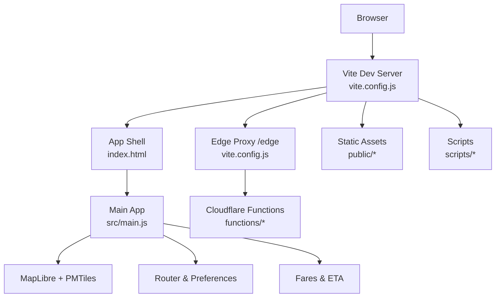
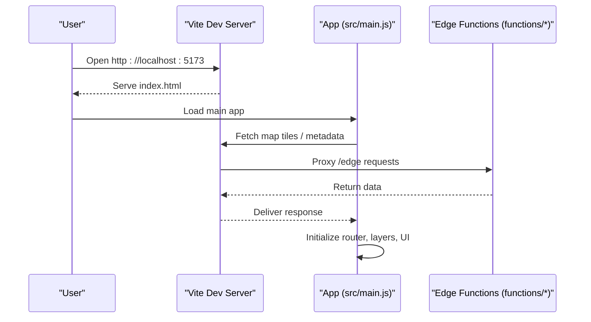
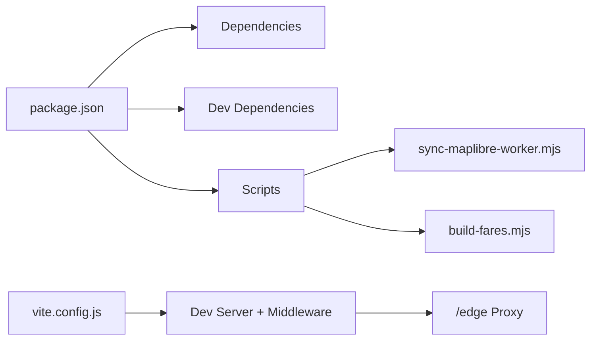

# Getting Started

<cite>
**Referenced Files in This Document**
- [package.json](file://package.json)
- [vite.config.js](file://vite.config.js)
- [wrangler.toml](file://wrangler.toml)
- [index.html](file://index.html)
- [src/main.js](file://src/main.js)
- [docs/local-overrides.md](file://docs/local-overrides.md)
- [public/overrides/README.md](file://public/overrides/README.md)
- [scripts/sync-maplibre-worker.mjs](file://scripts/sync-maplibre-worker.mjs)
- [scripts/build-fares.mjs](file://scripts/build-fares.mjs)
</cite>

## Table of Contents
1. Introduction
2. Project Structure
3. Core Components
4. Architecture Overview
5. Detailed Component Analysis
6. Dependency Analysis
7. Performance Considerations
8. Troubleshooting Guide
9. Conclusion
10. Appendices

## Introduction
MorganTraveler is a Hong Kong transit Progressive Web App (PWA) that renders an interactive map, plans trips across MTR, Light Rail, buses, and ferries, and estimates fares. It uses MapLibre for mapping, PMTiles for vector tiles, and a WASM-based router for fast route planning. This guide helps you set up the project locally, run the development server, build for production, and deploy to Cloudflare Pages with minimal friction.

## Project Structure
Key directories and their roles:
- src/: Application source code, including routing, UI logic, preferences, fare estimation, and integrations with mapping and data services.
- functions/: Serverless endpoints for edge computing (geocoding, ETA, OSRM proxy, auth, overrides).
- public/: Static assets served by the dev server and included in the production build (manifest, icons, static data, overrides, map workers).
- scripts/: Automation scripts for building fares, syncing map workers, collecting open data, and managing overrides.

**Diagram sources**
- [vite.config.js:1-800](file://vite.config.js#L1-L800)
- [index.html:1-800](file://index.html#L1-L800)
- [src/main.js:1-220](file://src/main.js#L1-L220)

**Section sources**
- [package.json:1-37](file://package.json#L1-L37)
- [vite.config.js:1-800](file://vite.config.js#L1-L800)
- [index.html:1-800](file://index.html#L1-L800)

## Core Components
- Development server and build tooling via Vite, configured to serve the app and provide a local proxy to edge endpoints.
- PWA shell defined in index.html with manifest and service worker references.
- Main application entrypoint initializes MapLibre, sets up the router, loads static overrides, and wires UI interactions.
- Edge functions under functions/ provide geocoding, ETA, OSRM proxy, authentication, and contribution workflows.
- Scripts automate prebuild tasks such as syncing MapLibre workers and building fare tables.

**Section sources**
- [package.json:7-25](file://package.json#L7-L25)
- [vite.config.js:1-800](file://vite.config.js#L1-L800)
- [index.html:1-800](file://index.html#L1-L800)
- [src/main.js:1-220](file://src/main.js#L1-L220)

## Architecture Overview
The app runs in the browser and communicates with edge functions through a local proxy during development. The dev server injects cross-origin isolation headers required by the WASM router and maps certain API routes to local handlers or proxies. Production deploys to Cloudflare Pages using the same configuration.

**Diagram sources**
- [vite.config.js:773-800](file://vite.config.js#L773-L800)
- [src/main.js:202-210](file://src/main.js#L202-L210)

## Detailed Component Analysis

### Installation and Setup
- Node.js requirements: Use a recent LTS version compatible with Vite 6.x and ES modules.
- Install dependencies:
  - Run npm install to install dependencies and trigger postinstall script that syncs MapLibre worker files into public/maplibre/.
- Start development server:
  - Run npm run dev to start Vite on port 5173. Predev hooks will also run necessary build steps like syncing workers and building fares.
- Build for production:
  - Run npm run build to generate optimized assets in the dist directory.

Notes:
- The dev server includes middleware to mirror some Cloudflare Pages functionality locally, including GitHub OAuth flows and contribution endpoints.
- Environment variables are loaded from .env.development and .env when present.

**Section sources**
- [package.json:7-25](file://package.json#L7-L25)
- [vite.config.js:19-48](file://vite.config.js#L19-L48)
- [scripts/sync-maplibre-worker.mjs:1-28](file://scripts/sync-maplibre-worker.mjs#L1-L28)

### Initial Configuration
- Local environment variables:
  - Create .env.development (not committed) to configure GitHub OAuth and override repository settings if needed.
  - Variables include OVERRIDES_GITHUB_TOKEN, GITHUB_OAUTH_CLIENT_ID, GITHUB_OAUTH_CLIENT_SECRET, and optional redirect URI.
- Cloudflare Pages deployment:
  - Configure secrets in the Cloudflare dashboard or via Wrangler:
    - OVERRIDES_REPO, OVERRIDES_BASE_BRANCH, OVERRIDES_GITHUB_TOKEN, GITHUB_OAUTH_CLIENT_ID, GITHUB_OAUTH_CLIENT_SECRET, GITHUB_OAUTH_REDIRECT_URI.
  - The wrangler.toml file defines non-secret vars and secret placeholders; do not commit real secrets.
- Local development workflow:
  - Use npm run dev to start the app. The dev server proxies /edge to the production data origin and adds CORS headers where needed.
  - For contributions, use the built-in local APIs under /api/auth and /api/overrides to test submit and merge flows without GitHub tokens.

**Section sources**
- [vite.config.js:19-48](file://vite.config.js#L19-L48)
- [wrangler.toml:1-38](file://wrangler.toml#L1-L38)
- [docs/local-overrides.md:1-182](file://docs/local-overrides.md#L1-L182)
- [public/overrides/README.md:1-132](file://public/overrides/README.md#L1-L132)

### Running the App Locally
- After installation, start the dev server:
  - npm run dev
- Verify the app loads:
  - Open http://localhost:5173 in your browser.
  - Confirm the map loads and the panel shows nearby routes or trip planning options.
- Check console logs:
  - Look for initialization messages indicating the MapLibre worker URL and cross-origin isolation status.

**Section sources**
- [index.html:1-800](file://index.html#L1-L800)
- [src/main.js:190-210](file://src/main.js#L190-L210)

### Building for Production
- Generate optimized assets:
  - npm run build
- Preview the build locally:
  - npm run preview to serve the dist folder and verify behavior before deploying.
- Deploy to Cloudflare Pages:
  - Use the dist output directory as configured in wrangler.toml.

**Section sources**
- [package.json:7-25](file://package.json#L7-L25)
- [wrangler.toml:1-38](file://wrangler.toml#L1-L38)

### Data and Fares Build
- Fare tables are built during predev/prebuild steps:
  - The build script downloads official and open data sources and outputs a compact JSON used by the client to estimate fares.
- If mdb-export is missing, section fares for franchised bus/GMB may be skipped gracefully.

**Section sources**
- [package.json:7-25](file://package.json#L7-L25)
- [scripts/build-fares.mjs:1-578](file://scripts/build-fares.mjs#L1-L578)

## Dependency Analysis
- Runtime dependencies:
  - MapLibre GL for rendering vector tiles and map interactions.
  - PMTiles protocol for efficient tile streaming.
  - Protomaps basemaps for base layer styling.
- Development dependencies:
  - Vite for bundling, dev server, and build pipeline.
  - Playwright for testing (optional).
- Scripts:
  - Postinstall and prebuild hooks ensure MapLibre worker files are copied and fares are built before serving or packaging.

**Diagram sources**
- [package.json:27-35](file://package.json#L27-L35)
- [package.json:7-25](file://package.json#L7-L25)
- [vite.config.js:773-800](file://vite.config.js#L773-L800)

**Section sources**
- [package.json:27-35](file://package.json#L27-L35)
- [package.json:7-25](file://package.json#L7-L25)

## Performance Considerations
- Cross-Origin Isolation:
  - The dev server sets COOP/COEP headers to enable SharedArrayBuffer usage required by the WASM router. Ensure these headers remain intact in production.
- Asset Serving:
  - MapLibre worker files are copied to public/maplibre/ to avoid module resolution issues during development and builds.
- Edge Proxies:
  - During development, /edge requests are proxied to the production data origin with appropriate CORS headers to support cross-origin tile fetching.

[No sources needed since this section provides general guidance]

## Troubleshooting Guide
Common setup issues and resolutions:
- Blank map or missing worker:
  - Ensure npm install completed successfully and the postinstall script copied MapLibre worker files into public/maplibre/.
  - Verify the dev server serves the worker at the expected path and that import.meta.url resolution is correct.
- CORS or COEP errors:
  - Confirm the dev server sets Cross-Origin-Opener-Policy and Cross-Origin-Embedder-Policy headers.
  - For local development, ensure the /edge proxy adds Cross-Origin-Resource-Policy headers for tile requests.
- GitHub OAuth not working locally:
  - Set GITHUB_OAUTH_CLIENT_ID and GITHUB_OAUTH_CLIENT_SECRET in .env.development.
  - Configure the OAuth App callback URL to http://127.0.0.1:5173/api/auth/callback.
  - Restart the dev server after changing environment variables.
- Contribution submission fails:
  - Without a bot token or OAuth, submissions still save locally to artifacts/contributions/pending/ and can be reviewed via the local review page.
  - Use the local API endpoints to inspect pending drafts and merge them into bus-shapes.json.

Verification steps:
- Open http://localhost:5173 and check the console for initialization messages.
- Inspect network requests to confirm tiles and metadata load successfully.
- Test contribution flow by submitting a draft and checking the local review endpoint.

**Section sources**
- [vite.config.js:111-120](file://vite.config.js#L111-L120)
- [vite.config.js:773-800](file://vite.config.js#L773-L800)
- [docs/local-overrides.md:1-182](file://docs/local-overrides.md#L1-L182)
- [public/overrides/README.md:1-132](file://public/overrides/README.md#L1-L132)

## Conclusion
You now have the essential steps to install, run, and build MorganTraveler locally, along with guidance for configuring environment variables and deploying to Cloudflare Pages. Use the local APIs to test contributions and the provided scripts to keep data and assets synchronized. Refer to the troubleshooting section if you encounter common issues during setup.

[No sources needed since this section summarizes without analyzing specific files]

## Appendices

### Quick Commands
- Install dependencies:
  - npm install
- Start development server:
  - npm run dev
- Build for production:
  - npm run build
- Preview production build:
  - npm run preview

**Section sources**
- [package.json:7-25](file://package.json#L7-L25)

### Environment Variables Reference
- Local development (.env.development):
  - OVERRIDES_GITHUB_TOKEN
  - GITHUB_OAUTH_CLIENT_ID
  - GITHUB_OAUTH_CLIENT_SECRET
  - GITHUB_OAUTH_REDIRECT_URI (optional)
- Cloudflare Pages secrets:
  - OVERRIDES_REPO
  - OVERRIDES_BASE_BRANCH
  - OVERRIDES_GITHUB_TOKEN
  - GITHUB_OAUTH_CLIENT_ID
  - GITHUB_OAUTH_CLIENT_SECRET
  - GITHUB_OAUTH_REDIRECT_URI

**Section sources**
- [vite.config.js:19-48](file://vite.config.js#L19-L48)
- [wrangler.toml:1-38](file://wrangler.toml#L1-L38)
- [docs/local-overrides.md:156-167](file://docs/local-overrides.md#L156-L167)