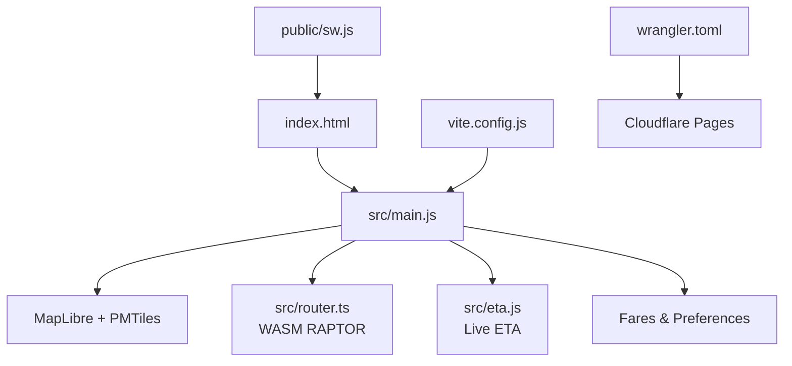
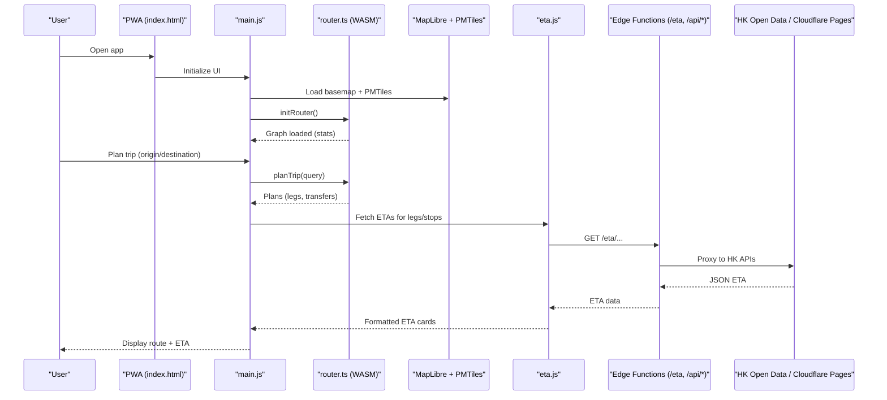
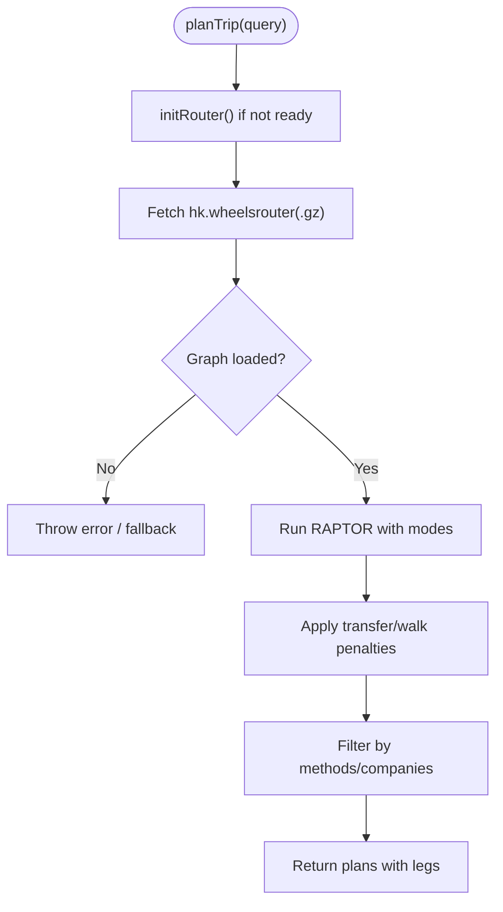
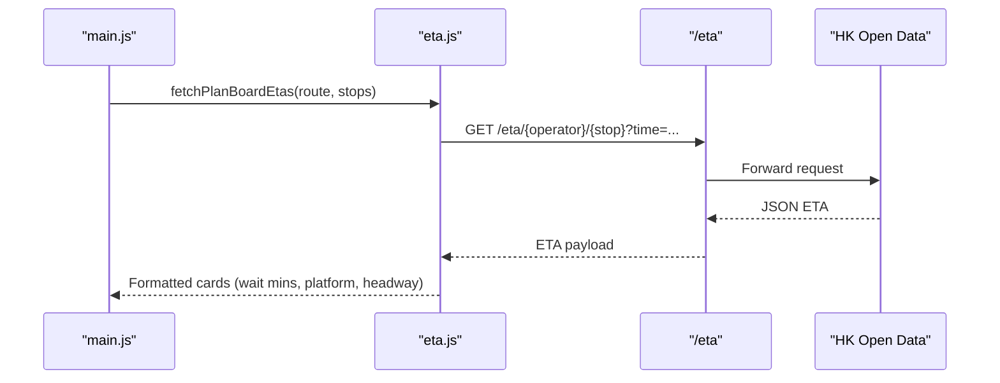
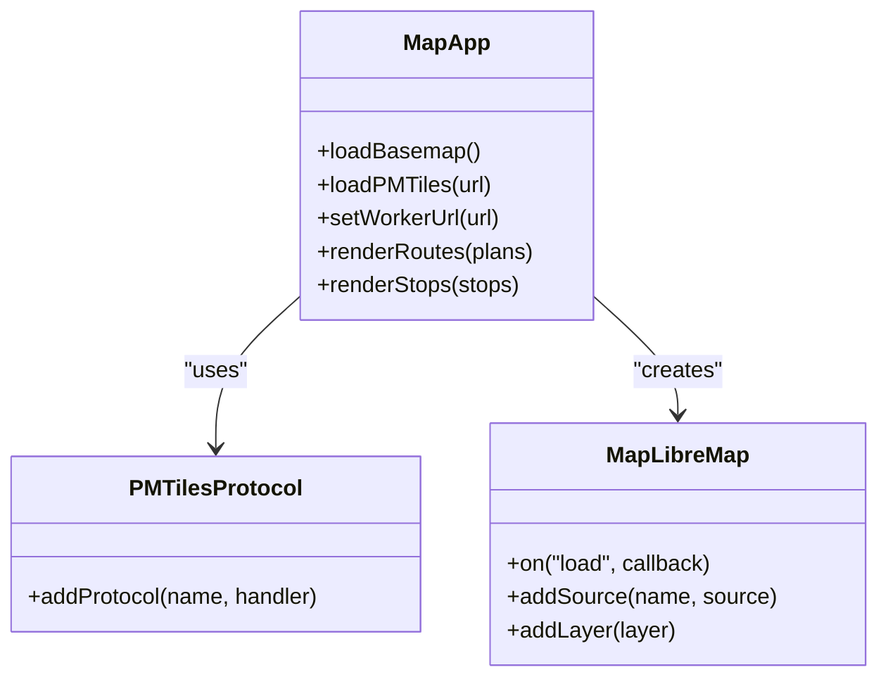
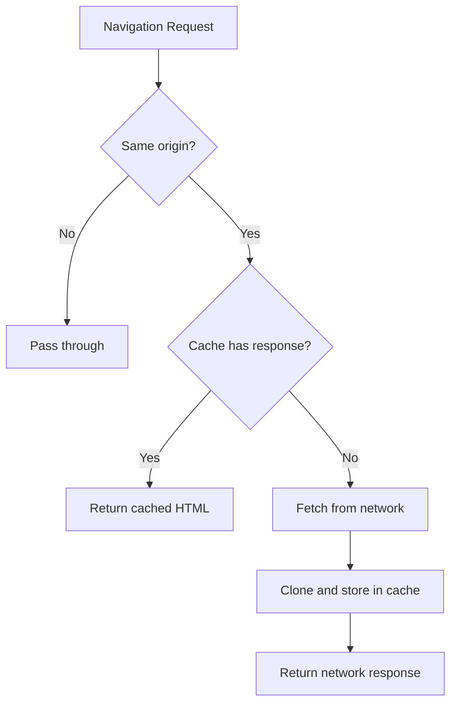
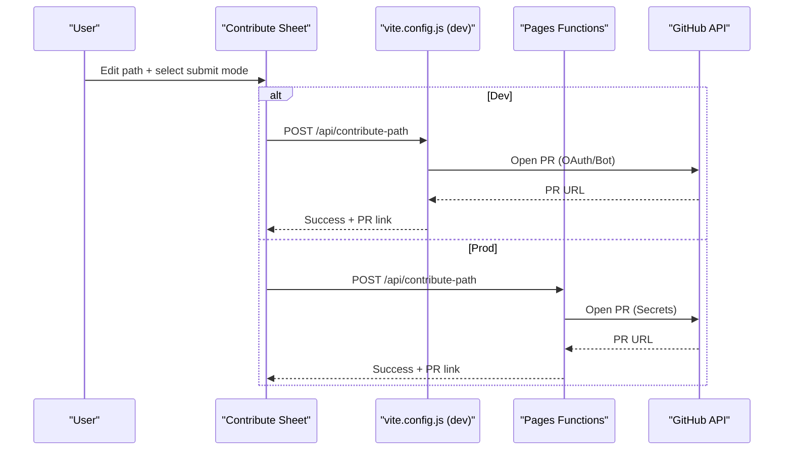
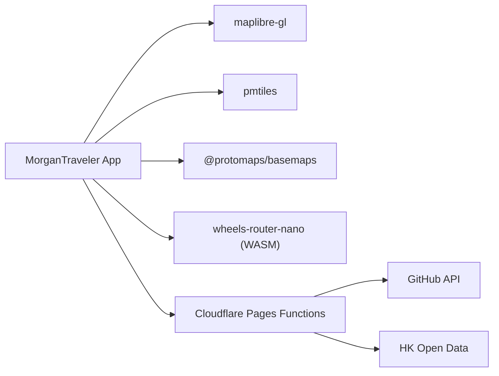

# Project Overview

<cite>
**Referenced Files in This Document**
- [package.json](file://package.json)
- [index.html](file://index.html)
- [src/main.js](file://src/main.js)
- [src/router.ts](file://src/router.ts)
- [src/eta.js](file://src/eta.js)
- [public/sw.js](file://public/sw.js)
- [public/manifest.webmanifest](file://public/manifest.webmanifest)
- [vite.config.js](file://vite.config.js)
- [wrangler.toml](file://wrangler.toml)
- [MORGAN Travelers PRD.md](file://MORGAN Travelers PRD.md)
</cite>

## Table of Contents
1. Introduction
2. Project Structure
3. Core Components
4. Architecture Overview
5. Detailed Component Analysis
6. Dependency Analysis
7. Performance Considerations
8. Troubleshooting Guide
9. Conclusion
10. Appendices

## Introduction
MorganTraveler is a Progressive Web Application (PWA) that provides real-time transit information, route planning, and interactive mapping for Hong Kong’s multi-modal transportation system. It combines MapLibre vector tiles via PMTiles with a WebAssembly-based RAPTOR routing engine to deliver fast, offline-capable trip planning and live bus tracking across MTR, Light Rail, buses, minibuses, and ferries. The app runs on Cloudflare Pages with edge functions for authentication and contribution workflows, while service workers enable basic offline support for the shell.

Key concepts:
- GTFS data: Standardized transit schedules and routes used to build the routing graph.
- Vector tiles: On-demand map data served as PMTiles for crisp rendering at any zoom.
- Multi-modal routing: Combining walking, rail, bus, light rail, ferry, and airport express into one plan.

Practical examples:
- Route planning: Enter origin and destination, choose preferences (fastest, simplest, cheapest), and view step-by-step itineraries.
- Real-time ETA checking: Browse nearby routes or pin a route stop to see live arrival times and platform info.
- Station information lookup: Search stations, view interchange details, and access platforms/exits.

**Section sources**
- [MORGAN Travelers PRD.md:1-84](file://MORGAN Travelers PRD.md#L1-L84)
- [package.json:1-37](file://package.json#L1-L37)
- [public/manifest.webmanifest:1-28](file://public/manifest.webmanifest#L1-L28)

## Project Structure
The project follows a modern web stack with clear separation between UI, routing logic, data services, and deployment configuration:
- Frontend shell and UI: index.html and src/main.js orchestrate MapLibre, routing, ETA, fares, and contributions.
- Routing engine: src/router.ts wraps the WASM RAPTOR engine and applies human-centric ranking rules.
- Live data: src/eta.js fetches and normalizes ETAs from HK open data through edge proxies.
- Offline support: public/sw.js caches the HTML shell for offline cold starts.
- Build and dev tooling: vite.config.js configures cross-origin isolation, local overrides, and dev proxies.
- Deployment: wrangler.toml defines Cloudflare Pages settings and environment variables.

**Diagram sources**
- [index.html:1-80](file://index.html#L1-L80)
- [src/main.js:1-200](file://src/main.js#L1-L200)
- [src/router.ts:1-120](file://src/router.ts#L1-L120)
- [src/eta.js:1-60](file://src/eta.js#L1-L60)
- [public/sw.js:46-86](file://public/sw.js#L46-L86)
- [vite.config.js:111-160](file://vite.config.js#L111-L160)
- [wrangler.toml:1-38](file://wrangler.toml#L1-L38)

**Section sources**
- [index.html:1-800](file://index.html#L1-L800)
- [src/main.js:1-200](file://src/main.js#L1-L200)
- [public/sw.js:46-86](file://public/sw.js#L46-L86)
- [vite.config.js:111-160](file://vite.config.js#L111-L160)
- [wrangler.toml:1-38](file://wrangler.toml#L1-L38)

## Core Components
- Routing Engine (WASM RAPTOR): Loads hk.wheelsrouter binary and computes multi-modal plans with human-centric ranking (transfer penalties, MTR preference, walk penalties). Supports preferences like fastest/simplest/cheapest and filters by traffic methods and bus companies.
- Live ETA Service: Normalizes timestamps, identifies operators (KMB/LWB, CTB, NLB, GMB, MTR, LRT), merges live ETAs with timetables, and formats cards for UI.
- Mapping Layer: Uses MapLibre with Protomaps basemaps and PMTiles for vector tiles; supports overlays for routes, stops, and live positions.
- Fares and Preferences: Estimates fares, formats currency, and persists user preferences (service day, departure time, preferred modes).
- Contribution Workflow: Allows users to edit and submit route path overrides via GitHub OAuth or bot account, with local development helpers and merge scripts.

**Section sources**
- [src/router.ts:1-120](file://src/router.ts#L1-L120)
- [src/router.ts:204-249](file://src/router.ts#L204-L249)
- [src/eta.js:1-200](file://src/eta.js#L1-L200)
- [src/main.js:1-180](file://src/main.js#L1-L180)
- [vite.config.js:111-160](file://vite.config.js#L111-L160)

## Architecture Overview
MorganTraveler uses a client-first architecture with optional edge functions:
- Client-side: PWA loads MapLibre, initializes WASM router, fetches PMTiles and metadata, and renders the map and UI.
- Edge functions: Provide /eta, /geocode, /osrm proxies and auth/overrides APIs for contributions and GitHub integration.
- Data sources: GTFS-Dense graph for routing, PMTiles for vector tiles, and HK open data APIs for live ETAs and traffic.

**Diagram sources**
- [src/main.js:180-210](file://src/main.js#L180-L210)
- [src/router.ts:204-249](file://src/router.ts#L204-L249)
- [src/eta.js:16-42](file://src/eta.js#L16-L42)
- [functions/eta/[[path]].js](file://functions/eta/[[path]].js)
- [functions/api/auth/[[path]].js](file://functions/api/auth/[[path]].js)
- [functions/api/overrides/[[path]].js](file://functions/api/overrides/[[path]].js)

**Section sources**
- [MORGAN Travelers PRD.md:17-37](file://MORGAN Travelers PRD.md#L17-L37)
- [src/main.js:180-210](file://src/main.js#L180-L210)
- [src/router.ts:204-249](file://src/router.ts#L204-L249)
- [src/eta.js:16-42](file://src/eta.js#L16-L42)

## Detailed Component Analysis

### Routing Engine (WASM RAPTOR)
The router initializes the WASM instance and loads the optimized GTFS-Dense graph from Cloudflare Pages. It applies human-centric ranking:
- Transfer penalties: Strong penalty for bus-to-bus transfers; lighter for MTR interchanges.
- Mode preferences: Prefer MTR when both OD are stations; penalize long outdoor walks between lines.
- Filters: Traffic methods and bus company filters; egress walk limits based on context.

**Diagram sources**
- [src/router.ts:204-249](file://src/router.ts#L204-L249)
- [src/router.ts:251-303](file://src/router.ts#L251-L303)
- [src/router.ts:468-563](file://src/router.ts#L468-L563)

**Section sources**
- [src/router.ts:1-120](file://src/router.ts#L1-L120)
- [src/router.ts:204-249](file://src/router.ts#L204-L249)
- [src/router.ts:251-303](file://src/router.ts#L251-L303)
- [src/router.ts:468-563](file://src/router.ts#L468-L563)

### Live ETA Service
The ETA module fetches operator-specific ETAs via a same-origin proxy, normalizes timestamps, and formats results for UI. It supports multiple operators and merges live data with scheduled slots.

**Diagram sources**
- [src/eta.js:16-42](file://src/eta.js#L16-L42)
- [src/eta.js:154-178](file://src/eta.js#L154-L178)
- [functions/eta/[[path]].js](file://functions/eta/[[path]].js)

**Section sources**
- [src/eta.js:1-200](file://src/eta.js#L1-L200)
- [functions/eta/[[path]].js](file://functions/eta/[[path]].js)

### Mapping Layer (MapLibre + PMTiles)
The app initializes MapLibre with Protomaps basemaps and loads PMTiles for vector tiles. It sets worker URLs to avoid bundling issues and configures cross-origin isolation for WASM multithreading.

**Diagram sources**
- [src/main.js:1-20](file://src/main.js#L1-L20)
- [src/main.js:189-210](file://src/main.js#L189-L210)

**Section sources**
- [src/main.js:1-200](file://src/main.js#L1-L200)

### Offline Support (Service Worker)
The service worker intercepts navigation requests and caches the HTML shell for offline cold starts. Non-navigation assets rely on browser caching; this approach keeps the app lightweight while ensuring basic offline resilience.

**Diagram sources**
- [public/sw.js:46-86](file://public/sw.js#L46-L86)

**Section sources**
- [public/sw.js:46-86](file://public/sw.js#L46-L86)

### Contribution Workflow (GitHub Integration)
Users can edit route paths and submit them for review via GitHub OAuth or a bot account. Local development includes middleware for auth, status, pending drafts, and merging contributions. Production uses Cloudflare Pages Functions for secure operations.

**Diagram sources**
- [vite.config.js:111-160](file://vite.config.js#L111-L160)
- [vite.config.js:402-549](file://vite.config.js#L402-L549)
- [wrangler.toml:11-27](file://wrangler.toml#L11-L27)
- [functions/api/auth/[[path]].js](file://functions/api/auth/[[path]].js)
- [functions/api/overrides/[[path]].js](file://functions/api/overrides/[[path]].js)

**Section sources**
- [vite.config.js:111-160](file://vite.config.js#L111-L160)
- [vite.config.js:402-549](file://vite.config.js#L402-L549)
- [wrangler.toml:11-27](file://wrangler.toml#L11-L27)

## Dependency Analysis
Core dependencies and their roles:
- maplibre-gl: Rendering vector tiles and interactive maps.
- pmtiles: Protocol for efficient tile streaming.
- @protomaps/basemaps: Basemap layers for the map.
- wheels-router-nano (WASM): RAPTOR algorithm for multi-modal routing.
- Vite: Build tool with custom middleware for COEP/COOP and dev proxies.
- Cloudflare Pages: Hosting and edge functions for auth, ETA, geocode, and overrides.

**Diagram sources**
- [package.json:27-31](file://package.json#L27-L31)
- [src/router.ts:12-14](file://src/router.ts#L12-L14)
- [wrangler.toml:1-38](file://wrangler.toml#L1-L38)

**Section sources**
- [package.json:27-31](file://package.json#L27-L31)
- [src/router.ts:12-14](file://src/router.ts#L12-L14)
- [wrangler.toml:1-38](file://wrangler.toml#L1-L38)

## Performance Considerations
- WASM execution: RAPTOR runs near-native speed in the browser; ensure Cross-Origin Isolation headers for multithreading.
- PMTiles streaming: On-demand vector tiles reduce bandwidth and improve load times.
- ETA polling: Visibility-aware loops minimize background battery drain; cache short-lived responses.
- Graph loading: Prefer compressed graphs (.gz) and edge delivery for low latency.
- Offline shell: Service worker caches HTML for quick cold starts; consider extending cache strategy for assets if needed.

[No sources needed since this section provides general guidance]

## Troubleshooting Guide
Common issues and resolutions:
- Router initialization fails: Verify graph URL availability and CORS headers; check console logs for download errors.
- ETA fetch errors: Ensure /eta proxy is reachable and returns valid JSON; inspect operator-specific endpoints.
- Map rendering issues: Confirm PMTiles URL and basemap layers; verify worker URL resolution.
- Offline behavior: If navigation fails offline, confirm service worker registration and cache entries.
- Contribution workflow: For dev, set OAuth secrets; for prod, configure secrets in Cloudflare dashboard.

**Section sources**
- [src/router.ts:204-249](file://src/router.ts#L204-L249)
- [src/eta.js:16-42](file://src/eta.js#L16-L42)
- [public/sw.js:46-86](file://public/sw.js#L46-L86)
- [vite.config.js:111-160](file://vite.config.js#L111-L160)
- [wrangler.toml:20-27](file://wrangler.toml#L20-L27)

## Conclusion
MorganTraveler delivers a high-performance, community-driven transit experience for Hong Kong using modern web technologies. Its architecture balances client-side computation with edge services, enabling offline resilience, real-time updates, and scalable distribution. By leveraging GTFS, vector tiles, and multi-modal routing, it supports diverse commuter needs—from quick trips to detailed transit exploration—while providing tools for community contributions to improve accuracy and coverage.

[No sources needed since this section summarizes without analyzing specific files]

## Appendices

### Practical Use Cases
- Route Planning:
  - Enter origin and destination, select preferences (fastest/simplest/cheapest), and view step-by-step plans with transfers and walk segments.
  - Reference: [src/router.ts:35-75](file://src/router.ts#L35-L75)
- Real-Time ETA Checking:
  - Browse nearby routes or pin a stop to see live arrivals, platforms, and headways.
  - Reference: [src/eta.js:154-200](file://src/eta.js#L154-L200)
- Station Information Lookup:
  - Search stations, view interchange details, and access platforms/exits.
  - Reference: [src/main.js:82-101](file://src/main.js#L82-L101)

**Section sources**
- [src/router.ts:35-75](file://src/router.ts#L35-L75)
- [src/eta.js:154-200](file://src/eta.js#L154-L200)
- [src/main.js:82-101](file://src/main.js#L82-L101)