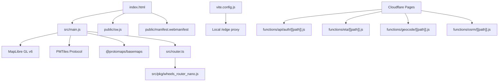
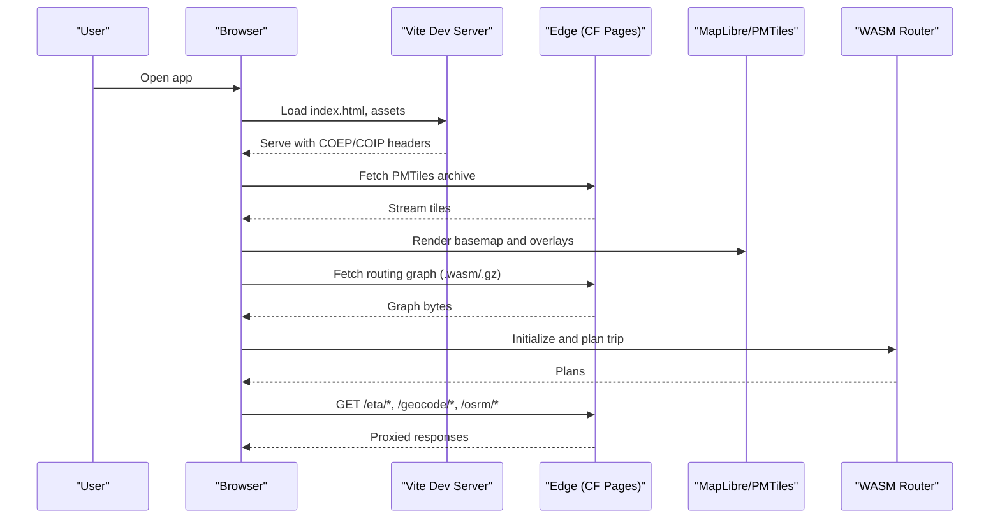
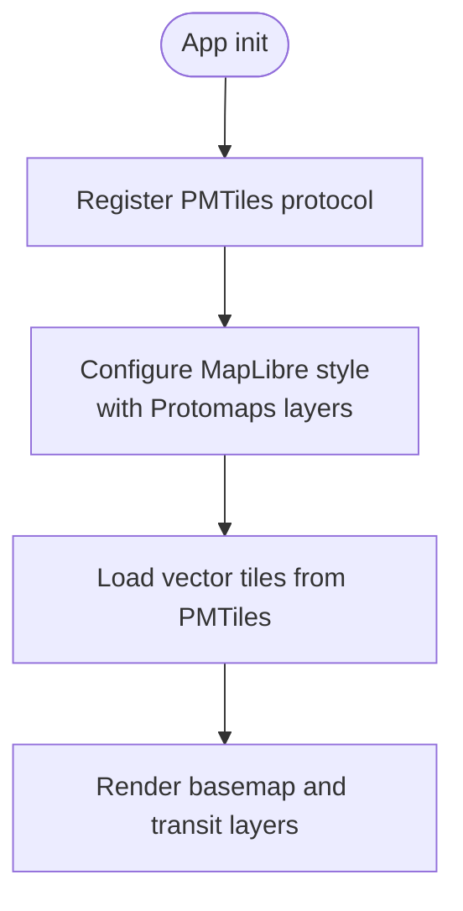
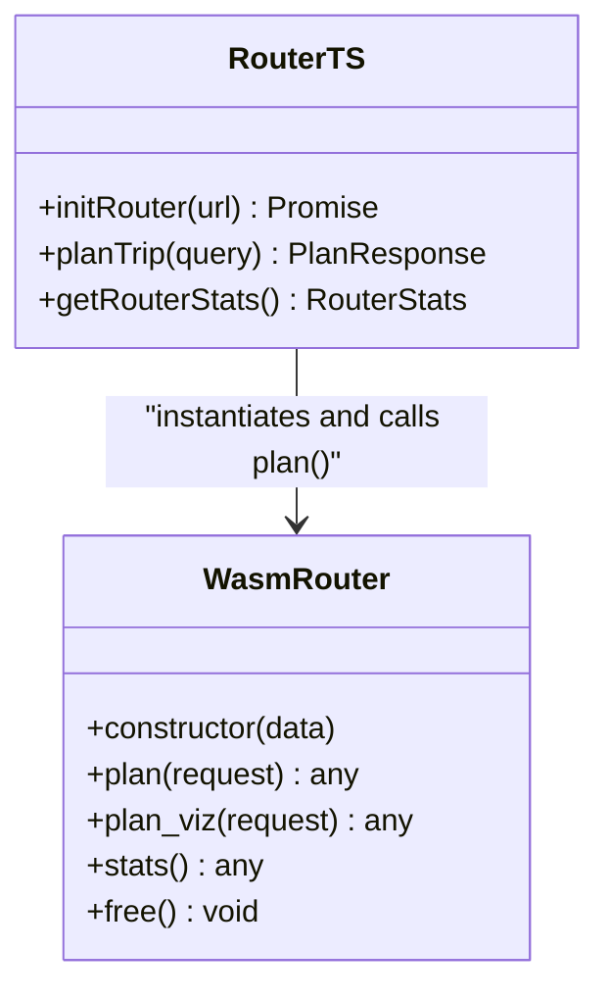
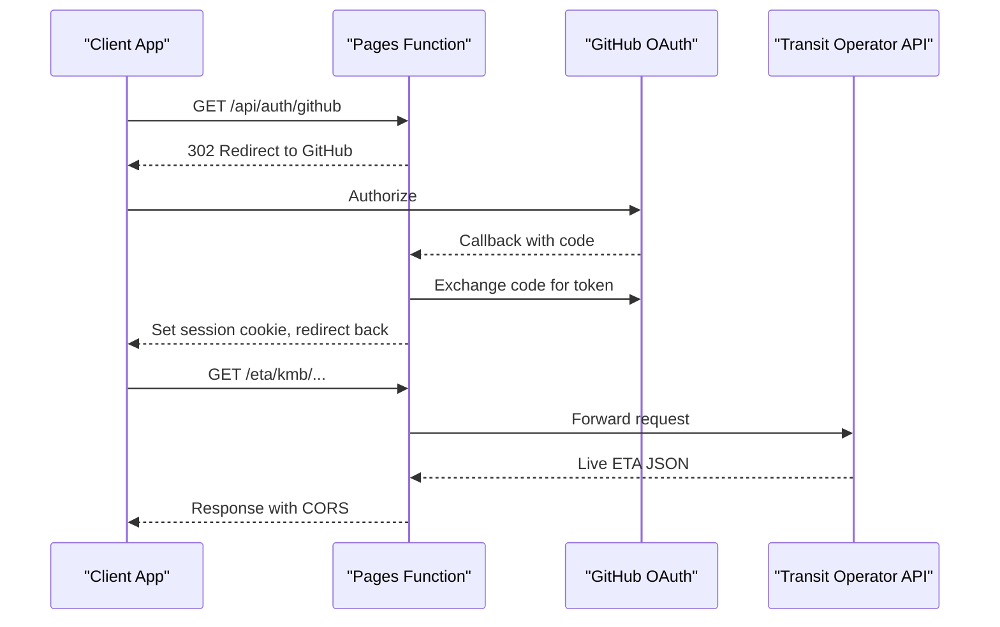
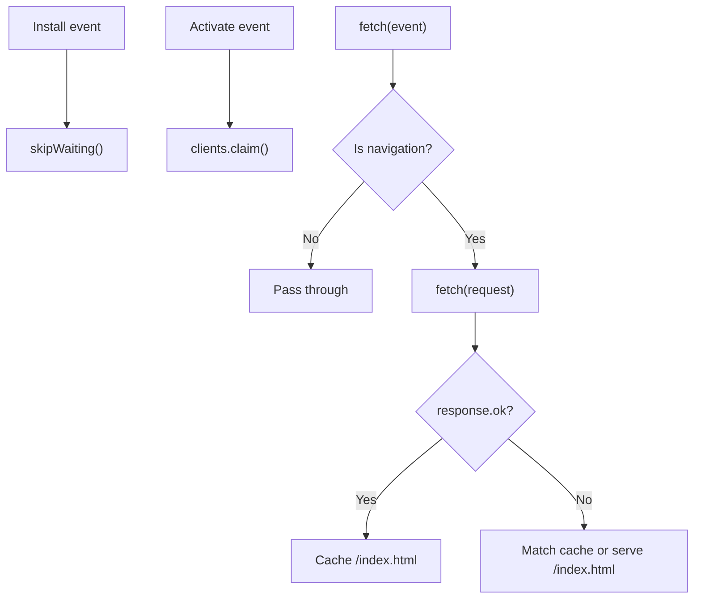
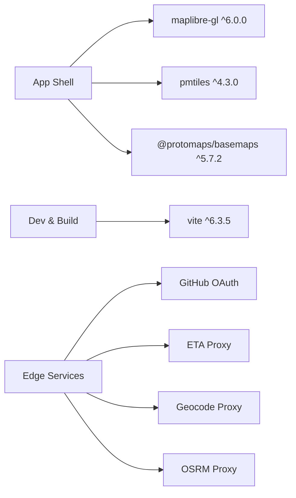

# Technology Stack

<cite>
**Referenced Files in This Document**
- [package.json](file://package.json)
- [vite.config.js](file://vite.config.js)
- [index.html](file://index.html)
- [src/main.js](file://src/main.js)
- [src/router.ts](file://src/router.ts)
- [src/pkg/wheels_router_nano.js](file://src/pkg/wheels_router_nano.js)
- [public/sw.js](file://public/sw.js)
- [public/manifest.webmanifest](file://public/manifest.webmanifest)
- [wrangler.toml](file://wrangler.toml)
- [functions/api/auth/[[path]].js](file://functions/api/auth/[[path]].js)
- [functions/_shared/github.js](file://functions/_shared/github.js)
- [functions/eta/[[path]].js](file://functions/eta/[[path]].js)
- [functions/geocode/[[path]].js](file://functions/geocode/[[path]].js)
- [functions/osrm/[[path]].js](file://functions/osrm/[[path]].js)
</cite>

## Table of Contents
1. Introduction
2. Project Structure
3. Core Components
4. Architecture Overview
5. Detailed Component Analysis
6. Dependency Analysis
7. Performance Considerations
8. Troubleshooting Guide
9. Conclusion

## Introduction
MorganTraveler is a modern Progressive Web App for Hong Kong transit that combines high-performance mapping, efficient data delivery, and real-time routing. The stack centers on MapLibre GL v6 for vector tile rendering, PMTiles for compact map data delivery, Protomaps basemaps for polished geographic visuals, and Vite for fast build tooling and development. A WebAssembly-based routing engine (RAPTOR via wheels-router-nano) runs route calculations directly in the browser for speed and privacy. Edge computing with Cloudflare Pages Functions provides authentication, ETA proxies, geocoding, and OSRM proxy endpoints. A minimal service worker ensures offline resilience by caching the app shell and providing navigation fallbacks. TypeScript integration adds type safety to critical routing logic.

## Project Structure
The application is organized into:
- Frontend entry and UI: index.html, src/main.js, public assets
- Mapping and routing: src/router.ts, src/pkg/* (WASM glue), MapLibre + PMTiles setup
- Build and dev tooling: vite.config.js, package.json scripts
- Edge functions: functions/* for auth, ETA, geocode, OSRM proxy
- PWA configuration: public/manifest.webmanifest, public/sw.js
- Deployment config: wrangler.toml for Cloudflare Pages

**Diagram sources**
- [index.html:1-80](file://index.html#L1-L80)
- [src/main.js:1997-2024](file://src/main.js#L1997-L2024)
- [src/router.ts:179-249](file://src/router.ts#L179-L249)
- [src/pkg/wheels_router_nano.js:1-60](file://src/pkg/wheels_router_nano.js#L1-L60)
- [public/sw.js:1-87](file://public/sw.js#L1-L87)
- [public/manifest.webmanifest:1-28](file://public/manifest.webmanifest#L1-L28)
- [vite.config.js:773-800](file://vite.config.js#L773-L800)
- [functions/api/auth/[[path]].js:85-255](file://functions/api/auth/[[path]].js#L85-L255)
- [functions/eta/[[path]].js:31-85](file://functions/eta/[[path]].js#L31-L85)
- [functions/geocode/[[path]].js:5-28](file://functions/geocode/[[path]].js#L5-L28)
- [functions/osrm/[[path]].js:5-24](file://functions/osrm/[[path]].js#L5-L24)

**Section sources**
- [package.json:1-37](file://package.json#L1-L37)
- [vite.config.js:773-800](file://vite.config.js#L773-L800)
- [index.html:1-80](file://index.html#L1-L80)

## Core Components
- MapLibre GL v6: Renders vector tiles from PMTiles with Protomaps basemaps; worker URL pinned to ensure correct module resolution in Vite builds.
- PMTiles: Custom protocol registered to stream vector tiles efficiently from a single archive.
- Protomaps basemaps: Provides styled vector layers and fonts/sprites for a dark theme optimized for transit maps.
- WebAssembly routing engine: RAPTOR implemented via wheels-router-nano; graph loaded from edge or local compressed file; plans computed in-browser.
- Edge functions (Cloudflare Pages): GitHub OAuth for contributions, ETA proxies for multiple operators, Nominatim geocoding proxy, OSRM proxy for densification.
- Service Worker: Minimal strategy that caches the HTML shell and serves it on navigation failures for offline cold starts.
- Vite: Development server with cross-origin isolation headers, local /edge proxy for COEP-safe asset loading, and middleware mirroring production auth/overrides APIs.
- TypeScript: Type definitions for the WASM router and structured query/response models for planning and ranking.

**Section sources**
- [src/main.js:1997-2024](file://src/main.js#L1997-L2024)
- [src/router.ts:179-249](file://src/router.ts#L179-L249)
- [src/pkg/wheels_router_nano.js:1-60](file://src/pkg/wheels_router_nano.js#L1-L60)
- [functions/eta/[[path]].js:31-85](file://functions/eta/[[path]].js#L31-L85)
- [functions/geocode/[[path]].js:5-28](file://functions/geocode/[[path]].js#L5-L28)
- [functions/osrm/[[path]].js:5-24](file://functions/osrm/[[path]].js#L5-L24)
- [public/sw.js:1-87](file://public/sw.js#L1-L87)
- [vite.config.js:111-120](file://vite.config.js#L111-L120)

## Architecture Overview
The runtime architecture integrates client-side rendering and computation with serverless edge services:
- The browser loads the PWA shell and initializes MapLibre with a PMTiles source pointing to an edge-hosted archive.
- Routing requests are handled by a WASM engine initialized with a prebuilt graph fetched from the edge or locally cached.
- Real-time ETAs and geocoding are proxied through Cloudflare Pages Functions to comply with CORS and COEP policies.
- Authentication flows use GitHub OAuth via Pages Functions, with session cookies managed server-side.
- The service worker intercepts navigations to provide offline fallback for the app shell.

**Diagram sources**
- [vite.config.js:773-800](file://vite.config.js#L773-L800)
- [src/main.js:1997-2024](file://src/main.js#L1997-L2024)
- [src/router.ts:179-249](file://src/router.ts#L179-L249)
- [functions/eta/[[path]].js:31-85](file://functions/eta/[[path]].js#L31-L85)
- [functions/geocode/[[path]].js:5-28](file://functions/geocode/[[path]].js#L5-L28)
- [functions/osrm/[[path]].js:5-24](file://functions/osrm/[[path]].js#L5-L24)

## Detailed Component Analysis

### Map Rendering with MapLibre GL v6 and PMTiles
- The app registers a custom PMTiles protocol and configures a vector source using a pmtiles URL.
- Protomaps basemaps provide layers, fonts, and sprites for a consistent dark theme.
- MapLibre worker URL is explicitly set to avoid Vite prebundle path issues.

**Diagram sources**
- [src/main.js:1997-2024](file://src/main.js#L1997-L2024)

**Section sources**
- [src/main.js:1997-2024](file://src/main.js#L1997-L2024)

### WebAssembly Routing Engine (RAPTOR via wheels-router-nano)
- The router initializes the WASM module and attempts to load the routing graph from multiple candidates (local .gz, edge URLs).
- Once loaded, the WasmRouter instance exposes plan and stats methods used by the UI to compute routes.
- Human-centric ranking rules adjust preferences for transfers, walks, and mode choices.

**Diagram sources**
- [src/pkg/wheels_router_nano.js:1-60](file://src/pkg/wheels_router_nano.js#L1-L60)
- [src/router.ts:179-249](file://src/router.ts#L179-L249)

**Section sources**
- [src/router.ts:179-249](file://src/router.ts#L179-L249)
- [src/pkg/wheels_router_nano.js:1-60](file://src/pkg/wheels_router_nano.js#L1-L60)

### Edge Computing with Cloudflare Pages Functions
- Authentication: GitHub OAuth flow handles authorize, callback, me, and logout endpoints with secure cookie management.
- ETA proxy: Routes operator-specific live data requests while preserving CORS and COEP compatibility.
- Geocoding proxy: Forwards Nominatim requests with appropriate headers and caching.
- OSRM proxy: Densifies bus shapes by proxying OSRM routing endpoints.

**Diagram sources**
- [functions/api/auth/[[path]].js:85-255](file://functions/api/auth/[[path]].js#L85-L255)
- [functions/_shared/github.js:1-38](file://functions/_shared/github.js#L1-L38)
- [functions/eta/[[path]].js:31-85](file://functions/eta/[[path]].js#L31-L85)

**Section sources**
- [functions/api/auth/[[path]].js:85-255](file://functions/api/auth/[[path]].js#L85-L255)
- [functions/_shared/github.js:1-38](file://functions/_shared/github.js#L1-L38)
- [functions/eta/[[path]].js:31-85](file://functions/eta/[[path]].js#L31-L85)
- [functions/geocode/[[path]].js:5-28](file://functions/geocode/[[path]].js#L5-L28)
- [functions/osrm/[[path]].js:5-24](file://functions/osrm/[[path]].js#L5-L24)

### Service Worker and Offline Support
- The service worker installs immediately and activates without waiting, then claims all clients.
- It only intercepts same-origin GET navigations, caching a copy of index.html for offline cold start.
- Cross-origin resources (data edge, fonts, APIs) are not intercepted to avoid policy conflicts.

**Diagram sources**
- [public/sw.js:11-29](file://public/sw.js#L11-L29)
- [public/sw.js:42-86](file://public/sw.js#L42-L86)

**Section sources**
- [public/sw.js:1-87](file://public/sw.js#L1-L87)

### Build Tooling and Development Experience with Vite
- Vite sets base to "/" for reliable asset paths in PWA contexts.
- Development server injects COEP/COOP/CORP headers to enable SharedArrayBuffer/WASM features.
- A local /edge proxy forwards requests to the production data origin with CORP headers for COEP compliance during development.
- Middleware mirrors production auth and overrides APIs for local contribution workflows.

**Section sources**
- [vite.config.js:111-120](file://vite.config.js#L111-L120)
- [vite.config.js:773-800](file://vite.config.js#L773-L800)
- [vite.config.js:122-737](file://vite.config.js#L122-L737)

### TypeScript Integration
- The routing layer defines typed interfaces for queries, plans, legs, and route options, improving reliability and developer experience.
- WASM glue types expose the WasmRouter class and initialization inputs for static analysis.

**Section sources**
- [src/router.ts:35-98](file://src/router.ts#L35-L98)
- [src/router.ts:121-177](file://src/router.ts#L121-L177)
- [src/pkg/wheels_router_nano.d.ts:1-39](file://src/pkg/wheels_router_nano.d.ts#L1-L39)

## Dependency Analysis
Core runtime dependencies include MapLibre GL v6, PMTiles, and Protomaps basemaps for mapping; Vite for build/dev; and Cloudflare Pages Functions for edge services. The WASM router is bundled under src/pkg and initialized at runtime.

**Diagram sources**
- [package.json:27-35](file://package.json#L27-L35)
- [functions/api/auth/[[path]].js:85-255](file://functions/api/auth/[[path]].js#L85-L255)
- [functions/eta/[[path]].js:31-85](file://functions/eta/[[path]].js#L31-L85)
- [functions/geocode/[[path]].js:5-28](file://functions/geocode/[[path]].js#L5-L28)
- [functions/osrm/[[path]].js:5-24](file://functions/osrm/[[path]].js#L5-L24)

**Section sources**
- [package.json:1-37](file://package.json#L1-L37)

## Performance Considerations
- Vector tiles via PMTiles reduce bandwidth and improve map responsiveness compared to raster tiles.
- WASM routing executes RAPTOR algorithms in-process, minimizing latency and enabling offline-capable computations when graphs are available.
- Edge proxies cache short-lived responses (e.g., ETA, geocode) to reduce upstream load and improve perceived performance.
- Vite’s dev server optimizes HMR and bundling; production builds benefit from tree-shaking and asset optimization.
- Service worker caching strategy avoids heavy interception to prevent mobile Safari issues while still supporting offline navigation.

[No sources needed since this section provides general guidance]

## Troubleshooting Guide
- Router graph load failures: Check network access to edge endpoints and verify COEP/COOP headers are present in development. Errors surface in the status element and console.
- PMTiles or basemap assets blocked: Ensure CORP headers are set on edge responses; in dev, the /edge proxy adds CORP to proxied responses.
- OAuth flow issues: Confirm client ID and secret are configured; state cookie validation enforces expiration and matching state values.
- Offline behavior: If the app appears unstyled offline, confirm the service worker has cached index.html and that navigations are being intercepted correctly.

**Section sources**
- [src/main.js:6278-6309](file://src/main.js#L6278-L6309)
- [vite.config.js:773-800](file://vite.config.js#L773-L800)
- [functions/api/auth/[[path]].js:166-250](file://functions/api/auth/[[path]].js#L166-L250)
- [public/sw.js:42-86](file://public/sw.js#L42-L86)

## Conclusion
MorganTraveler leverages a cohesive stack of modern web technologies to deliver a responsive, offline-resilient transit PWA for Hong Kong. MapLibre GL v6 and PMTiles provide efficient vector rendering, Protomaps basemaps ensure high-quality visuals, and the WASM-based routing engine enables fast, in-browser calculations. Cloudflare Pages Functions centralize authentication, real-time data access, and geocoding behind secure, cache-friendly endpoints. Vite streamlines development with robust tooling and environment parity, while the service worker guarantees basic offline functionality. Together, these components form a scalable architecture that supports real-time transit information and a smooth user experience across devices.