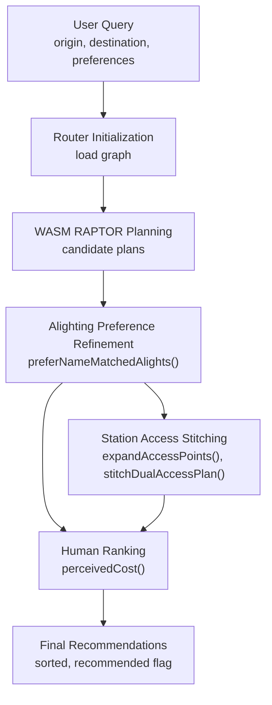
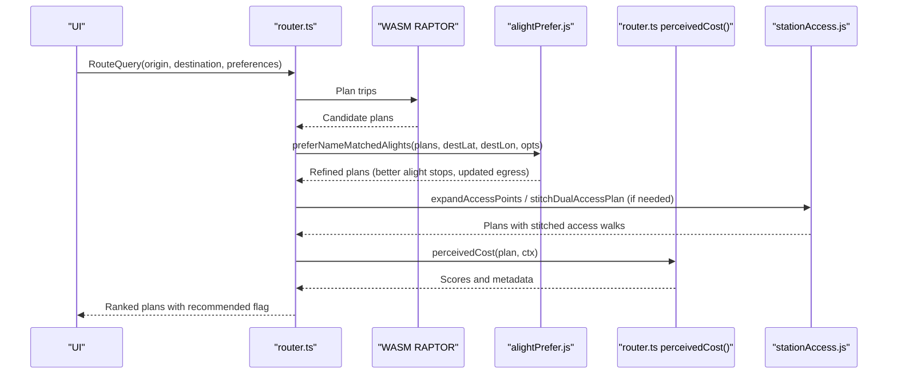
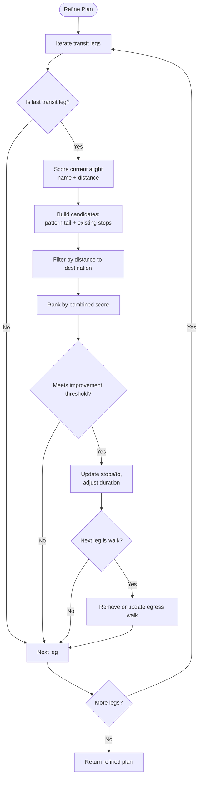
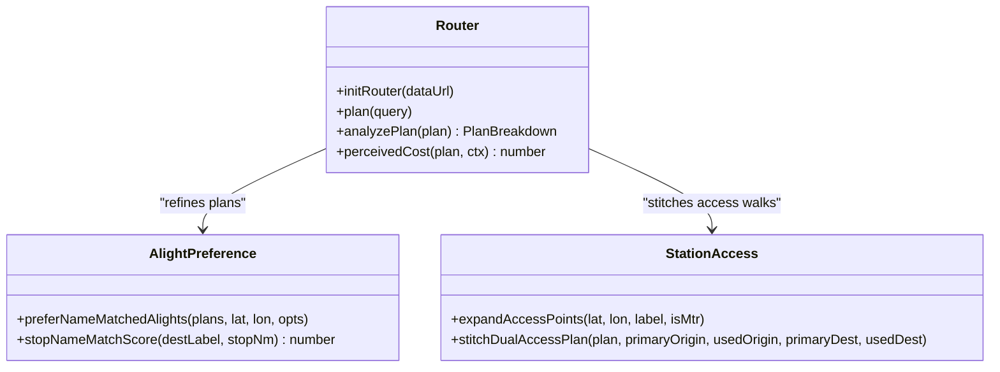
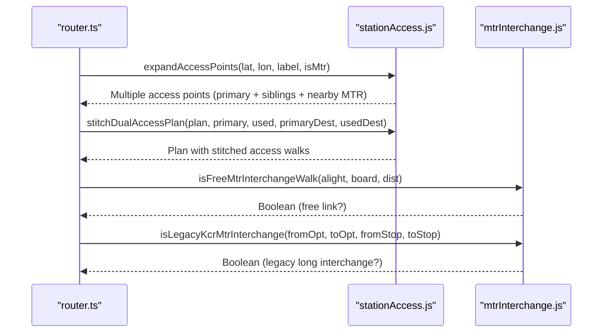
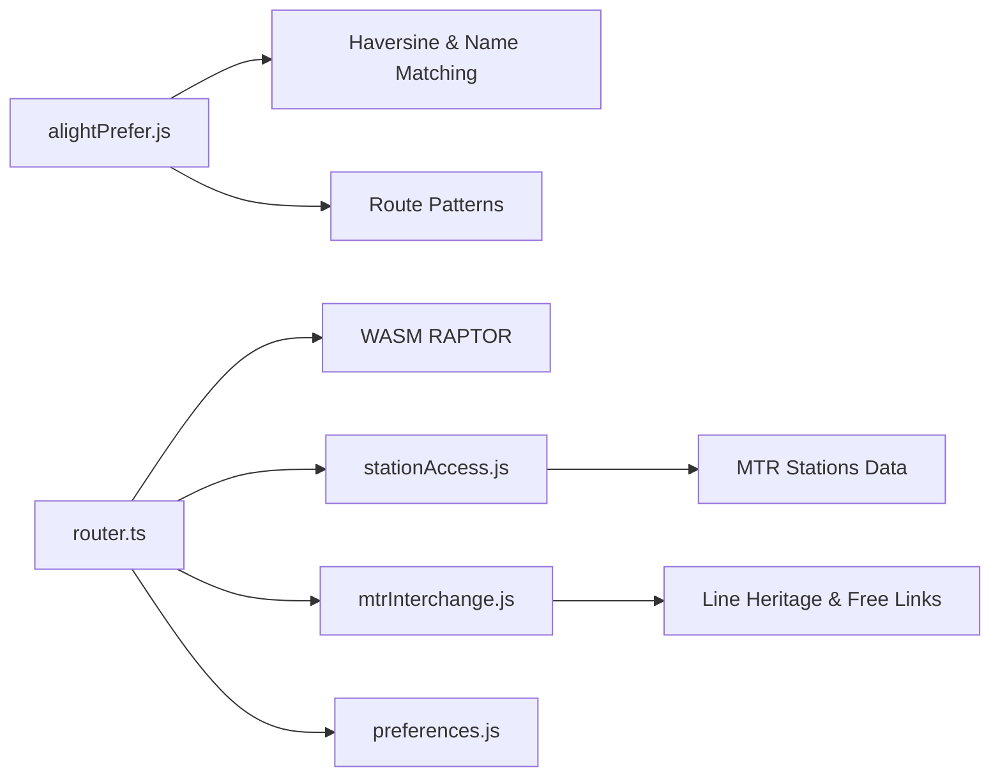

# Alighting Preference System

<cite>
**Referenced Files in This Document**
- [alightPrefer.js](file://src/alightPrefer.js)
- [router.ts](file://src/router.ts)
- [preferences.js](file://src/preferences.js)
- [stationAccess.js](file://src/stationAccess.js)
- [mtrInterchange.js](file://src/mtrInterchange.js)
</cite>

## Table of Contents
1. [Introduction](#introduction)
2. [Project Structure](#project-structure)
3. [Core Components](#core-components)
4. [Architecture Overview](#architecture-overview)
5. [Detailed Component Analysis](#detailed-component-analysis)
6. [Dependency Analysis](#dependency-analysis)
7. [Performance Considerations](#performance-considerations)
8. [Troubleshooting Guide](#troubleshooting-guide)
9. [Conclusion](#conclusion)
10. [Appendices](#appendices)

## Introduction
This document explains the alighting preference system that improves route suggestions by optimizing where passengers get off at transfer stations and major destinations. It focuses on how the system analyzes destination context and known route patterns to predict preferred exit points, how it integrates with the routing engine to minimize walking distance and improve transfer efficiency, and what customization and privacy considerations apply.

The system does not rely on per-user historical alighting logs; instead, it uses destination labels, proximity, and curated route patterns to infer the best alighting stop for a given trip. This approach avoids storing personal location history while still delivering personalized-feeling results based on explicit user inputs (destination name and preferences).

## Project Structure
The alighting preference feature is implemented as a post-processing layer over the RAPTOR-based router:
- The router generates candidate plans using the wheels-router WASM engine.
- The alighting preference module refines transit legs to prefer stops closer to the destination or better matched to the destination label.
- The ranking layer applies human-centric penalties and bonuses to produce final recommendations.
- Station access utilities stitch dual-access station walks so egress/ingress feels natural.

**Diagram sources**
- [router.ts:207-249](file://router.ts#L207-L249)
- [router.ts:825-970](file://router.ts#L825-L970)
- [alightPrefer.js:333-551](file://alightPrefer.js#L333-L551)
- [stationAccess.js:92-141](file://stationAccess.js#L92-L141)
- [stationAccess.js:155-235](file://stationAccess.js#L155-L235)

**Section sources**
- [router.ts:1-12](file://router.ts#L1-L12)
- [router.ts:207-249](file://router.ts#L207-L249)
- [alightPrefer.js:1-8](file://alightPrefer.js#L1-L8)
- [stationAccess.js:1-7](file://stationAccess.js#L1-L7)

## Core Components
- Alighting preference module: predicts preferred alighting stops using destination labels, proximity, and route-specific patterns.
- Routing engine wrapper: orchestrates RAPTOR planning, filters, and human-centric ranking.
- Preferences storage: persists user choices like fastest/simplest/cheapest, traffic methods, and bus companies.
- Station access utilities: expand origin/destination into multiple boarding/egress options and stitch free interchange walks.
- MTR interchange logic: identifies long transfers, free links, and indoor vs outdoor walk characteristics.

Key responsibilities:
- Prefer alighting at stops that match the destination label and are near the destination.
- Adjust egress walking time when a better alighting stop reduces total walk.
- Integrate with ranking to ensure improvements are meaningful before applying changes.
- Respect user preferences and mode filters during planning and ranking.

**Section sources**
- [alightPrefer.js:109-238](file://alightPrefer.js#L109-L238)
- [alightPrefer.js:333-551](file://alightPrefer.js#L333-L551)
- [router.ts:825-970](file://router.ts#L825-L970)
- [preferences.js:1-20](file://preferences.js#L1-L20)
- [stationAccess.js:92-141](file://stationAccess.js#L92-L141)
- [mtrInterchange.js:212-285](file://mtrInterchange.js#L212-L285)

## Architecture Overview
The system follows a layered architecture:
1. Input normalization and preference loading.
2. Graph initialization and RAPTOR planning.
3. Post-planning refinement via alighting preference logic.
4. Human-centric ranking with transfer, walk, and fare considerations.
5. Output preparation with recommended plan marking.

**Diagram sources**
- [router.ts:207-249](file://router.ts#L207-L249)
- [router.ts:825-970](file://router.ts#L825-L970)
- [alightPrefer.js:333-551](file://alightPrefer.js#L333-L551)
- [stationAccess.js:92-141](file://stationAccess.js#L92-L141)
- [stationAccess.js:155-235](file://stationAccess.js#L155-L235)

## Detailed Component Analysis

### Alighting Preference Module
Purpose:
- Improve alighting stops for transit legs to reduce walking distance and align with destination labels.
- Use curated route patterns near key hubs (e.g., Tung Chung area) to extend rides to optimal exits.

Algorithm highlights:
- Name matching: tokenizes destination and stop names, rewards distinctive shared tokens, penalizes mismatches (e.g., cable car vs station).
- Distance scoring: favors stops within a reasonable radius of the destination; small bonus for closer stops.
- Pattern tail selection: for specific routes, considers later stops along the pattern that are near the destination.
- Improvement gate: only applies changes if the new alight significantly improves name match, distance, or combined score.
- Egress adjustment: updates or removes subsequent walk legs to reflect reduced walking after a better alight.

**Diagram sources**
- [alightPrefer.js:333-551](file://alightPrefer.js#L333-L551)

**Section sources**
- [alightPrefer.js:109-238](file://alightPrefer.js#L109-L238)
- [alightPrefer.js:267-302](file://alightPrefer.js#L267-L302)
- [alightPrefer.js:333-551](file://alightPrefer.js#L333-L551)

### Routing Engine Integration
The router:
- Initializes the WASM graph and runs RAPTOR planning.
- Applies filters for allowed traffic methods and bus companies.
- Computes human-centric scores to rank plans, factoring in transfers, walking, and fares.
- Integrates alighting preference refinement to improve egress quality.

Key integration points:
- Import and call preferNameMatchedAlights to refine plans before ranking.
- Use analyzePlan to compute transfer counts, walk meters, and other features for ranking.
- Apply perceivedCost to blend weights based on user preferences (fastest/simplest/cheapest).

**Diagram sources**
- [router.ts:207-249](file://router.ts#L207-L249)
- [router.ts:649-800](file://router.ts#L649-L800)
- [router.ts:825-970](file://router.ts#L825-L970)
- [alightPrefer.js:333-551](file://alightPrefer.js#L333-L551)
- [stationAccess.js:92-141](file://stationAccess.js#L92-L141)
- [stationAccess.js:155-235](file://stationAccess.js#L155-L235)

**Section sources**
- [router.ts:1-12](file://router.ts#L1-L12)
- [router.ts:207-249](file://router.ts#L207-L249)
- [router.ts:649-800](file://router.ts#L649-L800)
- [router.ts:825-970](file://router.ts#L825-L970)

### User Behavior Tracking and Personalization
Behavior tracking:
- The system does not store per-user historical alighting events. Instead, it infers preferences from explicit inputs:
  - Destination label and coordinates.
  - Selected ranking goals (fastest/simplest/cheapest).
  - Allowed traffic methods and bus companies.

Personalization features:
- Multi-select preferences allow blending goals (e.g., fastest + simplest).
- Traffic method filters influence which modes appear in results.
- Bus company filters narrow operator coverage.
- Service day and departure time affect scheduling and calendar alignment.

Privacy considerations:
- All preferences are stored locally in the browser’s localStorage under named keys.
- No server-side collection of personal location history or alighting behavior is performed by these modules.
- Local storage operations include error handling to gracefully handle private browsing or disabled storage.

**Section sources**
- [preferences.js:1-20](file://preferences.js#L1-L20)
- [preferences.js:330-364](file://preferences.js#L330-L364)
- [preferences.js:369-431](file://preferences.js#L369-L431)
- [preferences.js:468-544](file://preferences.js#L468-L544)

### Integration with Station Access and MTR Interchange Logic
- Dual-access complexes (e.g., Central ↔ Hong Kong, Tsim Sha Tsui ↔ East Tsim Sha Tsui) are expanded to offer alternative boarding/egress points.
- When a plan uses a sibling station, access walks are stitched to reflect the true user origin/destination.
- Free interchange walks are recognized and treated differently in ranking and visualization.

**Diagram sources**
- [stationAccess.js:92-141](file://stationAccess.js#L92-L141)
- [stationAccess.js:155-235](file://stationAccess.js#L155-L235)
- [mtrInterchange.js:212-285](file://mtrInterchange.js#L212-L285)
- [mtrInterchange.js:155-208](file://mtrInterchange.js#L155-L208)

**Section sources**
- [stationAccess.js:92-141](file://stationAccess.js#L92-L141)
- [stationAccess.js:155-235](file://stationAccess.js#L155-L235)
- [mtrInterchange.js:212-285](file://mtrInterchange.js#L212-L285)
- [mtrInterchange.js:155-208](file://mtrInterchange.js#L155-L208)

## Dependency Analysis
- Alighting preference depends on:
  - Haversine distance calculations for proximity scoring.
  - Route patterns for known approaches to key stations.
  - Destination label normalization and tokenization for name matching.
- Router depends on:
  - WASM RAPTOR for core planning.
  - Station access utilities for dual-access handling.
  - MTR interchange utilities for transfer classification and penalties.
- Preferences module provides:
  - Persistent user settings for ranking goals, traffic methods, and operators.

**Diagram sources**
- [alightPrefer.js:91-100](file://alightPrefer.js#L91-L100)
- [alightPrefer.js:123-159](file://alightPrefer.js#L123-L159)
- [alightPrefer.js:27-83](file://alightPrefer.js#L27-L83)
- [router.ts:207-249](file://router.ts#L207-L249)
- [stationAccess.js:92-141](file://stationAccess.js#L92-L141)
- [mtrInterchange.js:212-285](file://mtrInterchange.js#L212-L285)
- [preferences.js:330-431](file://preferences.js#L330-L431)

**Section sources**
- [alightPrefer.js:91-100](file://alightPrefer.js#L91-L100)
- [alightPrefer.js:123-159](file://alightPrefer.js#L123-L159)
- [alightPrefer.js:27-83](file://alightPrefer.js#L27-L83)
- [router.ts:207-249](file://router.ts#L207-L249)
- [stationAccess.js:92-141](file://stationAccess.js#L92-L141)
- [mtrInterchange.js:212-285](file://mtrInterchange.js#L212-L285)
- [preferences.js:330-431](file://preferences.js#L330-L431)

## Performance Considerations
- Name matching and tokenization operate on short strings; complexity is low and suitable for per-plan processing.
- Pattern lookups use direct map access by route key; constant-time retrieval.
- Candidate evaluation iterates over limited sets (pattern tail and existing stops), typically small per leg.
- Distance checks filter candidates early to avoid unnecessary computations.
- Overall refinement cost scales linearly with the number of legs and candidates per leg.

[No sources needed since this section provides general guidance]

## Troubleshooting Guide
Common issues and resolutions:
- No alighting change applied:
  - Ensure destination label or station flag is provided; otherwise, name-matched alighting is skipped.
  - Verify that candidate stops are within the distance threshold and meet improvement thresholds.
- Unexpected egress walk updates:
  - Check whether the next leg is classified as egress and whether the new alight reduces walking sufficiently.
- Plans filtered out:
  - Confirm traffic method and bus company filters allow the plan’s modes and operators.
- Dual-access stitching not visible:
  - Validate that origin/destination pins are near dual-access complexes and that stitching conditions are met.

**Section sources**
- [alightPrefer.js:333-340](file://alightPrefer.js#L333-L340)
- [alightPrefer.js:386-437](file://alightPrefer.js#L386-L437)
- [alightPrefer.js:492-527](file://alightPrefer.js#L492-L527)
- [router.ts:468-563](file://router.ts#L468-L563)
- [stationAccess.js:155-235](file://stationAccess.js#L155-L235)

## Conclusion
The alighting preference system enhances route suggestions by intelligently selecting alighting stops that minimize walking and align with destination context. It leverages destination labels, proximity, and curated route patterns to improve transfer efficiency without relying on personal historical data. Integration with the routing engine ensures that improvements are meaningful and consistent with user preferences. Privacy is preserved by keeping all preferences local and avoiding persistent location tracking.

[No sources needed since this section summarizes without analyzing specific files]

## Appendices

### Preference Weights and Customization Options
- Ranking goals:
  - Fastest: prioritizes shorter travel time.
  - Simplest: prefers fewer transfers.
  - Cheapest: incorporates fare information when available.
- Traffic methods:
  - Selectable modes (bus, gmb, lrt, mtr, walk, ael) influence which plans are considered.
- Bus companies:
  - Operator filters allow focusing on specific franchises.
- Service day and departure time:
  - Influence scheduling and calendar alignment for planning.

**Section sources**
- [preferences.js:21-34](file://preferences.js#L21-L34)
- [preferences.js:36-52](file://preferences.js#L36-L52)
- [preferences.js:61-69](file://preferences.js#L61-L69)
- [preferences.js:330-431](file://preferences.js#L330-L431)

### Example Scenarios
- Destination is a station:
  - The system favors alighting at stops labeled as station or terminus near the destination.
- Destination is a cable car:
  - The system boosts matches to cable car stops and penalizes rail/bus station stops.
- Near a hub with known patterns:
  - For routes approaching a station, the system extends the ride to the best-matching stop along the pattern.

**Section sources**
- [alightPrefer.js:169-220](file://alightPrefer.js#L169-L220)
- [alightPrefer.js:267-302](file://alightPrefer.js#L267-L302)
- [alightPrefer.js:386-437](file://alightPrefer.js#L386-L437)

### Privacy Considerations
- Preferences are stored in localStorage under explicit keys.
- No server-side collection of personal alighting behavior or location history occurs in these modules.
- Error handling ensures graceful operation in private browsing or restricted storage environments.

**Section sources**
- [preferences.js:6-13](file://preferences.js#L6-L13)
- [preferences.js:330-364](file://preferences.js#L330-L364)
- [preferences.js:369-431](file://preferences.js#L369-L431)