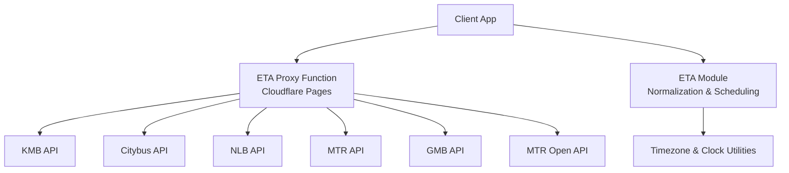
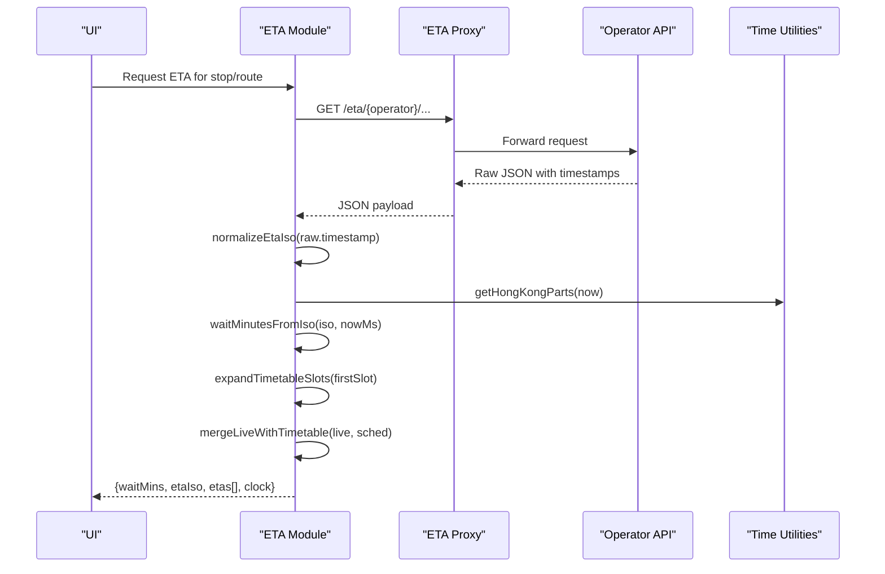
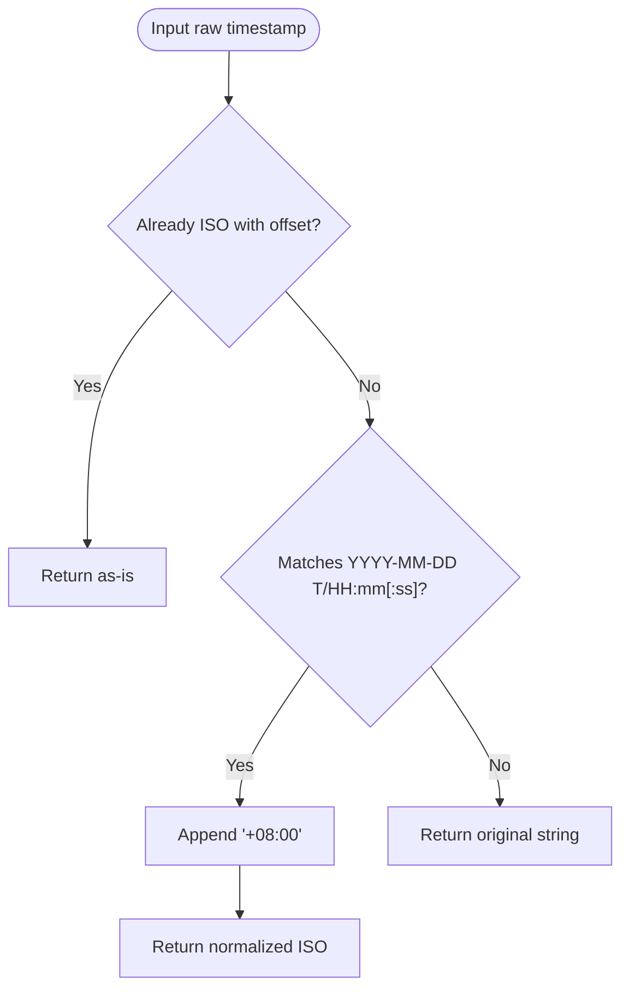
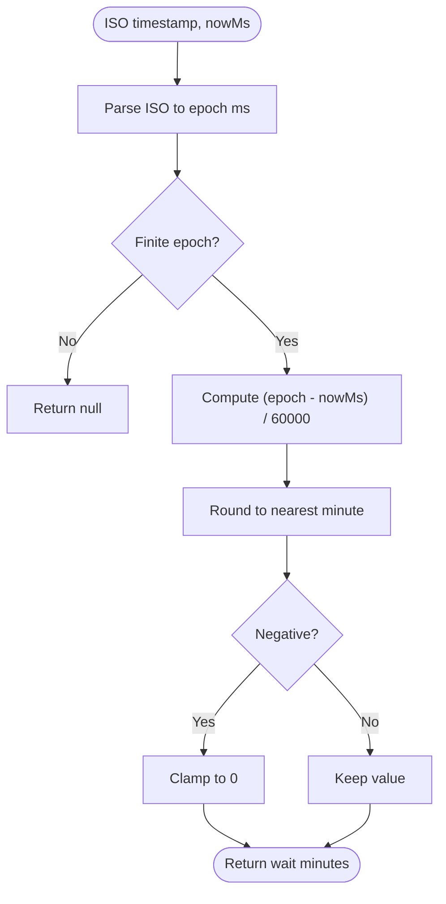
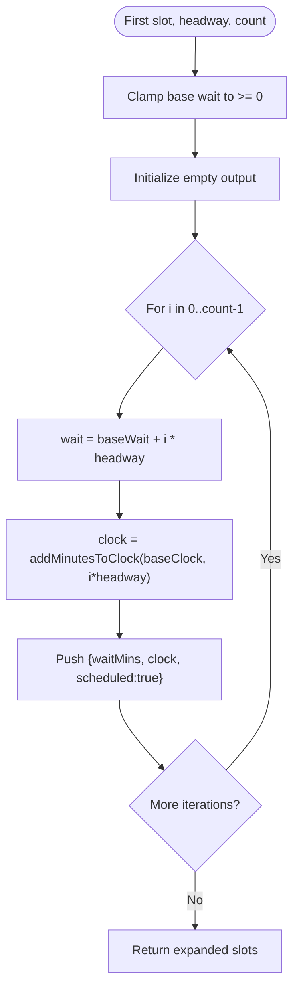
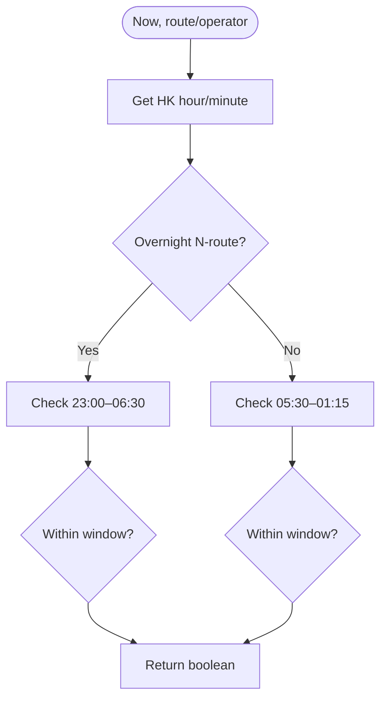
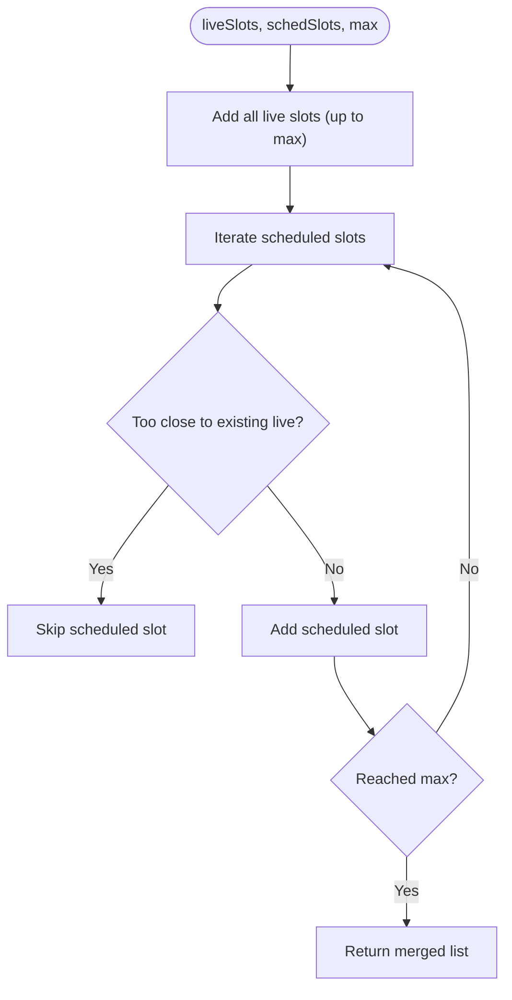
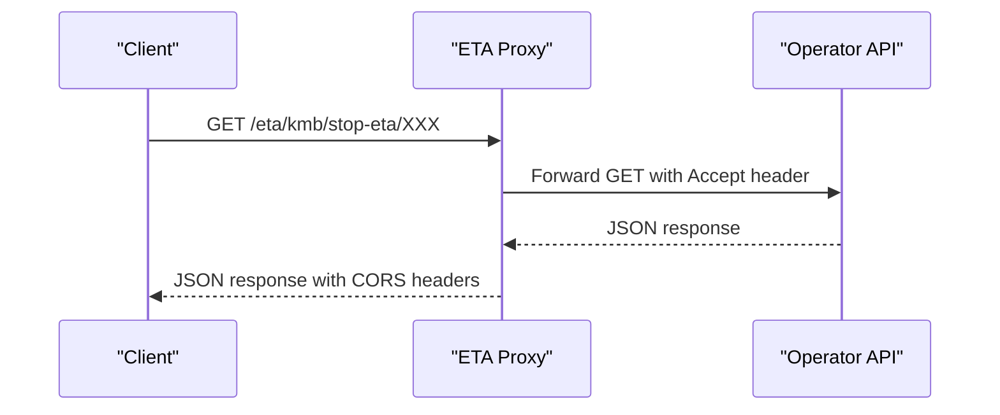
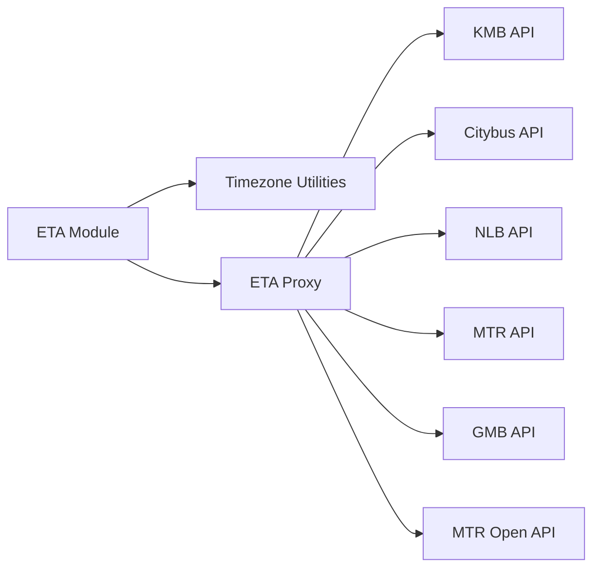

# Data Processing

<cite>
**Referenced Files in This Document**
- [eta.js](file://src/eta.js)
- [preferences.js](file://src/preferences.js)
- [[path]].js](file://functions/eta/[[path]].js)
</cite>

## Table of Contents
1. [Introduction](#introduction)
2. [Project Structure](#project-structure)
3. [Core Components](#core-components)
4. [Architecture Overview](#architecture-overview)
5. [Detailed Component Analysis](#detailed-component-analysis)
6. [Dependency Analysis](#dependency-analysis)
7. [Performance Considerations](#performance-considerations)
8. [Troubleshooting Guide](#troubleshooting-guide)
9. [Conclusion](#conclusion)

## Introduction
This document explains the ETA data processing pipeline with a focus on:
- Normalizing timestamps from various operator APIs into standard ISO strings with timezone offsets
- Calculating wait minutes, including handling negative values and arrival times
- Expanding timetables to generate multiple departure slots using headway intervals
- Detecting service windows for overnight routes and typical day services
- Merging live ETA data with scheduled timetables to produce consistent UI outputs

The implementation is centered around a shared ETA module that normalizes, computes, and formats time-related data across operators, while a Cloudflare Pages function proxies requests to official open-data endpoints in a CORS-safe manner.

## Project Structure
At a high level:
- The client-side ETA logic lives in a single module that handles normalization, scheduling, and merging
- A proxy function forwards requests to operator APIs (KMB, Citybus, NLB, MTR, GMB, MTR Open)
- Shared utilities provide Hong Kong timezone-aware formatting and parsing

**Diagram sources**
- [[path]].js:1-86](file://functions/eta/[[path]].js#L1-L86)
- [eta.js:1-800](file://src/eta.js#L1-L800)
- [preferences.js:214-325](file://src/preferences.js#L214-L325)

**Section sources**
- [[path]].js:1-86](file://functions/eta/[[path]].js#L1-L86)
- [eta.js:1-800](file://src/eta.js#L1-L800)
- [preferences.js:214-325](file://src/preferences.js#L214-L325)

## Core Components
- Timestamp normalization: Converts varied timestamp formats into ISO strings with explicit timezone offsets for reliable calculations
- Wait time calculation: Computes minutes until arrival or departure, clamping negative values to zero
- Schedule expansion: Generates multiple future departures from a single scheduled time using headway intervals
- Service window detection: Determines whether current time falls within typical service hours or overnight route windows
- Live + schedule merge: Combines live ETAs with timetable-based placeholders without duplicating close arrivals

**Section sources**
- [eta.js:150-178](file://src/eta.js#L150-L178)
- [eta.js:154-160](file://src/eta.js#L154-L160)
- [eta.js:357-396](file://src/eta.js#L357-L396)
- [eta.js:243-289](file://src/eta.js#L243-L289)
- [eta.js:398-428](file://src/eta.js#L398-L428)

## Architecture Overview
The pipeline integrates three layers:
- Data acquisition via a proxy that forwards requests to operator APIs
- Normalization and computation in the ETA module
- Formatting and display using timezone-aware utilities

**Diagram sources**
- [eta.js:166-178](file://src/eta.js#L166-L178)
- [eta.js:154-160](file://src/eta.js#L154-L160)
- [eta.js:357-396](file://src/eta.js#L357-L396)
- [eta.js:398-428](file://src/eta.js#L398-L428)
- [[path]].js:31-85](file://functions/eta/[[path]].js#L31-L85)
- [preferences.js:214-241](file://src/preferences.js#L214-L241)

## Detailed Component Analysis

### Timestamp Normalization
- Purpose: Convert diverse timestamp formats from operator APIs into a consistent ISO string with an explicit offset
- Behavior:
  - If already ISO with offset, return unchanged
  - If a naive datetime like "YYYY-MM-DD HH:mm:ss", treat it as HKT and append "+08:00"
  - Otherwise return original string if present
- Integration: Used when building ETA slots from raw operator responses

**Diagram sources**
- [eta.js:166-178](file://src/eta.js#L166-L178)

**Section sources**
- [eta.js:166-178](file://src/eta.js#L166-L178)

### Wait Minutes Calculation
- Purpose: Compute minutes until arrival or departure from current time
- Behavior:
  - Parse ISO timestamp to epoch milliseconds
  - Subtract current time and convert to minutes
  - Clamp negative values to zero (already arrived/due)
  - For service-day clocks, compute difference against Hong Kong wall time and handle overnight wrap-around
- Notes:
  - Negative values are treated as zero to avoid confusing “negative wait” in UI
  - Arrival times can be represented by zero wait minutes

**Diagram sources**
- [eta.js:154-160](file://src/eta.js#L154-L160)
- [eta.js:214-225](file://src/eta.js#L214-L225)

**Section sources**
- [eta.js:154-160](file://src/eta.js#L154-L160)
- [eta.js:214-225](file://src/eta.js#L214-L225)

### Timetable Expansion Algorithm
- Purpose: Generate multiple future departure slots from a single scheduled time using headway intervals
- Inputs:
  - First slot with base wait minutes and optional clock/ISO
  - Headway interval (minutes), typically derived per operator/mode
  - Count of desired slots
- Behavior:
  - Base wait is rounded and clamped to non-negative
  - Each subsequent slot adds headway to previous wait
  - Wall-clock times are computed by adding headway increments to the first clock
  - Only the first slot retains the live ISO; others are marked as scheduled
- Default headways:
  - Rail/subway: shorter intervals
  - Light rail/tram: moderate intervals
  - Bus operators: operator-specific defaults
  - Fallback default for unspecified modes

**Diagram sources**
- [eta.js:357-396](file://src/eta.js#L357-L396)
- [eta.js:227-241](file://src/eta.js#L227-L241)

**Section sources**
- [eta.js:357-396](file://src/eta.js#L357-L396)
- [eta.js:227-241](file://src/eta.js#L227-L241)

### Service Window Detection and Overnight Handling
- Purpose: Determine whether current time falls within typical service hours or overnight route windows
- Logic:
  - Extract Hong Kong wall time parts
  - For overnight N-routes, allow late evening through early morning
  - For day routes, allow early morning through shortly after midnight
- Use cases:
  - Gate invented headway grids outside service hours
  - Mark results as “outside service” when appropriate

**Diagram sources**
- [eta.js:243-289](file://src/eta.js#L243-L289)
- [preferences.js:214-241](file://src/preferences.js#L214-L241)

**Section sources**
- [eta.js:243-289](file://src/eta.js#L243-L289)
- [preferences.js:214-241](file://src/preferences.js#L214-L241)

### Merging Live Data with Scheduled Timetables
- Purpose: Combine live ETAs with scheduled placeholders to ensure up-to-date and complete departure lists
- Rules:
  - Live slots take precedence and appear first
  - Scheduled slots fill gaps but avoid duplicates within a small threshold (about 2.5 minutes)
  - Cap total rows to a maximum (typically 3)
- Outcome:
  - Consistent presentation with live data prioritized
  - Scheduled slots only used when no live data exists or to pad beyond live entries

**Diagram sources**
- [eta.js:398-428](file://src/eta.js#L398-L428)

**Section sources**
- [eta.js:398-428](file://src/eta.js#L398-L428)

### Proxy Integration for Operator APIs
- Purpose: Provide a CORS-safe, same-origin endpoint that forwards requests to official open-data APIs
- Features:
  - Maps operator prefixes to target URLs
  - Forwards method, headers, and body where needed (e.g., POST for certain schedules)
  - Sets cache headers appropriately for GET vs non-GET methods
  - Returns standardized error responses for unknown operators

**Diagram sources**
- [[path]].js:15-85](file://functions/eta/[[path]].js#L15-L85)

**Section sources**
- [[path]].js:15-85](file://functions/eta/[[path]].js#L15-L85)

## Dependency Analysis
Key dependencies and relationships:
- ETA module depends on:
  - Timezone utilities for Hong Kong time parsing and formatting
  - Operator-specific fetchers that use the proxy
- Proxy depends on:
  - Operator API endpoints mapped by prefix
- Formatting functions depend on:
  - Intl.DateTimeFormat with Asia/Hong_Kong timezone

**Diagram sources**
- [eta.js:1-800](file://src/eta.js#L1-L800)
- [[path]].js:15-85](file://functions/eta/[[path]].js#L15-L85)
- [preferences.js:214-325](file://src/preferences.js#L214-L325)

**Section sources**
- [eta.js:1-800](file://src/eta.js#L1-L800)
- [[path]].js:15-85](file://functions/eta/[[path]].js#L15-L85)
- [preferences.js:214-325](file://src/preferences.js#L214-L325)

## Performance Considerations
- Caching: Short-lived in-memory cache reduces repeated network calls for ETA data
- Minimal recomputation: Normalize timestamps once and reuse across calculations
- Efficient merging: Avoid duplicate scheduled entries by checking proximity to live entries
- Headway generation: Bounded counts and clamped intervals prevent excessive slot generation

[No sources needed since this section provides general guidance]

## Troubleshooting Guide
Common issues and resolutions:
- Invalid timestamps: Ensure inputs are valid ISO or parseable datetime strings; invalid inputs result in null wait minutes
- Negative wait minutes: Automatically clamped to zero; verify current time and source timestamps if unexpected behavior occurs
- Outside service hours: No invented headway grid will be generated; confirm route type and current time
- Duplicate scheduled entries: Merge logic avoids close duplicates; adjust thresholds if necessary
- Proxy errors: Unknown operator prefix returns 404; verify correct operator mapping and path

**Section sources**
- [eta.js:154-160](file://src/eta.js#L154-L160)
- [eta.js:243-289](file://src/eta.js#L243-L289)
- [[path]].js:45-53](file://functions/eta/[[path]].js#L45-L53)

## Conclusion
The ETA data processing pipeline robustly normalizes timestamps, calculates wait times, expands timetables using headway intervals, detects service windows for both day and overnight routes, and merges live data with scheduled timetables to deliver consistent, user-friendly outputs. The architecture separates concerns between data acquisition, computation, and formatting, ensuring maintainability and clarity.

[No sources needed since this section summarizes without analyzing specific files]