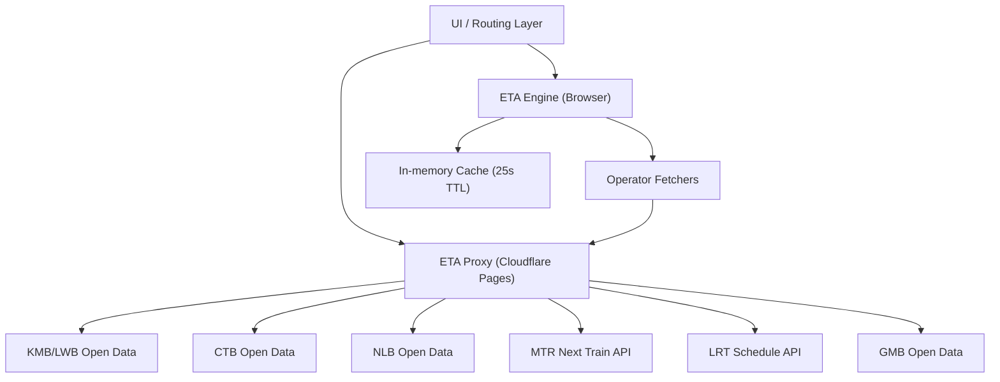
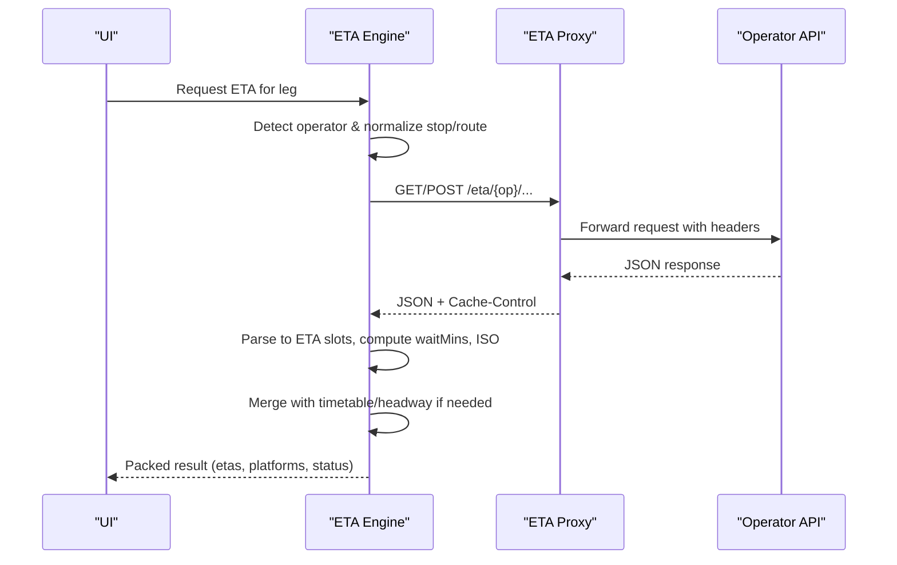
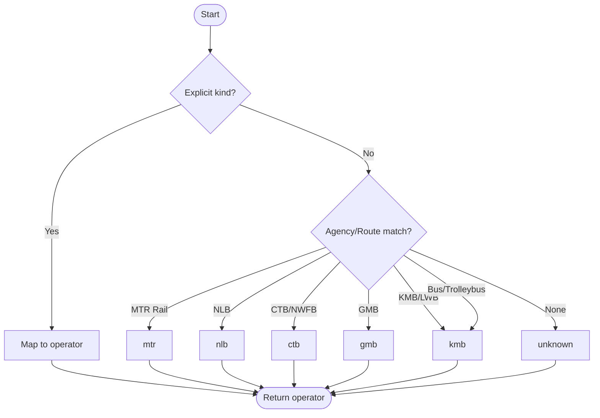
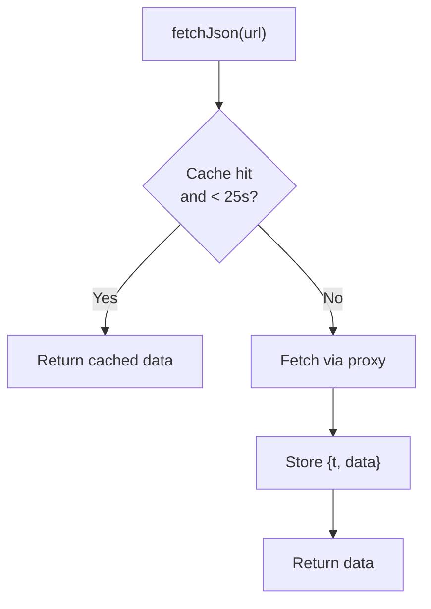
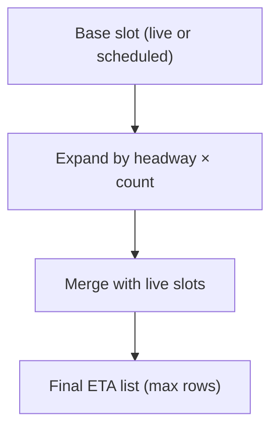
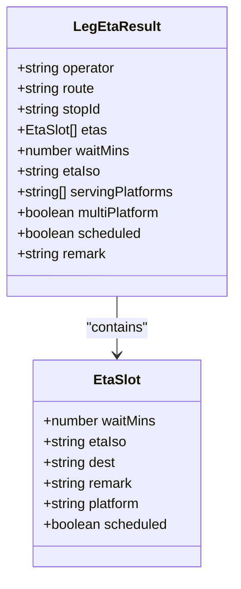
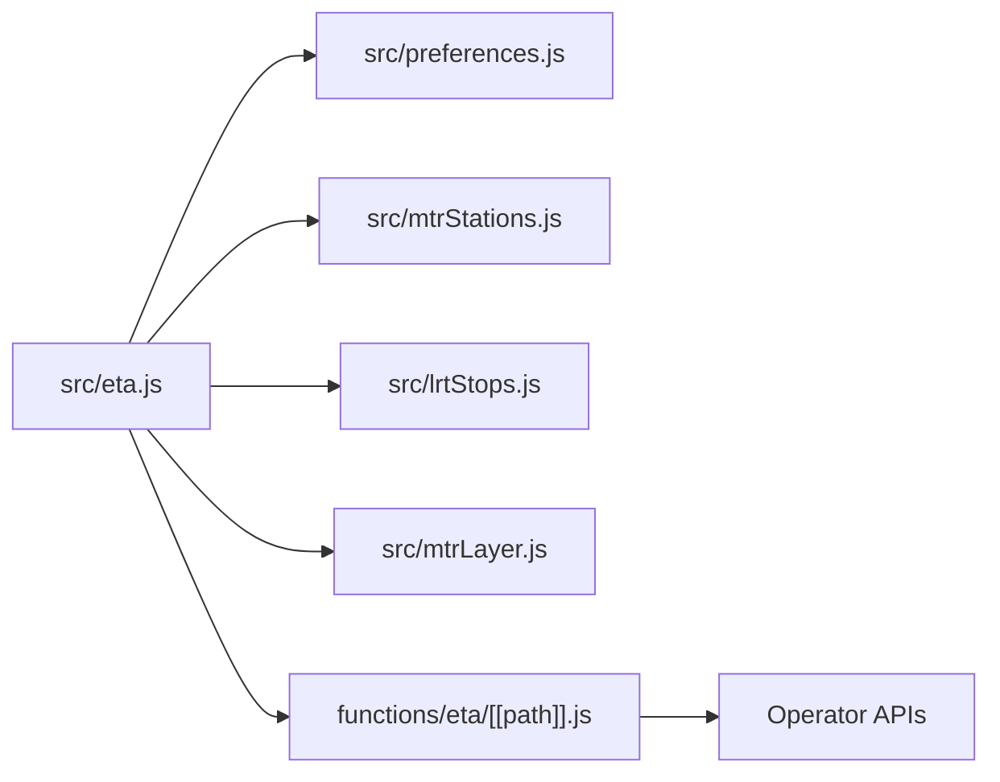

# ETA Calculation Engine

<cite>
**Referenced Files in This Document**
- [functions/eta/[[path]].js](file://functions/eta/[[path]].js)
- [src/eta.js](file://src/eta.js)
- [src/preferences.js](file://src/preferences.js)
- [src/mtrStations.js](file://src/mtrStations.js)
- [src/lrtStops.js](file://src/lrtStops.js)
- [src/mtrLayer.js](file://src/mtrLayer.js)
</cite>

## Table of Contents
1. [Introduction](#introduction)
2. [Project Structure](#project-structure)
3. [Core Components](#core-components)
4. [Architecture Overview](#architecture-overview)
5. [Detailed Component Analysis](#detailed-component-analysis)
6. [Dependency Analysis](#dependency-analysis)
7. [Performance Considerations](#performance-considerations)
8. [Troubleshooting Guide](#troubleshooting-guide)
9. [Conclusion](#conclusion)

## Introduction
This document explains the ETA calculation engine that provides real-time arrival predictions and schedule integration for Hong Kong transit operators: KMB/LWB, CTB, NLB, MTR (heavy rail), LRT (light rail), and GMB (green minibus). It covers operator detection, stop ID normalization, service type handling, caching with a 25-second TTL, error handling and fallback strategies when live data is unavailable, ISO timestamp normalization, wait time calculations, headway-based timetable expansion, and the platform information system that indicates which doors to use for optimal transfers and multi-platform stations.

## Project Structure
The ETA engine spans two layers:
- A Cloudflare Pages Function proxy that forwards requests to operator open-data endpoints with CORS and short-lived caching headers.
- A browser-side module that orchestrates fetching, parsing, normalizing, and presenting ETAs across operators, including fallbacks and timetable expansion.

**Diagram sources**
- [functions/eta/[[path]].js:15-84](file://functions/eta/[[path]].js#L15-L84)
- [src/eta.js:16-42](file://src/eta.js#L16-L42)

**Section sources**
- [functions/eta/[[path]].js:1-86](file://functions/eta/[[path]].js#L1-L86)
- [src/eta.js:1-42](file://src/eta.js#L1-L42)

## Core Components
- Operator detection and routing: Determines the correct operator and fetcher based on route metadata and mode.
- Stop ID normalization: Strips operator prefixes and adapts IDs per operator requirements.
- Live ETA fetchers: Per-operator functions that call the proxy and parse responses into normalized slots.
- Timetable expansion and merging: Fills gaps with headway-based scheduled departures when live data is missing or sparse.
- Platform information: Detects single vs multiple platforms and formats labels for optimal transfer guidance.
- Caching and freshness: In-memory cache with 25-second TTL; proxy-level short cache for GETs.

**Section sources**
- [src/eta.js:57-112](file://src/eta.js#L57-L112)
- [src/eta.js:47-55](file://src/eta.js#L47-L55)
- [src/eta.js:692-815](file://src/eta.js#L692-L815)
- [src/eta.js:921-1016](file://src/eta.js#L921-L1016)
- [src/eta.js:1165-1240](file://src/eta.js#L1165-L1240)
- [src/eta.js:1269-1338](file://src/eta.js#L1269-L1338)
- [src/eta.js:1345-1428](file://src/eta.js#L1345-L1428)
- [src/eta.js:1436-1589](file://src/eta.js#L1436-L1589)
- [src/eta.js:357-428](file://src/eta.js#L357-L428)
- [src/eta.js:516-568](file://src/eta.js#L516-L568)
- [src/eta.js:571-646](file://src/eta.js#L571-L646)
- [src/eta.js:20-42](file://src/eta.js#L20-L42)
- [functions/eta/[[path]].js:15-84](file://functions/eta/[[path]].js#L15-L84)

## Architecture Overview
The ETA engine uses a consistent flow:
1. Identify operator from route option metadata.
2. Normalize stop IDs and construct operator-specific URLs via the same-origin proxy.
3. Fetch JSON through the proxy, which forwards to the operator’s open data endpoint with appropriate headers and CORS.
4. Parse operator responses into normalized ETA slots with wait minutes, ISO timestamps, destinations, remarks, and platform info.
5. Merge live slots with timetable-based expansions to ensure consistent presentation.
6. Compute multi-platform indicators and platform labels for user guidance.

**Diagram sources**
- [src/eta.js:1597-1819](file://src/eta.js#L1597-L1819)
- [functions/eta/[[path]].js:31-84](file://functions/eta/[[path]].js#L31-L84)

## Detailed Component Analysis

### Operator Detection Logic
- Explicit kind hints (e.g., mtr_bus, lrt, mtr) take precedence.
- Agency names and route identifiers are matched using regex patterns to classify into kmb, ctb, nlb, mtr, lrt, mtr_bus, gmb, or unknown.
- Special cases include MTR Bus/LRT Feeder routes (e.g., K51, 506) and heavy-rail modes.

**Diagram sources**
- [src/eta.js:57-112](file://src/eta.js#L57-L112)

**Section sources**
- [src/eta.js:57-112](file://src/eta.js#L57-L112)

### Stop ID Normalization
- Strips operator prefixes (KMB-, CTB-, NLB-, GMB-, LWB-, NWFB-, MTRBUS-, LRTFEEDER-, LRT-, MTR-) to obtain canonical IDs.
- For CTB, tries padded and unpadded numeric IDs to handle variations.
- For MTR, extracts station codes from IDs like MTR-TUC or three-letter codes; falls back to name matching against station directory.
- For LRT, resolves numeric stop IDs or matches by name to official stop list.

**Section sources**
- [src/eta.js:47-55](file://src/eta.js#L47-L55)
- [src/eta.js:761-815](file://src/eta.js#L761-L815)
- [src/eta.js:1018-1057](file://src/eta.js#L1018-L1057)
- [src/eta.js:1246-1266](file://src/eta.js#L1246-L1266)
- [src/mtrStations.js:13-118](file://src/mtrStations.js#L13-L118)
- [src/lrtStops.js:12-81](file://src/lrtStops.js#L12-L81)

### Service Type Handling
- KMB direction and service type are parsed from trip_id patterns (e.g., inbound/outbound markers) and route_id hints.
- NLB route variants are resolved by querying a cached route list and scoring destination/origin names to pick the correct routeId.
- MTR Bus uses POST getSchedule with language and routeName; handles non-service messages and GPS vs scheduled flags.

**Section sources**
- [src/eta.js:131-147](file://src/eta.js#L131-L147)
- [src/eta.js:817-912](file://src/eta.js#L817-L912)
- [src/eta.js:1436-1589](file://src/eta.js#L1436-L1589)

### Caching Mechanism (25-second TTL)
- In-memory Map caches fetch results keyed by URL with timestamps.
- TTL defaults to 25 seconds; some lookups (e.g., NLB route list) use longer TTLs.
- The proxy adds Cache-Control for GETs to reduce repeated network calls.

**Diagram sources**
- [src/eta.js:20-42](file://src/eta.js#L20-L42)
- [functions/eta/[[path]].js:74-84](file://functions/eta/[[path]].js#L74-L84)

**Section sources**
- [src/eta.js:20-42](file://src/eta.js#L20-L42)
- [functions/eta/[[path]].js:74-84](file://functions/eta/[[path]].js#L74-L84)

### Error Handling and Fallback Strategies
- Network errors return structured error payloads with operator context; callers can present friendly messages.
- Fallback chains:
  - KMB: route-specific ETA → stop-ETA filtered by route.
  - CTB: try multiple stop ID variants (padded/unpadded).
  - NLB: iterate routeId variants until arrivals found.
  - MTR Bus: if no arrivals at requested stop, fallback to first stop with buses; mark outside service hours when indicated.
  - General: merge live with timetable slots; expand headways when no live data within service window.

**Section sources**
- [src/eta.js:692-758](file://src/eta.js#L692-L758)
- [src/eta.js:761-815](file://src/eta.js#L761-L815)
- [src/eta.js:921-1016](file://src/eta.js#L921-L1016)
- [src/eta.js:1436-1589](file://src/eta.js#L1436-L1589)
- [src/eta.js:1757-1819](file://src/eta.js#L1757-L1819)

### ISO Timestamp Normalization and Wait Time Calculations
- normalizeEtaIso converts various timestamp formats to ISO with offset (+08:00 for HKT).
- waitMinutesFromIso computes minutes until departure, clamping negative values to zero.
- waitMinsFromServiceClock calculates wait from service-day clock vs current HK time, handling overnight transitions.

**Section sources**
- [src/eta.js:149-178](file://src/eta.js#L149-L178)
- [src/eta.js:154-160](file://src/eta.js#L154-L160)
- [src/eta.js:208-225](file://src/eta.js#L208-L225)
- [src/preferences.js:205-241](file://src/preferences.js#L205-L241)

### Headway-Based Timetable Expansion
- defaultHeadwayMins returns typical headways per operator/mode (e.g., MTR ~4 min, LRT ~6 min, NLB ~15 min).
- expandTimetableSlots generates up to N departures spaced by headway from a base slot.
- headwayTimetableSlots builds a grid-aligned timetable when no live or official data exists, gated by typical service windows.
- mergeLiveWithTimetable prioritizes live slots and fills gaps with scheduled ones, avoiding near-duplicate rows.

**Diagram sources**
- [src/eta.js:227-241](file://src/eta.js#L227-L241)
- [src/eta.js:357-396](file://src/eta.js#L357-L396)
- [src/eta.js:516-568](file://src/eta.js#L516-L568)
- [src/eta.js:398-428](file://src/eta.js#L398-L428)

**Section sources**
- [src/eta.js:227-241](file://src/eta.js#L227-L241)
- [src/eta.js:357-396](file://src/eta.js#L357-L396)
- [src/eta.js:516-568](file://src/eta.js#L516-L568)
- [src/eta.js:398-428](file://src/eta.js#L398-L428)

### Platform Information System and Multi-Platform Detection
- Collects unique platform tokens from slots and stop objects; formats labels consistently.
- For MTR, filters trains by travel direction and detects multi-platform scenarios (e.g., Tung Chung P1/P2 both valid); avoids locking to RAPTOR board pin when flexible.
- For LRT, reads platform_list and maps route arrivals to specific platforms.
- Station names can be augmented with platform lists (e.g., “Tung Chung - Platform 1/2”).

**Diagram sources**
- [src/eta.js:180-206](file://src/eta.js#L180-L206)
- [src/eta.js:667-689](file://src/eta.js#L667-L689)

**Section sources**
- [src/eta.js:571-646](file://src/eta.js#L571-L646)
- [src/eta.js:1073-1162](file://src/eta.js#L1073-L1162)
- [src/eta.js:1165-1240](file://src/eta.js#L1165-L1240)
- [src/eta.js:1269-1338](file://src/eta.js#L1269-L1338)
- [src/mtrLayer.js:221-330](file://src/mtrLayer.js#L221-L330)

### Operator-Specific Implementations

#### KMB/LWB
- Tries route-specific ETA first; falls back to stop-ETA filtered by route.
- Parses direction/serviceType from trip_id and route_id.
- Builds slots with normalized ISO, wait minutes, destination, remarks, and platform label.

**Section sources**
- [src/eta.js:692-758](file://src/eta.js#L692-L758)

#### CTB
- Tries multiple stop ID variants (numeric padding/unpadding).
- Normalizes timestamps and computes wait minutes; includes platform label.

**Section sources**
- [src/eta.js:761-815](file://src/eta.js#L761-L815)

#### NLB
- Resolves routeId(s) via cached route list; selects best variant by destination/origin matching.
- Handles timetable-only estimates flagged by noGPS; packs results with scheduled flag.

**Section sources**
- [src/eta.js:817-912](file://src/eta.js#L817-L912)
- [src/eta.js:921-1016](file://src/eta.js#L921-L1016)

#### MTR (Heavy Rail)
- Extracts line code and station code; queries getSchedule and filters by travel direction.
- Detects multi-platform scenarios and preserves all valid platforms for flexible stops.
- Computes wait minutes from ttnt or ISO; formats platform labels.

**Section sources**
- [src/eta.js:1018-1057](file://src/eta.js#L1018-L1057)
- [src/eta.js:1073-1162](file://src/eta.js#L1073-L1162)
- [src/eta.js:1165-1240](file://src/eta.js#L1165-L1240)
- [src/mtrStations.js:13-118](file://src/mtrStations.js#L13-L118)

#### LRT (Light Rail)
- Resolves station ID by numeric stop_id or name matching.
- Reads platform_list and route_list; interprets textual times (“arriving”, “departing”, “X min”) and numeric fields.
- Sorts by wait minutes and packs slots with platform labels.

**Section sources**
- [src/eta.js:1246-1266](file://src/eta.js#L1246-L1266)
- [src/eta.js:1269-1338](file://src/eta.js#L1269-L1338)
- [src/lrtStops.js:12-81](file://src/lrtStops.js#L12-L81)

#### GMB (Green Minibus)
- Uses route-stop endpoint with route_id, route_seq, stop_seq.
- Derives wait minutes from diff or timestamp; marks scheduled when remarks indicate.
- Sorts and packs slots with fetchedAt timestamp.

**Section sources**
- [src/eta.js:1345-1428](file://src/eta.js#L1345-L1428)

#### MTR Bus (LRT Feeder)
- POST getSchedule with language and routeName; matches busStopId to requested stop or falls back to first stop with buses.
- Interprets arrival/departure seconds and text; flags scheduled only for far-out departures lacking GPS.
- Marks outside service hours when API indicates non-service.

**Section sources**
- [src/eta.js:1436-1589](file://src/eta.js#L1436-L1589)

## Dependency Analysis
- The ETA engine depends on:
  - preferences.js for time zone utilities and service-day clock parsing.
  - mtrStations.js for MTR station codes and coordinates.
  - lrtStops.js for LRT stop definitions and overrides.
  - mtrLayer.js for platform resolution and filtering on the map.
- The proxy depends on operator endpoints and sets CORS and cache headers.

**Diagram sources**
- [src/eta.js:6-14](file://src/eta.js#L6-L14)
- [src/preferences.js:205-241](file://src/preferences.js#L205-L241)
- [src/mtrStations.js:13-118](file://src/mtrStations.js#L13-L118)
- [src/lrtStops.js:12-81](file://src/lrtStops.js#L12-L81)
- [src/mtrLayer.js:221-330](file://src/mtrLayer.js#L221-L330)
- [functions/eta/[[path]].js:15-84](file://functions/eta/[[path]].js#L15-L84)

**Section sources**
- [src/eta.js:6-14](file://src/eta.js#L6-L14)
- [functions/eta/[[path]].js:15-84](file://functions/eta/[[path]].js#L15-L84)

## Performance Considerations
- Use in-memory cache with 25-second TTL to reduce network load and improve responsiveness.
- Leverage proxy-level Cache-Control for GET requests to minimize redundant fetches.
- Prefer route-specific endpoints where available (e.g., KMB route ETA) to reduce filtering overhead.
- Limit expanded timetable slots to reasonable counts (default 3) to avoid excessive UI rendering.
- Avoid unnecessary re-fetches by gating headway-based timetable generation within typical service windows.

[No sources needed since this section provides general guidance]

## Troubleshooting Guide
Common issues and resolutions:
- Missing stop/route: Ensure stop_id and route_short_name are provided; verify operator prefix stripping and ID normalization.
- No arrivals: Check operator-specific fallbacks (e.g., CTB stop ID variants, NLB routeId selection, MTR Bus fallback to first stop with buses).
- Outside service hours: When APIs report non-service, the engine returns empty ETAs with remarks; consider showing next service start times.
- Platform mismatch: For MTR, rely on filterMtrTrainsForTrip to detect multi-platform scenarios; do not lock to board pin when flexible.
- Timestamp parsing: Verify normalizeEtaIso handles local formats; confirm waitMinutesFromIso yields non-null values.

**Section sources**
- [src/eta.js:692-758](file://src/eta.js#L692-L758)
- [src/eta.js:761-815](file://src/eta.js#L761-L815)
- [src/eta.js:921-1016](file://src/eta.js#L921-L1016)
- [src/eta.js:1436-1589](file://src/eta.js#L1436-L1589)
- [src/eta.js:1073-1162](file://src/eta.js#L1073-L1162)

## Conclusion
The ETA calculation engine integrates live and scheduled data across multiple Hong Kong transit operators, providing accurate arrival predictions and robust fallbacks. It normalizes diverse inputs, caches efficiently, and presents clear platform guidance for optimal transfers. By combining operator-specific logic with unified processing, it delivers reliable ETA information even under network variability or limited live data availability.

[No sources needed since this section summarizes without analyzing specific files]