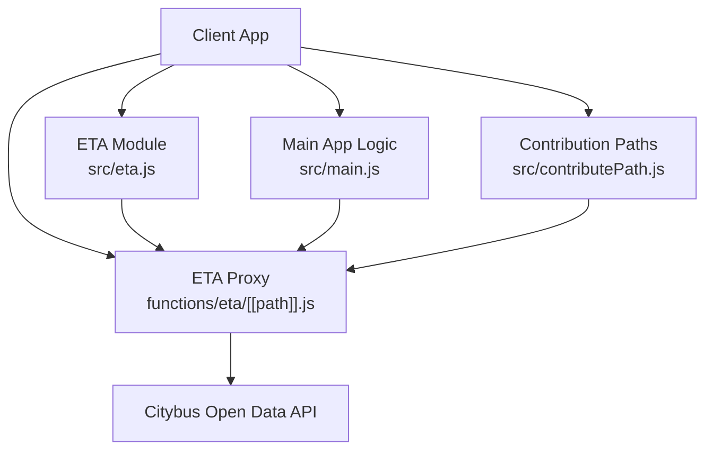
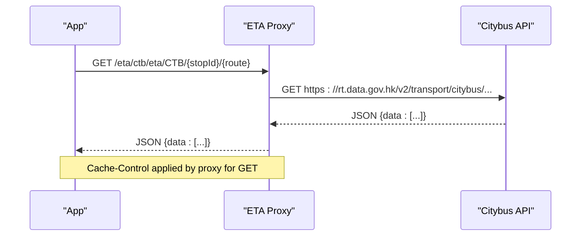
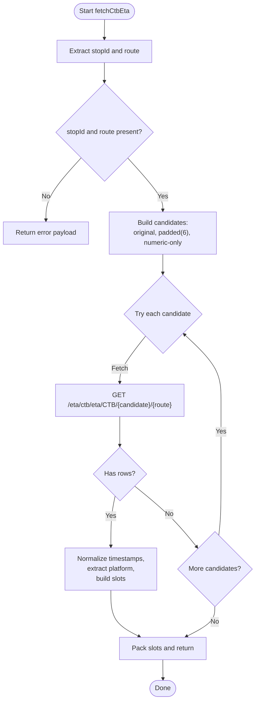
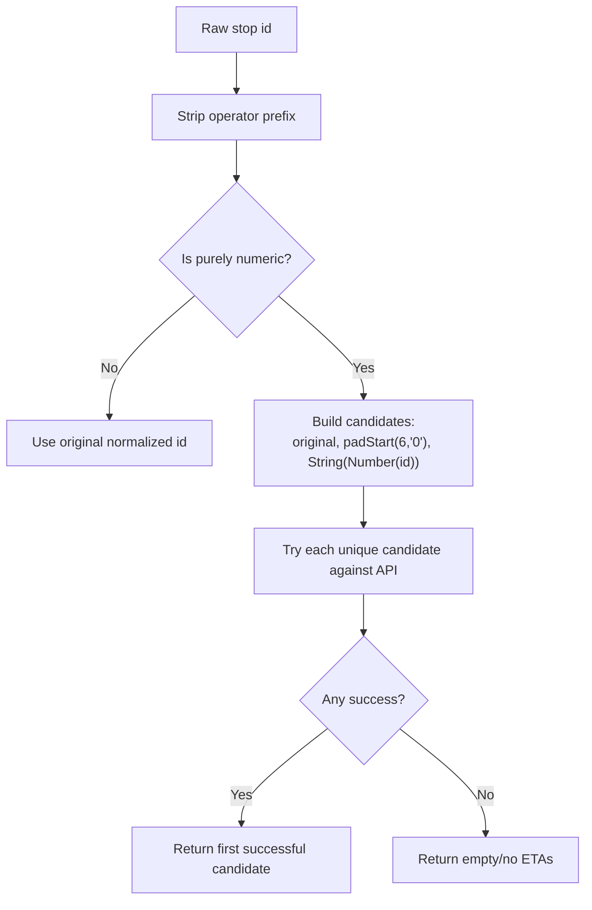
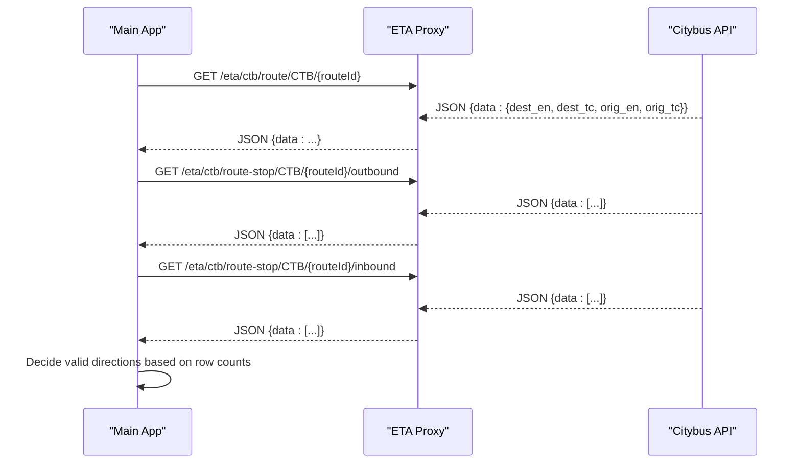
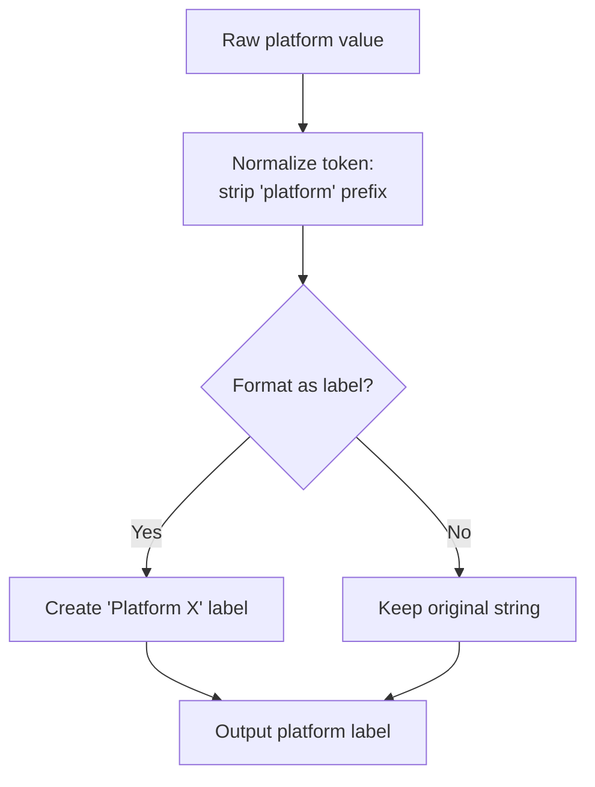
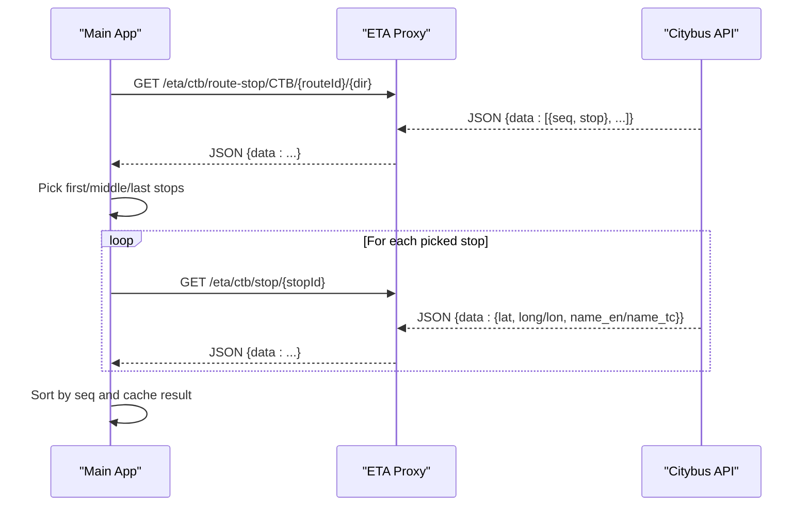
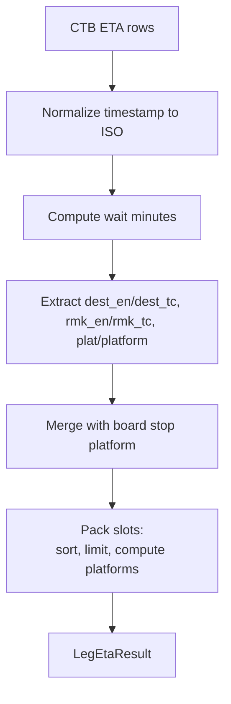
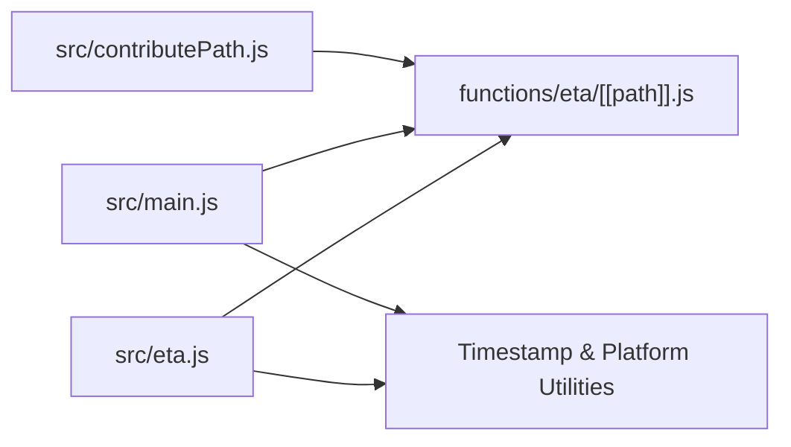

# Citybus Integration

<cite>
**Referenced Files in This Document**
- [eta.js](file://src/eta.js)
- [[path]].js](file://functions/eta/[[path]].js)
- [main.js](file://src/main.js)
- [contributePath.js](file://src/contributePath.js)
</cite>

## Table of Contents
1. [Introduction](#introduction)
2. [Project Structure](#project-structure)
3. [Core Components](#core-components)
4. [Architecture Overview](#architecture-overview)
5. [Detailed Component Analysis](#detailed-component-analysis)
6. [Dependency Analysis](#dependency-analysis)
7. [Performance Considerations](#performance-considerations)
8. [Troubleshooting Guide](#troubleshooting-guide)
9. [Conclusion](#conclusion)

## Introduction
This document explains the Citybus (CTB) operator integration for live ETA and route data. It covers:
- CTB-specific ETA API endpoints used by the system
- Stop ID normalization that supports padded numeric IDs (e.g., 001859) and unpadded variants
- Route matching logic and direction handling
- Platform extraction from stop data and ETA responses
- Error handling strategies for different stop ID formats and API failures
- Implementation details for the CTB ETA fetch function, candidate stop ID generation strategy, and data transformation processes specific to Citybus API responses

## Project Structure
The CTB integration spans a small set of focused modules:
- A Cloudflare Pages Function proxies requests to the official Citybus open data endpoints with CORS and caching headers
- The ETA module implements CTB-specific fetching, stop ID normalization, platform formatting, and slot packing
- The main application uses CTB route metadata and stop sequences to determine directions, bounds, and away-scoring
- A path contribution utility fetches full CTB route-stop lists and enriches them with coordinates

**Diagram sources**
- [eta.js:16-42](file://src/eta.js#L16-L42)
- [[path]].js:15-85](file://functions/eta/[[path]].js#L15-L85)
- [main.js:1777-1842](file://src/main.js#L1777-L1842)
- [contributePath.js:690-726](file://src/contributePath.js#L690-L726)

**Section sources**
- [[path]].js:1-86](file://functions/eta/[[path]].js#L1-L86)
- [eta.js:1-42](file://src/eta.js#L1-L42)

## Core Components
- ETA proxy: Routes /eta/ctb/* to the Citybus endpoint with consistent headers and cache control
- CTB ETA fetcher: Builds candidate stop IDs, calls CTB ETA endpoints, normalizes timestamps, extracts platforms, and packs results
- Route bound discovery: Uses CTB route metadata and per-direction stop list counts to infer valid inbound/outbound directions
- Stop sequence sampling: Fetches representative stops for a route/direction to support away scoring and mapping without over-fetching
- Path enrichment: Retrieves full route-stop lists and parallelizes stop detail fetches to build coordinate-rich sequences

**Section sources**
- [eta.js:760-815](file://src/eta.js#L760-L815)
- [main.js:1777-1842](file://src/main.js#L1777-L1842)
- [main.js:7683-7769](file://src/main.js#L7683-L7769)
- [contributePath.js:690-726](file://src/contributePath.js#L690-L726)

## Architecture Overview
The system uses a same-origin proxy to avoid CORS issues and to standardize requests to Citybus APIs. Client code calls local /eta endpoints; the proxy forwards to the official Citybus endpoints and returns JSON with appropriate headers.

**Diagram sources**
- [[path]].js:31-85](file://functions/eta/[[path]].js#L31-L85)
- [eta.js:784-787](file://src/eta.js#L784-L787)

## Detailed Component Analysis

### CTB ETA Fetch Function
The CTB ETA fetcher performs:
- Stop ID extraction and operator prefix stripping
- Candidate stop ID generation for numeric IDs (original, zero-padded to 6 digits, and numeric-only)
- Sequential attempts against the CTB ETA endpoint until one returns rows
- Timestamp normalization to ISO with offset
- Platform label extraction from response or board stop
- Slot packing with sorting and deduplication

**Diagram sources**
- [eta.js:760-815](file://src/eta.js#L760-L815)

**Section sources**
- [eta.js:760-815](file://src/eta.js#L760-L815)

### Stop ID Normalization Strategy
- Operator prefix stripping: Removes prefixes like CTB-, KMB-, NLB-, etc., leaving the raw stop identifier
- Numeric stop ID handling: For purely numeric IDs, the system tries multiple forms:
  - Original form (e.g., 1859)
  - Zero-padded to 6 digits (e.g., 001859)
  - Numeric-only canonical form via Number conversion
- This strategy ensures robustness when upstream data varies between padded and unpadded representations

**Diagram sources**
- [eta.js:47-55](file://src/eta.js#L47-L55)
- [eta.js:775-797](file://src/eta.js#L775-L797)

**Section sources**
- [eta.js:47-55](file://src/eta.js#L47-L55)
- [eta.js:775-797](file://src/eta.js#L775-L797)

### Route Matching and Direction Handling
- Route short name extraction: Uses route_short_name or route_name, uppercased
- Direction inference: For CTB, direction is mapped to inbound/outbound based on bound values (I/O)
- Bound discovery: The system queries CTB route metadata and checks per-direction stop list counts to decide which directions are valid
- Avoids inventing reverse directions for one-way or circular routes

**Diagram sources**
- [main.js:7704-7769](file://src/main.js#L7704-L7769)
- [main.js:7683-7697](file://src/main.js#L7683-L7697)

**Section sources**
- [main.js:7683-7769](file://src/main.js#L7683-L7769)

### Platform Extraction from Stop Data
- Platform token normalization: Strips leading “platform” text and keeps short identifiers (numbers or letters)
- Label formatting: Converts tokens into user-friendly labels like “Platform 1” or preserves structured labels
- Source fields: Accepts platform or plat fields from ETA responses; falls back to board stop’s platform or parsed name suffixes

**Diagram sources**
- [eta.js:570-646](file://src/eta.js#L570-L646)

**Section sources**
- [eta.js:570-646](file://src/eta.js#L570-L646)

### CTB Stop Sequence Sampling and Enrichment
- Route-stop listing: Fetches ordered stops for a given route and direction
- Sampling strategy: Picks first, middle, and last stops to minimize API calls while capturing enough geometry for away scoring
- Parallel detail fetches: Requests stop details concurrently for sampled stops, extracting latitude/longitude and names
- Caching: Results are cached per route+direction to reduce repeated network calls

**Diagram sources**
- [main.js:1777-1842](file://src/main.js#L1777-L1842)

**Section sources**
- [main.js:1777-1842](file://src/main.js#L1777-L1842)

### Data Transformation Processes Specific to Citybus Responses
- ETA rows: Transform ETA timestamps to ISO with timezone offset; compute wait minutes relative to current time
- Destinations and remarks: Prefer English fields, fallback to Traditional Chinese
- Platforms: Merge ETA-provided platform with board stop platform if missing
- Slots packing: Sort by ETA time, limit to top entries, compute serving platforms and multi-platform flags

**Diagram sources**
- [eta.js:798-815](file://src/eta.js#L798-L815)
- [eta.js:667-689](file://src/eta.js#L667-L689)

**Section sources**
- [eta.js:798-815](file://src/eta.js#L798-L815)
- [eta.js:667-689](file://src/eta.js#L667-L689)

## Dependency Analysis
- ETA module depends on:
  - Local proxy for COEP-safe access to Citybus APIs
  - Shared utilities for timestamp normalization, platform formatting, and slot packing
- Main app depends on:
  - CTB route metadata and per-direction stop lists to infer valid directions
  - Stop sequence sampling for away scoring and mapping
- Contribution paths depend on:
  - Full route-stop lists and parallel stop detail fetches to build coordinate-rich sequences

**Diagram sources**
- [eta.js:16-42](file://src/eta.js#L16-L42)
- [[path]].js:15-85](file://functions/eta/[[path]].js#L15-L85)
- [main.js:1777-1842](file://src/main.js#L1777-L1842)
- [contributePath.js:690-726](file://src/contributePath.js#L690-L726)

**Section sources**
- [eta.js:16-42](file://src/eta.js#L16-L42)
- [[path]].js:15-85](file://functions/eta/[[path]].js#L15-L85)
- [main.js:1777-1842](file://src/main.js#L1777-L1842)
- [contributePath.js:690-726](file://src/contributePath.js#L690-L726)

## Performance Considerations
- Candidate stop ID strategy reduces failed API calls by trying multiple numeric forms sequentially
- Sampling strategy for route-stop sequences limits the number of stop detail fetches per route/direction
- Parallelism: Stop detail fetches are performed concurrently to reduce latency
- Caching: ETA responses and route-bound information are cached to avoid redundant network requests
- Proxy caching: The proxy applies cache headers for GET requests to reduce load on upstream APIs

[No sources needed since this section provides general guidance]

## Troubleshooting Guide
Common issues and resolutions:
- Missing stop or route: Ensure both stopId and route are present before calling CTB ETA; otherwise an error payload is returned
- Stop ID format mismatches: If numeric stop IDs fail, try padded and unpadded variants automatically; verify upstream data consistency
- Empty ETA results: Check whether the chosen candidate stop ID matches the expected format; inspect API responses for data presence
- Direction errors: Verify inbound/outbound availability by checking per-direction stop list counts; do not assume reverse directions exist
- Platform display issues: Confirm platform fields in ETA responses; fall back to board stop platform if missing

**Section sources**
- [eta.js:760-774](file://src/eta.js#L760-L774)
- [eta.js:775-797](file://src/eta.js#L775-L797)
- [main.js:7704-7769](file://src/main.js#L7704-L7769)

## Conclusion
The Citybus integration leverages a robust stop ID normalization strategy, efficient route-bound discovery, and careful platform extraction to deliver accurate live ETAs. By combining candidate stop ID generation, sampling-based stop sequence retrieval, and parallelized detail fetches, the system balances performance and reliability. The proxy layer ensures consistent, CORS-safe access to Citybus APIs, while caching minimizes overhead. This design supports scalable ETA delivery across varying stop ID formats and API behaviors.

[No sources needed since this section summarizes without analyzing specific files]