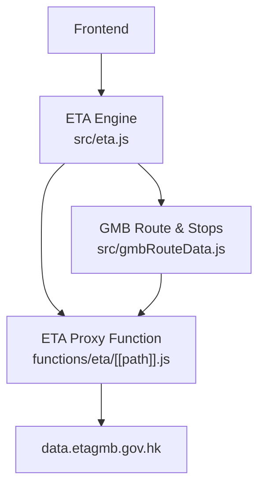
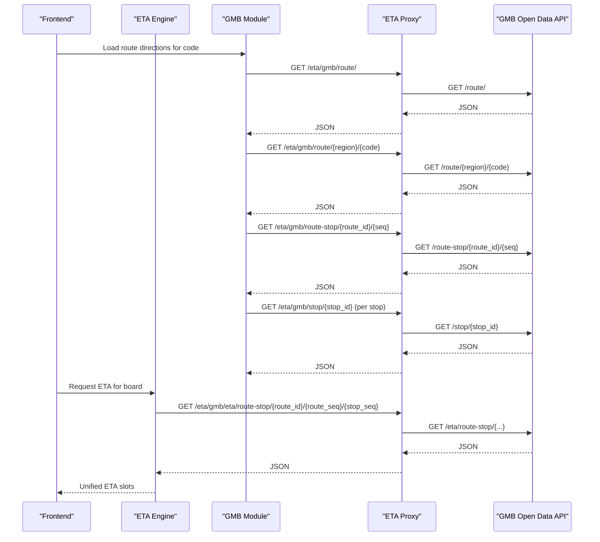
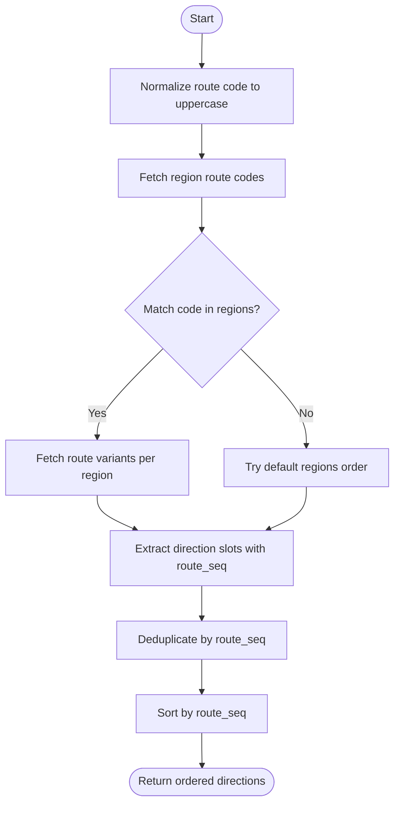
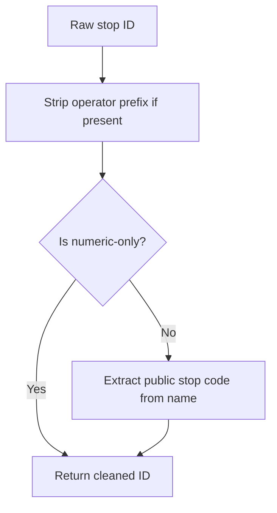
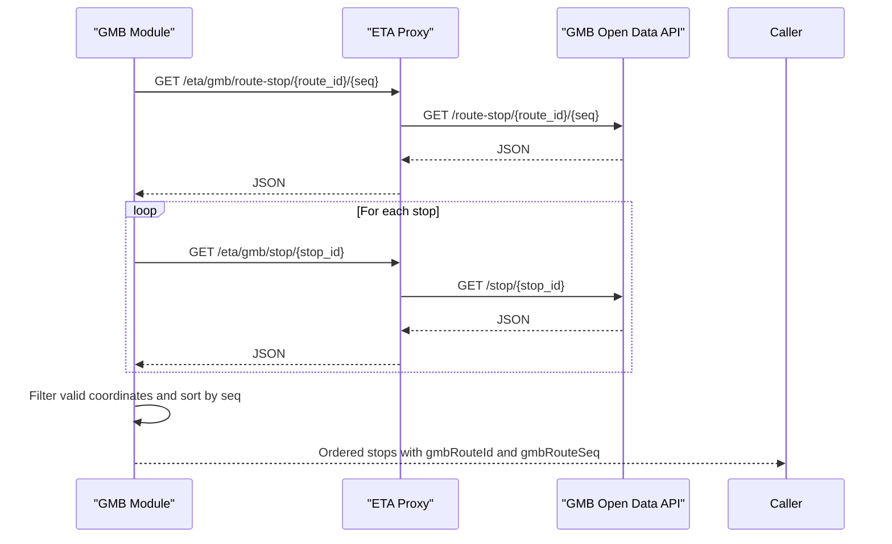
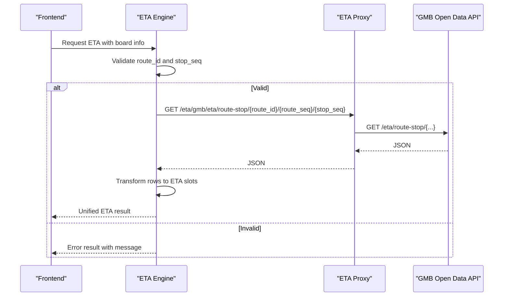
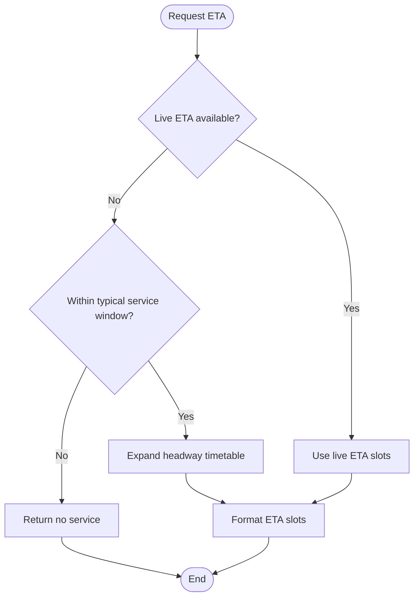
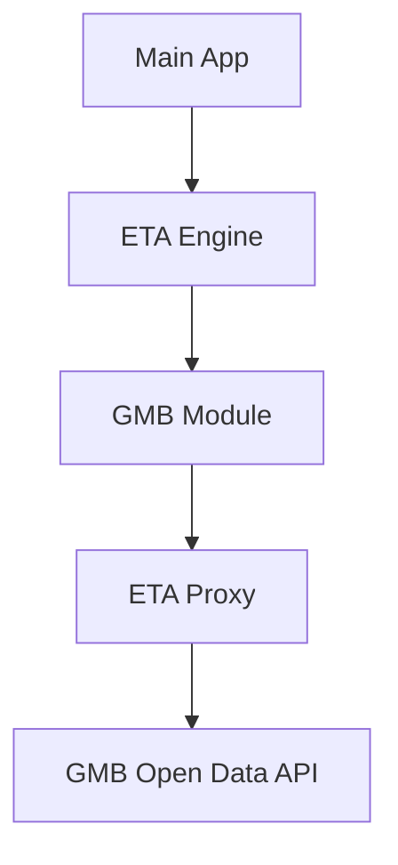

# GMB Integration

<cite>
**Referenced Files in This Document**
- [gmbRouteData.js](file://src/gmbRouteData.js)
- [eta.js](file://src/eta.js)
- [[path]].js (ETA proxy function)
- [main.js](file://src/main.js)
- [stopMerge.js](file://src/stopMerge.js)
</cite>

## Table of Contents
1. [Introduction](#introduction)
2. [Project Structure](#project-structure)
3. [Core Components](#core-components)
4. [Architecture Overview](#architecture-overview)
5. [Detailed Component Analysis](#detailed-component-analysis)
6. [Dependency Analysis](#dependency-analysis)
7. [Performance Considerations](#performance-considerations)
8. [Troubleshooting Guide](#troubleshooting-guide)
9. [Conclusion](#conclusion)

## Introduction
This document explains the Green Mini Bus (GMB) operator integration within the system, focusing on:
- GMB-specific ETA API endpoints and how they are proxied
- Stop ID normalization for mini bus stops
- Route identification patterns for GMB routes across regions and directions
- Service characteristics specific to green mini buses, including flexible routing and on-demand service patterns
- Frequency calculations tailored to GMB operations
- Implementation details for fetching GMB ETAs, handling irregular service patterns, and transforming API responses into a unified ETA model

## Project Structure
The GMB integration spans client-side modules and a serverless proxy:
- Client-side route and stop discovery for GMB is implemented in a dedicated module that queries region-based route codes, resolves direction slots, and loads ordered stop sequences with coordinates.
- Live ETA fetching for GMB is integrated into the central ETA engine, which normalizes inputs, calls the correct endpoint, and transforms results into a common ETA slot format.
- A Cloudflare Pages function proxies requests to the official GMB open data API under a same-origin path to avoid CORS issues and enable caching headers.

**Diagram sources**
- [eta.js:1340-1428](file://src/eta.js#L1340-L1428)
- [gmbRouteData.js:1-27](file://src/gmbRouteData.js#L1-L27)
- [[path]].js:1-22](file://functions/eta/[[path]].js#L1-L22)

**Section sources**
- [gmbRouteData.js:1-27](file://src/gmbRouteData.js#L1-L27)
- [eta.js:1340-1428](file://src/eta.js#L1340-L1428)
- [[path]].js:1-22](file://functions/eta/[[path]].js#L1-L22)

## Core Components
- GMB route and stop discovery module:
  - Loads all region route codes once and caches them
  - Resolves public route codes to internal route IDs and direction slots per region
  - Loads ordered stop sequences and enriches each stop with WGS84 coordinates
  - Caches stop sequences by route ID and sequence to reduce network calls
- ETA engine integration:
  - Detects GMB operator context from options or route metadata
  - Normalizes stop IDs by stripping operator prefixes
  - Calls the GMB live ETA endpoint using route ID, route sequence, and stop sequence
  - Transforms heterogeneous API responses into a unified ETA slot list
- ETA proxy function:
  - Proxies /eta/gmb/* to the official GMB open data API
  - Adds CORS headers and appropriate cache control for GET requests

Key responsibilities and behaviors are detailed in the following sections.

**Section sources**
- [gmbRouteData.js:41-166](file://src/gmbRouteData.js#L41-L166)
- [gmbRouteData.js:192-264](file://src/gmbRouteData.js#L192-L264)
- [eta.js:47-112](file://src/eta.js#L47-L112)
- [eta.js:1340-1428](file://src/eta.js#L1340-L1428)
- [[path]].js:15-84](file://functions/eta/[[path]].js#L15-L84)

## Architecture Overview
The GMB integration follows a layered architecture:
- Discovery layer: resolves public route codes to internal identifiers and direction sequences
- Data enrichment layer: fetches ordered stops and coordinates
- Live ETA layer: retrieves real-time arrivals for a specific stop and sequence
- Proxy layer: forwards requests to the official API with consistent headers and caching

**Diagram sources**
- [gmbRouteData.js:41-166](file://src/gmbRouteData.js#L41-L166)
- [gmbRouteData.js:192-264](file://src/gmbRouteData.js#L192-L264)
- [eta.js:1340-1428](file://src/eta.js#L1340-L1428)
- [[path]].js:15-84](file://functions/eta/[[path]].js#L15-L84)

## Detailed Component Analysis

### GMB Route Identification Patterns
- Public route codes are normalized to uppercase and searched across three regions: HKI, KLN, NT.
- For each matching region, the module fetches route variants and extracts direction slots with destination and origin labels.
- Direction mapping uses route sequence numbers:
  - Outbound typically corresponds to route_seq 1
  - Inbound typically corresponds to route_seq 2
- The module deduplicates direction slots by route sequence and sorts them numerically to ensure deterministic ordering.

**Diagram sources**
- [gmbRouteData.js:41-83](file://src/gmbRouteData.js#L41-L83)
- [gmbRouteData.js:90-166](file://src/gmbRouteData.js#L90-L166)

**Section sources**
- [gmbRouteData.js:41-83](file://src/gmbRouteData.js#L41-L83)
- [gmbRouteData.js:90-166](file://src/gmbRouteData.js#L90-L166)

### Stop ID Normalization for Mini Bus Stops
- Stop IDs may include operator prefixes such as GMB-, KMB-, CTB-, NLB-, LWB-, NWFB-, MTRBUS-, LRTFEEDER-, LRT-, MTR-.
- The normalization function strips these prefixes to produce a clean identifier suitable for downstream lookups.
- When stop names contain embedded codes like "(TC450)", extraction helpers can derive public stop codes.

**Diagram sources**
- [eta.js:47-55](file://src/eta.js#L47-L55)
- [stopMerge.js:47-70](file://src/stopMerge.js#L47-L70)

**Section sources**
- [eta.js:47-55](file://src/eta.js#L47-L55)
- [stopMerge.js:47-70](file://src/stopMerge.js#L47-L70)

### GMB Stop Sequence Loading and Coordinate Enrichment
- After resolving the route ID and sequence, the module fetches the ordered stop list.
- Each stop entry includes sequence number, names in English and Traditional Chinese, and an internal stop ID.
- Coordinates are fetched in parallel for each stop via the stop detail endpoint; invalid or missing coordinates are filtered out.
- Results are cached by composite key of route ID and sequence to avoid repeated network calls.

**Diagram sources**
- [gmbRouteData.js:192-264](file://src/gmbRouteData.js#L192-L264)
- [[path]].js:15-84](file://functions/eta/[[path]].js#L15-L84)

**Section sources**
- [gmbRouteData.js:192-264](file://src/gmbRouteData.js#L192-L264)

### GMB Live ETA Fetching and Transformation
- The ETA engine constructs the request URL using route ID, route sequence, and stop sequence extracted from the board or option context.
- It handles missing parameters gracefully by returning a structured result indicating the error condition.
- Responses are transformed into a unified ETA slot list:
  - Wait minutes are derived either directly from the API or computed from timestamps
  - Clock times are formatted for display in Hong Kong time
  - Scheduled flags are inferred from remarks containing scheduled indicators
- Errors during network or parsing are captured and returned as structured errors without crashing the flow.

**Diagram sources**
- [eta.js:1340-1428](file://src/eta.js#L1340-L1428)
- [[path]].js:15-84](file://functions/eta/[[path]].js#L15-L84)

**Section sources**
- [eta.js:1340-1428](file://src/eta.js#L1340-L1428)

### GMB Service Characteristics: Flexible Routing and On-Demand Patterns
- GMB services often exhibit flexible routing and on-demand operation patterns, meaning fixed schedules may not always apply.
- The system accounts for this by:
  - Using headway-based timetable expansion when live ETAs are unavailable or outside typical service windows
  - Applying a default headway value tuned for GMB operations
  - Avoiding invented mid-night departures unless explicitly forced
- These behaviors ensure realistic waiting time estimates even when the operator’s service deviates from strict timetables.

**Diagram sources**
- [eta.js:516-568](file://src/eta.js#L516-L568)
- [eta.js:232-239](file://src/eta.js#L232-L239)

**Section sources**
- [eta.js:516-568](file://src/eta.js#L516-L568)
- [eta.js:232-239](file://src/eta.js#L232-L239)

### Frequency Calculations Specific to GMB Operations
- Default headway for GMB is set to a value reflecting typical minibus frequencies.
- When live data is absent, the system aligns the first departure to the next headway boundary after the current time, producing a grid of future departures.
- This approach provides reasonable estimates for waiting times while respecting operational constraints.

**Section sources**
- [eta.js:232-239](file://src/eta.js#L232-L239)
- [eta.js:516-568](file://src/eta.js#L516-L568)

## Dependency Analysis
The GMB integration has clear dependencies between modules and external APIs:
- The ETA engine depends on the GMB module for route and stop discovery and on the proxy for network access
- The GMB module depends on the proxy to reach the official API
- The main application integrates GMB entries into broader journey planning and ETA aggregation

**Diagram sources**
- [main.js:10415-10416](file://src/main.js#L10415-L10416)
- [eta.js:1340-1428](file://src/eta.js#L1340-L1428)
- [gmbRouteData.js:41-166](file://src/gmbRouteData.js#L41-L166)
- [[path]].js:15-84](file://functions/eta/[[path]].js#L15-L84)

**Section sources**
- [main.js:10415-10416](file://src/main.js#L10415-L10416)
- [eta.js:1340-1428](file://src/eta.js#L1340-L1428)
- [gmbRouteData.js:41-166](file://src/gmbRouteData.js#L41-L166)
- [[path]].js:15-84](file://functions/eta/[[path]].js#L15-L84)

## Performance Considerations
- Route code loading is performed once and cached to minimize repeated network calls
- Stop sequences are cached by route ID and sequence to avoid redundant coordinate fetches
- Parallel stop coordinate lookups improve responsiveness when loading full stop lists
- Proxy caching headers reduce bandwidth usage for GET requests

[No sources needed since this section provides general guidance]

## Troubleshooting Guide
Common issues and their handling:
- Missing GMB route ID or stop sequence:
  - The ETA engine returns a structured error indicating missing parameters
- Network errors or non-OK HTTP status:
  - Errors are caught and returned as structured messages without breaking the flow
- No stops found for a route and sequence:
  - The module logs warnings and returns empty stop lists
- Irregular service patterns:
  - The system avoids inventing mid-night departures and falls back to headway-based estimates only within typical service windows

**Section sources**
- [eta.js:1340-1428](file://src/eta.js#L1340-L1428)
- [gmbRouteData.js:211-264](file://src/gmbRouteData.js#L211-L264)

## Conclusion
The GMB integration provides robust support for Green Mini Bus operations by:
- Discovering routes and directions across regions using public route codes
- Normalizing stop IDs to ensure consistent lookups
- Fetching live ETAs and transforming heterogeneous responses into a unified model
- Handling flexible and on-demand service patterns through headway-based estimations
- Implementing resilient error handling and performance optimizations

This design enables accurate and reliable ETA information for GMB users while accommodating the unique characteristics of mini bus operations.