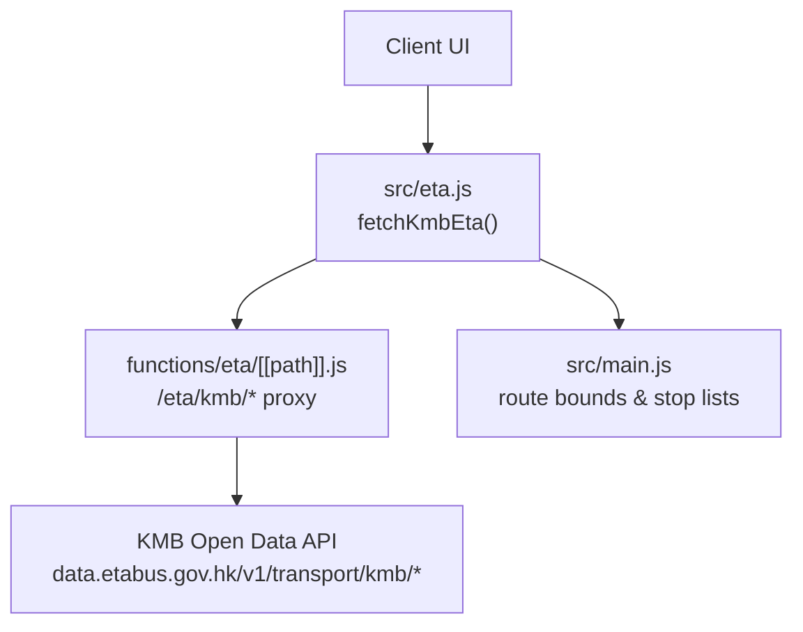
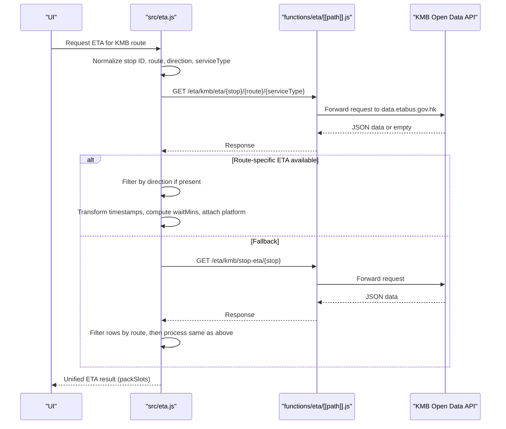
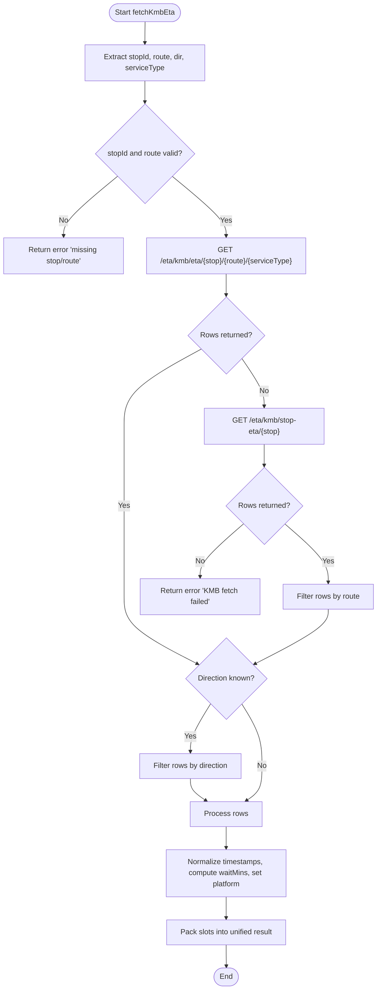
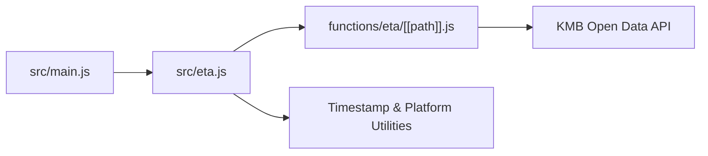

# KMB Integration

<cite>
**Referenced Files in This Document**
- [eta.js](file://src/eta.js)
- [[path]].js](file://functions/eta/[[path]].js)
- [main.js](file://src/main.js)
</cite>

## Table of Contents
1. [Introduction](#introduction)
2. [Project Structure](#project-structure)
3. [Core Components](#core-components)
4. [Architecture Overview](#architecture-overview)
5. [Detailed Component Analysis](#detailed-component-analysis)
6. [Dependency Analysis](#dependency-analysis)
7. [Performance Considerations](#performance-considerations)
8. [Troubleshooting Guide](#troubleshooting-guide)
9. [Conclusion](#conclusion)

## Introduction
This document explains the KMB (Kowloon Motor Bus) operator integration for ETA retrieval and display. It covers:
- KMB-specific ETA API endpoints used by the system
- Stop ID normalization that handles KMB-HEX style identifiers
- Route direction parsing from trip IDs such as "KMB-E31-I-1-287"
- Service type detection logic
- Platform handling for multi-platform stops
- Fallback mechanisms when route-specific ETA is unavailable
- Implementation details of the KMB ETA fetch function, error handling strategies, and data transformation to a unified ETA structure

## Project Structure
The KMB integration spans client-side logic and a Cloudflare Pages proxy:
- Client-side ETA orchestration and transformations live in src/eta.js
- The Cloudflare Pages Function at functions/eta/[[path]].js proxies requests to KMB’s open-data endpoint
- Supporting route and stop metadata are loaded in src/main.js

**Diagram sources**
- [eta.js:691-758](file://src/eta.js#L691-L758)
- [[path]].js:15-85](file://functions/eta/[[path]].js#L15-L85)
- [main.js:7085-7134](file://src/main.js#L7085-L7134)

**Section sources**
- [eta.js:1-42](file://src/eta.js#L1-L42)
- [[path]].js:1-86](file://functions/eta/[[path]].js#L1-L86)
- [main.js:7085-7134](file://src/main.js#L7085-L7134)

## Core Components
- Operator detection and routing: etaOperator() determines the operator based on route metadata and kind fields; KMB/LWB routes are routed to the KMB handler.
- Stop ID normalization: stripOperatorStopId() removes operator prefixes (e.g., KMB-HEX) to obtain the canonical stop identifier used by KMB APIs.
- Direction and service type extraction: kmbTripMeta() parses trip_id patterns like "KMB-E31-I-1-287" to extract direction ("I"/"O") and service type number.
- KMB ETA fetcher: fetchKmbEta() orchestrates fetching route-specific ETA with fallback to stop-level ETA, filters by direction, transforms timestamps, and packs results into a unified structure.
- Proxy layer: functions/eta/[[path]].js forwards /eta/kmb/* requests to KMB’s official open-data endpoints with CORS and caching headers.
- Route metadata helpers: ensureKmbRouteBounds() and related utilities load KMB route directions and destinations for UI and selection flows.

**Section sources**
- [eta.js:61-112](file://src/eta.js#L61-L112)
- [eta.js:47-55](file://src/eta.js#L47-L55)
- [eta.js:136-147](file://src/eta.js#L136-L147)
- [eta.js:691-758](file://src/eta.js#L691-L758)
- [[path]].js:15-85](file://functions/eta/[[path]].js#L15-L85)
- [main.js:7085-7134](file://src/main.js#L7085-L7134)

## Architecture Overview
The KMB ETA flow uses a two-tier approach:
- Client-side logic prepares normalized inputs (stop ID, route, direction, service type) and calls the local /eta proxy.
- The proxy forwards to KMB’s open-data API and returns JSON responses back to the client.
- The client normalizes timestamps, computes wait minutes, applies platform labels, and packs results into a consistent ETA payload.

**Diagram sources**
- [eta.js:691-758](file://src/eta.js#L691-L758)
- [[path]].js:31-85](file://functions/eta/[[path]].js#L31-L85)

## Detailed Component Analysis

### KMB ETA Fetch Function (fetchKmbEta)
Responsibilities:
- Extracts raw stop ID from board object and strips operator prefix to get the canonical stop ID used by KMB APIs.
- Derives route short name and parses trip_id to determine direction and service type.
- Attempts route-specific ETA first; if empty, falls back to stop-level ETA filtered by route.
- Filters results by direction when known.
- Normalizes timestamps to ISO with offset, computes wait minutes, attaches platform labels, and packs into a unified result.

Key behaviors:
- Error handling: If route-specific ETA fails, it silently continues to fallback; if fallback also fails, returns an error message in the result.
- Platform handling: Uses platformFromStop(board) and per-row platform fields to produce consistent platform labels.
- Data transformation: Converts various timestamp formats via normalizeEtaIso(), then calculates wait minutes using waitMinutesFromIso().

**Diagram sources**
- [eta.js:691-758](file://src/eta.js#L691-L758)

**Section sources**
- [eta.js:691-758](file://src/eta.js#L691-L758)

### Stop ID Normalization (stripOperatorStopId)
Purpose:
- Removes operator prefixes (e.g., KMB-HEX, CTB-001859, NLB-6) to yield the canonical stop ID required by KMB APIs.
- Ensures stable identifiers across operators and prevents mismatches due to operator-specific formatting.

Behavior:
- Matches common operator prefixes and extracts the remainder.
- Returns the original string if no operator prefix is detected.

**Section sources**
- [eta.js:47-55](file://src/eta.js#L47-L55)

### Route Direction Parsing and Service Type Detection (kmbTripMeta)
Purpose:
- Parses trip_id patterns like "KMB-E31-I-1-287" to extract:
  - Direction: "I" (inbound) or "O" (outbound)
  - Service type: numeric value following the direction segment
- Falls back to inspecting route_id or trip text for bound hints when trip_id does not contain explicit direction/service type.

Logic highlights:
- Regex-based extraction of direction and service type from trip_id segments.
- Heuristics for detecting inbound/outbound from route_id suffixes or trip text keywords.
- Default service type is 1 when not specified.

**Section sources**
- [eta.js:136-147](file://src/eta.js#L136-L147)

### Platform Handling for Multi-Platform Stops
Capabilities:
- Extracts platform tokens from stop objects or API rows.
- Normalizes platform labels to consistent formats (e.g., "Platform 1", "Platform A").
- Collects unique platforms across ETA slots to support multi-platform displays.
- Provides utilities to build station names with platform suffixes for UI clarity.

Implementation notes:
- platformToken() cleans and standardizes platform strings.
- collectServingPlatforms() aggregates and sorts platform tokens numerically or alphabetically.
- formatPlatformLabel() ensures consistent labeling for display.
- packSlots() sets multiPlatform flag when multiple distinct platforms are observed.

**Section sources**
- [eta.js:575-646](file://src/eta.js#L575-L646)
- [eta.js:667-689](file://src/eta.js#L667-L689)

### Fallback Mechanisms When Route-Specific ETA Is Unavailable
Strategy:
- First attempt: route-specific ETA endpoint with stop, route, and service type.
- Fallback: stop-level ETA endpoint, then filter results by route.
- If both attempts fail, return a structured error in the result.

Benefits:
- Improves robustness against missing route-specific data.
- Maintains ETA availability by leveraging broader stop-level information.

**Section sources**
- [eta.js:708-735](file://src/eta.js#L708-L735)

### Data Transformation to Unified ETA Structure
Transformation steps:
- Normalize timestamps to ISO with timezone offset using normalizeEtaIso().
- Compute wait minutes relative to current time via waitMinutesFromIso().
- Attach destination and remark fields from API rows.
- Assign platform labels from row fields or stop object.
- Pack results into a standardized payload with etas array, waitMins, etaIso, servingPlatforms, and multiPlatform flags.

Output characteristics:
- Consistent structure across operators for downstream consumption.
- Supports up to three ETA slots by default, sorted by earliest arrival.

**Section sources**
- [eta.js:166-178](file://src/eta.js#L166-L178)
- [eta.js:154-160](file://src/eta.js#L154-L160)
- [eta.js:667-689](file://src/eta.js#L667-L689)

### KMB Route Metadata and Directions
Supporting functionality:
- ensureKmbRouteBounds() loads KMB route list once and caches it, providing destinations per bound and service types for UI selection and direction dots.
- fetchKmbRouteStopList() retrieves stop sequences for a given route, direction, and service type, merging with stop metadata for coordinates and names.

Use cases:
- Displaying route directions and destinations in the UI.
- Building stop sequences for visualization and navigation.

**Section sources**
- [main.js:7085-7134](file://src/main.js#L7085-L7134)
- [main.js:1592-1639](file://src/main.js#L1592-L1639)

## Dependency Analysis
Key dependencies and relationships:
- src/eta.js depends on:
  - Local cache and helper functions for JSON fetching and timestamp normalization
  - Platform utilities for multi-platform support
  - Operator detection and route metadata helpers
- functions/eta/[[path]].js depends on:
  - Target mapping for operator endpoints
  - Request forwarding with CORS and caching headers
- src/main.js depends on:
  - KMB route bounds and stop lists for UI and route planning

Potential coupling:
- Tight coupling between fetchKmbEta() and the /eta/kmb/* proxy contract
- Shared assumptions about stop ID formats and route naming conventions

External integrations:
- KMB open-data API endpoints proxied through Cloudflare Pages Function

**Diagram sources**
- [eta.js:691-758](file://src/eta.js#L691-L758)
- [[path]].js:15-85](file://functions/eta/[[path]].js#L15-L85)
- [main.js:7085-7134](file://src/main.js#L7085-L7134)

**Section sources**
- [eta.js:1-42](file://src/eta.js#L1-L42)
- [[path]].js:15-85](file://functions/eta/[[path]].js#L15-L85)
- [main.js:7085-7134](file://src/main.js#L7085-L7134)

## Performance Considerations
- Caching: fetchJson() caches responses for a short TTL to reduce network overhead.
- Minimal retries: Fallback logic avoids repeated expensive calls by switching to stop-level ETA only when route-specific data is empty.
- Efficient filtering: Direction and route filtering occur after fetching to minimize processing on large datasets.
- Platform aggregation: collectServingPlatforms() uses a Set to deduplicate platforms efficiently.

[No sources needed since this section provides general guidance]

## Troubleshooting Guide
Common issues and resolutions:
- Missing stop or route: Ensure board contains a valid stop_id/id and opt contains a route_short_name/route_name.
- Empty ETA results: Verify stop ID normalization (stripOperatorStopId) yields a valid KMB stop code; check route and service type parsing.
- Network errors: Confirm proxy configuration and KMB API availability; review error messages in the result object.
- Direction mismatch: Confirm trip_id contains correct direction markers; adjust heuristics if route_id encodes bound differently.

Diagnostic tips:
- Inspect the unified ETA result for error fields and fetchedAt timestamps.
- Log intermediate values (stopId, route, dir, serviceType) during development.
- Use browser dev tools to inspect proxy requests and responses.

**Section sources**
- [eta.js:691-758](file://src/eta.js#L691-L758)
- [eta.js:47-55](file://src/eta.js#L47-L55)
- [eta.js:136-147](file://src/eta.js#L136-L147)

## Conclusion
The KMB integration provides a robust, flexible ETA pipeline that:
- Normalizes stop IDs and parses trip metadata to accurately target KMB APIs
- Implements resilient fallback mechanisms to maximize ETA availability
- Handles multi-platform stops with clear platform labeling
- Transforms diverse API responses into a unified structure for consistent UI consumption

This design balances accuracy, performance, and reliability while maintaining extensibility for other operators and future enhancements.

[No sources needed since this section summarizes without analyzing specific files]