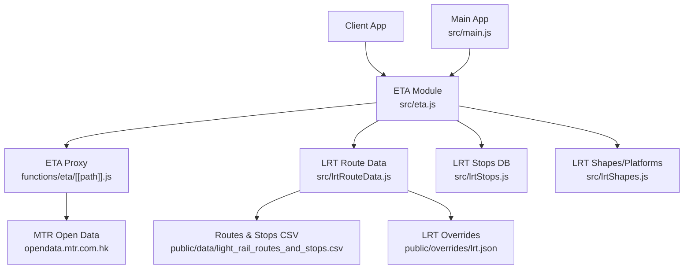
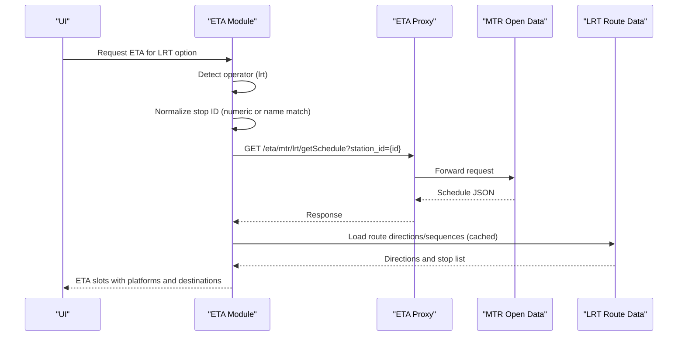
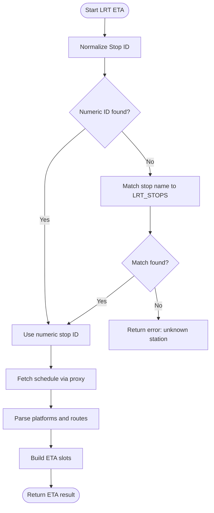
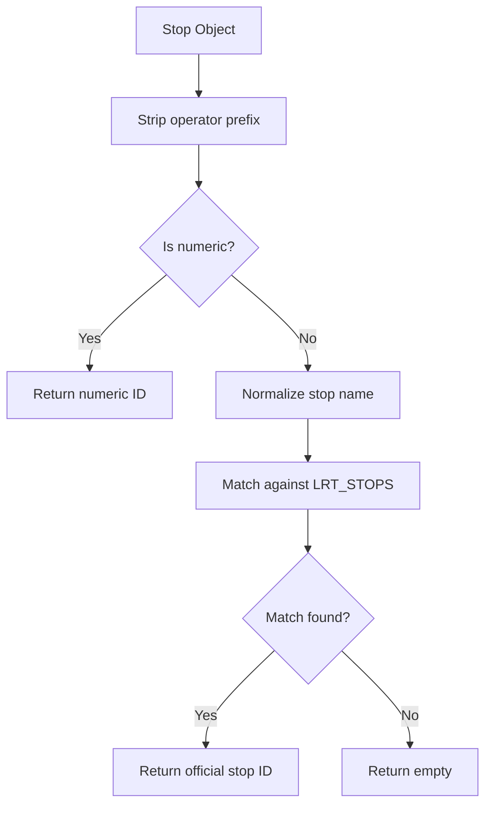
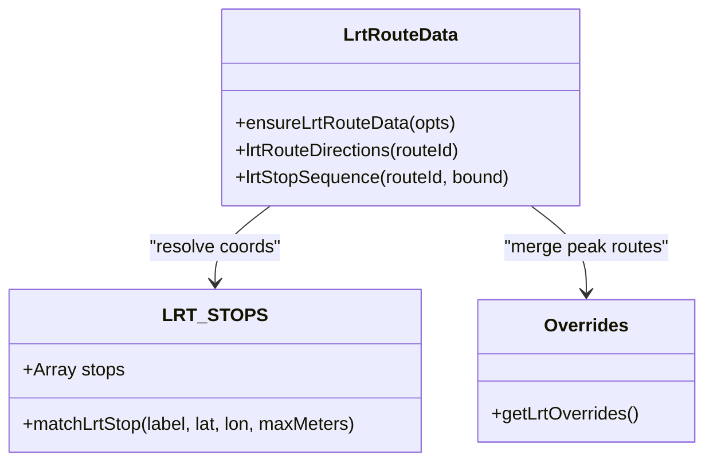
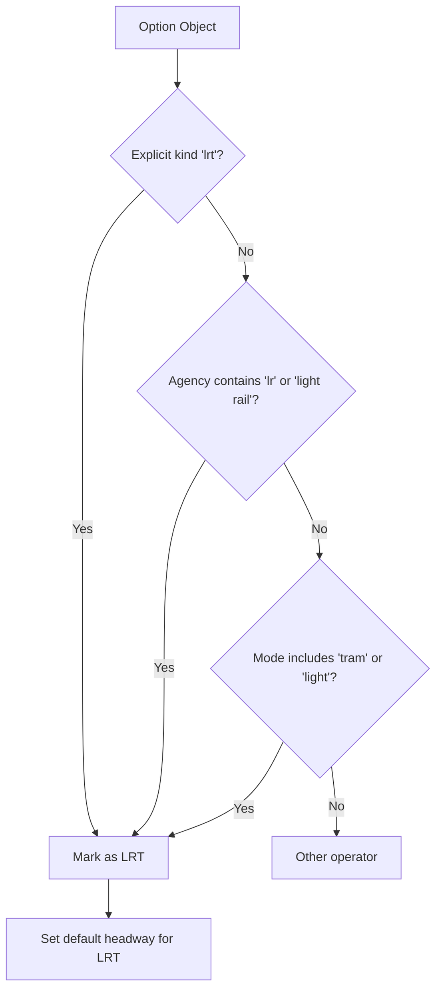
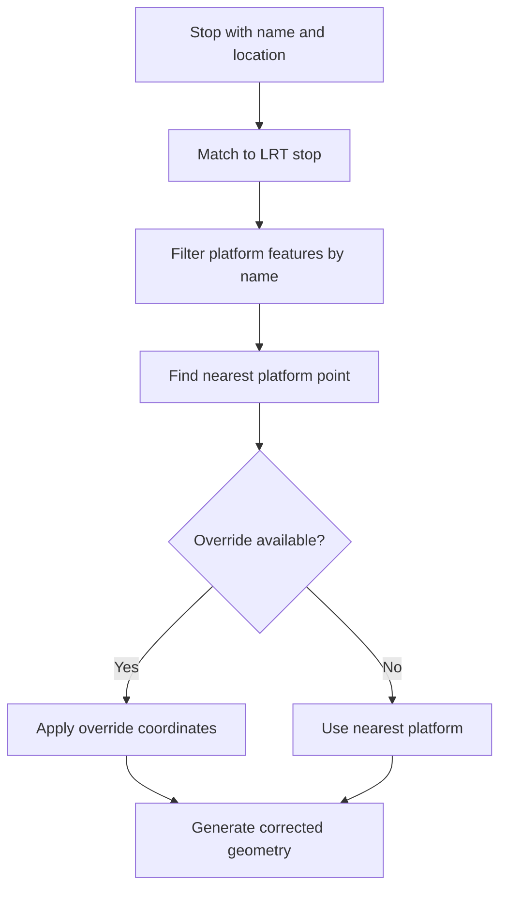
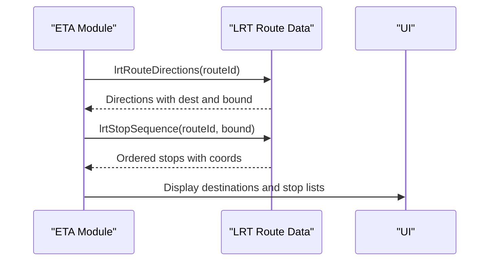
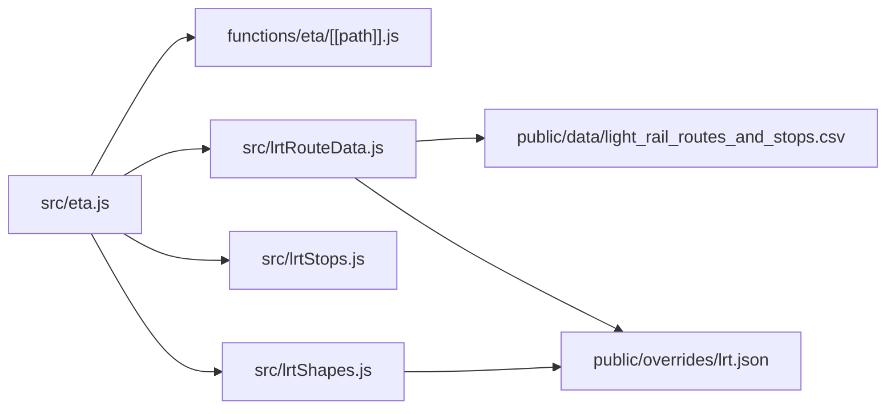

# Light Rail Integration

<cite>
**Referenced Files in This Document**
- [src/eta.js](file://src/eta.js)
- [functions/eta/[[path]].js](file://functions/eta/[[path]].js)
- [src/lrtRouteData.js](file://src/lrtRouteData.js)
- [src/lrtStops.js](file://src/lrtStops.js)
- [src/lrtShapes.js](file://src/lrtShapes.js)
- [public/data/light_rail_routes_and_stops.csv](file://public/data/light_rail_routes_and_stops.csv)
- [public/overrides/lrt.json](file://public/overrides/lrt.json)
- [src/main.js](file://src/main.js)
</cite>

## Table of Contents
1. [Introduction](#introduction)
2. [Project Structure](#project-structure)
3. [Core Components](#core-components)
4. [Architecture Overview](#architecture-overview)
5. [Detailed Component Analysis](#detailed-component-analysis)
6. [Dependency Analysis](#dependency-analysis)
7. [Performance Considerations](#performance-considerations)
8. [Troubleshooting Guide](#troubleshooting-guide)
9. [Conclusion](#conclusion)

## Introduction
This document explains the Light Rail (LRT) operator integration for the system, focusing on:
- LRT-specific ETA API endpoints and how they are called via a same-origin proxy
- Stop ID normalization for light rail stops
- Integration with the LRT route data system (CSV-based stop sequences and overrides)
- Light rail mode detection and service type identification
- Platform handling for tram-style stops using platform geometry and overrides
- Special handling for LRT routing patterns and frequency calculations

The implementation ensures robust ETA fetching, accurate stop matching, and correct mapping of LRT routes and platforms even when open data sources change or are unavailable.

## Project Structure
The LRT integration spans several modules:
- ETA orchestration and operator routing live in the ETA module
- A Cloudflare Pages Function proxies requests to MTR’s open data endpoints
- Route and stop definitions are loaded from a CSV and enhanced by local overrides
- Shape and platform corrections are applied via static JSON overrides
- The main application wires LRT options into ETA flows and UI

**Diagram sources**
- [src/eta.js:1-20](file://src/eta.js#L1-L20)
- [functions/eta/[[path]].js:15-22](file://functions/eta/[[path]].js#L15-L22)
- [src/lrtRouteData.js:10-28](file://src/lrtRouteData.js#L10-L28)
- [src/lrtStops.js:1-12](file://src/lrtStops.js#L1-L12)
- [src/lrtShapes.js:1-6](file://src/lrtShapes.js#L1-L6)
- [public/data/light_rail_routes_and_stops.csv:1-5](file://public/data/light_rail_routes_and_stops.csv#L1-L5)
- [public/overrides/lrt.json:1-13](file://public/overrides/lrt.json#L1-L13)

**Section sources**
- [src/eta.js:1-20](file://src/eta.js#L1-L20)
- [functions/eta/[[path]].js:15-22](file://functions/eta/[[path]].js#L15-L22)
- [src/lrtRouteData.js:10-28](file://src/lrtRouteData.js#L10-L28)
- [src/lrtStops.js:1-12](file://src/lrtStops.js#L1-L12)
- [src/lrtShapes.js:1-6](file://src/lrtShapes.js#L1-L6)
- [public/data/light_rail_routes_and_stops.csv:1-5](file://public/data/light_rail_routes_and_stops.csv#L1-L5)
- [public/overrides/lrt.json:1-13](file://public/overrides/lrt.json#L1-L13)

## Core Components
- ETA Operator Routing: Detects LRT vs other operators and selects the appropriate fetcher.
- LRT ETA Fetcher: Normalizes stop IDs and calls the LRT schedule endpoint via the proxy.
- LRT Route Data Loader: Loads and caches route-stop sequences from CSV, merges overrides, and resolves coordinates.
- LRT Stops Database: Provides normalized stop names, codes, and IDs; supports search and matching.
- LRT Shapes and Platforms: Applies geometry and platform overrides for accurate routing and pinning.
- Main Integration: Wires LRT options into ETA flows and UI, including per-route ETA fetching at stations.

Key responsibilities:
- Mode detection: Identify “lrt” mode and set default headways for timetable expansion.
- Stop normalization: Convert ambiguous stop labels to official numeric stop IDs used by LRT APIs.
- Route sequences: Provide ordered stop lists and direction metadata for display and planning.
- Platform resolution: Map stops to precise platform points for map rendering and itinerary geometry.

**Section sources**
- [src/eta.js:57-112](file://src/eta.js#L57-L112)
- [src/eta.js:1242-1338](file://src/eta.js#L1242-L1338)
- [src/lrtRouteData.js:176-287](file://src/lrtRouteData.js#L176-L287)
- [src/lrtStops.js:104-199](file://src/lrtStops.js#L104-L199)
- [src/lrtShapes.js:115-184](file://src/lrtShapes.js#L115-L184)
- [src/main.js:3902-3944](file://src/main.js#L3902-L3944)

## Architecture Overview
The LRT ETA flow uses a same-origin proxy to avoid CORS and COEP issues while calling MTR’s open data endpoints. The ETA module detects LRT mode, normalizes stop IDs, and calls the LRT schedule endpoint. Route data is cached locally and augmented with overrides to ensure correctness even if the CSV fails.

**Diagram sources**
- [src/eta.js:57-112](file://src/eta.js#L57-L112)
- [src/eta.js:1242-1338](file://src/eta.js#L1242-L1338)
- [functions/eta/[[path]].js:15-22](file://functions/eta/[[path]].js#L15-L22)
- [src/lrtRouteData.js:293-338](file://src/lrtRouteData.js#L293-L338)

## Detailed Component Analysis

### LRT ETA Endpoints and Fetching
- Endpoint: The LRT schedule endpoint is accessed via the same-origin proxy under the MTR namespace.
- Stop ID normalization: The system first attempts to extract a numeric stop ID from the stop object; if not present, it matches the stop name against the LRT stops database to resolve the official numeric ID.
- Fetching: The ETA module constructs the URL with the resolved station ID and retrieves schedule data. It parses platform lists and route lists, extracting wait minutes and destinations.
- Error handling: If no station ID can be resolved or the fetch fails, the module returns an error payload without crashing the UI.

**Diagram sources**
- [src/eta.js:1242-1338](file://src/eta.js#L1242-L1338)
- [functions/eta/[[path]].js:31-85](file://functions/eta/[[path]].js#L31-L85)

**Section sources**
- [src/eta.js:1242-1338](file://src/eta.js#L1242-L1338)
- [functions/eta/[[path]].js:31-85](file://functions/eta/[[path]].js#L31-L85)

### Stop ID Normalization for Light Rail Stops
- Numeric priority: If the stop object contains a numeric stop ID (after stripping operator prefixes), that ID is used directly.
- Name fallback: If no numeric ID exists, the stop name is matched against the LRT stops database using normalized names (English and Chinese). Matching considers exact equality, prefix matches, and substring inclusion.
- Result: The function returns the official numeric stop ID required by the LRT schedule endpoint.

**Diagram sources**
- [src/eta.js:1242-1266](file://src/eta.js#L1242-L1266)
- [src/lrtStops.js:104-199](file://src/lrtStops.js#L104-L199)

**Section sources**
- [src/eta.js:1242-1266](file://src/eta.js#L1242-L1266)
- [src/lrtStops.js:104-199](file://src/lrtStops.js#L104-L199)

### Integration with LRT Route Data System
- CSV loading: Route-stop sequences are loaded from a CSV file, with flexible header parsing and BOM handling. The loader tries multiple sources: bundled static file, proxy path, and direct open data URL.
- Caching: Results are cached in memory to avoid repeated network requests. A force option allows reloading.
- Overrides: Peak-hour or short-working routes missing from the CSV are injected via local overrides, ensuring complete coverage.
- Direction mapping: CSV direction codes (1/2) are mapped to outbound/inbound (O/I) for consistent usage across the app.
- Coordinate resolution: Each stop row is matched to coordinates via code, stop ID, or name against the LRT stops database.

**Diagram sources**
- [src/lrtRouteData.js:176-287](file://src/lrtRouteData.js#L176-L287)
- [src/lrtRouteData.js:293-338](file://src/lrtRouteData.js#L293-L338)
- [src/lrtStops.js:104-199](file://src/lrtStops.js#L104-L199)
- [public/overrides/lrt.json:1-13](file://public/overrides/lrt.json#L1-L13)

**Section sources**
- [src/lrtRouteData.js:176-287](file://src/lrtRouteData.js#L176-L287)
- [src/lrtRouteData.js:293-338](file://src/lrtRouteData.js#L293-L338)
- [public/data/light_rail_routes_and_stops.csv:1-5](file://public/data/light_rail_routes_and_stops.csv#L1-L5)
- [public/overrides/lrt.json:1-13](file://public/overrides/lrt.json#L1-L13)

### Light Rail Mode Detection and Service Type Identification
- Mode detection: The ETA module identifies LRT based on explicit kind fields, agency names, route identifiers, and mode strings such as “tram” or “light”.
- Default headway: For LRT/tram modes, a default headway is used when expanding timetable slots to estimate subsequent departures.
- Service window checks: Typical service windows are considered when generating scheduled-only slots outside live data availability.

**Diagram sources**
- [src/eta.js:57-112](file://src/eta.js#L57-L112)
- [src/eta.js:227-241](file://src/eta.js#L227-L241)

**Section sources**
- [src/eta.js:57-112](file://src/eta.js#L57-L112)
- [src/eta.js:227-241](file://src/eta.js#L227-L241)

### Platform Handling for Tram-Style Stops
- Platform resolution: For LRT stops, the system resolves the nearest platform point from a GeoJSON collection of LRT platforms, using name matching and proximity.
- Overrides: Static overrides provide corrected platform coordinates and shape segments for specific stops (e.g., Tin Wing), ensuring accurate map pins and route geometry.
- Approach rules: When a hop ends at a stop with approach rules, the final segment of the route is replaced with a corrected polyline to reflect real-world track alignment.

**Diagram sources**
- [src/lrtStops.js:201-253](file://src/lrtStops.js#L201-L253)
- [src/lrtShapes.js:115-184](file://src/lrtShapes.js#L115-L184)
- [public/overrides/lrt.json:14-55](file://public/overrides/lrt.json#L14-L55)

**Section sources**
- [src/lrtStops.js:201-253](file://src/lrtStops.js#L201-L253)
- [src/lrtShapes.js:115-184](file://src/lrtShapes.js#L115-L184)
- [public/overrides/lrt.json:14-55](file://public/overrides/lrt.json#L14-L55)

### Special Handling for LRT Routing Patterns and Frequency Calculations
- Route sequences: The LRT route data module provides ordered stop sequences per route and direction, enabling accurate destination display and route visualization.
- Frequency calculation: When live data is unavailable, the system generates scheduled-only slots using a default headway appropriate for LRT/tram services.
- Multi-platform support: ETA results include platform tokens and multi-platform flags to indicate when multiple platforms serve the destination.

**Diagram sources**
- [src/lrtRouteData.js:293-338](file://src/lrtRouteData.js#L293-L338)
- [src/lrtRouteData.js:380-428](file://src/lrtRouteData.js#L380-L428)
- [src/eta.js:533-568](file://src/eta.js#L533-L568)

**Section sources**
- [src/lrtRouteData.js:293-338](file://src/lrtRouteData.js#L293-L338)
- [src/lrtRouteData.js:380-428](file://src/lrtRouteData.js#L380-L428)
- [src/eta.js:533-568](file://src/eta.js#L533-L568)

## Dependency Analysis
The LRT integration has clear dependencies:
- ETA module depends on the proxy for network access and on LRT route/stops/shapes modules for data and geometry.
- Route data module depends on CSV data and overrides for completeness.
- Stops module provides normalized lookup tables and matching utilities.
- Shapes module applies corrections based on static overrides.

**Diagram sources**
- [src/eta.js:1-20](file://src/eta.js#L1-L20)
- [functions/eta/[[path]].js:15-22](file://functions/eta/[[path]].js#L15-L22)
- [src/lrtRouteData.js:10-28](file://src/lrtRouteData.js#L10-L28)
- [src/lrtStops.js:1-12](file://src/lrtStops.js#L1-L12)
- [src/lrtShapes.js:1-6](file://src/lrtShapes.js#L1-L6)
- [public/data/light_rail_routes_and_stops.csv:1-5](file://public/data/light_rail_routes_and_stops.csv#L1-L5)
- [public/overrides/lrt.json:1-13](file://public/overrides/lrt.json#L1-L13)

**Section sources**
- [src/eta.js:1-20](file://src/eta.js#L1-L20)
- [functions/eta/[[path]].js:15-22](file://functions/eta/[[path]].js#L15-L22)
- [src/lrtRouteData.js:10-28](file://src/lrtRouteData.js#L10-L28)
- [src/lrtStops.js:1-12](file://src/lrtStops.js#L1-L12)
- [src/lrtShapes.js:1-6](file://src/lrtShapes.js#L1-L6)
- [public/data/light_rail_routes_and_stops.csv:1-5](file://public/data/light_rail_routes_and_stops.csv#L1-L5)
- [public/overrides/lrt.json:1-13](file://public/overrides/lrt.json#L1-L13)

## Performance Considerations
- Caching: Route data and ETA responses are cached to reduce network overhead and improve responsiveness.
- Fallback sources: Route data loader tries multiple sources (static, proxy, direct) to ensure availability even under restrictive environments.
- Efficient matching: Stop matching uses normalized names and proximity checks to minimize false positives and speed up lookups.
- Platform resolution: Filtering platform features by name before distance calculation reduces computational cost.

[No sources needed since this section provides general guidance]

## Troubleshooting Guide
Common issues and resolutions:
- Unknown LRT station: Ensure the stop object contains a valid stop name or numeric ID. The system will attempt name matching; if it fails, update the LRT stops database or add an override.
- CSV load failure: The system falls back to embedded overrides for critical routes. Verify network connectivity and proxy configuration if CSV fails repeatedly.
- Incorrect platform pin: Use platform overrides to correct coordinates for specific stops. Update the overrides file to reflect changes in station layout.
- No ETA data: Check if the LRT schedule endpoint returns data for the given station ID. Validate the stop ID normalization logic and ensure the proxy is correctly forwarding requests.

**Section sources**
- [src/eta.js:1242-1338](file://src/eta.js#L1242-L1338)
- [src/lrtRouteData.js:176-287](file://src/lrtRouteData.js#L176-L287)
- [public/overrides/lrt.json:14-55](file://public/overrides/lrt.json#L14-L55)

## Conclusion
The LRT integration provides a robust framework for fetching and displaying light rail ETAs, integrating with MTR’s open data through a secure proxy, and leveraging local route and stop data for accuracy. The system handles stop normalization, platform resolution, and route sequence generation while maintaining resilience through caching and overrides. This design ensures reliable LRT service information for users across varying network conditions and data source availability.

[No sources needed since this section summarizes without analyzing specific files]