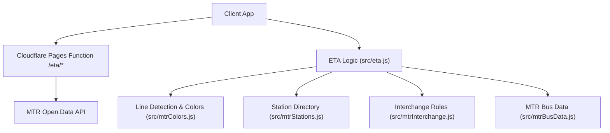
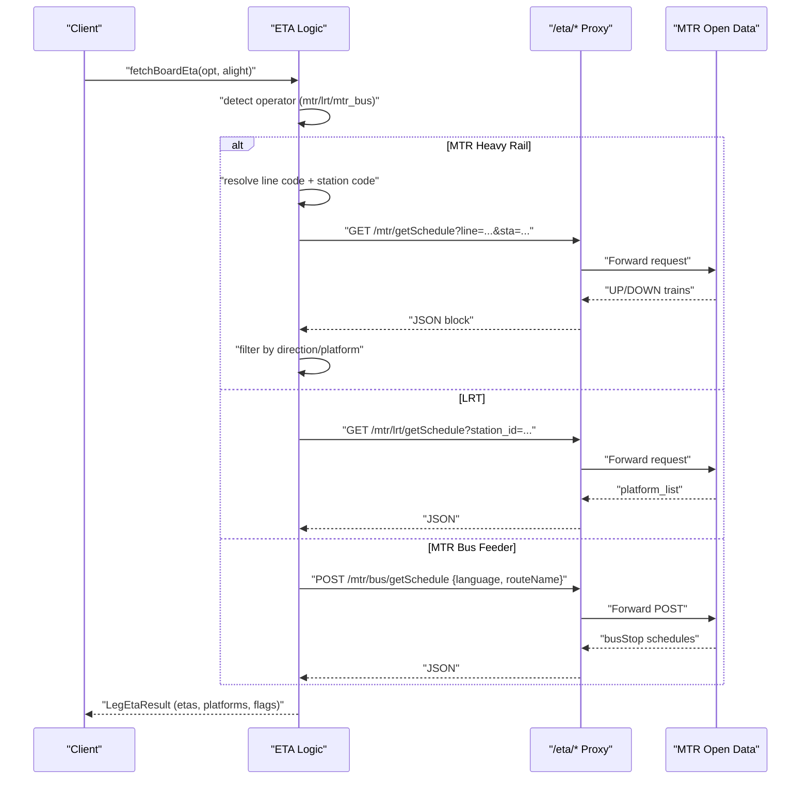
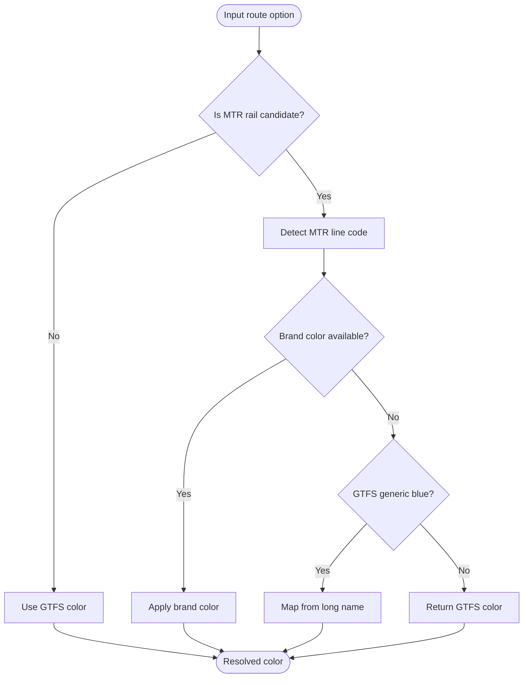
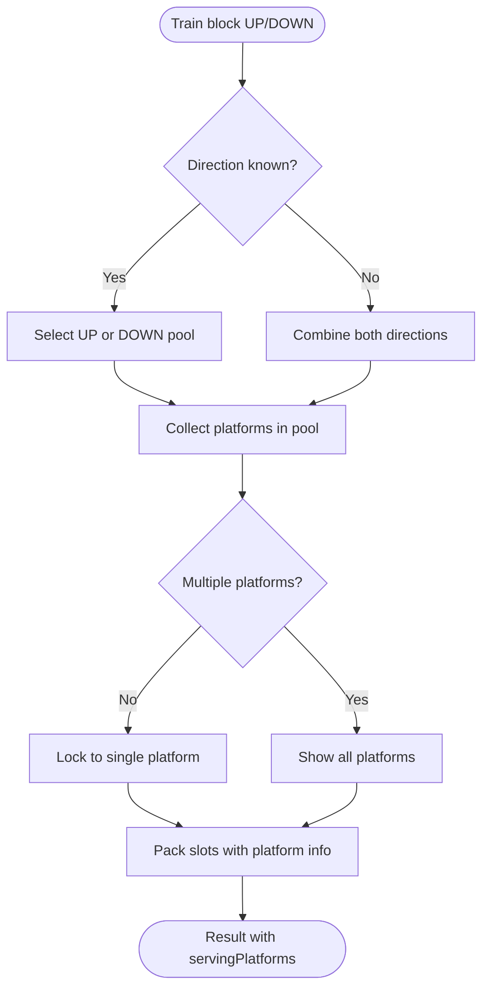
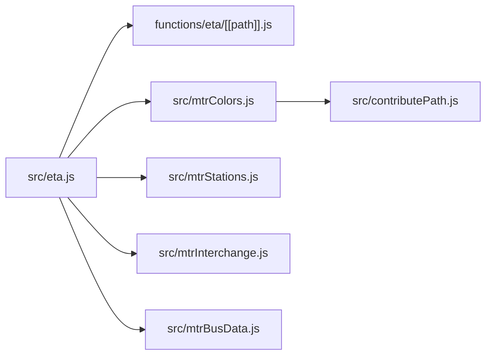

# MTR Integration

<cite>
**Referenced Files in This Document**
- [eta.js](file://src/eta.js)
- [[path]].js](file://functions/eta/[[path]].js)
- [mtrColors.js](file://src/mtrColors.js)
- [mtrStations.js](file://src/mtrStations.js)
- [mtrBusData.js](file://src/mtrBusData.js)
- [mtrInterchange.js](file://src/mtrInterchange.js)
- [contributePath.js](file://src/contributePath.js)
</cite>

## Table of Contents
1. [Introduction](#introduction)
2. [Project Structure](#project-structure)
3. [Core Components](#core-components)
4. [Architecture Overview](#architecture-overview)
5. [Detailed Component Analysis](#detailed-component-analysis)
6. [Dependency Analysis](#dependency-analysis)
7. [Performance Considerations](#performance-considerations)
8. [Troubleshooting Guide](#troubleshooting-guide)
9. [Conclusion](#conclusion)

## Introduction
This document explains the MTR (Mass Transit Railway) operator integration for live ETA retrieval, station ID normalization, line color mapping, and service-type detection across heavy rail, light rail, and MTR bus feeder services. It covers how the system calls MTR open data endpoints, resolves platform information at complex interchange stations, and integrates with station metadata to present accurate, user-friendly arrival information.

## Project Structure
The MTR integration spans a small set of focused modules:
- A Cloudflare Pages function proxies requests to official MTR open data APIs.
- Frontend logic fetches ETAs per operator, normalizes identifiers, and formats results.
- Color and line-detection utilities map GTFS route metadata to official MTR brand colors.
- Station directories and interchange rules support routing, search, and platform handling.

**Diagram sources**
- [[path]].js:1-86](file://functions/eta/[[path]].js#L1-L86)
- [eta.js:1-15](file://src/eta.js#L1-L15)
- [mtrColors.js:1-30](file://src/mtrColors.js#L1-L30)
- [mtrStations.js:1-10](file://src/mtrStations.js#L1-L10)
- [mtrInterchange.js:1-20](file://src/mtrInterchange.js#L1-L20)
- [mtrBusData.js:1-12](file://src/mtrBusData.js#L1-L12)

**Section sources**
- [[path]].js:1-86](file://functions/eta/[[path]].js#L1-L86)
- [eta.js:1-15](file://src/eta.js#L1-L15)

## Core Components
- ETA proxy: Routes operator-specific paths to official APIs with CORS and caching headers.
- ETA orchestrator: Detects operator, selects endpoint, normalizes IDs, parses responses, and packs slots into a unified result.
- Line color module: Maps routes to official MTR brand colors and distinguishes heavy rail vs light rail vs non-rail.
- Station directory: Provides canonical names, codes, coordinates, and snapping/search helpers.
- Interchange logic: Models long transfers, free links, and indoor/outdoor walk rendering.
- MTR bus data: Loads routes/stops CSVs and supports live schedule via POST.

**Section sources**
- [[path]].js:15-85](file://functions/eta/[[path]].js#L15-L85)
- [eta.js:47-112](file://src/eta.js#L47-L112)
- [mtrColors.js:65-95](file://src/mtrColors.js#L65-L95)
- [mtrStations.js:136-215](file://src/mtrStations.js#L136-L215)
- [mtrInterchange.js:212-285](file://src/mtrInterchange.js#L212-L285)
- [mtrBusData.js:197-314](file://src/mtrBusData.js#L197-L314)

## Architecture Overview
The ETA flow for MTR services is operator-aware and uses a single proxy endpoint to reach multiple backends.

**Diagram sources**
- [eta.js:1165-1239](file://src/eta.js#L1165-L1239)
- [eta.js:1269-1338](file://src/eta.js#L1269-L1338)
- [eta.js:1436-1589](file://src/eta.js#L1436-L1589)
- [[path]].js:31-85](file://functions/eta/[[path]].js#L31-L85)

## Detailed Component Analysis

### MTR ETA Endpoints and Fetching
- Heavy rail: Calls `/eta/mtr/getSchedule` with line and station codes; filters UP/DOWN based on travel direction and handles multi-platform scenarios.
- Light rail: Calls `/eta/mtr/lrt/getSchedule` with numeric station ID; aggregates platform lists and route arrivals.
- MTR bus feeder: POSTs `/eta/mtr/bus/getSchedule` with language and route name; matches stops by stopId or fallback to first stop with buses; marks outside-service conditions.

Key behaviors:
- Direction filtering uses line order to choose UP or DOWN when possible; otherwise falls back to destination matching.
- Platform handling prefers API-provided platform labels and avoids locking to a RAPTOR board pin when multiple platforms serve the same direction.
- Timestamps are normalized to ISO with offset; wait minutes are derived consistently.

**Section sources**
- [eta.js:1018-1090](file://src/eta.js#L1018-L1090)
- [eta.js:1092-1162](file://src/eta.js#L1092-L1162)
- [eta.js:1165-1239](file://src/eta.js#L1165-L1239)
- [eta.js:1246-1338](file://src/eta.js#L1246-L1338)
- [eta.js:1436-1589](file://src/eta.js#L1436-L1589)

### Station ID Normalization
- MTR station code extraction supports:
  - Explicit prefixes like `MTR-PLATFORM-TUC-1` or `MTR-TUC`.
  - Bare three-letter codes.
  - Code hints from fields such as `station_code`, `stationCode`, or `code`.
  - Name-based lookup against the local MTR station directory (English and Chinese).
- LRT station ID extraction supports numeric IDs and name matching against the LRT stops directory.
- Stop ID prefix stripping removes operator prefixes (e.g., KMB-, CTB-, NLB-, GMB-, LWB-, MTRBUS-, LRTFEEDER-, LRT-, MTR-) to normalize to core IDs.

**Section sources**
- [eta.js:47-55](file://src/eta.js#L47-L55)
- [eta.js:1018-1057](file://src/eta.js#L1018-L1057)
- [eta.js:1246-1266](file://src/eta.js#L1246-L1266)

### Line Color Integration via mtrColors
- Official brand colors are mapped per line code (e.g., AEL teal, TCL orange, TWL red, ISL blue, KTL green, TKL purple, EAL light blue, TML brown, SIL lime, DRL pink, LRT amber/gold).
- Route color resolution:
  - Non-rail modes always trust GTFS colors.
  - For rail candidates, detects MTR line code and applies brand color.
  - Legacy WRL/MOL short codes resolve to TML when long name indicates Tuen Ma.
  - Generic GTFS blue (`#003DA5`) triggers a second pass using long-name hints.
- Light rail detection excludes HK tramways and matches agency/mode/name patterns plus specific numeric route families.

**Diagram sources**
- [mtrColors.js:65-95](file://src/mtrColors.js#L65-L95)
- [mtrColors.js:138-156](file://src/mtrColors.js#L138-L156)
- [mtrColors.js:158-204](file://src/mtrColors.js#L158-L204)

**Section sources**
- [mtrColors.js:12-29](file://src/mtrColors.js#L12-L29)
- [mtrColors.js:65-95](file://src/mtrColors.js#L65-L95)
- [mtrColors.js:101-128](file://src/mtrColors.js#L101-L128)
- [mtrColors.js:138-156](file://src/mtrColors.js#L138-L156)
- [mtrColors.js:158-204](file://src/mtrColors.js#L158-L204)

### Heavy Rail vs Light Rail Distinction
- Heavy rail includes subway/rail/monorail modes and explicit MTR/AEL/LRT FEEDER contexts; light rail is identified by agency/mode/name patterns and specific numeric route families.
- The distinction affects:
  - Which ETA endpoint is used (heavy rail vs LRT vs MTR bus feeder).
  - Default headway assumptions and timetable expansion behavior.
  - Color mapping (brand colors only for real rail lines, not buses that merely serve similarly named districts).

**Section sources**
- [mtrColors.js:51-59](file://src/mtrColors.js#L51-L59)
- [mtrColors.js:101-128](file://src/mtrColors.js#L101-L128)
- [mtrColors.js:138-156](file://src/mtrColors.js#L138-L156)
- [eta.js:232-241](file://src/eta.js#L232-L241)

### Platform Information Handling for Complex Interchanges
- Platform tokens are normalized and collected across slots to determine serving platforms.
- For MTR heavy rail:
  - Direction filtering chooses UP or DOWN based on line order and alight station.
  - If a single platform serves the chosen direction, results are locked to that platform; if multiple platforms serve the direction, all are shown without forcing the board pin’s platform.
- LRT aggregation pulls platform lists and merges arrivals per platform.
- Labels are formatted consistently (e.g., “Platform 1”, “Platform A”).

**Diagram sources**
- [eta.js:1092-1162](file://src/eta.js#L1092-L1162)
- [eta.js:1194-1228](file://src/eta.js#L1194-L1228)
- [eta.js:575-604](file://src/eta.js#L575-L604)

**Section sources**
- [eta.js:575-604](file://src/eta.js#L575-L604)
- [eta.js:638-661](file://src/eta.js#L638-L661)
- [eta.js:1092-1162](file://src/eta.js#L1092-L1162)
- [eta.js:1194-1228](file://src/eta.js#L1194-L1228)

### Service Type Detection for Different MTR Lines Including Airport Express
- Operator detection differentiates MTR heavy rail, LRT, and MTR bus feeder using kind hints, agency, mode, and route ID patterns.
- Airport Express is treated as heavy rail (AEL), included in line orders and direction filtering.
- Line code detection prioritizes short codes, then long-name hints, then route_id patterns, with legacy-to-current mappings (WRL/MOL → TML when appropriate).

**Section sources**
- [eta.js:61-112](file://src/eta.js#L61-L112)
- [mtrColors.js:158-204](file://src/mtrColors.js#L158-L204)
- [contributePath.js:361-388](file://src/contributePath.js#L361-L388)

### Implementation Details: MTR ETA Fetching
- Heavy rail:
  - Extract line code and station code; call `/eta/mtr/getSchedule`; filter trains by direction and platform; pack slots with wait minutes and ISO timestamps.
- LRT:
  - Resolve numeric station ID; call `/eta/mtr/lrt/getSchedule`; aggregate platform_list and route_list; compute wait minutes from text or numeric fields.
- MTR bus feeder:
  - POST `/eta/mtr/bus/getSchedule` with language and route name; match busStop by stopId or fallback; parse arrival/departure seconds or text; mark scheduled vs live; handle outside-service messages.

**Section sources**
- [eta.js:1165-1239](file://src/eta.js#L1165-L1239)
- [eta.js:1269-1338](file://src/eta.js#L1269-L1338)
- [eta.js:1436-1589](file://src/eta.js#L1436-L1589)

### Station Metadata Integration
- Local station directory provides English/Chinese names, coordinates, and codes; supports search and snapping to nearest station within thresholds.
- Access-pin overrides can adjust coordinates for better routing connectivity.
- GeoJSON-backed station lines map enriches line membership for stations missing fixed-order entries.

**Section sources**
- [mtrStations.js:13-118](file://src/mtrStations.js#L13-L118)
- [mtrStations.js:136-215](file://src/mtrStations.js#L136-L215)
- [mtrStations.js:220-263](file://src/mtrStations.js#L220-L263)
- [mtrStations.js:279-334](file://src/mtrStations.js#L279-L334)

### Special Handling for MTR Bus Feeder Services
- Identified as MTR bus feeder via kind hints, agency patterns, and route ID prefixes.
- Live schedule fetched via POST; stop matching uses stopId or fallback to first stop with buses; destination label comes from route status remark or route name.
- Outside-service hours produce empty results flagged to avoid inventing headways.

**Section sources**
- [eta.js:61-112](file://src/eta.js#L61-L112)
- [eta.js:1436-1589](file://src/eta.js#L1436-L1589)
- [mtrBusData.js:197-314](file://src/mtrBusData.js#L197-L314)

## Dependency Analysis

**Diagram sources**
- [eta.js:1-15](file://src/eta.js#L1-L15)
- [[path]].js:15-22](file://functions/eta/[[path]].js#L15-L22)
- [mtrColors.js:1-30](file://src/mtrColors.js#L1-L30)
- [mtrStations.js:1-10](file://src/mtrStations.js#L1-L10)
- [mtrInterchange.js:1-20](file://src/mtrInterchange.js#L1-L20)
- [mtrBusData.js:1-12](file://src/mtrBusData.js#L1-L12)
- [contributePath.js:355-388](file://src/contributePath.js#L355-L388)

**Section sources**
- [eta.js:1-15](file://src/eta.js#L1-L15)
- [[path]].js:15-22](file://functions/eta/[[path]].js#L15-L22)
- [mtrColors.js:1-30](file://src/mtrColors.js#L1-L30)
- [mtrStations.js:1-10](file://src/mtrStations.js#L1-L10)
- [mtrInterchange.js:1-20](file://src/mtrInterchange.js#L1-L20)
- [mtrBusData.js:1-12](file://src/mtrBusData.js#L1-L12)
- [contributePath.js:355-388](file://src/contributePath.js#L355-L388)

## Performance Considerations
- ETA responses are cached client-side with a short TTL to reduce network load.
- CSV loading for MTR bus data retries multiple sources (static bundle, proxy, direct) and caches parsed results.
- Platform and direction filtering minimize unnecessary rows before packing results.
- Headway-based timetable expansion avoids excessive rows and respects typical service windows.

[No sources needed since this section provides general guidance]

## Troubleshooting Guide
Common issues and mitigations:
- Missing line or station code: Ensure stop IDs include operator prefixes stripped correctly and that station codes are resolvable via directory or explicit fields.
- Empty results during off-hours: MTR bus feeder returns outside-service flags; do not invent headways.
- Incorrect direction selection: Verify line order and alight station codes; fallback logic uses destination matching when direction cannot be determined.
- Platform mismatches: Prefer API platform labels; multi-platform cases should not lock to board pin platform.

**Section sources**
- [eta.js:47-55](file://src/eta.js#L47-L55)
- [eta.js:1018-1057](file://src/eta.js#L1018-L1057)
- [eta.js:1092-1162](file://src/eta.js#L1092-L1162)
- [eta.js:1436-1589](file://src/eta.js#L1436-L1589)

## Conclusion
The MTR integration provides robust ETA fetching across heavy rail, light rail, and MTR bus feeder services. It normalizes station identifiers, applies official line colors, handles complex interchange platforms, and integrates station metadata for accurate routing and display. The modular design separates concerns between proxying, detection, parsing, and presentation, enabling maintainable enhancements and reliable performance.