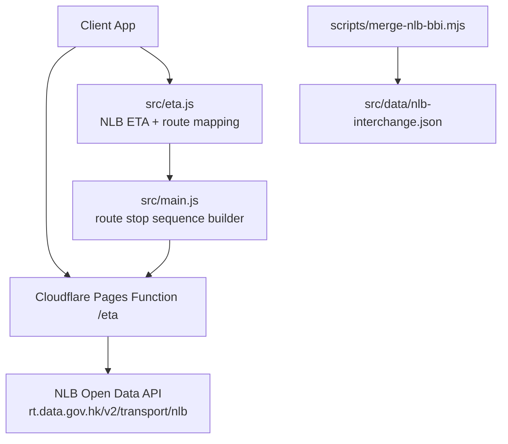
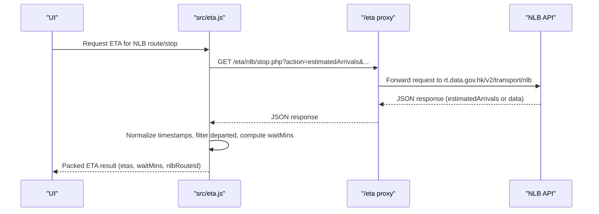
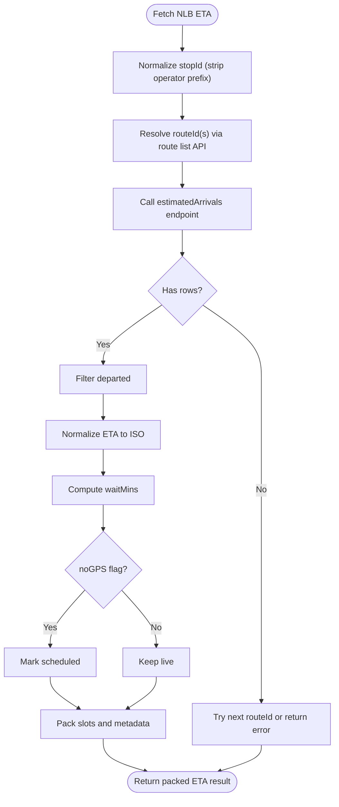
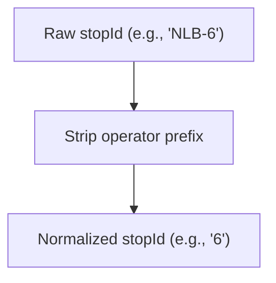
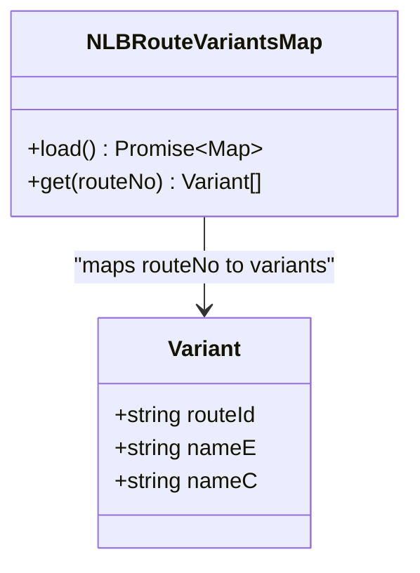
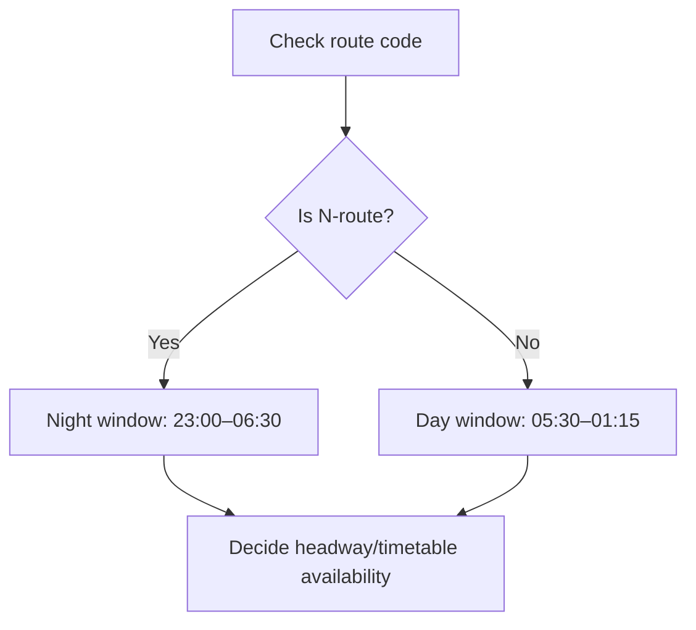
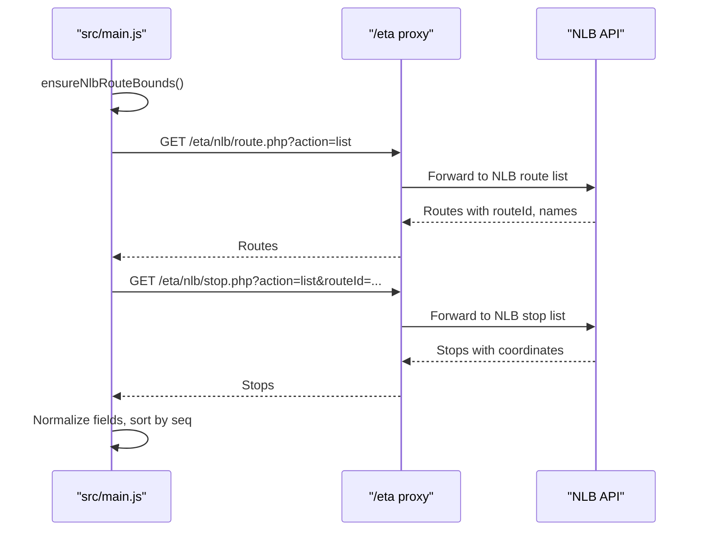
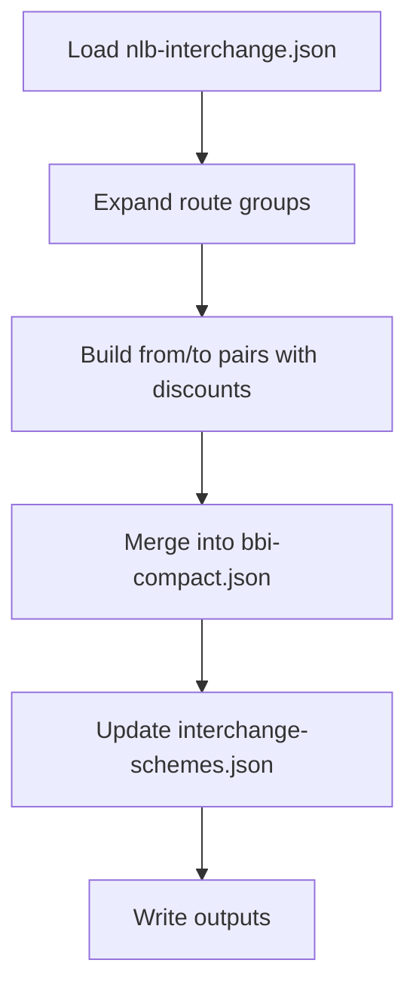
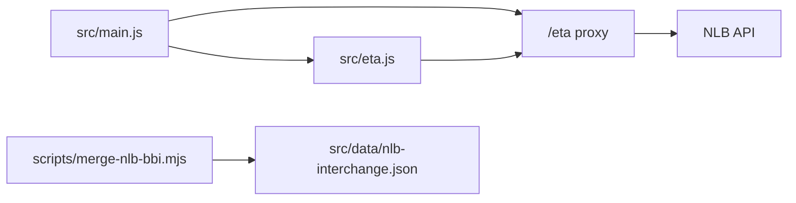

# NLB Integration

<cite>
**Referenced Files in This Document**
- [functions/eta/[[path]].js](file://functions/eta/[[path]].js)
- [src/eta.js](file://src/eta.js)
- [src/main.js](file://src/main.js)
- [scripts/merge-nlb-bbi.mjs](file://scripts/merge-nlb-bbi.mjs)
- [src/data/nlb-interchange.json](file://src/data/nlb-interchange.json)
</cite>

## Table of Contents
1. Introduction
2. Project Structure
3. Core Components
4. Architecture Overview
5. Detailed Component Analysis
6. Dependency Analysis
7. Performance Considerations
8. Troubleshooting Guide
9. Conclusion

## Introduction
This document explains the New Lantao Bus (NLB) operator integration within the system, focusing on:
- NLB-specific ETA API endpoints and how they are proxied
- Stop ID normalization for NLB stop identifiers
- Route mapping strategies that resolve public route numbers to NLB’s internal route IDs
- Overnight route detection for N-routes and service window calculations relevant to Lantau Island operations
- Data transformation processes tailored to NLB’s API structure
- Error handling strategies for remote island routes and fallback behaviors

## Project Structure
The NLB integration spans a Cloudflare Pages function proxy, client-side ETA logic, main application routing for stop sequences, and data scripts for fare interchange.

**Diagram sources**
- [functions/eta/[[path]].js:15-22](file://functions/eta/[[path]].js#L15-L22)
- [src/eta.js:817-912](file://src/eta.js#L817-L912)
- [src/main.js:10674-10746](file://src/main.js#L10674-L10746)
- [scripts/merge-nlb-bbi.mjs:45-139](file://scripts/merge-nlb-bbi.mjs#L45-L139)

**Section sources**
- [functions/eta/[[path]].js:1-86](file://functions/eta/[[path]].js#L1-L86)
- [src/eta.js:1-112](file://src/eta.js#L1-L112)
- [src/main.js:10674-10746](file://src/main.js#L10674-L10746)
- [scripts/merge-nlb-bbi.mjs:1-139](file://scripts/merge-nlb-bbi.mjs#L1-L139)

## Core Components
- ETA proxy function: forwards requests to operator APIs with CORS and caching headers.
- NLB ETA module: fetches arrivals, maps route IDs, normalizes timestamps, and packs results.
- Route stop sequence builder: resolves NLB route IDs and fetches official stop lists for visualization.
- Fare interchange script: expands NLB bus-to-bus interchange schemes into compact pairs.

Key responsibilities:
- Normalize stop IDs by stripping operator prefixes (e.g., NLB-6 → 6).
- Map public route numbers to NLB’s internal route IDs using the route list API.
- Detect overnight N-routes and apply appropriate service windows.
- Handle remote island route errors gracefully and fall back to timetable-based estimates when needed.

**Section sources**
- [src/eta.js:47-55](file://src/eta.js#L47-L55)
- [src/eta.js:817-912](file://src/eta.js#L817-L912)
- [src/eta.js:914-1016](file://src/eta.js#L914-L1016)
- [src/main.js:10674-10746](file://src/main.js#L10674-L10746)
- [scripts/merge-nlb-bbi.mjs:45-139](file://scripts/merge-nlb-bbi.mjs#L45-L139)

## Architecture Overview
The NLB integration uses a same-origin proxy to avoid CORS issues and standardize responses. The client calls the proxy, which forwards to NLB’s open data endpoints. ETA logic then transforms raw API payloads into normalized ETA slots and merges them with timetable information where applicable.

**Diagram sources**
- [functions/eta/[[path]].js:31-85](file://functions/eta/[[path]].js#L31-L85)
- [src/eta.js:914-1016](file://src/eta.js#L914-L1016)

## Detailed Component Analysis

### NLB ETA Fetching and Transformation
- Endpoint usage:
  - Estimated arrivals: `/nlb/stop.php?action=estimatedArrivals&routeId={routeId}&stopId={stopId}&language=en`
  - Timetable-based estimates: when `noGPS=1`, the response indicates scheduled-only data.
- Data transformation:
  - Normalizes various timestamp fields to ISO with offset.
  - Filters out departed services.
  - Computes wait minutes from current time.
  - Marks scheduled entries when no GPS is available.
- Result packing:
  - Sorts by ETA, selects top entries, computes serving platforms, and includes metadata like used route ID and any API messages.

**Diagram sources**
- [src/eta.js:914-1016](file://src/eta.js#L914-L1016)
- [src/eta.js:162-178](file://src/eta.js#L162-L178)
- [src/eta.js:150-160](file://src/eta.js#L150-L160)

**Section sources**
- [src/eta.js:914-1016](file://src/eta.js#L914-L1016)
- [src/eta.js:162-178](file://src/eta.js#L162-L178)
- [src/eta.js:150-160](file://src/eta.js#L150-L160)

### Stop ID Normalization for NLB-6 Format Identifiers
- Operator prefix stripping:
  - Removes prefixes such as “NLB-” from stop IDs to obtain the core identifier expected by NLB APIs.
- Usage:
  - Applied before calling NLB ETA endpoints to ensure correct stop matching.

**Diagram sources**
- [src/eta.js:47-55](file://src/eta.js#L47-L55)

**Section sources**
- [src/eta.js:47-55](file://src/eta.js#L47-L55)

### Route Mapping Strategies for NLB
- Route variants map:
  - Loads NLB route list once and caches it, building a map from public route numbers to internal route IDs with English/Chinese names.
- Direction-aware selection:
  - Uses destination and origin hints to score and pick the most likely route ID variant for the requested direction.
- Fallback behavior:
  - If scoring does not match, returns all variants; if none found, falls back to explicit route ID from options.

**Diagram sources**
- [src/eta.js:817-856](file://src/eta.js#L817-L856)
- [src/eta.js:858-912](file://src/eta.js#L858-L912)

**Section sources**
- [src/eta.js:817-856](file://src/eta.js#L817-L856)
- [src/eta.js:858-912](file://src/eta.js#L858-L912)

### Overnight Route Detection and Service Window Calculations
- Overnight detection:
  - Recognizes N-route codes (e.g., N64, NA21, N11, NB3, N260) after stripping operator prefixes.
- Service window:
  - Day routes: typical service roughly 05:30–01:15 (covers late-night services).
  - Overnight N-routes: typical service roughly 23:00–06:30.
- Application:
  - Used to decide whether to invent headway-based departures or mark outside service hours.

**Diagram sources**
- [src/eta.js:243-289](file://src/eta.js#L243-L289)

**Section sources**
- [src/eta.js:243-289](file://src/eta.js#L243-L289)

### NLB Stop Sequence Builder for Visualization
- Route ID resolution:
  - Ensures NLB route bounds are loaded and picks the route ID matching the requested bound/direction.
- Stop list fetching:
  - Tries multiple NLB endpoints to retrieve stop sequences, normalizing field names and coordinates.
- Sorting and validation:
  - Orders stops by sequence and filters invalid coordinate entries.

**Diagram sources**
- [src/main.js:7771-7817](file://src/main.js#L7771-L7817)
- [src/main.js:10674-10746](file://src/main.js#L10674-L10746)
- [functions/eta/[[path]].js:31-85](file://functions/eta/[[path]].js#L31-L85)

**Section sources**
- [src/main.js:7771-7817](file://src/main.js#L7771-L7817)
- [src/main.js:10674-10746](file://src/main.js#L10674-L10746)

### NLB Fare Interchange Integration
- Data source:
  - Hand-extracted NLB Chinese passenger interchange page into structured JSON.
- Processing:
  - Expands route groups and explicit pairs into compact BBI pairs.
  - Merges with existing compact data, preserving updated_at and sources.
- Output:
  - Writes compact pairs and updates interchange schemes metadata.

**Diagram sources**
- [scripts/merge-nlb-bbi.mjs:45-139](file://scripts/merge-nlb-bbi.mjs#L45-L139)
- [src/data/nlb-interchange.json:1-199](file://src/data/nlb-interchange.json#L1-L199)

**Section sources**
- [scripts/merge-nlb-bbi.mjs:45-139](file://scripts/merge-nlb-bbi.mjs#L45-L139)
- [src/data/nlb-interchange.json:1-199](file://src/data/nlb-interchange.json#L1-L199)

## Dependency Analysis
- The ETA proxy depends on operator target mappings and forwards requests with appropriate headers and caching.
- The ETA module depends on:
  - Route list API for mapping public route numbers to internal IDs.
  - Stop ETA API for live arrivals.
  - Stop sequence endpoints for visualization.
- The main module depends on the ETA module and proxy to build accurate stop sequences for NLB routes.
- The fare interchange script depends on structured NLB interchange data to produce compact pairs.

**Diagram sources**
- [functions/eta/[[path]].js:15-22](file://functions/eta/[[path]].js#L15-L22)
- [src/eta.js:817-912](file://src/eta.js#L817-L912)
- [src/main.js:10674-10746](file://src/main.js#L10674-L10746)
- [scripts/merge-nlb-bbi.mjs:45-139](file://scripts/merge-nlb-bbi.mjs#L45-L139)

**Section sources**
- [functions/eta/[[path]].js:15-22](file://functions/eta/[[path]].js#L15-L22)
- [src/eta.js:817-912](file://src/eta.js#L817-L912)
- [src/main.js:10674-10746](file://src/main.js#L10674-L10746)
- [scripts/merge-nlb-bbi.mjs:45-139](file://scripts/merge-nlb-bbi.mjs#L45-L139)

## Performance Considerations
- Caching:
  - ETA module caches responses for a short TTL to reduce repeated network calls.
  - Route list API is cached longer to minimize frequent lookups.
- Fallbacks:
  - Multiple route ID candidates are tried sequentially to improve success rates.
  - Stop sequence builder tries multiple endpoints to handle variations in NLB API responses.
- Efficiency:
  - Direction-aware route ID selection reduces unnecessary API calls by narrowing candidates early.

[No sources needed since this section provides general guidance]

## Troubleshooting Guide
Common issues and resolutions:
- Missing route ID:
  - Ensure route number exists in NLB route list; otherwise, use explicit route ID from options.
- No arrivals:
  - Check for API messages indicating service interruptions or remote island constraints; fall back to timetable-based estimates when flagged.
- Stop ID mismatch:
  - Verify stop ID normalization removes operator prefixes correctly.
- Outside service hours:
  - For N-routes, confirm nighttime service window; for day routes, check morning/evening boundaries.

**Section sources**
- [src/eta.js:914-1016](file://src/eta.js#L914-L1016)
- [src/eta.js:243-289](file://src/eta.js#L243-L289)
- [src/eta.js:47-55](file://src/eta.js#L47-L55)

## Conclusion
The NLB integration provides robust ETA fetching, route mapping, and visualization support tailored to NLB’s API structure and operational patterns. It handles stop ID normalization, overnight route detection, and service window calculations specific to Lantau Island operations. Error handling and fallback mechanisms ensure reliability even for remote island routes. The fare interchange script complements the integration by expanding NLB bus-to-bus discounts into actionable data.

[No sources needed since this section summarizes without analyzing specific files]