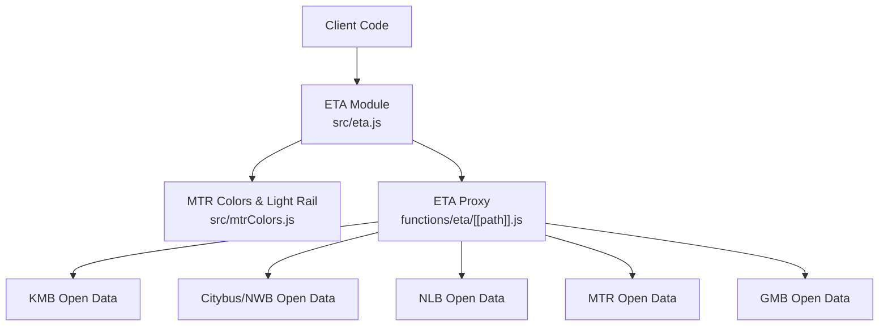
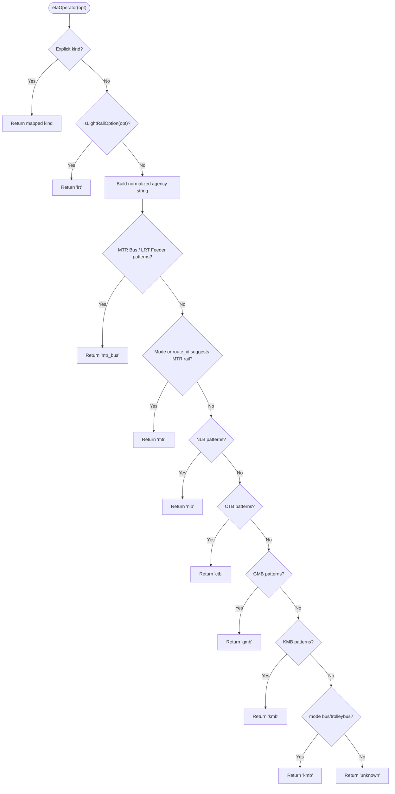
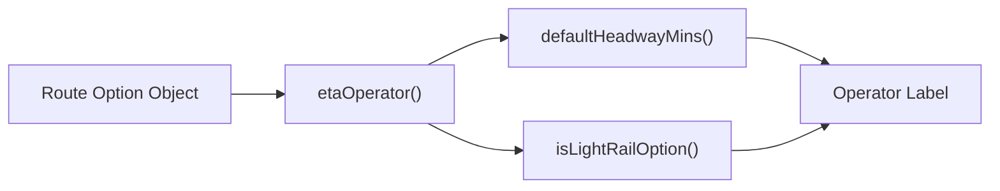

# Operator Detection Logic

<cite>
**Referenced Files in This Document**
- [eta.js](file://src/eta.js)
- [mtrColors.js](file://src/mtrColors.js)
- [[path]].js](file://functions/eta/[[path]].js)
</cite>

## Table of Contents
1. [Introduction](#introduction)
2. [Project Structure](#project-structure)
3. [Core Components](#core-components)
4. [Architecture Overview](#architecture-overview)
5. [Detailed Component Analysis](#detailed-component-analysis)
6. [Dependency Analysis](#dependency-analysis)
7. [Performance Considerations](#performance-considerations)
8. [Troubleshooting Guide](#troubleshooting-guide)
9. [Conclusion](#conclusion)

## Introduction
This document explains the automatic operator detection system that identifies transit operators from route data used by the ETA module. It focuses on the detection hierarchy implemented in the etaOperator function, including explicit kind fields, agency name analysis, route ID pattern matching, and service mode detection. It also documents the regex patterns used to identify each operator (KMB, CTB, NLB, MTR, LRT, GMB), the priority order of detection methods, fallback mechanisms for unknown operators, integration with MTR color detection for light rail identification, and edge cases in operator classification.

## Project Structure
The operator detection logic is primarily implemented in the ETA module and integrates with MTR line color utilities:
- The core detection function resides in the ETA module and orchestrates multiple signals (kind, agency, route_id, mode, short names).
- Light rail detection is delegated to a dedicated utility that recognizes MTR Light Rail using agency, mode, and route naming heuristics.
- A Cloudflare Pages Function proxies requests to official open-data endpoints for each operator’s ETA API.

**Diagram sources**
- [eta.js:61-112](file://src/eta.js#L61-L112)
- [mtrColors.js:138-156](file://src/mtrColors.js#L138-L156)
- [[path]].js:15-22](file://functions/eta/[[path]].js#L15-L22)

**Section sources**
- [eta.js:61-112](file://src/eta.js#L61-L112)
- [mtrColors.js:138-156](file://src/mtrColors.js#L138-L156)
- [[path]].js:15-22](file://functions/eta/[[path]].js#L15-L22)

## Core Components
- etaOperator(opt): Determines the operator label from an option object using a prioritized cascade of signals.
- isLightRailOption(opt): Detects MTR Light Rail options based on agency, mode, and route naming heuristics; used by etaOperator to classify LRT early.
- defaultHeadwayMins(opt, operator): Uses detected operator to select typical headways for timetable expansion when live ETAs are unavailable.
- ETA proxy functions: Route client requests to operator-specific open-data endpoints via a single proxy endpoint.

Key responsibilities:
- Normalize and extract signals: kind, agency id/name, route_id, mode, short name.
- Apply explicit kind overrides first.
- Use light rail detection to classify LRT before other bus/rail rules.
- Match agency names and route IDs with regex patterns per operator.
- Fall back to mode-based heuristics and finally return "unknown".

**Section sources**
- [eta.js:61-112](file://src/eta.js#L61-L112)
- [eta.js:232-241](file://src/eta.js#L232-L241)
- [mtrColors.js:138-156](file://src/mtrColors.js#L138-L156)
- [[path]].js:15-22](file://functions/eta/[[path]].js#L15-L22)

## Architecture Overview
The detection pipeline follows a strict priority order:

1. Explicit kind override: If opt.kind or opt.etaKind indicates a specific operator or service type, use it directly.
2. Light rail detection: If isLightRailOption returns true, classify as LRT.
3. Agency name analysis: Combine agency.id and agency.name into a normalized string and match against operator-specific keywords.
4. Route ID pattern matching: Check route_id prefixes and patterns for known operators.
5. Service mode detection: Use opt.mode to infer heavy rail vs bus vs tram/light rail.
6. Short route name heuristics: For MTR Bus/LRT feeder routes, match short codes like K-prefixed numbers.
7. Fallback: Return "unknown" if no rule matches.

**Diagram sources**
- [eta.js:61-112](file://src/eta.js#L61-L112)
- [mtrColors.js:138-156](file://src/mtrColors.js#L138-L156)

**Section sources**
- [eta.js:61-112](file://src/eta.js#L61-L112)
- [mtrColors.js:138-156](file://src/mtrColors.js#L138-L156)

## Detailed Component Analysis

### etaOperator function
The etaOperator function implements the detection hierarchy described above. It normalizes inputs, applies explicit kind overrides, delegates to isLightRailOption for LRT, then proceeds through agency and route_id checks, followed by mode-based inference.

Detection steps and patterns:
- Explicit kind mapping:
  - Maps kind values such as "mtr_bus", "lrt", "mtr" to corresponding operator labels.
  - Also maps legacy or alternate forms like "mtrbus" and "lrtfeeder".
- Light rail detection:
  - Delegates to isLightRailOption(opt) to detect MTR Light Rail based on agency, mode, and route naming heuristics.
- MTR Bus / LRT Feeder classification:
  - Matches agency strings containing terms like "lrt feeder", "mtr bus", "mtrb", "mtr_bus", and Chinese terms for MTR Bus/LRT feeder.
  - Matches route_id prefixes "LRTFEEDER", "MTRBUS", "MTR_BUS".
  - Matches short route names starting with "K" followed by digits and optional letter, plus special case "506".
- MTR heavy rail classification:
  - Matches modes "subway", "rail", "monorail".
  - Matches route_id prefix "MTR-".
  - Matches agency strings containing "mtr rail" or "airport express".
- NLB classification:
  - Matches agency strings containing "nlb" or "new lanto".
  - Matches route_id prefix "NLB-".
- CTB classification:
  - Matches agency strings containing "ctb", "citybus", "nwfb", "new world".
  - Matches route_id prefix "CTB-".
- GMB classification:
  - Matches agency strings containing "gmb", "green mini", "minibus", and Chinese term for minibus.
  - Matches route_id prefix "GMB-".
  - Supports explicit kind "gmb".
- KMB classification:
  - Matches agency strings containing "kmb", "lwb", "long win", "kowloon motor".
  - Matches route_id prefixes "KMB-" and "LWB-".
  - Falls back to mode "bus" or "trolleybus" to classify as KMB.
- Fallback:
  - Returns "unknown" if none of the above rules match.

Regex patterns summary:
- MTR Bus/LRT Feeder:
  - Agency: "lrt\s*feeder|mtr\s*bus|mtrb|mtr_bus|港鐵巴士|輕鐵接駁"
  - Route ID: "^LRTFEEDER|i|^MTRBUS|i|^MTR_BUS|i"
  - Short name: "^(K\d+[A-Z]?|506)$i"
- MTR Heavy Rail:
  - Modes: "subway|rail|monorail"
  - Route ID: "^MTR-"
  - Agency: "\bmtr\s*rail\b|\bairport\s*express\b"
- NLB:
  - Agency: "\bnlb\b|new\s*lanto"
  - Route ID: "^NLB-"
- CTB:
  - Agency: "\bctb\b|citybus|nwfb|new\s*world"
  - Route ID: "^CTB-"
- GMB:
  - Agency: "\bgmb\b|green\s*mini|minibus|專線"
  - Route ID: "^GMB-"
  - Kind: "gmb"
- KMB:
  - Agency: "\bkmb\b|lwb|long\s*win|kowloon\s*motor"
  - Route ID: "^KMB-|^LWB-"
  - Mode: "bus|trolleybus"

Edge cases and notes:
- The function treats MTR Bus/LRT feeder routes distinctly from heavy-rail MTR services.
- Mode-based fallback classifies generic bus/trolleybus as KMB unless another operator is explicitly identified.
- Explicit kind fields take highest precedence, allowing upstream systems to override detection.

**Section sources**
- [eta.js:61-112](file://src/eta.js#L61-L112)

### Light rail detection integration
The isLightRailOption function determines whether an option represents MTR Light Rail. It considers:
- Agency id/name: exact "lr" or presence of "light rail" or Chinese term for Light Rail.
- Mode: "light_rail".
- Tram-like modes ("tram", "cable_tram") combined with naming heuristics:
  - Includes "light rail" or Chinese term in route_long_name/route_name/route_id.
  - Excludes Hong Kong Island tramways by checking for "tramways", Chinese term for HK tram, or "hk tram".
  - Recognizes numeric LRT route codes within a specific family (e.g., 505–761P variants).

Integration points:
- etaOperator calls isLightRailOption after explicit kind checks and before agency/route_id analysis to ensure LRT is correctly classified even when mode or agency hints are ambiguous.
- MTR line color utilities also rely on isLightRailOption to avoid misclassifying buses that pass near MTR stations as heavy rail.

**Section sources**
- [mtrColors.js:138-156](file://src/mtrColors.js#L138-L156)
- [eta.js:61-70](file://src/eta.js#L61-L70)

### ETA proxy integration
The Cloudflare Pages Function provides a unified proxy for operator-specific ETA APIs:
- Routes prefixed under /eta/<operator>/ map to official endpoints for KMB, Citybus/NWB, NLB, MTR, GMB, and MTR Open Data.
- Handles CORS preflight and forwards GET/POST/PUT bodies where required (e.g., MTR Bus getSchedule).
- Caches GET responses briefly to reduce load.

This proxy enables the ETA module to fetch live ETAs per operator once the operator has been detected.

**Section sources**
- [[path]].js:1-86](file://functions/eta/[[path]].js#L1-L86)

## Dependency Analysis
The operator detection logic depends on:
- Input option structure:
  - kind or etaKind for explicit overrides.
  - agency.id and agency.name for keyword matching.
  - route_id for prefix/pattern matching.
  - mode for service-type inference.
  - route_short_name or route_name for short-name heuristics.
- isLightRailOption for LRT classification.
- defaultHeadwayMins uses the detected operator to choose headways for timetable expansion.

**Diagram sources**
- [eta.js:61-112](file://src/eta.js#L61-L112)
- [eta.js:232-241](file://src/eta.js#L232-L241)
- [mtrColors.js:138-156](file://src/mtrColors.js#L138-L156)

**Section sources**
- [eta.js:61-112](file://src/eta.js#L61-L112)
- [eta.js:232-241](file://src/eta.js#L232-L241)
- [mtrColors.js:138-156](file://src/mtrColors.js#L138-L156)

## Performance Considerations
- Regex matching is applied in a fixed order; keeping the most discriminative checks earlier reduces unnecessary evaluations.
- isLightRailOption performs lightweight checks on agency, mode, and route names; it avoids expensive operations.
- The ETA proxy caches GET responses briefly, reducing repeated network calls during rapid queries.
- Avoid adding new broad-match rules late in the chain; they can increase false positives and CPU usage.

[No sources needed since this section provides general guidance]

## Troubleshooting Guide
Common issues and how to diagnose them:
- Misclassification as KMB due to missing operator hints:
  - Ensure route_id includes operator prefixes (e.g., "KMB-", "CTB-", "NLB-", "GMB-").
  - Verify agency.name/id contains recognizable keywords.
  - Confirm mode is set appropriately; generic "bus" defaults to KMB unless overridden.
- LRT not detected:
  - Check isLightRailOption conditions: agency id/name should include "lr" or "light rail"; mode should be "light_rail" or tram-like with appropriate naming; numeric LRT codes must fall within recognized families.
  - Ensure route_long_name/route_name/route_id do not match exclusion patterns for HK tramways.
- MTR heavy rail misclassified:
  - Confirm mode is "subway", "rail", or "monorail", or route_id starts with "MTR-".
  - Verify agency strings contain "mtr rail" or "airport express".
- Unexpected "unknown":
  - Inspect input fields: kind, agency, route_id, mode, short name.
  - Add explicit kind if upstream data cannot provide reliable signals.

**Section sources**
- [eta.js:61-112](file://src/eta.js#L61-L112)
- [mtrColors.js:138-156](file://src/mtrColors.js#L138-L156)

## Conclusion
The automatic operator detection system uses a clear, prioritized cascade to classify transit operators from route data. It begins with explicit kind overrides, quickly identifies MTR Light Rail via dedicated heuristics, then applies agency and route_id pattern matching for NLB, CTB, GMB, and KMB, followed by mode-based inference for MTR heavy rail and generic bus classification. The integration with MTR color utilities ensures accurate light rail identification without confusing nearby bus services. When no rule matches, the system falls back to "unknown", enabling robust handling of edge cases while preserving predictability.