# Operator Integration

<cite>
**Referenced Files in This Document**
- [eta.js](file://src/eta.js)
- [gmbRouteData.js](file://src/gmbRouteData.js)
- [lrtRouteData.js](file://src/lrtRouteData.js)
- [mtrBusData.js](file://src/mtrBusData.js)
- [[path]].js](file://functions/eta/[[path]].js)
- [main.js](file://src/main.js)
- [stopMerge.js](file://src/stopMerge.js)
</cite>

## Table of Contents
1. [Introduction](#introduction)
2. [Project Structure](#project-structure)
3. [Core Components](#core-components)
4. [Architecture Overview](#architecture-overview)
5. [Detailed Component Analysis](#detailed-component-analysis)
6. [Dependency Analysis](#dependency-analysis)
7. [Performance Considerations](#performance-considerations)
8. [Troubleshooting Guide](#troubleshooting-guide)
9. [Conclusion](#conclusion)

## Introduction
This document explains the operator integration system that supports multiple Hong Kong transit operators: KMB/LWB, CTB/NWFB, NLB, MTR Rail, LRT (Light Rail), GMB (Green Minibus), and MTR Bus (LRT Feeder). It covers:
- How the system detects the correct operator from agency names, route IDs, and service modes
- How stop IDs are normalized across different operator formats
- The specific API endpoints and data formats used per operator
- Error handling strategies and fallback mechanisms
- Implementation details for MTR Bus/LRT feeder detection, overnight route identification, and service type parsing from trip IDs

## Project Structure
The integration spans client-side logic and a Cloudflare Pages Function proxy:
- Client-side modules implement operator detection, stop ID normalization, route/stop sequence loading, and ETA fetching
- A single proxy function routes requests to each operator’s open-data APIs with CORS and caching headers

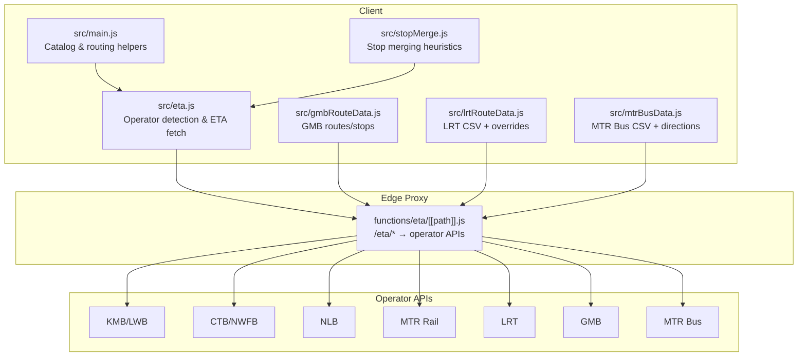

**Diagram sources**
- [eta.js:1-112](file://src/eta.js#L1-L112)
- [gmbRouteData.js:1-10](file://src/gmbRouteData.js#L1-L10)
- [lrtRouteData.js:1-6](file://src/lrtRouteData.js#L1-L6)
- [mtrBusData.js:1-11](file://src/mtrBusData.js#L1-L11)
- [[path]].js:1-22](file://functions/eta/[[path]].js#L1-L22)

**Section sources**
- [eta.js:1-112](file://src/eta.js#L1-L112)
- [[path]].js:1-22](file://functions/eta/[[path]].js#L1-L22)

## Core Components
- Operator detection: Determines operator from explicit kind, agency name/id, route_id, short route name, and mode
- Stop ID normalization: Strips operator prefixes to obtain canonical IDs for downstream APIs
- Route/stop sequences: Load static or proxied data for LRT and MTR Bus; dynamic JSON for GMB
- ETA fetching: Per-operator fetchers with robust error handling and fallbacks
- Service window and timetable expansion: Overnight route detection and headway-based schedule generation when live data is unavailable

**Section sources**
- [eta.js:47-112](file://src/eta.js#L47-L112)
- [eta.js:247-289](file://src/eta.js#L247-L289)
- [gmbRouteData.js:41-166](file://src/gmbRouteData.js#L41-L166)
- [lrtRouteData.js:176-287](file://src/lrtRouteData.js#L176-L287)
- [mtrBusData.js:197-314](file://src/mtrBusData.js#L197-L314)

## Architecture Overview
The ETA pipeline normalizes inputs, selects the correct operator, calls the appropriate endpoint via a same-origin proxy, and merges live ETAs with scheduled departures.

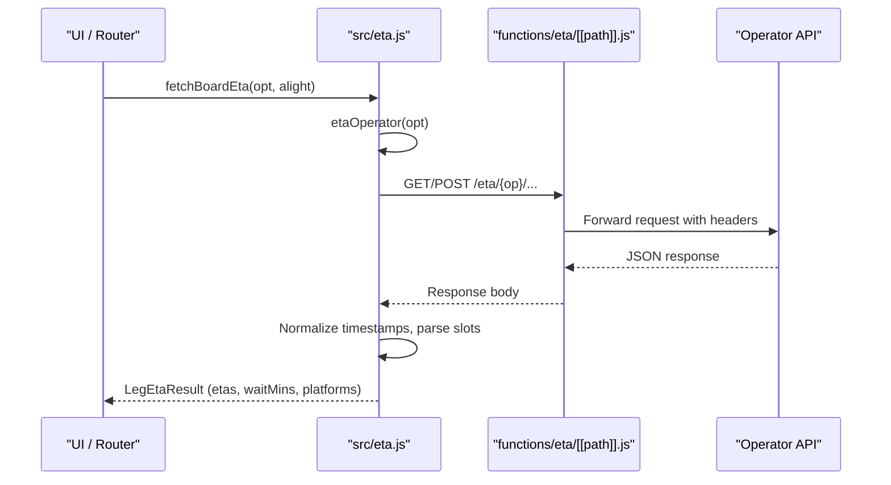

**Diagram sources**
- [eta.js:1597-1758](file://src/eta.js#L1597-L1758)
- [[path]].js:31-85](file://functions/eta/[[path]].js#L31-L85)

## Detailed Component Analysis

### Operator Detection Logic
- Explicit kind flags override inference (e.g., mtr_bus, lrt, mtr)
- Agency name/id patterns match known operators (KMB/LWB, CTB/NWFB, NLB, GMB, MTR Rail)
- Route ID prefixes and short route names refine detection (e.g., KMB-, CTB-, NLB-, GMB-, MTR-, LRT-)
- Mode hints (bus, trolleybus, subway, rail, monorail) disambiguate ambiguous cases
- Special case: MTR Bus/LRT feeder detection includes route patterns like K51, 506, and explicit “lrt feeder” strings

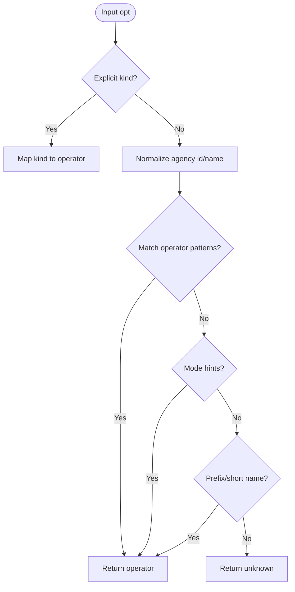

**Diagram sources**
- [eta.js:61-112](file://src/eta.js#L61-L112)

**Section sources**
- [eta.js:61-112](file://src/eta.js#L61-L112)
- [main.js:10420-10439](file://src/main.js#L10420-L10439)

### Stop ID Normalization
- Strip operator prefixes to get canonical IDs for APIs: KMB-HEX, CTB-001859, NLB-6, GMB-…, MTR-PLATFORM-TUC-1
- For LRT, numeric stop IDs are preferred; otherwise resolve by stop name against a local directory
- For MTR, extract three-letter station codes from platform tags or names

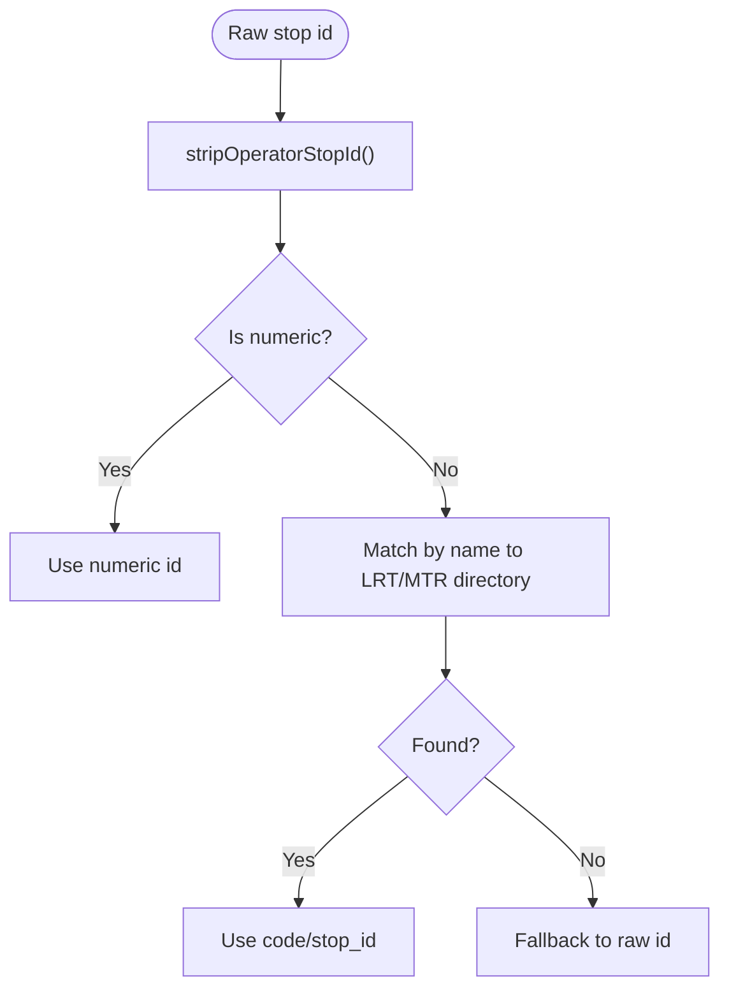

**Diagram sources**
- [eta.js:47-55](file://src/eta.js#L47-L55)
- [eta.js:1246-1266](file://src/eta.js#L1246-L1266)
- [eta.js:1023-1057](file://src/eta.js#L1023-L1057)

**Section sources**
- [eta.js:47-55](file://src/eta.js#L47-L55)
- [eta.js:1246-1266](file://src/eta.js#L1246-L1266)
- [eta.js:1023-1057](file://src/eta.js#L1023-L1057)

### GMB Integration
- Endpoints:
  - GET /eta/gmb/route/ — all region route codes
  - GET /eta/gmb/route/{HKI|KLN|NT}/{code} — variants + directions
  - GET /eta/gmb/route-stop/{route_id}/{seq} — ordered stops
  - GET /eta/gmb/stop/{stop_id} — WGS84 coordinates
  - GET /eta/gmb/eta/route-stop/{route_id}/{route_seq}/{stop_seq} — live ETA
- Data format: JSON with nested data arrays; direction slots include destination labels and route sequence
- Fallbacks: Try multiple regions if a route code exists in more than one; cache direction and stop sequences

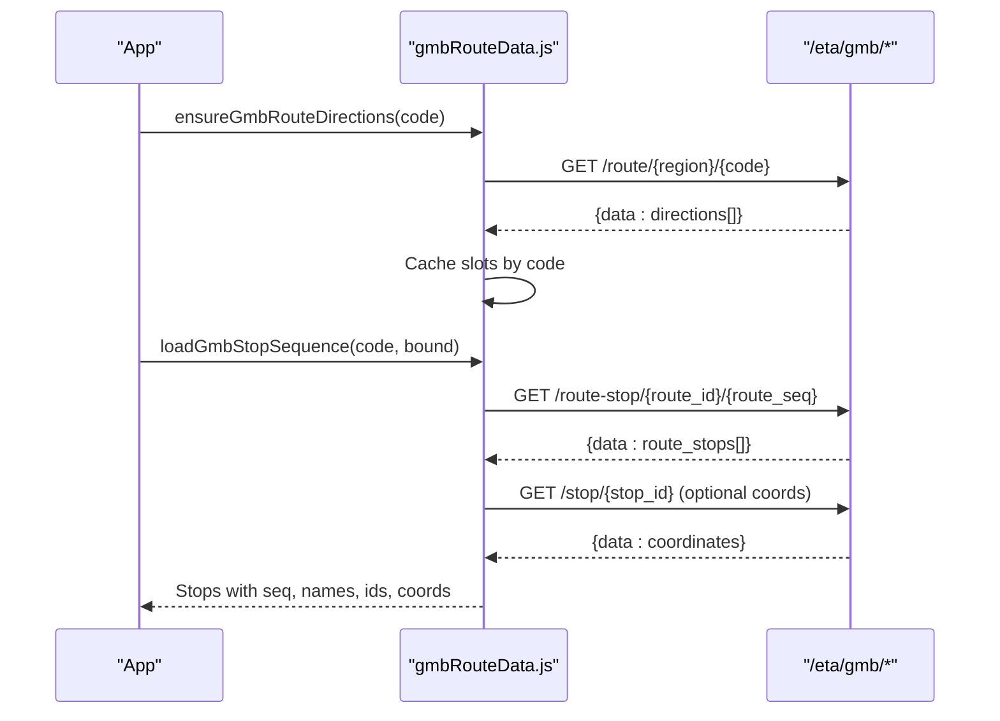

**Diagram sources**
- [gmbRouteData.js:41-166](file://src/gmbRouteData.js#L41-L166)
- [gmbRouteData.js:192-265](file://src/gmbRouteData.js#L192-L265)

**Section sources**
- [gmbRouteData.js:1-10](file://src/gmbRouteData.js#L1-L10)
- [gmbRouteData.js:41-166](file://src/gmbRouteData.js#L41-L166)
- [gmbRouteData.js:192-265](file://src/gmbRouteData.js#L192-L265)

### LRT Integration
- Data source: CSV from MTR Open Data (bundled static, proxy, or direct) plus local overrides for peak-hour routes
- Endpoints:
  - Live ETA: GET /eta/mtr/lrt/getSchedule?station_id={Stop ID}
- Data format: CSV rows with route, direction, stop code/id, names, sequence; merged with overrides
- Stop resolution: Prefer numeric stop id; otherwise match by English/Chinese name to local directory

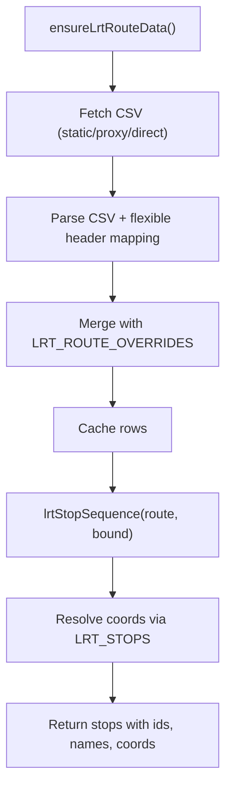

**Diagram sources**
- [lrtRouteData.js:176-287](file://src/lrtRouteData.js#L176-L287)
- [lrtRouteData.js:380-429](file://src/lrtRouteData.js#L380-L429)

**Section sources**
- [lrtRouteData.js:1-6](file://src/lrtRouteData.js#L1-L6)
- [lrtRouteData.js:176-287](file://src/lrtRouteData.js#L176-L287)
- [lrtRouteData.js:380-429](file://src/lrtRouteData.js#L380-L429)

### MTR Bus (LRT Feeder) Integration
- Data source: CSV files for routes and stops (bundled/static, proxy, or direct)
- Endpoints:
  - POST /eta/mtr/bus/getSchedule { language, routeName } — live schedule
- Data format: JSON with busStop array; each stop contains bus entries with arrival/departure times and optional GPS
- Direction and OD: Derived from stop sequences and route names; prefer primary variant where reference ids differ

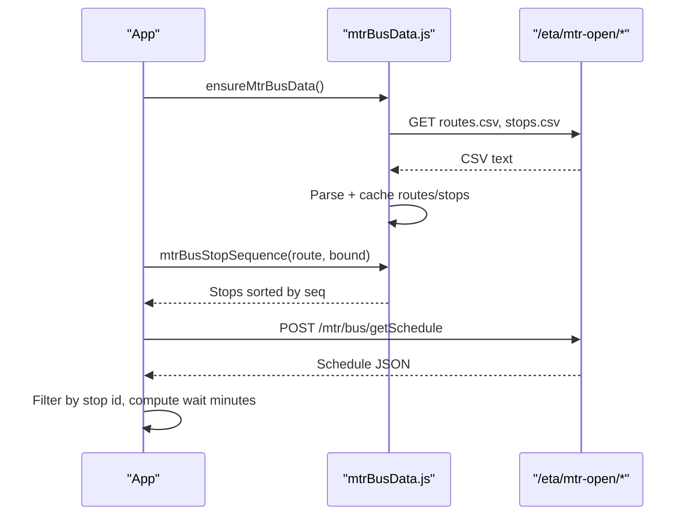

**Diagram sources**
- [mtrBusData.js:197-314](file://src/mtrBusData.js#L197-L314)
- [mtrBusData.js:479-498](file://src/mtrBusData.js#L479-L498)
- [eta.js:1436-1589](file://src/eta.js#L1436-L1589)

**Section sources**
- [mtrBusData.js:1-11](file://src/mtrBusData.js#L1-L11)
- [mtrBusData.js:197-314](file://src/mtrBusData.js#L197-L314)
- [mtrBusData.js:479-498](file://src/mtrBusData.js#L479-L498)
- [eta.js:1436-1589](file://src/eta.js#L1436-L1589)

### MTR Rail and LRT ETA Fetching
- MTR Rail:
  - Extract line code and station code from stop metadata or names
  - Call GET /eta/mtr/getSchedule.php?line={line}&sta={sta}
  - Filter trains by travel direction using line order; handle multi-platform scenarios
- LRT:
  - Resolve station id (numeric preferred); call GET /eta/mtr/lrt/getSchedule?station_id={id}
  - Parse platform list and route_list; derive wait minutes from time fields

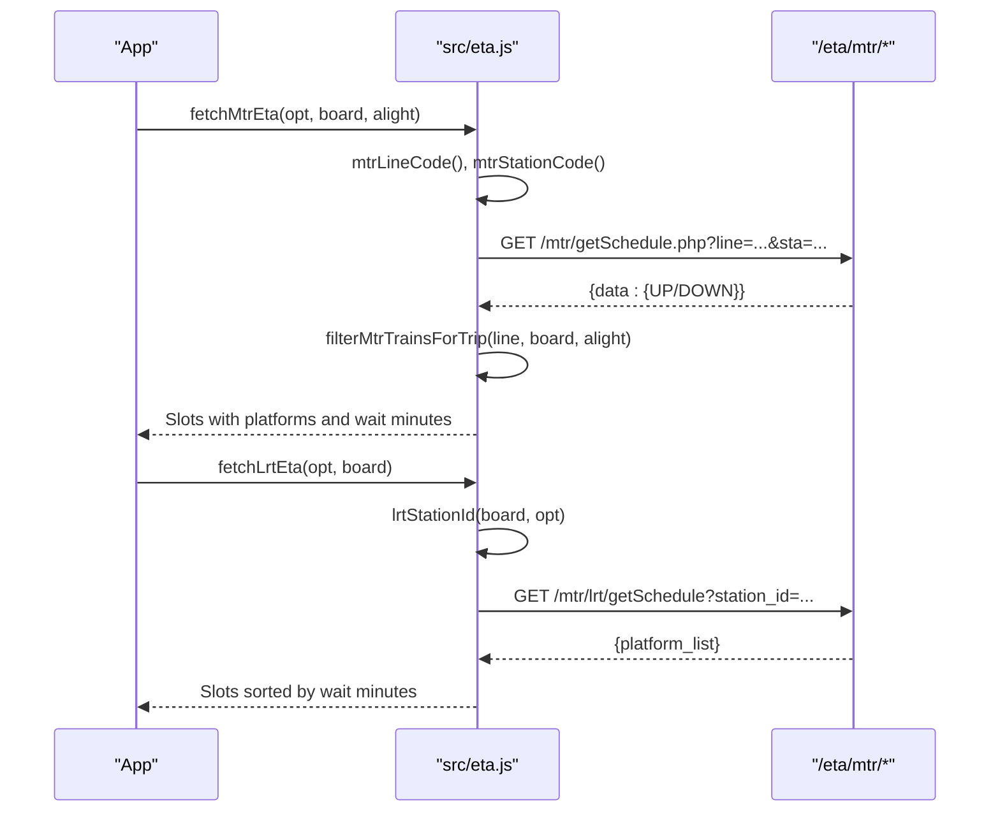

**Diagram sources**
- [eta.js:1165-1239](file://src/eta.js#L1165-L1239)
- [eta.js:1269-1338](file://src/eta.js#L1269-L1338)

**Section sources**
- [eta.js:1165-1239](file://src/eta.js#L1165-L1239)
- [eta.js:1269-1338](file://src/eta.js#L1269-L1338)

### NLB Integration
- Route variants map cached for efficient lookup
- Endpoints:
  - GET /eta/nlb/route.php?action=list — route variants
  - GET /eta/nlb/stop.php?action=estimatedArrivals&routeId={id}&stopId={id}&language=en
- Data format: estimatedArrivals array; noGPS flag indicates timetable-based estimates
- Fallbacks: Try multiple routeIds (directions) until arrivals found

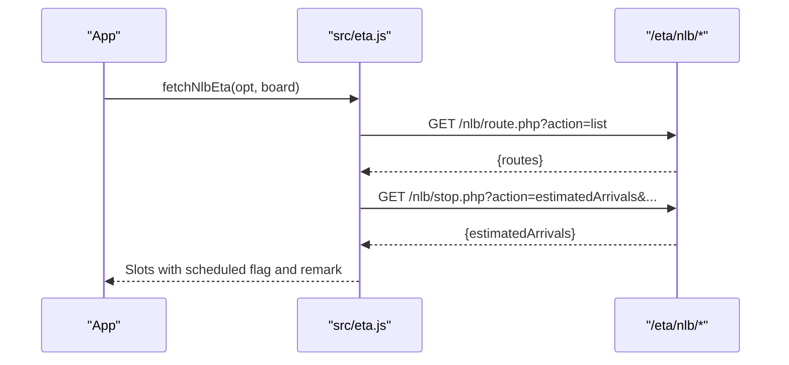

**Diagram sources**
- [eta.js:821-912](file://src/eta.js#L821-L912)
- [eta.js:921-1016](file://src/eta.js#L921-L1016)

**Section sources**
- [eta.js:821-912](file://src/eta.js#L821-L912)
- [eta.js:921-1016](file://src/eta.js#L921-L1016)

### KMB/LWB and CTB/NWFB Integration
- KMB/LWB:
  - Prefer route-specific ETA; fall back to stop-eta filtered by route
  - Parse trip_id to extract direction and service type
- CTB/NWFB:
  - Try padded and unpadded stop ids; normalize timestamps and destinations

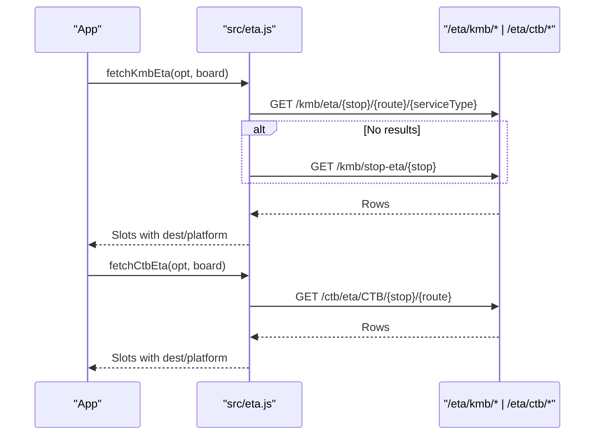

**Diagram sources**
- [eta.js:692-758](file://src/eta.js#L692-L758)
- [eta.js:761-815](file://src/eta.js#L761-L815)

**Section sources**
- [eta.js:692-758](file://src/eta.js#L692-L758)
- [eta.js:761-815](file://src/eta.js#L761-L815)

### Overnight Routes and Service Type Parsing
- Overnight route detection: Recognizes N-prefixed routes (e.g., N64, NA21) after stripping operator prefixes
- Service window checks: Differentiates day vs overnight windows to avoid inventing schedules outside service hours
- Service type parsing: Extracts direction and service type from trip_id patterns (e.g., “-I-” or “-O-”)

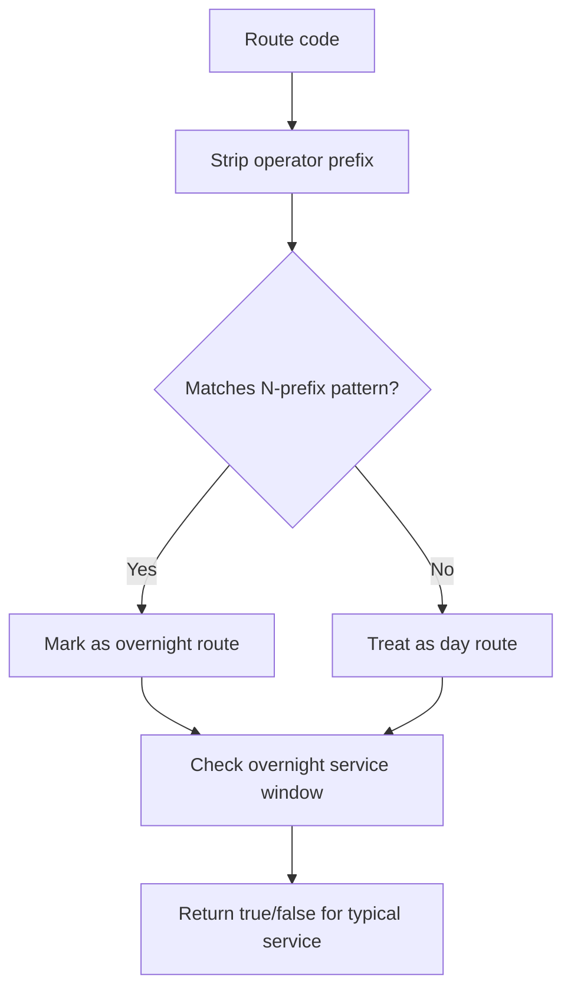

**Diagram sources**
- [eta.js:247-289](file://src/eta.js#L247-L289)
- [eta.js:136-147](file://src/eta.js#L136-L147)

**Section sources**
- [eta.js:247-289](file://src/eta.js#L247-L289)
- [eta.js:136-147](file://src/eta.js#L136-L147)

### Stop Merging Across Operators
- Heuristics merge nearby stops with similar names across operators (e.g., KMB hex vs CTB numeric at same kerb)
- Distance thresholds and token overlap improve accuracy

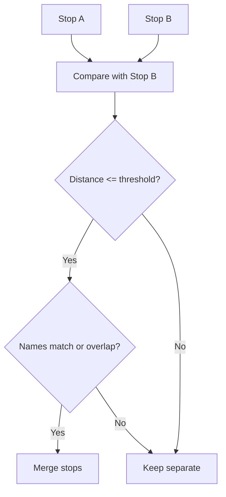

**Diagram sources**
- [stopMerge.js:145-192](file://src/stopMerge.js#L145-L192)

**Section sources**
- [stopMerge.js:145-192](file://src/stopMerge.js#L145-L192)

## Dependency Analysis
- Client modules depend on the same-origin proxy to bypass CORS and COEP restrictions
- Operator-specific modules encapsulate data loading and formatting, reducing coupling
- Centralized operator detection ensures consistent routing to the correct ETA fetcher

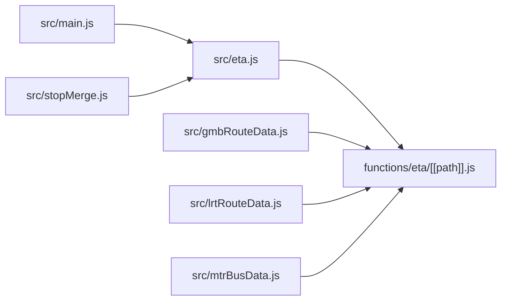

**Diagram sources**
- [eta.js:1-112](file://src/eta.js#L1-L112)
- [[path]].js:1-22](file://functions/eta/[[path]].js#L1-L22)
- [gmbRouteData.js:1-10](file://src/gmbRouteData.js#L1-L10)
- [lrtRouteData.js:1-6](file://src/lrtRouteData.js#L1-L6)
- [mtrBusData.js:1-11](file://src/mtrBusData.js#L1-L11)
- [main.js:10420-10439](file://src/main.js#L10420-L10439)
- [stopMerge.js:145-192](file://src/stopMerge.js#L145-L192)

**Section sources**
- [eta.js:1-112](file://src/eta.js#L1-L112)
- [[path]].js:1-22](file://functions/eta/[[path]].js#L1-L22)

## Performance Considerations
- In-memory caches reduce repeated network calls for route codes, directions, and CSV data
- Short TTLs for ETA responses balance freshness and bandwidth
- Parallel loading of routes and stops improves startup performance
- Local overrides for LRT ensure availability even when CSV fetch fails

[No sources needed since this section provides general guidance]

## Troubleshooting Guide
Common issues and resolutions:
- Missing stop/route parameters: Ensure stop id and route short name are present before calling operator fetchers
- Unknown operator: Verify agency name/id and route_id prefixes; check explicit kind flags
- Empty results: Try alternative stop id formats (padded/unpadded), fallback endpoints, or alternate routeIds (for NLB)
- Outside service hours: Use outsideServiceEtaResult to indicate non-service without inventing schedules
- Network errors: Retries and fallbacks are built-in; check console logs for specific error messages

**Section sources**
- [eta.js:692-758](file://src/eta.js#L692-L758)
- [eta.js:761-815](file://src/eta.js#L761-L815)
- [eta.js:921-1016](file://src/eta.js#L921-L1016)
- [eta.js:1165-1239](file://src/eta.js#L1165-L1239)
- [eta.js:1269-1338](file://src/eta.js#L1269-L1338)
- [eta.js:1345-1428](file://src/eta.js#L1345-L1428)
- [eta.js:1436-1589](file://src/eta.js#L1436-L1589)

## Conclusion
The operator integration system provides a robust, modular approach to supporting multiple Hong Kong transit operators. It combines precise operator detection, flexible stop ID normalization, resilient data loading, and comprehensive ETA fetching with fallbacks. This design ensures reliable real-time information across diverse operators while maintaining performance and clarity.

[No sources needed since this section summarizes without analyzing specific files]