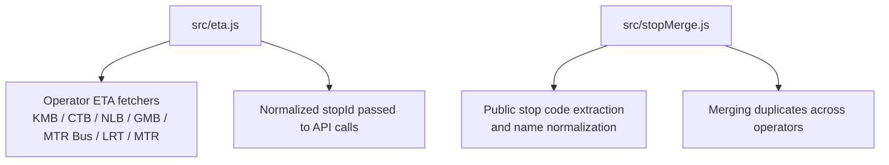
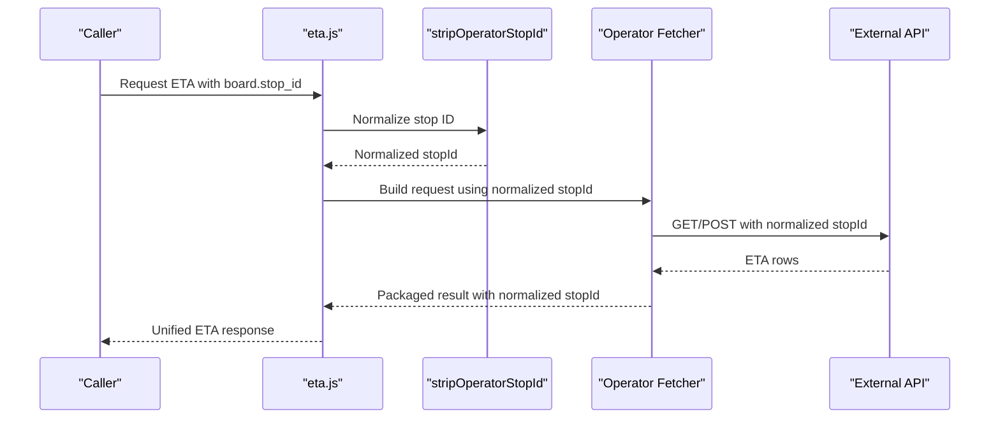
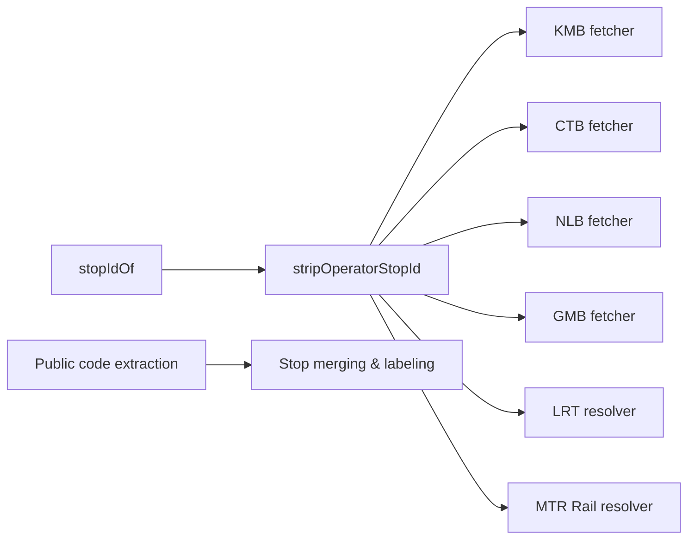

# Stop ID Normalization

<cite>
**Referenced Files in This Document**
- [eta.js](file://src/eta.js)
- [stopMerge.js](file://src/stopMerge.js)
</cite>

## Table of Contents
1. [Introduction](#introduction)
2. [Project Structure](#project-structure)
3. [Core Components](#core-components)
4. [Architecture Overview](#architecture-overview)
5. [Detailed Component Analysis](#detailed-component-analysis)
6. [Dependency Analysis](#dependency-analysis)
7. [Performance Considerations](#performance-considerations)
8. [Troubleshooting Guide](#troubleshooting-guide)
9. [Conclusion](#conclusion)

## Introduction
This document explains the stop ID normalization system that standardizes stop identifiers across different transit operators (KMB, CTB, NLB, GMB, MTR Bus/LRT Feeder, LRT, and MTR Rail). It focuses on how operator prefixes are stripped using regex patterns, how various stop ID formats are handled, and how normalized IDs are consistently used by each operator integration to fetch ETAs and build unified results.

## Project Structure
The stop ID normalization logic is centralized in the ETA module and complemented by stop merging utilities:
- Core normalization helpers live in the ETA module.
- Stop merging and public code extraction live in a dedicated utility module.

**Diagram sources**
- [eta.js:47-55](file://src/eta.js#L47-L55)
- [eta.js:692-815](file://src/eta.js#L692-L815)
- [stopMerge.js:14-27](file://src/stopMerge.js#L14-L27)
- [stopMerge.js:34-70](file://src/stopMerge.js#L34-L70)

**Section sources**
- [eta.js:47-55](file://src/eta.js#L47-L55)
- [stopMerge.js:14-27](file://src/stopMerge.js#L14-L27)

## Core Components
- stripOperatorStopId(raw): Strips recognized operator prefixes from stop IDs to produce a normalized core ID.
- stopIdOf(stop): Extracts the raw stop identifier from a stop object.
- Operator-specific ETA fetchers: Use normalized IDs when calling external APIs.
- Public stop code extraction: Identifies KMB-style public codes embedded in names or fields for merging and labeling.

Key behaviors:
- Recognized operator prefixes include KMB, CTB, NLB, GMB, LWB, NWFB, MTRBUS, LRTFEEDER, LRT, and MTR.
- For numeric-only IDs (e.g., CTB), additional padding/unpadding variants are tried to match upstream APIs.
- For LRT, numeric IDs after stripping are treated as station IDs; otherwise, name-based matching is used.
- For MTR Rail, platform codes like “MTR-PLATFORM-TUC-1” or three-letter codes are extracted.

**Section sources**
- [eta.js:47-55](file://src/eta.js#L47-L55)
- [eta.js:117-120](file://src/eta.js#L117-L120)
- [eta.js:692-815](file://src/eta.js#L692-L815)
- [eta.js:1246-1266](file://src/eta.js#L1246-L1266)
- [eta.js:1023-1036](file://src/eta.js#L1023-L1036)
- [stopMerge.js:34-70](file://src/stopMerge.js#L34-L70)

## Architecture Overview
The normalization pipeline ensures consistent stop IDs across all operator integrations:

**Diagram sources**
- [eta.js:47-55](file://src/eta.js#L47-L55)
- [eta.js:692-815](file://src/eta.js#L692-L815)

## Detailed Component Analysis

### Regex Patterns for Operator Prefix Stripping
- Pattern: Matches one of the following case-insensitive prefixes followed by a hyphen and captures the remainder:
  - KMB, CTB, NLB, GMB, LWB, NWFB, MTRBUS, LRTFEEDER, LRT, MTR
- Behavior:
  - If a prefix matches, returns only the captured suffix (the core ID).
  - Otherwise, returns the original string unchanged.

Examples of transformations:
- Input: "KMB-HEX" → Output: "HEX"
- Input: "CTB-001859" → Output: "001859"
- Input: "NLB-6" → Output: "6"
- Input: "GMB-ABC123" → Output: "ABC123"
- Input: "MTR-PLATFORM-TUC-1" → Output: "PLATFORM-TUC-1"
- Input: "MTR-TUC" → Output: "TUC"
- Input: "TC450" (no prefix) → Output: "TC450"

Edge cases:
- Empty or null input yields an empty string.
- Strings without a recognized prefix are returned verbatim.

**Section sources**
- [eta.js:47-55](file://src/eta.js#L47-L55)

### stopIdOf Helper Function
- Purpose: Safely extracts the raw stop identifier from a stop object.
- Logic: Returns the trimmed value of stop.stop_id or stop.id if present; otherwise returns an empty string.

Usage:
- Called before normalization to ensure a consistent string input for stripOperatorStopId.

**Section sources**
- [eta.js:117-120](file://src/eta.js#L117-L120)

### Operator-Specific Handling and Conversion Logic

#### KMB (including LWB)
- Normalization: Uses stripOperatorStopId to remove KMB/LWB prefixes.
- ETA fetching:
  - Tries route-specific ETA endpoint first.
  - Falls back to stop-level ETA filtered by route if needed.
  - Applies direction filtering based on trip metadata when available.
- Notes:
  - Direction and service type are derived from trip_id or route_id patterns.

**Section sources**
- [eta.js:692-758](file://src/eta.js#L692-L758)
- [eta.js:132-147](file://src/eta.js#L132-L147)

#### CTB
- Normalization: Removes CTB prefix via stripOperatorStopId.
- ETA fetching:
  - Tries multiple candidate IDs for numeric stop codes:
    - Original numeric ID
    - Zero-padded to 6 digits
    - Numeric-only representation (stripped of leading zeros)
  - Selects the first candidate that returns data.
- Notes:
  - Ensures robustness against varying numeric formatting in upstream APIs.

**Section sources**
- [eta.js:761-815](file://src/eta.js#L761-L815)

#### NLB
- Normalization: Removes NLB prefix via stripOperatorStopId.
- Route resolution:
  - Maintains a cached map of route numbers to internal route IDs.
  - Picks route IDs preferring direction-matching variants when possible.
  - Falls back to route_id from options if no mapping exists.
- ETA fetching:
  - Uses resolved route IDs to query NLB endpoints.
  - Marks results as scheduled when applicable.

**Section sources**
- [eta.js:817-1016](file://src/eta.js#L817-L1016)

#### GMB
- Normalization: Removes GMB prefix via stripOperatorStopId.
- ETA fetching:
  - Requires route_id, route_seq, and stop_seq from board/options.
  - Calls a specific endpoint and parses timestamps/diff into wait minutes.
  - Supports both real-time and scheduled services.

**Section sources**
- [eta.js:1340-1428](file://src/eta.js#L1340-L1428)

#### MTR Bus (LRT Feeder)
- Normalization: Uses stripOperatorStopId where applicable.
- ETA fetching:
  - Uses short route codes (e.g., K12, 506, K51A) for schedule queries.
  - Integrates with transport authority endpoints.

**Section sources**
- [eta.js:1430-1439](file://src/eta.js#L1430-L1439)

#### Light Rail (LRT)
- Station ID resolution:
  - If the normalized ID is purely numeric, uses it directly as the station ID.
  - Otherwise, matches by stop name against a known LRT stops list.
- ETA fetching:
  - Queries LRT schedule by station and filters by route when browsing a specific route.

**Section sources**
- [eta.js:1246-1338](file://src/eta.js#L1246-L1338)

#### MTR Rail
- Station code extraction:
  - Accepts platform-encoded IDs like "MTR-PLATFORM-TUC-1" or bare three-letter codes.
  - Also accepts explicit code hints from nearby browse data.
- Usage:
  - Used to resolve MTR station codes for ETA or fare calculations.

**Section sources**
- [eta.js:1023-1036](file://src/eta.js#L1023-L1036)

### Public Stop Code Extraction and Name Normalization
- Public codes (e.g., TC450, WT916) are extracted from:
  - Direct fields (stop_code, public_id, stopCode)
  - Raw stop IDs (bare or prefixed like KMB-TC450)
  - Embedded in stop names (e.g., trailing parenthesized codes)
- Name normalization:
  - Lowercases text
  - Removes parenthetical codes
  - Removes platform indicators and punctuation
  - Collapses whitespace

These utilities support merging duplicate stops across operators and generating user-friendly labels with public codes.

**Section sources**
- [stopMerge.js:34-70](file://src/stopMerge.js#L34-L70)
- [stopMerge.js:76-85](file://src/stopMerge.js#L76-L85)

## Dependency Analysis
- The ETA module centralizes normalization and operator routing:
  - stripOperatorStopId is the single source of truth for prefix removal.
  - stopIdOf provides safe access to raw IDs.
  - Each operator fetcher composes these helpers to build normalized requests.
- The stop merging module complements normalization by extracting public codes and normalizing names for deduplication and display.

**Diagram sources**
- [eta.js:47-55](file://src/eta.js#L47-L55)
- [eta.js:117-120](file://src/eta.js#L117-L120)
- [eta.js:692-815](file://src/eta.js#L692-L815)
- [eta.js:1246-1338](file://src/eta.js#L1246-L1338)
- [eta.js:1023-1036](file://src/eta.js#L1023-L1036)
- [stopMerge.js:34-70](file://src/stopMerge.js#L34-L70)

**Section sources**
- [eta.js:47-55](file://src/eta.js#L47-L55)
- [eta.js:117-120](file://src/eta.js#L117-L120)
- [stopMerge.js:34-70](file://src/stopMerge.js#L34-L70)

## Performance Considerations
- Minimal overhead: stripOperatorStopId performs a single regex match per call.
- CTB numeric handling tries up to three candidates; this is bounded and fast.
- NLB route variant mapping is cached to avoid repeated network calls.
- LRT name matching iterates a local list; keep the list size reasonable.

[No sources needed since this section provides general guidance]

## Troubleshooting Guide
Common issues and resolutions:
- Missing stop/route: Ensure board contains a valid stop_id and opt includes a route identifier.
- CTB numeric mismatch: If a numeric stop ID fails, try padded or unpadded variants automatically handled by the CTB fetcher.
- LRT unknown station: Provide a numeric station ID or ensure the stop name matches known LRT entries.
- MTR Rail code: Use platform-encoded IDs (e.g., MTR-PLATFORM-TUC-1) or three-letter codes; also check explicit code hints.
- GMB missing fields: Ensure route_id, route_seq, and stop_seq are provided in board or options.

**Section sources**
- [eta.js:692-758](file://src/eta.js#L692-L758)
- [eta.js:761-815](file://src/eta.js#L761-L815)
- [eta.js:1246-1338](file://src/eta.js#L1246-L1338)
- [eta.js:1023-1036](file://src/eta.js#L1023-L1036)
- [eta.js:1340-1428](file://src/eta.js#L1340-L1428)

## Conclusion
The stop ID normalization system standardizes identifiers across operators by stripping recognized prefixes and applying format-specific conversions. The stripOperatorStopId function and stopIdOf helper form the foundation, while operator-specific modules handle unique conventions and API requirements. Public stop code extraction and name normalization further enable consistent merging and labeling across diverse data sources.

[No sources needed since this section summarizes without analyzing specific files]