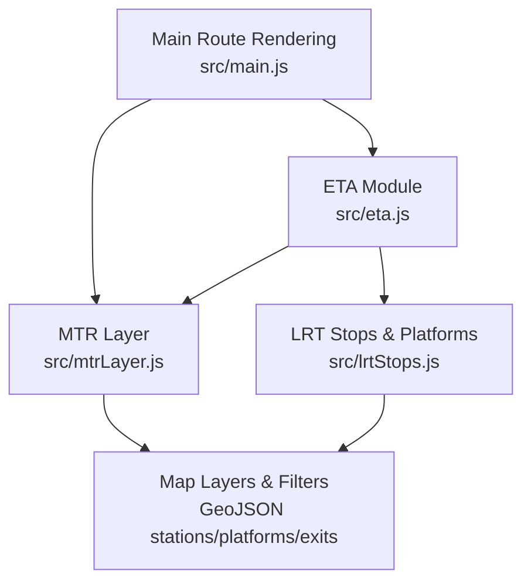
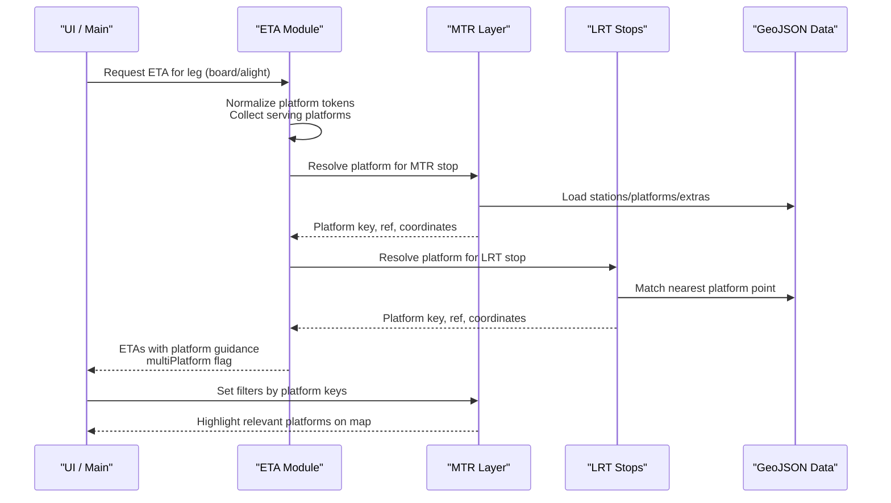
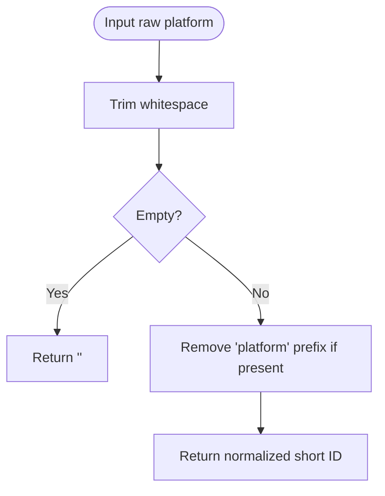
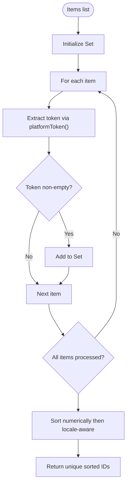
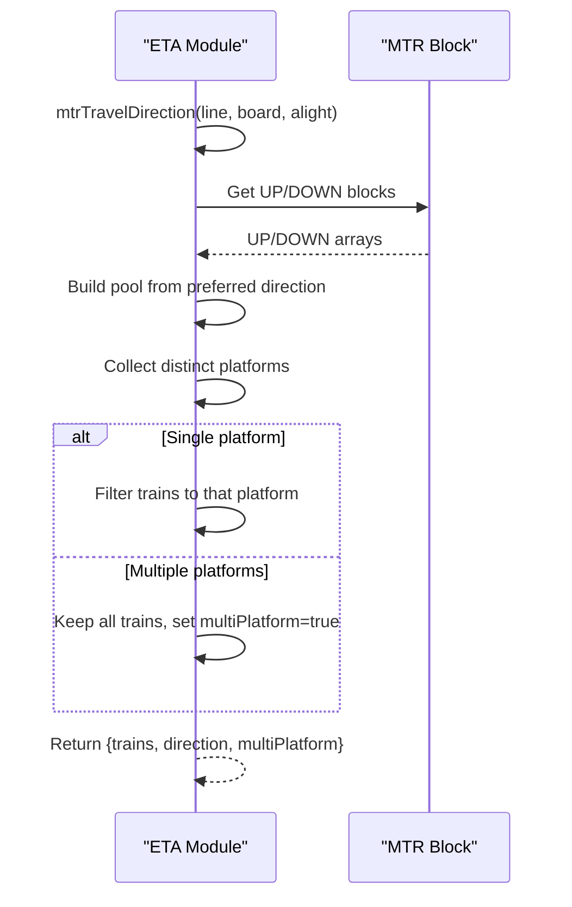
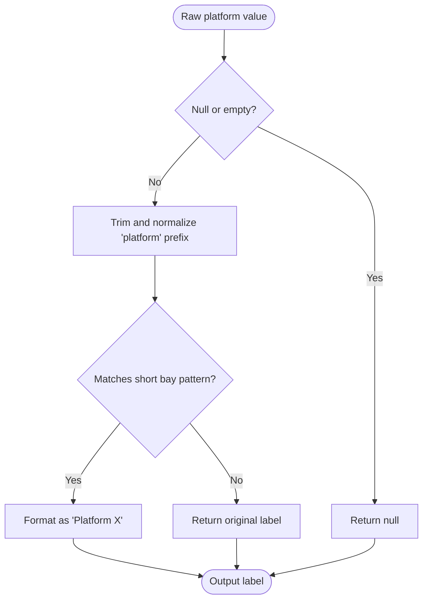
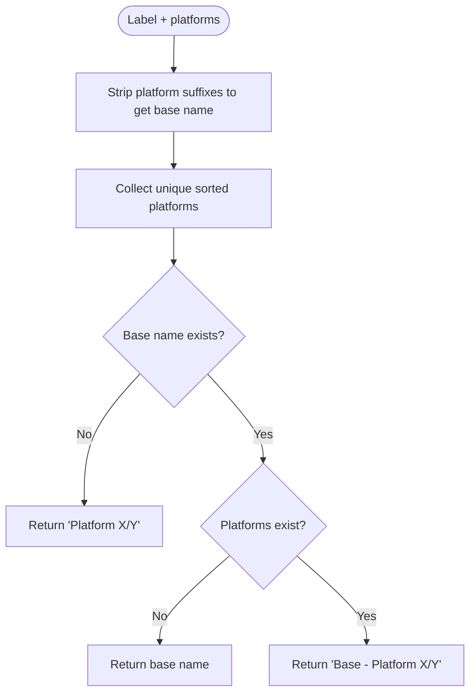
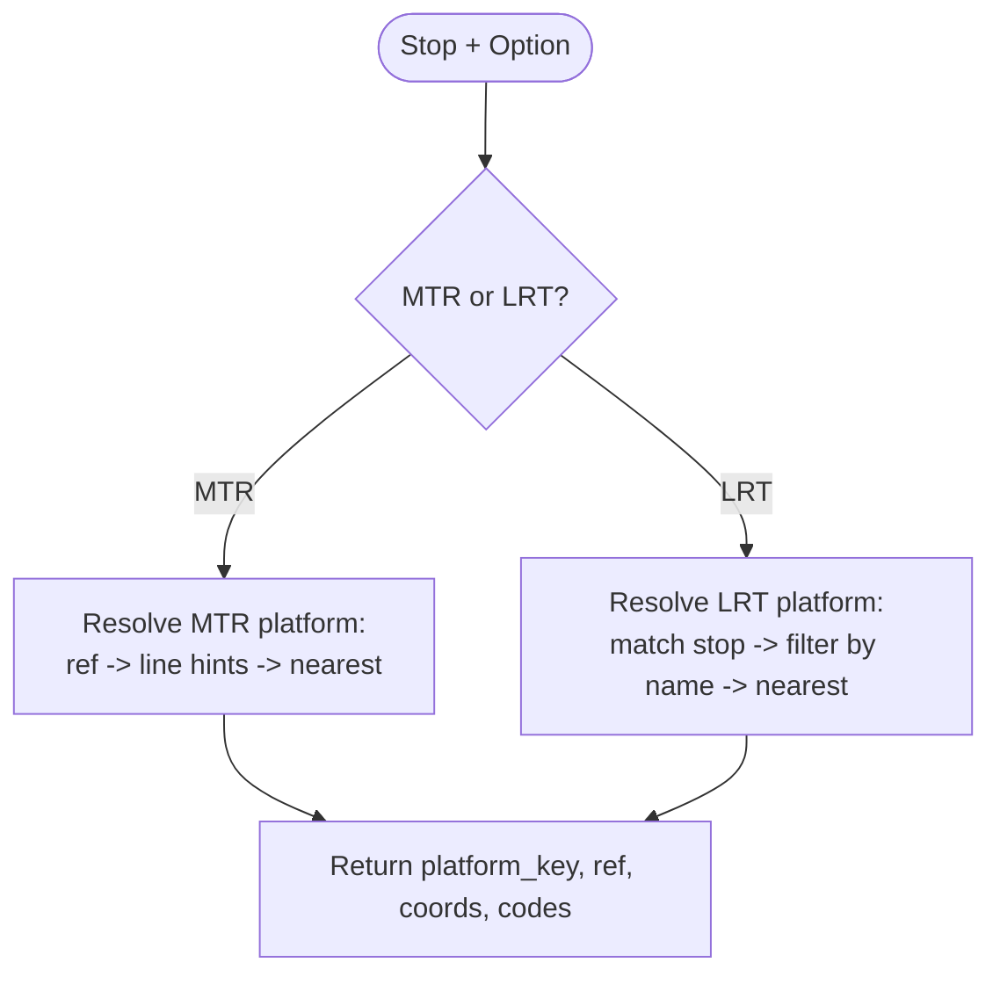
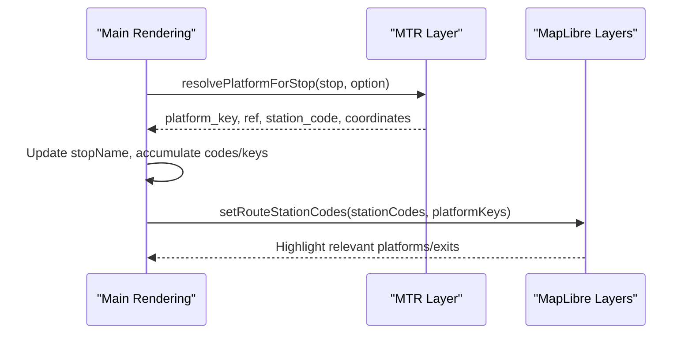
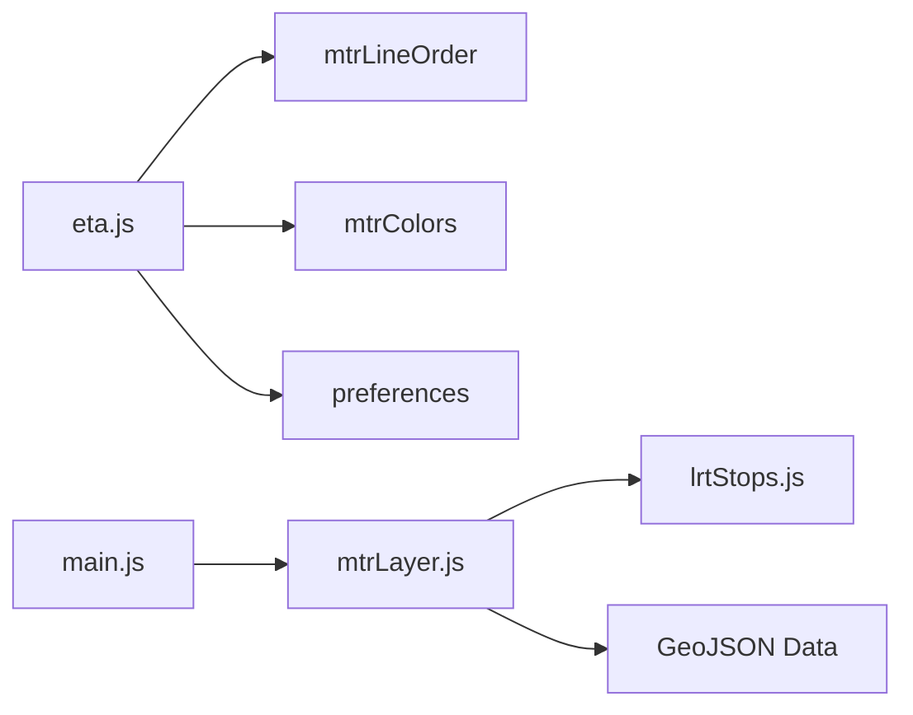

# Platform Information System

<cite>
**Referenced Files in This Document**
- [eta.js](file://src/eta.js)
- [mtrLayer.js](file://src/mtrLayer.js)
- [lrtStops.js](file://src/lrtStops.js)
- [main.js](file://src/main.js)
</cite>

## Table of Contents
1. [Introduction](#introduction)
2. [Project Structure](#project-structure)
3. [Core Components](#core-components)
4. [Architecture Overview](#architecture-overview)
5. [Detailed Component Analysis](#detailed-component-analysis)
6. [Dependency Analysis](#dependency-analysis)
7. [Performance Considerations](#performance-considerations)
8. [Troubleshooting Guide](#troubleshooting-guide)
9. [Conclusion](#conclusion)

## Introduction
This document explains the platform information system that detects and presents optimal boarding locations for trains and buses across multiple platforms at a station. It covers:
- How platforms are identified from stop objects, API responses, and station names
- How platform tokens are normalized to short IDs
- How multi-platform detection determines when several platforms serve the same direction
- How labels are formatted and how station names are enhanced with platform guidance
- The algorithm that collects serving platforms to provide optimal boarding location recommendations

## Project Structure
The platform logic is implemented primarily in the ETA module and the MTR/LRT layer modules, with integration points in the main route rendering pipeline.

**Diagram sources**
- [eta.js:570-661](file://src/eta.js#L570-L661)
- [mtrLayer.js:221-330](file://src/mtrLayer.js#L221-L330)
- [lrtStops.js:201-253](file://src/lrtStops.js#L201-L253)
- [main.js:3632-3657](file://src/main.js#L3632-L3657)

**Section sources**
- [eta.js:570-661](file://src/eta.js#L570-L661)
- [mtrLayer.js:221-330](file://src/mtrLayer.js#L221-L330)
- [lrtStops.js:201-253](file://src/lrtStops.js#L201-L253)
- [main.js:3632-3657](file://src/main.js#L3632-L3657)

## Core Components
- Platform token normalization: converts various raw formats into short IDs like "1", "2", "A"
- Serving platforms collection: aggregates unique, sorted platform IDs from slots or lists
- Station name enhancement: appends platform guidance to station labels
- Multi-platform detection: identifies when multiple platforms serve the same travel direction
- Platform label formatting: standardizes display labels for user-facing text
- Platform resolution: maps stops to precise platform coordinates and metadata for MTR and LRT

**Section sources**
- [eta.js:570-661](file://src/eta.js#L570-L661)
- [eta.js:1090-1228](file://src/eta.js#L1090-L1228)
- [mtrLayer.js:221-330](file://src/mtrLayer.js#L221-L330)
- [lrtStops.js:201-253](file://src/lrtStops.js#L201-L253)
- [main.js:3632-3657](file://src/main.js#L3632-L3657)

## Architecture Overview
The system integrates data from multiple sources (stop objects, APIs, GeoJSON) to determine the best platform(s) for boarding.

**Diagram sources**
- [eta.js:570-661](file://src/eta.js#L570-L661)
- [eta.js:1090-1228](file://src/eta.js#L1090-L1228)
- [mtrLayer.js:221-330](file://src/mtrLayer.js#L221-L330)
- [lrtStops.js:201-253](file://src/lrtStops.js#L201-L253)
- [main.js:3632-3657](file://src/main.js#L3632-L3657)

## Detailed Component Analysis

### Platform Token Normalization
- Purpose: Convert diverse platform inputs into consistent short IDs used throughout the system
- Behavior: Trims whitespace, removes leading “platform” prefixes, returns empty string for null/empty inputs
- Usage: Feeds into collecting and sorting unique platform IDs

**Diagram sources**
- [eta.js:570-581](file://src/eta.js#L570-L581)

**Section sources**
- [eta.js:570-581](file://src/eta.js#L570-L581)

### Serving Platforms Collection Algorithm
- Purpose: Aggregate all platforms that serve the trip’s direction and deduplicate them
- Inputs: Array of slot objects or strings containing platform fields
- Output: Sorted array of unique short platform IDs (numeric-first, then locale-aware numeric sort)
- Role: Drives multi-platform detection and label enhancement

**Diagram sources**
- [eta.js:583-604](file://src/eta.js#L583-L604)

**Section sources**
- [eta.js:583-604](file://src/eta.js#L583-L604)

### Multi-Platform Detection Logic
- Purpose: Determine whether one or more platforms serve the selected travel direction
- MTR-specific flow:
  - Compute preferred direction (UP/DOWN) based on line order and board/alight stations
  - Select train pool from UP/DOWN blocks; fallback to destination matching
  - Collect distinct platform IDs from the pool
  - If only one platform serves the direction, filter trains to that platform
  - If multiple platforms serve the direction, keep all and mark multiPlatform true
- Result: Provides both filtered trains and a boolean indicating multi-platform service

**Diagram sources**
- [eta.js:1073-1162](file://src/eta.js#L1073-L1162)

**Section sources**
- [eta.js:1073-1162](file://src/eta.js#L1073-L1162)

### Platform Label Formatting
- Purpose: Produce user-friendly labels for platforms
- Rules:
  - Normalize “platform X” to “Platform X”
  - Short alphanumeric bays become “Platform X”
  - Otherwise return original label
- Used in:
  - ETA slot remarks
  - Stop object parsing for explicit platform fields or embedded platform hints in names

**Diagram sources**
- [eta.js:633-646](file://src/eta.js#L633-L646)

**Section sources**
- [eta.js:633-646](file://src/eta.js#L633-L646)

### Station Name Enhancement with Platform Information
- Purpose: Append optimal platform guidance to station names
- Behavior:
  - Strip existing platform suffixes to get base station name
  - Collect serving platforms from slots or provided list
  - If no base name, output “Platform X/Y”
  - Otherwise output “Station - Platform X/Y”
- Use cases: Display in ETA cards, route summaries, and map popups

**Diagram sources**
- [eta.js:606-631](file://src/eta.js#L606-L631)

**Section sources**
- [eta.js:606-631](file://src/eta.js#L606-L631)

### Platform Resolution for MTR and LRT
- MTR:
  - Prefer explicit platform reference from stop or parsed name
  - Use route/line hints to match platform name_en
  - Fall back to nearest platform by coordinates
  - Return platform_key, ref, station_code, station_name, and coordinates
- LRT:
  - Match stop name to official LRT stops
  - Filter platform features by matched stop name
  - Choose nearest platform point within proximity threshold
  - Return platform_key, ref, station_code, station_name, and coordinates

**Diagram sources**
- [mtrLayer.js:221-330](file://src/mtrLayer.js#L221-L330)
- [lrtStops.js:201-253](file://src/lrtStops.js#L201-L253)

**Section sources**
- [mtrLayer.js:221-330](file://src/mtrLayer.js#L221-L330)
- [lrtStops.js:201-253](file://src/lrtStops.js#L201-L253)

### Integration with Route Rendering and Map Filtering
- During route rendering:
  - For rail legs, resolve platform for each stop
  - Update stopName to include platform reference when available
  - Accumulate stationCodes and platformKeys for filtering
- Map layers:
  - Apply filters to show only relevant platforms and exits based on platform_keys
  - Ensure visual emphasis aligns with optimal boarding locations

**Diagram sources**
- [main.js:3632-3657](file://src/main.js#L3632-L3657)
- [mtrLayer.js:172-219](file://src/mtrLayer.js#L172-L219)

**Section sources**
- [main.js:3632-3657](file://src/main.js#L3632-L3657)
- [mtrLayer.js:172-219](file://src/mtrLayer.js#L172-L219)

## Dependency Analysis
- eta.js depends on:
  - mtrLineOrder for direction calculation
  - mtrColors for light rail detection
  - preferences for time formatting and service windows
- mtrLayer.js depends on:
  - GeoJSON datasets for stations, exits, platforms, and LRT platforms
  - lrtShapes overrides for specific platform corrections
- lrtStops.js depends on:
  - overrides for LRT stop coordinate/name/code updates
- main.js orchestrates:
  - Platform resolution per leg
  - Map filtering by accumulated platform keys and station codes

**Diagram sources**
- [eta.js:1-15](file://src/eta.js#L1-L15)
- [mtrLayer.js:1-22](file://src/mtrLayer.js#L1-L22)
- [lrtStops.js:1-10](file://src/lrtStops.js#L1-L10)
- [main.js:3600-3719](file://src/main.js#L3600-L3719)

**Section sources**
- [eta.js:1-15](file://src/eta.js#L1-L15)
- [mtrLayer.js:1-22](file://src/mtrLayer.js#L1-L22)
- [lrtStops.js:1-10](file://src/lrtStops.js#L1-L10)
- [main.js:3600-3719](file://src/main.js#L3600-L3719)

## Performance Considerations
- Caching: ETA fetches are cached with TTL to reduce network calls
- Sorting: Platform IDs are sorted using numeric-first ordering for readability
- Proximity thresholds: LRT platform matching uses distance checks to avoid incorrect matches
- Filtering: Map layers use efficient filters to highlight only relevant platforms/exits

[No sources needed since this section provides general guidance]

## Troubleshooting Guide
- Missing platform data:
  - If platform GeoJSON is unavailable, the system falls back to LRT platform points or GTFS pins
- Unmatched station names:
  - Directional markers (East/West/South/North) prevent false matches between paired stations
- Incorrect platform selection:
  - Verify stop platform field or name contains correct platform hint
  - Check route/line hints used for platform name matching
- Multi-platform ambiguity:
  - When multiple platforms serve the direction, the system shows all and marks multiPlatform true

**Section sources**
- [mtrLayer.js:240-270](file://src/mtrLayer.js#L240-L270)
- [mtrLayer.js:486-582](file://src/mtrLayer.js#L486-L582)
- [eta.js:1144-1162](file://src/eta.js#L1144-L1162)

## Conclusion
The platform information system robustly identifies platforms from varied data sources, normalizes tokens, detects multi-platform scenarios, and enhances labels to guide users to optimal boarding locations. It integrates seamlessly with route rendering and map visualization to ensure accurate and helpful platform guidance across MTR and LRT networks.

[No sources needed since this section summarizes without analyzing specific files]